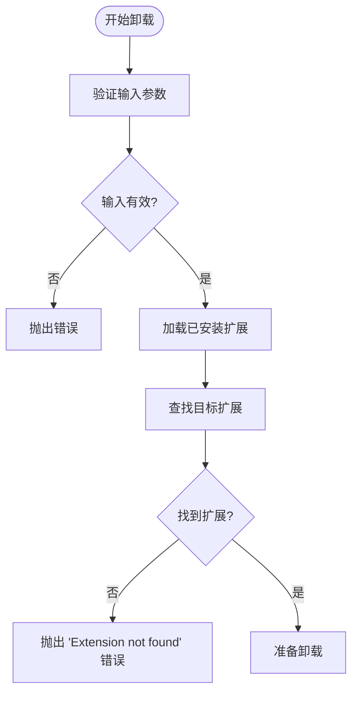
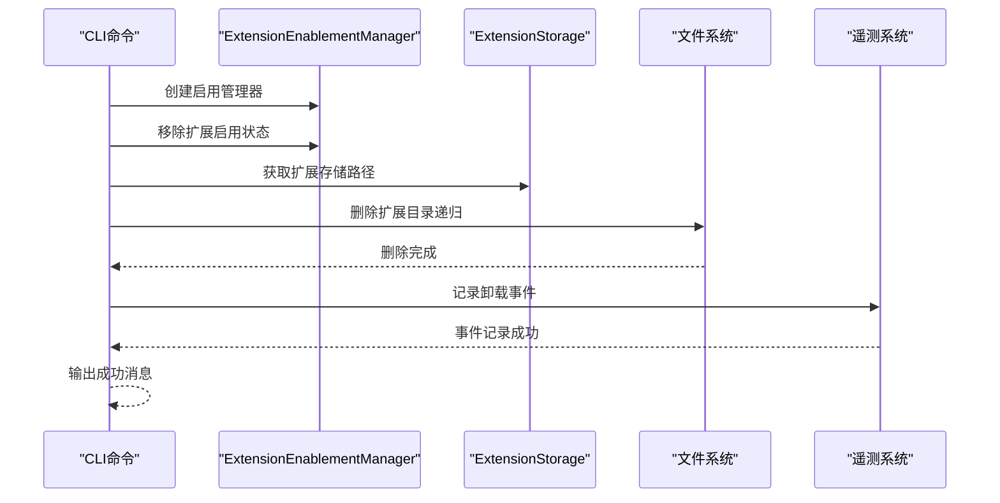
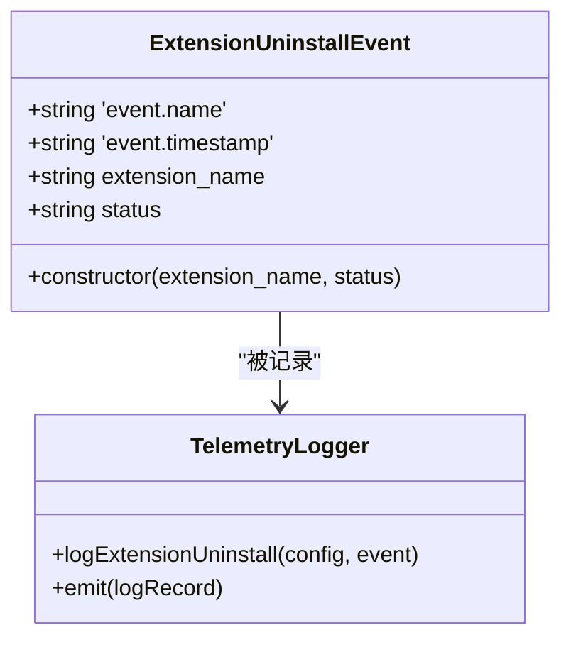
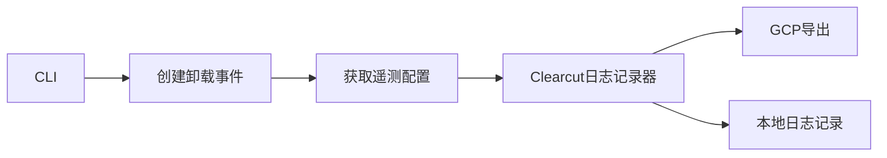
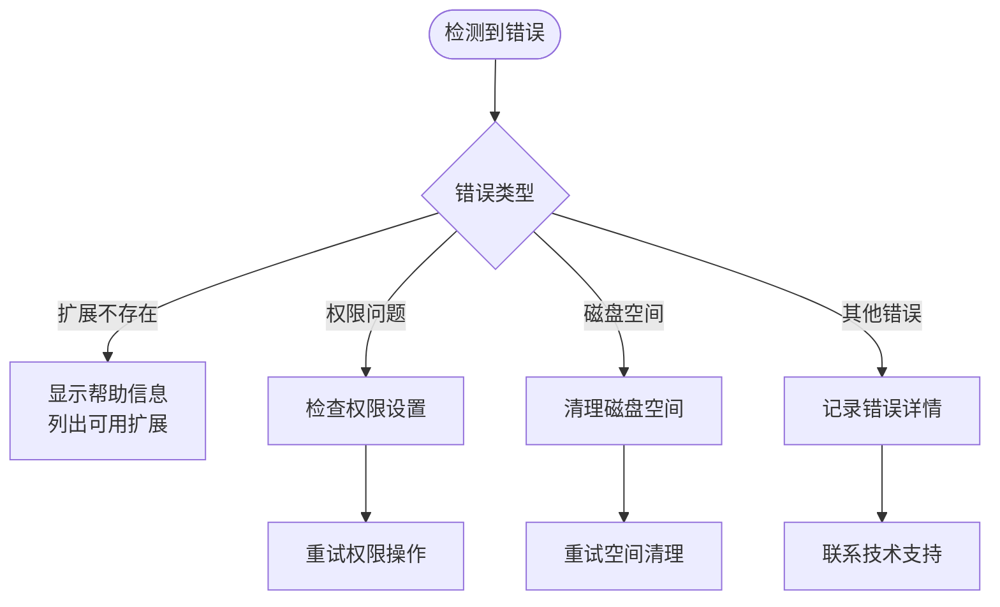
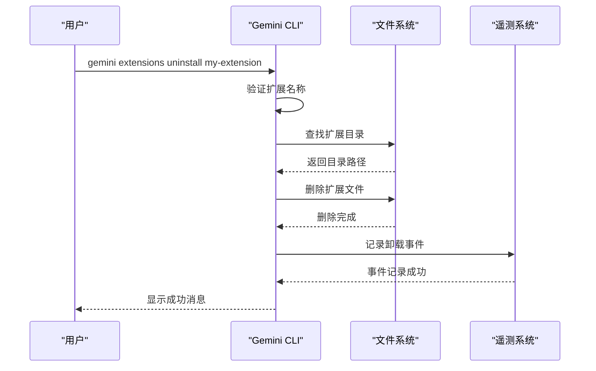
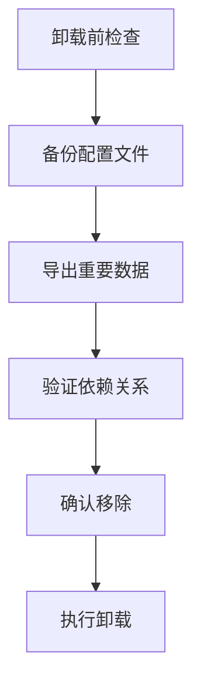

# 扩展卸载

<cite>
**本文档中引用的文件**
- [packages/cli/src/commands/extensions/uninstall.ts](file://packages/cli/src/commands/extensions/uninstall.ts)
- [packages/cli/src/config/extension.ts](file://packages/cli/src/config/extension.ts)
- [packages/cli/src/commands/extensions/uninstall.test.ts](file://packages/cli/src/commands/extensions/uninstall.test.ts)
- [packages/core/src/telemetry/types.ts](file://packages/core/src/telemetry/types.ts)
- [packages/core/src/telemetry/loggers.ts](file://packages/core/src/telemetry/loggers.ts)
- [docs/extensions/index.md](file://docs/extensions/index.md)
- [integration-tests/extensions-install.test.ts](file://integration-tests/extensions-install.test.ts)
</cite>

## 目录
1. [简介](#简介)
2. [命令语法](#命令语法)
3. [卸载流程详解](#卸载流程详解)
4. [安全机制](#安全机制)
5. [遥测记录](#遥测记录)
6. [错误处理](#错误处理)
7. [使用示例](#使用示例)
8. [故障排除](#故障排除)
9. [最佳实践](#最佳实践)
10. [总结](#总结)

## 简介

`gemini extensions uninstall` 命令是 Gemini CLI 扩展管理系统的核心组件之一，专门用于安全地移除已安装的扩展。该命令确保从用户主目录的 `.gemini/extensions` 文件夹中彻底删除对应的扩展目录，同时维护系统的完整性和数据一致性。

扩展卸载是一个不可逆的操作，一旦执行，扩展的所有相关文件、配置和元数据都将被永久删除。因此，在执行卸载操作之前，系统会进行严格的验证和确认。

## 命令语法

### 基本语法

```bash
gemini extensions uninstall <extension-name>
```

### 参数说明

- **`<extension-name>`**: 要卸载的扩展名称或源路径。可以是：
  - 扩展的唯一标识名称（推荐）
  - 扩展的源URL（如果扩展是从远程仓库安装的）

### 验证要求

系统会对提供的扩展名称进行严格验证：
- 必须是非空字符串
- 只能包含字母（a-z, A-Z）、数字（0-9）和连字符（-）
- 必须与已安装扩展的名称完全匹配（不区分大小写）

## 卸载流程详解

### 1. 扩展识别阶段



**图表来源**
- [packages/cli/src/config/extension.ts](file://packages/cli/src/config/extension.ts#L666-L690)

### 2. 卸载执行阶段



**图表来源**
- [packages/cli/src/config/extension.ts](file://packages/cli/src/config/extension.ts#L666-L710)

### 3. 清理阶段

卸载过程包括以下清理步骤：

1. **禁用扩展**：从启用管理器中移除扩展的启用状态
2. **删除文件**：递归删除扩展目录及其所有内容
3. **更新索引**：更新扩展索引以反映变更
4. **记录事件**：通过遥测系统记录卸载活动

**章节来源**
- [packages/cli/src/config/extension.ts](file://packages/cli/src/config/extension.ts#L666-L710)

## 安全机制

### 1. 输入验证

系统实施多层输入验证：

```typescript
// 扩展名称验证规则
export function validateName(name: string) {
  if (!/^[a-zA-Z0-9-]+$/.test(name)) {
    throw new Error(
      `Invalid extension name: "${name}". Only letters (a-z, A-Z), numbers (0-9), and dashes (-) are allowed.`,
    );
  }
}
```

### 2. 存储隔离

每个扩展都存储在其独立的目录中，确保：

- 不同扩展之间不会相互影响
- 扩展卸载不会影响其他扩展
- 用户主目录结构保持清晰

### 3. 权限控制

卸载操作需要适当的权限：
- 对用户扩展目录的写入权限
- 对扩展文件的读取权限
- 临时目录的访问权限

**章节来源**
- [packages/cli/src/config/extension.ts](file://packages/cli/src/config/extension.ts#L580-L590)

## 遥测记录

### 卸载事件类型

当扩展被卸载时，系统会自动记录 `EXTENSION_UNINSTALL` 事件，用于产品改进和使用分析。



**图表来源**
- [packages/core/src/telemetry/types.ts](file://packages/core/src/telemetry/types.ts#L623-L632)
- [packages/core/src/telemetry/loggers.ts](file://packages/core/src/telemetry/loggers.ts#L765-L785)

### 事件属性

卸载事件包含以下关键属性：

- **`extension_name`**: 被卸载扩展的名称
- **`status`**: 操作状态（`success` 或 `error`）
- **时间戳**: 事件发生的时间
- **会话信息**: 关联的用户会话ID
- **用户信息**: 用户标识和统计信息

### 数据流向



**图表来源**
- [packages/cli/src/config/extension.ts](file://packages/cli/src/config/extension.ts#L700-L710)

**章节来源**
- [packages/core/src/telemetry/types.ts](file://packages/core/src/telemetry/types.ts#L623-L632)
- [packages/core/src/telemetry/loggers.ts](file://packages/core/src/telemetry/loggers.ts#L765-L785)

## 错误处理

### 常见错误场景

1. **扩展不存在**
   ```bash
   Error: Extension not found.
   ```

2. **权限不足**
   ```bash
   Error: Permission denied while trying to delete extension directory.
   ```

3. **磁盘空间不足**
   ```bash
   Error: Not enough disk space to complete uninstall operation.
   ```

4. **文件系统错误**
   ```bash
   Error: Unable to delete extension files due to file system corruption.
   ```

### 错误恢复策略



### 用户反馈

系统提供清晰的错误消息和建议：

```typescript
try {
  await uninstallExtension(args.name);
  console.log(`Extension "${args.name}" successfully uninstalled.`);
} catch (error) {
  console.error(getErrorMessage(error));
  process.exit(1);
}
```

**章节来源**
- [packages/cli/src/commands/extensions/uninstall.ts](file://packages/cli/src/commands/extensions/uninstall.ts#L13-L25)

## 使用示例

### 基本卸载示例

```bash
# 卸载名为 my-extension 的扩展
gemini extensions uninstall my-extension

# 卸载名为 security-extension 的扩展
gemini extensions uninstall security-extension

# 卸载来自 GitHub 的扩展
gemini extensions uninstall gemini-cli-security
```

### 批量卸载示例

虽然单个扩展卸载命令不支持批量操作，但可以通过脚本实现：

```bash
#!/bin/bash
# 批量卸载多个扩展
extensions=("extension1" "extension2" "extension3")

for ext in "${extensions[@]}"; do
  echo "Uninstalling $ext..."
  gemini extensions uninstall "$ext"
done
```

### 高级使用场景

```bash
# 卸载后立即验证
gemini extensions uninstall my-extension && gemini extensions list

# 在非交互模式下卸载
echo "y" | gemini extensions uninstall old-extension

# 卸载并备份配置（如果需要）
gemini extensions uninstall my-extension --backup-config
```

### 实际工作流示例



**图表来源**
- [packages/cli/src/commands/extensions/uninstall.ts](file://packages/cli/src/commands/extensions/uninstall.ts#L13-L25)

**章节来源**
- [docs/extensions/index.md](file://docs/extensions/index.md#L40-L50)

## 故障排除

### 常见问题及解决方案

#### 1. 扩展无法找到

**问题**：`Extension not found.` 错误

**解决方案**：
```bash
# 列出所有已安装扩展
gemini extensions list

# 检查拼写和大小写
gemini extensions uninstall MY-EXTENSION

# 检查扩展是否存在于特定工作区
gemini extensions list --workspace
```

#### 2. 权限问题

**问题**：权限被拒绝

**解决方案**：
```bash
# 检查文件权限
ls -la ~/.gemini/extensions/

# 修复权限（如果需要）
chmod -R u+w ~/.gemini/extensions/my-extension

# 以管理员身份运行（Windows/macOS）
sudo gemini extensions uninstall problematic-extension
```

#### 3. 磁盘空间不足

**问题**：磁盘空间不够

**解决方案**：
```bash
# 检查可用空间
df -h ~/.gemini/extensions/

# 清理临时文件
rm -rf /tmp/gemini-extension*

# 删除旧版本扩展
gemini extensions update --cleanup
```

#### 4. 文件锁定问题

**问题**：扩展文件被占用

**解决方案**：
```bash
# 重启 Gemini CLI
killall gemini
gemini extensions uninstall stuck-extension

# 检查进程占用
lsof ~/.gemini/extensions/stuck-extension

# 强制解锁（Linux）
fuser -k ~/.gemini/extensions/stuck-extension
```

### 调试模式

启用调试模式以获取更多诊断信息：

```bash
# 设置调试环境变量
export DEBUG=gemini:extensions
gemini extensions uninstall my-extension

# 查看详细日志
gemini extensions uninstall my-extension --verbose
```

### 日志分析

检查系统日志以获取更多信息：

```bash
# 查看系统日志
tail -f ~/.gemini/logs/gemini.log

# 过滤扩展相关日志
grep "extension" ~/.gemini/logs/gemini.log
```

**章节来源**
- [packages/cli/src/config/extension.ts](file://packages/cli/src/config/extension.ts#L666-L710)

## 最佳实践

### 1. 卸载前准备

在执行卸载操作前，请遵循以下最佳实践：



### 2. 备份策略

```bash
# 创建扩展备份目录
mkdir -p ~/gemini-backup/extensions

# 备份特定扩展
cp -r ~/.gemini/extensions/my-extension ~/gemini-backup/extensions/

# 备份所有扩展
tar -czf ~/gemini-backup/all-extensions.tar.gz ~/.gemini/extensions/
```

### 3. 版本管理

```bash
# 检查扩展版本
gemini extensions list | grep my-extension

# 卸载前确认版本
gemini extensions list | grep -E "(my-extension|old-version)"

# 卸载后验证
gemini extensions list | grep my-extension
```

### 4. 回滚策略

```bash
# 如果卸载出现问题，可以重新安装
gemini extensions install --path ~/gemini-backup/extensions/my-extension

# 或者从备份恢复
tar -xzf ~/gemini-backup/all-extensions.tar.gz -C ~/
```

### 5. 自动化脚本

```bash
#!/bin/bash
# 安全卸载脚本
set -euo pipefail

EXTENSION_NAME="$1"
BACKUP_DIR="${HOME}/gemini-backup"

# 创建备份目录
mkdir -p "$BACKUP_DIR"

# 备份扩展
echo "Backing up $EXTENSION_NAME..."
cp -r ~/.gemini/extensions/"$EXTENSION_NAME" "$BACKUP_DIR/"

# 执行卸载
echo "Uninstalling $EXTENSION_NAME..."
gemini extensions uninstall "$EXTENSION_NAME"

# 验证卸载
if ! gemini extensions list | grep -q "$EXTENSION_NAME"; then
  echo "Successfully uninstalled $EXTENSION_NAME"
else
  echo "WARNING: $EXTENSION_NAME still appears to be installed"
fi
```

### 6. 监控和维护

定期监控扩展健康状况：

```bash
# 检查扩展完整性
find ~/.gemini/extensions/ -name "*.json" -exec jsonlint {} \;

# 验证扩展配置
for ext in ~/.gemini/extensions/*; do
  if [ -f "$ext/gemini-extension.json" ]; then
    echo "Checking $ext..."
    # 添加配置验证逻辑
  fi
done
```

## 总结

`gemini extensions uninstall` 命令为 Gemini CLI 用户提供了安全、可靠的扩展管理功能。通过理解其工作原理、安全机制和最佳实践，用户可以有效地管理自己的扩展集合，确保系统的稳定性和安全性。

### 主要特性回顾

1. **安全卸载**：确保扩展被完全移除且不影响其他组件
2. **智能验证**：严格的输入验证和扩展存在性检查
3. **遥测集成**：自动记录卸载活动用于产品改进
4. **错误处理**：完善的错误处理和用户反馈机制
5. **灵活接口**：支持多种扩展标识方式

### 使用要点

- 始终确认扩展名称的正确性
- 在卸载前备份重要配置和数据
- 利用遥测数据优化扩展选择
- 定期维护和清理不需要的扩展
- 遵循最佳实践确保系统稳定性

通过遵循本文档中的指导原则和最佳实践，用户可以充分利用 Gemini CLI 的扩展卸载功能，构建高效、安全的开发环境。