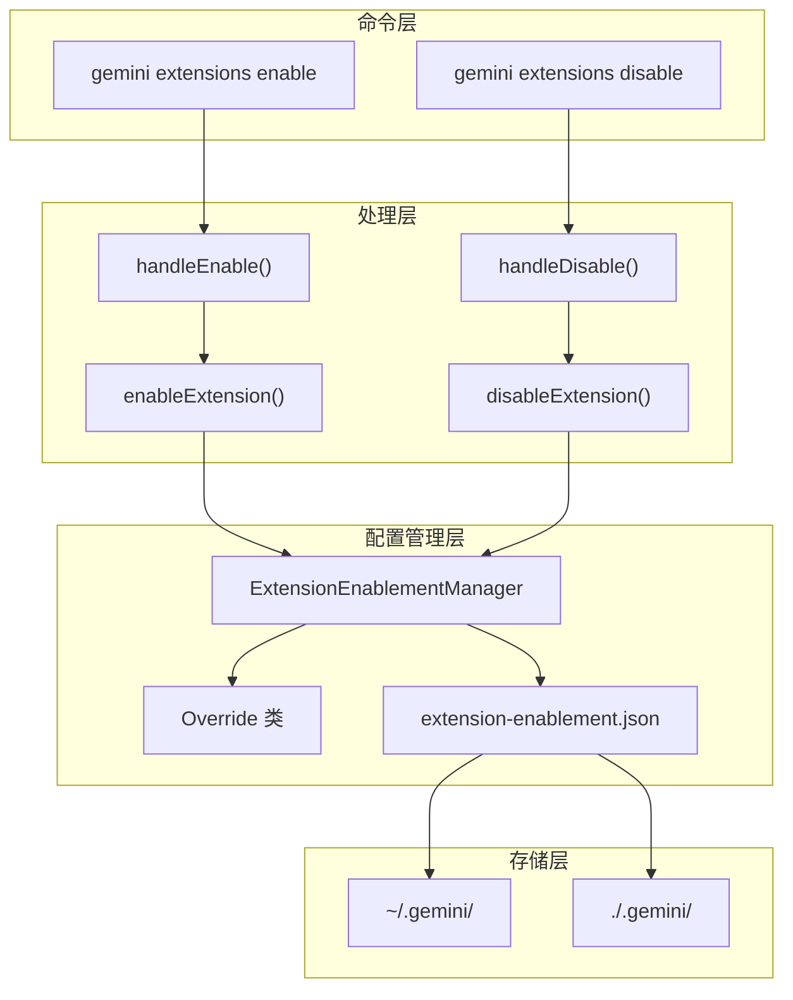
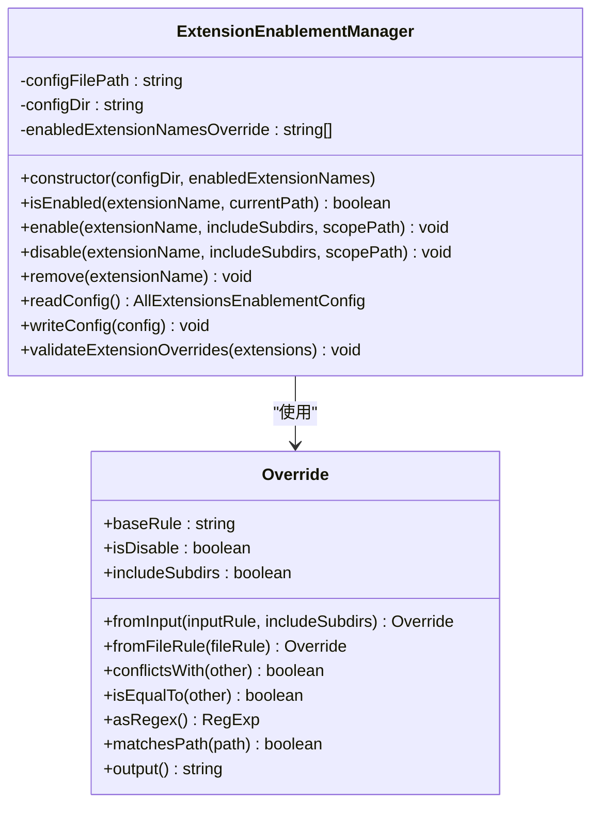
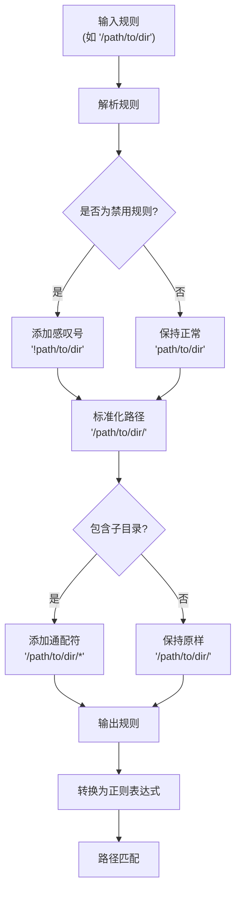
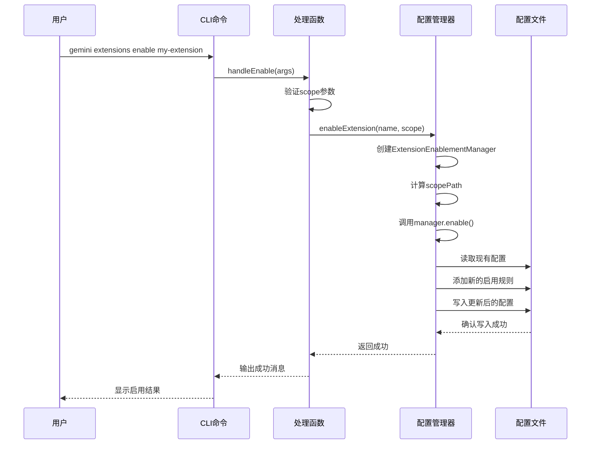
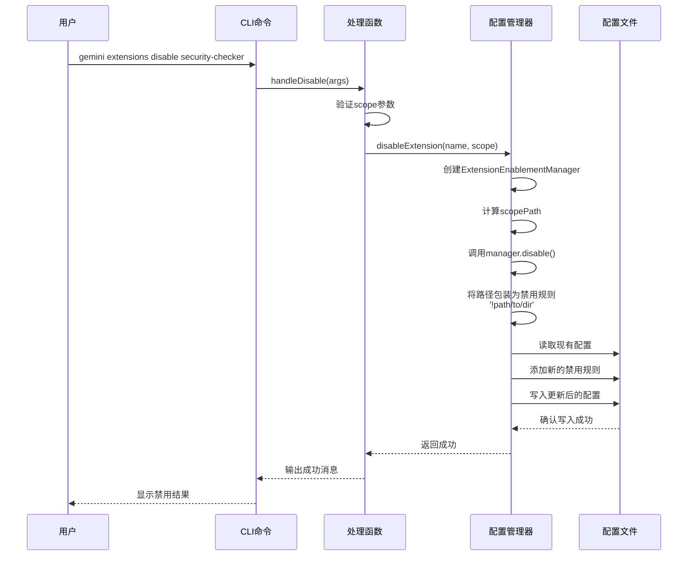
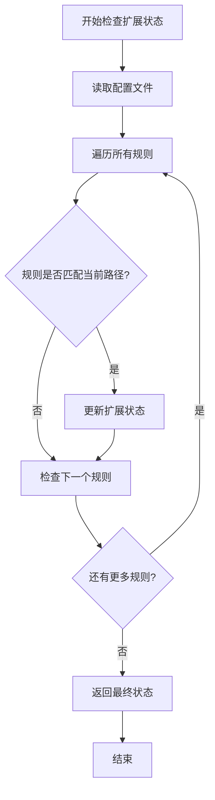
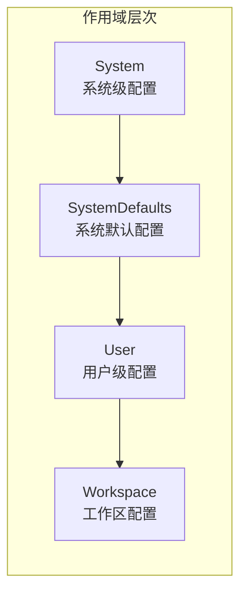
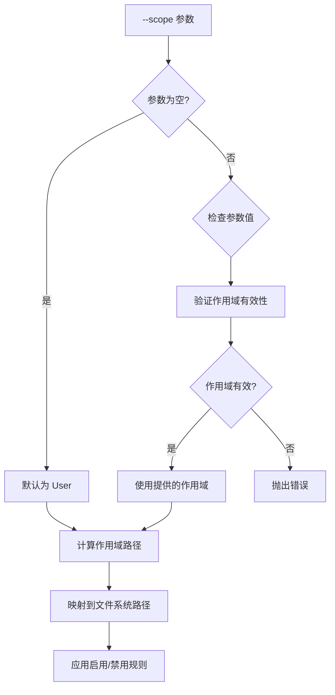

# 扩展启用与禁用

<cite>
**本文档中引用的文件**
- [packages/cli/src/commands/extensions/enable.ts](file://packages/cli/src/commands/extensions/enable.ts)
- [packages/cli/src/commands/extensions/disable.ts](file://packages/cli/src/commands/extensions/disable.ts)
- [packages/cli/src/config/extensions/extensionEnablement.ts](file://packages/cli/src/config/extensions/extensionEnablement.ts)
- [packages/cli/src/config/extension.ts](file://packages/cli/src/config/extension.ts)
- [packages/cli/src/config/settings.ts](file://packages/cli/src/config/settings.ts)
- [packages/cli/src/config/extensions/extensionEnablement.test.ts](file://packages/cli/src/config/extensions/extensionEnablement.test.ts)
- [hello/gemini-extension.json](file://hello/gemini-extension.json)
- [packages/cli/src/commands/extensions/examples/custom-commands/gemini-extension.json](file://packages/cli/src/commands/extensions/examples/custom-commands/gemini-extension.json)
</cite>

## 目录
1. [简介](#简介)
2. [架构概览](#架构概览)
3. [核心组件分析](#核心组件分析)
4. [扩展启用命令详解](#扩展启用命令详解)
5. [扩展禁用命令详解](#扩展禁用命令详解)
6. [配置文件机制](#配置文件机制)
7. [作用域管理](#作用域管理)
8. [使用示例](#使用示例)
9. [故障排除指南](#故障排除指南)
10. [总结](#总结)

## 简介

Gemini CLI 提供了强大的扩展系统，允许用户通过 `gemini extensions enable` 和 `gemini extensions disable` 命令来控制扩展的激活状态。这些命令不直接删除扩展文件，而是通过修改用户配置文件（`~/.gemini/extensions.json`）来实现对扩展的启用和禁用。

这种设计模式提供了以下优势：
- **非破坏性操作**：不会物理删除扩展文件，便于重新启用
- **灵活的作用域控制**：支持用户级和工作区级的独立配置
- **精确的路径匹配**：通过 glob 模式实现细粒度的启用/禁用控制
- **可追溯的变更**：所有配置变更都记录在配置文件中

## 架构概览

扩展启用与禁用系统采用分层架构设计，确保功能的模块化和可维护性：



**图表来源**
- [packages/cli/src/commands/extensions/enable.ts](file://packages/cli/src/commands/extensions/enable.ts#L15-L35)
- [packages/cli/src/commands/extensions/disable.ts](file://packages/cli/src/commands/extensions/disable.ts#L15-L30)
- [packages/cli/src/config/extensions/extensionEnablement.ts](file://packages/cli/src/config/extensions/extensionEnablement.ts#L104-L132)

## 核心组件分析

### ExtensionEnablementManager 类

这是扩展启用与禁用系统的核心类，负责管理扩展的启用状态：



**图表来源**
- [packages/cli/src/config/extensions/extensionEnablement.ts](file://packages/cli/src/config/extensions/extensionEnablement.ts#L104-L239)
- [packages/cli/src/config/extensions/extensionEnablement.ts](file://packages/cli/src/config/extensions/extensionEnablement.ts#L20-L102)

### Override 类设计

Override 类是实现精确路径匹配的关键组件：



**图表来源**
- [packages/cli/src/config/extensions/extensionEnablement.ts](file://packages/cli/src/config/extensions/extensionEnablement.ts#L20-L102)

**章节来源**
- [packages/cli/src/config/extensions/extensionEnablement.ts](file://packages/cli/src/config/extensions/extensionEnablement.ts#L104-L239)

## 扩展启用命令详解

### 命令语法

```bash
gemini extensions enable [--scope <scope>] <extension-name>
```

### 参数说明

- **`<extension-name>`**：要启用的扩展名称
- **`--scope`**：可选参数，指定启用范围
  - `user`：用户全局范围（默认）
  - `workspace`：当前工作区范围

### 实现流程



**图表来源**
- [packages/cli/src/commands/extensions/enable.ts](file://packages/cli/src/commands/extensions/enable.ts#L15-L35)
- [packages/cli/src/config/extension.ts](file://packages/cli/src/config/extension.ts#L750-L770)

### 启用逻辑

当执行 `enable` 命令时，系统会：

1. **验证扩展存在**：检查目标扩展是否已安装
2. **确定作用域**：根据 `--scope` 参数或默认值选择作用域
3. **计算作用域路径**：将作用域映射到实际文件系统路径
4. **生成启用规则**：创建包含子目录的启用规则
5. **更新配置文件**：将新规则添加到 `extension-enablement.json`

**章节来源**
- [packages/cli/src/commands/extensions/enable.ts](file://packages/cli/src/commands/extensions/enable.ts#L15-L35)
- [packages/cli/src/config/extension.ts](file://packages/cli/src/config/extension.ts#L750-L770)

## 扩展禁用命令详解

### 命令语法

```bash
gemini extensions disable [--scope <scope>] <extension-name>
```

### 参数说明

- **`<extension-name>`**：要禁用的扩展名称
- **`--scope`**：可选参数，指定禁用范围
  - 默认为 `user`（用户全局范围）

### 实现流程



**图表来源**
- [packages/cli/src/commands/extensions/disable.ts](file://packages/cli/src/commands/disable.ts#L15-L30)
- [packages/cli/src/config/extension.ts](file://packages/cli/src/config/extension.ts#L740-L750)

### 禁用逻辑

当执行 `disable` 命令时，系统会：

1. **验证扩展存在**：检查目标扩展是否已安装
2. **确定作用域**：根据 `--scope` 参数或默认值选择作用域
3. **计算作用域路径**：将作用域映射到实际文件系统路径
4. **生成禁用规则**：将路径包装为否定形式（`!path`）
5. **更新配置文件**：将禁用规则添加到 `extension-enablement.json`

**章节来源**
- [packages/cli/src/commands/extensions/disable.ts](file://packages/cli/src/commands/disable.ts#L15-L30)
- [packages/cli/src/config/extension.ts](file://packages/cli/src/config/extension.ts#L740-L750)

## 配置文件机制

### 配置文件位置

扩展启用与禁用的配置存储在以下位置：

- **用户级配置**：`~/.gemini/extension-enablement.json`
- **工作区级配置**：`./.gemini/extension-enablement.json`

### 配置文件格式

配置文件采用 JSON 格式，结构如下：

```json
{
  "extension-name": {
    "overrides": [
      "/path/to/project/*",
      "!/path/to/sensitive-project/*",
      "/another/path/"
    ]
  },
  "another-extension": {
    "overrides": [
      "/global/path/*"
    ]
  }
}
```

### 规则优先级

配置文件中的规则按照以下优先级处理：

1. **最后匹配的规则生效**：后定义的规则覆盖前面的规则
2. **否定规则优先**：禁用规则（`!` 开头）优先于启用规则
3. **精确匹配优先**：更具体的路径规则优先于通配符规则



**图表来源**
- [packages/cli/src/config/extensions/extensionEnablement.ts](file://packages/cli/src/config/extensions/extensionEnablement.ts#L134-L170)

**章节来源**
- [packages/cli/src/config/extensions/extensionEnablement.ts](file://packages/cli/src/config/extensions/extensionEnablement.ts#L171-L200)

## 作用域管理

### 支持的作用域类型

系统支持四种作用域类型：



**图表来源**
- [packages/cli/src/config/settings.ts](file://packages/cli/src/config/settings.ts#L130-L135)

### 作用域优先级

作用域按照以下优先级顺序应用（高优先级覆盖低优先级）：

1. **System**：系统级配置（最高优先级）
2. **SystemDefaults**：系统默认配置
3. **User**：用户级配置
4. **Workspace**：工作区配置（最低优先级）

### 作用域参数处理



**图表来源**
- [packages/cli/src/commands/extensions/enable.ts](file://packages/cli/src/commands/extensions/enable.ts#L37-L74)
- [packages/cli/src/commands/extensions/disable.ts](file://packages/cli/src/commands/disable.ts#L32-L69)

**章节来源**
- [packages/cli/src/config/settings.ts](file://packages/cli/src/config/settings.ts#L130-L135)
- [packages/cli/src/commands/extensions/enable.ts](file://packages/cli/src/commands/extensions/enable.ts#L37-L74)
- [packages/cli/src/commands/extensions/disable.ts](file://packages/cli/src/commands/disable.ts#L32-L69)

## 使用示例

### 基本启用示例

```bash
# 启用用户级扩展
gemini extensions enable security-checker

# 启用工作区级扩展
gemini extensions enable security-checker --scope workspace

# 启用扩展并指定作用域
gemini extensions enable code-review --scope user
```

### 基本禁用示例

```bash
# 禁用用户级扩展
gemini extensions disable security-checker

# 禁用工作区级扩展
gemini extensions disable security-checker --scope workspace

# 禁用特定项目中的扩展
gemini extensions disable security-checker --scope workspace
```

### 高级使用场景

#### 项目根目录场景

```bash
# 在项目根目录下禁用安全检查扩展
cd /path/to/project
gemini extensions disable security-checker --scope workspace
```

#### 用户主目录场景

```bash
# 在用户主目录下启用扩展
cd ~
gemini extensions enable backup-tools --scope user
```

#### 敏感项目场景

```bash
# 禁用敏感项目中的安全检查扩展
gemini extensions disable security-checker --scope workspace --scope ./sensitive-project
```

#### 批量管理场景

```bash
# 启用多个扩展
for ext in security-checker code-review backup-tools; do
  gemini extensions enable $ext
done

# 禁用多个扩展
for ext in security-checker code-review backup-tools; do
  gemini extensions disable $ext
done
```

### 配置文件示例

以下是典型的 `extension-enablement.json` 文件内容：

```json
{
  "security-checker": {
    "overrides": [
      "/home/user/projects/*",
      "!/home/user/projects/sensitive-project/*",
      "/work/company-projects/*"
    ]
  },
  "code-review": {
    "overrides": [
      "/home/user/projects/*",
      "/work/company-projects/*"
    ]
  },
  "backup-tools": {
    "overrides": [
      "/home/user/*"
    ]
  }
}
```

**章节来源**
- [packages/cli/src/commands/extensions/enable.ts](file://packages/cli/src/commands/extensions/enable.ts#L15-L35)
- [packages/cli/src/commands/extensions/disable.ts](file://packages/cli/src/commands/disable.ts#L15-L30)

## 故障排除指南

### 常见问题及解决方案

#### 1. 扩展不存在错误

**问题**：`Extension with name <name> does not exist.`

**原因**：指定的扩展未安装或名称拼写错误

**解决方案**：
```bash
# 列出已安装的扩展
gemini extensions list

# 检查扩展名称拼写
gemini extensions enable "correct-extension-name"
```

#### 2. 无效作用域错误

**问题**：`Invalid scope: <scope>. Please use one of user, workspace.`

**原因**：提供了无效的作用域参数

**解决方案**：
```bash
# 正确的作用域参数
gemini extensions enable my-extension --scope user
gemini extensions enable my-extension --scope workspace
```

#### 3. 权限不足错误

**问题**：无法写入配置文件

**原因**：缺少对配置目录的写权限

**解决方案**：
```bash
# 检查配置目录权限
ls -la ~/.gemini/

# 修复权限（如果需要）
chmod 755 ~/.gemini/
chmod 644 ~/.gemini/extension-enablement.json
```

#### 4. 配置文件损坏

**问题**：JSON 格式错误导致配置加载失败

**解决方案**：
```bash
# 备份原始配置
cp ~/.gemini/extension-enablement.json ~/.gemini/extension-enablement.json.backup

# 删除损坏的配置文件
rm ~/.gemini/extension-enablement.json

# 重新启用扩展
gemini extensions enable my-extension
```

### 调试技巧

#### 1. 查看当前配置

```bash
# 查看扩展启用状态
cat ~/.gemini/extension-enablement.json

# 使用 JSON 格式化工具查看
jq . ~/.gemini/extension-enablement.json
```

#### 2. 测试路径匹配

```javascript
// 在 Node.js 中测试路径匹配
const { ExtensionEnablementManager } = require('./extensionEnablement');

const manager = new ExtensionEnablementManager('~/.gemini');
console.log(manager.isEnabled('my-extension', '/path/to/test'));
```

#### 3. 清理配置

```bash
# 完全重置扩展配置
rm -rf ~/.gemini/extension-enablement.json
rm -rf ~/.gemini/extensions/

# 重新安装并启用扩展
gemini extensions install my-extension
gemini extensions enable my-extension
```

**章节来源**
- [packages/cli/src/commands/extensions/enable.ts](file://packages/cli/src/commands/extensions/enable.ts#L25-L35)
- [packages/cli/src/commands/extensions/disable.ts](file://packages/cli/src/commands/disable.ts#L20-L30)

## 总结

Gemini CLI 的扩展启用与禁用系统提供了一个强大而灵活的机制来管理扩展的生命周期。通过 `gemini extensions enable` 和 `gemini extensions disable` 命令，用户可以：

### 主要特性

1. **非破坏性管理**：通过配置文件而非物理删除来控制扩展状态
2. **多层级作用域**：支持用户级和工作区级的独立配置管理
3. **精确路径控制**：利用 glob 模式实现细粒度的启用/禁用控制
4. **可追溯的变更**：所有配置变更都记录在配置文件中，便于审计和恢复

### 最佳实践

1. **合理使用作用域**：根据实际需求选择合适的作用域级别
2. **谨慎使用通配符**：避免过于宽泛的路径规则影响其他项目
3. **定期备份配置**：重要配置更改前做好备份
4. **测试配置效果**：在生产环境应用前充分测试配置效果

### 技术优势

- **性能优化**：基于规则优先级的快速路径匹配算法
- **可靠性**：完善的错误处理和配置验证机制
- **可维护性**：清晰的代码结构和完整的测试覆盖
- **扩展性**：支持未来功能的平滑扩展

通过深入理解这些机制，开发者和用户可以更好地利用 Gemini CLI 的扩展系统，构建更加个性化和高效的工作流程。