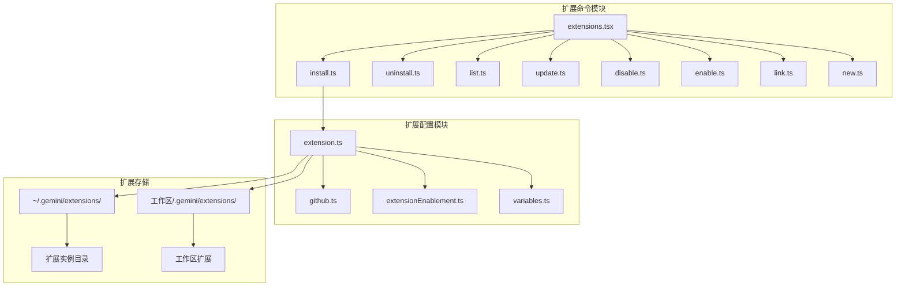
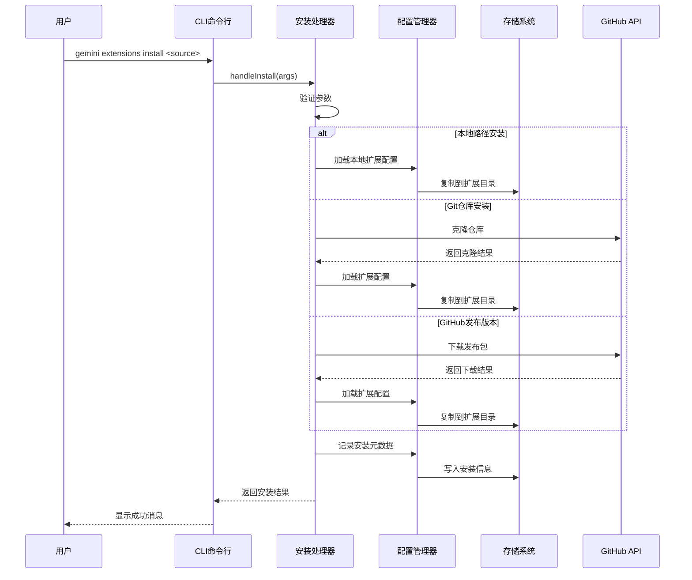
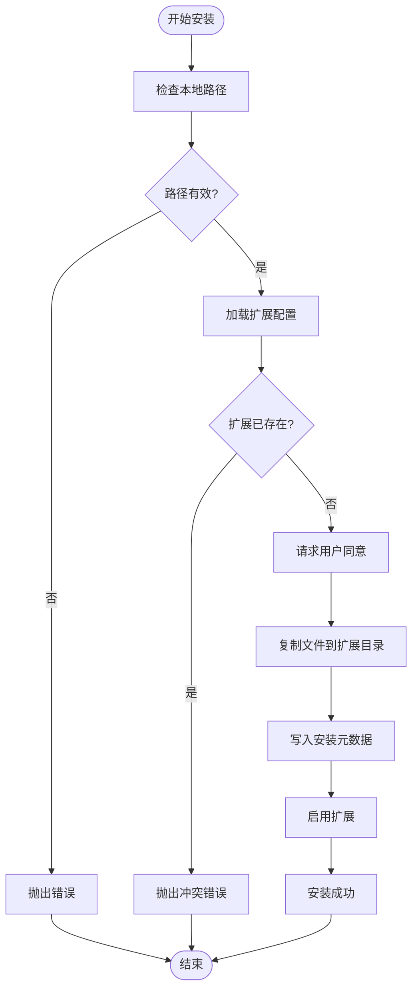
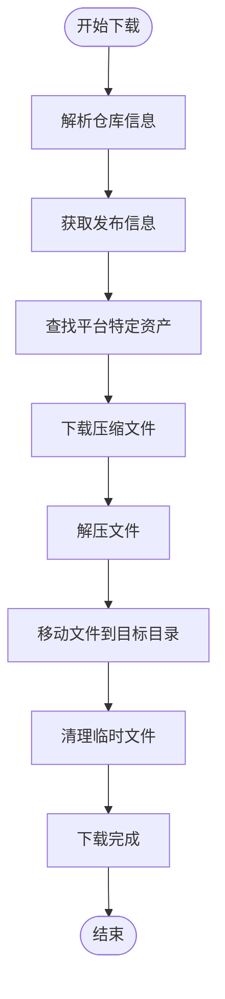
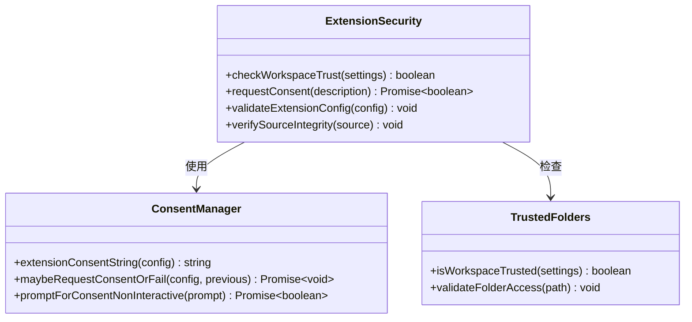
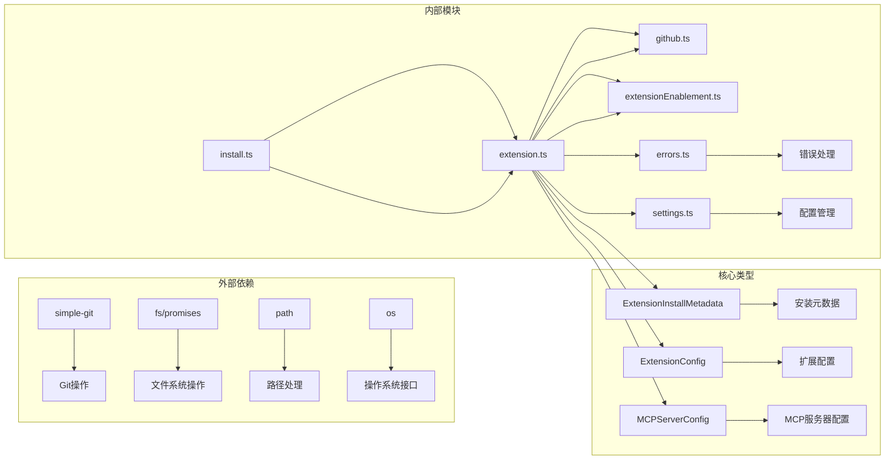

# 扩展安装

<cite>
**本文档中引用的文件**
- [packages/cli/src/commands/extensions/install.ts](file://packages/cli/src/commands/extensions/install.ts)
- [packages/cli/src/config/extension.ts](file://packages/cli/src/config/extension.ts)
- [packages/cli/src/config/extensions/github.ts](file://packages/cli/src/config/extensions/github.ts)
- [packages/cli/src/commands/extensions.tsx](file://packages/cli/src/commands/extensions.tsx)
- [integration-tests/extensions-install.test.ts](file://integration-tests/extensions-install.test.ts)
- [hello/gemini-extension.json](file://hello/gemini-extension.json)
- [README.md](file://README.md)
</cite>

## 目录
1. [简介](#简介)
2. [项目结构](#项目结构)
3. [核心组件](#核心组件)
4. [架构概览](#架构概览)
5. [详细组件分析](#详细组件分析)
6. [依赖关系分析](#依赖关系分析)
7. [性能考虑](#性能考虑)
8. [故障排除指南](#故障排除指南)
9. [结论](#结论)

## 简介

Gemini CLI 扩展系统是一个强大的模块化框架，允许用户通过 `gemini extensions install` 命令安装各种类型的扩展。该系统支持从本地文件路径、Git 仓库（包括 GitHub）以及发布版本等多种来源安装扩展，提供了灵活且安全的扩展管理机制。

扩展系统的核心设计理念是：
- **安全性优先**：所有扩展安装都需要用户确认
- **多源支持**：支持本地路径、Git 仓库和 GitHub 发布版本
- **自动更新**：可选的自动更新功能
- **工作区隔离**：支持全局和工作区级别的扩展管理

## 项目结构

Gemini CLI 扩展系统的文件组织结构如下：



**图表来源**
- [packages/cli/src/commands/extensions.tsx](file://packages/cli/src/commands/extensions.tsx#L1-L37)
- [packages/cli/src/commands/extensions/install.ts](file://packages/cli/src/commands/extensions/install.ts#L1-L104)

**章节来源**
- [packages/cli/src/commands/extensions.tsx](file://packages/cli/src/commands/extensions.tsx#L1-L37)
- [packages/cli/src/commands/extensions/install.ts](file://packages/cli/src/commands/extensions/install.ts#L1-L104)

## 核心组件

### 扩展安装命令处理器

扩展安装功能的核心是 `installCommand` 和 `handleInstall` 函数，它们负责处理不同类型的扩展安装请求。

```typescript
// 扩展安装命令定义
export const installCommand: CommandModule = {
  command: 'install [<source>] [--path] [--ref] [--auto-update]',
  describe: 'Installs an extension from a git repository URL or a local path.',
  // 参数配置...
};
```

### 安装元数据类型

系统支持多种安装类型，每种都有对应的元数据结构：

```typescript
interface InstallArgs {
  source?: string;     // 源地址（URL 或路径）
  path?: string;       // 本地路径
  ref?: string;        // Git 引用标签
  autoUpdate?: boolean; // 自动更新标志
}
```

**章节来源**
- [packages/cli/src/commands/extensions/install.ts](file://packages/cli/src/commands/extensions/install.ts#L64-L102)

## 架构概览

扩展安装系统采用分层架构设计，确保了模块化和可扩展性：



**图表来源**
- [packages/cli/src/commands/extensions/install.ts](file://packages/cli/src/commands/extensions/install.ts#L15-L50)
- [packages/cli/src/config/extension.ts](file://packages/cli/src/config/extension.ts#L400-L500)

## 详细组件分析

### 本地扩展安装

本地扩展安装是最直接的方式，适用于开发阶段或私有扩展：



**图表来源**
- [packages/cli/src/commands/extensions/install.ts](file://packages/cli/src/commands/extensions/install.ts#L15-L50)
- [packages/cli/src/config/extension.ts](file://packages/cli/src/config/extension.ts#L400-L500)

### Git 仓库安装

Git 仓库安装支持从远程 Git 服务器克隆扩展：

```typescript
// Git 安装流程
export async function cloneFromGit(
  installMetadata: ExtensionInstallMetadata,
  destination: string,
): Promise<void> {
  const git = simpleGit(destination);
  let sourceUrl = installMetadata.source;
  
  // 处理 GitHub Token
  const token = getGitHubToken();
  if (token) {
    // 注入认证令牌
  }
  
  // 克隆仓库（浅克隆）
  await git.clone(sourceUrl, './', ['--depth', '1']);
  
  // 获取指定引用
  const refToFetch = installMetadata.ref || 'HEAD';
  await git.fetch(remotes[0].name, refToFetch);
  await git.checkout('FETCH_HEAD');
}
```

### GitHub 发布版本安装

GitHub 发布版本安装支持从 GitHub Releases 下载预编译的扩展包：



**图表来源**
- [packages/cli/src/config/extensions/github.ts](file://packages/cli/src/config/extensions/github.ts#L200-L300)

**章节来源**
- [packages/cli/src/config/extensions/github.ts](file://packages/cli/src/config/extensions/github.ts#L20-L100)
- [packages/cli/src/config/extensions/github.ts](file://packages/cli/src/config/extensions/github.ts#L200-L350)

### 扩展配置验证

扩展安装过程中会严格验证配置文件的有效性：

```typescript
// 扩展配置加载
export function loadExtensionConfig(
  context: LoadExtensionContext,
): ExtensionConfig {
  const { extensionDir, workspaceDir } = context;
  const configFilePath = path.join(extensionDir, EXTENSIONS_CONFIG_FILENAME);
  
  if (!fs.existsSync(configFilePath)) {
    throw new Error(`Configuration file not found at ${configFilePath}`);
  }
  
  const configContent = fs.readFileSync(configFilePath, 'utf-8');
  const config = recursivelyHydrateStrings(
    JSON.parse(configContent), 
    { extensionPath: extensionDir, workspacePath: workspaceDir }
  ) as unknown as ExtensionConfig;
  
  // 验证必需字段
  if (!config.name || !config.version) {
    throw new Error(`Invalid configuration in ${configFilePath}: missing ${!config.name ? '"name"' : '"version"'}`);
  }
  
  validateName(config.name);
  return config;
}
```

**章节来源**
- [packages/cli/src/config/extension.ts](file://packages/cli/src/config/extension.ts#L700-L750)

### 安全性和权限控制

系统实现了多层次的安全控制机制：



**图表来源**
- [packages/cli/src/config/extension.ts](file://packages/cli/src/config/extension.ts#L400-L500)

**章节来源**
- [packages/cli/src/config/extension.ts](file://packages/cli/src/config/extension.ts#L400-L550)

## 依赖关系分析

扩展安装系统的依赖关系图展示了各组件之间的交互：



**图表来源**
- [packages/cli/src/commands/extensions/install.ts](file://packages/cli/src/commands/extensions/install.ts#L1-L20)
- [packages/cli/src/config/extension.ts](file://packages/cli/src/config/extension.ts#L1-L50)

**章节来源**
- [packages/cli/src/commands/extensions/install.ts](file://packages/cli/src/commands/extensions/install.ts#L1-L20)
- [packages/cli/src/config/extension.ts](file://packages/cli/src/config/extension.ts#L1-L50)

## 性能考虑

### 并发安装优化

系统支持并发安装多个扩展，提高了安装效率：

```typescript
// 并发安装示例
export async function performWorkspaceExtensionMigration(
  extensions: Extension[],
  requestConsent: (consent: string) => Promise<boolean>,
): Promise<string[]> {
  const failedInstallNames: string[] = [];
  
  // 并发安装所有扩展
  const installPromises = extensions.map(async (extension) => {
    try {
      const installMetadata: ExtensionInstallMetadata = {
        source: extension.path,
        type: 'local',
      };
      await installExtension(installMetadata, requestConsent);
    } catch (_) {
      failedInstallNames.push(extension.config.name);
    }
  });
  
  await Promise.all(installPromises);
  return failedInstallNames;
}
```

### 缓存和临时文件管理

系统使用智能缓存策略减少重复下载：

- **浅克隆**：Git 仓库默认使用浅克隆减少下载大小
- **临时目录**：使用系统临时目录存储下载的文件
- **清理机制**：安装完成后自动清理临时文件

### 内存优化

- **流式处理**：大文件下载使用流式处理避免内存溢出
- **按需加载**：扩展配置按需解析，不加载未使用的扩展

## 故障排除指南

### 常见安装问题

#### 1. 权限被拒绝错误

**问题描述**：无法安装来自不受信任文件夹的扩展

**解决方案**：
```bash
# 检查当前工作区是否受信任
gemini config --show trustedFolders

# 将当前目录添加到受信任列表
gemini config --set trustedFolders.add ./
```

#### 2. Git 连接超时

**问题描述**：Git 克隆操作失败

**解决方案**：
```bash
# 设置代理（如果需要）
export HTTP_PROXY=http://proxy.company.com:8080
export HTTPS_PROXY=https://proxy.company.com:8080

# 或者使用 SSH 代理
export GIT_SSH_COMMAND="ssh -i ~/.ssh/id_rsa"
```

#### 3. GitHub API 限制

**问题描述**：GitHub API 调用频率限制

**解决方案**：
```bash
# 设置 GitHub Token
export GITHUB_TOKEN=your_personal_access_token

# 使用 Token 访问私有仓库
gemini extensions install github:username/private-repo
```

### 调试技巧

#### 启用调试模式

```bash
# 启用详细日志输出
DEBUG=gemini:* gemini extensions install <source>

# 查看安装过程的详细信息
gemini extensions install --path ./my-extension --verbose
```

#### 检查安装状态

```bash
# 列出所有已安装的扩展
gemini extensions list

# 检查特定扩展的状态
gemini extensions list --details my-extension

# 验证扩展配置
gemini extensions list --validate my-extension
```

**章节来源**
- [packages/cli/src/config/extension.ts](file://packages/cli/src/config/extension.ts#L400-L500)

## 结论

Gemini CLI 的扩展安装系统是一个设计精良、功能完备的模块化框架。它通过以下特性为用户提供安全、高效、灵活的扩展管理体验：

### 主要优势

1. **多源支持**：支持本地路径、Git 仓库和 GitHub 发布版本
2. **安全第一**：严格的权限控制和用户确认机制
3. **智能缓存**：优化的下载和安装流程
4. **工作区隔离**：支持全局和工作区级别的扩展管理
5. **自动更新**：可选的自动更新功能
6. **错误处理**：完善的错误处理和恢复机制

### 最佳实践建议

1. **开发阶段**：使用本地路径安装进行快速迭代
2. **生产环境**：优先选择 GitHub 发布版本确保稳定性
3. **安全考虑**：始终验证扩展来源并仔细审查权限要求
4. **性能优化**：合理使用缓存和并发安装提高效率
5. **监控维护**：定期检查扩展更新和安全补丁

通过遵循这些指导原则和最佳实践，用户可以充分利用 Gemini CLI 扩展系统的强大功能，构建个性化的 AI 工作流和工具链。