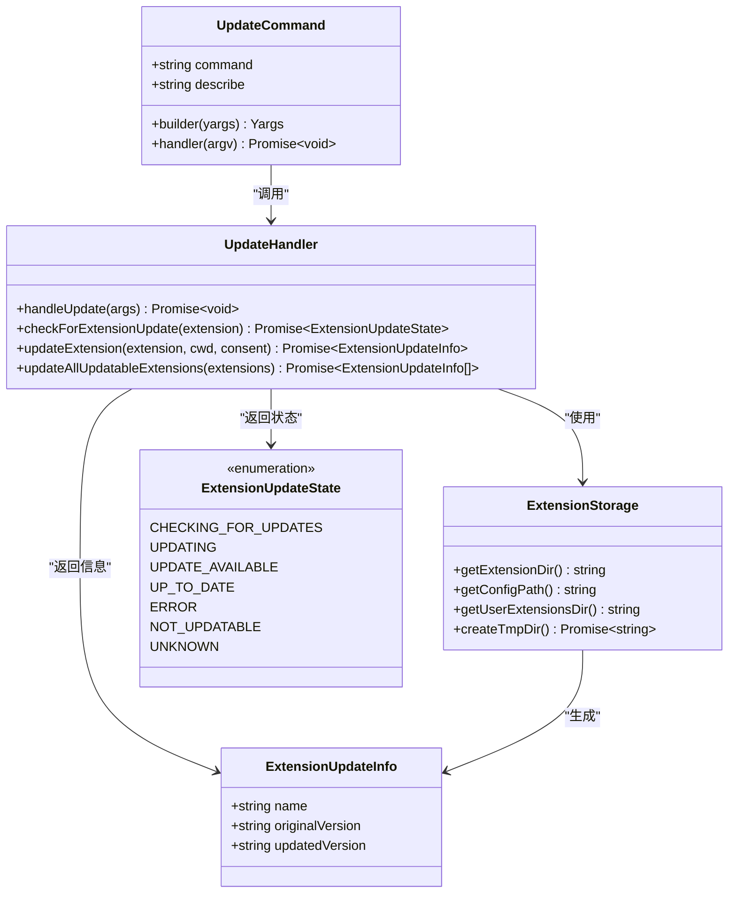
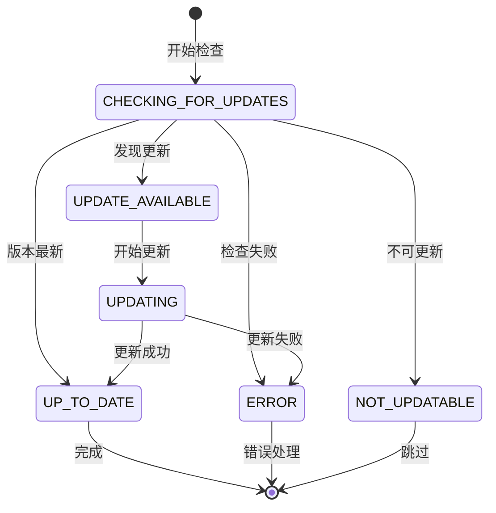
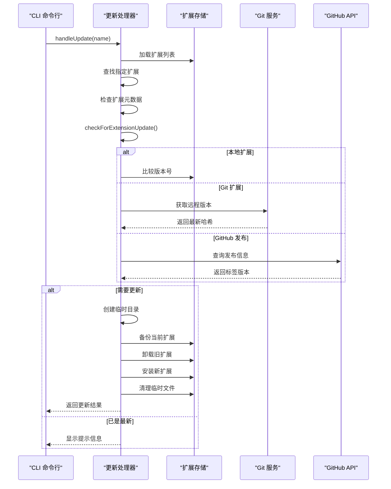
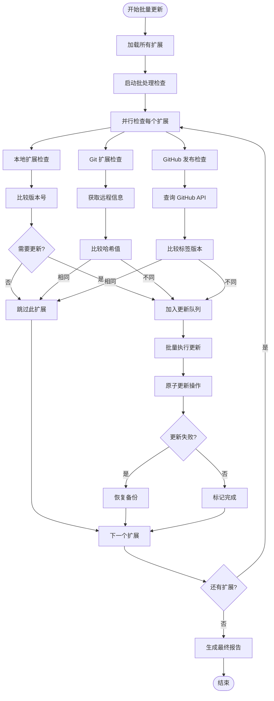
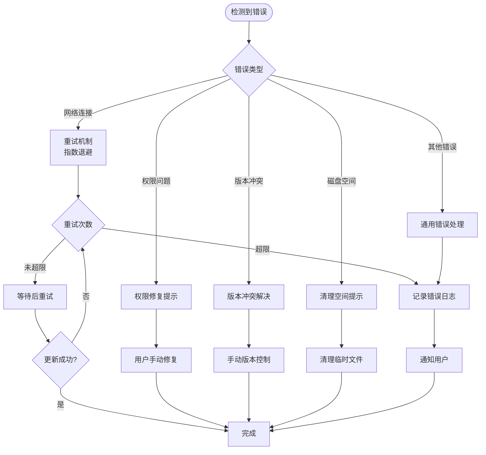

# 扩展更新

<cite>
**本文档中引用的文件**
- [packages/cli/src/commands/extensions/update.ts](file://packages/cli/src/commands/extensions/update.ts)
- [packages/cli/src/config/extensions/update.ts](file://packages/cli/src/config/extensions/update.ts)
- [packages/cli/src/config/extensions/github.ts](file://packages/cli/src/config/extensions/github.ts)
- [packages/cli/src/config/extension.ts](file://packages/cli/src/config/extension.ts)
- [packages/cli/src/ui/state/extensions.ts](file://packages/cli/src/ui/state/extensions.ts)
- [packages/cli/src/ui/commands/extensionsCommand.ts](file://packages/cli/src/ui/commands/extensionsCommand.ts)
- [docs/extensions/index.md](file://docs/extensions/index.md)
- [README.md](file://README.md)
</cite>

## 目录
1. [简介](#简介)
2. [命令概述](#命令概述)
3. [核心架构](#核心架构)
4. [更新流程详解](#更新流程详解)
5. [使用示例](#使用示例)
6. [错误处理机制](#错误处理机制)
7. [最佳实践](#最佳实践)
8. [故障排除指南](#故障排除指南)
9. [总结](#总结)

## 简介

`gemini extensions update` 命令是 Gemini CLI 扩展管理系统的核心功能之一，它负责检查已安装扩展的远程源（如 Git 仓库或 GitHub 发布）是否有新版本，并执行相应的更新操作。该命令的设计理念类似于重新安装过程，通过拉取最新代码并覆盖现有文件来确保扩展始终处于最新状态。

扩展更新功能支持两种主要模式：
- **单个扩展更新**：针对特定扩展进行版本检查和更新
- **批量更新**：同时更新所有可更新的扩展

## 命令概述

### 基本语法

```bash
gemini extensions update [<extension-name>] [--all]
```

### 参数说明

- `extension-name`：要更新的扩展名称（可选）
- `--all`：更新所有已安装的扩展（可选）

### 命令特性

- **互斥参数**：`extension-name` 和 `--all` 不能同时使用
- **智能检测**：自动识别扩展的安装类型（本地、Git、GitHub 发布等）
- **版本比较**：精确比较当前版本与远程版本
- **原子性更新**：支持回滚机制，确保更新失败时系统完整性

## 核心架构

### 组件关系图



**图表来源**
- [packages/cli/src/commands/extensions/update.ts](file://packages/cli/src/commands/extensions/update.ts#L123-L150)
- [packages/cli/src/config/extensions/update.ts](file://packages/cli/src/config/extensions/update.ts#L1-L50)
- [packages/cli/src/ui/state/extensions.ts](file://packages/cli/src/ui/state/extensions.ts#L1-L30)

### 更新状态管理

扩展更新系统采用状态机模式管理更新过程：



**图表来源**
- [packages/cli/src/ui/state/extensions.ts](file://packages/cli/src/ui/state/extensions.ts#L10-L18)

## 更新流程详解

### 单个扩展更新流程



**图表来源**
- [packages/cli/src/commands/extensions/update.ts](file://packages/cli/src/commands/extensions/update.ts#L32-L70)
- [packages/cli/src/config/extensions/update.ts](file://packages/cli/src/config/extensions/update.ts#L25-L80)

### 批量更新流程

批量更新涉及更复杂的协调机制：



**图表来源**
- [packages/cli/src/config/extensions/update.ts](file://packages/cli/src/config/extensions/update.ts#L120-L150)

**章节来源**
- [packages/cli/src/commands/extensions/update.ts](file://packages/cli/src/commands/extensions/update.ts#L32-L121)
- [packages/cli/src/config/extensions/update.ts](file://packages/cli/src/config/extensions/update.ts#L25-L191)

## 使用示例

### 更新单个扩展

```bash
# 更新名为 "my-extension" 的扩展
gemini extensions update my-extension

# 输出示例：
# Extension "my-extension" successfully updated: 1.0.0 → 1.0.1.
```

### 更新所有扩展

```bash
# 更新所有已安装的扩展
gemini extensions update --all

# 输出示例：
# Extension "security" successfully updated: 1.2.0 → 1.2.1.
# Extension "tools" successfully updated: 0.9.0 → 0.9.1.
# No extensions to update.
```

### 常见使用场景

#### 场景 1：定期维护
```bash
# 每周运行一次全量更新
gemini extensions update --all
```

#### 场景 2：特定需求更新
```bash
# 当发现安全相关扩展有更新时
gemini extensions update security-extension

# 当需要最新工具集时
gemini extensions update productivity-tools
```

#### 场景 3：开发环境更新
```bash
# 在开发环境中更新所有依赖的扩展
gemini extensions update --all
```

**章节来源**
- [packages/cli/src/commands/extensions/update.ts](file://packages/cli/src/commands/update.ts#L123-L150)
- [docs/extensions/index.md](file://docs/extensions/index.md#L80-L90)

## 错误处理机制

### 错误类型分类

扩展更新系统定义了多种错误状态：

```typescript
enum ExtensionUpdateState {
  CHECKING_FOR_UPDATES = 'checking for updates',
  UPDATING = 'updating',
  UPDATE_AVAILABLE = 'update available',
  UP_TO_DATE = 'up to date',
  ERROR = 'error',
  NOT_UPDATABLE = 'not updatable',
  UNKNOWN = 'unknown',
}
```

### 错误处理策略



**图表来源**
- [packages/cli/src/ui/state/extensions.ts](file://packages/cli/src/ui/state/extensions.ts#L10-L18)
- [packages/cli/src/config/extensions/update.ts](file://packages/cli/src/config/extensions/update.ts#L70-L90)

### 回滚机制

更新系统实现了完善的回滚机制：

```typescript
// 更新失败时的回滚逻辑
try {
  // 执行更新操作...
} catch (e) {
  console.error(`Error updating extension, rolling back. ${getErrorMessage(e)}`);
  dispatchExtensionStateUpdate({
    type: 'SET_STATE',
    payload: { name: extension.name, state: ExtensionUpdateState.ERROR },
  });
  await copyExtension(tempDir, extension.path); // 回滚到原始状态
  throw e;
} finally {
  await fs.promises.rm(tempDir, { recursive: true, force: true }); // 清理临时文件
}
```

**章节来源**
- [packages/cli/src/config/extensions/update.ts](file://packages/cli/src/config/extensions/update.ts#L70-L90)
- [packages/cli/src/ui/state/extensions.ts](file://packages/cli/src/ui/state/extensions.ts#L10-L18)

## 最佳实践

### 更新前准备

1. **备份重要配置**
   ```bash
   # 在更新前备份扩展配置
   cp ~/.gemini/extensions/ /backup/extensions-backup/
   ```

2. **检查变更日志**
   ```bash
   # 查看扩展的 CHANGELOG 文件
   cat ~/.gemini/extensions/my-extension/CHANGELOG.md
   ```

3. **验证当前功能**
   ```bash
   # 确认扩展当前正常工作
   gemini extensions list
   ```

### 更新策略

1. **渐进式更新**
   ```bash
   # 先更新关键扩展
   gemini extensions update security analytics
   
   # 再更新非关键扩展
   gemini extensions update --all
   ```

2. **环境隔离**
   ```bash
   # 在测试环境中验证更新
   export GEMINI_EXTENSIONS_DIR=~/.gemini/test-extensions
   gemini extensions update --all
   ```

3. **版本锁定**
   ```bash
   # 在 gemini-extension.json 中锁定版本
   {
     "name": "my-extension",
     "version": "1.0.1",  // 锁定到特定版本
     "mcpServers": {...}
   }
   ```

### 更新后验证

1. **功能测试**
   ```bash
   # 测试扩展命令是否正常工作
   gemini /my-extension:test-command
   ```

2. **性能监控**
   ```bash
   # 监控更新后的性能变化
   gemini --profile /analyze-performance
   ```

3. **兼容性检查**
   ```bash
   # 检查与其他扩展的兼容性
   gemini extensions list --verbose
   ```

## 故障排除指南

### 常见问题及解决方案

#### 问题 1：无法连接到远程仓库

**症状**：
```
Error: Failed to clone Git repository from https://github.com/user/repo
```

**解决方案**：
```bash
# 检查网络连接
ping github.com

# 配置 Git 凭据
git config --global credential.helper store

# 重新尝试更新
gemini extensions update my-extension
```

#### 问题 2：权限不足

**症状**：
```
Error: EACCES: permission denied, mkdir '~/.gemini/extensions/'
```

**解决方案**：
```bash
# 修复目录权限
chmod -R 755 ~/.gemini/extensions/

# 或者重新安装 CLI
sudo npm install -g @google/gemini-cli
```

#### 问题 3：版本冲突

**症状**：
```
Error: Extension is linked so does not need to be updated
```

**解决方案**：
```bash
# 检查扩展链接状态
gemini extensions list

# 如果是链接的扩展，使用 link 命令更新
gemini extensions link /path/to/development
```

#### 问题 4：磁盘空间不足

**症状**：
```
Error: ENOSPC: no space left on device
```

**解决方案**：
```bash
# 清理临时文件
rm -rf /tmp/gemini-extension*

# 清理缓存
gemini cache clear

# 检查可用空间
df -h ~/.gemini
```

### 调试技巧

1. **启用调试模式**
   ```bash
   # 设置调试环境变量
   export DEBUG=gemini:extensions
   gemini extensions update my-extension
   ```

2. **查看详细日志**
   ```bash
   # 启用详细输出
   gemini extensions update my-extension --verbose
   ```

3. **检查扩展状态**
   ```bash
   # 查看扩展详细信息
   gemini extensions list --details
   ```

**章节来源**
- [packages/cli/src/config/extensions/update.ts](file://packages/cli/src/config/extensions/update.ts#L70-L90)
- [packages/cli/src/config/extensions/github.ts](file://packages/cli/src/config/extensions/github.ts#L150-L199)

## 总结

`gemini extensions update` 命令为 Gemini CLI 用户提供了强大而可靠的扩展更新能力。通过智能的状态管理和原子性的更新机制，它确保了扩展系统的稳定性和可靠性。

### 主要优势

1. **自动化程度高**：无需手动干预即可完成复杂的更新流程
2. **安全性强**：完善的回滚机制保护系统完整性
3. **灵活性好**：支持单个扩展和批量更新两种模式
4. **错误处理完善**：多层次的错误检测和恢复机制

### 使用建议

- 定期执行 `gemini extensions update --all` 进行维护
- 在生产环境中谨慎使用更新功能
- 始终检查扩展的变更日志和兼容性
- 保留更新前的备份以便必要时回滚

通过遵循本文档中的指导原则和最佳实践，用户可以充分利用 Gemini CLI 扩展更新功能，保持其扩展生态系统的现代化和功能性。