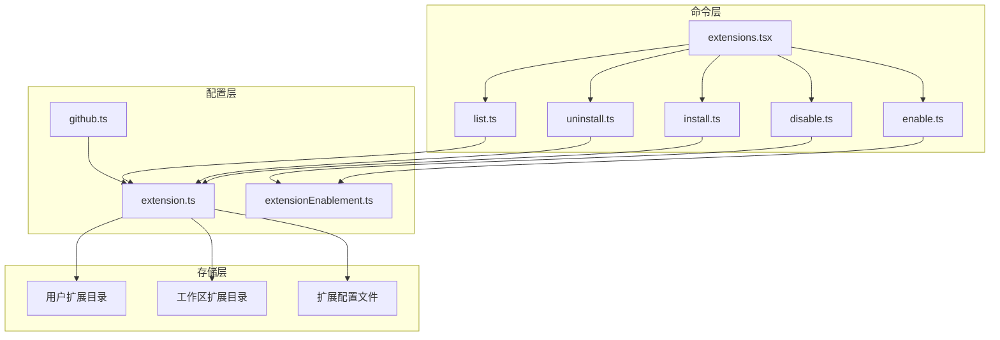
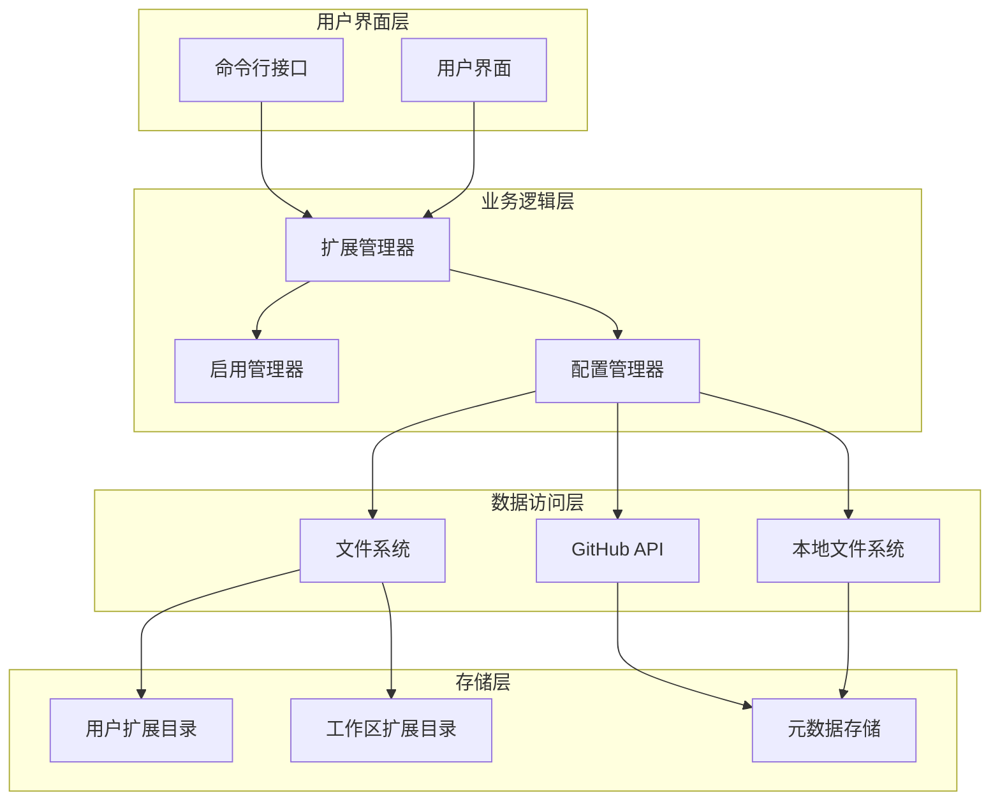
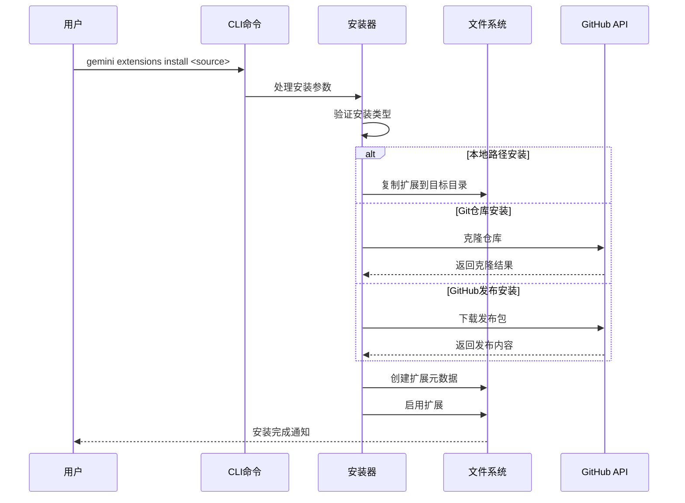
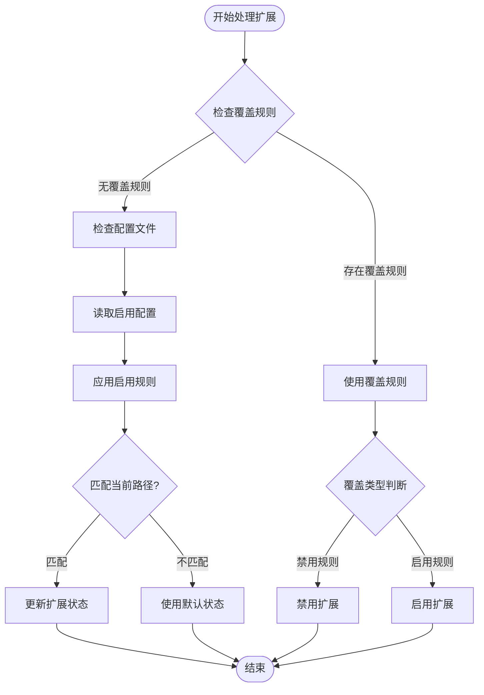
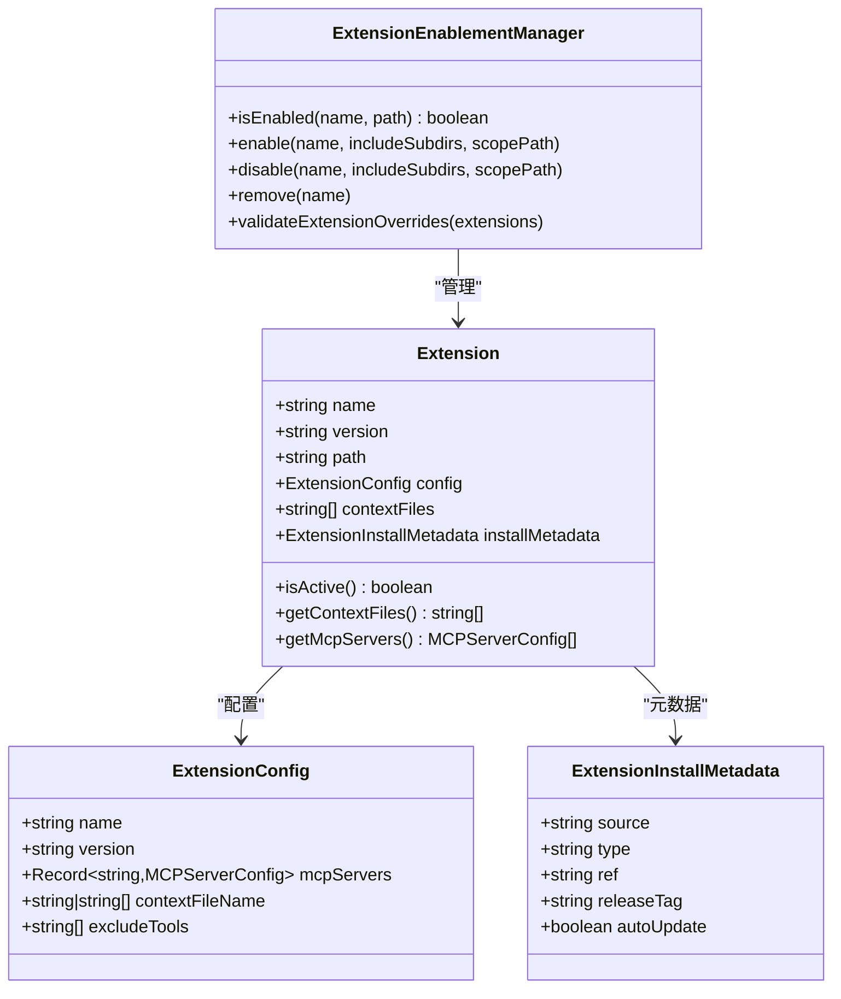
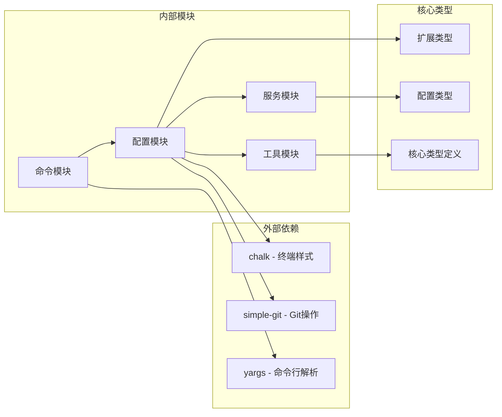

# 扩展管理命令文档

<cite>
**本文档中引用的文件**
- [extensions.tsx](file://packages/cli/src/commands/extensions.tsx)
- [install.ts](file://packages/cli/src/commands/extensions/install.ts)
- [uninstall.ts](file://packages/cli/src/commands/extensions/uninstall.ts)
- [enable.ts](file://packages/cli/src/commands/extensions/enable.ts)
- [disable.ts](file://packages/cli/src/commands/extensions/disable.ts)
- [list.ts](file://packages/cli/src/commands/extensions/list.ts)
- [extension.ts](file://packages/cli/src/config/extension.ts)
- [extensionEnablement.ts](file://packages/cli/src/config/extensions/extensionEnablement.ts)
- [github.ts](file://packages/cli/src/config/extensions/github.ts)
</cite>

## 目录
1. [简介](#简介)
2. [项目结构概览](#项目结构概览)
3. [核心组件分析](#核心组件分析)
4. [架构概览](#架构概览)
5. [详细组件分析](#详细组件分析)
6. [依赖关系分析](#依赖关系分析)
7. [性能考虑](#性能考虑)
8. [故障排除指南](#故障排除指南)
9. [结论](#结论)

## 简介

Gemini CLI 的扩展管理系统是一个功能强大的工具集，允许用户安装、卸载、启用、禁用和管理各种扩展。该系统支持从本地路径、Git 仓库和 GitHub 发布版本等多种来源安装扩展，并提供了灵活的作用域控制机制。

扩展管理系统的核心特性包括：
- 多种安装源支持（本地路径、Git 仓库、GitHub 发布）
- 用户级和工作区级扩展管理
- 智能的扩展启用/禁用机制
- 自动更新检查和管理
- 完整的扩展生命周期管理

## 项目结构概览

扩展管理功能主要分布在以下关键目录中：

**图表来源**
- [extensions.tsx](file://packages/cli/src/commands/extensions.tsx#L1-L37)
- [extension.ts](file://packages/cli/src/config/extension.ts#L1-L50)

**章节来源**
- [extensions.tsx](file://packages/cli/src/commands/extensions.tsx#L1-L37)

## 核心组件分析

扩展管理系统由多个核心组件组成，每个组件负责特定的功能领域：

### 命令模块
- **extensions.tsx**: 主命令入口点，定义扩展命令组
- **install.ts**: 处理扩展安装逻辑
- **uninstall.ts**: 处理扩展卸载逻辑
- **enable.ts**: 处理扩展启用逻辑
- **disable.ts**: 处理扩展禁用逻辑
- **list.ts**: 处理扩展列表展示

### 配置管理模块
- **extension.ts**: 核心扩展配置和管理逻辑
- **extensionEnablement.ts**: 扩展启用状态管理
- **github.ts**: GitHub 相关的下载和克隆功能

**章节来源**
- [extensions.tsx](file://packages/cli/src/commands/extensions.tsx#L1-L37)
- [extension.ts](file://packages/cli/src/config/extension.ts#L1-L100)

## 架构概览

扩展管理系统采用分层架构设计，确保了清晰的职责分离和高度的可维护性：

**图表来源**
- [extension.ts](file://packages/cli/src/config/extension.ts#L100-L200)
- [extensionEnablement.ts](file://packages/cli/src/config/extensions/extensionEnablement.ts#L1-L50)

## 详细组件分析

### 扩展安装组件

扩展安装是整个系统的核心功能之一，支持多种安装源：

**图表来源**
- [install.ts](file://packages/cli/src/commands/extensions/install.ts#L1-L104)
- [extension.ts](file://packages/cli/src/config/extension.ts#L400-L500)

#### 支持的安装源类型

1. **本地路径安装**
   - 从本地文件系统复制扩展
   - 支持相对路径和绝对路径
   - 自动验证扩展配置文件

2. **Git仓库安装**
   - 支持HTTPS和SSH协议
   - 可指定分支、标签或提交哈希
   - 支持私有仓库（需要GitHub令牌）

3. **GitHub发布安装**
   - 自动检测平台兼容性资产
   - 支持多平台发布包
   - 自动解压和提取

**章节来源**
- [install.ts](file://packages/cli/src/commands/extensions/install.ts#L1-L104)
- [extension.ts](file://packages/cli/src/config/extension.ts#L400-L500)

### 扩展启用/禁用管理

扩展启用/禁用系统提供了细粒度的控制机制：

**图表来源**
- [extensionEnablement.ts](file://packages/cli/src/config/extensions/extensionEnablement.ts#L100-L200)

#### 启用规则系统

启用规则系统支持复杂的路径匹配和作用域控制：

- **全局启用/禁用**: 对所有路径生效
- **路径特定启用/禁用**: 基于工作区路径的精确控制
- **子目录包含**: 支持通配符匹配子目录
- **优先级规则**: 最后匹配的规则优先

**章节来源**
- [extensionEnablement.ts](file://packages/cli/src/config/extensions/extensionEnablement.ts#L1-L240)

### 扩展列表和状态显示

扩展列表功能提供了详细的扩展信息展示：

**图表来源**
- [extension.ts](file://packages/cli/src/config/extension.ts#L50-L100)
- [extensionEnablement.ts](file://packages/cli/src/config/extensions/extensionEnablement.ts#L1-L50)

**章节来源**
- [list.ts](file://packages/cli/src/commands/extensions/list.ts#L1-L37)
- [extension.ts](file://packages/cli/src/config/extension.ts#L650-L700)

## 依赖关系分析

扩展管理系统的依赖关系展现了清晰的分层架构：

**图表来源**
- [extension.ts](file://packages/cli/src/config/extension.ts#L1-L30)

**章节来源**
- [extension.ts](file://packages/cli/src/config/extension.ts#L1-L50)

## 性能考虑

扩展管理系统在设计时充分考虑了性能优化：

### 延迟加载机制
- 扩展配置仅在需要时加载
- 启用状态缓存减少重复计算
- 路径匹配优化避免不必要的正则表达式

### 内存管理
- 使用LRU缓存管理频繁访问的扩展
- 及时释放临时文件和资源
- 避免内存泄漏的清理机制

### 并发处理
- 异步I/O操作避免阻塞
- 并行下载和解压多个扩展
- 非阻塞的更新检查机制

## 故障排除指南

### 常见问题和解决方案

1. **安装失败**
   - 检查网络连接和GitHub令牌设置
   - 验证扩展配置文件格式
   - 确认目标目录权限

2. **启用/禁用不生效**
   - 检查启用规则配置
   - 验证工作区信任设置
   - 清除扩展缓存重新加载

3. **权限错误**
   - 确认用户目录写入权限
   - 检查工作区信任状态
   - 验证扩展源可信度

**章节来源**
- [extension.ts](file://packages/cli/src/config/extension.ts#L500-L600)

## 结论

Gemini CLI 的扩展管理系统是一个设计精良、功能完备的扩展管理解决方案。它不仅提供了丰富的安装选项和灵活的启用控制，还通过清晰的架构设计确保了系统的可维护性和扩展性。

### 主要优势

1. **多源支持**: 支持本地、Git 和 GitHub 多种安装方式
2. **智能管理**: 提供细粒度的启用/禁用控制
3. **性能优化**: 采用延迟加载和缓存机制
4. **安全可靠**: 完善的权限检查和错误处理
5. **易于使用**: 直观的命令行接口和详细的错误信息

### 未来发展方向

- 增强的自动更新机制
- 更丰富的扩展元数据管理
- 改进的性能监控和报告
- 更好的用户体验和交互设计

这个扩展管理系统为 Gemini CLI 提供了强大的扩展能力，使用户能够轻松地扩展和定制其功能，同时保持了系统的稳定性和安全性。