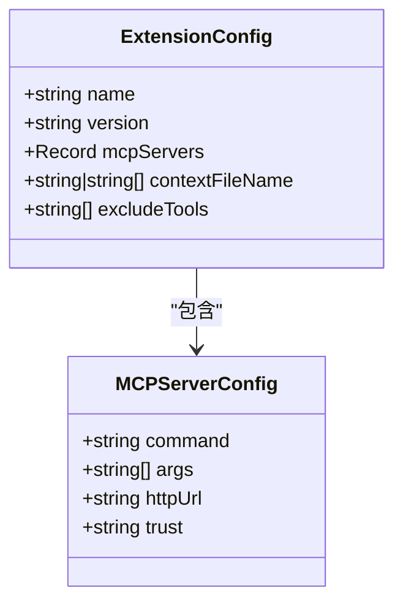
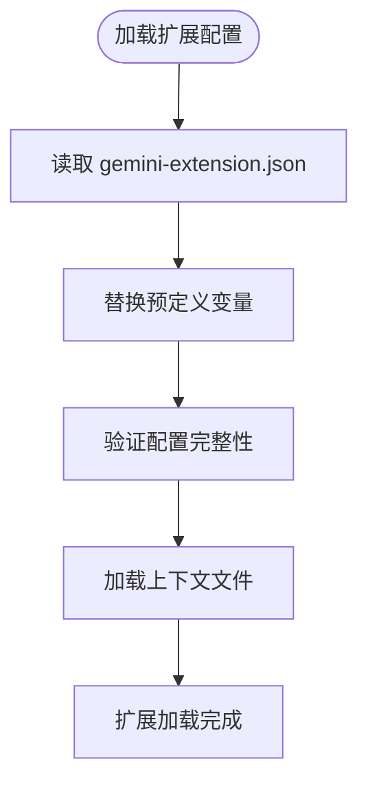
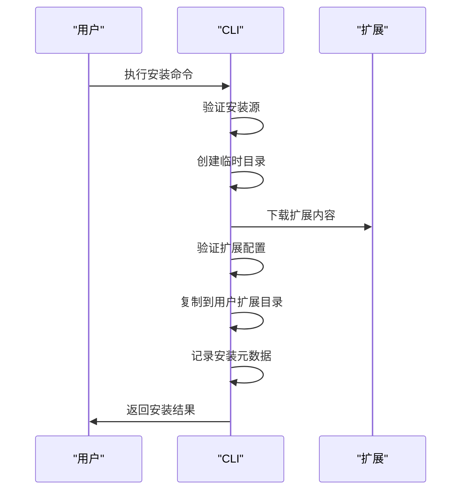
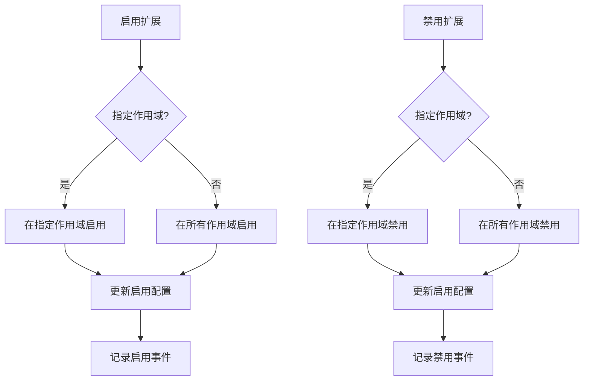
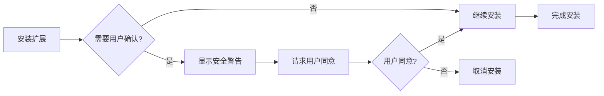
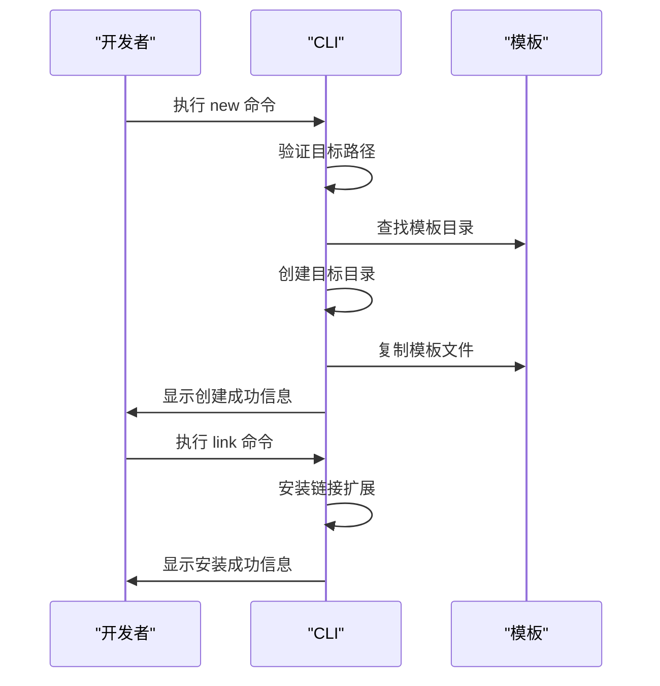

# 扩展系统

<cite>
**本文档中引用的文件**  
- [gemini-extension.json](file://hello/gemini-extension.json)
- [GEMINI.md](file://hello/GEMINI.md)
- [disable.ts](file://packages/cli/src/commands/extensions/disable.ts)
- [enable.ts](file://packages/cli/src/commands/extensions/enable.ts)
- [install.ts](file://packages/cli/src/commands/extensions/install.ts)
- [uninstall.ts](file://packages/cli/src/commands/extensions/uninstall.ts)
- [extension.ts](file://packages/cli/src/config/extension.ts)
- [extensionEnablement.ts](file://packages/cli/src/config/extensions/extensionEnablement.ts)
- [variableSchema.ts](file://packages/cli/src/config/extensions/variableSchema.ts)
- [new.ts](file://packages/cli/src/commands/extensions/new.ts)
- [link.ts](file://packages/cli/src/commands/extensions/link.ts)
- [extensions-install.test.ts](file://integration-tests/extensions-install.test.ts)
- [custom-commands/gemini-extension.json](file://packages/cli/src/commands/extensions/examples/custom-commands/gemini-extension.json)
</cite>

## 目录
1. [简介](#简介)
2. [扩展清单文件结构](#扩展清单文件结构)
3. [扩展生命周期管理命令](#扩展生命周期管理命令)
4. [扩展安全模型](#扩展安全模型)
5. [示例扩展分析](#示例扩展分析)
6. [开发者指南](#开发者指南)
7. [结论](#结论)

## 简介
gemini-cli 扩展系统允许用户通过安装和管理扩展来增强 CLI 的功能。扩展可以添加新的命令、修改现有行为、集成外部服务或提供上下文信息。本系统支持从本地路径或 Git 仓库安装扩展，并提供完整的生命周期管理功能。

**Section sources**
- [gemini-extension.json](file://hello/gemini-extension.json)
- [GEMINI.md](file://hello/GEMINI.md)

## 扩展清单文件结构
扩展清单文件 `gemini-extension.json` 是扩展的核心配置文件，定义了扩展的基本信息和功能贡献点。

### 基本字段
扩展清单文件包含以下必需字段：

- **name**: 扩展的唯一标识名称，只能包含字母、数字和连字符
- **version**: 扩展的版本号，遵循语义化版本规范
- **contextFileName**: 指定扩展提供的上下文文件名，默认为 GEMINI.md
- **mcpServers**: 定义扩展提供的 MCP 服务器配置
- **excludeTools**: 指定要排除的核心工具列表



**Diagram sources**
- [extension.ts](file://packages/cli/src/config/extension.ts#L79-L98)
- [config.ts](file://packages/core/src/config/config.ts#L118-L128)

### 变量替换机制
扩展系统支持在配置中使用预定义变量进行路径替换：

- **extensionPath**: 扩展在文件系统的路径
- **workspacePath**: 当前工作区的绝对路径
- **/**: 路径分隔符（根据操作系统自动适配）
- **pathSeparator**: 路径分隔符的别名

这些变量在加载扩展时会被自动替换为实际值，使得扩展配置更具灵活性。



**Diagram sources**
- [variableSchema.ts](file://packages/cli/src/config/extensions/variableSchema.ts#L25-L40)
- [extension.ts](file://packages/cli/src/config/extension.ts#L480-L495)

**Section sources**
- [variableSchema.ts](file://packages/cli/src/config/extensions/variableSchema.ts#L25-L40)
- [extension.ts](file://packages/cli/src/config/extension.ts#L480-L495)

## 扩展生命周期管理命令
gemini-cli 提供了一套完整的命令来管理扩展的整个生命周期。

### 安装命令
`extensions install` 命令用于从不同来源安装扩展：

- 从 Git 仓库安装：`gemini extensions install <github-url>`
- 从本地路径安装：`gemini extensions install --path <local-path>`
- 指定 Git 分支或标签：`gemini extensions install --ref <branch-or-tag>`

安装过程中，系统会创建临时目录下载扩展内容，验证配置文件，然后复制到用户扩展目录。



**Diagram sources**
- [install.ts](file://packages/cli/src/commands/extensions/install.ts#L64-L102)
- [extension.ts](file://packages/cli/src/config/extension.ts#L340-L475)

### 启用和禁用命令
扩展可以通过 `enable` 和 `disable` 命令在不同作用域中管理：

- **用户作用域**: 影响所有工作区的扩展状态
- **工作区作用域**: 仅影响当前工作区的扩展状态



**Diagram sources**
- [enable.ts](file://packages/cli/src/commands/extensions/enable.ts#L37-L74)
- [disable.ts](file://packages/cli/src/commands/extensions/disable.ts#L32-L69)
- [extension.ts](file://packages/cli/src/config/extension.ts#L700-L765)

### 卸载命令
`extensions uninstall` 命令用于完全移除已安装的扩展：

1. 查找指定名称的扩展
2. 从启用配置中移除
3. 删除扩展目录
4. 记录卸载事件

**Section sources**
- [uninstall.ts](file://packages/cli/src/commands/extensions/uninstall.ts)
- [extension.ts](file://packages/cli/src/config/extension.ts#L650-L680)

## 扩展安全模型
扩展系统实施了多层次的安全机制来保护用户环境。

### 权限请求机制
当安装或更新扩展时，系统会自动检测潜在的安全风险并请求用户确认：

- **MCP 服务器执行**: 提醒用户扩展将运行 MCP 服务器
- **上下文文件修改**: 通知用户扩展将添加上下文信息
- **核心工具排除**: 警告用户扩展将禁用某些核心功能



**Diagram sources**
- [extension.ts](file://packages/cli/src/config/extension.ts#L520-L570)
- [extension.ts](file://packages/cli/src/config/extension.ts#L240-L330)

### 信任机制
系统通过以下方式确保扩展安全性：

- **工作区信任检查**: 验证工作区是否被标记为可信
- **安装源验证**: 确保安装源路径有效且可访问
- **配置完整性检查**: 验证扩展配置文件的完整性和正确性

**Section sources**
- [extension.ts](file://packages/cli/src/config/extension.ts#L340-L360)
- [extension.ts](file://packages/cli/src/config/extension.ts#L520-L570)

## 示例扩展分析
通过分析内置示例扩展，可以更好地理解扩展系统的实际应用。

### Hello 扩展示例
`hello` 目录中的扩展示例展示了最基本的扩展结构：

- **gemini-extension.json**: 定义扩展名称、版本和上下文文件
- **GEMINI.md**: 提供扩展的上下文信息和使用说明

该扩展的主要功能是为用户提供关于屏幕阅读器指导的上下文信息，增强 CLI 的可访问性。

**Section sources**
- [gemini-extension.json](file://hello/gemini-extension.json)
- [GEMINI.md](file://hello/GEMINI.md)

### Custom Commands 扩展示例
`custom-commands` 扩展示例展示了如何通过扩展添加自定义功能：

- **扩展名称**: custom-commands
- **版本**: 1.0.0
- **功能**: 演示如何通过扩展添加新的命令或修改现有行为

该示例虽然没有复杂的配置，但作为模板为开发者提供了创建自定义命令的基础结构。

**Section sources**
- [custom-commands/gemini-extension.json](file://packages/cli/src/commands/extensions/examples/custom-commands/gemini-extension.json)

## 开发者指南
本节提供开发 gemini-cli 扩展的完整指南。

### 项目结构
创建新扩展时，应遵循以下目录结构：

```
my-extension/
├── gemini-extension.json
├── GEMINI.md
├── README.md
└── src/
    └── ...
```

### 创建新扩展
使用 `extensions new` 命令可以基于模板快速创建新扩展：

```bash
gemini extensions new my-extension custom-commands
```

该命令会从指定模板复制文件到目标路径，并提供安装指导。



**Diagram sources**
- [new.ts](file://packages/cli/src/commands/extensions/new.ts#L0-L91)
- [link.ts](file://packages/cli/src/commands/extensions/link.ts#L0-L55)

### 调试技巧
开发扩展时可以使用以下技巧进行调试：

- **链接模式**: 使用 `extensions link` 命令链接本地扩展目录，实现即时更新
- **日志记录**: 查看扩展安装和加载过程中的日志输出
- **测试命令**: 使用集成测试验证扩展功能

**Section sources**
- [new.ts](file://packages/cli/src/commands/extensions/new.ts#L0-L91)
- [link.ts](file://packages/cli/src/commands/extensions/link.ts#L0-L55)
- [extensions-install.test.ts](file://integration-tests/extensions-install.test.ts#L0-L52)

## 结论
gemini-cli 的扩展系统提供了一个强大而安全的框架，允许用户和开发者扩展 CLI 的功能。通过标准化的清单文件、完整的生命周期管理命令和严格的安全模型，该系统确保了扩展的可管理性和安全性。开发者可以轻松创建和分享扩展，而用户可以安全地安装和管理这些扩展来增强他们的开发体验。