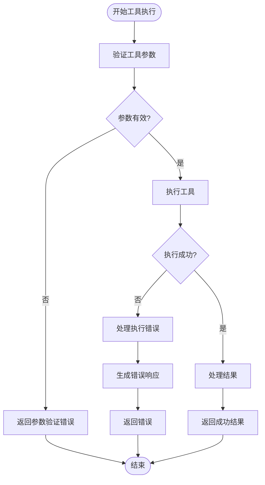
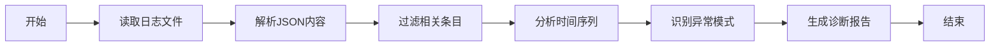

# 故障排除

<cite>
**本文档中引用的文件**  
- [errorReporting.ts](file://packages/core/src/utils/errorReporting.ts)
- [errors.ts](file://packages/cli/src/utils/errors.ts)
- [tools.ts](file://packages/core/src/tools/tools.ts)
- [initializer.ts](file://packages/cli/src/core/initializer.ts)
- [startupWarnings.ts](file://packages/cli/src/utils/startupWarnings.ts)
- [sessionCleanup.ts](file://packages/cli/src/utils/sessionCleanup.ts)
- [config.ts](file://packages/cli/src/config/config.ts)
- [logger.ts](file://packages/core/src/core/logger.ts)
- [install.ts](file://packages/cli/src/commands/extensions/install.ts)
- [add.ts](file://packages/cli/src/commands/mcp/add.ts)
- [ctrl-c-exit.test.ts](file://integration-tests/ctrl-c-exit.test.ts)
</cite>

## 目录
1. [启动失败](#启动失败)
2. [认证错误](#认证错误)
3. 工具执行异常
4. 性能问题
5. 错误报告机制
6. 高级调试技巧

## 启动失败

当 Gemini CLI 无法正常启动时，可能的原因包括配置文件损坏、权限问题或依赖项缺失。系统在启动时会执行一系列初始化检查，包括认证、主题验证和 IDE 连接。

如果启动过程中出现错误，系统会生成详细的错误报告并保存到临时目录。这些报告包含错误信息、堆栈跟踪和上下文数据，有助于诊断根本原因。

**诊断步骤**：
1. 检查控制台输出中的错误消息
2. 验证配置文件（settings.json）的语法正确性
3. 确认用户主目录和项目目录的读写权限
4. 查看临时目录中的错误报告文件（gemini-client-error-*.json）

**解决方案**：
- 修复或重置损坏的配置文件
- 确保应用程序对相关目录具有适当的文件系统权限
- 清理临时文件和缓存
- 重新安装 CLI 工具

**Section sources**
- [initializer.ts](file://packages/cli/src/core/initializer.ts#L1-L58)
- [config.ts](file://packages/cli/src/config/config.ts#L1-L199)

## 认证错误

认证错误通常发生在用户无法通过 Google 身份验证流程时。这可能是由于网络问题、无效的凭据或配置错误导致的。

系统提供了多种认证机制，包括 OAuth 2.0 和服务账号凭据。在初始化过程中，`performInitialAuth` 函数负责处理认证逻辑。

**诊断步骤**：
1. 检查网络连接是否正常
2. 验证代理设置（如果使用代理）
3. 确认已正确配置认证类型
4. 检查环境变量中的凭据信息

**解决方案**：
- 重新运行认证流程
- 检查并更新代理设置
- 验证凭据文件的有效性
- 清除现有的认证状态并重新开始

**Section sources**
- [initializer.ts](file://packages/cli/src/core/initializer.ts#L1-L58)
- [config.ts](file://packages/cli/src/config/config.ts#L1-L199)

## 工具执行异常

工具执行异常是指在调用各种工具（如文件读取、shell 命令执行等）时发生的错误。系统通过 `ToolInvocation` 类来管理工具的构建和执行过程。

当工具执行失败时，系统会捕获错误并生成适当的响应。错误处理机制包括参数验证、执行过程监控和结果处理。



**Diagram sources**
- [tools.ts](file://packages/core/src/tools/tools.ts#L300-L499)

**诊断步骤**：
1. 检查工具参数是否符合预期格式
2. 验证工具所需的资源是否可用
3. 查看详细的错误日志信息
4. 确认工具的依赖项已正确安装

**解决方案**：
- 修正无效的工具参数
- 确保所需文件和目录存在且可访问
- 更新或重新安装工具依赖
- 启用调试模式获取更详细的日志信息

**Section sources**
- [tools.ts](file://packages/core/src/tools/tools.ts#L300-L499)
- [errors.ts](file://packages/cli/src/utils/errors.ts#L1-L162)

## 性能问题

性能问题可能表现为响应延迟、内存使用过高或处理速度缓慢。系统通过会话清理机制和资源管理来优化性能。

会话清理功能定期删除过期或损坏的会话文件，以释放磁盘空间并提高系统效率。清理策略基于配置的保留策略，包括最大年龄和最大会话数。

**诊断步骤**：
1. 监控系统资源使用情况（CPU、内存、磁盘）
2. 检查会话文件的数量和大小
3. 分析日志文件中的性能相关条目
4. 验证配置的性能优化设置

**解决方案**：
- 调整会话保留策略以平衡存储和性能
- 定期清理临时文件和缓存
- 优化日志级别以减少 I/O 操作
- 升级硬件资源（如果必要）

**Section sources**
- [sessionCleanup.ts](file://packages/cli/src/utils/sessionCleanup.ts#L1-L299)
- [logger.ts](file://packages/core/src/core/logger.ts#L1-L440)

## 错误报告机制

系统具有完善的错误报告机制，能够在发生错误时生成详细的诊断信息。错误报告包含错误详情、上下文数据和附加信息。

当发生错误时，系统会尝试将报告写入临时文件。如果写入失败，会提供替代的错误信息输出方式。

**收集调试信息**：
1. 错误消息和堆栈跟踪
2. 应用程序版本号
3. 操作系统信息
4. 配置文件内容（敏感信息除外）
5. 相关的日志文件

**提交有效反馈**：
- 提供清晰的问题描述
- 包含完整的错误报告
- 描述重现问题的步骤
- 提供相关的环境信息

**Section sources**
- [errorReporting.ts](file://packages/core/src/utils/errorReporting.ts#L1-L118)
- [errors.ts](file://packages/cli/src/utils/errors.ts#L1-L162)

## 高级调试技巧

### 启用详细日志模式

通过设置 `--debug` 标志可以启用详细日志模式，这将输出更多的调试信息，帮助诊断复杂问题。

```bash
gemini --debug your-command
```

### 使用内置诊断命令

系统提供了一系列内置诊断命令，可用于检查状态和执行维护操作。

**常用诊断命令**：
- `gemini mcp list` - 列出已配置的 MCP 服务器
- `gemini extensions list` - 显示已安装的扩展
- `gemini config` - 查看当前配置

### 分析日志文件

日志文件存储在临时目录中，包含按会话组织的详细操作记录。可以使用标准工具分析这些 JSON 格式的日志文件。



**Diagram sources**
- [logger.ts](file://packages/core/src/core/logger.ts#L1-L440)

**Section sources**
- [logger.ts](file://packages/core/src/core/logger.ts#L1-L440)
- [startupWarnings.ts](file://packages/cli/src/utils/startupWarnings.ts#L1-L40)