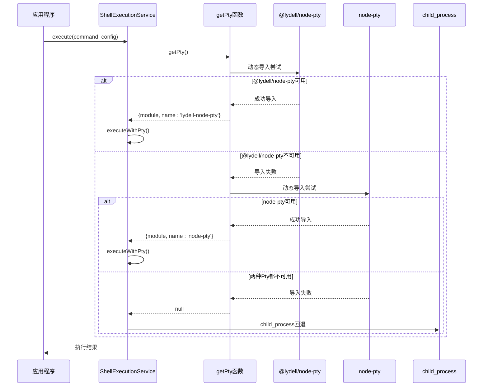
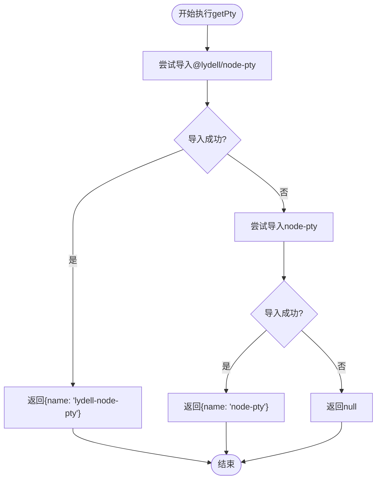
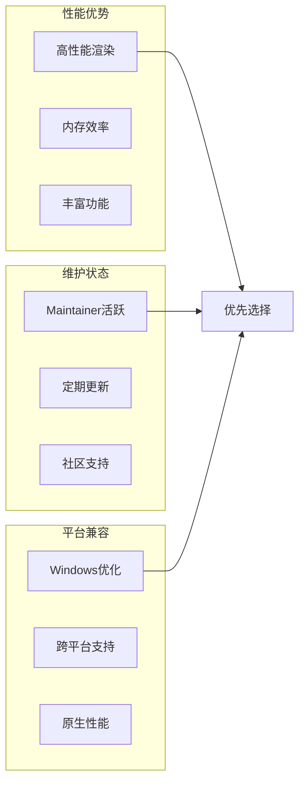
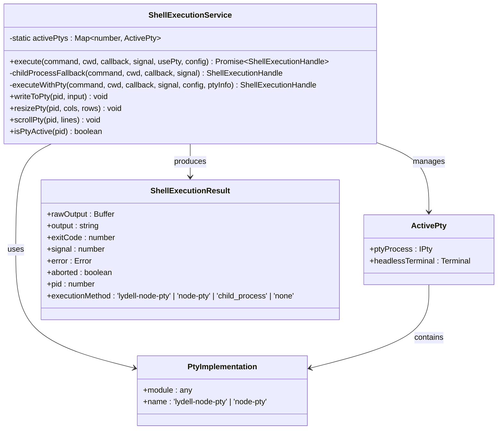
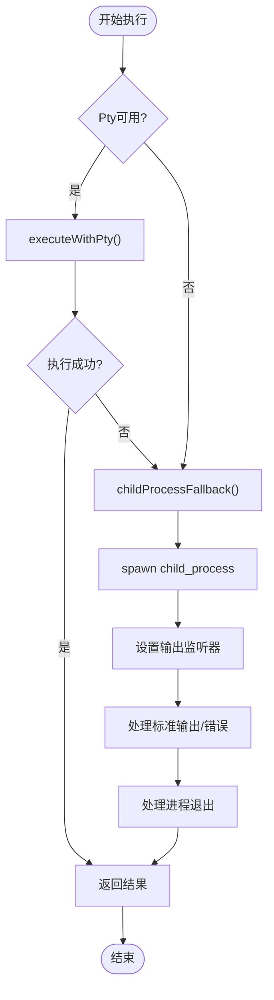

# Pty集成机制

<cite>
**本文档引用的文件**
- [getPty.ts](file://packages/core/src/utils/getPty.ts)
- [shellExecutionService.ts](file://packages/core/src/services/shellExecutionService.ts)
- [package.json](file://packages/core/package.json)
</cite>

## 目录
1. [简介](#简介)
2. [项目结构概览](#项目结构概览)
3. [核心组件分析](#核心组件分析)
4. [架构概览](#架构概览)
5. [详细组件分析](#详细组件分析)
6. [依赖关系分析](#依赖关系分析)
7. [性能考虑](#性能考虑)
8. [故障排除指南](#故障排除指南)
9. [结论](#结论)

## 简介

Pty集成机制是gemini-cli项目中的一个关键特性，它实现了动态导入`@lydell/node-pty`和`node-pty`两种Pty实现的优雅降级策略。该机制通过智能的模块检测和按需加载技术，确保在不同平台和环境下都能获得最佳的终端仿真体验。

这种设计不仅提高了系统的兼容性和可靠性，还通过延迟加载减少了启动开销，同时为Windows平台提供了专门的优化支持。

## 项目结构概览

Pty集成机制主要分布在以下关键文件中：

```mermaid
graph TB
subgraph "核心工具层"
getPty[getPty.ts<br/>动态导入逻辑]
Types[类型定义<br/>PtyImplementation]
end
subgraph "服务层"
ShellExec[shellExecutionService.ts<br/>执行服务]
ChildProc[child_process<br/>备选方案]
end
subgraph "依赖管理"
Package[package.json<br/>可选依赖]
Lydell[@lydell/node-pty<br/>高性能实现]
NodePty[node-pty<br/>传统实现]
end
getPty --> ShellExec
Types --> ShellExec
ShellExec --> ChildProc
Package --> Lydell
Package --> NodePty
ShellExec --> Lydell
ShellExec --> NodePty
```

**图表来源**
- [getPty.ts](file://packages/core/src/utils/getPty.ts#L1-L35)
- [shellExecutionService.ts](file://packages/core/src/services/shellExecutionService.ts#L1-L50)

**章节来源**
- [getPty.ts](file://packages/core/src/utils/getPty.ts#L1-L35)
- [shellExecutionService.ts](file://packages/core/src/services/shellExecutionService.ts#L1-L100)

## 核心组件分析

### PtyImplementation类型定义

PtyImplementation类型是整个Pty集成机制的核心抽象，它定义了两种可能的Pty实现：

```typescript
export type PtyImplementation = {
  // eslint-disable-next-line @typescript-eslint/no-explicit-any
  module: any;
  name: 'lydell-node-pty' | 'node-pty';
} | null;
```

这个类型定义具有以下特点：
- **灵活性**：使用`any`类型允许动态导入的模块保持类型安全
- **明确标识**：通过`name`字段明确区分不同的Pty实现
- **空值处理**：支持返回null作为降级标志

### PtyProcess接口规范

```typescript
export interface PtyProcess {
  readonly pid: number;
  onData(callback: (data: string) => void): void;
  onExit(callback: (e: { exitCode: number; signal?: number }) => void): void;
  kill(signal?: string): void;
}
```

该接口定义了Pty进程的标准操作：
- **进程管理**：通过PID识别和控制进程生命周期
- **数据流处理**：支持实时数据监听和回调机制
- **退出事件**：提供标准化的退出状态和信号处理

**章节来源**
- [getPty.ts](file://packages/core/src/utils/getPty.ts#L6-L15)

## 架构概览

Pty集成机制采用分层架构设计，实现了从底层模块检测到上层业务逻辑的完整流程：



**图表来源**
- [getPty.ts](file://packages/core/src/utils/getPty.ts#L17-L33)
- [shellExecutionService.ts](file://packages/core/src/services/shellExecutionService.ts#L120-L140)

## 详细组件分析

### getPty函数实现

getPty函数是整个Pty集成机制的核心，它实现了优雅降级策略：



**图表来源**
- [getPty.ts](file://packages/core/src/utils/getPty.ts#L17-L33)

#### 动态导入机制

getPty函数使用现代JavaScript的动态import()语法实现按需加载：

```typescript
export const getPty = async (): Promise<PtyImplementation> => {
  try {
    const lydell = '@lydell/node-pty';
    const module = await import(lydell);
    return { module, name: 'lydell-node-pty' };
  } catch (_e) {
    try {
      const nodePty = 'node-pty';
      const module = await import(nodePty);
      return { module, name: 'node-pty' };
    } catch (_e2) {
      return null;
    }
  }
};
```

这种实现方式的优势：
- **延迟加载**：只有在需要时才加载Pty模块，减少启动时间
- **错误隔离**：单个模块的导入失败不会影响整个应用
- **优雅降级**：自动选择可用的最佳实现

#### 优先选择@lydell/node-pty的原因

根据项目的依赖配置和实际实现，@lydell/node-pty被优先选择：



**图表来源**
- [package.json](file://packages/core/package.json#L60-L66)

**章节来源**
- [getPty.ts](file://packages/core/src/utils/getPty.ts#L17-L33)
- [package.json](file://packages/core/package.json#L60-L66)

### ShellExecutionService集成

ShellExecutionService是Pty集成机制的主要使用者，它实现了完整的命令执行流程：



**图表来源**
- [shellExecutionService.ts](file://packages/core/src/services/shellExecutionService.ts#L100-L150)
- [getPty.ts](file://packages/core/src/utils/getPty.ts#L6-L15)

#### 执行流程控制

ShellExecutionService通过`shouldUseNodePty`参数控制是否使用Pty功能：

```typescript
static async execute(
  commandToExecute: string,
  cwd: string,
  onOutputEvent: (event: ShellOutputEvent) => void,
  abortSignal: AbortSignal,
  shouldUseNodePty: boolean,
  shellExecutionConfig: ShellExecutionConfig,
): Promise<ShellExecutionHandle> {
  if (shouldUseNodePty) {
    const ptyInfo = await getPty();
    if (ptyInfo) {
      try {
        return this.executeWithPty(
          commandToExecute,
          cwd,
          onOutputEvent,
          abortSignal,
          shellExecutionConfig,
          ptyInfo,
        );
      } catch (_e) {
        // Fallback to child_process
      }
    }
  }
  
  return this.childProcessFallback(
    commandToExecute,
    cwd,
    onOutputEvent,
    abortSignal,
  );
}
```

这种设计实现了：
- **条件执行**：只有在启用Pty时才尝试使用
- **异常容错**：即使Pty执行失败也能正常回退
- **统一接口**：无论使用哪种实现，对外接口保持一致

**章节来源**
- [shellExecutionService.ts](file://packages/core/src/services/shellExecutionService.ts#L120-L140)

### 备选方案：child_process

当Pty实现都不可用时，系统会自动回退到node:child_process：



**图表来源**
- [shellExecutionService.ts](file://packages/core/src/services/shellExecutionService.ts#L140-L160)

**章节来源**
- [shellExecutionService.ts](file://packages/core/src/services/shellExecutionService.ts#L140-L160)

## 依赖关系分析

Pty集成机制的依赖关系体现了清晰的分层架构：

```mermaid
graph TB
subgraph "外部依赖"
NodeModules[node_modules]
OptionalDeps[可选依赖]
end
subgraph "核心模块"
getPtyModule[getPty模块]
ShellService[ShellExecutionService]
end
subgraph "Pty实现"
LydellPty[@lydell/node-pty]
NodePtyImpl[node-pty]
end
subgraph "系统依赖"
ChildProcess[child_process]
OS[操作系统]
end
getPtyModule --> LydellPty
getPtyModule --> NodePtyImpl
ShellService --> getPtyModule
ShellService --> ChildProcess
LydellPty --> NodeModules
NodePtyImpl --> NodeModules
ChildProcess --> OS
```

**图表来源**
- [package.json](file://packages/core/package.json#L60-L66)
- [getPty.ts](file://packages/core/src/utils/getPty.ts#L1-L35)

### 可选依赖配置

项目通过optionalDependencies字段声明了两个Pty实现：

```json
{
  "optionalDependencies": {
    "@lydell/node-pty": "1.1.0",
    "@lydell/node-pty-darwin-arm64": "1.1.0",
    "@lydell/node-pty-darwin-x64": "1.1.0",
    "@lydell/node-pty-linux-x64": "1.1.0",
    "@lydell/node-pty-win32-arm64": "1.1.0",
    "@lydell/node-pty-win32-x64": "1.1.0",
    "node-pty": "^1.0.0"
  }
}
```

这种配置的优势：
- **平台特定**：针对不同操作系统提供优化版本
- **可选安装**：即使某些平台不支持，也不会影响整体安装
- **版本锁定**：确保使用的Pty版本稳定性

**章节来源**
- [package.json](file://packages/core/package.json#L60-L66)

## 性能考虑

### 启动时间优化

Pty集成机制通过以下策略优化启动性能：

1. **延迟加载**：只有在真正需要时才导入Pty模块
2. **缓存机制**：首次成功导入后，后续调用直接使用缓存
3. **渐进式降级**：避免阻塞式的错误处理

### 内存使用优化

- **模块卸载**：不再使用的Pty模块可以被垃圾回收
- **事件清理**：及时移除事件监听器防止内存泄漏
- **资源管理**：通过AbortSignal机制优雅终止进程

### 平台特定优化

- **Windows优化**：@lydell/node-pty在Windows平台上表现更优
- **ARM支持**：为Apple Silicon提供专门的优化版本
- **跨平台兼容**：确保在所有目标平台上正常工作

## 故障排除指南

### 常见问题及解决方案

#### 1. Pty模块导入失败

**症状**：getPty函数返回null，使用child_process回退

**可能原因**：
- 网络问题导致模块下载失败
- 操作系统不支持特定的Pty版本
- 权限问题无法访问本地模块

**解决方案**：
```typescript
// 检查网络连接
// 验证操作系统兼容性
// 检查文件权限
// 手动安装缺失的Pty版本
```

#### 2. 进程管理问题

**症状**：子进程无法正确终止或产生僵尸进程

**解决方案**：
```typescript
// 使用AbortSignal进行优雅终止
const abortController = new AbortController();
// 在适当时候调用 abortController.abort()
```

#### 3. 输出编码问题

**症状**：非UTF-8字符显示异常

**解决方案**：
```typescript
// 自动检测编码并正确解码
const encoding = getCachedEncodingForBuffer(data);
const decoder = new TextDecoder(encoding);
```

**章节来源**
- [shellExecutionService.ts](file://packages/core/src/services/shellExecutionService.ts#L530-L570)

## 结论

Pty集成机制展现了现代JavaScript应用程序中优雅降级策略的最佳实践。通过精心设计的类型系统、动态导入机制和分层架构，该系统实现了：

1. **高兼容性**：支持多种Pty实现和操作系统
2. **高性能**：优先选择最优的Pty实现
3. **容错性**：自动降级到可靠的备选方案
4. **可维护性**：清晰的代码结构和完善的错误处理

这种设计不仅解决了当前的技术挑战，也为未来的扩展和优化奠定了坚实的基础。通过持续监控和改进，Pty集成机制将继续为用户提供稳定可靠的终端仿真体验。