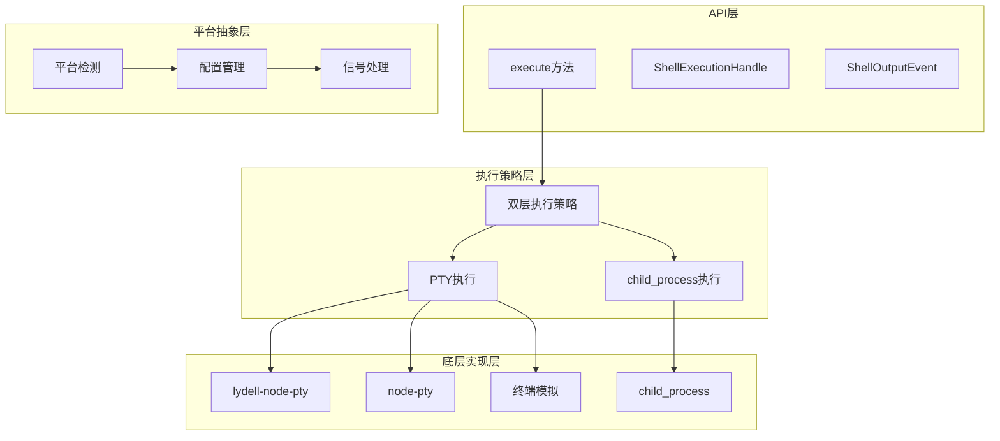
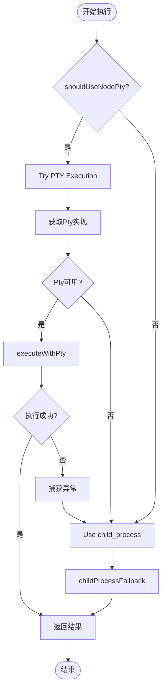
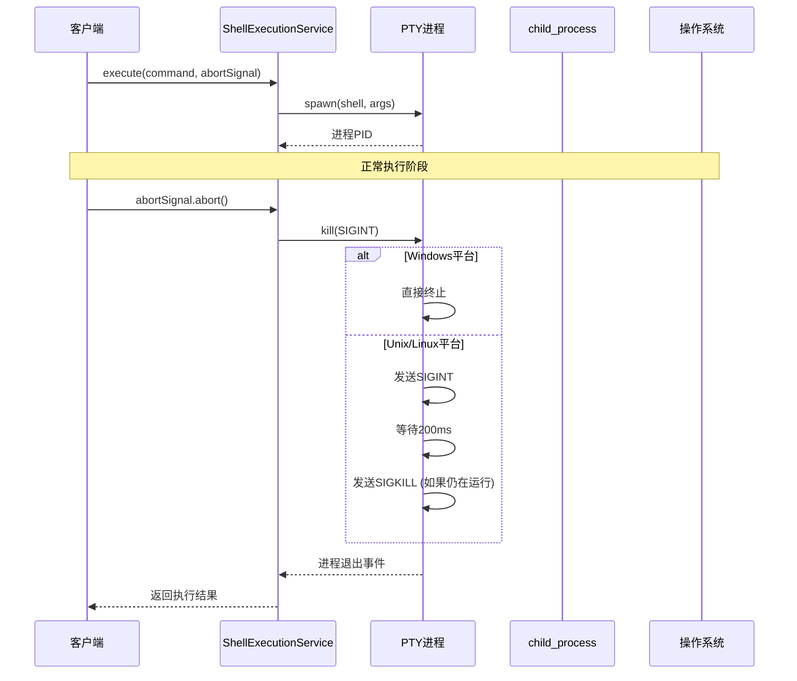
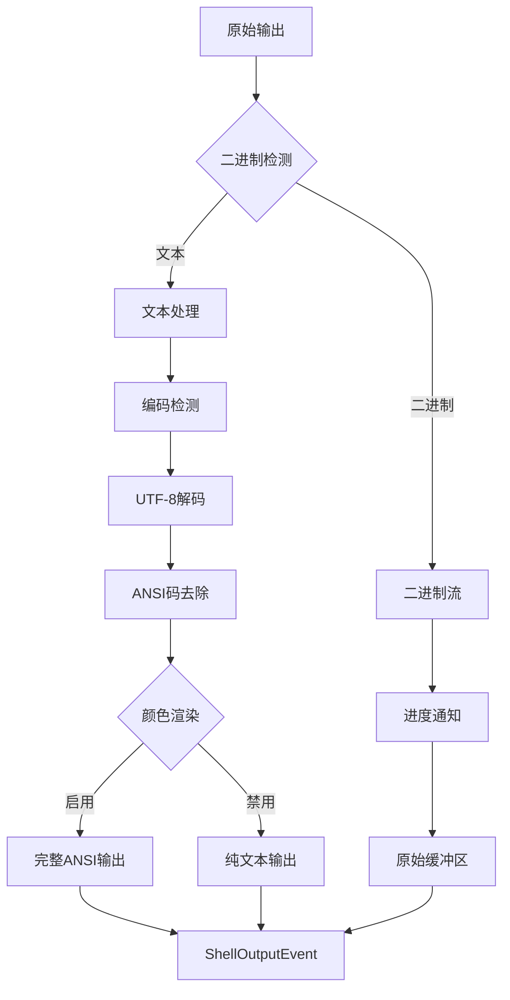
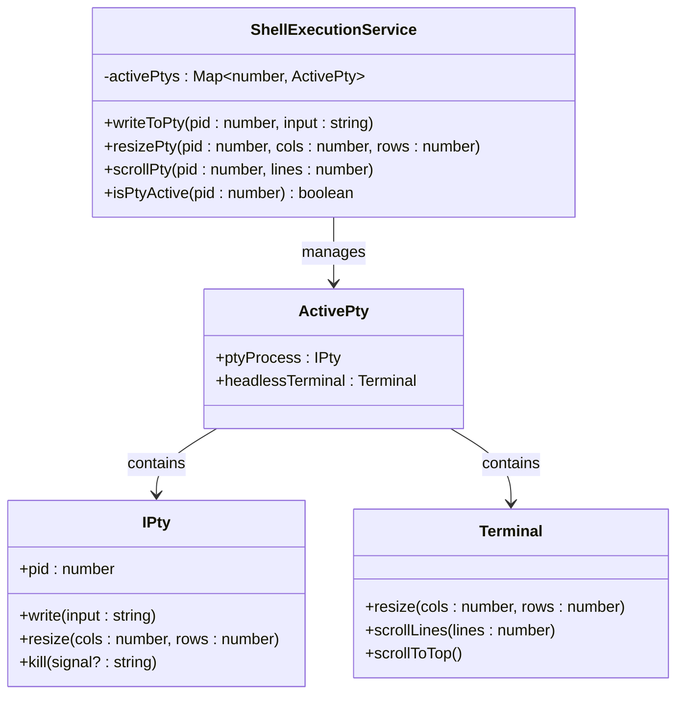

# Shell执行机制

<cite>
**本文档中引用的文件**
- [shellExecutionService.ts](file://packages/core/src/services/shellExecutionService.ts)
- [getPty.ts](file://packages/core/src/utils/getPty.ts)
- [shellExecutionService.test.ts](file://packages/core/src/services/shellExecutionService.test.ts)
- [package.json](file://packages/core/package.json)
- [run_shell_command.test.ts](file://integration-tests/run_shell_command.test.ts)
</cite>

## 目录
1. [简介](#简介)
2. [项目结构](#项目结构)
3. [核心组件](#核心组件)
4. [架构概览](#架构概览)
5. [详细组件分析](#详细组件分析)
6. [依赖关系分析](#依赖关系分析)
7. [性能考虑](#性能考虑)
8. [故障排除指南](#故障排除指南)
9. [结论](#结论)

## 简介

ShellExecutionService是Gemini CLI的核心组件，负责在跨平台环境中安全、高效地执行Shell命令。该服务采用双层执行策略：优先使用Pty（伪终端）以获得完整的终端控制能力，当Pty不可用时自动降级到child_process。这种设计确保了在各种环境下的可靠性和兼容性。

该服务的主要特点包括：
- **双层执行策略**：优先使用Pty，失败时自动降级
- **动态Pty实现**：支持lydell-node-pty和node-pty两种实现
- **跨平台兼容**：Windows、Linux、macOS全平台支持
- **优雅终止**：通过AbortSignal实现命令取消
- **信号处理**：智能的进程组管理和跨平台终止策略
- **输出流控制**：支持ANSI颜色输出和二进制数据检测

## 项目结构

ShellExecutionService位于Gemini CLI项目的`packages/core/src/services/`目录下，与其他核心服务紧密集成：

```mermaid
graph TB
subgraph "核心包结构"
Core[packages/core]
Services[services/]
Utils[utils/]
Tools[tools/]
end
subgraph "Shell执行相关文件"
SES[shellExecutionService.ts]
GetPty[getPty.ts]
Tests[shellExecutionService.test.ts]
UtilsFiles[其他工具函数]
end
subgraph "外部依赖"
NodePty[node-pty]
LydellPty[@lydell/node-pty]
XTerm[@xterm/headless]
end
Core --> Services
Services --> SES
Utils --> GetPty
Services --> Tests
SES --> GetPty
SES --> XTerm
GetPty -.-> NodePty
GetPty -.-> LydellPty
```

**图表来源**
- [shellExecutionService.ts](file://packages/core/src/services/shellExecutionService.ts#L1-L50)
- [getPty.ts](file://packages/core/src/utils/getPty.ts#L1-L35)

**章节来源**
- [shellExecutionService.ts](file://packages/core/src/services/shellExecutionService.ts#L1-L682)
- [package.json](file://packages/core/package.json#L1-L92)

## 核心组件

### ShellExecutionService类

ShellExecutionService是一个静态类，提供了统一的Shell命令执行接口。它封装了复杂的跨平台逻辑，为上层应用提供简洁的API。

```typescript
export class ShellExecutionService {
  private static activePtys = new Map<number, ActivePty>();
  
  static async execute(
    commandToExecute: string,
    cwd: string,
    onOutputEvent: (event: ShellOutputEvent) => void,
    abortSignal: AbortSignal,
    shouldUseNodePty: boolean,
    shellExecutionConfig: ShellExecutionConfig,
  ): Promise<ShellExecutionHandle>
}
```

### PtyImplementation动态导入机制

系统通过动态导入机制支持多种Pty实现，确保在不同环境下都能找到可用的PTY库：

```typescript
export const getPty = async (): Promise<PtyImplementation> => {
  try {
    const lydell = '@lydell/node-pty';
    const module = await import(lydell);
    return { module, name: 'lydell-node-pty' };
  } catch (_e) {
    try {
      const nodePty = 'node-pty';
      const module = await import(nodePty);
      return { module, name: 'node-pty' };
    } catch (_e2) {
      return null;
    }
  }
};
```

**章节来源**
- [shellExecutionService.ts](file://packages/core/src/services/shellExecutionService.ts#L106-L150)
- [getPty.ts](file://packages/core/src/utils/getPty.ts#L18-L34)

## 架构概览

ShellExecutionService采用分层架构设计，从上到下分为API层、执行策略层、平台抽象层和底层实现层：



**图表来源**
- [shellExecutionService.ts](file://packages/core/src/services/shellExecutionService.ts#L106-L150)
- [getPty.ts](file://packages/core/src/utils/getPty.ts#L18-L34)

## 详细组件分析

### 双层执行策略

ShellExecutionService的核心创新在于其双层执行策略，这种设计确保了在任何环境下都能成功执行命令：



**图表来源**
- [shellExecutionService.ts](file://packages/core/src/services/shellExecutionService.ts#L118-L140)

#### PTY执行策略

当Pty可用时，系统会使用以下配置参数：

```typescript
private static executeWithPty(
  commandToExecute: string,
  cwd: string,
  onOutputEvent: (event: ShellOutputEvent) => void,
  abortSignal: AbortSignal,
  shellExecutionConfig: ShellExecutionConfig,
  ptyInfo: PtyImplementation,
): ShellExecutionHandle {
  const cols = shellExecutionConfig.terminalWidth ?? 80;
  const rows = shellExecutionConfig.terminalHeight ?? 30;
  const isWindows = os.platform() === 'win32';
  const shell = isWindows ? 'cmd.exe' : 'bash';
  const args = isWindows
    ? `/c ${commandToExecute}`
    : ['-c', commandToExecute];
}
```

#### child_process回退策略

当Pty不可用或执行失败时，系统会自动降级到child_process：

```typescript
private static childProcessFallback(
  commandToExecute: string,
  cwd: string,
  onOutputEvent: (event: ShellOutputEvent) => void,
  abortSignal: AbortSignal,
): ShellExecutionHandle {
  const isWindows = os.platform() === 'win32';
  const child = cpSpawn(commandToExecute, [], {
    cwd,
    stdio: ['ignore', 'pipe', 'pipe'],
    windowsVerbatimArguments: true,
    shell: isWindows ? true : 'bash',
    detached: !isWindows,
    env: {
      ...process.env,
      GEMINI_CLI: '1',
      TERM: 'xterm-256color',
      PAGER: 'cat',
    },
  });
}
```

**章节来源**
- [shellExecutionService.ts](file://packages/core/src/services/shellExecutionService.ts#L152-L350)
- [shellExecutionService.ts](file://packages/core/src/services/shellExecutionService.ts#L352-L682)

### 信号处理与进程管理

ShellExecutionService实现了智能的信号处理机制，能够根据不同平台选择合适的终止策略：



**图表来源**
- [shellExecutionService.ts](file://packages/core/src/services/shellExecutionService.ts#L580-L620)
- [shellExecutionService.ts](file://packages/core/src/services/shellExecutionService.ts#L420-L470)

#### 跨平台终止策略

系统根据操作系统类型选择不同的终止策略：

```typescript
const abortHandler = async () => {
  if (ptyProcess.pid && !exited) {
    if (os.platform() === 'win32') {
      ptyProcess.kill();
    } else {
      try {
        // Kill the entire process group
        process.kill(-ptyProcess.pid, 'SIGINT');
      } catch (_e) {
        // Fallback to killing just the process if the group kill fails
        ptyProcess.kill('SIGINT');
      }
    }
  }
};
```

对于child_process，系统使用更复杂的终止策略：

```typescript
const abortHandler = async () => {
  if (child.pid && !exited) {
    if (isWindows) {
      cpSpawn('taskkill', ['/pid', child.pid.toString(), '/f', '/t']);
    } else {
      try {
        process.kill(-child.pid, 'SIGTERM');
        await new Promise((res) => setTimeout(res, SIGKILL_TIMEOUT_MS));
        if (!exited) {
          process.kill(-child.pid, 'SIGKILL');
        }
      } catch (_e) {
        if (!exited) child.kill('SIGKILL');
      }
    }
  }
};
```

**章节来源**
- [shellExecutionService.ts](file://packages/core/src/services/shellExecutionService.ts#L580-L620)
- [shellExecutionService.ts](file://packages/core/src/services/shellExecutionService.ts#L420-L470)

### 输出处理与ANSI渲染

ShellExecutionService支持复杂的输出处理，包括ANSI颜色码处理和二进制数据检测：



**图表来源**
- [shellExecutionService.ts](file://packages/core/src/services/shellExecutionService.ts#L280-L320)
- [shellExecutionService.ts](file://packages/core/src/services/shellExecutionService.ts#L480-L520)

#### ANSI输出渲染

系统支持两种输出模式：

1. **彩色输出模式**：保留所有ANSI格式化信息
2. **纯文本模式**：去除所有ANSI格式化信息

```typescript
// 彩色输出渲染
if (shellExecutionConfig.showColor) {
  newOutput = serializeTerminalToObject(headlessTerminal);
} else {
  // 去除ANSI码的纯文本渲染
  const buffer = headlessTerminal.buffer.active;
  const lines: AnsiOutput = [];
  for (let y = 0; y < headlessTerminal.rows; y++) {
    const line = buffer.getLine(buffer.viewportY + y);
    const lineContent = line ? line.translateToString(true) : '';
    lines.push([{ text: lineContent, bold: false, italic: false, ... }]);
  }
  newOutput = lines;
}
```

**章节来源**
- [shellExecutionService.ts](file://packages/core/src/services/shellExecutionService.ts#L280-L320)
- [shellExecutionService.ts](file://packages/core/src/services/shellExecutionService.ts#L480-L520)

### 终端交互功能

ShellExecutionService提供了丰富的终端交互功能，包括输入写入、尺寸调整和滚动控制：



**图表来源**
- [shellExecutionService.ts](file://packages/core/src/services/shellExecutionService.ts#L622-L682)

#### 输入写入功能

```typescript
static writeToPty(pid: number, input: string): void {
  if (!this.isPtyActive(pid)) {
    return;
  }

  const activePty = this.activePtys.get(pid);
  if (activePty) {
    activePty.ptyProcess.write(input);
  }
}
```

#### 尺寸调整功能

```typescript
static resizePty(pid: number, cols: number, rows: number): void {
  if (!this.isPtyActive(pid)) {
    return;
  }

  const activePty = this.activePtys.get(pid);
  if (activePty) {
    try {
      activePty.ptyProcess.resize(cols, rows);
      activePty.headlessTerminal.resize(cols, rows);
    } catch (e) {
      // 忽略ESRCH错误，表示PTY已退出
      if (e instanceof Error && 'code' in e && e.code === 'ESRCH') {
        // ignore
      } else {
        throw e;
      }
    }
  }
}
```

**章节来源**
- [shellExecutionService.ts](file://packages/core/src/services/shellExecutionService.ts#L622-L682)

## 依赖关系分析

ShellExecutionService的依赖关系体现了其模块化设计和可扩展性：

```mermaid
graph LR
subgraph "内部依赖"
SES[ShellExecutionService]
GetPty[getPty工具]
Terminal[终端序列化]
Encoding[编码检测]
TextUtils[文本工具]
end
subgraph "外部依赖"
NodePty[node-pty]
LydellPty[@lydell/node-pty]
XTerm[@xterm/headless]
ChildProcess[child_process]
StripAnsi[strip-ansi]
end
subgraph "平台依赖"
OS[node:os]
Process[node:process]
end
SES --> GetPty
SES --> Terminal
SES --> Encoding
SES --> TextUtils
SES --> NodePty
SES --> LydellPty
SES --> XTerm
SES --> ChildProcess
SES --> StripAnsi
SES --> OS
SES --> Process
GetPty -.-> NodePty
GetPty -.-> LydellPty
```

**图表来源**
- [shellExecutionService.ts](file://packages/core/src/services/shellExecutionService.ts#L1-L15)
- [getPty.ts](file://packages/core/src/utils/getPty.ts#L1-L15)
- [package.json](file://packages/core/package.json#L40-L55)

### 关键依赖说明

1. **@lydell/node-pty**：高性能的PTY实现，支持多平台
2. **node-pty**：标准的PTY实现，作为备用选项
3. **@xterm/headless**：无界面的终端模拟器
4. **strip-ansi**：ANSI码去除工具
5. **child_process**：Node.js原生子进程模块

**章节来源**
- [package.json](file://packages/core/package.json#L40-L55)
- [shellExecutionService.ts](file://packages/core/src/services/shellExecutionService.ts#L1-L15)

## 性能考虑

### 内存管理

ShellExecutionService通过Map结构管理活跃的PTY进程，避免内存泄漏：

```typescript
private static activePtys = new Map<number, ActivePty>();

// 在进程退出时清理资源
ptyProcess.onExit(({ exitCode, signal }: { exitCode: number; signal?: number }) => {
  this.activePtys.delete(ptyProcess.pid);
});
```

### 渲染优化

系统使用防抖机制优化终端渲染性能：

```typescript
const render = (finalRender = false) => {
  if (renderTimeout) {
    clearTimeout(renderTimeout);
  }

  const renderFn = () => {
    // 渲染逻辑
  };

  if (finalRender) {
    renderFn();
  } else {
    renderTimeout = setTimeout(renderFn, 17); // ~60fps
  }
};
```

### 编码优化

系统智能检测输出编码，避免不必要的解码操作：

```typescript
if (!decoder) {
  const encoding = getCachedEncodingForBuffer(data);
  try {
    decoder = new TextDecoder(encoding);
  } catch {
    decoder = new TextDecoder('utf-8');
  }
}
```

## 故障排除指南

### 常见问题与解决方案

#### PTY加载失败

**症状**：Pty无法加载，导致执行降级到child_process

**原因**：
1. 缺少必要的编译依赖
2. 平台不支持特定的PTY实现
3. 权限问题

**解决方案**：
```typescript
// 检查PTY可用性
const ptyInfo = await getPty();
if (!ptyInfo) {
  console.warn('PTY not available, falling back to child_process');
}
```

#### 信号处理问题

**症状**：命令无法正常终止

**原因**：
1. 进程组管理失败
2. 信号被应用程序拦截
3. 平台限制

**解决方案**：
```typescript
// 使用进程组终止（Unix/Linux）
try {
  process.kill(-pid, 'SIGTERM');
} catch (_e) {
  // 回退到单个进程终止
  process.kill(pid, 'SIGKILL');
}
```

#### 输出编码问题

**症状**：中文等多字节字符显示乱码

**原因**：
1. 编码检测失败
2. 解码器配置错误
3. 数据传输中断

**解决方案**：
```typescript
// 多字节字符处理
const multiByteChar = '你好';
pty.onData(multiByteChar.slice(0, 1)); // 先发送第一个字节
pty.onData(multiByteChar.slice(1));     // 再发送剩余部分
```

**章节来源**
- [shellExecutionService.ts](file://packages/core/src/services/shellExecutionService.ts#L580-L620)
- [shellExecutionService.ts](file://packages/core/src/services/shellExecutionService.ts#L420-L470)

## 结论

ShellExecutionService展现了现代Node.js应用中复杂系统设计的最佳实践。通过双层执行策略、智能的信号处理和丰富的终端交互功能，它成功解决了跨平台Shell命令执行中的诸多挑战。

### 主要优势

1. **可靠性**：双层执行策略确保了在任何环境下的可用性
2. **性能**：智能的渲染优化和内存管理保证了良好的性能表现
3. **兼容性**：支持多种PTY实现和输出格式
4. **安全性**：完善的信号处理和进程管理防止了僵尸进程
5. **可扩展性**：模块化设计便于添加新功能和适配新平台

### 技术亮点

- **动态依赖管理**：自动选择最优的PTY实现
- **优雅的错误处理**：捕获并处理各种异常情况
- **跨平台抽象**：统一的API接口隐藏平台差异
- **实时输出流**：支持增量式输出和ANSI格式化
- **交互式终端**：完整的终端模拟和用户输入支持

ShellExecutionService不仅是一个实用的工具，更是展示了如何在复杂的异步环境中构建健壮、高效的系统组件。它的设计思想和实现技巧对于类似项目的开发具有重要的参考价值。