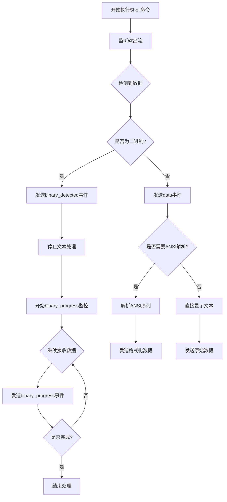
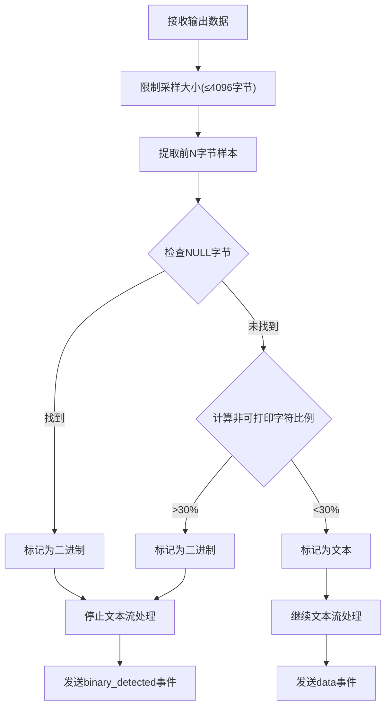
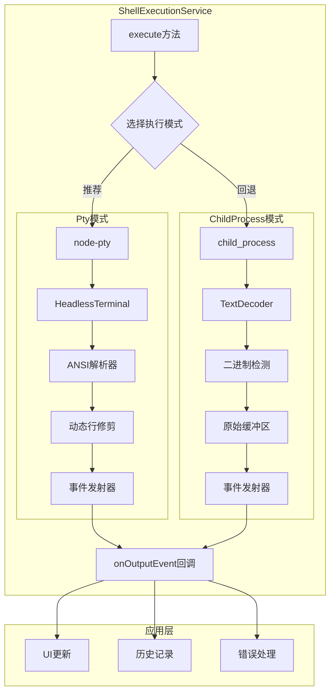
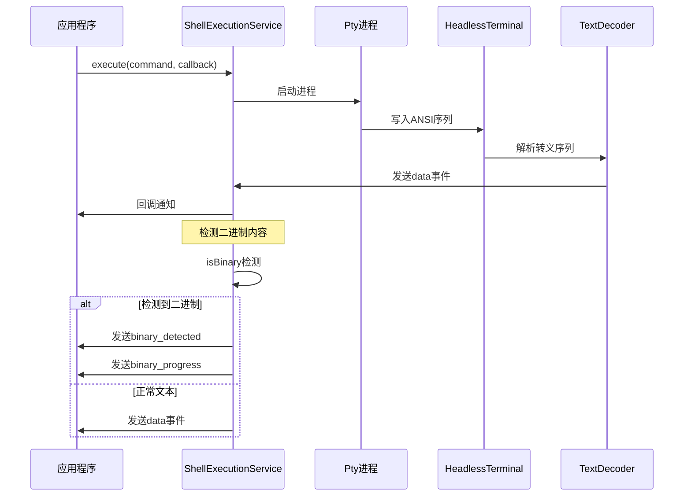
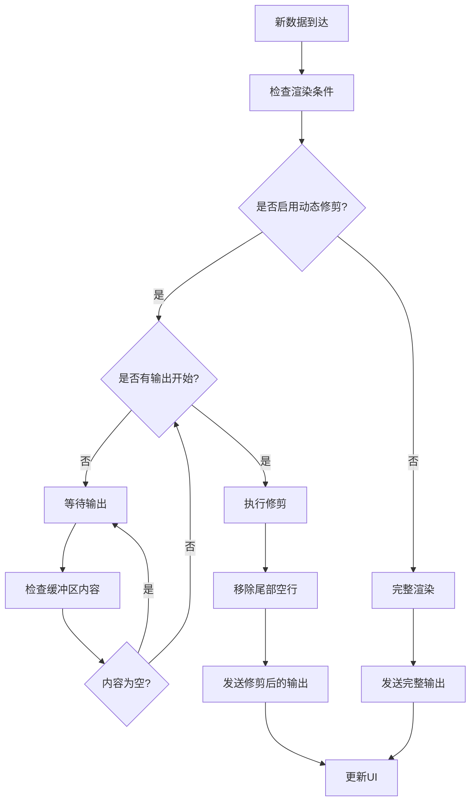
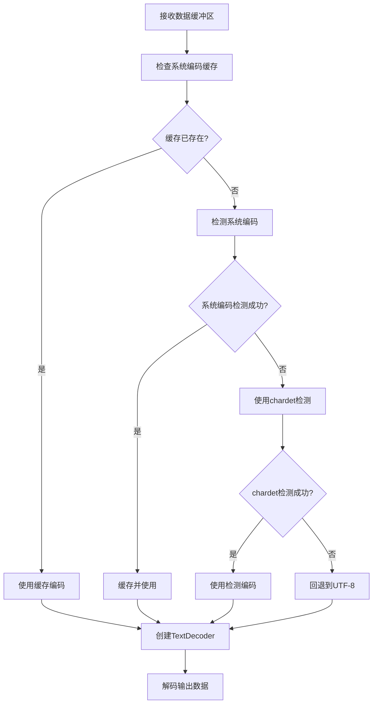

# 输出流处理与二进制检测

<cite>
**本文档中引用的文件**
- [shellExecutionService.ts](file://packages/core/src/services/shellExecutionService.ts)
- [textUtils.ts](file://packages/core/src/utils/textUtils.ts)
- [systemEncoding.ts](file://packages/core/src/utils/systemEncoding.ts)
- [terminalSerializer.ts](file://packages/core/src/utils/terminalSerializer.ts)
- [shellCommandProcessor.ts](file://packages/cli/src/ui/hooks/shellCommandProcessor.ts)
- [shell.ts](file://packages/core/src/tools/shell.ts)
- [shellExecutionService.test.ts](file://packages/core/src/services/shellExecutionService.test.ts)
- [shellCommandProcessor.test.ts](file://packages/cli/src/ui/hooks/shellCommandProcessor.test.ts)
</cite>

## 目录
1. [简介](#简介)
2. [ShellOutputEvent联合类型设计](#shelloutputevent联合类型设计)
3. [二进制内容检测机制](#二进制内容检测机制)
4. [流式输出处理架构](#流式输出处理架构)
5. [Pty模式与ChildProcess模式对比](#ptymode与childprocessmode对比)
6. [ANSI转义序列解析与动态行修剪](#ansi转义序列解析与动态行修剪)
7. [非UTF-8编码处理](#非utf-8编码处理)
8. [性能优化策略](#性能优化策略)
9. [故障排除指南](#故障排除指南)
10. [总结](#总结)

## 简介

ShellExecutionService是Gemini CLI的核心组件，负责执行shell命令并提供结构化的流式输出处理。该服务通过onOutputEvent回调实现了先进的二进制检测和流式输出管理，能够智能地识别二进制内容并切换到适当的处理模式。

本文档深入分析了ShellExecutionService如何通过ShellOutputEvent联合类型实现结构化的流式输出，包括二进制检测机制、ANSI转义序列解析、动态行修剪等高级功能。

## ShellOutputEvent联合类型设计

ShellOutputEvent是一个精心设计的联合类型，提供了三种不同的事件类型来处理各种输出场景：

```typescript
export type ShellOutputEvent =
  | {
      /** 包含输出数据块的事件 */
      type: 'data';
      /** 解码后的字符串块 */
      chunk: string | AnsiOutput;
    }
  | {
      /** 标识输出流已被识别为二进制 */
      type: 'binary_detected';
    }
  | {
      /** 为二进制流提供进度更新 */
      type: 'binary_progress';
      /** 到目前为止接收的总字节数 */
      bytesReceived: number;
    };
```

### 设计理念

1. **类型安全**: 使用TypeScript联合类型确保编译时类型检查
2. **语义明确**: 每种事件类型都有清晰的用途和含义
3. **扩展性**: 新的事件类型可以轻松添加而不破坏现有代码
4. **实用性**: 针对不同输出场景提供专门的处理逻辑

### 使用场景

- **'data'事件**: 处理正常的文本输出和ANSI格式化内容
- **'binary_detected'事件**: 当检测到二进制内容时立即通知
- **'binary_progress'事件**: 在二进制流传输过程中提供实时进度反馈



**图表来源**
- [shellExecutionService.ts](file://packages/core/src/services/shellExecutionService.ts#L63-L77)

**章节来源**
- [shellExecutionService.ts](file://packages/core/src/services/shellExecutionService.ts#L63-L77)

## 二进制内容检测机制

### 基于前4096字节的检测算法

ShellExecutionService采用启发式方法检测二进制内容，通过分析前4096字节的数据来判断输出类型：

```typescript
export function isBinary(
  data: Buffer | null | undefined,
  sampleSize = 512,
): boolean {
  if (!data) {
    return false;
  }

  const sample = data.length > sampleSize ? data.subarray(0, sampleSize) : data;

  for (const byte of sample) {
    // NULL字节的存在是最可靠的二进制文件指示器
    if (byte === 0) {
      return true;
    }
  }

  // 如果样本中没有发现NULL字节，则假设为文本
  return false;
}
```

### 检测流程



**图表来源**
- [textUtils.ts](file://packages/core/src/utils/textUtils.ts#L28-L55)

### BOM感知检测

系统还支持Unicode BOM（Byte Order Mark）检测，避免将UTF-16/32编码的文件误判为二进制：

```typescript
// BOM → 文本（避免UTF-16/32带null的假阳性）
const bom = detectBOM(buf.subarray(0, Math.min(4, bytesRead)));
if (bom) return false;
```

这种设计确保了：
- **准确性**: 避免误报UTF编码的文本文件
- **兼容性**: 支持多种Unicode编码格式
- **性能**: 只在必要时进行复杂检测

**章节来源**
- [textUtils.ts](file://packages/core/src/utils/textUtils.ts#L28-L55)
- [shellExecutionService.ts](file://packages/core/src/services/shellExecutionService.ts#L205-L242)

## 流式输出处理架构

### 整体架构设计

ShellExecutionService采用分层架构处理不同类型的输出流：



**图表来源**
- [shellExecutionService.ts](file://packages/core/src/services/shellExecutionService.ts#L85-L120)

### 事件驱动的处理流程



**图表来源**
- [shellExecutionService.ts](file://packages/core/src/services/shellExecutionService.ts#L300-L400)

**章节来源**
- [shellExecutionService.ts](file://packages/core/src/services/shellExecutionService.ts#L85-L682)

## Pty模式与ChildProcess模式对比

### 执行模式选择

ShellExecutionService根据配置和可用性自动选择最适合的执行模式：

```typescript
static async execute(
  commandToExecute: string,
  cwd: string,
  onOutputEvent: (event: ShellOutputEvent) => void,
  abortSignal: AbortSignal,
  shouldUseNodePty: boolean,
  shellExecutionConfig: ShellExecutionConfig,
): Promise<ShellExecutionHandle> {
  if (shouldUseNodePty) {
    const ptyInfo = await getPty();
    if (ptyInfo) {
      try {
        return this.executeWithPty(/* ... */);
      } catch (_e) {
        // 回退到child_process
      }
    }
  }
  
  return this.childProcessFallback(/* ... */);
}
```

### 模式特性对比

| 特性 | Pty模式 | ChildProcess模式 |
|------|---------|------------------|
| **ANSI支持** | 完整支持 | 基础支持 |
| **动态行修剪** | 支持 | 不支持 |
| **内存效率** | 较高 | 较低 |
| **跨平台兼容性** | 良好 | 优秀 |
| **性能** | 中等 | 高 |
| **调试能力** | 强大 | 基础 |

### 平台特定行为

```typescript
// Windows平台
const isWindows = os.platform() === 'win32';
const shell = isWindows ? 'cmd.exe' : 'bash';
const args = isWindows
  ? `/c ${commandToExecute}`
  : ['-c', commandToExecute];

// Linux/macOS平台
const child = cpSpawn(commandToExecute, [], {
  cwd,
  stdio: ['ignore', 'pipe', 'pipe'],
  shell: 'bash',
  detached: true,
});
```

**章节来源**
- [shellExecutionService.ts](file://packages/core/src/services/shellExecutionService.ts#L120-L180)

## ANSI转义序列解析与动态行修剪

### HeadlessTerminal架构

Pty模式使用@xterm/headless包创建无头终端，提供完整的ANSI转义序列解析：

```typescript
const headlessTerminal = new Terminal({
  allowProposedApi: true,
  cols,
  rows,
});
headlessTerminal.scrollToTop();
```

### ANSI输出格式化

系统将ANSI转义序列转换为结构化的输出格式：

```typescript
export interface AnsiToken {
  text: string;
  bold: boolean;
  italic: boolean;
  underline: boolean;
  dim: boolean;
  inverse: boolean;
  fg: string;
  bg: string;
}

export type AnsiOutput = AnsiLine[];
export type AnsiLine = AnsiToken[];
```

### 动态行修剪机制

为了提高性能和用户体验，系统实现了智能的动态行修剪：

```typescript
const render = (finalRender = false) => {
  if (!isStreamingRawContent) {
    return;
  }

  if (!shellExecutionConfig.disableDynamicLineTrimming) {
    if (!hasStartedOutput) {
      const bufferText = getFullBufferText(headlessTerminal);
      if (bufferText.trim().length === 0) {
        return;
      }
      hasStartedOutput = true;
    }
  }

  // 获取当前终端状态
  let newOutput: AnsiOutput;
  if (shellExecutionConfig.showColor) {
    newOutput = serializeTerminalToObject(headlessTerminal);
  } else {
    // 禁用颜色时的简化处理
    newOutput = /* ... */;
  }

  // 移除空行
  let lastNonEmptyLine = -1;
  for (let i = newOutput.length - 1; i >= 0; i--) {
    const line = newOutput[i];
    if (line.map(segment => segment.text).join('').trim().length > 0) {
      lastNonEmptyLine = i;
      break;
    }
  }

  const trimmedOutput = newOutput.slice(0, lastNonEmptyLine + 1);
};
```

### 渲染优化策略



**图表来源**
- [shellExecutionService.ts](file://packages/core/src/services/shellExecutionService.ts#L350-L450)

**章节来源**
- [shellExecutionService.ts](file://packages/core/src/services/shellExecutionService.ts#L350-L500)
- [terminalSerializer.ts](file://packages/core/src/utils/terminalSerializer.ts#L100-L200)

## 非UTF-8编码处理

### 编码检测与缓存

系统实现了智能的编码检测机制，优先使用系统编码，然后回退到缓冲区检测：

```typescript
export function getCachedEncodingForBuffer(buffer: Buffer): string {
  // 缓存系统编码检测结果，避免重复系统调用
  if (cachedSystemEncoding === undefined) {
    cachedSystemEncoding = getSystemEncoding();
  }

  // 如果有缓存的系统编码，使用它
  if (cachedSystemEncoding) {
    return cachedSystemEncoding;
  }

  // 否则，从这个特定缓冲区检测编码（不缓存此结果）
  return detectEncodingFromBuffer(buffer) || 'utf-8';
}
```

### 系统编码检测

```typescript
export function getSystemEncoding(): string | null {
  // Windows平台
  if (os.platform() === 'win32') {
    try {
      const output = execSync('chcp', { encoding: 'utf8' });
      const match = output.match(/:\s*(\d+)/);
      if (match) {
        const codePage = parseInt(match[1], 10);
        if (!isNaN(codePage)) {
          return windowsCodePageToEncoding(codePage);
        }
      }
    } catch (error) {
      console.warn('Failed to get Windows code page using "chcp" command');
    }
    return null;
  }

  // Unix-like平台
  const env = process.env;
  let locale = env['LC_ALL'] || env['LC_CTYPE'] || env['LANG'] || '';

  if (!locale) {
    try {
      locale = execSync('locale charmap', { encoding: 'utf8' }).toString().trim();
    } catch (_e) {
      console.warn('Failed to get locale charmap.');
      return null;
    }
  }

  const match = locale.match(/\.(.+)/);
  if (match && match[1]) {
    return match[1].toLowerCase();
  }

  return null;
}
```

### 缓冲区编码检测

对于无法确定系统编码的情况，系统使用chardet库进行缓冲区编码检测：

```typescript
export function detectEncodingFromBuffer(buffer: Buffer): string | null {
  try {
    const detected = chardetDetect(buffer);
    if (detected && typeof detected === 'string') {
      return detected.toLowerCase();
    }
  } catch (error) {
    console.warn('Failed to detect encoding with chardet:', error);
  }

  return null;
}
```

### 编码处理流程



**图表来源**
- [systemEncoding.ts](file://packages/core/src/utils/systemEncoding.ts#L30-L80)

**章节来源**
- [systemEncoding.ts](file://packages/core/src/utils/systemEncoding.ts#L30-L167)

## 性能优化策略

### 流式处理优化

1. **增量解码**: 使用TextDecoder的流模式进行增量解码
2. **缓冲区管理**: 限制最大采样大小（4096字节）
3. **事件去重**: 避免重复发送相同内容的事件
4. **渲染节流**: 使用setTimeout控制渲染频率

### 内存管理

```typescript
// 限制输出长度防止内存溢出
const MAX_OUTPUT_LENGTH = 10000;

// 动态行修剪减少内存占用
let lastNonEmptyLine = -1;
for (let i = newOutput.length - 1; i >= 0; i--) {
  const line = newOutput[i];
  if (line.map(segment => segment.text).join('').trim().length > 0) {
    lastNonEmptyLine = i;
    break;
  }
}
```

### 并发处理

```typescript
let processingChain = Promise.resolve();

const handleOutput = (data: Buffer) => {
  processingChain = processingChain.then(() => 
    new Promise<void>((resolve) => {
      // 处理逻辑
      resolve();
    })
  );
};
```

**章节来源**
- [shellCommandProcessor.ts](file://packages/cli/src/ui/hooks/shellCommandProcessor.ts#L150-L200)

## 故障排除指南

### 常见问题诊断

1. **二进制检测误报**
   - 检查文件是否包含NULL字节
   - 验证BOM检测逻辑
   - 确认采样大小设置

2. **ANSI解析问题**
   - 检查终端宽度和高度配置
   - 验证ANSI序列完整性
   - 确认颜色支持设置

3. **编码问题**
   - 检查系统编码检测
   - 验证缓冲区编码检测
   - 确认fallback编码设置

### 调试工具

```typescript
// 启用调试日志
onDebugMessage(`Executing in ${targetDir}: ${commandToExecute}`);
onDebugMessage(`Aborting shell command (PID: ${executionPid ?? 'unknown'})`);

// 错误处理
console.warn('Failed to check if file is binary:', error);
console.warn('Failed to get Windows code page using "chcp" command');
```

### 性能监控

```typescript
// 监控二进制检测时间
const startTime = Date.now();
const isBinary = isBinary(sniffBuffer);
const detectionTime = Date.now() - startTime;

// 监控渲染性能
const renderStartTime = Date.now();
render();
const renderTime = Date.now() - renderStartTime;
```

**章节来源**
- [shellExecutionService.ts](file://packages/core/src/services/shellExecutionService.ts#L200-L250)

## 总结

ShellExecutionService通过精心设计的架构和算法，实现了高效的流式输出处理和智能的二进制检测功能。其主要优势包括：

1. **类型安全**: 使用TypeScript联合类型确保编译时安全性
2. **智能检测**: 基于启发式的二进制内容检测算法
3. **多模式支持**: Pty模式和ChildProcess模式的无缝切换
4. **ANSI支持**: 完整的ANSI转义序列解析和格式化
5. **性能优化**: 动态行修剪和增量处理提升性能
6. **编码处理**: 智能的多编码支持和回退机制

这种设计使得ShellExecutionService能够在各种环境下稳定可靠地处理shell命令输出，为用户提供流畅的交互体验。