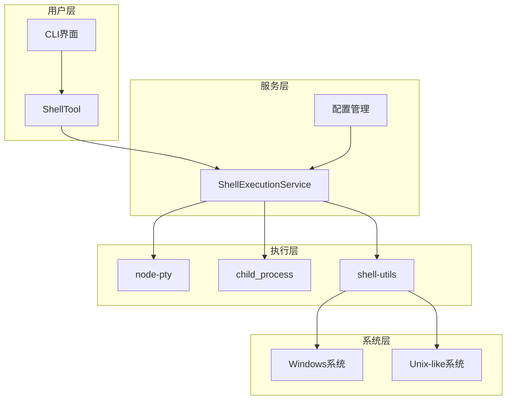
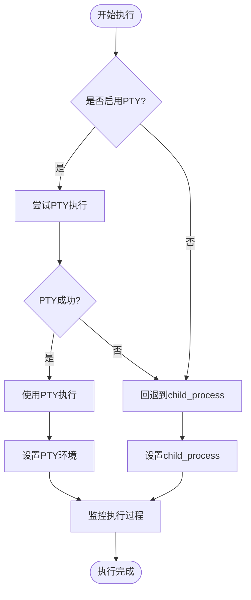
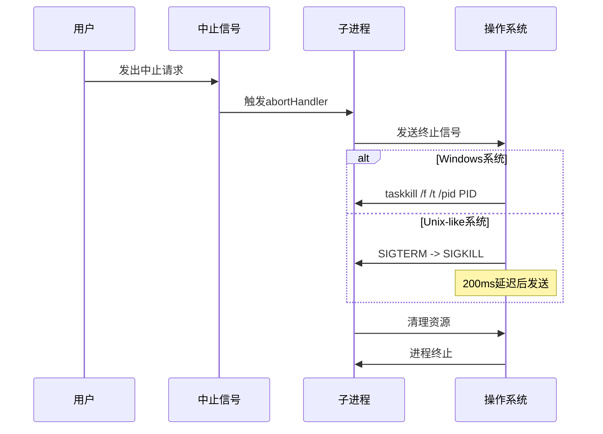
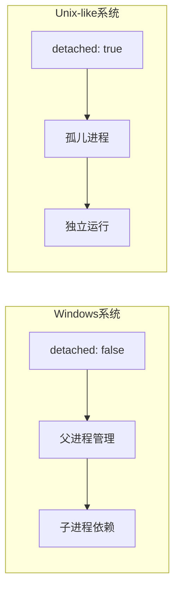
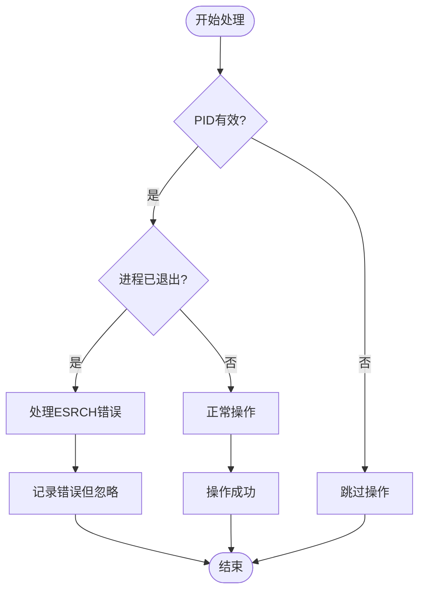

# 进程管理与信号处理

<cite>
**本文档引用的文件**
- [shellExecutionService.ts](file://packages/core/src/services/shellExecutionService.ts)
- [shell-utils.ts](file://packages/core/src/utils/shell-utils.ts)
- [shell.ts](file://packages/core/src/tools/shell.ts)
- [config.ts](file://packages/core/src/config/config.ts)
- [run_shell_command.test.ts](file://integration-tests/run_shell_command.test.ts)
- [shellExecutionService.test.ts](file://packages/core/src/services/shellExecutionService.test.ts)
</cite>

## 目录
1. [简介](#简介)
2. [项目架构概览](#项目架构概览)
3. [核心组件分析](#核心组件分析)
4. [跨平台进程管理策略](#跨平台进程管理策略)
5. [AbortSignal优雅取消机制](#abortsignal优雅取消机制)
6. [进程终止信号处理](#进程终止信号处理)
7. [detached: !isWindows选项详解](#detached-iswindows选项详解)
8. [PID属性传递机制](#pid属性传递机制)
9. [健壮性设计与边缘情况处理](#健壮性设计与边缘情况处理)
10. [性能考虑](#性能考虑)
11. [故障排除指南](#故障排除指南)
12. [结论](#结论)

## 简介

ShellExecutionService是Gemini CLI项目中负责跨平台进程管理的核心服务。它提供了统一的接口来执行shell命令，同时支持多种执行方式（PTY和child_process），并实现了复杂的进程生命周期管理。该服务特别注重跨平台兼容性，能够优雅地处理不同操作系统下的进程终止需求。

本文档将深入分析ShellExecutionService如何通过AbortSignal实现优雅的命令取消机制，以及Windows与Unix-like系统在进程终止上的差异处理策略。

## 项目架构概览



**图表来源**
- [shellExecutionService.ts](file://packages/core/src/services/shellExecutionService.ts#L1-L50)
- [shell.ts](file://packages/core/src/tools/shell.ts#L1-L50)

## 核心组件分析

### ShellExecutionService类结构

ShellExecutionService是一个静态类，提供了统一的shell命令执行接口。它支持两种主要的执行模式：

```typescript
// 执行模式选择逻辑
static async execute(
  commandToExecute: string,
  cwd: string,
  onOutputEvent: (event: ShellOutputEvent) => void,
  abortSignal: AbortSignal,
  shouldUseNodePty: boolean,
  shellExecutionConfig: ShellExecutionConfig,
): Promise<ShellExecutionHandle>
```

### 关键接口定义

```typescript
// 执行结果接口
export interface ShellExecutionResult {
  rawOutput: Buffer;
  output: string;
  exitCode: number | null;
  signal: number | null;
  error: Error | null;
  aborted: boolean;
  pid: number | undefined;
  executionMethod: 'lydell-node-pty' | 'node-pty' | 'child_process' | 'none';
}

// 执行句柄接口
export interface ShellExecutionHandle {
  pid: number | undefined;
  result: Promise<ShellExecutionResult>;
}
```

**章节来源**
- [shellExecutionService.ts](file://packages/core/src/services/shellExecutionService.ts#L20-L60)

## 跨平台进程管理策略

### 平台检测机制

ShellExecutionService通过`isWindows()`函数进行平台检测：

```typescript
export const isWindows = () => os.platform() === 'win32';
```

这个检测贯穿整个执行流程，影响以下关键决策：

1. **Shell选择**：Windows使用cmd.exe，Unix使用bash
2. **参数格式**：Windows需要不同的命令行参数格式
3. **进程终止策略**：Windows使用taskkill，Unix使用SIGTERM/SIGKILL
4. **detached标志**：Windows不设置detached，Unix设置为true

### 执行策略选择



**图表来源**
- [shellExecutionService.ts](file://packages/core/src/services/shellExecutionService.ts#L85-L105)

**章节来源**
- [shellExecutionService.ts](file://packages/core/src/services/shellExecutionService.ts#L85-L105)
- [shell-utils.ts](file://packages/core/src/utils/shell-utils.ts#L45-L70)

## AbortSignal优雅取消机制

### 取消信号监听

AbortSignal是现代JavaScript中处理异步操作取消的标准机制。ShellExecutionService通过以下方式集成这一机制：

```typescript
const abortHandler = async () => {
  if (child.pid && !exited) {
    if (isWindows) {
      cpSpawn('taskkill', ['/pid', child.pid.toString(), '/f', '/t']);
    } else {
      try {
        process.kill(-child.pid, 'SIGTERM');
        await new Promise((res) => setTimeout(res, SIGKILL_TIMEOUT_MS));
        if (!exited) {
          process.kill(-child.pid, 'SIGKILL');
        }
      } catch (_e) {
        if (!exited) child.kill('SIGKILL');
      }
    }
  }
};

abortSignal.addEventListener('abort', abortHandler, { once: true });
```

### 取消流程图



**图表来源**
- [shellExecutionService.ts](file://packages/core/src/services/shellExecutionService.ts#L250-L280)

**章节来源**
- [shellExecutionService.ts](file://packages/core/src/services/shellExecutionService.ts#L250-L280)

## 进程终止信号处理

### Windows系统终止策略

Windows平台使用taskkill命令强制终止进程树：

```typescript
// Windows终止命令
cpSpawn('taskkill', ['/pid', child.pid.toString(), '/f', '/t']);
```

参数说明：
- `/pid`: 指定要终止的进程ID
- `/f`: 强制终止
- `/t`: 终止指定进程及其所有子进程

### Unix-like系统终止策略

Unix-like系统采用分阶段的信号处理策略：

```typescript
// Unix信号序列
try {
  process.kill(-child.pid, 'SIGTERM');  // 发送终止信号
  await new Promise((res) => setTimeout(res, SIGKILL_TIMEOUT_MS));  // 等待200ms
  if (!exited) {
    process.kill(-child.pid, 'SIGKILL');  // 强制杀死
  }
} catch (_e) {
  if (!exited) child.kill('SIGKILL');  // 备用方案
}
```

### 信号处理对比表

| 特征 | Windows | Unix-like |
|------|---------|-----------|
| 终止命令 | taskkill | SIGTERM/SIGKILL |
| 进程树处理 | 自动递归终止 | 需要进程组ID |
| 默认行为 | 强制终止 | 允许优雅关闭 |
| 超时处理 | 立即强制 | 200ms后强制 |

**章节来源**
- [shellExecutionService.ts](file://packages/core/src/services/shellExecutionService.ts#L250-L280)

## detached: !isWindows选项详解

### detached标志的作用

detached标志控制子进程是否作为独立进程运行，不依赖于父进程：

```typescript
const child = cpSpawn(commandToExecute, [], {
  cwd,
  stdio: ['ignore', 'pipe', 'pipe'],
  windowsVerbatimArguments: true,
  shell: isWindows ? true : 'bash',
  detached: !isWindows,  // 关键配置
  env: {...},
});
```

### 平台差异解释



**图表来源**
- [shellExecutionService.ts](file://packages/core/src/services/shellExecutionService.ts#L110-L120)

### 为什么这样设计？

1. **Windows行为**：Windows进程通常需要父进程管理，否则可能无法正确清理
2. **Unix行为**：Unix进程可以独立运行，允许父进程退出后继续执行
3. **一致性考虑**：确保跨平台行为的一致性，避免意外的进程挂起

**章节来源**
- [shellExecutionService.ts](file://packages/core/src/services/shellExecutionService.ts#L110-L120)

## PID属性传递机制

### PID的获取与传递

PID（进程标识符）在ShellExecutionService中扮演关键角色，用于后续的进程控制操作：

```typescript
// PTY执行中的PID传递
private static executeWithPty(/* 参数 */) {
  const ptyProcess = ptyInfo.module.spawn(shell, args, {
    // ... 其他配置
  });
  
  return { pid: ptyProcess.pid, result };
}

// child_process执行中的PID传递
private static childProcessFallback(/* 参数 */) {
  const child = cpSpawn(/* ... */);
  return { pid: undefined, result };  // child_process模式下PID不可用
}
```

### writeToPty和resizePty的PID使用

```typescript
// 写入PTY数据
static writeToPty(pid: number, input: string): void {
  if (!this.isPtyActive(pid)) {
    return;
  }
  
  const activePty = this.activePtys.get(pid);
  if (activePty) {
    activePty.ptyProcess.write(input);
  }
}

// 调整PTY大小
static resizePty(pid: number, cols: number, rows: number): void {
  if (!this.isPtyActive(pid)) {
    return;
  }
  
  const activePty = this.activePtys.get(pid);
  if (activePty) {
    try {
      activePty.ptyProcess.resize(cols, rows);
      activePty.headlessTerminal.resize(cols, rows);
    } catch (e) {
      // 忽略ESRCH错误，表示PTY已退出
      if (e instanceof Error && 'code' in e && e.code === 'ESRCH') {
        // ignore
      } else {
        throw e;
      }
    }
  }
}
```

### PID状态检查机制

```typescript
static isPtyActive(pid: number): boolean {
  try {
    // process.kill with signal 0检查进程是否存在
    // 不实际发送信号
    return process.kill(pid, 0);
  } catch (_) {
    return false;
  }
}
```

**章节来源**
- [shellExecutionService.ts](file://packages/core/src/services/shellExecutionService.ts#L600-L682)

## 健壮性设计与边缘情况处理

### 进程已退出的处理

ShellExecutionService实现了多层保护机制来处理进程已退出的情况：

```typescript
// 在resizePty中的错误处理
try {
  activePty.ptyProcess.resize(cols, rows);
  activePty.headlessTerminal.resize(cols, rows);
} catch (e) {
  // 忽略ESRCH错误，表示PTY已退出
  if (e instanceof Error && 'code' in e && e.code === 'ESRCH') {
    // ignore
  } else {
    throw e;
  }
}
```

### 资源清理机制

```typescript
function cleanup() {
  exited = true;
  abortSignal.removeEventListener('abort', abortHandler);
  if (stdoutDecoder) {
    const remaining = stdoutDecoder.decode();
    if (remaining) {
      stdout += remaining;
    }
  }
  if (stderrDecoder) {
    const remaining = stderrDecoder.decode();
    if (remaining) {
      stderr += remaining;
    }
  }
  
  const finalBuffer = Buffer.concat(outputChunks);
  return { stdout, stderr, finalBuffer };
}
```

### 边缘情况处理流程



**图表来源**
- [shellExecutionService.ts](file://packages/core/src/services/shellExecutionService.ts#L620-L650)

**章节来源**
- [shellExecutionService.ts](file://packages/core/src/services/shellExecutionService.ts#L620-L650)

## 性能考虑

### PTY vs child_process性能对比

ShellExecutionService提供了两种执行模式，每种都有其性能特点：

| 特性 | PTY模式 | child_process模式 |
|------|---------|-------------------|
| 启动速度 | 较慢（初始化PTY） | 较快 |
| 输出流处理 | 支持终端特性 | 基本流处理 |
| 内存占用 | 较高 | 较低 |
| 跨平台兼容性 | 优秀 | 优秀 |
| 交互能力 | 强 | 弱 |

### 缓冲区管理优化

```typescript
// 输出缓冲区管理
let outputChunks: Buffer[] = [];
let isStreamingRawContent = true;
const MAX_SNIFF_SIZE = 4096;
let sniffedBytes = 0;

// 二进制检测优化
if (isStreamingRawContent && sniffedBytes < MAX_SNIFF_SIZE) {
  const sniffBuffer = Buffer.concat(outputChunks.slice(0, 20));
  sniffedBytes = sniffBuffer.length;
  
  if (isBinary(sniffBuffer)) {
    isStreamingRawContent = false;
  }
}
```

### 流式输出优化

```typescript
// 流式渲染优化
const render = (finalRender = false) => {
  if (renderTimeout) {
    clearTimeout(renderTimeout);
  }
  
  const renderFn = () => {
    // 动态行修剪优化
    if (!shellExecutionConfig.disableDynamicLineTrimming) {
      if (!hasStartedOutput) {
        const bufferText = getFullBufferText(headlessTerminal);
        if (bufferText.trim().length === 0) {
          return;
        }
        hasStartedOutput = true;
      }
    }
    
    // 实际渲染逻辑...
  };
  
  if (finalRender) {
    renderFn();
  } else {
    renderTimeout = setTimeout(renderFn, 17);  // ~60fps
  }
};
```

## 故障排除指南

### 常见问题诊断

1. **进程无法终止**
   - 检查AbortSignal是否正确传递
   - 验证平台检测逻辑
   - 确认信号处理权限

2. **PTY初始化失败**
   - 检查node-pty安装
   - 验证平台兼容性
   - 查看错误日志

3. **PID无效**
   - 确认进程启动状态
   - 检查进程组ID
   - 验证权限设置

### 调试技巧

```typescript
// 启用调试模式
const debugConfig: ShellExecutionConfig = {
  terminalWidth: 80,
  terminalHeight: 24,
  showColor: true,
  disableDynamicLineTrimming: false
};

// 监听输出事件
const onOutputEvent = (event: ShellOutputEvent) => {
  switch (event.type) {
    case 'data':
      console.log('Output:', event.chunk);
      break;
    case 'binary_detected':
      console.log('Binary output detected');
      break;
    case 'binary_progress':
      console.log(`Progress: ${event.bytesReceived} bytes`);
      break;
  }
};
```

**章节来源**
- [shellExecutionService.ts](file://packages/core/src/services/shellExecutionService.ts#L1-L50)

## 结论

ShellExecutionService展现了现代JavaScript应用中跨平台进程管理的最佳实践。通过精心设计的AbortSignal机制、平台特定的信号处理策略、以及robust的错误处理，该服务能够在各种环境下稳定可靠地执行shell命令。

关键优势包括：

1. **跨平台兼容性**：统一的接口适配Windows和Unix-like系统
2. **优雅取消**：通过AbortSignal实现安全的命令取消
3. **资源管理**：完善的资源清理和错误处理机制
4. **性能优化**：智能的缓冲区管理和流式输出处理

这种设计不仅保证了系统的稳定性，也为开发者提供了强大而灵活的shell命令执行能力。