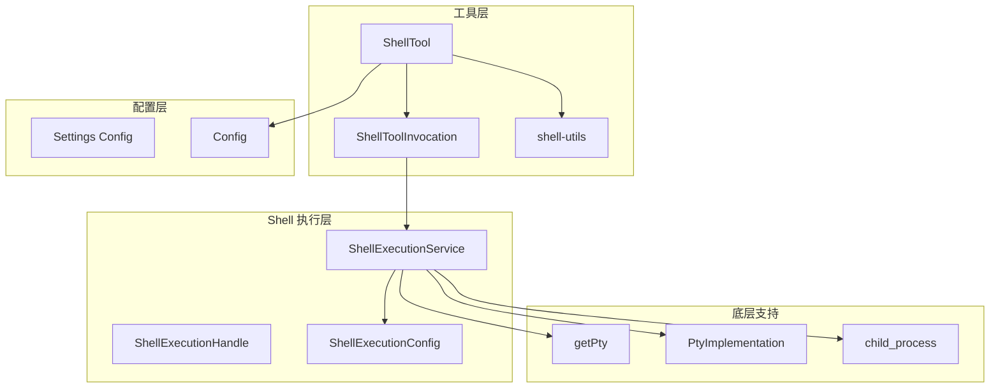
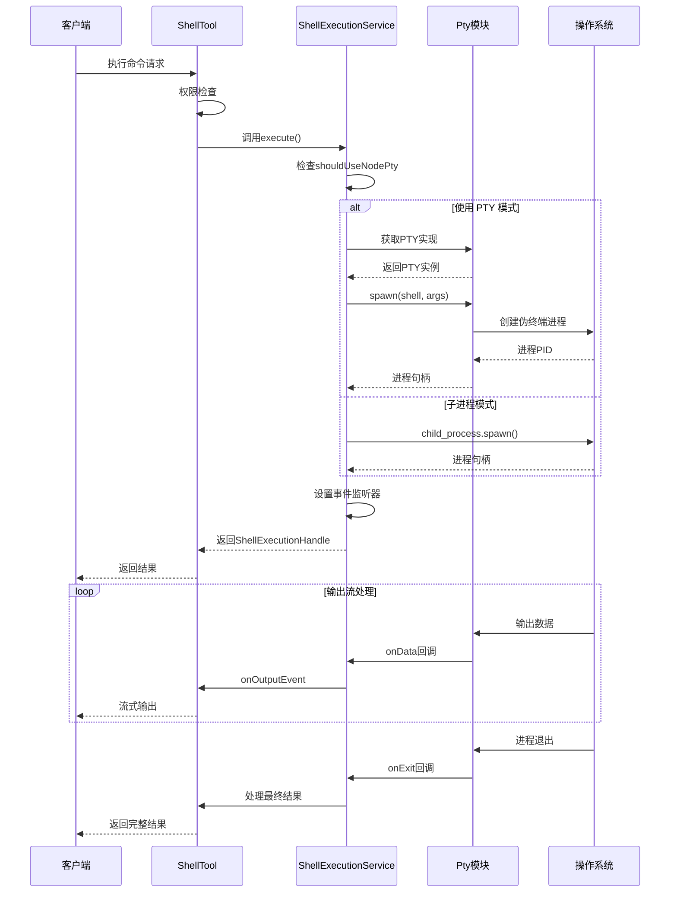
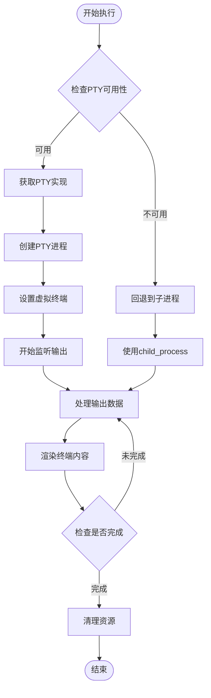
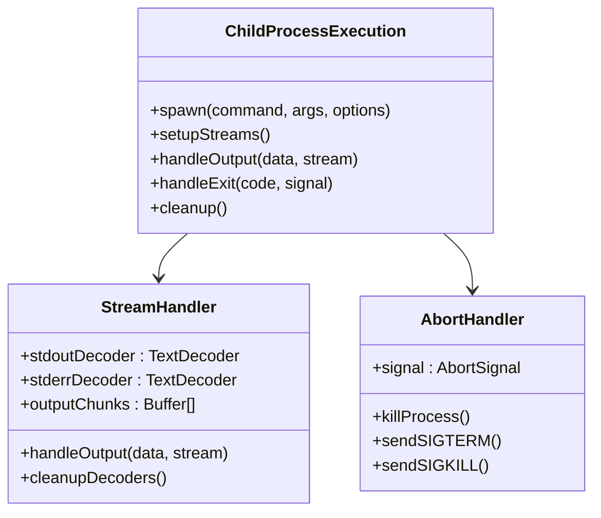
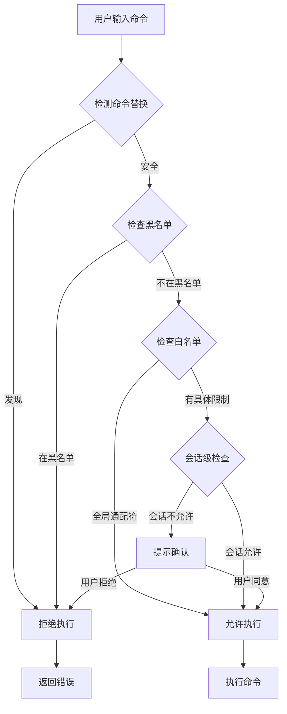
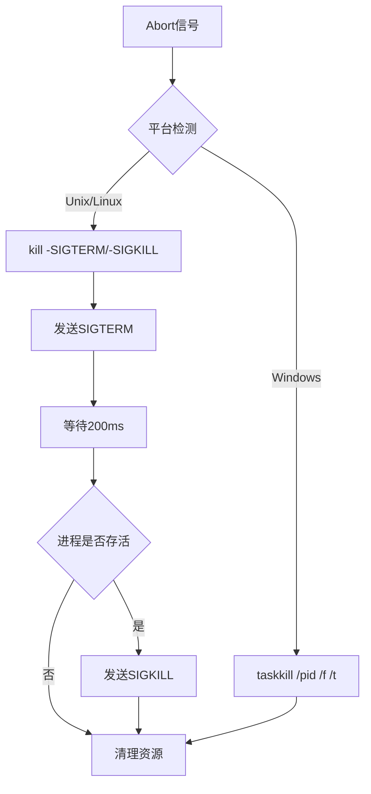

# Shell 集成机制

<cite>
**本文档中引用的文件**
- [shellExecutionService.ts](file://packages/core/src/services/shellExecutionService.ts)
- [getPty.ts](file://packages/core/src/utils/getPty.ts)
- [shell.ts](file://packages/core/src/tools/shell.ts)
- [shell-utils.ts](file://packages/core/src/utils/shell-utils.ts)
- [run_shell_command.test.ts](file://integration-tests/run_shell_command.test.ts)
- [settings.ts](file://packages/cli/src/config/settings.ts)
</cite>

## 目录
1. [简介](#简介)
2. [项目结构概览](#项目结构概览)
3. [核心组件分析](#核心组件分析)
4. [架构概览](#架构概览)
5. [详细组件分析](#详细组件分析)
6. [安全沙箱机制](#安全沙箱机制)
7. [跨平台兼容性](#跨平台兼容性)
8. [性能优化](#性能优化)
9. [故障排除指南](#故障排除指南)
10. [结论](#结论)

## 简介

gemini-cli 的 Shell 集成机制是一个高度复杂的系统，旨在为 AI 模型提供安全、高效的本地命令执行能力。该系统通过 `ShellExecutionService` 和 `Pty`（伪终端）技术，实现了与操作系统的深度交互，支持命令执行、输入输出流处理和进程控制。

该系统的核心设计理念是：
- **安全性优先**：通过沙箱机制和权限控制防止恶意命令执行
- **跨平台兼容**：支持 Windows、Linux 和 macOS 平台
- **实时交互**：提供流式输出和交互式程序支持
- **资源管理**：智能的进程生命周期管理和内存优化

## 项目结构概览



**图表来源**
- [shellExecutionService.ts](file://packages/core/src/services/shellExecutionService.ts#L1-L50)
- [shell.ts](file://packages/core/src/tools/shell.ts#L1-L50)

## 核心组件分析

### ShellExecutionService 类

`ShellExecutionService` 是整个 Shell 集成系统的核心，负责协调所有命令执行活动。

```typescript
export class ShellExecutionService {
  private static activePtys = new Map<number, ActivePty>();
  
  static async execute(
    commandToExecute: string,
    cwd: string,
    onOutputEvent: (event: ShellOutputEvent) => void,
    abortSignal: AbortSignal,
    shouldUseNodePty: boolean,
    shellExecutionConfig: ShellExecutionConfig,
  ): Promise<ShellExecutionHandle>
```

该类提供了两种执行模式：
1. **PTY 模式**：使用 `node-pty` 提供全功能终端体验
2. **子进程模式**：回退到标准的 `child_process` 执行

**章节来源**
- [shellExecutionService.ts](file://packages/core/src/services/shellExecutionService.ts#L106-L150)

### PtyImplementation 接口

```typescript
export type PtyImplementation = {
  module: any;
  name: 'lydell-node-pty' | 'node-pty';
} | null;
```

该接口定义了 PTY 实现的选择逻辑，优先使用 `@lydell/node-pty`，如果失败则回退到标准的 `node-pty`。

**章节来源**
- [getPty.ts](file://packages/core/src/utils/getPty.ts#L1-L35)

## 架构概览



**图表来源**
- [shellExecutionService.ts](file://packages/core/src/services/shellExecutionService.ts#L306-L398)
- [shell.ts](file://packages/core/src/tools/shell.ts#L150-L250)

## 详细组件分析

### PTY 执行模式

当 `shouldUseNodePty` 为 `true` 且 PTY 可用时，系统会使用 PTY 模式：



**图表来源**
- [shellExecutionService.ts](file://packages/core/src/services/shellExecutionService.ts#L352-L398)

### 子进程执行模式

当 PTY 不可用或明确禁用时，系统会回退到子进程模式：



**图表来源**
- [shellExecutionService.ts](file://packages/core/src/services/shellExecutionService.ts#L152-L306)

**章节来源**
- [shellExecutionService.ts](file://packages/core/src/services/shellExecutionService.ts#L152-L306)

### ShellTool 工具类

`ShellTool` 是面向用户的工具类，封装了复杂的执行逻辑：

```typescript
export class ShellTool extends BaseDeclarativeTool<ShellToolParams, ToolResult> {
  static Name: string = 'run_shell_command';
  private allowlist: Set<string> = new Set();
  
  constructor(private readonly config: Config) {
    super(
      ShellTool.Name,
      'Shell',
      getShellToolDescription(),
      Kind.Execute,
      {
        type: 'object',
        properties: {
          command: {
            type: 'string',
            description: getCommandDescription(),
          },
          description: {
            type: 'string',
            description: 'Brief description of the command',
          },
          directory: {
            type: 'string',
            description: 'The absolute path of the directory to run in',
          },
        },
        required: ['command'],
      },
      false, // output is not markdown
      true, // output can be updated
    );
  }
}
```

**章节来源**
- [shell.ts](file://packages/core/src/tools/shell.ts#L400-L491)

## 安全沙箱机制

### 命令权限检查

系统实现了多层安全检查机制：



**图表来源**
- [shell-utils.ts](file://packages/core/src/utils/shell-utils.ts#L300-L400)

### 命令替换检测

系统严格禁止命令替换以防止安全漏洞：

```typescript
export function detectCommandSubstitution(command: string): boolean {
  // 检测 $()、``、<()>、>() 等命令替换模式
  // 在双引号内不执行替换，但在单引号或无引号情况下执行
  
  let inSingleQuotes = false;
  let inDoubleQuotes = false;
  let inBackticks = false;
  
  // 分析命令字符串，识别潜在的安全风险
  // 返回布尔值表示是否包含危险的命令替换
}
```

**章节来源**
- [shell-utils.ts](file://packages/core/src/utils/shell-utils.ts#L200-L300)

### 环境变量继承策略

系统采用智能的环境变量继承策略：

```typescript
const env = {
  ...process.env,           // 继承当前进程环境变量
  GEMINI_CLI: '1',         // 添加特定标记
  TERM: 'xterm-256color',  // 设置终端类型
  PAGER: shellExecutionConfig.pager ?? 'cat', // 设置分页器
};
```

**章节来源**
- [shellExecutionService.ts](file://packages/core/src/services/shellExecutionService.ts#L352-L365)

## 跨平台兼容性

### 平台检测和适配

```typescript
export function getShellConfiguration(): ShellConfiguration {
  if (isWindows()) {
    const comSpec = process.env['ComSpec'] || 'cmd.exe';
    const executable = comSpec.toLowerCase();
    
    if (executable.endsWith('powershell.exe') || executable.endsWith('pwsh.exe')) {
      return {
        executable: comSpec,
        argsPrefix: ['-NoProfile', '-Command'],
        shell: 'powershell',
      };
    }
    
    // 默认CMD配置
    return {
      executable: comSpec,
      argsPrefix: ['/d', '/s', '/c'],
      shell: 'cmd',
    };
  }
  
  // Unix/Linux/macOS配置
  return { executable: 'bash', argsPrefix: ['-c'], shell: 'bash' };
}
```

**章节来源**
- [shell-utils.ts](file://packages/core/src/utils/shell-utils.ts#L40-L80)

### 进程终止策略

不同平台采用不同的进程终止策略：



**图表来源**
- [shellExecutionService.ts](file://packages/core/src/services/shellExecutionService.ts#L250-L280)

## 性能优化

### 流式输出处理

系统实现了高效的流式输出处理机制：

```typescript
const render = (finalRender = false) => {
  if (renderTimeout) {
    clearTimeout(renderTimeout);
  }
  
  const renderFn = () => {
    if (!isStreamingRawContent) {
      return;
    }
    
    // 动态行修剪优化
    if (!shellExecutionConfig.disableDynamicLineTrimming) {
      if (!hasStartedOutput) {
        const bufferText = getFullBufferText(headlessTerminal);
        if (bufferText.trim().length === 0) {
          return;
        }
        hasStartedOutput = true;
      }
    }
    
    // 渲染终端内容
    let newOutput = shellExecutionConfig.showColor 
      ? serializeTerminalToObject(headlessTerminal)
      : extractTextOnly(headlessTerminal);
      
    // 发送更新事件
    onOutputEvent({ type: 'data', chunk: newOutput });
  };
  
  if (finalRender) {
    renderFn();
  } else {
    renderTimeout = setTimeout(renderFn, 17); // 60fps
  }
};
```

**章节来源**
- [shellExecutionService.ts](file://packages/core/src/services/shellExecutionService.ts#L398-L450)

### 内存管理优化

```typescript
// 缓冲区管理
const outputChunks: Buffer[] = [];
let sniffedBytes = 0;
const MAX_SNIFF_SIZE = 4096;

// 二进制检测
if (isStreamingRawContent && sniffedBytes < MAX_SNIFF_SIZE) {
  const sniffBuffer = Buffer.concat(outputChunks.slice(0, 20));
  sniffedBytes = sniffBuffer.length;
  
  if (isBinary(sniffBuffer)) {
    isStreamingRawContent = false;
    onOutputEvent({ type: 'binary_detected' });
  }
}
```

**章节来源**
- [shellExecutionService.ts](file://packages/core/src/services/shellExecutionService.ts#L370-L390)

## 故障排除指南

### 常见问题诊断

1. **PTY 初始化失败**
   - 检查 `node-pty` 依赖是否正确安装
   - 验证平台兼容性
   - 查看错误日志获取详细信息

2. **命令执行超时**
   - 检查 `AbortSignal` 是否正确传递
   - 验证超时配置
   - 监控进程状态

3. **输出编码问题**
   - 检查系统编码设置
   - 验证 `TextDecoder` 配置
   - 处理多字节字符

### 调试技巧

```typescript
// 启用调试模式
const shellExecutionConfig = {
  showColor: true,
  disableDynamicLineTrimming: false,
  terminalWidth: 80,
  terminalHeight: 30,
};

// 监听输出事件
const handle = await ShellExecutionService.execute(
  command,
  cwd,
  (event) => {
    switch (event.type) {
      case 'data':
        console.log('Output:', event.chunk);
        break;
      case 'binary_detected':
        console.log('Binary output detected');
        break;
      case 'binary_progress':
        console.log(`Progress: ${event.bytesReceived} bytes`);
        break;
    }
  },
  abortSignal,
  true,
  shellExecutionConfig,
);
```

**章节来源**
- [shellExecutionService.ts](file://packages/core/src/services/shellExecutionService.ts#L106-L150)

## 结论

gemini-cli 的 Shell 集成机制是一个设计精良、功能完备的系统，它成功地平衡了安全性、性能和用户体验。通过 PTY 技术、智能权限控制和跨平台适配，该系统能够为 AI 模型提供强大而安全的本地命令执行能力。

主要优势包括：
- **安全性**：多层权限检查和命令替换检测
- **性能**：流式输出和智能缓存机制
- **兼容性**：完整的跨平台支持
- **可扩展性**：模块化设计便于维护和扩展

该系统为未来的功能扩展奠定了坚实的基础，特别是在交互式程序支持、高级终端特性和性能优化方面仍有很大的改进空间。