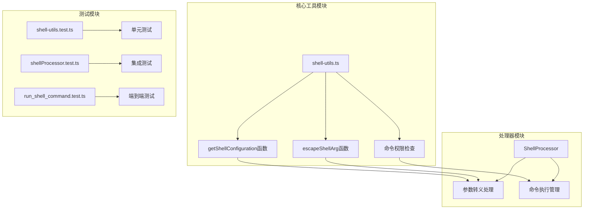
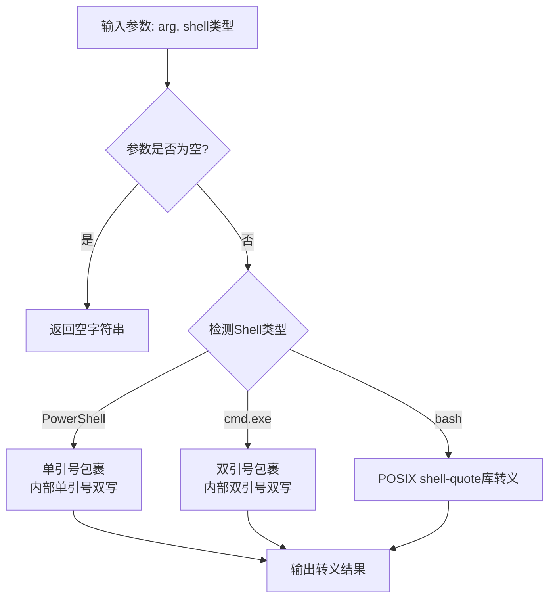
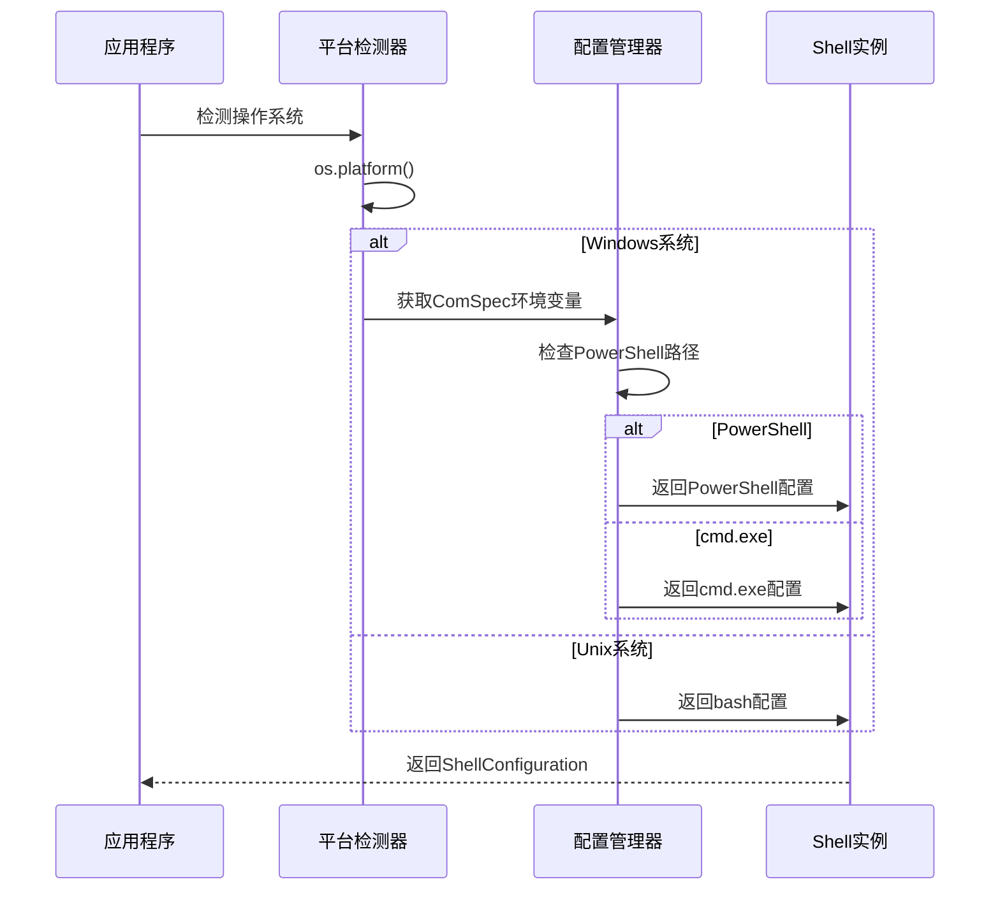
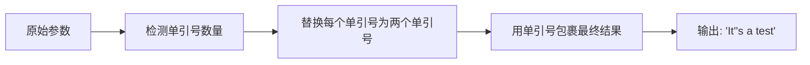
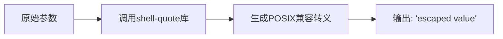
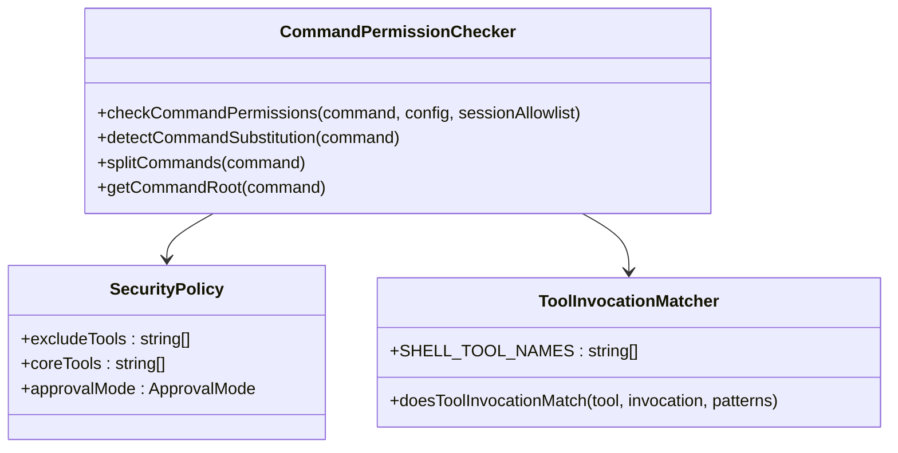
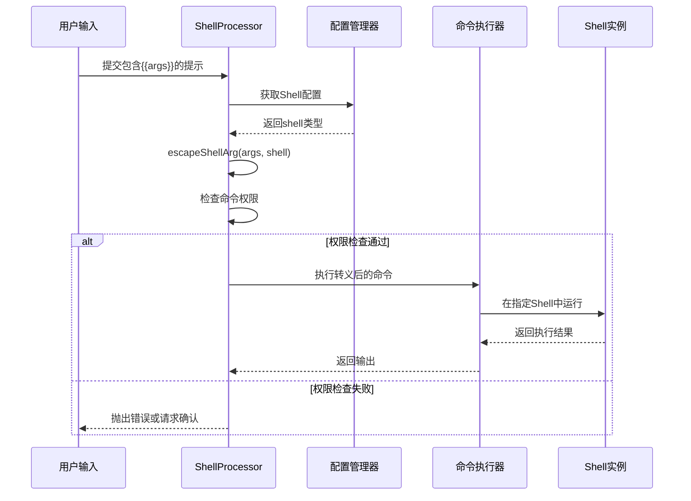

# Shell参数转义策略

<cite>
**本文档引用的文件**
- [shell-utils.ts](file://packages/core/src/utils/shell-utils.ts)
- [shell-utils.test.ts](file://packages/core/src/utils/shell-utils.test.ts)
- [shellProcessor.ts](file://packages/cli/src/services/prompt-processors/shellProcessor.ts)
- [shellProcessor.test.ts](file://packages/cli/src/services/prompt-processors/shellProcessor.test.ts)
- [run_shell_command.test.ts](file://integration-tests/run_shell_command.test.ts)
- [tool-utils.ts](file://packages/core/src/utils/tool-utils.ts)
</cite>

## 目录
1. [简介](#简介)
2. [项目结构概览](#项目结构概览)
3. [核心转义函数分析](#核心转义函数分析)
4. [跨平台Shell支持](#跨平台shell支持)
5. [转义策略详解](#转义策略详解)
6. [安全机制与权限控制](#安全机制与权限控制)
7. [实际应用示例](#实际应用示例)
8. [性能考虑](#性能考虑)
9. [故障排除指南](#故障排除指南)
10. [结论](#结论)

## 简介

Shell参数转义是确保命令注入攻击防护的关键技术。本文档深入分析了Gemini CLI项目中实现的跨平台Shell参数转义策略，详细说明了escapeShellArg函数如何针对cmd、PowerShell和bash三种Shell环境提供差异化的转义实现。

该系统通过智能检测目标Shell类型，采用相应的转义策略来防止命令注入攻击，确保参数中的特殊字符被正确处理而非作为Shell元字符执行。这种设计不仅保证了安全性，还提供了良好的跨平台兼容性。

## 项目结构概览



**图表来源**
- [shell-utils.ts](file://packages/core/src/utils/shell-utils.ts#L1-L509)
- [shellProcessor.ts](file://packages/cli/src/services/prompt-processors/shellProcessor.ts#L1-L216)

**章节来源**
- [shell-utils.ts](file://packages/core/src/utils/shell-utils.ts#L1-L509)
- [shellProcessor.ts](file://packages/cli/src/services/prompt-processors/shellProcessor.ts#L1-L216)

## 核心转义函数分析

### escapeShellArg函数架构



**图表来源**
- [shell-utils.ts](file://packages/core/src/utils/shell-utils.ts#L73-L89)

escapeShellArg函数是整个转义系统的核心，它根据目标Shell类型采用不同的转义策略：

```typescript
export function escapeShellArg(arg: string, shell: ShellType): string {
  if (!arg) {
    return '';
  }

  switch (shell) {
    case 'powershell':
      // 对于PowerShell，用单引号包裹并双写内部单引号
      return `'${arg.replace(/'/g, "''")}'`;
    case 'cmd':
      // 简单的Windows转义：用双引号包裹并转义内部双引号
      return `"${arg.replace(/"/g, '""')}"`;
    case 'bash':
    default:
      // POSIX shell转义使用shell-quote库
      return quote([arg]);
  }
}
```

**章节来源**
- [shell-utils.ts](file://packages/core/src/utils/shell-utils.ts#L73-L89)

## 跨平台Shell支持

### 平台检测与配置



**图表来源**
- [shell-utils.ts](file://packages/core/src/utils/shell-utils.ts#L34-L75)

系统通过智能检测确定最佳的Shell配置：

```typescript
export function getShellConfiguration(): ShellConfiguration {
  if (isWindows()) {
    const comSpec = process.env['ComSpec'] || 'cmd.exe';
    const executable = comSpec.toLowerCase();

    if (
      executable.endsWith('powershell.exe') ||
      executable.endsWith('pwsh.exe')
    ) {
      // PowerShell配置
      return {
        executable: comSpec,
        argsPrefix: ['-NoProfile', '-Command'],
        shell: 'powershell',
      };
    }

    // 默认cmd.exe配置
    return {
      executable: comSpec,
      argsPrefix: ['/d', '/s', '/c'],
      shell: 'cmd',
    };
  }

  // Unix系统默认使用bash
  return { executable: 'bash', argsPrefix: ['-c'], shell: 'bash' };
}
```

**章节来源**
- [shell-utils.ts](file://packages/core/src/utils/shell-utils.ts#L34-L75)

## 转义策略详解

### PowerShell转义策略

PowerShell使用单引号包裹参数，并将内部的单引号双写：



**图表来源**
- [shell-utils.ts](file://packages/core/src/utils/shell-utils.ts#L78-L80)

示例：
```typescript
// 输入: "It's a test"
// 输出: "'It''s a test'"
const result = escapeShellArg("It's a test", 'powershell');
```

### cmd.exe转义策略

cmd.exe使用双引号包裹参数，并将内部的双引号双写：

```mermaid
flowchart LR
A[原始参数] --> B[检测双引号数量]
B --> C[替换每个双引号为两个双引号]
C --> D[用双引号包裹最终结果]
D --> E[输出: "He said ""Hello"""]
```

**图表来源**
- [shell-utils.ts](file://packages/core/src/utils/shell-utils.ts#L81-L83)

示例：
```typescript
// 输入: 'He said "Hello"'
// 输出: '"He said ""Hello"""'
const result = escapeShellArg('He said "Hello"', 'cmd');
```

### Bash/POSIX转义策略

Bash使用shell-quote库进行标准化转义：



**图表来源**
- [shell-utils.ts](file://packages/core/src/utils/shell-utils.ts#L84-L86)

示例：
```typescript
// 输入: 'raw value'
// 输出: "'raw value'"（使用shell-quote库）
const result = escapeShellArg('raw value', 'bash');
```

**章节来源**
- [shell-utils.ts](file://packages/core/src/utils/shell-utils.ts#L73-L89)
- [shell-utils.test.ts](file://packages/core/src/utils/shell-utils.test.ts#L299-L379)

## 安全机制与权限控制

### 命令权限检查系统



**图表来源**
- [shell-utils.ts](file://packages/core/src/utils/shell-utils.ts#L250-L400)
- [tool-utils.ts](file://packages/core/src/utils/tool-utils.ts#L1-L76)

系统实现了多层安全防护：

1. **命令子stitution检测**：阻止使用$()、``、<()等危险语法
2. **工具调用匹配**：验证工具名称和参数模式
3. **权限列表管理**：支持全局和会话级别的允许/拒绝列表
4. **确认模式控制**：YOLO模式下自动批准，其他模式需要用户确认

```typescript
export function checkCommandPermissions(
  command: string,
  config: Config,
  sessionAllowlist?: Set<string>,
): {
  allAllowed: boolean;
  disallowedCommands: string[];
  blockReason?: string;
  isHardDenial?: boolean;
} {
  // 1. 禁用命令子stitution
  if (detectCommandSubstitution(command)) {
    return {
      allAllowed: false,
      disallowedCommands: [command],
      blockReason: '命令子stitution不被允许出于安全原因',
      isHardDenial: true,
    };
  }

  // 2. 分割并验证每个命令
  const commandsToValidate = splitCommands(command).map(normalize);
  
  // 3. 检查阻塞列表和允许列表
  // ...
}
```

**章节来源**
- [shell-utils.ts](file://packages/core/src/utils/shell-utils.ts#L250-L400)

## 实际应用示例

### ShellProcessor中的参数处理



**图表来源**
- [shellProcessor.ts](file://packages/cli/src/services/prompt-processors/shellProcessor.ts#L40-L215)

### 跨平台转义示例对比

不同Shell环境下的转义结果对比：

| 输入参数 | PowerShell | cmd.exe | Bash |
|---------|------------|---------|------|
| `hello world` | `'hello world'` | `"hello world"` | `'hello world'` |
| `It's a test` | `'It''s a test'` | `"It"s a test"` | `'It'\''s a test'` |
| `He said "Hello"` | `'He said "Hello"'` | `"He said ""Hello"""` | `'He said "Hello"'` |
| `$PATH variable` | `'$PATH variable'` | `"$PATH variable"` | `'$PATH variable'` |

**章节来源**
- [shell-utils.test.ts](file://packages/core/src/utils/shell-utils.test.ts#L299-L379)
- [shellProcessor.ts](file://packages/cli/src/services/prompt-processors/shellProcessor.ts#L40-L215)

## 性能考虑

### 转义算法复杂度

- **PowerShell转义**：O(n)，其中n是字符串长度，只需一次遍历替换单引号
- **cmd.exe转义**：O(n)，同样只需一次遍历替换双引号
- **Bash转义**：依赖shell-quote库，通常也是线性复杂度

### 内存使用优化

系统在处理空字符串时立即返回，避免不必要的计算开销。对于大型参数，转义操作保持在常数空间复杂度。

## 故障排除指南

### 常见问题与解决方案

1. **转义结果不符合预期**
   - 检查目标Shell类型是否正确识别
   - 验证输入参数是否包含特殊字符

2. **命令执行失败**
   - 确认权限检查配置是否正确
   - 检查命令是否包含危险的子stitution语法

3. **跨平台兼容性问题**
   - 使用统一的转义接口，避免直接调用特定Shell的转义逻辑
   - 测试所有目标平台的转义行为

**章节来源**
- [shell-utils.ts](file://packages/core/src/utils/shell-utils.ts#L250-L400)

## 结论

Gemini CLI的Shell参数转义系统通过精心设计的跨平台策略，成功实现了以下目标：

1. **安全性**：通过严格的权限检查和命令子stitution检测，有效防止命令注入攻击
2. **兼容性**：支持PowerShell、cmd.exe和bash三种主流Shell环境
3. **易用性**：提供统一的转义接口，简化开发者使用
4. **可维护性**：清晰的代码结构和完善的测试覆盖

该系统为构建安全可靠的Shell命令执行环境提供了坚实的基础，是现代CLI应用程序中Shell安全处理的最佳实践范例。