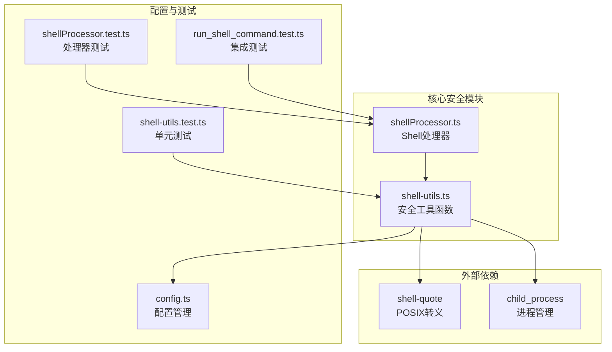
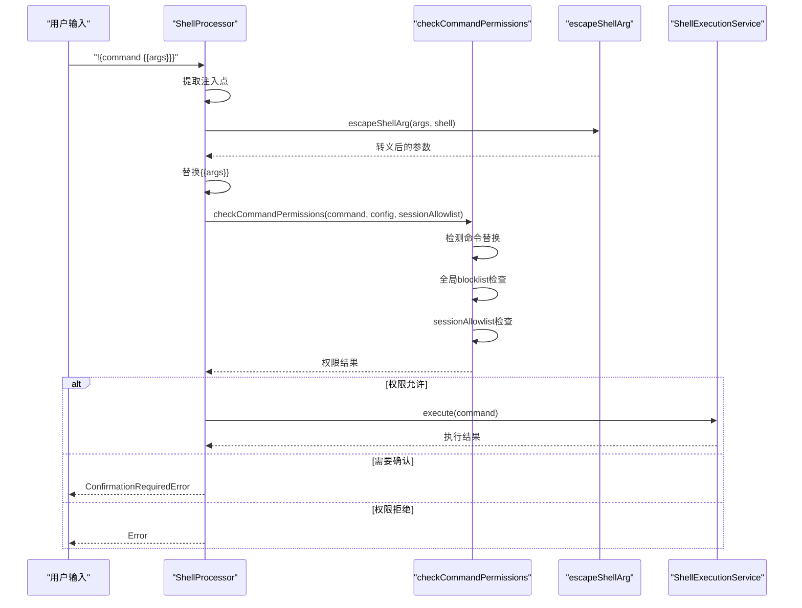
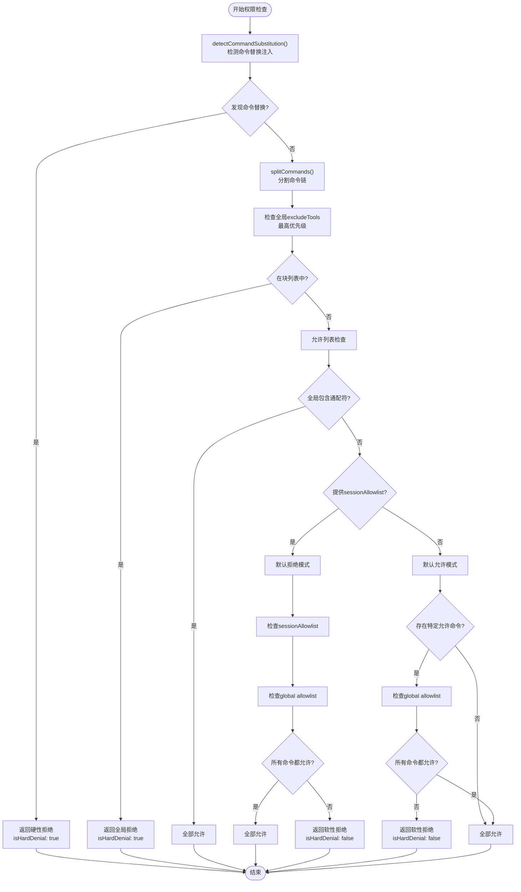
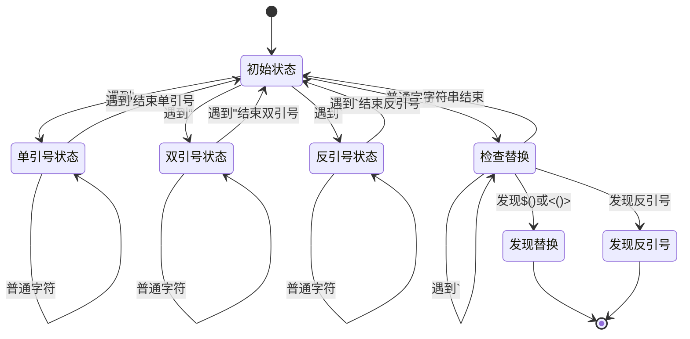
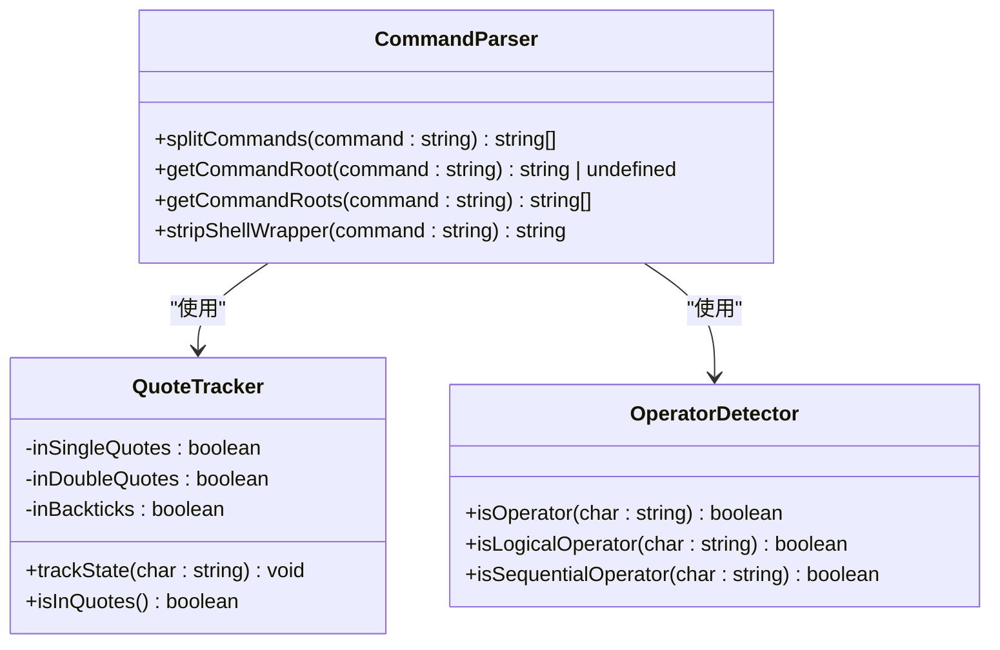
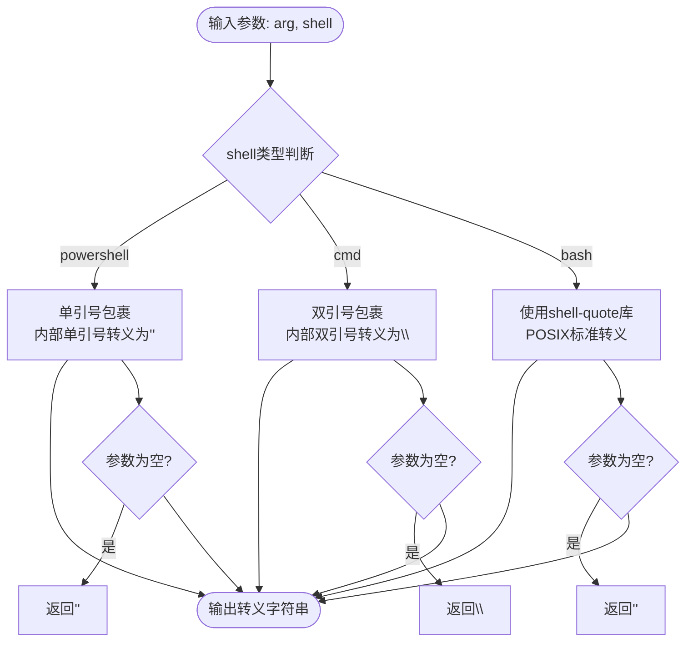
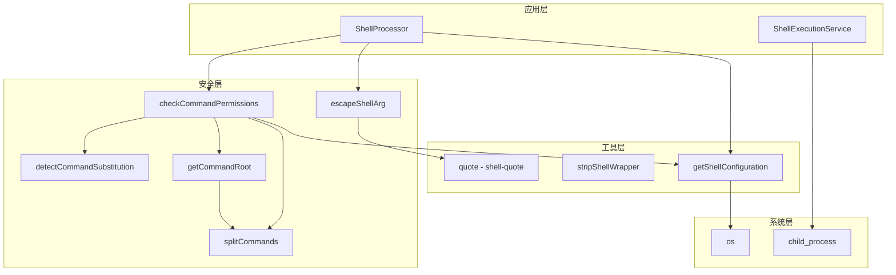

# 命令安全控制体系

<cite>
**本文档中引用的文件**
- [shell-utils.ts](file://packages/core/src/utils/shell-utils.ts)
- [shellProcessor.ts](file://packages/cli/src/services/prompt-processors/shellProcessor.ts)
- [shell-utils.test.ts](file://packages/core/src/utils/shell-utils.test.ts)
- [shellProcessor.test.ts](file://packages/cli/src/services/prompt-processors/shellProcessor.test.ts)
- [run_shell_command.test.ts](file://integration-tests/run_shell_command.test.ts)
</cite>

## 目录
1. [简介](#简介)
2. [项目结构概览](#项目结构概览)
3. [核心安全组件](#核心安全组件)
4. [架构总览](#架构总览)
5. [详细组件分析](#详细组件分析)
6. [依赖关系分析](#依赖关系分析)
7. [性能考虑](#性能考虑)
8. [故障排除指南](#故障排除指南)
9. [结论](#结论)

## 简介

Gemini CLI 实现了一套完整的Shell命令安全控制体系，旨在防止命令注入攻击和未经授权的系统访问。该体系通过多重验证机制确保Shell命令的安全执行，包括全局blocklist的硬性拒绝和sessionAllowlist的软性确认。

本文档深入解析了四个核心安全函数：
- `checkCommandPermissions`: 实现双重验证机制
- `detectCommandSubstitution`: 通过状态机检测命令替换注入
- `getCommandRoot` 和 `splitCommands`: 解析命令链并提取根命令
- `escapeShellArg`: 针对不同shell的差异化转义策略

## 项目结构概览

Shell命令安全控制体系主要分布在以下关键模块中：



**图表来源**
- [shell-utils.ts](file://packages/core/src/utils/shell-utils.ts#L1-L509)
- [shellProcessor.ts](file://packages/cli/src/services/prompt-processors/shellProcessor.ts#L1-L216)

**章节来源**
- [shell-utils.ts](file://packages/core/src/utils/shell-utils.ts#L1-L509)
- [shellProcessor.ts](file://packages/cli/src/services/prompt-processors/shellProcessor.ts#L1-L216)

## 核心安全组件

### Shell类型定义

系统支持三种不同的Shell类型，每种都有特定的转义规则：

```typescript
export type ShellType = 'cmd' | 'powershell' | 'bash';
```

### Shell配置管理

```typescript
export interface ShellConfiguration {
  executable: string;
  argsPrefix: string[];
  shell: ShellType;
}
```

系统根据平台自动选择合适的Shell配置：
- **Unix/Linux/macOS**: 使用bash，参数为`['-c']`
- **Windows CMD**: 使用cmd.exe，参数为`['/d', '/s', '/c']`
- **Windows PowerShell**: 使用powershell.exe，参数为`['-NoProfile', '-Command']`

**章节来源**
- [shell-utils.ts](file://packages/core/src/utils/shell-utils.ts#L18-L70)

## 架构总览

整个安全控制体系采用分层设计，从输入处理到最终执行形成完整的安全链路：



**图表来源**
- [shellProcessor.ts](file://packages/cli/src/services/prompt-processors/shellProcessor.ts#L85-L125)
- [shell-utils.ts](file://packages/core/src/utils/shell-utils.ts#L314-L329)

## 详细组件分析

### checkCommandPermissions 函数详解

`checkCommandPermissions` 是整个安全控制的核心，实现了双重验证机制：



**图表来源**
- [shell-utils.ts](file://packages/core/src/utils/shell-utils.ts#L314-L450)

#### 双重验证机制详解

1. **第一层：命令替换检测**
   - 硬性拒绝任何包含命令替换的命令
   - 支持的命令替换模式：
     - `$()` - 命令替换
     - `` ` `` - 反引号命令替换
     - `<()` - 进程替换（仅未加引号）
     - `>()` - 进程替换（仅未加引号）

2. **第二层：权限验证**
   - **全局Blocklist**: 最高优先级，直接拒绝
   - **会话Allowlist**: 严格模式下的软性确认
   - **全局Allowlist**: 松散模式下的白名单

**章节来源**
- [shell-utils.ts](file://packages/core/src/utils/shell-utils.ts#L314-L450)

### detectCommandSubstitution 函数详解

该函数通过状态机解析引号规则来检测潜在的命令替换注入：



**图表来源**
- [shell-utils.ts](file://packages/core/src/utils/shell-utils.ts#L236-L284)

#### 引号规则解析

函数精确跟踪引号状态，遵循以下规则：
- **单引号 ('')**: 内容完全字面化，不进行任何替换
- **双引号 ('"')**: 支持变量替换但阻止命令替换（除非被转义）
- **反引号 (`` ` ``)**: 在单引号外工作，支持命令替换

**章节来源**
- [shell-utils.ts](file://packages/core/src/utils/shell-utils.ts#L236-L284)

### getCommandRoot 和 splitCommands 函数详解

这两个函数协同工作，解析复杂的命令链并提取根命令：



**图表来源**
- [shell-utils.ts](file://packages/core/src/utils/shell-utils.ts#L158-L235)
- [shell-utils.ts](file://packages/core/src/utils/shell-utils.ts#L180-L235)

#### splitCommands 实现细节

函数通过状态跟踪处理嵌套引号和操作符：

1. **引号状态跟踪**: 维护三个布尔值跟踪引号状态
2. **转义字符处理**: 自动跳过转义字符
3. **操作符识别**: 正确识别逻辑和顺序操作符
4. **命令分割**: 将复杂命令链分割为独立命令

#### getCommandRoot 实现细节

函数使用正则表达式提取命令的根名称：
- 支持带引号的命令路径
- 自动提取最后一个组件作为命令名
- 处理跨平台路径分隔符

**章节来源**
- [shell-utils.ts](file://packages/core/src/utils/shell-utils.ts#L158-L235)

### escapeShellArg 函数详解

该函数实现针对不同Shell的差异化转义策略：



**图表来源**
- [shell-utils.ts](file://packages/core/src/utils/shell-utils.ts#L72-L90)

#### 不同Shell的转义策略

1. **PowerShell**:
   - 使用单引号包裹整个参数
   - 内部单引号转义为两个单引号
   - 双引号保持原样

2. **CMD (Windows)**:
   - 使用双引号包裹整个参数
   - 内部双引号转义为两个双引号
   - 单引号保持原样

3. **Bash (POSIX)**:
   - 使用shell-quote库进行标准POSIX转义
   - 处理各种特殊字符和空格
   - 保持引号语义

**章节来源**
- [shell-utils.ts](file://packages/core/src/utils/shell-utils.ts#L72-L90)

## 依赖关系分析

安全控制体系的依赖关系呈现清晰的层次结构：



**图表来源**
- [shell-utils.ts](file://packages/core/src/utils/shell-utils.ts#L1-L509)
- [shellProcessor.ts](file://packages/cli/src/services/prompt-processors/shellProcessor.ts#L1-L216)

**章节来源**
- [shell-utils.ts](file://packages/core/src/utils/shell-utils.ts#L1-L509)
- [shellProcessor.ts](file://packages/cli/src/services/prompt-processors/shellProcessor.ts#L1-L216)

## 性能考虑

### 算法复杂度分析

1. **detectCommandSubstitution**: O(n)，线性扫描
2. **splitCommands**: O(n)，线性扫描
3. **checkCommandPermissions**: O(m×k)，其中m为命令数量，k为allowlist大小
4. **escapeShellArg**: O(n)，线性处理

### 优化策略

- **早期退出**: 检测到命令替换时立即返回
- **缓存机制**: 对于重复命令可考虑缓存权限检查结果
- **批量处理**: 合并多个命令的权限检查
- **异步处理**: 权限检查可在后台进行

## 故障排除指南

### 常见问题及解决方案

1. **命令被错误拒绝**
   - 检查是否包含命令替换语法
   - 验证allowlist配置
   - 确认blocklist设置

2. **转义失败**
   - 确认shell类型正确
   - 检查特殊字符处理
   - 验证引号匹配

3. **性能问题**
   - 优化allowlist大小
   - 减少不必要的权限检查
   - 使用YOLO模式（仅测试环境）

**章节来源**
- [shell-utils.test.ts](file://packages/core/src/utils/shell-utils.test.ts#L1-L448)

## 结论

Gemini CLI 的Shell命令安全控制体系通过精心设计的多层防护机制，有效防止了命令注入攻击和未经授权的系统访问。该体系的核心优势包括：

1. **双重验证机制**: 既防止恶意命令替换，又支持细粒度的权限控制
2. **跨平台兼容**: 针对不同操作系统和Shell提供专门的转义策略
3. **灵活的配置选项**: 支持全局和会话级别的权限管理
4. **完善的测试覆盖**: 包含单元测试、集成测试和端到端测试

这套安全控制体系为开发者提供了强大而灵活的Shell命令执行能力，同时确保了系统的安全性。通过持续的测试和改进，它能够适应不断变化的安全威胁和使用需求。