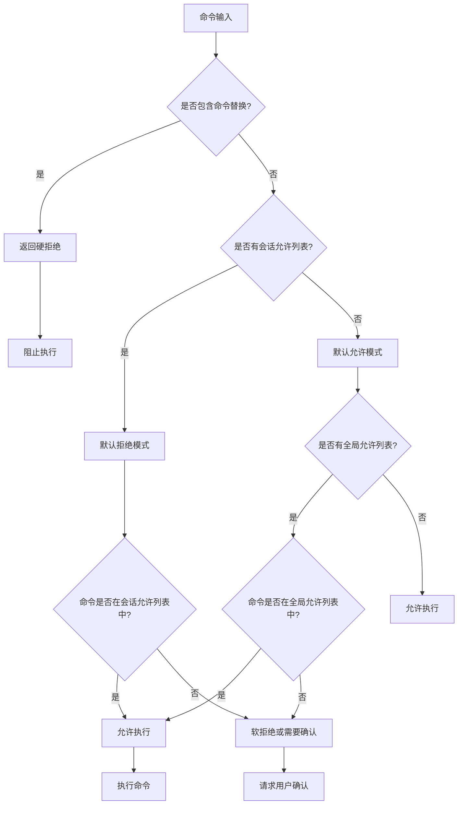

# 命令注入防护机制

<cite>
**本文档中引用的文件**
- [shell-utils.ts](file://packages/core/src/utils/shell-utils.ts)
- [shell-utils.test.ts](file://packages/core/src/utils/shell-utils.test.ts)
- [shellProcessor.ts](file://packages/cli/src/services/prompt-processors/shellProcessor.ts)
- [shell.ts](file://packages/core/src/tools/shell.ts)
- [run_shell_command.test.ts](file://integration-tests/run_shell_command.test.ts)
</cite>

## 目录
1. [简介](#简介)
2. [项目结构概览](#项目结构概览)
3. [核心组件分析](#核心组件分析)
4. [架构概览](#架构概览)
5. [详细组件分析](#详细组件分析)
6. [依赖关系分析](#依赖关系分析)
7. [性能考虑](#性能考虑)
8. [故障排除指南](#故障排除指南)
9. [结论](#结论)

## 简介

命令注入防护机制是 Gemini CLI 中最重要的安全特性之一，专门设计用于防止恶意用户通过 Shell 命令注入攻击系统。该机制的核心是 `detectCommandSubstitution` 函数，它采用状态机模型精确解析 Shell 命令中的引号规则，能够识别并阻止各种命令替换注入模式。

该防护系统通过多层次的安全检查，包括引号状态跟踪、命令替换模式检测和权限验证，为系统提供了强大的保护能力。它不仅能够检测传统的命令替换（如 `$()`、`` ` ``），还能识别现代的进程替换语法（如 `<()`、`()>`）。

## 项目结构概览

命令注入防护机制分布在多个模块中，形成了一个完整的安全防护体系：


**图表来源**
- [shell-utils.ts](file://packages/core/src/utils/shell-utils.ts#L1-L509)
- [shell.ts](file://packages/core/src/tools/shell.ts#L1-L492)
- [shellProcessor.ts](file://packages/cli/src/services/prompt-processors/shellProcessor.ts#L1-L216)

**章节来源**
- [shell-utils.ts](file://packages/core/src/utils/shell-utils.ts#L1-L509)
- [shell.ts](file://packages/core/src/tools/shell.ts#L1-L492)

## 核心组件分析

### 检测引擎：detectCommandSubstitution 函数

`detectCommandSubstitution` 函数是整个防护机制的核心，它实现了精确的状态机模型来解析 Shell 命令中的引号规则：

```typescript
export function detectCommandSubstitution(command: string): boolean {
  let inSingleQuotes = false;
  let inDoubleQuotes = false;
  let inBackticks = false;
  let i = 0;

  while (i < command.length) {
    const char = command[i];
    const nextChar = command[i + 1];

    // 处理转义字符 - 只在单引号外有效
    if (char === '\\' && !inSingleQuotes) {
      i += 2; // 跳过被转义的字符
      continue;
    }

    // 处理引号状态变化
    if (char === "'" && !inDoubleQuotes && !inBackticks) {
      inSingleQuotes = !inSingleQuotes;
    } else if (char === '"' && !inSingleQuotes && !inBackticks) {
      inDoubleQuotes = !inDoubleQuotes;
    } else if (char === '`' && !inSingleQuotes) {
      inBackticks = !inBackticks;
    }

    // 检查可能被执行的命令替换模式
    if (!inSingleQuotes) {
      // $(...) 命令替换 - 在双引号和无引号环境中都有效
      if (char === '$' && nextChar === '(') {
        return true;
      }

      // <(...) 进程替换 - 只在无引号环境中有效
      if (char === '<' && nextChar === '(' && !inDoubleQuotes && !inBackticks) {
        return true;
      }

      // >(...) 进程替换 - 只在无引号环境中有效
      if (char === '>' && nextChar === '(' && !inDoubleQuotes && !inBackticks) {
        return true;
      }

      // 反引号命令替换 - 检查开反引号
      if (char === '`' && !inBackticks) {
        return true;
      }
    }

    i++;
  }

  return false;
}
```

### 权限验证系统

权限验证系统通过 `checkCommandPermissions` 函数实现，支持两种不同的安全模式：



**图表来源**
- [shell-utils.ts](file://packages/core/src/utils/shell-utils.ts#L290-L370)

**章节来源**
- [shell-utils.ts](file://packages/core/src/utils/shell-utils.ts#L200-L370)

## 架构概览

命令注入防护机制采用了分层架构设计，每一层都有特定的安全职责：


**图表来源**
- [shellProcessor.ts](file://packages/cli/src/services/prompt-processors/shellProcessor.ts#L40-L100)
- [shell.ts](file://packages/core/src/tools/shell.ts#L200-L300)

## 详细组件分析

### 引号状态跟踪机制

引号状态跟踪是命令注入防护的关键技术，它精确地维护了三种引号状态：


**图表来源**
- [shell-utils.ts](file://packages/core/src/utils/shell-utils.ts#L236-L260)

### 命令替换模式检测

系统能够检测四种主要的命令替换模式：

1. **$(...) 命令替换**：最常用的命令替换形式
2. **反引号命令替换**：传统但仍然有效的替换形式
3. **<(...) 进程替换**：输出重定向到命名管道
4. **>(...) 进程替换**：输入重定向从命名管道

每种模式都有其特定的检测逻辑和安全级别：


**图表来源**
- [shell-utils.ts](file://packages/core/src/utils/shell-utils.ts#L260-L284)

### Shell 处理器集成

Shell 处理器负责将命令注入检测集成到整个处理流程中：


**图表来源**
- [shellProcessor.ts](file://packages/cli/src/services/prompt-processors/shellProcessor.ts#L40-L120)

**章节来源**
- [shellProcessor.ts](file://packages/cli/src/services/prompt-processors/shellProcessor.ts#L1-L216)

### 测试覆盖范围

系统提供了全面的测试覆盖，确保检测机制的可靠性：


**图表来源**
- [shell-utils.test.ts](file://packages/core/src/utils/shell-utils.test.ts#L1-L448)

**章节来源**
- [shell-utils.test.ts](file://packages/core/src/utils/shell-utils.test.ts#L1-L448)

## 依赖关系分析

命令注入防护机制的依赖关系体现了清晰的分层架构：


**图表来源**
- [shell-utils.ts](file://packages/core/src/utils/shell-utils.ts#L1-L15)
- [shell.ts](file://packages/core/src/tools/shell.ts#L1-L30)

**章节来源**
- [shell-utils.ts](file://packages/core/src/utils/shell-utils.ts#L1-L509)
- [shell.ts](file://packages/core/src/tools/shell.ts#L1-L492)

## 性能考虑

命令注入防护机制在设计时充分考虑了性能优化：

### 时间复杂度分析

- **检测算法**：O(n)，其中 n 是命令字符串长度
- **状态跟踪**：O(1) 空间复杂度
- **权限验证**：O(m)，其中 m 是允许列表大小

### 优化策略

1. **早期退出**：一旦发现不安全模式立即返回
2. **状态缓存**：避免重复计算引号状态
3. **批量处理**：支持链式命令的批量验证

## 故障排除指南

### 常见问题诊断

1. **误报问题**
   - 检查引号状态跟踪是否正确
   - 验证转义字符处理逻辑
   - 确认命令替换模式检测规则

2. **漏报问题**
   - 验证所有命令替换模式都被检测
   - 检查引号嵌套规则的完整性
   - 确保权限验证流程的正确性

3. **性能问题**
   - 监控检测算法的时间复杂度
   - 检查内存使用情况
   - 优化状态跟踪机制

**章节来源**
- [shell-utils.test.ts](file://packages/core/src/utils/shell-utils.test.ts#L100-L150)

## 结论

命令注入防护机制通过精心设计的状态机模型和多层安全检查，为 Gemini CLI 提供了强大的安全保护。`detectCommandSubstitution` 函数作为核心检测引擎，能够精确识别各种命令替换注入模式，确保系统的安全性。

该机制的成功实施得益于以下关键因素：
- 清晰的分层架构设计
- 完整的测试覆盖
- 高效的状态跟踪算法
- 灵活的权限验证系统

通过持续的监控和改进，这套防护机制将继续为用户提供安全可靠的 Shell 命令执行环境。