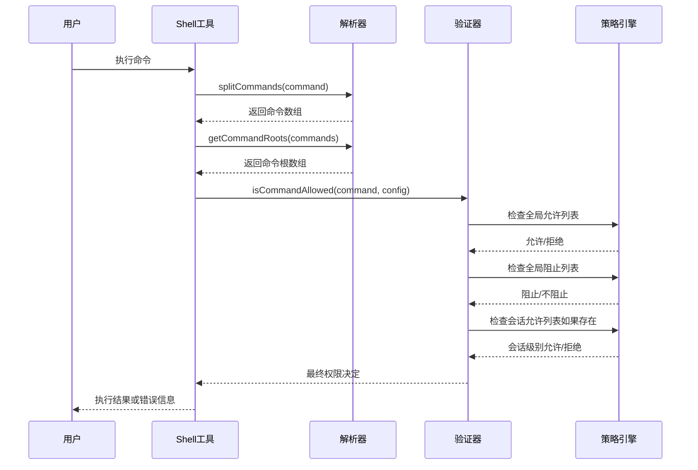
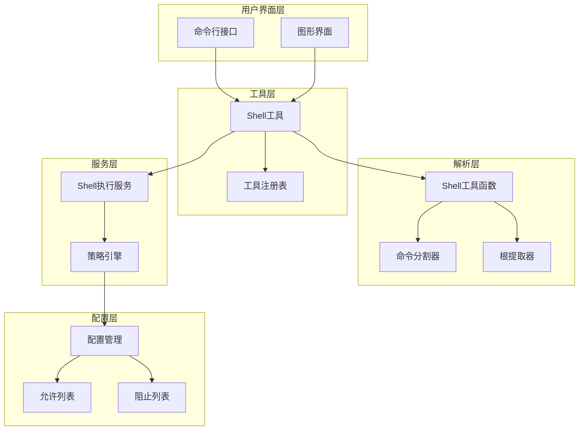

# Shell命令解析与分析技术

<cite>
**本文档中引用的文件**
- [shell-utils.ts](file://packages/core/src/utils/shell-utils.ts)
- [shell-utils.test.ts](file://packages/core/src/utils/shell-utils.test.ts)
- [shell.ts](file://packages/core/src/tools/shell.ts)
- [config.ts](file://packages/core/src/config/config.ts)
- [shellExecutionService.ts](file://packages/core/src/services/shellExecutionService.ts)
</cite>

## 目录
1. [简介](#简介)
2. [核心解析功能](#核心解析功能)
3. [命令分割机制](#命令分割机制)
4. [命令根提取算法](#命令根提取算法)
5. [权限验证系统](#权限验证系统)
6. [架构概览](#架构概览)
7. [详细组件分析](#详细组件分析)
8. [性能考虑](#性能考虑)
9. [故障排除指南](#故障排除指南)
10. [结论](#结论)

## 简介

Shell命令解析与分析是Gemini CLI系统中的关键安全组件，负责智能解析用户输入的Shell命令，确保命令执行的安全性和可控性。该系统通过两个核心函数实现了精确的命令识别和权限控制：`splitCommands`函数用于智能分割复杂的命令链，而`getCommandRoot`函数则提取每个命令的实际可执行文件名。

这种设计使得安全策略能够精确作用于实际执行的可执行文件，而不是整个命令行字符串，从而提供了细粒度的权限控制能力。

## 核心解析功能

### 智能命令分割器

`splitCommands`函数是整个解析系统的核心，它能够正确处理包含引号的复杂Shell命令，同时识别各种操作符分隔符。

```typescript
export function splitCommands(command: string): string[] {
  const commands: string[] = [];
  let currentCommand = '';
  let inSingleQuotes = false;
  let inDoubleQuotes = false;
  let i = 0;

  while (i < command.length) {
    const char = command[i];
    const nextChar = command[i + 1];

    // 处理转义字符
    if (char === '\\' && i < command.length - 1) {
      currentCommand += char + command[i + 1];
      i += 2;
      continue;
    }

    // 处理引号状态切换
    if (char === "'" && !inDoubleQuotes) {
      inSingleQuotes = !inSingleQuotes;
    } else if (char === '"' && !inSingleQuotes) {
      inDoubleQuotes = !inDoubleQuotes;
    }

    // 在引号外处理操作符
    if (!inSingleQuotes && !inDoubleQuotes) {
      if ((char === '&' && nextChar === '&') || (char === '|' && nextChar === '|')) {
        commands.push(currentCommand.trim());
        currentCommand = '';
        i++; // 跳过下一个字符
      } else if (char === ';' || char === '&' || char === '|') {
        commands.push(currentCommand.trim());
        currentCommand = '';
      } else {
        currentCommand += char;
      }
    } else {
      currentCommand += char;
    }
    i++;
  }

  if (currentCommand.trim()) {
    commands.push(currentCommand.trim());
  }

  return commands.filter(Boolean); // 过滤掉空字符串
}
```

### 命令根提取器

`getCommandRoot`函数使用正则表达式匹配来提取命令的根名称，同时处理路径形式的命令并提取basename。

```typescript
export function getCommandRoot(command: string): string | undefined {
  const trimmedCommand = command.trim();
  if (!trimmedCommand) {
    return undefined;
  }

  // 正则表达式匹配第一个单词，尊重引号规则
  const match = trimmedCommand.match(/^"([^"]+)"|^'([^']+)'|^(\S+)/);
  if (match) {
    // 优先使用捕获组，因为它们是未加引号的
    const commandRoot = match[1] || match[2] || match[3];
    if (commandRoot) {
      // 如果是路径形式，返回最后一个组件
      return commandRoot.split(/[\\/]/).pop();
    }
  }

  return undefined;
}
```

**章节来源**
- [shell-utils.ts](file://packages/core/src/utils/shell-utils.ts#L109-L195)

## 命令分割机制

### 引号状态管理

命令分割器通过维护两个布尔变量来跟踪引号状态：

- `inSingleQuotes`: 跟踪单引号状态
- `inDoubleQuotes`: 跟踪双引号状态

这种状态机设计确保了在引号内的字符不会被误认为是操作符。

### 操作符识别

系统能够识别以下操作符分隔符：
- `&&`: 逻辑与操作符
- `||`: 逻辑或操作符  
- `;`: 分号操作符
- `&`: 后台执行操作符
- `|`: 管道操作符

### 转义字符处理

系统正确处理反斜杠转义，确保特殊字符在引号内也能被正确解析。

```mermaid
flowchart TD
Start([开始解析命令]) --> InitVars["初始化变量<br/>commands=[], currentCommand='', inSingle=false, inDouble=false"]
InitVars --> Loop{"遍历字符"}
Loop --> CheckEscape{"是否为转义字符?"}
CheckEscape --> |是| AddEscaped["添加转义字符到当前命令<br/>跳过两个字符"]
CheckEscape --> |否| CheckQuotes{"检查引号状态"}
CheckQuotes --> ToggleQuotes["切换引号状态"]
CheckQuotes --> CheckOperators{"在引号外?"}
CheckOperators --> |是| CheckOpType{"检查操作符类型"}
CheckOpType --> |&& 或 ||| SplitAndContinue["分割命令<br/>重置currentCommand<br/>跳过下一个字符"]
CheckOpType --> |; & | SplitAndContinue
CheckOpType --> |其他| AddChar["添加字符到当前命令"]
CheckOperators --> |否| AddChar
AddChar --> Loop
SplitAndContinue --> Loop
ToggleQuotes --> Loop
AddEscaped --> Loop
Loop --> CheckEnd{"是否结束?"}
CheckEnd --> |否| Loop
CheckEnd --> |是| FinalCheck{"检查剩余命令"}
FinalCheck --> |有内容| AddFinal["添加最后的命令"]
FinalCheck --> |无内容| FilterEmpty["过滤空字符串"]
AddFinal --> FilterEmpty
FilterEmpty --> End([返回命令数组])
```

**图表来源**
- [shell-utils.ts](file://packages/core/src/utils/shell-utils.ts#L109-L160)

**章节来源**
- [shell-utils.ts](file://packages/core/src/utils/shell-utils.ts#L109-L160)

## 命令根提取算法

### 正则表达式匹配策略

`getCommandRoot`函数使用精心设计的正则表达式来处理各种引号情况：

```javascript
const match = trimmedCommand.match(/^"([^"]+)"|^'([^']+)'|^(\S+)/);
```

这个正则表达式的三个分支分别处理：
1. 双引号包裹的命令
2. 单引号包裹的命令  
3. 无引号的命令

### 路径处理逻辑

对于路径形式的命令，系统会提取最后一个组件作为命令根：

```typescript
// 示例："/usr/bin/ls -la" -> "ls"
// 示例："C:\Windows\System32\cmd.exe" -> "cmd.exe"
return commandRoot.split(/[\\/]/).pop();
```

### 命令根提取流程

```mermaid
flowchart TD
Start([输入命令]) --> Trim["去除首尾空白"]
Trim --> CheckEmpty{"命令是否为空?"}
CheckEmpty --> |是| ReturnUndef["返回undefined"]
CheckEmpty --> |否| RegexMatch["使用正则表达式匹配<br/>/^"([^"]+)"|^'([^']+)'|^(\S+)/"]
RegexMatch --> CheckMatch{"匹配成功?"}
CheckMatch --> |否| ReturnUndef
CheckMatch --> |是| GetCapture["获取捕获组<br/>优先选择非空捕获组"]
GetCapture --> CheckCommand{"命令是否存在?"}
CheckCommand --> |否| ReturnUndef
CheckCommand --> |是| CheckPath{"是否为路径?"}
CheckPath --> |是| ExtractBasename["提取路径最后一部分"]
CheckPath --> |否| ReturnRoot["直接返回命令根"]
ExtractBasename --> ReturnBasename["返回basename"]
ReturnRoot --> End([返回结果])
ReturnBasename --> End
ReturnUndef --> End
```

**图表来源**
- [shell-utils.ts](file://packages/core/src/utils/shell-utils.ts#L162-L195)

**章节来源**
- [shell-utils.ts](file://packages/core/src/utils/shell-utils.ts#L162-L195)

## 权限验证系统

### 安全策略架构

权限验证系统基于两种模式运行：

1. **默认拒绝模式（Default Deny）**: 使用会话级允许列表
2. **默认允许模式（Default Allow）**: 使用全局允许列表

### 命令子句检测

系统能够检测危险的命令替换模式：

```typescript
export function detectCommandSubstitution(command: string): boolean {
  let inSingleQuotes = false;
  let inDoubleQuotes = false;
  let inBackticks = false;
  let i = 0;

  while (i < command.length) {
    const char = command[i];
    const nextChar = command[i + 1];

    // 检查命令替换模式
    if (!inSingleQuotes) {
      // $(...) 命令替换
      if (char === '$' && nextChar === '(') {
        return true;
      }

      // <(...) 进程替换
      if (char === '<' && nextChar === '(' && !inDoubleQuotes && !inBackticks) {
        return true;
      }

      // >(...) 进程替换
      if (char === '>' && nextChar === '(' && !inDoubleQuotes && !inBackticks) {
        return true;
      }

      // 反引号命令替换
      if (char === '`' && !inBackticks) {
        return true;
      }
    }

    i++;
  }

  return false;
}
```

### 权限检查流程



**图表来源**
- [shell.ts](file://packages/core/src/tools/shell.ts#L100-L150)
- [shell-utils.ts](file://packages/core/src/utils/shell-utils.ts#L286-L350)

**章节来源**
- [shell-utils.ts](file://packages/core/src/utils/shell-utils.ts#L286-L350)
- [shell.ts](file://packages/core/src/tools/shell.ts#L100-L150)

## 架构概览

### 系统组件关系



**图表来源**
- [shell.ts](file://packages/core/src/tools/shell.ts#L1-L50)
- [shell-utils.ts](file://packages/core/src/utils/shell-utils.ts#L1-L50)

### 数据流架构

```mermaid
flowchart LR
subgraph "输入阶段"
UserInput[用户输入]
RawCommand[原始命令字符串]
end
subgraph "解析阶段"
SplitPhase[命令分割阶段]
QuotePhase[引号状态管理]
OperatorPhase[操作符识别]
end
subgraph "提取阶段"
RootPhase[命令根提取]
PathPhase[路径处理]
BasenamePhase[基础名提取]
end
subgraph "验证阶段"
PermissionPhase[权限检查]
SecurityPhase[安全验证]
PolicyPhase[策略应用]
end
subgraph "执行阶段"
ExecutionPhase[命令执行]
OutputPhase[输出处理]
end
UserInput --> RawCommand
RawCommand --> SplitPhase
SplitPhase --> QuotePhase
QuotePhase --> OperatorPhase
OperatorPhase --> RootPhase
RootPhase --> PathPhase
PathPhase --> BasenamePhase
BasenamePhase --> PermissionPhase
PermissionPhase --> SecurityPhase
SecurityPhase --> PolicyPhase
PolicyPhase --> ExecutionPhase
ExecutionPhase --> OutputPhase
```



**图表来源**
- [shell-utils.ts](file://packages/core/src/utils/shell-utils.ts#L109-L195)

## 详细组件分析

### Shell工具类

Shell工具类是整个命令解析系统的入口点，它封装了所有必要的解析和验证逻辑：

```typescript
export class ShellTool extends BaseDeclarativeTool<ShellToolParams, ToolResult> {
  static Name: string = 'run_shell_command';
  private allowlist: Set<string> = new Set();

  constructor(private readonly config: Config) {
    super(
      ShellTool.Name,
      'Shell',
      getShellToolDescription(),
      Kind.Execute,
      {
        type: 'object',
        properties: {
          command: {
            type: 'string',
            description: getCommandDescription(),
          },
          description: {
            type: 'string',
            description: '简要描述命令用途',
          },
          directory: {
            type: 'string',
            description: '执行命令的工作目录',
          },
        },
        required: ['command'],
      },
      false, // 输出不是Markdown格式
      true, // 支持输出更新
    );
  }
}
```

### 命令确认机制

Shell工具实现了智能的命令确认机制：

```typescript
override async shouldConfirmExecute(_abortSignal: AbortSignal): Promise<ToolCallConfirmationDetails | false> {
  const command = stripShellWrapper(this.params.command);
  const rootCommands = [...new Set(getCommandRoots(command))];

  // 非交互模式下的严格检查
  if (!this.config.isInteractive() && this.config.getApprovalMode() !== ApprovalMode.YOLO) {
    const allowed = this.config.getAllowedTools() || [];
    const allowedSubcommands = parseAllowedSubcommands(allowed);
    if (allowedSubcommands !== null) {
      const allCommandsAllowed = rootCommands.every((cmd) => allowedSubcommands.has(cmd));
      if (!allCommandsAllowed) {
        throw new Error(`命令"${command}"不在非交互模式允许的工具列表中。`);
      }
    }
  }

  const commandsToConfirm = rootCommands.filter((command) => !this.allowlist.has(command));

  if (commandsToConfirm.length === 0) {
    return false; // 已批准且已列入允许列表
  }

  const confirmationDetails: ToolExecuteConfirmationDetails = {
    type: 'exec',
    title: '确认Shell命令',
    command: this.params.command,
    rootCommand: commandsToConfirm.join(', '),
    onConfirm: async (outcome: ToolConfirmationOutcome) => {
      if (outcome === ToolConfirmationOutcome.ProceedAlways) {
        commandsToConfirm.forEach((command) => this.allowlist.add(command));
      }
    },
  };
  return confirmationDetails;
}
```

### 执行服务集成

Shell执行服务负责实际的命令执行：

```typescript
async execute(signal: AbortSignal, updateOutput?: (output: string | AnsiOutput) => void, shellExecutionConfig?: ShellExecutionConfig, setPidCallback?: (pid: number) => void): Promise<ToolResult> {
  const strippedCommand = stripShellWrapper(this.params.command);

  if (signal.aborted) {
    return {
      llmContent: '命令在开始前被用户取消。',
      returnDisplay: '命令被用户取消。',
    };
  }

  const isWindows = os.platform() === 'win32';
  const tempFileName = `shell_pgrep_${crypto.randomBytes(6).toString('hex')}.tmp`;
  const tempFilePath = path.join(os.tmpdir(), tempFileName);

  try {
    // 包装命令以附加子进程PID到临时文件
    const commandToExecute = isWindows
      ? strippedCommand
      : (() => {
          let command = strippedCommand.trim();
          if (!command.endsWith('&')) command += ';';
          return `{ ${command} }; __code=$?; pgrep -g 0 >${tempFilePath} 2>&1; exit $__code;`;
        })();

    const cwd = this.params.directory || this.config.getTargetDir();

    // 执行命令并处理输出
    const { result: resultPromise, pid } = await ShellExecutionService.execute(
      commandToExecute,
      cwd,
      (event: ShellOutputEvent) => {
        // 处理输出事件...
      },
      signal,
      this.config.getShouldUseNodePtyShell(),
      shellExecutionConfig ?? {},
    );

    // 处理执行结果...
  } finally {
    // 清理临时文件
    if (fs.existsSync(tempFilePath)) {
      fs.unlinkSync(tempFilePath);
    }
  }
}
```

**章节来源**
- [shell.ts](file://packages/core/src/tools/shell.ts#L1-L491)

## 性能考虑

### 内存优化策略

1. **延迟初始化**: 工具和配置仅在需要时初始化
2. **缓存机制**: 允许列表和阻止列表使用Set数据结构提高查找效率
3. **流式处理**: 输出采用流式处理避免大量内存占用

### 时间复杂度分析

- **命令分割**: O(n)，其中n是命令字符串长度
- **根提取**: O(m)，其中m是命令根的长度
- **权限检查**: O(k)，其中k是允许列表大小

### 并发处理

系统支持并发命令执行，每个命令在独立的进程中运行，避免阻塞。

## 故障排除指南

### 常见问题诊断

1. **命令分割失败**
   - 检查引号是否正确配对
   - 验证转义字符使用是否正确
   - 确认操作符分隔符识别正常

2. **权限验证错误**
   - 检查全局允许列表配置
   - 验证会话允许列表设置
   - 确认阻止列表没有误配置

3. **路径解析问题**
   - 验证工作目录权限
   - 检查路径分隔符兼容性
   - 确认文件系统访问权限

### 调试技巧

```typescript
// 启用调试模式查看详细日志
const config = new Config({
  debugMode: true,
  // 其他配置参数...
});

// 使用详细输出模式
const result = await shellTool.execute({
  command: 'ls -la',
  description: '列出目录内容',
  directory: '/home/user'
});
```

**章节来源**
- [shell-utils.test.ts](file://packages/core/src/utils/shell-utils.test.ts#L1-L200)

## 结论

Shell命令解析与分析系统通过智能的命令分割和精确的权限控制，为Gemini CLI提供了强大的安全框架。该系统的核心优势包括：

1. **精确的命令识别**: 通过引号状态管理和正则表达式匹配，能够准确提取命令根
2. **灵活的权限模型**: 支持默认允许和默认拒绝两种安全策略
3. **强大的安全验证**: 检测危险的命令替换模式，防止代码注入攻击
4. **高效的性能表现**: 优化的数据结构和算法确保快速响应
5. **完善的错误处理**: 提供详细的错误信息和故障排除指导

这种设计不仅保证了系统的安全性，还为用户提供了一致且可靠的命令执行体验。通过模块化的设计和清晰的职责分离，系统具有良好的可维护性和扩展性。