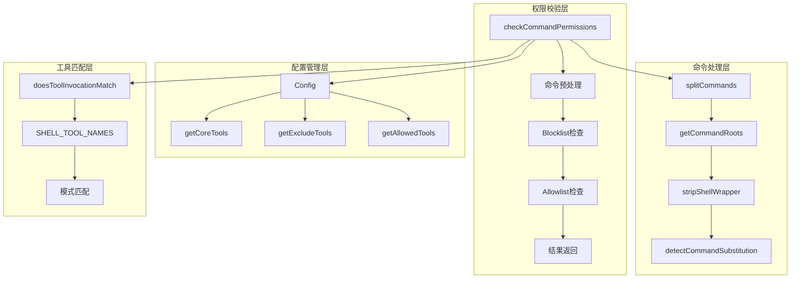
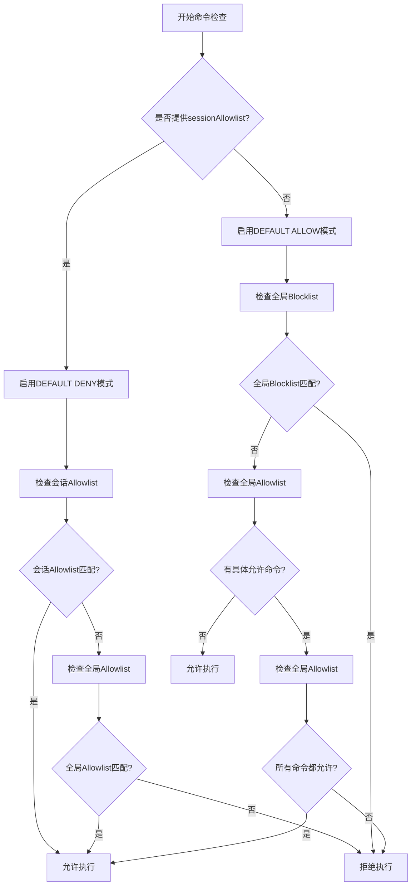

# Shell命令权限校验体系

<cite>
**本文档引用的文件**
- [shell-utils.ts](file://packages/core/src/utils/shell-utils.ts)
- [shell.ts](file://packages/core/src/tools/shell.ts)
- [tool-utils.ts](file://packages/core/src/utils/tool-utils.ts)
- [config.ts](file://packages/cli/src/config/config.ts)
- [settingsSchema.ts](file://packages/cli/src/config/settingsSchema.ts)
- [run_shell_command.test.ts](file://integration-tests/run_shell_command.test.ts)
- [shell-utils.test.ts](file://packages/core/src/utils/shell-utils.test.ts)
</cite>

## 目录
1. [概述](#概述)
2. [核心架构](#核心架构)
3. [双重验证机制](#双重验证机制)
4. [预处理与命令解析](#预处理与命令解析)
5. [安全策略模式](#安全策略模式)
6. [配置系统详解](#配置系统详解)
7. [工具匹配算法](#工具匹配算法)
8. [实际应用案例](#实际应用案例)
9. [故障排除指南](#故障排除指南)
10. [最佳实践建议](#最佳实践建议)

## 概述

Shell命令权限校验体系是Gemini CLI的核心安全组件，负责在执行用户请求的Shell命令之前进行全面的安全检查。该体系采用双重验证机制，结合全局blocklist和会话级allowlist，确保命令执行的安全性和可控性。

该系统的主要特点包括：
- **双重验证机制**：同时检查全局blocklist和会话allowlist
- **智能命令解析**：支持复杂命令链的分割和解析
- **多平台兼容**：支持Windows、macOS和Linux平台
- **灵活配置**：提供多种安全策略和配置选项
- **实时监控**：支持命令执行过程的实时监控和控制

## 核心架构



**图表来源**
- [shell-utils.ts](file://packages/core/src/utils/shell-utils.ts#L200-L450)
- [tool-utils.ts](file://packages/core/src/utils/tool-utils.ts#L15-L75)

**章节来源**
- [shell-utils.ts](file://packages/core/src/utils/shell-utils.ts#L200-L450)
- [tool-utils.ts](file://packages/core/src/utils/tool-utils.ts#L15-L75)

## 双重验证机制

### 全局Blocklist硬性拒绝

全局Blocklist是最严格的检查级别，用于阻止已知危险或不安全的命令。当配置中包含特定的工具名称时，整个Shell工具将被禁用。

```typescript
// 全局Blocklist检查示例
const excludeTools = config.getExcludeTools() || [];
const isWildcardBlocked = SHELL_TOOL_NAMES.some((name) =>
  excludeTools.includes(name),
);

if (isWildcardBlocked) {
  return {
    allAllowed: false,
    disallowedCommands: commandsToValidate,
    blockReason: 'Shell tool is globally disabled in configuration',
    isHardDenial: true,
  };
}
```

### 会话Allowlist软性确认

会话Allowlist提供了更灵活的控制方式，允许特定命令在受控环境中执行。这种模式通常用于用户定义的脚本或自定义命令。

```typescript
// 会话Allowlist检查示例
if (sessionAllowlist) {
  const normalizedSessionAllowlist = new Set(
    [...sessionAllowlist].flatMap((cmd) =>
      SHELL_TOOL_NAMES.map((name) => `${name}(${cmd})`),
    ),
  );

  for (const cmd of commandsToValidate) {
    invocation.params['command'] = cmd;
    const isSessionAllowed = doesToolInvocationMatch(
      'run_shell_command',
      invocation,
      [...normalizedSessionAllowlist],
    );
    if (isSessionAllowed) continue;

    const isGloballyAllowed = doesToolInvocationMatch(
      'run_shell_command',
      invocation,
      coreTools,
    );
    if (isGloballyAllowed) continue;

    disallowedCommands.push(cmd);
  }
}
```

**章节来源**
- [shell-utils.ts](file://packages/core/src/utils/shell-utils.ts#L250-L320)

## 预处理与命令解析

### 命令规范化

系统首先对命令进行规范化处理，去除多余的空格和换行符，确保一致性。

```typescript
const normalize = (cmd: string): string => cmd.trim().replace(/\s+/g, ' ');
const commandsToValidate = splitCommands(command).map(normalize);
```

### 复杂命令链解析

`splitCommands`函数能够智能地识别和分割复杂的命令链，支持各种操作符：

```typescript
export function splitCommands(command: string): string[] {
  const commands: string[] = [];
  let currentCommand = '';
  let inSingleQuotes = false;
  let inDoubleQuotes = false;
  let i = 0;

  while (i < command.length) {
    const char = command[i];
    const nextChar = command[i + 1];

    if (char === '\\' && i < command.length - 1) {
      currentCommand += char + command[i + 1];
      i += 2;
      continue;
    }

    if (char === "'" && !inDoubleQuotes) {
      inSingleQuotes = !inSingleQuotes;
    } else if (char === '"' && !inSingleQuotes) {
      inDoubleQuotes = !inDoubleQuotes;
    }

    if (!inSingleQuotes && !inDoubleQuotes) {
      if (
        (char === '&' && nextChar === '&') ||
        (char === '|' && nextChar === '|')
      ) {
        commands.push(currentCommand.trim());
        currentCommand = '';
        i++; // Skip the next character
      } else if (char === ';' || char === '&' || char === '|') {
        commands.push(currentCommand.trim());
        currentCommand = '';
      } else {
        currentCommand += char;
      }
    } else {
      currentCommand += char;
    }
    i++;
  }

  if (currentCommand.trim()) {
    commands.push(currentCommand.trim());
  }

  return commands.filter(Boolean);
}
```

### 命令根提取

`getCommandRoot`函数从完整命令中提取出基础命令名，用于权限检查：

```typescript
export function getCommandRoot(command: string): string | undefined {
  const trimmedCommand = command.trim();
  if (!trimmedCommand) {
    return undefined;
  }

  const match = trimmedCommand.match(/^"([^"]+)"|^'([^']+)'|^(\S+)/);
  if (match) {
    const commandRoot = match[1] || match[2] || match[3];
    if (commandRoot) {
      return commandRoot.split(/[\\/]/).pop();
    }
  }

  return undefined;
}
```

**章节来源**
- [shell-utils.ts](file://packages/core/src/utils/shell-utils.ts#L110-L195)

## 安全策略模式

### DEFAULT DENY（会话白名单模式）

当提供`sessionAllowlist`参数时，系统进入"默认拒绝"模式。在这种模式下，只有明确允许的命令才能执行。



**图表来源**
- [shell-utils.ts](file://packages/core/src/utils/shell-utils.ts#L200-L450)

### DEFAULT ALLOW（全局白名单模式）

当没有提供`sessionAllowlist`时，系统进入"默认允许"模式。在这种模式下，只有明确禁止的命令才会被阻止。

```typescript
// 默认允许模式的逻辑
if (sessionAllowlist) {
  // "DEFAULT DENY" MODE: 所有命令必须在会话或全局allowlist中
  // ...
} else {
  // "DEFAULT ALLOW" MODE: 没有会话allowlist
  const hasSpecificAllowedCommands =
    coreTools.filter((tool) =>
      SHELL_TOOL_NAMES.some((name) => tool.startsWith(`${name}(`)),
    ).length > 0;

  if (hasSpecificAllowedCommands) {
    for (const cmd of commandsToValidate) {
      invocation.params['command'] = cmd;
      const isGloballyAllowed = doesToolInvocationMatch(
        'run_shell_command',
        invocation,
        coreTools,
      );
      if (!isGloballyAllowed) {
        disallowedCommands.push(cmd);
      }
    }
    if (disallowedCommands.length > 0) {
      return {
        allAllowed: false,
        disallowedCommands,
        blockReason: `Command(s) not in the allowed commands list. Disallowed commands: ${disallowedCommands
          .map((c) => JSON.stringify(c))
          .join(', ')}`,
        isHardDenial: false,
      };
    }
  }
  // 如果没有特定的全局allowlist存在，且通过了blocklist检查，
  // 则命令默认允许
}
```

**章节来源**
- [shell-utils.ts](file://packages/core/src/utils/shell-utils.ts#L320-L400)

## 配置系统详解

### 核心配置接口

```typescript
interface ConfigParameters {
  sessionId: string;
  embeddingModel?: string;
  sandbox?: SandboxConfig;
  targetDir: string;
  debugMode: boolean;
  question?: string;
  
  // 权限相关配置
  coreTools?: string[];
  allowedTools?: string[];
  excludeTools?: string[];
  
  // 工具发现配置
  toolDiscoveryCommand?: string;
  toolCallCommand?: string;
  mcpServerCommand?: string;
  mcpServers?: { [key: string]: MCPServerConfig };
}
```

### 配置合并机制

系统支持多层级配置合并，包括设置文件、扩展配置和命令行参数：

```typescript
function mergeExcludeTools(
  settings: Settings,
  extensions: Extension[],
  extraExcludes?: string[] | undefined,
): string[] {
  const allExcludeTools = new Set([
    ...(settings.tools?.exclude || []),
    ...(extraExcludes || []),
  ]);
  for (const extension of extensions) {
    for (const tool of extension.config.excludeTools || []) {
      allExcludeTools.add(tool);
    }
  }
  return [...allExcludeTools];
}
```

### 工具解析器

`parseAllowedSubcommands`函数解析`--allowed-tools`标志，确定哪些子命令是允许的：

```typescript
function parseAllowedSubcommands(
  allowedTools: readonly string[],
): Set<string> | null {
  const shellToolEntries = allowedTools.filter((tool) =>
    SHELL_TOOL_NAMES.some((name) => tool.startsWith(name)),
  );

  if (shellToolEntries.length === 0) {
    return new Set(); // ShellTool未提及，因此不允许任何子命令
  }

  // 如果任何条目只是"run_shell_command"或"ShellTool"，则允许所有子命令
  if (shellToolEntries.some((entry) => SHELL_TOOL_NAMES.includes(entry))) {
    return null;
  }

  const allSubcommands = new Set<string>();
  const toolNamePattern = SHELL_TOOL_NAMES.join('|');
  const regex = new RegExp(`^(${toolNamePattern})\\((.*)\\)$`);

  for (const entry of shellToolEntries) {
    const match = entry.match(regex);
    if (match) {
      const subcommands = match[2];
      if (subcommands) {
        subcommands
          .split(',')
          .map((s) => s.trim())
          .forEach((s) => s && allSubcommands.add(s));
      }
    }
  }

  return allSubcommands;
}
```

**章节来源**
- [config.ts](file://packages/cli/src/config/config.ts#L627-L826)
- [shell.ts](file://packages/core/src/tools/shell.ts#L40-L80)

## 工具匹配算法

### 模式匹配引擎

`doesToolInvocationMatch`函数实现了强大的模式匹配算法，支持精确匹配和前缀匹配：

```typescript
export function doesToolInvocationMatch(
  toolOrToolName: AnyDeclarativeTool | string,
  invocation: AnyToolInvocation,
  patterns: string[],
): boolean {
  let toolNames: string[];
  if (isTool(toolOrToolName)) {
    toolNames = [toolOrToolName.name, toolOrToolName.constructor.name];
  } else {
    toolNames = [toolOrToolName as string];
  }

  if (toolNames.some((name) => SHELL_TOOL_NAMES.includes(name))) {
    toolNames = [...new Set([...toolNames, ...SHELL_TOOL_NAMES])];
  }

  for (const pattern of patterns) {
    const openParen = pattern.indexOf('(');

    if (openParen === -1) {
      // 没有参数，只是一个工具名称
      if (toolNames.includes(pattern)) {
        return true;
      }
      continue;
    }

    const patternToolName = pattern.substring(0, openParen);
    if (!toolNames.includes(patternToolName)) {
      continue;
    }

    if (!pattern.endsWith(')')) {
      continue;
    }

    const argPattern = pattern.substring(openParen + 1, pattern.length - 1);

    if (
      'command' in invocation.params &&
      toolNames.some((name) => SHELL_TOOL_NAMES.includes(name))
    ) {
      const argValue = String(
        (invocation.params as { command: string }).command,
      );
      if (argValue === argPattern || argValue.startsWith(argPattern + ' ')) {
        return true;
      }
    }
  }

  return false;
}
```

### 支持的匹配模式

1. **精确匹配**：`run_shell_command`
2. **带参数的精确匹配**：`run_shell_command(ls)`
3. **通配符匹配**：`run_shell_command(*)`
4. **多个参数匹配**：`run_shell_command(ls,git,pwd)`

**章节来源**
- [tool-utils.ts](file://packages/core/src/utils/tool-utils.ts#L15-L75)

## 实际应用案例

### 基本命令执行

```typescript
// 基本命令执行示例
const result = checkCommandPermissions('ls -la', config);
console.log(result); // { allAllowed: true, disallowedCommands: [] }
```

### 复杂命令链处理

```typescript
// 复杂命令链示例
const command = 'echo "hello" && git status && rm -rf /';
const result = checkCommandPermissions(command, config);

// 结果将是：
// {
//   allAllowed: false,
//   disallowedCommands: ['rm -rf /'],
//   blockReason: "Command 'rm -rf /' is blocked by configuration",
//   isHardDenial: true
// }
```

### 会话级权限控制

```typescript
// 会话级权限控制示例
const sessionAllowlist = new Set(['ls -la', 'git status']);
const result = checkCommandPermissions('ls -la && git status', config, sessionAllowlist);

// 结果将是：
// { allAllowed: true, disallowedCommands: [] }
```

### 禁用危险命令

```typescript
// 禁用危险命令示例
config.getExcludeTools = () => ['ShellTool(rm)', 'ShellTool(shutdown)'];
const result = checkCommandPermissions('rm -rf /etc', config);

// 结果将是：
// {
//   allAllowed: false,
//   disallowedCommands: ['rm -rf /etc'],
//   blockReason: "Command 'rm -rf /etc' is blocked by configuration",
//   isHardDenial: true
// }
```

### 允许特定工具

```typescript
// 允许特定工具示例
config.getCoreTools = () => ['ShellTool(ls)', 'ShellTool(pwd)', 'ShellTool(date)'];
const result = checkCommandPermissions('ls -la && git status', config);

// 结果将是：
// {
//   allAllowed: false,
//   disallowedCommands: ['git status'],
//   blockReason: "Command(s) not in the allowed commands list. Disallowed commands: \"git status\"",
//   isHardDenial: false
// }
```

**章节来源**
- [shell-utils.test.ts](file://packages/core/src/utils/shell-utils.test.ts#L162-L224)
- [run_shell_command.test.ts](file://integration-tests/run_shell_command.test.ts#L100-L200)

## 故障排除指南

### 常见问题诊断

#### 1. 命令被意外拒绝

**症状**：期望执行的命令被拒绝，但配置看起来正常。

**诊断步骤**：
```typescript
// 启用调试模式查看详细信息
const config = new Config({ debugMode: true, ... });
const result = checkCommandPermissions(command, config);
console.log('Block reason:', result.blockReason);
console.log('Disallowed commands:', result.disallowedCommands);
```

**解决方案**：
- 检查`excludeTools`配置
- 验证`coreTools`允许列表
- 确认命令格式正确

#### 2. 会话权限不生效

**症状**：设置了`sessionAllowlist`但命令仍然被拒绝。

**诊断步骤**：
```typescript
// 检查会话Allowlist格式
const sessionAllowlist = new Set(['ls -la', 'git status']);
const normalized = new Set(
  [...sessionAllowlist].flatMap((cmd) =>
    SHELL_TOOL_NAMES.map((name) => `${name}(${cmd})`),
  ),
);
console.log('Normalized allowlist:', normalized);
```

**解决方案**：
- 确保使用正确的工具名称格式
- 检查命令字符串的精确匹配
- 验证会话Allowlist的传递

#### 3. 多命令链处理错误

**症状**：复杂命令链中部分命令被错误拒绝。

**诊断步骤**：
```typescript
// 分析命令链分割
const commands = splitCommands(complexCommand);
console.log('Split commands:', commands);
const roots = commands.map(getCommandRoot);
console.log('Command roots:', roots);
```

**解决方案**：
- 检查命令分割逻辑
- 验证每个子命令的权限
- 确保引号和转义字符正确处理

### 调试工具

#### 权限检查调试器

```typescript
function debugPermissionCheck(command: string, config: Config, sessionAllowlist?: Set<string>) {
  console.log('=== 权限检查调试 ===');
  console.log('原始命令:', command);
  
  const normalized = command.trim().replace(/\s+/g, ' ');
  console.log('规范化命令:', normalized);
  
  const split = splitCommands(normalized);
  console.log('分割命令:', split);
  
  const roots = split.map(getCommandRoot);
  console.log('命令根:', roots);
  
  const result = checkCommandPermissions(command, config, sessionAllowlist);
  console.log('最终结果:', result);
  
  return result;
}
```

**章节来源**
- [shell-utils.ts](file://packages/core/src/utils/shell-utils.ts#L200-L450)

## 最佳实践建议

### 安全配置最佳实践

#### 1. 使用最小权限原则

```typescript
// 推荐：只允许必要的工具
config.getCoreTools = () => [
  'ShellTool(ls)', 
  'ShellTool(pwd)', 
  'ShellTool(cat)'
];

// 不推荐：允许过多工具
config.getCoreTools = () => ['ShellTool']; // 允许所有工具
```

#### 2. 组合使用Blocklist和Allowlist

```typescript
// 推荐：双重保护
config.getExcludeTools = () => ['ShellTool(rm)', 'ShellTool(shutdown)'];
config.getCoreTools = () => [
  'ShellTool(ls)', 
  'ShellTool(pwd)', 
  'ShellTool(git)'
];
```

#### 3. 会话级权限管理

```typescript
// 推荐：动态会话权限
async function executeWithPermissions(command: string, allowedCommands: string[]) {
  const sessionAllowlist = new Set(allowedCommands);
  const result = checkCommandPermissions(command, config, sessionAllowlist);
  
  if (!result.allAllowed) {
    throw new Error(`权限不足: ${result.blockReason}`);
  }
  
  return await executeCommand(command);
}
```

### 性能优化建议

#### 1. 缓存权限检查结果

```typescript
class PermissionCache {
  private cache = new Map<string, boolean>();
  
  checkPermission(command: string, config: Config): boolean {
    const key = `${command}:${config.hashCode()}`;
    if (this.cache.has(key)) {
      return this.cache.get(key)!;
    }
    
    const result = checkCommandPermissions(command, config);
    this.cache.set(key, result.allAllowed);
    return result.allAllowed;
  }
}
```

#### 2. 批量命令处理

```typescript
// 推荐：批量处理多个命令
function batchPermissionCheck(commands: string[], config: Config) {
  const results = commands.map(cmd => ({
    command: cmd,
    result: checkCommandPermissions(cmd, config)
  }));
  
  const allowed = results.filter(r => r.result.allAllowed);
  const denied = results.filter(r => !r.result.allAllowed);
  
  return { allowed, denied };
}
```

### 错误处理最佳实践

#### 1. 渐进式权限提升

```typescript
async function executeWithPermissionLevels(command: string, config: Config) {
  // 第一阶段：严格模式
  const strictResult = checkCommandPermissions(command, config);
  if (!strictResult.allAllowed) {
    // 第二阶段：宽松模式
    const looseResult = checkCommandPermissions(command, config, new Set());
    if (!looseResult.allAllowed) {
      throw new Error(`无法执行命令: ${looseResult.blockReason}`);
    }
  }
  
  return await executeCommand(command);
}
```

#### 2. 用户友好的错误信息

```typescript
function formatPermissionError(result: any, command: string): string {
  if (result.isHardDenial) {
    return `安全策略阻止了命令执行: ${result.blockReason}`;
  }
  
  if (result.disallowedCommands.length > 0) {
    return `以下命令未被允许: ${result.disallowedCommands.join(', ')}`;
  }
  
  return `未知权限错误: ${result.blockReason || '无详细信息'}`;
}
```

### 配置管理建议

#### 1. 动态配置更新

```typescript
class DynamicPermissionConfig {
  private permissions = new Map<string, Set<string>>();
  
  addAllowedCommand(toolName: string, command: string) {
    const key = toolName.toLowerCase();
    if (!this.permissions.has(key)) {
      this.permissions.set(key, new Set());
    }
    this.permissions.get(key)!.add(command);
  }
  
  getPermissions(toolName: string): Set<string> | null {
    return this.permissions.get(toolName.toLowerCase()) || null;
  }
}
```

#### 2. 配置验证

```typescript
function validatePermissionConfig(config: Config): string[] {
  const errors: string[] = [];
  
  const excludeTools = config.getExcludeTools() || [];
  const coreTools = config.getCoreTools() || [];
  
  // 检查冲突的配置
  const shellExclude = excludeTools.find(t => t.includes('ShellTool'));
  const shellAllow = coreTools.find(t => t.includes('ShellTool'));
  
  if (shellExclude && shellAllow) {
    errors.push('ShellTool不能同时出现在excludeTools和coreTools中');
  }
  
  return errors;
}
```

通过遵循这些最佳实践，可以构建一个既安全又灵活的Shell命令权限校验系统，为用户提供良好的使用体验，同时确保系统的安全性。