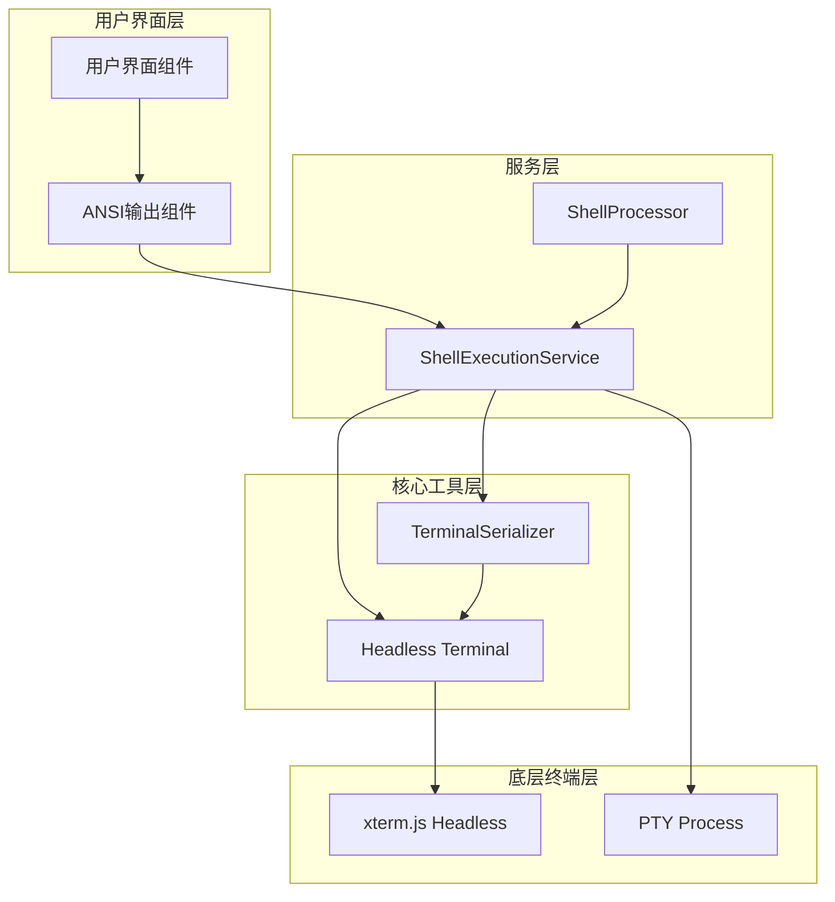
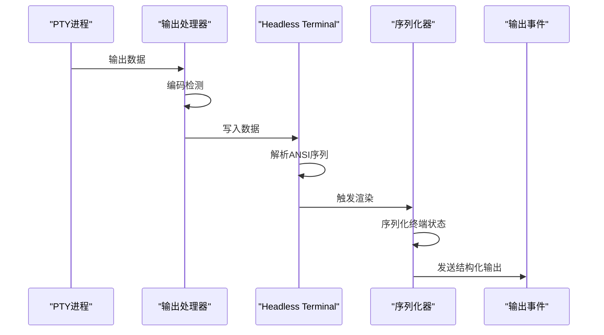
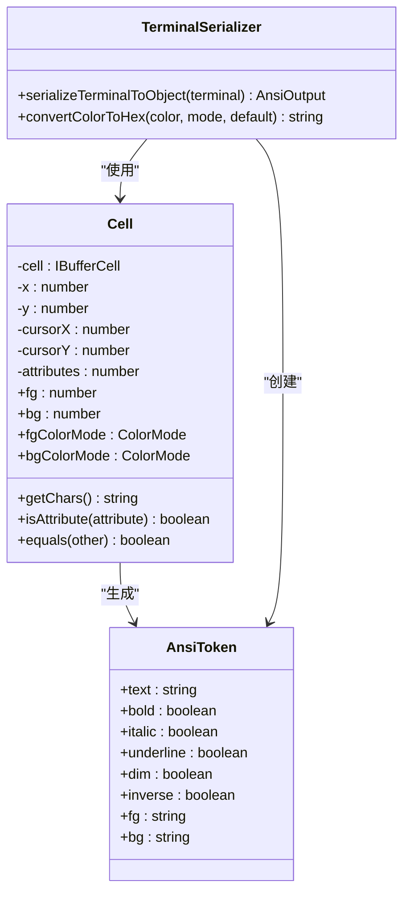
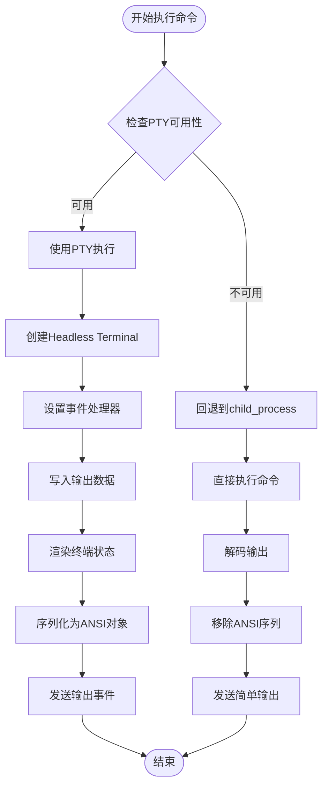
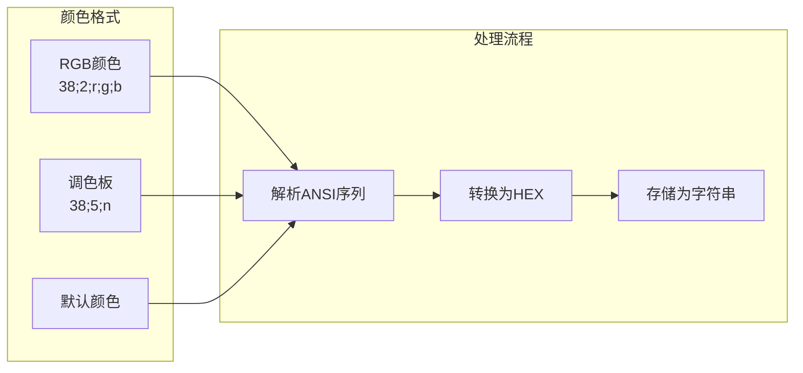

# ANSI输出捕获机制

<cite>
**本文档引用的文件**
- [terminalSerializer.ts](file://packages/core/src/utils/terminalSerializer.ts)
- [shellExecutionService.ts](file://packages/core/src/services/shellExecutionService.ts)
- [AnsiOutput.tsx](file://packages/cli/src/ui/components/AnsiOutput.tsx)
- [shellProcessor.ts](file://packages/cli/src/services/prompt-processors/shellProcessor.ts)
- [terminalSerializer.test.ts](file://packages/core/src/utils/terminalSerializer.test.ts)
- [shellExecutionService.test.ts](file://packages/core/src/services/shellExecutionService.test.ts)
</cite>

## 目录
1. [简介](#简介)
2. [核心架构概览](#核心架构概览)
3. [虚拟终端实例创建](#虚拟终端实例创建)
4. [ANSI输出捕获机制](#ansi输出捕获机制)
5. [终端序列化器详解](#终端序列化器详解)
6. [Shell执行服务集成](#shell执行服务集成)
7. [富文本信息处理](#富文本信息处理)
8. [交互式命令支持](#交互式命令支持)
9. [性能优化策略](#性能优化策略)
10. [故障排除指南](#故障排除指南)
11. [总结](#总结)

## 简介

ANSI输出捕获机制是gemini-cli项目中的核心功能之一，它通过基于headless xterm.js终端的技术实现，能够精确捕获和处理带有ANSI转义序列的富文本输出。该机制不仅能够捕获原始的字节流，更重要的是能够解析并保留ANSI转义序列所携带的丰富语义信息，包括颜色、光标定位、文本样式等。

这种设计避免了直接解析原始字节流的复杂性，而是利用xterm.js提供的高级API来处理终端状态，确保了输出的完整性和准确性。该机制在交互式命令（如文本编辑器、菜单系统）中发挥着关键作用，为用户提供一致且丰富的终端体验。

## 核心架构概览

ANSI输出捕获机制采用分层架构设计，主要包含以下几个核心组件：



**图表来源**
- [shellExecutionService.ts](file://packages/core/src/services/shellExecutionService.ts#L1-L50)
- [terminalSerializer.ts](file://packages/core/src/utils/terminalSerializer.ts#L1-L30)

**章节来源**
- [shellExecutionService.ts](file://packages/core/src/services/shellExecutionService.ts#L1-L100)
- [terminalSerializer.ts](file://packages/core/src/utils/terminalSerializer.ts#L1-L50)

## 虚拟终端实例创建

ShellExecutionService通过创建headless xterm.js终端实例来捕获输出流。这种headless终端不依赖于图形界面，但提供了完整的终端功能：

```typescript
const headlessTerminal = new Terminal({
  allowProposedApi: true,
  cols,
  rows,
});
headlessTerminal.scrollToTop();
```

创建虚拟终端实例的关键特性包括：

1. **无头设计**：不渲染到屏幕，仅在内存中维护终端状态
2. **完全兼容**：支持所有标准ANSI转义序列
3. **高性能**：专注于数据处理而非渲染
4. **可配置性**：支持自定义终端尺寸和配置

**章节来源**
- [shellExecutionService.ts](file://packages/core/src/services/shellExecutionService.ts#L250-L260)

## ANSI输出捕获机制

ANSI输出捕获机制的核心在于实时监控和处理终端输出。当PTY进程产生输出时，数据会被写入headless终端实例：



**图表来源**
- [shellExecutionService.ts](file://packages/core/src/services/shellExecutionService.ts#L350-L400)

捕获过程的关键步骤：

1. **数据接收**：从PTY进程接收原始输出数据
2. **编码检测**：自动检测输出编码格式
3. **数据写入**：将数据写入headless终端实例
4. **状态更新**：终端自动解析并更新内部状态
5. **事件触发**：当终端状态发生变化时触发渲染

**章节来源**
- [shellExecutionService.ts](file://packages/core/src/services/shellExecutionService.ts#L350-L450)

## 终端序列化器详解

terminalSerializer模块负责将终端状态转换为结构化的ANSI输出对象。其核心函数serializeTerminalToObject实现了这一转换：



**图表来源**
- [terminalSerializer.ts](file://packages/core/src/utils/terminalSerializer.ts#L25-L120)

### Cell类的设计原理

Cell类封装了终端缓冲区中单个单元格的所有属性：

```typescript
class Cell {
  constructor(
    cell: IBufferCell | null,
    x: number,
    y: number,
    cursorX: number,
    cursorY: number,
  ) {
    // 初始化属性
    if (cell) {
      if (cell.isInverse()) this.attributes += Attribute.inverse;
      if (cell.isBold()) this.attributes += Attribute.bold;
      // ... 其他属性设置
    }
  }
}
```

### 颜色模式处理

序列化器支持三种颜色模式：

1. **DEFAULT**：默认颜色，使用终端默认配色
2. **PALETTE**：8位调色板颜色（0-255）
3. **RGB**：24位真彩色（RRGGBB）

```typescript
export function convertColorToHex(
  color: number,
  colorMode: ColorMode,
  defaultColor: string,
): string {
  if (colorMode === ColorMode.RGB) {
    const r = (color >> 16) & 255;
    const g = (color >> 8) & 255;
    const b = color & 255;
    return `#${r.toString(16).padStart(2, '0')}${g.toString(16).padStart(2, '0')}${b.toString(16).padStart(2, '0')}`;
  }
  // 处理其他模式...
}
```

**章节来源**
- [terminalSerializer.ts](file://packages/core/src/utils/terminalSerializer.ts#L120-L200)

## Shell执行服务集成

ShellExecutionService集成了ANSI输出捕获机制，提供了完整的shell命令执行和输出处理能力：



**图表来源**
- [shellExecutionService.ts](file://packages/core/src/services/shellExecutionService.ts#L100-L200)

### 输出事件类型

ShellExecutionService定义了多种输出事件类型：

```typescript
export type ShellOutputEvent =
  | {
      type: 'data';
      chunk: string | AnsiOutput;
    }
  | {
      type: 'binary_detected';
    }
  | {
      type: 'binary_progress';
      bytesReceived: number;
    };
```

### 动态行修剪优化

为了提高性能，系统实现了动态行修剪功能：

```typescript
if (!shellExecutionConfig.disableDynamicLineTrimming) {
  if (!hasStartedOutput) {
    const bufferText = getFullBufferText(headlessTerminal);
    if (bufferText.trim().length === 0) {
      return; // 等待有效输出
    }
    hasStartedOutput = true;
  }
}
```

**章节来源**
- [shellExecutionService.ts](file://packages/core/src/services/shellExecutionService.ts#L390-L440)

## 富文本信息处理

ANSI输出捕获机制能够精确处理各种富文本信息，包括：

### 文本样式处理

```typescript
const token: AnsiToken = {
  text: currentText,
  bold: lastCell.isAttribute(Attribute.bold),
  italic: lastCell.isAttribute(Attribute.italic),
  underline: lastCell.isAttribute(Attribute.underline),
  dim: lastCell.isAttribute(Attribute.dim),
  inverse: lastCell.isAttribute(Attribute.inverse) || lastCell.isCursor(),
  fg: convertColorToHex(lastCell.fg, lastCell.fgColorMode, defaultFg),
  bg: convertColorToHex(lastCell.bg, lastCell.bgColorMode, defaultBg),
};
```

### 支持的样式类型

1. **粗体**：`\x1b[1m` - `\x1b[22m`
2. **斜体**：`\x1b[3m` - `\x1b[23m`
3. **下划线**：`\x1b[4m` - `\x1b[24m`
4. **暗淡**：`\x1b[2m` - `\x1b[22m`
5. **反显**：`\x1b[7m` - `\x1b[27m`

### 颜色处理

系统支持多种颜色格式：



**图表来源**
- [terminalSerializer.ts](file://packages/core/src/utils/terminalSerializer.ts#L450-L477)

**章节来源**
- [terminalSerializer.ts](file://packages/core/src/utils/terminalSerializer.ts#L130-L180)

## 交互式命令支持

ANSI输出捕获机制特别适用于交互式命令，如文本编辑器、菜单系统等。这些应用通常会产生复杂的ANSI输出：

### 实际应用场景

1. **文本编辑器**：vim、nano等编辑器产生的高亮语法和状态信息
2. **菜单系统**：ncurses应用程序的彩色菜单和提示
3. **进度条**：带有颜色和动画效果的进度指示器
4. **表格显示**：格式化的表格和布局信息

### 事件监听和数据提取

系统通过事件驱动的方式处理交互式输出：

```typescript
const render = (finalRender = false) => {
  if (renderTimeout) {
    clearTimeout(renderTimeout);
  }

  const renderFn = () => {
    if (!isStreamingRawContent) {
      return;
    }

    let newOutput: AnsiOutput;
    if (shellExecutionConfig.showColor) {
      newOutput = serializeTerminalToObject(headlessTerminal);
    } else {
      // 简化版本，移除颜色信息
      newOutput = createPlainOutput(headlessTerminal);
    }
    
    // 发送新的输出数据
    onOutputEvent({ type: 'data', chunk: newOutput });
  };

  if (finalRender) {
    renderFn();
  } else {
    renderTimeout = setTimeout(renderFn, 17); // ~60 FPS
  }
};
```

**章节来源**
- [shellExecutionService.ts](file://packages/core/src/services/shellExecutionService.ts#L320-L380)

## 性能优化策略

为了确保高效的ANSI输出捕获，系统采用了多种优化策略：

### 渲染优化

1. **防抖处理**：使用setTimeout实现17ms的渲染间隔
2. **增量更新**：只发送变化的输出部分
3. **深度比较**：使用JSON.stringify进行深度比较

```typescript
// 深度比较以避免重复渲染
if (JSON.stringify(output) !== JSON.stringify(finalOutput)) {
  output = finalOutput;
  onOutputEvent({ type: 'data', chunk: finalOutput });
}
```

### 内存管理

1. **行修剪**：自动修剪空行以减少内存占用
2. **缓冲区限制**：控制终端缓冲区大小
3. **及时清理**：在进程退出时清理资源

### 并发处理

```typescript
let processingChain = Promise.resolve();

const handleOutput = (data: Buffer) => {
  processingChain = processingChain.then(() => 
    new Promise<void>((resolve) => {
      // 异步处理输出数据
      isWriting = true;
      headlessTerminal.write(decodedChunk, () => {
        render();
        isWriting = false;
        resolve();
      });
    })
  );
};
```

**章节来源**
- [shellExecutionService.ts](file://packages/core/src/services/shellExecutionService.ts#L300-L400)

## 故障排除指南

### 常见问题及解决方案

1. **颜色显示异常**
   - 检查终端配置是否支持256色或真彩
   - 验证ANSI序列格式是否正确
   - 确认颜色模式设置

2. **输出延迟**
   - 调整渲染间隔参数
   - 检查是否有阻塞操作
   - 优化事件处理逻辑

3. **内存泄漏**
   - 确保正确清理事件监听器
   - 检查PTY进程是否正常退出
   - 监控缓冲区增长情况

### 调试技巧

```typescript
// 启用调试日志
const debugRendering = true;

if (debugRendering) {
  console.log(`[DEBUG] Rendering output: ${JSON.stringify(newOutput)}`);
}
```

### 性能监控

```typescript
// 监控渲染性能
const startTime = Date.now();
render();
const endTime = Date.now();
console.log(`[PERF] Render took ${endTime - startTime}ms`);
```

**章节来源**
- [shellExecutionService.ts](file://packages/core/src/services/shellExecutionService.ts#L350-L450)

## 总结

ANSI输出捕获机制通过结合headless xterm.js终端和智能序列化技术，实现了对富文本输出的精确捕获和处理。该机制的主要优势包括：

1. **完整性保护**：完整保留ANSI转义序列的语义信息
2. **性能优化**：通过增量更新和防抖处理提高效率
3. **兼容性强**：支持各种ANSI转义序列和颜色格式
4. **易于扩展**：模块化设计便于功能扩展

这种设计不仅简化了原始字节流的解析复杂性，还为交互式命令提供了强大的输出处理能力，是现代CLI应用中不可或缺的核心功能。