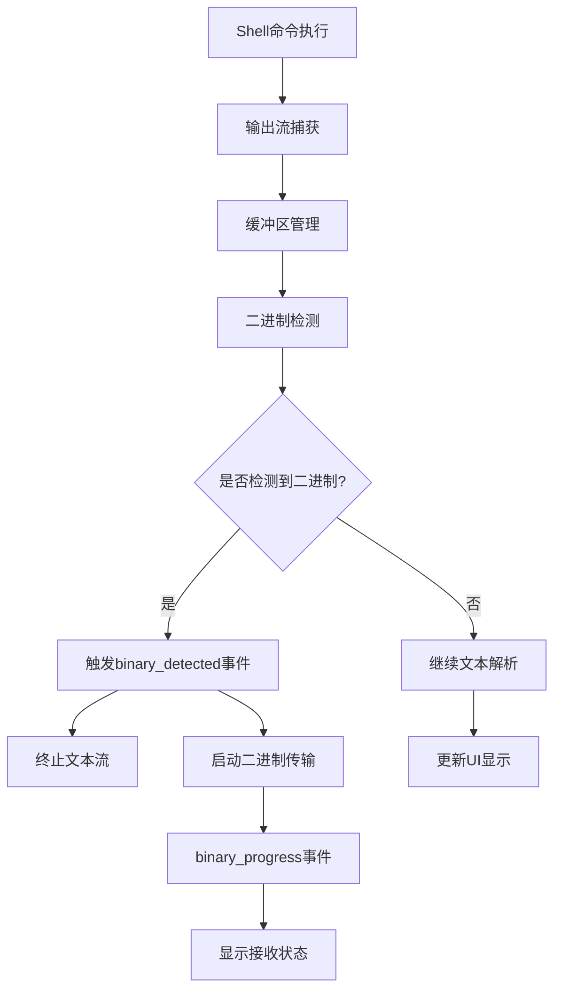
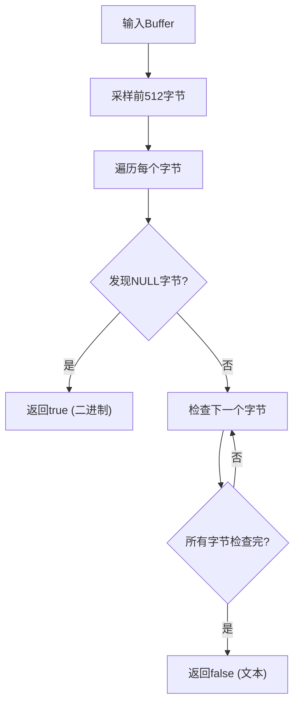
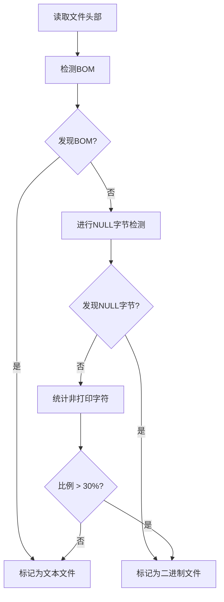
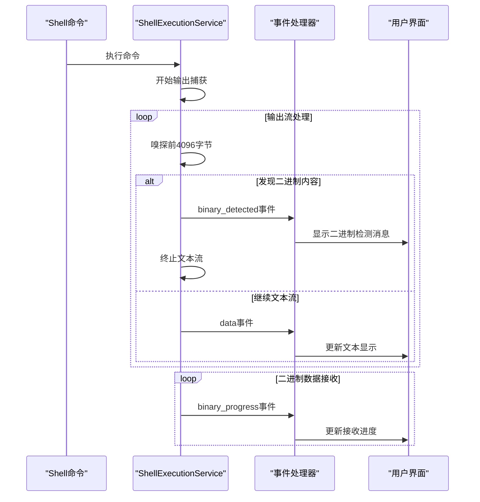
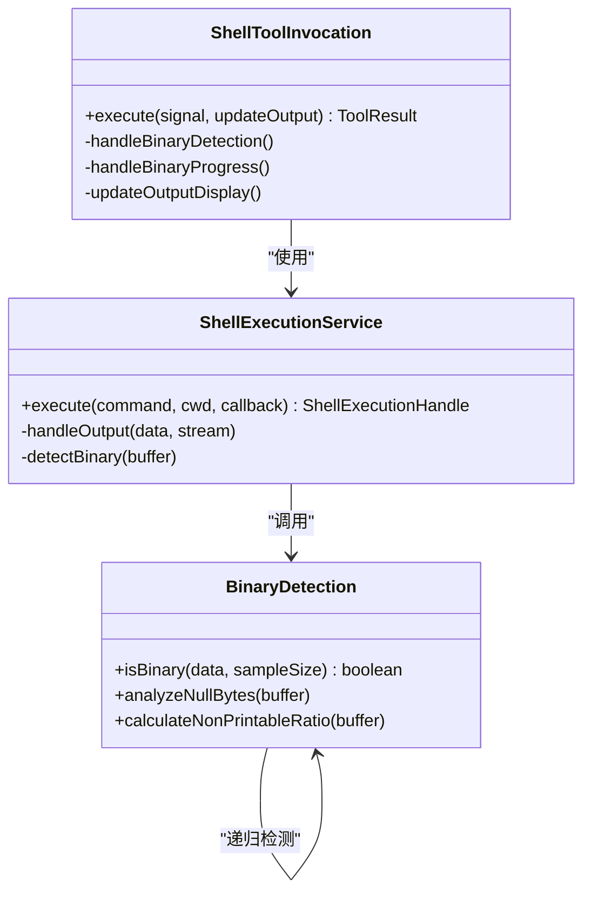
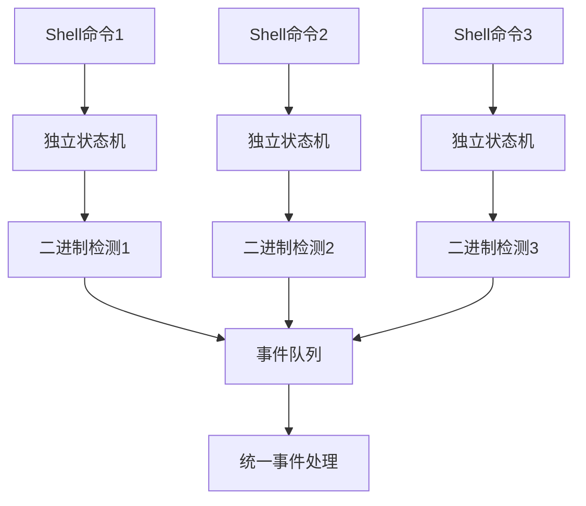

# 二进制流检测策略实现原理

<cite>
**本文档引用的文件**
- [shellExecutionService.ts](file://packages/core/src/services/shellExecutionService.ts)
- [textUtils.ts](file://packages/core/src/utils/textUtils.ts)
- [fileUtils.ts](file://packages/core/src/utils/fileUtils.ts)
- [shell.ts](file://packages/core/src/tools/shell.ts)
- [shellCommandProcessor.ts](file://packages/cli/src/ui/hooks/shellCommandProcessor.ts)
- [shell-utils.ts](file://packages/core/src/utils/shell-utils.ts)
- [shell.test.ts](file://packages/core/src/tools/shell.test.ts)
- [fileUtils.test.ts](file://packages/core/src/utils/fileUtils.test.ts)
</cite>

## 目录
1. [概述](#概述)
2. [核心检测机制](#核心检测机制)
3. [二进制检测算法](#二进制检测算法)
4. [事件处理流程](#事件处理流程)
5. [shell工具集成](#shell工具集成)
6. [性能优化策略](#性能优化策略)
7. [误判场景与解决方案](#误判场景与解决方案)
8. [故障排除指南](#故障排除指南)
9. [总结](#总结)

## 概述

二进制流检测是Gemini CLI系统中的一个关键功能模块，用于识别和处理shell命令输出中的二进制内容。该系统通过嗅探输出流的前4096字节来识别二进制内容，包括对NULL字节、非打印字符的统计分析，并在检测到二进制内容时采取相应的处理措施。

## 核心检测机制

### 流式检测架构

系统采用流式检测架构，在shell命令执行过程中实时监控输出流。主要组件包括：



**图表来源**
- [shellExecutionService.ts](file://packages/core/src/services/shellExecutionService.ts#L185-L222)
- [shellExecutionService.ts](file://packages/core/src/services/shellExecutionService.ts#L472-L501)

### 缓冲区管理策略

系统使用智能缓冲区管理策略来平衡检测准确性和性能：

```typescript
// 最大嗅探大小限制
const MAX_SNIFF_SIZE = 4096;
let sniffedBytes = 0;

// 输出缓冲区
const outputChunks: Buffer[] = [];

// 嗅探缓冲区构建
if (isStreamingRawContent && sniffedBytes < MAX_SNIFF_SIZE) {
  const sniffBuffer = Buffer.concat(outputChunks.slice(0, 20));
  sniffedBytes = sniffBuffer.length;
  
  if (isBinary(sniffBuffer)) {
    isStreamingRawContent = false;
    onOutputEvent({ type: 'binary_detected' });
  }
}
```

**章节来源**
- [shellExecutionService.ts](file://packages/core/src/services/shellExecutionService.ts#L185-L222)
- [shellExecutionService.ts](file://packages/core/src/services/shellExecutionService.ts#L472-L501)

## 二进制检测算法

### NULL字节检测

系统的核心检测算法基于NULL字节的存在性判断：



**图表来源**
- [textUtils.ts](file://packages/core/src/utils/textUtils.ts#L25-L55)

### 非打印字符统计分析

对于非BOM编码的文件，系统采用非打印字符比例阈值检测：

```typescript
// 文件二进制检测逻辑
let nonPrintableCount = 0;
for (let i = 0; i < bytesRead; i++) {
  if (buf[i] === 0) return true; // 强烈指示符：无BOM时出现NULL字节即为二进制
  if (buf[i] < 9 || (buf[i] > 13 && buf[i] < 32)) {
    nonPrintableCount++;
  }
}
// 如果非可打印字符比例超过30%，视为二进制
return nonPrintableCount / bytesRead > 0.3;
```

**章节来源**
- [fileUtils.ts](file://packages/core/src/utils/fileUtils.ts#L205-L242)

### BOM感知检测

系统具备Unicode BOM（Byte Order Mark）感知能力，避免误判：



**图表来源**
- [fileUtils.ts](file://packages/core/src/utils/fileUtils.ts#L165-L203)

**章节来源**
- [fileUtils.ts](file://packages/core/src/utils/fileUtils.ts#L165-L203)

## 事件处理流程

### binary_detected事件处理

当检测到二进制内容时，系统会触发`binary_detected`事件：

```typescript
case 'binary_detected':
  isBinaryStream = true;
  cumulativeOutput = '[Binary output detected. Halting stream...]';
  shouldUpdate = true;
  break;
```

该事件触发后：
1. 立即停止文本流解析
2. 显示二进制检测消息
3. 切换到二进制模式处理

### binary_progress事件处理

对于大体积二进制数据，系统提供进度反馈：

```typescript
case 'binary_progress':
  isBinaryStream = true;
  cumulativeOutput = `[Receiving binary output... ${formatMemoryUsage(
    event.bytesReceived,
  )} received]`;
  if (Date.now() - lastUpdateTime > OUTPUT_UPDATE_INTERVAL_MS) {
    shouldUpdate = true;
  }
  break;
```

**章节来源**
- [shell.ts](file://packages/core/src/tools/shell.ts#L219-L261)
- [shellCommandProcessor.ts](file://packages/cli/src/ui/hooks/shellCommandProcessor.ts#L151-L184)

### 事件序列图



**图表来源**
- [shellExecutionService.ts](file://packages/core/src/services/shellExecutionService.ts#L472-L501)
- [shell.ts](file://packages/core/src/tools/shell.ts#L219-L261)

## shell工具集成

### 工具参数配置

Shell工具支持多种配置选项：

```typescript
export interface ShellToolParams {
  command: string;
  description?: string;
  directory?: string;
}
```

### 执行流程控制

工具执行过程中的二进制检测集成：



**图表来源**
- [shell.ts](file://packages/core/src/tools/shell.ts#L60-L100)
- [shellExecutionService.ts](file://packages/core/src/services/shellExecutionService.ts#L185-L222)

### 背景进程管理

系统还处理shell命令的背景进程管理：

```typescript
// Windows平台直接执行
if (isWindows) {
  commandToExecute = strippedCommand;
} else {
  // 包装命令以获取后台PID
  commandToExecute = `{ ${command} }; __code=$?; pgrep -g 0 >${tempFilePath} 2>&1; exit $__code;`;
}
```

**章节来源**
- [shell.ts](file://packages/core/src/tools/shell.ts#L180-L210)

## 性能优化策略

### 智能采样策略

系统采用智能采样策略来平衡检测准确性和性能：

1. **采样大小限制**：最多嗅探4096字节
2. **早期终止**：一旦检测到二进制内容立即停止检测
3. **缓冲区复用**：重用输出缓冲区减少内存分配

### 内存使用优化

```typescript
// 分块处理避免大量内存占用
const sniffBuffer = Buffer.concat(outputChunks.slice(0, 20));
sniffedBytes = sniffBuffer.length;

// 及时释放临时缓冲区
if (isStreamingRawContent) {
  const decodedChunk = decoder.decode(data, { stream: true });
  // 处理解码后的文本
} else {
  // 仅计算二进制进度，不进行文本处理
  const totalBytes = outputChunks.reduce(
    (sum, chunk) => sum + chunk.length,
    0,
  );
  onOutputEvent({
    type: 'binary_progress',
    bytesReceived: totalBytes,
  });
}
```

**章节来源**
- [shellExecutionService.ts](file://packages/core/src/services/shellExecutionService.ts#L472-L501)

### 并发处理优化

系统支持并发处理多个shell命令的输出流，通过独立的状态机管理每个命令的二进制检测：



## 误判场景与解决方案

### 常见误判场景

1. **压缩文件**：某些压缩格式可能包含大量NULL字节
2. **特定编码文本**：某些特殊编码的文本文件可能被误判
3. **混合内容**：同时包含文本和二进制内容的文件

### 误判检测机制

```typescript
// BOM感知避免误判
const bom = detectBOM(buf.subarray(0, Math.min(4, bytesRead)));
if (bom) return false; // Unicode BOM文件视为文本

// NULL字节检测增强
if (buf[i] === 0) {
  // 仅在没有BOM的情况下才视为二进制
  if (!bom) return true;
}
```

### 误判缓解策略

1. **多层验证**：结合NULL字节和非打印字符比例双重验证
2. **上下文感知**：根据文件扩展名和内容类型进行辅助判断
3. **用户确认**：在不确定情况下提示用户确认

**章节来源**
- [fileUtils.ts](file://packages/core/src/utils/fileUtils.ts#L205-L242)

## 故障排除指南

### 常见问题诊断

#### 问题1：二进制检测过于敏感

**症状**：正常文本文件被错误识别为二进制

**解决方案**：
```typescript
// 检查文件是否具有Unicode BOM
const bom = detectBOM(buf.subarray(0, Math.min(4, bytesRead)));
if (bom) return false; // BOM文件应视为文本

// 调整非打印字符比例阈值
return nonPrintableCount / bytesRead > 0.3;
```

#### 问题2：二进制检测不够敏感

**症状**：真正的二进制文件未被识别

**解决方案**：
```typescript
// 增加采样大小
const sampleSize = Math.min(8192, fileSize); // 从4096增加到8192

// 加强NULL字节检测
for (const byte of sample) {
  if (byte === 0) {
    return true; // 发现NULL字节立即返回
  }
}
```

#### 问题3：性能问题

**症状**：二进制检测影响整体性能

**解决方案**：
```typescript
// 实现早期终止
if (isStreamingRawContent && sniffedBytes < MAX_SNIFF_SIZE) {
  const sniffBuffer = Buffer.concat(outputChunks.slice(0, 20));
  sniffedBytes = sniffBuffer.length;
  
  if (isBinary(sniffBuffer)) {
    isStreamingRawContent = false; // 立即停止检测
    return;
  }
}
```

### 调试工具

系统提供了丰富的调试信息：

```typescript
// 启用调试模式
const debugMode = config.getDebugMode();
if (debugMode) {
  console.log(`Binary detection: ${isBinary(sniffBuffer)}`);
  console.log(`Sample size: ${sniffedBytes}`);
  console.log(`Non-printable ratio: ${nonPrintableCount / bytesRead}`);
}
```

**章节来源**
- [fileUtils.ts](file://packages/core/src/utils/fileUtils.ts#L205-L242)
- [shellExecutionService.ts](file://packages/core/src/services/shellExecutionService.ts#L472-L501)

## 总结

Gemini CLI的二进制流检测策略是一个高度优化的系统，通过以下关键特性确保了高效准确的二进制内容识别：

1. **多层检测机制**：结合NULL字节检测、非打印字符统计和BOM感知
2. **流式处理架构**：实时监控输出流，支持大文件和长时间运行的命令
3. **智能优化策略**：采样限制、早期终止和内存优化
4. **完整的事件处理**：清晰的事件模型支持UI反馈和用户交互
5. **robust错误处理**：完善的异常处理和资源清理机制

该系统不仅能够准确识别二进制内容，还能优雅地处理各种边缘情况，为用户提供流畅的shell命令执行体验。通过持续的优化和改进，该检测机制将继续提升在各种场景下的表现。