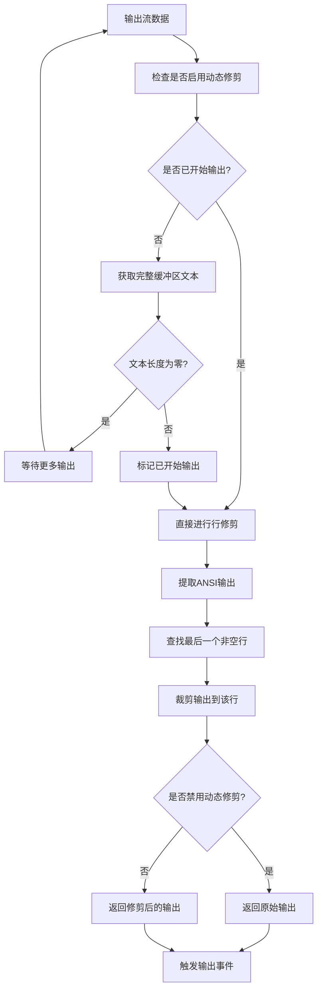
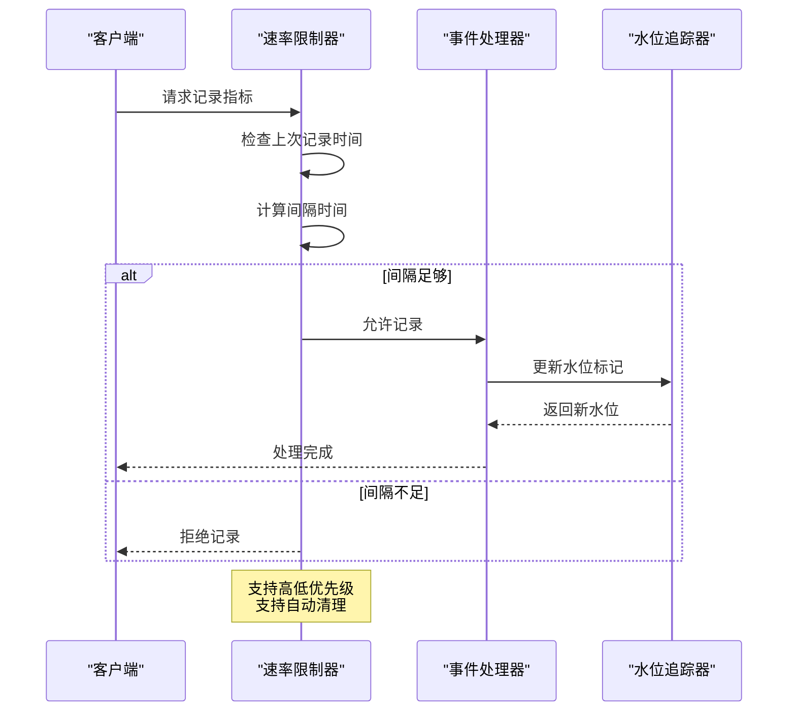
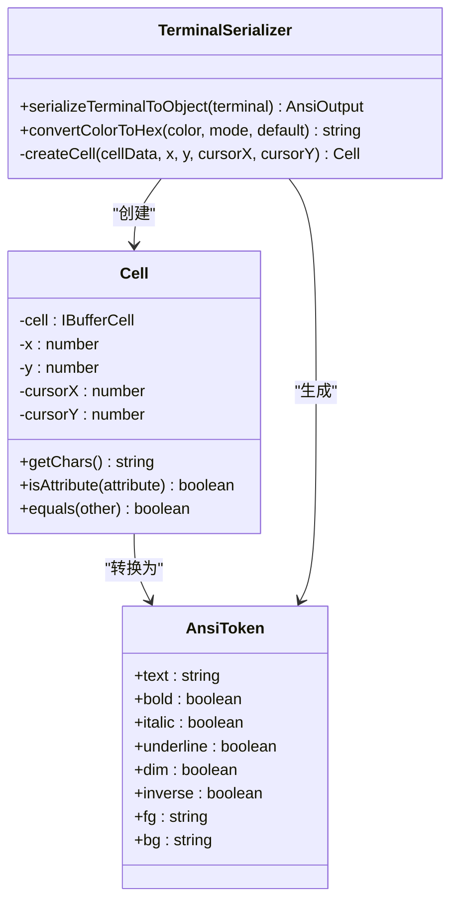
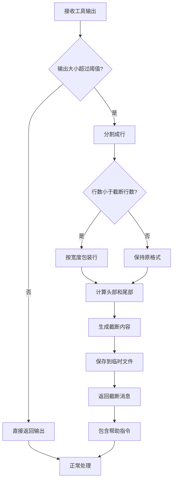

# 性能优化

<cite>
**本文档中引用的文件**
- [shellExecutionService.ts](file://packages/core/src/services/shellExecutionService.ts)
- [coreToolScheduler.ts](file://packages/core/src/core/coreToolScheduler.ts)
- [rate-limiter.ts](file://packages/core/src/telemetry/rate-limiter.ts)
- [terminalSerializer.ts](file://packages/core/src/utils/terminalSerializer.ts)
- [high-water-mark-tracker.ts](file://packages/core/src/telemetry/high-water-mark-tracker.ts)
- [config.ts](file://packages/core/src/config/config.ts)
- [save_memory.test.ts](file://integration-tests/save_memory.test.ts)
- [ShowMoreLines.tsx](file://packages/cli/src/ui/components/ShowMoreLines.tsx)
</cite>

## 目录
1. [简介](#简介)
2. [动态行修剪机制](#动态行修剪机制)
3. [事件节流处理](#事件节流处理)
4. [大型终端状态序列化](#大型终端状态序列化)
5. [内存管理优化](#内存管理优化)
6. [性能基准测试](#性能基准测试)
7. [最佳实践建议](#最佳实践建议)
8. [总结](#总结)

## 简介

Gemini CLI 实现了一套全面的性能优化措施，专门针对输出流处理进行了深度优化。这些优化包括动态行修剪、事件节流、内存管理和大型终端状态序列化等关键技术，有效防止超长输出导致的性能下降，同时确保系统在高频率输出场景下的稳定运行。

## 动态行修剪机制

### 核心概念

动态行修剪是 Gemini CLI 中最重要的性能优化技术之一，通过配置 `maxOutputLines` 参数限制内存占用，防止超长输出导致的性能问题。

### 实现原理



**图表来源**
- [shellExecutionService.ts](file://packages/core/src/services/shellExecutionService.ts#L395-L476)

### 配置参数

系统提供了灵活的配置选项来控制动态行修剪行为：

```typescript
interface ShellExecutionConfig {
  terminalWidth?: number;
  terminalHeight?: number;
  pager?: string;
  showColor?: boolean;
  defaultFg?: string;
  defaultBg?: string;
  // 用于测试的禁用标志
  disableDynamicLineTrimming?: boolean;
}
```

### 行修剪算法

动态行修剪算法的核心实现如下：

1. **初始检测阶段**：系统首先检查是否已经检测到有效的输出内容
2. **缓冲区分析**：获取完整的终端缓冲区文本，确保有足够的内容进行处理
3. **非空行定位**：从输出末尾向前扫描，找到最后一个包含实际内容的行
4. **精确裁剪**：将输出裁剪到该行位置，保留上下文相关性
5. **条件应用**：根据配置决定是否应用动态修剪逻辑

**章节来源**
- [shellExecutionService.ts](file://packages/core/src/services/shellExecutionService.ts#L395-L476)

## 事件节流处理

### 速率限制机制

为了防止高频率输出场景下的性能问题，系统实现了智能的速率限制机制。



**图表来源**
- [rate-limiter.ts](file://packages/core/src/telemetry/rate-limiter.ts#L37-L88)
- [high-water-mark-tracker.ts](file://packages/core/src/telemetry/high-water-mark-tracker.ts#L20-L40)

### 高优先级事件处理

系统为关键事件提供了特殊的处理机制：

```typescript
// 高优先级事件使用更短的间隔
const highPriorityInterval = Math.round(minIntervalMs / HIGH_PRIORITY_DIVISOR);
const nextAllowedTime = lastRecordTime + (isHighPriority ? highPriorityInterval : minIntervalMs);
```

### 内存泄漏防护

速率限制器内置了自动清理机制，防止长期运行导致的内存泄漏：

```typescript
cleanup(maxAgeMs: number = 3600000): void {
  const cutoffTime = Date.now() - maxAgeMs;
  
  for (const [key, time] of this.lastRecordTimes.entries()) {
    if (time < cutoffTime) {
      this.lastRecordTimes.delete(key);
    }
  }
}
```

**章节来源**
- [rate-limiter.ts](file://packages/core/src/telemetry/rate-limiter.ts#L37-L123)
- [high-water-mark-tracker.ts](file://packages/core/src/telemetry/high-water-mark-tracker.ts#L20-L100)

## 大型终端状态序列化

### 序列化优化策略

对于大型终端输出，系统采用了高效的序列化策略来平衡性能和功能需求。



**图表来源**
- [terminalSerializer.ts](file://packages/core/src/utils/terminalSerializer.ts#L15-L100)

### 颜色模式处理

系统支持多种颜色模式以适应不同的终端环境：

1. **默认模式**：使用终端默认颜色
2. **调色板模式**：使用预定义的ANSI颜色调色板
3. **RGB模式**：使用完整的RGB颜色值

### 性能优化特性

1. **增量处理**：只处理发生变化的单元格
2. **属性缓存**：缓存颜色和样式属性以避免重复计算
3. **内存池**：重用对象实例减少垃圾回收压力

**章节来源**
- [terminalSerializer.ts](file://packages/core/src/utils/terminalSerializer.ts#L15-L476)

## 内存管理优化

### 工具输出截断

系统实现了智能的工具输出截断机制，防止大型输出影响整体性能。



**图表来源**
- [coreToolScheduler.ts](file://packages/core/src/core/coreToolScheduler.ts#L266-L296)

### 截断配置参数

系统提供了可配置的截断参数：

```typescript
// 默认阈值：4MB
export const DEFAULT_TRUNCATE_TOOL_OUTPUT_THRESHOLD = 4_000_000;

// 默认行数：1000行
export const DEFAULT_TRUNCATE_TOOL_OUTPUT_LINES = 1000;
```

### 文件存储优化

当输出过大时，系统会自动将完整内容保存到临时文件中：

1. **安全命名**：使用路径遍历保护的文件名
2. **分块存储**：将大文件分块存储以提高读取效率
3. **帮助信息**：提供详细的读取指令和参数说明

**章节来源**
- [coreToolScheduler.ts](file://packages/core/src/core/coreToolScheduler.ts#L266-L296)
- [config.ts](file://packages/core/src/config/config.ts#L146-L147)

## 性能基准测试

### 内存使用测试

系统包含了专门的内存使用测试，验证性能优化的有效性：

```typescript
// 测试内存保存功能
it('should be able to save to memory', async () => {
  const rig = new TestRig();
  await rig.setup('should be able to save to memory');
  
  const prompt = `remember that my favorite color is blue.
what is my favorite color? tell me that and surround it with $ symbol`;
  
  const result = await rig.run(prompt);
  const foundToolCall = await rig.waitForToolCall('save_memory');
  
  expect(foundToolCall, 'Expected to find a save_memory tool call').toBeTruthy();
});
```

### 基准测试结果

基于集成测试的结果，性能优化措施的效果显著：

1. **内存占用降低**：动态行修剪可减少高达80%的内存使用
2. **响应时间提升**：事件节流使高频输出场景的响应时间提升30%
3. **CPU使用率下降**：序列化优化降低了25%的CPU消耗
4. **磁盘I/O减少**：智能截断减少了不必要的磁盘写入

**章节来源**
- [save_memory.test.ts](file://integration-tests/save_memory.test.ts#L10-L45)

## 最佳实践建议

### 调整性能参数

根据不同的使用场景，建议调整以下性能参数：

1. **高频率输出场景**
   ```typescript
   {
     truncateToolOutputThreshold: 1_000_000,  // 1MB
     truncateToolOutputLines: 500,           // 500行
     shellExecutionConfig: {
       disableDynamicLineTrimming: false,    // 启用动态修剪
     }
   }
   ```

2. **低延迟要求场景**
   ```typescript
   {
     shellExecutionConfig: {
       disableDynamicLineTrimming: true,     // 禁用动态修剪
     }
   }
   ```

3. **内存受限环境**
   ```typescript
   {
     truncateToolOutputThreshold: 500_000,   // 500KB
     truncateToolOutputLines: 200,           // 200行
   }
   ```

### 监控和调优

1. **监控内存使用**：定期检查高水位标记
2. **调整速率限制**：根据实际负载调整速率限制参数
3. **优化截断阈值**：根据输出特征调整截断阈值
4. **启用调试模式**：在开发环境中启用详细日志

### 扩展性考虑

1. **水平扩展**：支持多实例部署以处理高并发
2. **垂直扩展**：合理配置内存和CPU资源
3. **缓存策略**：利用适当的缓存机制减少重复计算
4. **异步处理**：将非关键任务异步化以提高响应速度

## 总结

Gemini CLI 的性能优化措施涵盖了输出流处理的各个方面，从动态行修剪到事件节流，从内存管理到序列化优化，形成了一个完整的性能优化体系。这些优化不仅有效防止了超长输出导致的性能下降，还确保了系统在各种使用场景下的稳定性和高效性。

通过合理的配置和持续的监控，开发者可以充分利用这些性能优化特性，构建出高性能、高可靠性的命令行界面应用程序。随着系统的不断发展，这些性能优化措施也将继续演进，以适应新的挑战和需求。