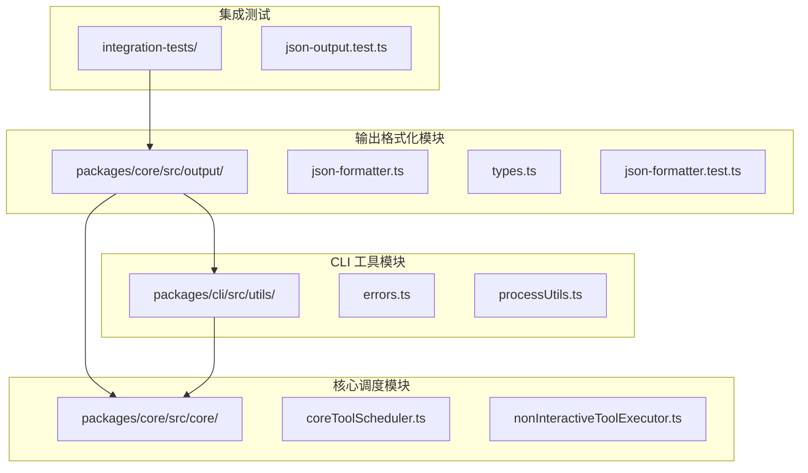
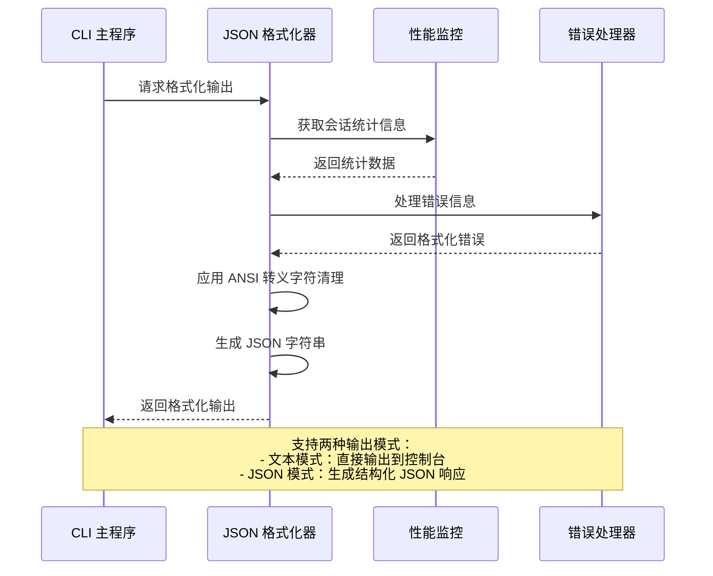
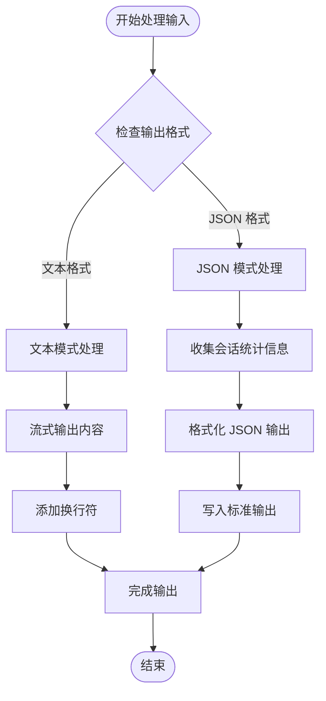
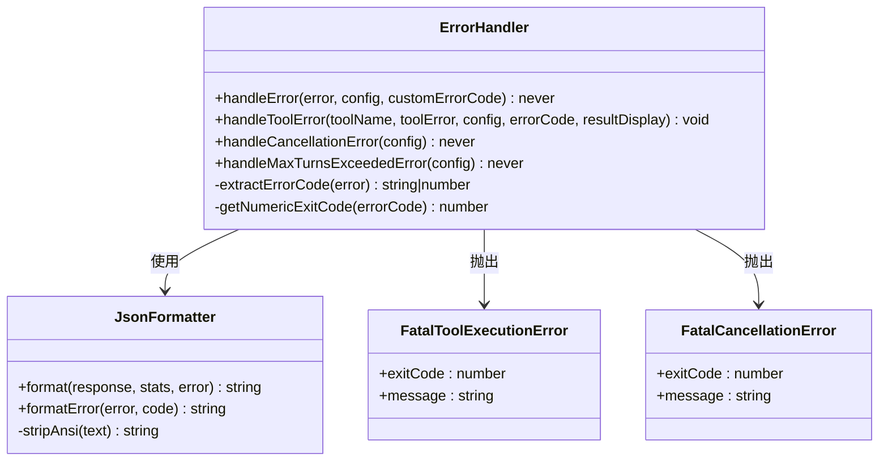
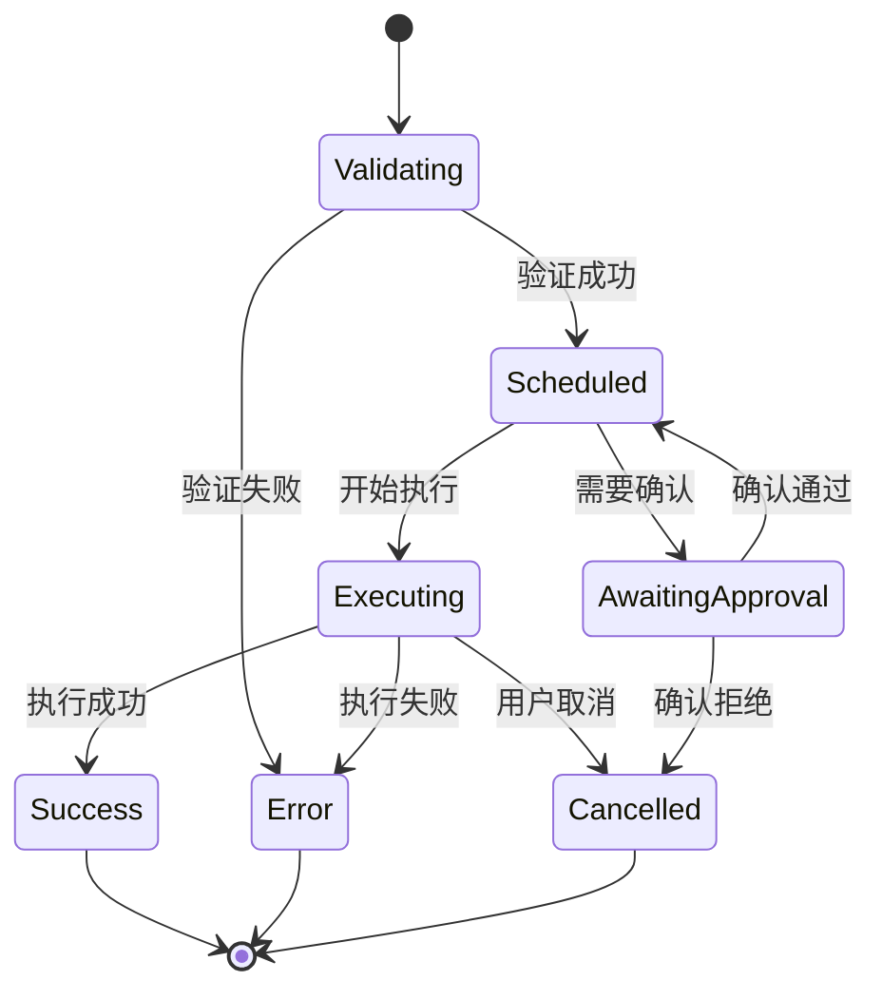
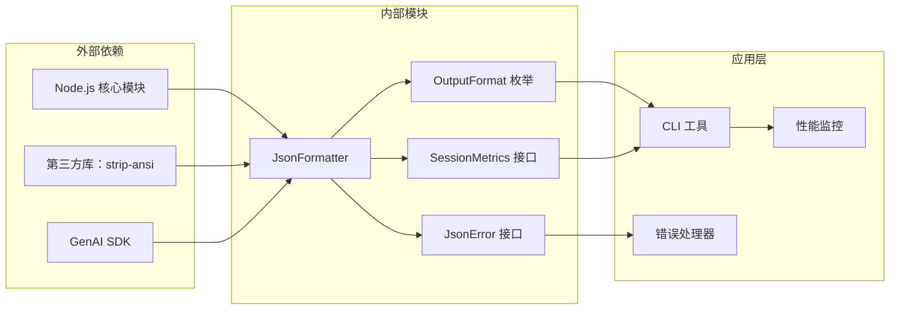

# 结构化输出格式化

<cite>
**本文档中引用的文件**
- [packages/core/src/output/json-formatter.ts](file://packages/core/src/output/json-formatter.ts)
- [packages/core/src/output/types.ts](file://packages/core/src/output/types.ts)
- [packages/core/src/output/json-formatter.test.ts](file://packages/core/src/output/json-formatter.test.ts)
- [packages/cli/src/nonInteractiveCli.ts](file://packages/cli/src/nonInteractiveCli.ts)
- [packages/cli/src/utils/errors.ts](file://packages/cli/src/utils/errors.ts)
- [packages/core/src/telemetry/uiTelemetry.ts](file://packages/core/src/telemetry/uiTelemetry.ts)
- [packages/core/src/core/coreToolScheduler.ts](file://packages/core/src/core/coreToolScheduler.ts)
- [packages/core/src/core/nonInteractiveToolExecutor.ts](file://packages/core/src/core/nonInteractiveToolExecutor.ts)
- [integration-tests/json-output.test.ts](file://integration-tests/json-output.test.ts)
</cite>

## 目录
1. [简介](#简介)
2. [项目结构概览](#项目结构概览)
3. [核心组件分析](#核心组件分析)
4. [架构概览](#架构概览)
5. [详细组件分析](#详细组件分析)
6. [依赖关系分析](#依赖关系分析)
7. [性能考虑](#性能考虑)
8. [故障排除指南](#故障排除指南)
9. [结论](#结论)

## 简介

结构化输出格式化系统是 Gemini CLI 的核心组件之一，负责将命令执行的元信息与输出流数据整合为统一的响应对象。该系统支持两种主要输出格式：人类可读的文本格式和机器友好的 JSON 格式，能够处理不同类型的退出状态（正常退出、信号终止等），并通过智能的错误处理机制确保信息完整性。

该系统的设计目标是在保持信息完整性的同时，为不同的使用场景提供最佳的用户体验。对于交互式模式，它提供详细的调试信息；对于非交互式模式或脚本调用，它提供简洁明了的摘要输出。

## 项目结构概览

结构化输出格式化系统的核心文件分布在以下目录结构中：



**图表来源**
- [packages/core/src/output/json-formatter.ts](file://packages/core/src/output/json-formatter.ts#L1-L40)
- [packages/cli/src/utils/errors.ts](file://packages/cli/src/utils/errors.ts#L1-L163)

**章节来源**
- [packages/core/src/output/json-formatter.ts](file://packages/core/src/output/json-formatter.ts#L1-L40)
- [packages/core/src/output/types.ts](file://packages/core/src/output/types.ts#L1-L25)

## 核心组件分析

### JSON 格式化器类

JSON 格式化器是整个输出系统的核心组件，负责将各种类型的数据转换为标准化的 JSON 格式：

```typescript
export class JsonFormatter {
  format(response?: string, stats?: SessionMetrics, error?: JsonError): string {
    const output: JsonOutput = {};

    if (response !== undefined) {
      output.response = stripAnsi(response);
    }

    if (stats) {
      output.stats = stats;
    }

    if (error) {
      output.error = error;
    }

    return JSON.stringify(output, null, 2);
  }

  formatError(error: Error, code?: string | number): string {
    const jsonError: JsonError = {
      type: error.constructor.name,
      message: stripAnsi(error.message),
      ...(code && { code }),
    };

    return this.format(undefined, undefined, jsonError);
  }
}
```

### 输出格式枚举

系统定义了明确的输出格式枚举，用于控制输出行为：

```typescript
export enum OutputFormat {
  TEXT = 'text',
  JSON = 'json',
}
```

### 数据类型定义

系统使用严格的 TypeScript 类型定义来确保输出的一致性和可靠性：

```typescript
export interface JsonError {
  type: string;
  message: string;
  code?: string | number;
}

export interface JsonOutput {
  response?: string;
  stats?: SessionMetrics;
  error?: JsonError;
}
```

**章节来源**
- [packages/core/src/output/json-formatter.ts](file://packages/core/src/output/json-formatter.ts#L10-L40)
- [packages/core/src/output/types.ts](file://packages/core/src/output/types.ts#L9-L25)

## 架构概览

结构化输出格式化系统采用分层架构设计，确保各组件之间的松耦合和高内聚：



**图表来源**
- [packages/cli/src/nonInteractiveCli.ts](file://packages/cli/src/nonInteractiveCli.ts#L150-L170)
- [packages/core/src/output/json-formatter.ts](file://packages/core/src/output/json-formatter.ts#L12-L25)

## 详细组件分析

### 非交互式 CLI 输出处理

非交互式 CLI 是结构化输出格式化的主要应用场景，它根据配置的输出格式动态调整输出行为：



**图表来源**
- [packages/cli/src/nonInteractiveCli.ts](file://packages/cli/src/nonInteractiveCli.ts#L150-L170)

### 错误处理机制

系统实现了多层次的错误处理机制，确保在不同输出格式下都能提供适当的错误信息：



**图表来源**
- [packages/cli/src/utils/errors.ts](file://packages/cli/src/utils/errors.ts#L45-L162)
- [packages/core/src/output/json-formatter.ts](file://packages/core/src/output/json-formatter.ts#L10-L40)

### 性能监控集成

系统集成了全面的性能监控功能，能够跟踪工具调用、API 请求和文件操作的详细指标：

```typescript
export interface SessionMetrics {
  models: Record<string, ModelMetrics>;
  tools: {
    totalCalls: number;
    totalSuccess: number;
    totalFail: number;
    totalDurationMs: number;
    totalDecisions: {
      [ToolCallDecision.ACCEPT]: number;
      [ToolCallDecision.REJECT]: number;
      [ToolCallDecision.MODIFY]: number;
      [ToolCallDecision.AUTO_ACCEPT]: number;
    };
    byName: Record<string, ToolCallStats>;
  };
  files: {
    totalLinesAdded: number;
    totalLinesRemoved: number;
  };
}
```

**章节来源**
- [packages/cli/src/nonInteractiveCli.ts](file://packages/cli/src/nonInteractiveCli.ts#L150-L170)
- [packages/cli/src/utils/errors.ts](file://packages/cli/src/utils/errors.ts#L45-L162)
- [packages/core/src/telemetry/uiTelemetry.ts](file://packages/core/src/telemetry/uiTelemetry.ts#L40-L60)

### 工具调度器输出管理

工具调度器负责管理复杂的工具执行流程，并提供详细的输出更新机制：



**图表来源**
- [packages/core/src/core/coreToolScheduler.ts](file://packages/core/src/core/coreToolScheduler.ts#L40-L120)

**章节来源**
- [packages/core/src/core/coreToolScheduler.ts](file://packages/core/src/core/coreToolScheduler.ts#L40-L120)

## 依赖关系分析

结构化输出格式化系统的依赖关系体现了清晰的分层架构：



**图表来源**
- [packages/core/src/output/json-formatter.ts](file://packages/core/src/output/json-formatter.ts#L1-L10)
- [packages/core/src/output/types.ts](file://packages/core/src/output/types.ts#L1-L10)

**章节来源**
- [packages/core/src/output/json-formatter.ts](file://packages/core/src/output/json-formatter.ts#L1-L40)
- [packages/core/src/output/types.ts](file://packages/core/src/output/types.ts#L1-L25)

## 性能考虑

### 内存优化策略

系统采用了多种内存优化策略来处理大型输出内容：

1. **ANSI 转义字符清理**：自动移除输出中的 ANSI 转义序列，减少内存占用
2. **内容截断机制**：当输出超过阈值时，自动截断并保存完整内容到临时文件
3. **流式处理**：支持流式输出，避免一次性加载大量数据到内存

### JSON 序列化优化

系统使用 `JSON.stringify(output, null, 2)` 进行格式化输出，确保：
- 可读性良好的缩进格式
- 一致的 JSON 结构
- 自动处理循环引用问题

## 故障排除指南

### 常见输出格式问题

1. **JSON 解析错误**
   - 症状：无法解析 JSON 输出
   - 解决方案：检查输出是否包含非 JSON 格式的文本，确保正确设置 `--output-format json`

2. **编码问题**
   - 症状：输出中出现乱码
   - 解决方案：系统自动应用 ANSI 转义字符清理，确保输出编码一致性

3. **权限错误**
   - 症状：无法写入临时文件
   - 解决方案：检查临时目录权限，确保有足够的磁盘空间

### 调试技巧

1. **启用调试模式**：设置 `--debug` 参数获取详细日志信息
2. **检查输出格式**：使用 `--help` 查看支持的输出格式选项
3. **验证配置**：确保配置文件中的输出格式设置正确

**章节来源**
- [packages/cli/src/utils/errors.ts](file://packages/cli/src/utils/errors.ts#L45-L162)
- [integration-tests/json-output.test.ts](file://integration-tests/json-output.test.ts#L1-L90)

## 结论

结构化输出格式化系统是一个设计精良、功能完备的组件，它成功地解决了命令执行结果的统一输出问题。通过支持多种输出格式、完善的错误处理机制和全面的性能监控，该系统为用户提供了灵活且可靠的输出解决方案。

系统的主要优势包括：
- **灵活性**：支持文本和 JSON 两种输出格式
- **可靠性**：完善的错误处理和恢复机制
- **可扩展性**：模块化设计便于功能扩展
- **性能优化**：内存管理和流式处理优化

未来的改进方向可能包括：
- 增加更多的输出格式选项
- 改进大文件处理的性能
- 增强调试信息的粒度控制