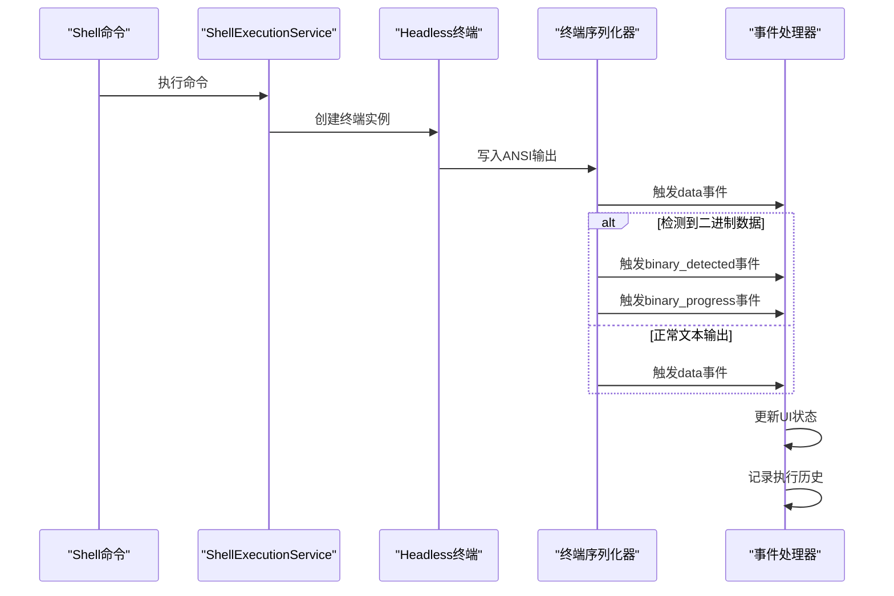
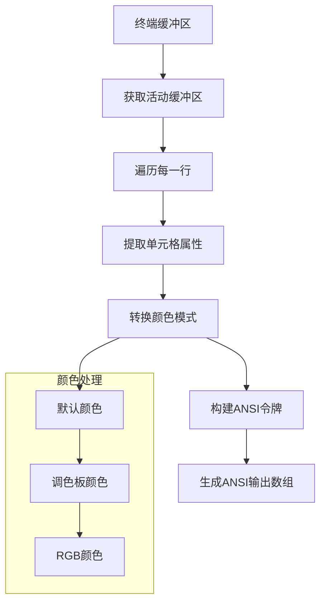
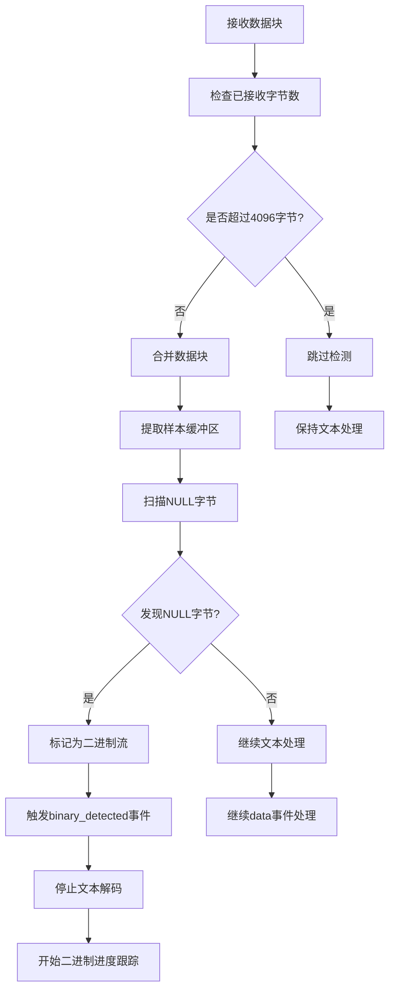
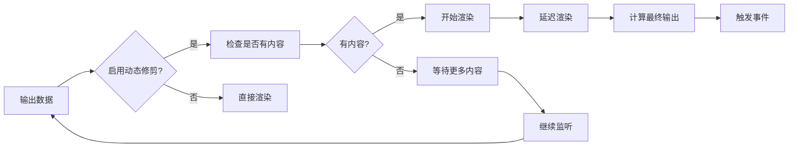
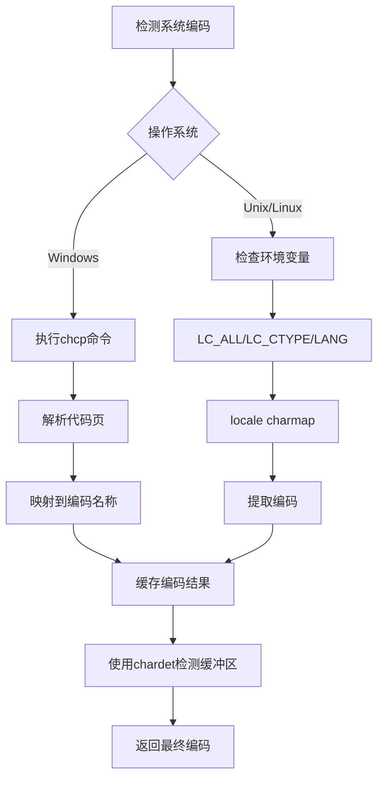
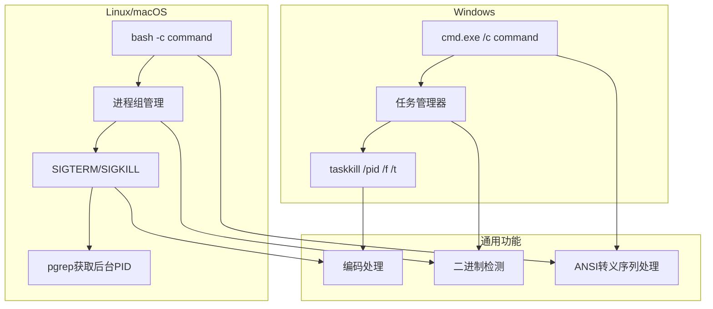
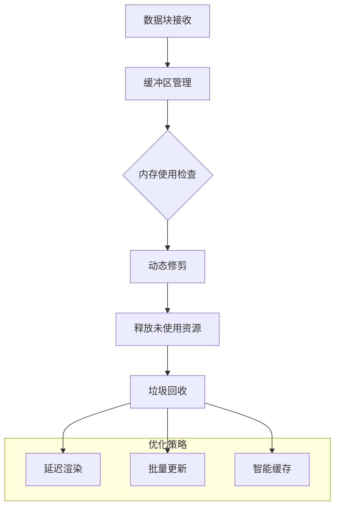
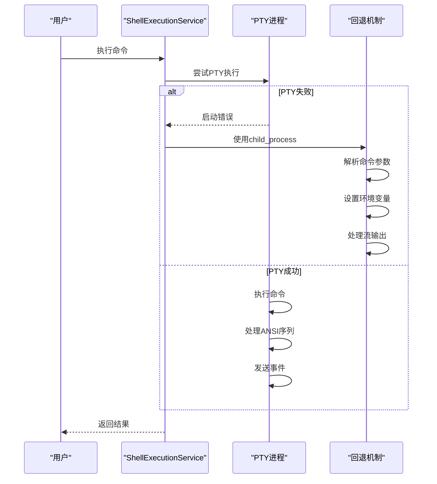

# Shell命令输出流处理

<cite>
**本文档引用的文件**
- [shellExecutionService.ts](file://packages/core/src/services/shellExecutionService.ts)
- [terminalSerializer.ts](file://packages/core/src/utils/terminalSerializer.ts)
- [textUtils.ts](file://packages/core/src/utils/textUtils.ts)
- [systemEncoding.ts](file://packages/core/src/utils/systemEncoding.ts)
- [shellCommandProcessor.ts](file://packages/cli/src/ui/hooks/shellCommandProcessor.ts)
- [shell.ts](file://packages/core/src/tools/shell.ts)
- [shellExecutionService.test.ts](file://packages/core/src/services/shellExecutionService.test.ts)
</cite>

## 目录
1. [概述](#概述)
2. [ShellOutputEvent事件系统](#shelloutputevent事件系统)
3. [ANSI输出捕获机制](#ansi输出捕获机制)
4. [二进制流检测策略](#二进制流检测策略)
5. [动态行修剪优化](#动态行修剪优化)
6. [编码处理与多语言支持](#编码处理与多语言支持)
7. [跨平台兼容性](#跨平台兼容性)
8. [性能优化特性](#性能优化特性)
9. [错误处理与恢复](#错误处理与恢复)
10. [实际应用示例](#实际应用示例)

## 概述

ShellExecutionService是Gemini CLI的核心组件，负责处理Shell命令的执行和输出流管理。该服务提供了强大的结构化事件流处理能力，通过`ShellOutputEvent`接口实现了对命令输出的实时监控和控制。

### 核心功能架构

```mermaid
graph TB
subgraph "ShellExecutionService"
A[命令执行入口] --> B{选择执行方式}
B --> C[node-pty执行器]
B --> D[child_process回退}
C --> E[Headless xterm.js终端]
E --> F[ANSI输出序列化]
F --> G[事件流处理]
D --> H[标准流处理]
H --> G
G --> I[ShellOutputEvent]
I --> J[数据事件]
I --> K[二进制检测事件]
I --> L[二进制进度事件]
end
subgraph "事件处理器"
M[UI更新]
N[工具集成]
O[历史记录]
end
I --> M
I --> N
I --> O
```

**图表来源**
- [shellExecutionService.ts](file://packages/core/src/services/shellExecutionService.ts#L1-L682)

## ShellOutputEvent事件系统

### 事件类型定义

ShellExecutionService定义了三种核心的输出事件类型，通过统一的接口提供结构化的事件流：

```typescript
export type ShellOutputEvent =
  | {
      type: 'data';
      chunk: string | AnsiOutput;
    }
  | {
      type: 'binary_detected';
    }
  | {
      type: 'binary_progress';
      bytesReceived: number;
    };
```

### 事件处理流程



**图表来源**
- [shellExecutionService.ts](file://packages/core/src/services/shellExecutionService.ts#L150-L200)
- [shellCommandProcessor.ts](file://packages/cli/src/ui/hooks/shellCommandProcessor.ts#L151-L184)

### 数据事件处理

当命令产生文本输出时，`data`事件会携带解码后的字符串或富文本格式的ANSI输出：

```typescript
case 'data':
  if (isBinaryStream) break;
  cumulativeStdout = event.chunk;
  shouldUpdate = true;
  break;
```

### 二进制检测事件

当检测到二进制输出时，系统会立即切换到二进制模式，并停止文本流处理：

```typescript
case 'binary_detected':
  isBinaryStream = true;
  cumulativeOutput = '[Binary output detected. Halting stream...]';
  shouldUpdate = true;
  break;
```

### 二进制进度事件

对于二进制输出，系统会持续跟踪接收的字节数量：

```typescript
case 'binary_progress':
  isBinaryStream = true;
  binaryBytesReceived = event.bytesReceived;
  cumulativeOutput = `[Receiving binary output... ${formatMemoryUsage(binaryBytesReceived)} received]`;
  if (Date.now() - lastUpdateTime > OUTPUT_UPDATE_INTERVAL_MS) {
    shouldUpdate = true;
  }
  break;
```

**章节来源**
- [shellExecutionService.ts](file://packages/core/src/services/shellExecutionService.ts#L150-L200)
- [shellCommandProcessor.ts](file://packages/cli/src/ui/hooks/shellCommandProcessor.ts#L151-L184)
- [shell.ts](file://packages/core/src/tools/shell.ts#L219-L261)

## ANSI输出捕获机制

### Headless xterm.js集成

ShellExecutionService使用@xterm/headless包创建无头终端实例，实现完整的ANSI转义序列处理：

```typescript
const headlessTerminal = new Terminal({
  allowProposedApi: true,
  cols,
  rows,
});
headlessTerminal.scrollToTop();
```

### 富文本输出序列化

通过`serializeTerminalToObject`函数将终端缓冲区转换为结构化的ANSI输出对象：



**图表来源**
- [terminalSerializer.ts](file://packages/core/src/utils/terminalSerializer.ts#L150-L250)

### ANSI令牌结构

每个ANSI令牌包含丰富的样式信息：

```typescript
export interface AnsiToken {
  text: string;
  bold: boolean;
  italic: boolean;
  underline: boolean;
  dim: boolean;
  inverse: boolean;
  fg: string;
  bg: string;
}
```

### 颜色模式转换

系统支持多种颜色模式的自动检测和转换：

```typescript
export const enum ColorMode {
  DEFAULT = 0,
  PALETTE = 1,
  RGB = 2,
}

export function convertColorToHex(
  color: number,
  colorMode: ColorMode,
  defaultColor: string,
): string {
  if (colorMode === ColorMode.RGB) {
    const r = (color >> 16) & 255;
    const g = (color >> 8) & 255;
    const b = color & 255;
    return `#${r.toString(16).padStart(2, '0')}${g.toString(16).padStart(2, '0')}${b.toString(16).padStart(2, '0')}`;
  }
  // 处理调色板和默认颜色...
}
```

**章节来源**
- [shellExecutionService.ts](file://packages/core/src/services/shellExecutionService.ts#L300-L400)
- [terminalSerializer.ts](file://packages/core/src/utils/terminalSerializer.ts#L1-L477)

## 二进制流检测策略

### 前4096字节嗅探机制

系统采用智能的二进制检测算法，在前4096字节内快速识别二进制输出：

```typescript
let isStreamingRawContent = true;
const MAX_SNIFF_SIZE = 4096;
let sniffedBytes = 0;

if (isStreamingRawContent && sniffedBytes < MAX_SNIFF_SIZE) {
  const sniffBuffer = Buffer.concat(outputChunks.slice(0, 20));
  sniffedBytes = sniffBuffer.length;

  if (isBinary(sniffBuffer)) {
    isStreamingRawContent = false;
  }
}
```

### NULL字节检测算法

核心的二进制检测逻辑基于NULL字节的存在性：

```typescript
export function isBinary(
  data: Buffer | null | undefined,
  sampleSize = 512,
): boolean {
  if (!data) {
    return false;
  }

  const sample = data.length > sampleSize ? data.subarray(0, sampleSize) : data;

  for (const byte of sample) {
    if (byte === 0) {
      return true;
    }
  }

  return false;
}
```

### 检测流程图



**图表来源**
- [shellExecutionService.ts](file://packages/core/src/services/shellExecutionService.ts#L180-L220)
- [textUtils.ts](file://packages/core/src/utils/textUtils.ts#L25-L45)

### 二进制输出处理

一旦检测到二进制输出，系统会立即切换到专门的处理模式：

```typescript
if (isBinary(sniffBuffer)) {
  isStreamingRawContent = false;
  onOutputEvent({ type: 'binary_detected' });
}

// 后续的数据块直接触发进度事件
const totalBytes = outputChunks.reduce(
  (sum, chunk) => sum + chunk.length,
  0,
);
onOutputEvent({
  type: 'binary_progress',
  bytesReceived: totalBytes,
});
```

**章节来源**
- [shellExecutionService.ts](file://packages/core/src/services/shellExecutionService.ts#L180-L250)
- [textUtils.ts](file://packages/core/src/utils/textUtils.ts#L25-L55)

## 动态行修剪优化

### 行修剪策略

为了提高性能和用户体验，系统实现了智能的动态行修剪机制：

```typescript
let hasStartedOutput = false;
let renderTimeout: NodeJS.Timeout | null = null;

const render = (finalRender = false) => {
  if (renderTimeout) {
    clearTimeout(renderTimeout);
  }

  const renderFn = () => {
    if (!isStreamingRawContent) {
      return;
    }

    if (!shellExecutionConfig.disableDynamicLineTrimming) {
      if (!hasStartedOutput) {
        const bufferText = getFullBufferText(headlessTerminal);
        if (bufferText.trim().length === 0) {
          return;
        }
        hasStartedOutput = true;
      }
    }

    // 执行渲染逻辑...
  };

  if (finalRender) {
    renderFn();
  } else {
    renderTimeout = setTimeout(renderFn, 17);
  }
};
```

### 渲染优化机制



**图表来源**
- [shellExecutionService.ts](file://packages/core/src/services/shellExecutionService.ts#L320-L380)

### 输出修剪算法

系统只保留非空行，移除尾部的空白行：

```typescript
let lastNonEmptyLine = -1;
for (let i = newOutput.length - 1; i >= 0; i--) {
  const line = newOutput[i];
  if (
    line
      .map((segment) => segment.text)
      .join('')
      .trim().length > 0
  ) {
    lastNonEmptyLine = i;
    break;
  }
}

const trimmedOutput = newOutput.slice(0, lastNonEmptyLine + 1);
```

**章节来源**
- [shellExecutionService.ts](file://packages/core/src/services/shellExecutionService.ts#L320-L420)

## 编码处理与多语言支持

### 系统编码检测

系统实现了多层次的编码检测机制：

```typescript
export function getCachedEncodingForBuffer(buffer: Buffer): string {
  if (cachedSystemEncoding === undefined) {
    cachedSystemEncoding = getSystemEncoding();
  }

  if (cachedSystemEncoding) {
    return cachedSystemEncoding;
  }

  return detectEncodingFromBuffer(buffer) || 'utf-8';
}
```

### 平台特定编码处理



**图表来源**
- [systemEncoding.ts](file://packages/core/src/utils/systemEncoding.ts#L30-L100)

### 缓冲区编码检测

对于无法从系统检测到的编码，系统使用chardet库进行缓冲区分析：

```typescript
export function detectEncodingFromBuffer(buffer: Buffer): string | null {
  try {
    const detected = chardetDetect(buffer);
    if (detected && typeof detected === 'string') {
      return detected.toLowerCase();
    }
  } catch (error) {
    console.warn('Failed to detect encoding with chardet:', error);
  }

  return null;
}
```

### 文本解码流程

```typescript
let stdoutDecoder: TextDecoder | null = null;
let stderrDecoder: TextDecoder | null = null;

const handleOutput = (data: Buffer, stream: 'stdout' | 'stderr') => {
  if (!stdoutDecoder || !stderrDecoder) {
    const encoding = getCachedEncodingForBuffer(data);
    try {
      stdoutDecoder = new TextDecoder(encoding);
      stderrDecoder = new TextDecoder(encoding);
    } catch {
      stdoutDecoder = new TextDecoder('utf-8');
      stderrDecoder = new TextDecoder('utf-8');
    }
  }

  const decoder = stream === 'stdout' ? stdoutDecoder : stderrDecoder;
  const decodedChunk = decoder.decode(data, { stream: true });
  
  // 处理解码后的输出...
};
```

**章节来源**
- [systemEncoding.ts](file://packages/core/src/utils/systemEncoding.ts#L1-L167)
- [shellExecutionService.ts](file://packages/core/src/services/shellExecutionService.ts#L160-L200)

## 跨平台兼容性

### 平台检测与适配

系统根据操作系统的不同采用相应的执行策略：

```typescript
const isWindows = os.platform() === 'win32';
const shell = isWindows ? 'cmd.exe' : 'bash';
const args = isWindows
  ? `/c ${commandToExecute}`
  : ['-c', commandToExecute];

const ptyProcess = ptyInfo.module.spawn(shell, args, {
  cwd,
  name: 'xterm',
  cols,
  rows,
  env: {
    ...process.env,
    GEMINI_CLI: '1',
    TERM: 'xterm-256color',
    PAGER: shellExecutionConfig.pager ?? 'cat',
  },
  handleFlowControl: true,
});
```

### 进程终止策略

不同平台采用不同的进程终止方法：

```typescript
const abortHandler = async () => {
  if (ptyProcess.pid && !exited) {
    if (os.platform() === 'win32') {
      ptyProcess.kill();
    } else {
      try {
        // 杀死整个进程组
        process.kill(-ptyProcess.pid, 'SIGINT');
      } catch (_e) {
        // 回退到仅杀死进程
        ptyProcess.kill('SIGINT');
      }
    }
  }
};
```

### 平台特定行为



**图表来源**
- [shellExecutionService.ts](file://packages/core/src/services/shellExecutionService.ts#L450-L550)

**章节来源**
- [shellExecutionService.ts](file://packages/core/src/services/shellExecutionService.ts#L450-L600)

## 性能优化特性

### 流式处理与批量更新

系统实现了高效的流式处理机制，避免频繁的UI更新：

```typescript
const OUTPUT_UPDATE_INTERVAL_MS = 1000;

if (shouldUpdate || Date.now() - lastUpdateTime > OUTPUT_UPDATE_INTERVAL_MS) {
  setPendingHistoryItem((prevItem) => {
    // 更新历史记录...
  });
  lastUpdateTime = Date.now();
}
```

### 渲染延迟优化

使用setTimeout实现渲染延迟，减少不必要的重绘：

```typescript
const render = (finalRender = false) => {
  if (renderTimeout) {
    clearTimeout(renderTimeout);
  }

  const renderFn = () => {
    // 执行渲染逻辑...
  };

  if (finalRender) {
    renderFn();
  } else {
    renderTimeout = setTimeout(renderFn, 17); // ~60fps
  }
};
```

### 内存管理优化



### 性能监控指标

系统跟踪以下关键性能指标：
- 输出更新频率（每秒事件数）
- 内存使用峰值
- 渲染延迟时间
- 二进制检测响应时间

**章节来源**
- [shellCommandProcessor.ts](file://packages/cli/src/ui/hooks/shellCommandProcessor.ts#L20-L30)
- [shellExecutionService.ts](file://packages/core/src/services/shellExecutionService.ts#L320-L380)

## 错误处理与恢复

### 多层错误处理机制



**图表来源**
- [shellExecutionService.ts](file://packages/core/src/services/shellExecutionService.ts#L80-L120)

### 异常情况处理

```typescript
private static childProcessFallback(
  commandToExecute: string,
  cwd: string,
  onOutputEvent: (event: ShellOutputEvent) => void,
  abortSignal: AbortSignal,
): ShellExecutionHandle {
  try {
    // 执行逻辑...
  } catch (e) {
    const error = e as Error;
    return {
      pid: undefined,
      result: Promise.resolve({
        error,
        rawOutput: Buffer.from(''),
        output: '',
        exitCode: 1,
        signal: null,
        aborted: false,
        pid: undefined,
        executionMethod: 'none',
      }),
    };
  }
}
```

### 进程终止保护

系统实现了多层次的进程终止保护机制：

```typescript
const abortHandler = async () => {
  if (child.pid && !exited) {
    if (isWindows) {
      cpSpawn('taskkill', ['/pid', child.pid.toString(), '/f', '/t']);
    } else {
      try {
        process.kill(-child.pid, 'SIGTERM');
        await new Promise((res) => setTimeout(res, SIGKILL_TIMEOUT_MS));
        if (!exited) {
          process.kill(-child.pid, 'SIGKILL');
        }
      } catch (_e) {
        if (!exited) child.kill('SIGKILL');
      }
    }
  }
};
```

**章节来源**
- [shellExecutionService.ts](file://packages/core/src/services/shellExecutionService.ts#L80-L150)
- [shellExecutionService.ts](file://packages/core/src/services/shellExecutionService.ts#L250-L300)

## 实际应用示例

### 基础Shell命令执行

```typescript
const { pid, result } = await ShellExecutionService.execute(
  'ls -la',
  '/home/user/project',
  (event) => {
    switch (event.type) {
      case 'data':
        console.log('输出:', event.chunk);
        break;
      case 'binary_detected':
        console.log('检测到二进制输出');
        break;
      case 'binary_progress':
        console.log(`接收进度: ${event.bytesReceived} 字节`);
        break;
    }
  },
  abortSignal,
  true,
  {}
);
```

### 工具集成示例

```typescript
async execute(
  signal: AbortSignal,
  updateOutput?: (output: string | AnsiOutput) => void,
  shellExecutionConfig?: ShellExecutionConfig,
): Promise<ToolResult> {
  const { result: resultPromise, pid } =
    await ShellExecutionService.execute(
      commandToExecute,
      cwd,
      (event: ShellOutputEvent) => {
        if (!updateOutput) {
          return;
        }

        switch (event.type) {
          case 'data':
            if (isBinaryStream) break;
            cumulativeOutput = event.chunk;
            shouldUpdate = true;
            break;
          case 'binary_detected':
            isBinaryStream = true;
            cumulativeOutput = '[Binary output detected. Halting stream...]';
            shouldUpdate = true;
            break;
          case 'binary_progress':
            isBinaryStream = true;
            cumulativeOutput = `[Receiving binary output... ${formatMemoryUsage(event.bytesReceived)} received]`;
            if (Date.now() - lastUpdateTime > OUTPUT_UPDATE_INTERVAL_MS) {
              shouldUpdate = true;
            }
            break;
        }

        if (shouldUpdate) {
          updateOutput(cumulativeOutput);
          lastUpdateTime = Date.now();
        }
      },
      signal,
      this.config.getShouldUseNodePtyShell(),
      shellExecutionConfig ?? {},
    );
}
```

### UI集成示例

```typescript
const { handleShellCommand, activeShellPtyId } = useShellCommandProcessor(
  addItemToHistory,
  setPendingHistoryItem,
  onExec,
  onDebugMessage,
  config,
  geminiClient,
  setShellInputFocused,
  terminalWidth,
  terminalHeight,
);

// 在React组件中使用
const handleCommand = (command: string) => {
  const abortController = new AbortController();
  const success = handleShellCommand(command, abortController.signal);
  
  if (success) {
    // 命令执行成功
  } else {
    // 命令无效
  }
};
```

**章节来源**
- [shell.ts](file://packages/core/src/tools/shell.ts#L180-L280)
- [shellCommandProcessor.ts](file://packages/cli/src/ui/hooks/shellCommandProcessor.ts#L60-L120)

## 结论

ShellExecutionService通过其精心设计的事件驱动架构，提供了强大而灵活的Shell命令输出流处理能力。其主要优势包括：

1. **结构化事件流**：通过ShellOutputEvent接口实现统一的输出监控
2. **智能二进制检测**：基于前4096字节的NULL字节检测算法
3. **ANSI输出支持**：完整的xterm.js终端模拟和ANSI序列处理
4. **跨平台兼容**：针对不同操作系统的优化处理策略
5. **性能优化**：动态行修剪、流式处理和智能缓存机制
6. **错误恢复**：多层次的异常处理和回退机制

这种设计使得ShellExecutionService能够高效地处理各种类型的Shell命令输出，同时为上层应用提供了丰富而直观的事件接口，支持实时的UI更新、工具集成和历史记录管理。