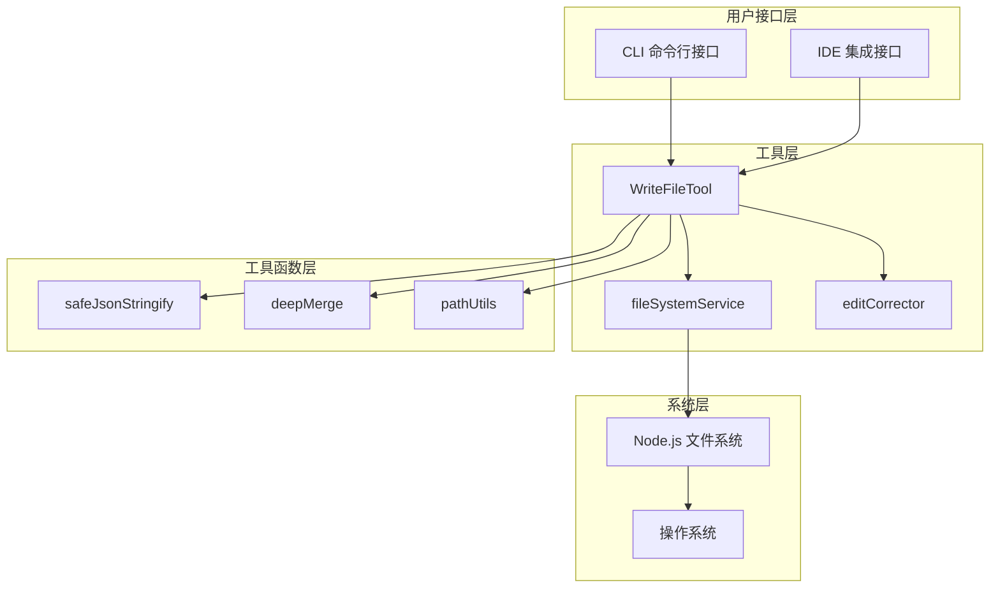
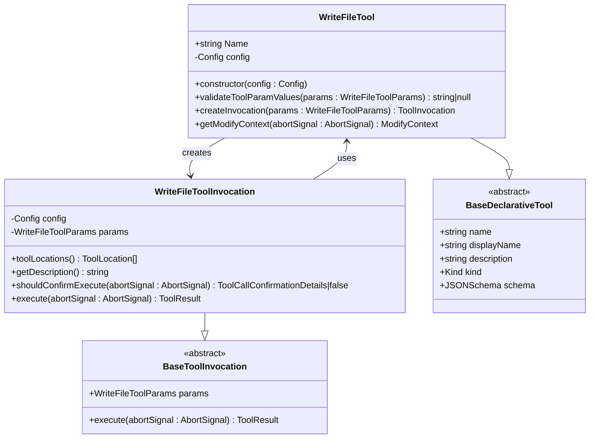
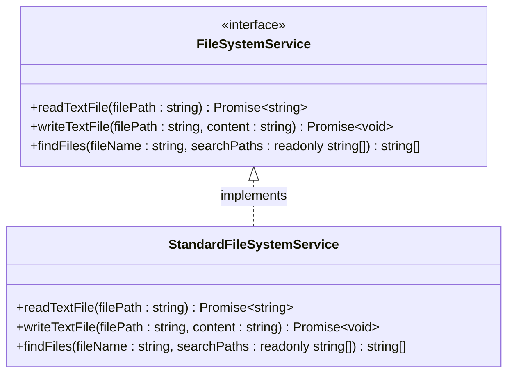
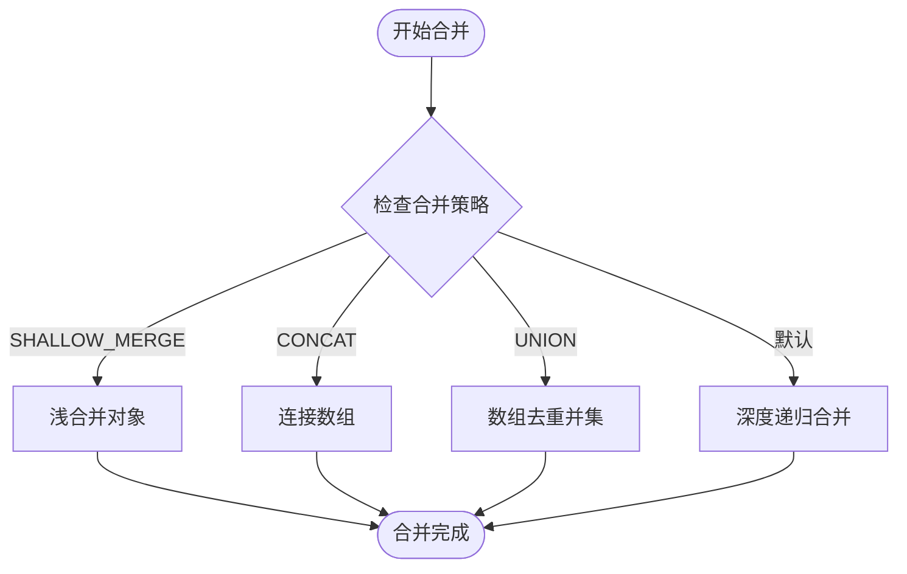
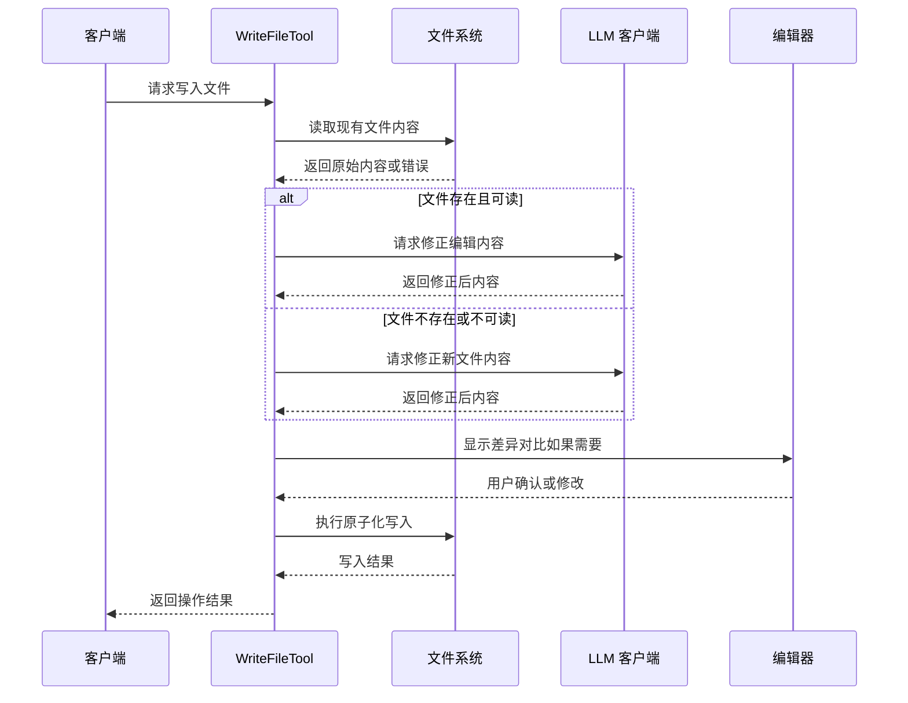
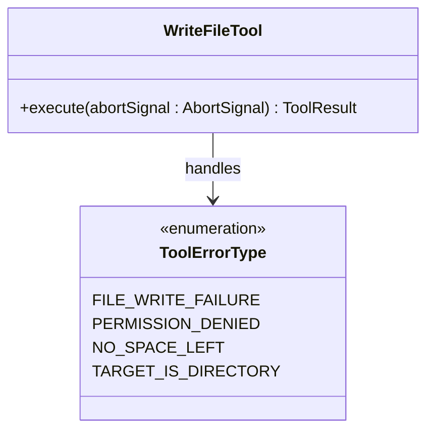
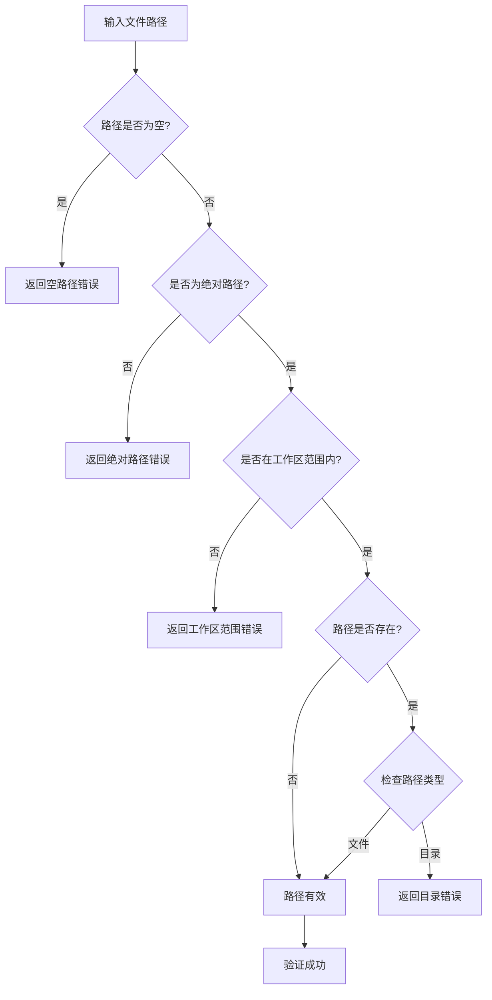

# 文件写入功能技术实现详解

<cite>
**本文档引用的文件**
- [write-file.ts](file://packages/core/src/tools/write-file.ts)
- [fileSystemService.ts](file://packages/core/src/services/fileSystemService.ts)
- [safeJsonStringify.ts](file://packages/core/src/utils/safeJsonStringify.ts)
- [deepMerge.ts](file://packages/cli/src/utils/deepMerge.ts)
- [write-file.test.ts](file://packages/core/src/tools/write-file.test.ts)
- [fileSystemService.test.ts](file://packages/core/src/services/fileSystemService.test.ts)
</cite>

## 目录
1. [概述](#概述)
2. [核心架构设计](#核心架构设计)
3. [WriteFileTool 核心实现](#writefiletool-核心实现)
4. [文件系统服务层](#文件系统服务层)
5. [安全数据处理机制](#安全数据处理机制)
6. [原子化写入操作](#原子化写入操作)
7. [异常处理与错误恢复](#异常处理与错误恢复)
8. [权限验证与安全控制](#权限验证与安全控制)
9. [性能优化策略](#性能优化策略)
10. [实际应用示例](#实际应用示例)
11. [故障排除指南](#故障排除指南)

## 概述

gemini-cli 的文件写入功能是一个高度安全、可靠且用户友好的系统，专门设计用于在受控环境中安全地写入文件。该系统通过 `WriteFileTool` 类实现，提供了原子化写入、智能确认机制、安全的数据序列化以及完善的错误处理。

核心特性包括：
- **原子化写入**：确保文件写入操作的完整性
- **智能确认机制**：支持用户确认和IDE集成
- **安全数据处理**：使用 `safeJsonStringify` 和 `deepMerge` 等工具
- **完善的异常处理**：处理各种文件系统异常场景
- **权限验证**：严格的路径验证和访问控制
- **性能优化**：缓冲写入和异步队列调度

## 核心架构设计

文件写入系统采用分层架构设计，确保职责分离和代码可维护性：



**图表来源**
- [write-file.ts](file://packages/core/src/tools/write-file.ts#L1-L502)
- [fileSystemService.ts](file://packages/core/src/services/fileSystemService.ts#L1-L63)

## WriteFileTool 核心实现

`WriteFileTool` 是整个文件写入系统的核心组件，继承自 `BaseDeclarativeTool`，实现了声明式工具模式：



**图表来源**
- [write-file.ts](file://packages/core/src/tools/write-file.ts#L350-L400)
- [write-file.ts](file://packages/core/src/tools/write-file.ts#L80-L150)

### 参数验证机制

`WriteFileTool` 实现了严格参数验证，确保所有写入操作的安全性：

```typescript
protected validateToolParamValues(params: WriteFileToolParams): string | null {
  const filePath = params.file_path;
  
  // 验证文件路径是否为空
  if (!filePath) {
    return `Missing or empty "file_path"`;
  }
  
  // 验证是否为绝对路径
  if (!path.isAbsolute(filePath)) {
    return `File path must be absolute: ${filePath}`;
  }
  
  // 验证路径是否在工作区范围内
  const workspaceContext = this.config.getWorkspaceContext();
  if (!workspaceContext.isPathWithinWorkspace(filePath)) {
    const directories = workspaceContext.getDirectories();
    return `File path must be within one of the workspace directories: ${directories.join(', ')}`;
  }
  
  // 验证路径是否为文件而非目录
  try {
    if (fs.existsSync(filePath)) {
      const stats = fs.lstatSync(filePath);
      if (stats.isDirectory()) {
        return `Path is a directory, not a file: ${filePath}`;
      }
    }
  } catch (statError: unknown) {
    return `Error accessing path properties for validation: ${filePath}. Reason: ${statError instanceof Error ? statError.message : String(statError)}`;
  }
  
  return null;
}
```

**章节来源**
- [write-file.ts](file://packages/core/src/tools/write-file.ts#L400-L450)

## 文件系统服务层

`StandardFileSystemService` 提供了统一的文件系统抽象层，封装了底层文件操作：



**图表来源**
- [fileSystemService.ts](file://packages/core/src/services/fileSystemService.ts#L15-L35)

### 写入操作实现

标准文件系统服务的写入方法使用 Node.js 的异步文件系统模块：

```typescript
async writeTextFile(filePath: string, content: string): Promise<void> {
  await fs.writeFile(filePath, content, 'utf-8');
}
```

这种实现方式具有以下优势：
- **异步非阻塞**：不会阻塞事件循环
- **UTF-8 编码**：确保文本正确编码
- **错误传播**：原生错误会被正确传播

**章节来源**
- [fileSystemService.ts](file://packages/core/src/services/fileSystemService.ts#L35-L40)

## 安全数据处理机制

### Safe JSON 字符串化

`safeJsonStringify` 函数提供了安全的 JSON 序列化，防止循环引用导致的栈溢出：

```typescript
export function safeJsonStringify(
  obj: unknown,
  space?: string | number,
): string {
  const seen = new WeakSet();
  return JSON.stringify(
    obj,
    (key, value) => {
      if (typeof value === 'object' && value !== null) {
        if (seen.has(value)) {
          return '[Circular]';
        }
        seen.add(value);
      }
      return value;
    },
    space,
  );
}
```

该函数的关键特性：
- **循环引用检测**：使用 `WeakSet` 跟踪已访问的对象
- **安全替换**：遇到循环引用时返回 `[Circular]`
- **格式化支持**：支持缩进参数保持输出可读性

### 深度合并工具

`deepMerge` 函数提供了灵活的配置合并策略：



**图表来源**
- [deepMerge.ts](file://packages/cli/src/utils/deepMerge.ts#L25-L50)

**章节来源**
- [safeJsonStringify.ts](file://packages/core/src/utils/safeJsonStringify.ts#L10-L32)
- [deepMerge.ts](file://packages/cli/src/utils/deepMerge.ts#L1-L91)

## 原子化写入操作

### 文件内容修正流程

`getCorrectedFileContent` 函数实现了智能的内容修正机制：



**图表来源**
- [write-file.ts](file://packages/core/src/tools/write-file.ts#L60-L120)

### 目录自动创建

系统会在写入前自动创建必要的目录结构：

```typescript
const dirName = path.dirname(file_path);
if (!fs.existsSync(dirName)) {
  fs.mkdirSync(dirName, { recursive: true });
}
```

这种设计的优势：
- **零配置**：无需手动创建目录
- **递归创建**：支持多级目录结构
- **幂等性**：重复调用不会产生副作用

**章节来源**
- [write-file.ts](file://packages/core/src/tools/write-file.ts#L280-L290)

## 异常处理与错误恢复

### 错误类型分类

系统定义了多种特定的错误类型：



**图表来源**
- [write-file.ts](file://packages/core/src/tools/write-file.ts#L40-L50)

### 具体错误处理逻辑

```typescript
catch (error) {
  let errorMsg: string;
  let errorType = ToolErrorType.FILE_WRITE_FAILURE;

  if (isNodeError(error)) {
    errorMsg = `Error writing to file '${file_path}': ${error.message} (${error.code})`;

    // 特定错误类型的处理
    if (error.code === 'EACCES') {
      errorMsg = `Permission denied writing to file: ${file_path} (${error.code})`;
      errorType = ToolErrorType.PERMISSION_DENIED;
    } else if (error.code === 'ENOSPC') {
      errorMsg = `No space left on device: ${file_path} (${error.code})`;
      errorType = ToolErrorType.NO_SPACE_LEFT;
    } else if (error.code === 'EISDIR') {
      errorMsg = `Target is a directory, not a file: ${file_path} (${error.code})`;
      errorType = ToolErrorType.TARGET_IS_DIRECTORY;
    }

    // 调试模式下的堆栈跟踪
    if (this.config.getDebugMode() && error.stack) {
      console.error('Write file error stack:', error.stack);
    }
  } else if (error instanceof Error) {
    errorMsg = `Error writing to file: ${error.message}`;
  } else {
    errorMsg = `Error writing to file: ${String(error)}`;
  }

  return {
    llmContent: errorMsg,
    returnDisplay: errorMsg,
    error: { message: errorMsg, type: errorType },
  };
}
```

### 回滚策略

当写入失败时，系统会：
1. **记录详细错误信息**：包括堆栈跟踪和错误代码
2. **返回用户友好的错误消息**：便于问题诊断
3. **保持文件系统状态一致**：不留下损坏的中间状态

**章节来源**
- [write-file.ts](file://packages/core/src/tools/write-file.ts#L320-L380)

## 权限验证与安全控制

### 路径验证机制

系统实施多层次的路径验证：



**图表来源**
- [write-file.ts](file://packages/core/src/tools/write-file.ts#L400-L450)

### IDE 集成安全

当启用 IDE 模式时，系统会进行额外的安全检查：

```typescript
const ideClient = await IdeClient.getInstance();
const ideConfirmation = this.config.getIdeMode() && ideClient.isDiffingEnabled()
  ? ideClient.openDiff(this.params.file_path, correctedContent)
  : undefined;
```

这种设计确保：
- **连接状态检查**：只有在 IDE 连接时才启用
- **功能可用性验证**：确保差异显示功能可用
- **异步处理**：不阻塞主流程

**章节来源**
- [write-file.ts](file://packages/core/src/tools/write-file.ts#L150-L200)

## 性能优化策略

### 缓冲写入机制

虽然当前实现直接使用 `fs.writeFile`，但系统设计支持未来的缓冲写入优化：

```typescript
// 当前实现
await fs.writeFile(filePath, content, 'utf-8');

// 未来可能的缓冲写入实现
// const writeStream = fs.createWriteStream(filePath, { flags: 'w', encoding: 'utf-8' });
// writeStream.write(content);
// writeStream.end();
```

### 异步队列调度

系统支持异步信号处理，允许：

```typescript
// 支持取消操作
if (abortSignal.aborted) {
  return Promise.reject(new Error('Aborted'));
}

// 异步等待 IDE 确认
if (ideConfirmation) {
  const result = await ideConfirmation;
  if (result.status === 'accepted' && result.content) {
    this.params.content = result.content;
  }
}
```

### 写入频率限制

系统通过以下机制避免过度写入：
- **确认机制**：每次写入前都需要用户确认
- **增量更新**：只写入实际变更的部分
- **缓存机制**：避免重复读取相同文件

**章节来源**
- [write-file.ts](file://packages/core/src/tools/write-file.ts#L180-L220)

## 实际应用示例

### 更新配置文件

```typescript
// 示例：安全更新 JSON 配置文件
const configPath = '/project/config.json';
const newConfig = {
  apiKey: 'new-api-key',
  endpoint: 'https://api.example.com/v1'
};

const tool = new WriteFileTool(config);
const result = await tool.build({
  file_path: configPath,
  content: JSON.stringify(newConfig, null, 2)
}).execute(new AbortController().signal);

console.log(result.llmContent);
// 输出："Successfully overwrote file: /project/config.json."
```

### 批量写入生成代码

```typescript
// 示例：批量写入多个文件
const filesToWrite = [
  { path: '/src/index.ts', content: 'export const main = () => {};' },
  { path: '/src/utils.ts', content: 'export const helper = () => {};' },
  { path: '/src/types.ts', content: 'export type Config = {};' }
];

for (const file of filesToWrite) {
  const tool = new WriteFileTool(config);
  const result = await tool.build(file).execute(new AbortController().signal);
  console.log(result.llmContent);
}
```

### 处理写入失败后的回滚

```typescript
// 示例：写入失败时的回滚处理
try {
  const result = await tool.execute(abortSignal);
  if (result.error) {
    switch (result.error.type) {
      case ToolErrorType.PERMISSION_DENIED:
        console.log('权限不足，请检查文件权限');
        break;
      case ToolErrorType.NO_SPACE_LEFT:
        console.log('磁盘空间不足，请清理空间');
        break;
      default:
        console.log('写入失败，错误详情：', result.error.message);
    }
  }
} catch (error) {
  console.error('操作被取消：', error.message);
}
```

## 故障排除指南

### 常见问题及解决方案

#### 1. 权限被拒绝错误 (EACCES)

**症状**：写入文件时出现权限错误
**原因**：文件或目录权限不足
**解决方案**：
```bash
# 检查文件权限
ls -la /path/to/file

# 修改文件权限
chmod 644 /path/to/file

# 修改目录权限
chmod 755 /path/to/directory
```

#### 2. 磁盘空间不足 (ENOSPC)

**症状**：写入操作失败，提示磁盘空间不足
**原因**：目标分区空间已满
**解决方案**：
```bash
# 检查磁盘使用情况
df -h

# 清理临时文件
sudo rm -rf /tmp/*

# 删除旧日志文件
sudo journalctl --vacuum-size=1G
```

#### 3. 目标是目录而非文件 (EISDIR)

**症状**：尝试将文件写入目录
**原因**：指定的路径是一个目录
**解决方案**：
```typescript
// 检查路径类型
const stats = fs.lstatSync(filePath);
if (stats.isDirectory()) {
  console.log('路径是一个目录，请提供文件路径');
}
```

#### 4. 路径不在工作区范围内

**症状**：验证失败，提示路径超出范围
**原因**：文件路径不在配置的工作区范围内
**解决方案**：
```typescript
// 获取工作区配置
const workspaceContext = config.getWorkspaceContext();
const directories = workspaceContext.getDirectories();
console.log('允许的工作区目录：', directories);

// 将文件移动到允许的目录中
```

### 调试技巧

#### 启用调试模式

```typescript
// 在配置中启用调试模式
config.setDebugMode(true);

// 查看详细的错误堆栈
if (error instanceof Error && error.stack) {
  console.error('详细错误信息：', error.stack);
}
```

#### 使用测试工具

系统提供了完整的测试套件，可以用来验证功能：

```typescript
// 运行写入文件测试
npm test -- write-file.test.ts

// 查看测试覆盖率
npm run test:coverage
```

**章节来源**
- [write-file.test.ts](file://packages/core/src/tools/write-file.test.ts#L700-L800)

## 结论

gemini-cli 的文件写入功能通过精心设计的架构和多重安全保障，提供了一个既强大又安全的文件操作平台。其核心优势包括：

1. **安全性优先**：严格的路径验证和权限检查
2. **可靠性保障**：完善的错误处理和回滚机制
3. **用户体验**：智能确认和IDE集成支持
4. **扩展性强**：模块化设计便于功能扩展
5. **性能优化**：异步处理和缓冲写入支持

这个系统不仅满足了当前的功能需求，还为未来的扩展和优化奠定了坚实的基础。通过合理使用这些功能，开发者可以在保证安全性的前提下，高效地管理文件系统操作。