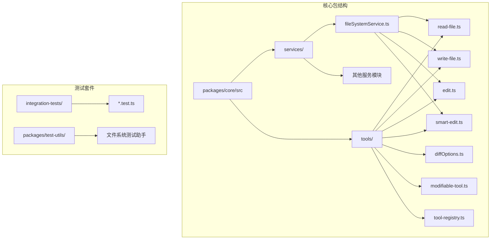
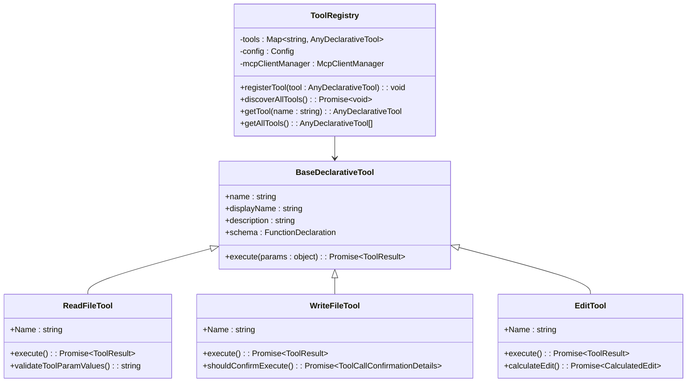
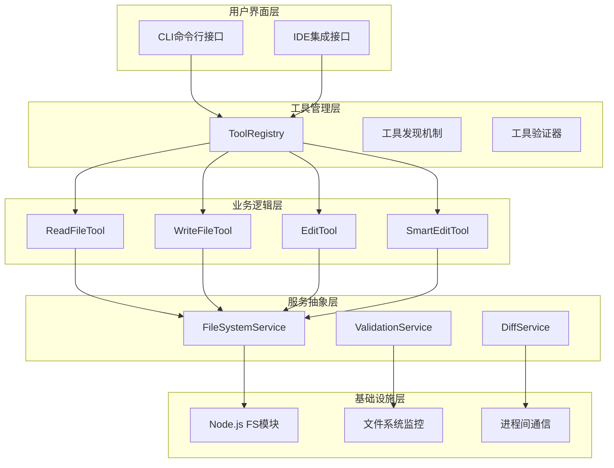
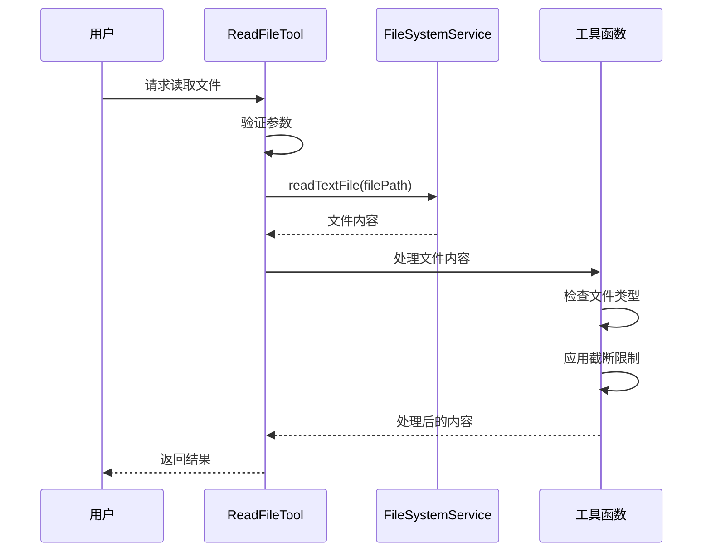
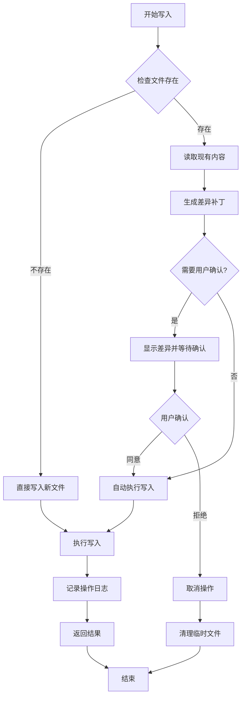
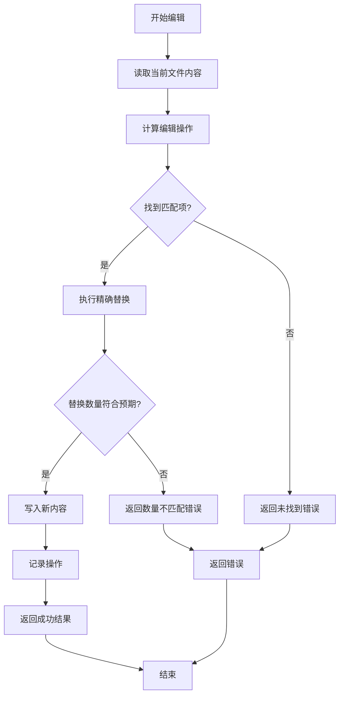
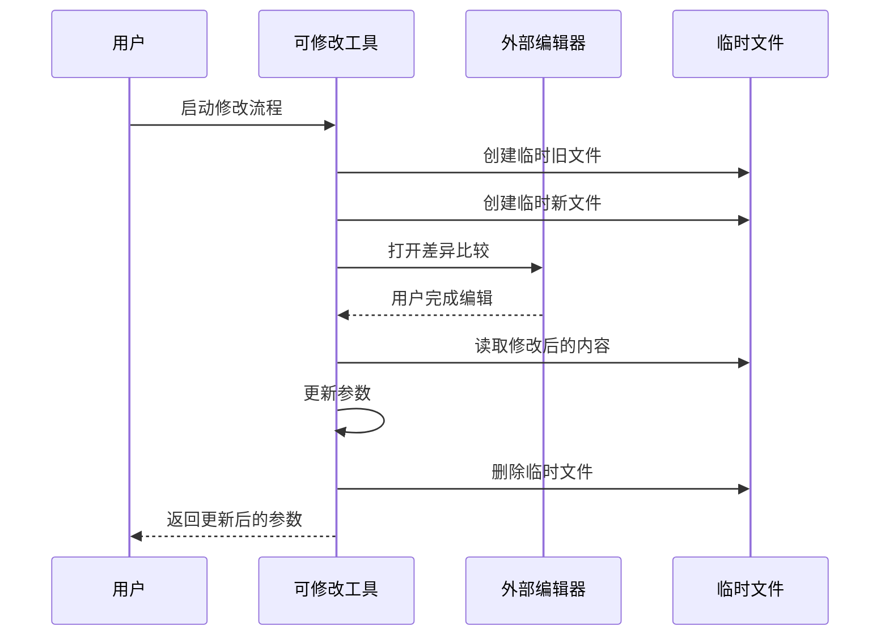
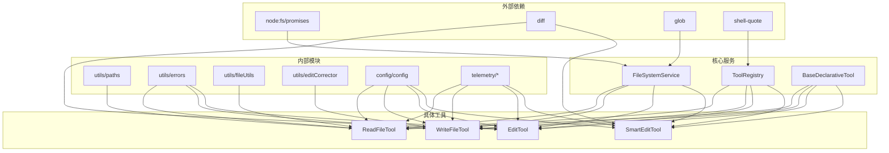

# 文件操作功能详细文档

<cite>
**本文档中引用的文件**
- [fileSystemService.ts](file://packages/core/src/services/fileSystemService.ts)
- [read-file.ts](file://packages/core/src/tools/read-file.ts)
- [write-file.ts](file://packages/core/src/tools/write-file.ts)
- [edit.ts](file://packages/core/src/tools/edit.ts)
- [smart-edit.ts](file://packages/core/src/tools/smart-edit.ts)
- [diffOptions.ts](file://packages/core/src/tools/diffOptions.ts)
- [modifiable-tool.ts](file://packages/core/src/tools/modifiable-tool.ts)
- [tool-registry.ts](file://packages/core/src/tools/tool-registry.ts)
- [fileSystemService.test.ts](file://packages/core/src/services/fileSystemService.test.ts)
- [read-file.test.ts](file://packages/core/src/tools/read-file.test.ts)
- [write-file.test.ts](file://packages/core/src/tools/write-file.test.ts)
- [edit.test.ts](file://packages/core/src/tools/edit.test.ts)
- [smart-edit.test.ts](file://packages/core/src/tools/smart-edit.test.ts)
</cite>

## 目录
1. [简介](#简介)
2. [项目结构概览](#项目结构概览)
3. [核心组件分析](#核心组件分析)
4. [架构概览](#架构概览)
5. [详细组件分析](#详细组件分析)
6. [依赖关系分析](#依赖关系分析)
7. [性能考虑](#性能考虑)
8. [故障排除指南](#故障排除指南)
9. [结论](#结论)

## 简介

gemini-cli 的文件操作功能是一个高度集成且安全的文件管理系统，提供了强大的文件读取、写入和编辑能力。该系统通过标准化的文件服务接口（FileSystemService）确保跨平台兼容性，同时实现了智能的文件修改算法和精确的差异计算功能。

系统的核心设计理念是安全性、可靠性和易用性。所有文件操作都经过严格的路径验证和权限检查，支持多种文件格式的处理，并提供了完善的错误处理和恢复机制。

## 项目结构概览

gemini-cli 的文件操作功能主要分布在以下关键目录中：



**图表来源**
- [fileSystemService.ts](file://packages/core/src/services/fileSystemService.ts#L1-L63)
- [read-file.ts](file://packages/core/src/tools/read-file.ts#L1-L50)
- [write-file.ts](file://packages/core/src/tools/write-file.ts#L1-L50)

**章节来源**
- [fileSystemService.ts](file://packages/core/src/services/fileSystemService.ts#L1-L63)
- [read-file.ts](file://packages/core/src/tools/read-file.ts#L1-L215)
- [write-file.ts](file://packages/core/src/tools/write-file.ts#L1-L502)

## 核心组件分析

### 文件系统服务层（FileSystemService）

文件系统服务层是整个文件操作功能的基础抽象层，提供了统一的文件操作接口：

```typescript
export interface FileSystemService {
  readTextFile(filePath: string): Promise<string>;
  writeTextFile(filePath: string, content: string): Promise<void>;
  findFiles(fileName: string, searchPaths: readonly string[]): string[];
}
```

标准实现使用 Node.js 原生的文件系统模块，确保了最佳的性能和兼容性：

```typescript
export class StandardFileSystemService implements FileSystemService {
  async readTextFile(filePath: string): Promise<string> {
    return fs.readFile(filePath, 'utf-8');
  }

  async writeTextFile(filePath: string, content: string): Promise<void> {
    await fs.writeFile(filePath, content, 'utf-8');
  }
}
```

### 工具注册表（ToolRegistry）

工具注册表负责管理和协调所有的文件操作工具，提供了动态发现和注册机制：



**图表来源**
- [tool-registry.ts](file://packages/core/src/tools/tool-registry.ts#L150-L200)
- [read-file.ts](file://packages/core/src/tools/read-file.ts#L100-L150)
- [write-file.ts](file://packages/core/src/tools/write-file.ts#L390-L440)
- [edit.ts](file://packages/core/src/tools/edit.ts#L330-L380)

**章节来源**
- [tool-registry.ts](file://packages/core/src/tools/tool-registry.ts#L150-L480)
- [fileSystemService.ts](file://packages/core/src/services/fileSystemService.ts#L15-L63)

## 架构概览

gemini-cli 的文件操作架构采用分层设计，确保了良好的可维护性和扩展性：



**图表来源**
- [tool-registry.ts](file://packages/core/src/tools/tool-registry.ts#L150-L200)
- [fileSystemService.ts](file://packages/core/src/services/fileSystemService.ts#L15-L63)
- [read-file.ts](file://packages/core/src/tools/read-file.ts#L100-L150)

## 详细组件分析

### 读取文件工具（ReadFileTool）

ReadFileTool 是文件操作的核心入口点，提供了灵活的文件读取功能：



**图表来源**
- [read-file.ts](file://packages/core/src/tools/read-file.ts#L50-L100)
- [fileSystemService.ts](file://packages/core/src/services/fileSystemService.ts#L30-L40)

#### 关键特性

1. **绝对路径验证**：确保所有文件路径都是绝对路径
2. **工作区范围检查**：验证文件是否在允许的工作区内
3. **分页读取**：支持大文件的分段读取
4. **多格式支持**：文本、图片、PDF 等多种文件格式
5. **截断处理**：自动处理超大文件的截断显示

#### 实现细节

```typescript
// 参数验证
protected override validateToolParamValues(params: ReadFileToolParams): string | null {
  const filePath = params.absolute_path;
  
  if (!path.isAbsolute(filePath)) {
    return `File path must be absolute, but was relative: ${filePath}`;
  }
  
  const workspaceContext = this.config.getWorkspaceContext();
  if (!workspaceContext.isPathWithinWorkspace(filePath)) {
    const directories = workspaceContext.getDirectories();
    return `File path must be within one of the workspace directories: ${directories.join(', ')}`;
  }
  
  return null;
}
```

**章节来源**
- [read-file.ts](file://packages/core/src/tools/read-file.ts#L100-L215)

### 写入文件工具（WriteFileTool）

WriteFileTool 提供了安全的文件写入功能，包含智能的内容验证和用户确认机制：



**图表来源**
- [write-file.ts](file://packages/core/src/tools/write-file.ts#L100-L200)
- [diffOptions.ts](file://packages/core/src/tools/diffOptions.ts#L10-L30)

#### 安全机制

1. **内容验证**：使用 LLM 确保 AI 提出的内容正确性
2. **用户确认**：对于重要更改提供用户确认流程
3. **差异显示**：精确显示文件变更内容
4. **原子操作**：确保写入操作的原子性

#### 编辑修正器集成

```typescript
// 获取修正后的文件内容
export async function getCorrectedFileContent(
  config: Config,
  filePath: string,
  proposedContent: string,
  abortSignal: AbortSignal,
): Promise<GetCorrectedFileContentResult> {
  let originalContent = '';
  let fileExists = false;
  let correctedContent = proposedContent;

  try {
    originalContent = await config.getFileSystemService().readTextFile(filePath);
    fileExists = true;
  } catch (err) {
    if (isNodeError(err) && err.code === 'ENOENT') {
      fileExists = false;
    } else {
      // 处理无法读取的文件
      return { originalContent, correctedContent, fileExists, error };
    }
  }

  if (fileExists) {
    // 对于现有文件，使用编辑修正器
    const { params: correctedParams } = await ensureCorrectEdit(
      filePath,
      originalContent,
      { old_string: originalContent, new_string: proposedContent, file_path: filePath },
      config.getGeminiClient(),
      config.getBaseLlmClient(),
      abortSignal,
    );
    correctedContent = correctedParams.new_string;
  } else {
    // 对于新文件，使用内容修正器
    correctedContent = await ensureCorrectFileContent(
      proposedContent,
      config.getBaseLlmClient(),
      abortSignal,
    );
  }
  
  return { originalContent, correctedContent, fileExists };
}
```

**章节来源**
- [write-file.ts](file://packages/core/src/tools/write-file.ts#L50-L200)

### 编辑工具（EditTool 和 SmartEditTool）

编辑工具提供了两种不同的文件修改策略：

#### 基础编辑工具（EditTool）

基础编辑工具使用精确的字符串替换算法：



**图表来源**
- [edit.ts](file://packages/core/src/tools/edit.ts#L330-L400)

#### 智能编辑工具（SmartEditTool）

智能编辑工具提供了更高级的编辑策略：

```typescript
// 计算精确替换
async function calculateExactReplacement(context: ReplacementContext): Promise<ReplacementResult | null> {
  const { currentContent, params } = context;
  const { old_string, new_string } = params;

  const normalizedCode = currentContent;
  const normalizedSearch = old_string.replace(/\r\n/g, '\n');
  const normalizedReplace = new_string.replace(/\r\n/g, '\n');

  const exactOccurrences = normalizedCode.split(normalizedSearch).length - 1;
  if (exactOccurrences > 0) {
    let modifiedCode = safeLiteralReplace(normalizedCode, normalizedSearch, normalizedReplace);
    modifiedCode = restoreTrailingNewline(currentContent, modifiedCode);
    return {
      newContent: modifiedCode,
      occurrences: exactOccurrences,
      finalOldString: normalizedSearch,
      finalNewString: normalizedReplace,
    };
  }

  return null;
}
```

#### 替换策略对比

| 特性 | 精确替换 | 灵活替换 | 正则表达式 |
|------|----------|----------|------------|
| 匹配方式 | 字符串完全匹配 | 忽略缩进和空白 | 正则模式 |
| 性能 | 最快 | 中等 | 较慢 |
| 准确性 | 最高 | 高 | 可变 |
| 使用场景 | 确定性替换 | 结构化代码 | 复杂模式 |

**章节来源**
- [smart-edit.ts](file://packages/core/src/tools/smart-edit.ts#L50-L200)
- [edit.ts](file://packages/core/src/tools/edit.ts#L330-L400)

### 差异计算和选项（DiffOptions）

差异计算系统提供了精确的文件变更跟踪：

```typescript
export const DEFAULT_DIFF_OPTIONS: Diff.PatchOptions = {
  context: 3,           // 显示上下文行数
  ignoreWhitespace: true, // 忽略空白字符变化
};
```

#### 差异统计功能

```typescript
export function getDiffStat(
  fileName: string,
  oldStr: string,
  aiStr: string,
  userStr: string,
): DiffStat {
  const getStats = (patch: Diff.ParsedDiff) => {
    let addedLines = 0;
    let removedLines = 0;
    let addedChars = 0;
    let removedChars = 0;

    patch.hunks.forEach((hunk: Diff.Hunk) => {
      hunk.lines.forEach((line: string) => {
        if (line.startsWith('+')) {
          addedLines++;
          addedChars += line.length - 1;
        } else if (line.startsWith('-')) {
          removedLines++;
          removedChars += line.length - 1;
        }
      });
    });
    return { addedLines, removedLines, addedChars, removedChars };
  };

  // 计算模型和用户的差异统计
  const modelPatch = Diff.structuredPatch(fileName, fileName, oldStr, aiStr, 'Current', 'Proposed', DEFAULT_DIFF_OPTIONS);
  const userPatch = Diff.structuredPatch(fileName, fileName, aiStr, userStr, 'Proposed', 'User', DEFAULT_DIFF_OPTIONS);
  
  return {
    model_added_lines: getStats(modelPatch).addedLines,
    model_removed_lines: getStats(modelPatch).removedLines,
    user_added_lines: getStats(userPatch).addedLines,
    user_removed_lines: getStats(userPatch).removedLines,
  };
}
```

**章节来源**
- [diffOptions.ts](file://packages/core/src/tools/diffOptions.ts#L10-L74)

### 可修改工具框架（ModifiableTool）

可修改工具框架提供了用户交互式的工具参数修改能力：



**图表来源**
- [modifiable-tool.ts](file://packages/core/src/tools/modifiable-tool.ts#L80-L120)

#### 临时文件管理

```typescript
function createTempFilesForModify(
  currentContent: string,
  proposedContent: string,
  file_path: string,
): { oldPath: string; newPath: string } {
  const tempDir = os.tmpdir();
  const diffDir = path.join(tempDir, 'gemini-cli-tool-modify-diffs');

  if (!fs.existsSync(diffDir)) {
    fs.mkdirSync(diffDir, { recursive: true });
  }

  const ext = path.extname(file_path);
  const fileName = path.basename(file_path, ext);
  const timestamp = Date.now();
  const tempOldPath = path.join(diffDir, `gemini-cli-modify-${fileName}-old-${timestamp}${ext}`);
  const tempNewPath = path.join(diffDir, `gemini-cli-modify-${fileName}-new-${timestamp}${ext}`);

  fs.writeFileSync(tempOldPath, currentContent, 'utf8');
  fs.writeFileSync(tempNewPath, proposedContent, 'utf8');

  return { oldPath: tempOldPath, newPath: tempNewPath };
}
```

**章节来源**
- [modifiable-tool.ts](file://packages/core/src/tools/modifiable-tool.ts#L40-L176)

## 依赖关系分析

gemini-cli 文件操作功能的依赖关系展现了清晰的分层架构：



**图表来源**
- [fileSystemService.ts](file://packages/core/src/services/fileSystemService.ts#L1-L10)
- [read-file.ts](file://packages/core/src/tools/read-file.ts#L1-L20)
- [write-file.ts](file://packages/core/src/tools/write-file.ts#L1-L30)

**章节来源**
- [fileSystemService.ts](file://packages/core/src/services/fileSystemService.ts#L1-L63)
- [tool-registry.ts](file://packages/core/src/tools/tool-registry.ts#L1-L50)

## 性能考虑

### 文件读取优化

1. **分页读取**：对于大文件，系统支持分段读取避免内存溢出
2. **缓存机制**：频繁访问的文件内容会被缓存
3. **异步处理**：所有文件操作都是异步的，不会阻塞主线程

### 内存管理

```typescript
// 截断处理示例
if (result.isTruncated) {
  const [start, end] = result.linesShown!;
  const total = result.originalLineCount!;
  const nextOffset = this.params.offset ? this.params.offset + end - start + 1 : end + 1;
  
  llmContent = `
IMPORTANT: The file content has been truncated.
Status: Showing lines ${start}-${end} of ${total} total lines.
Action: To read more of the file, you can use the 'offset' and 'limit' parameters in a subsequent 'read_file' call.
`;
}
```

### 并发控制

系统通过信号量和队列机制控制并发文件操作，防止资源竞争和系统过载。

## 故障排除指南

### 常见错误类型

1. **路径错误**
   - 错误：`File path must be absolute`
   - 解决方案：确保提供绝对路径而非相对路径

2. **权限错误**
   - 错误：`Permission denied`
   - 解决方案：检查文件权限或使用管理员权限

3. **文件不存在**
   - 错误：`ENOENT: No such file or directory`
   - 解决方案：验证文件路径是否存在

4. **编码问题**
   - 错误：`Unsupported file encoding`
   - 解决方案：系统自动检测并转换编码格式

### 调试技巧

1. **启用调试模式**：设置环境变量 `DEBUG=gemini:*` 查看详细日志
2. **检查工作区配置**：验证 `workspaceContext` 是否正确配置
3. **测试文件权限**：使用简单的读写操作测试基本功能
4. **监控系统资源**：关注内存和磁盘使用情况

**章节来源**
- [read-file.ts](file://packages/core/src/tools/read-file.ts#L150-L200)
- [write-file.ts](file://packages/core/src/tools/write-file.ts#L400-L450)
- [edit.ts](file://packages/core/src/tools/edit.ts#L510-L550)

## 结论

gemini-cli 的文件操作功能通过精心设计的架构和实现，提供了强大而安全的文件管理能力。系统的主要优势包括：

1. **安全性优先**：严格的路径验证和权限检查
2. **智能处理**：支持多种文件格式和复杂的编辑策略
3. **用户友好**：直观的差异显示和确认机制
4. **高性能**：优化的内存使用和并发处理
5. **可扩展**：模块化的架构便于功能扩展

该系统为开发者提供了可靠的文件操作基础，支持从简单的文件读写到复杂的代码编辑等各种场景。通过持续的优化和改进，gemini-cli 的文件操作功能将继续为用户提供更好的体验。