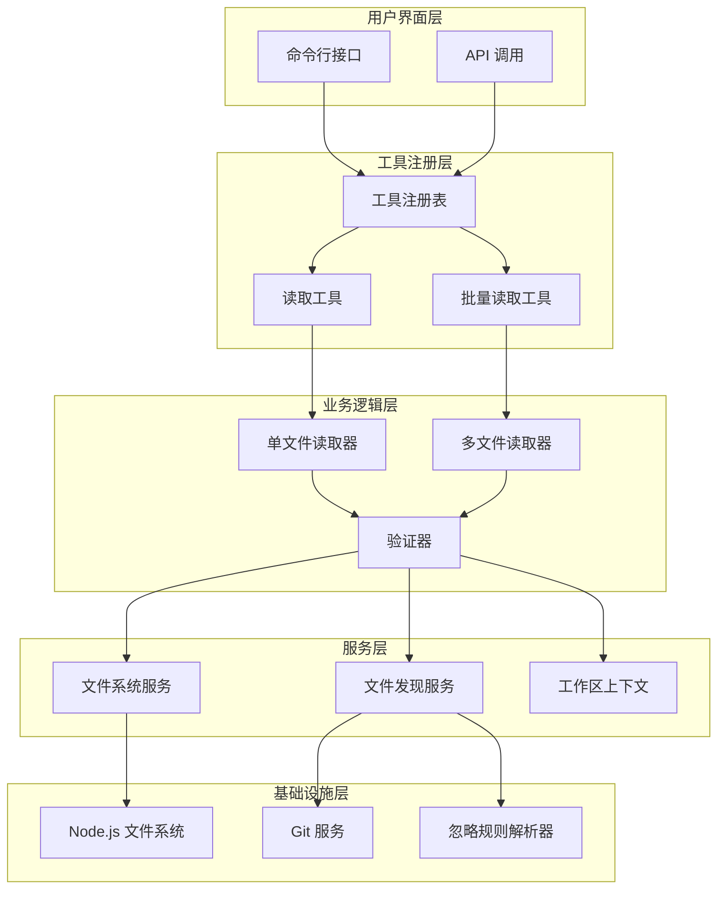
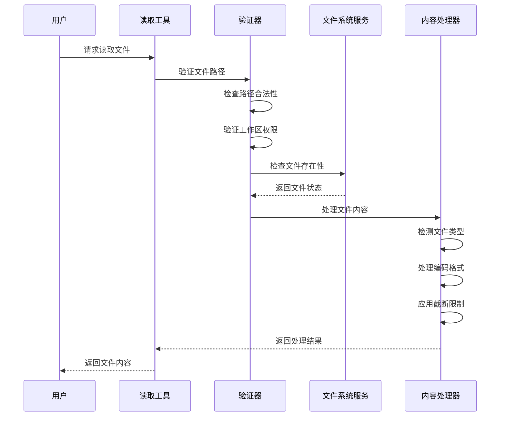
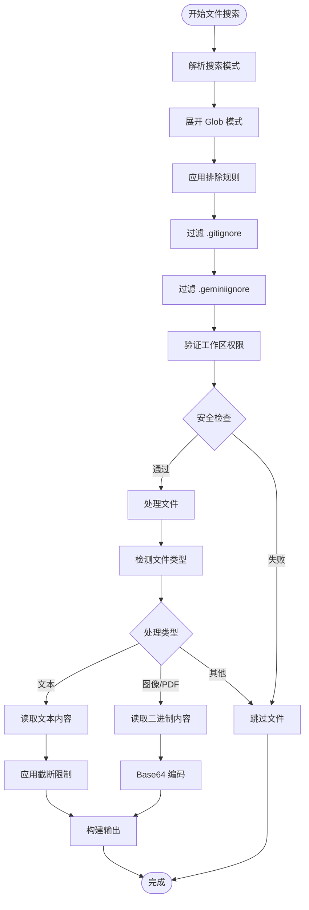
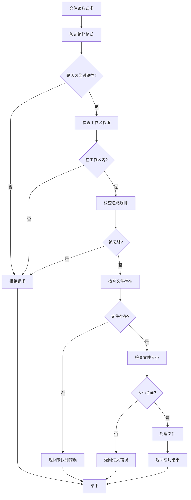
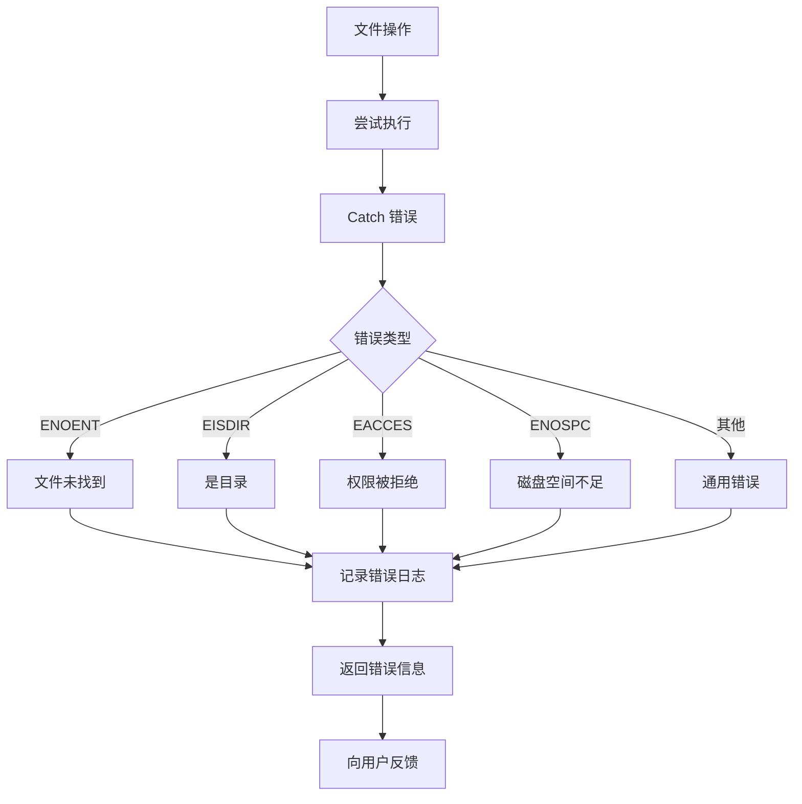

# 文件读取功能详细实现机制

<cite>
**本文档引用的文件**
- [packages/core/src/services/fileSystemService.ts](file://packages/core/src/services/fileSystemService.ts)
- [packages/core/src/tools/read-file.ts](file://packages/core/src/tools/read-file.ts)
- [packages/core/src/tools/read-many-files.ts](file://packages/core/src/tools/read-many-files.ts)
- [packages/core/src/utils/fileUtils.ts](file://packages/core/src/utils/fileUtils.ts)
- [packages/core/src/utils/workspaceContext.ts](file://packages/core/src/utils/workspaceContext.ts)
- [packages/core/src/utils/ignorePatterns.ts](file://packages/core/src/utils/ignorePatterns.ts)
- [packages/core/src/config/config.ts](file://packages/core/src/config/config.ts)
- [integration-tests/utf-bom-encoding.test.ts](file://integration-tests/utf-bom-encoding.test.ts)
- [integration-tests/read_many_files.test.ts](file://integration-tests/read_many_files.test.ts)
</cite>

## 目录
1. [概述](#概述)
2. [核心架构设计](#核心架构设计)
3. [文件系统服务层](#文件系统服务层)
4. [单文件读取工具](#单文件读取工具)
5. [多文件读取工具](#多文件读取工具)
6. [编码处理机制](#编码处理机制)
7. [安全性和权限控制](#安全性和权限控制)
8. [性能优化策略](#性能优化策略)
9. [错误处理和恢复](#错误处理和恢复)
10. [实际应用示例](#实际应用示例)
11. [故障排除指南](#故障排除指南)

## 概述

gemini-cli 的文件读取功能是一个高度安全、功能丰富的系统，专门设计用于在受控环境中安全地读取本地文件系统内容。该系统通过分层架构实现了文件访问的安全控制、多种编码格式支持、智能过滤机制以及高效的批量处理能力。

核心特性包括：
- **安全的文件系统访问**：通过标准化接口限制直接文件系统操作
- **多编码格式支持**：自动检测和处理 UTF-8、UTF-BOM 等编码格式
- **智能文件过滤**：基于 .gitignore 和 .geminiignore 规则的文件过滤
- **批量文件处理**：高效的大规模文件读取和合并功能
- **流式内容处理**：支持大型文件的分块读取和显示
- **符号链接安全**：完整的符号链接检测和处理机制

## 核心架构设计

文件读取系统采用分层架构设计，确保了安全性、可扩展性和维护性。



**图表来源**
- [packages/core/src/tools/read-file.ts](file://packages/core/src/tools/read-file.ts#L1-L50)
- [packages/core/src/tools/read-many-files.ts](file://packages/core/src/tools/read-many-files.ts#L1-L50)
- [packages/core/src/services/fileSystemService.ts](file://packages/core/src/services/fileSystemService.ts#L1-L30)

## 文件系统服务层

文件系统服务层提供了统一的文件操作接口，确保所有文件访问都经过安全检查和控制。

### 标准文件系统服务实现

```typescript
export class StandardFileSystemService implements FileSystemService {
  async readTextFile(filePath: string): Promise<string> {
    return fs.readFile(filePath, 'utf-8');
  }

  async writeTextFile(filePath: string, content: string): Promise<void> {
    await fs.writeFile(filePath, content, 'utf-8');
  }

  findFiles(fileName: string, searchPaths: readonly string[]): string[] {
    return searchPaths.flatMap((searchPath) => {
      const pattern = path.posix.join(searchPath, '**', fileName);
      return globSync(pattern, {
        nodir: true,
        absolute: true,
      });
    });
  }
}
```

### 接口定义

文件系统服务接口定义了标准的操作方法：

```typescript
export interface FileSystemService {
  readTextFile(filePath: string): Promise<string>;
  writeTextFile(filePath: string, content: string): Promise<void>;
  findFiles(fileName: string, searchPaths: readonly string[]): string[];
}
```

**章节来源**
- [packages/core/src/services/fileSystemService.ts](file://packages/core/src/services/fileSystemService.ts#L15-L62)

## 单文件读取工具

单文件读取工具是文件读取功能的核心组件，提供了完整的文件读取、验证和处理能力。

### 工具参数结构

```typescript
export interface ReadFileToolParams {
  absolute_path: string;
  offset?: number;
  limit?: number;
}
```

### 执行流程



**图表来源**
- [packages/core/src/tools/read-file.ts](file://packages/core/src/tools/read-file.ts#L61-L101)
- [packages/core/src/utils/fileUtils.ts](file://packages/core/src/utils/fileUtils.ts#L250-L350)

### 安全验证机制

读取工具实施严格的安全验证：

```typescript
protected override validateToolParamValues(
  params: ReadFileToolParams,
): string | null {
  const filePath = params.absolute_path;
  
  // 验证路径非空
  if (params.absolute_path.trim() === '') {
    return "The 'absolute_path' parameter must be non-empty.";
  }

  // 验证绝对路径
  if (!path.isAbsolute(filePath)) {
    return `File path must be absolute, but was relative: ${filePath}`;
  }

  // 验证工作区权限
  const workspaceContext = this.config.getWorkspaceContext();
  if (!workspaceContext.isPathWithinWorkspace(filePath)) {
    const directories = workspaceContext.getDirectories();
    return `File path must be within one of the workspace directories: ${directories.join(', ')}`;
  }

  // 验证偏移量和限制
  if (params.offset !== undefined && params.offset < 0) {
    return 'Offset must be a non-negative number';
  }
  if (params.limit !== undefined && params.limit <= 0) {
    return 'Limit must be a positive number';
  }

  // 检查忽略模式
  const fileService = this.config.getFileService();
  if (fileService.shouldGeminiIgnoreFile(params.absolute_path)) {
    return `File path '${filePath}' is ignored by .geminiignore pattern(s).`;
  }

  return null;
}
```

**章节来源**
- [packages/core/src/tools/read-file.ts](file://packages/core/src/tools/read-file.ts#L139-L215)

## 多文件读取工具

多文件读取工具提供了高效的批量文件处理能力，支持复杂的文件筛选和合并逻辑。

### 工具参数配置

```typescript
export interface ReadManyFilesParams {
  paths: string[];
  include?: string[];
  exclude?: string[];
  recursive?: boolean;
  useDefaultExcludes?: boolean;
  file_filtering_options?: {
    respect_git_ignore?: boolean;
    respect_gemini_ignore?: boolean;
  };
}
```

### 文件发现和过滤流程



**图表来源**
- [packages/core/src/tools/read-many-files.ts](file://packages/core/src/tools/read-many-files.ts#L150-L250)
- [packages/core/src/utils/fileUtils.ts](file://packages/core/src/utils/fileUtils.ts#L250-L350)

### 批量处理实现

```typescript
async execute(signal: AbortSignal): Promise<ToolResult> {
  const {
    paths: inputPatterns,
    include = [],
    exclude = [],
    useDefaultExcludes = true,
  } = this.params;

  const filesToConsider = new Set<string>();
  const skippedFiles: Array<{ path: string; reason: string }> = [];
  const processedFilesRelativePaths: string[] = [];
  const contentParts: PartListUnion = [];

  // 获取有效的排除模式
  const effectiveExcludes = useDefaultExcludes
    ? [...getDefaultExcludes(this.config), ...exclude]
    : [...exclude];

  // 执行文件搜索
  const searchPatterns = [...inputPatterns, ...include];
  const allEntries = new Set<string>();
  
  for (const dir of workspaceDirs) {
    const processedPatterns = [];
    for (const p of searchPatterns) {
      const normalizedP = p.replace(/\\/g, '/');
      const fullPath = path.join(dir, normalizedP);
      if (fs.existsSync(fullPath)) {
        processedPatterns.push(escape(normalizedP));
      } else {
        processedPatterns.push(normalizedP);
      }
    }

    const entriesInDir = await glob(processedPatterns, {
      cwd: dir,
      ignore: effectiveExcludes,
      nodir: true,
      dot: true,
      absolute: true,
      nocase: true,
      signal,
    });
    
    for (const entry of entriesInDir) {
      allEntries.add(entry);
    }
  }

  // 过滤文件并处理
  const fileDiscovery = this.config.getFileService();
  const { filteredPaths, gitIgnoredCount, geminiIgnoredCount } =
    fileDiscovery.filterFilesWithReport(relativeEntries, {
      respectGitIgnore: this.params.file_filtering_options?.respect_git_ignore ?? 
                       this.config.getFileFilteringOptions().respectGitIgnore,
      respectGeminiIgnore: this.params.file_filtering_options?.respect_gemini_ignore ??
                          this.config.getFileFilteringOptions().respectGeminiIgnore,
    });

  // 处理每个文件
  const fileProcessingPromises = sortedFiles.map(
    async (filePath): Promise<FileProcessingResult> => {
      // 文件处理逻辑...
    },
  );

  const results = await Promise.allSettled(fileProcessingPromises);
  
  // 构建最终输出...
  return {
    llmContent: contentParts,
    returnDisplay: displayMessage.trim(),
  };
}
```

**章节来源**
- [packages/core/src/tools/read-many-files.ts](file://packages/core/src/tools/read-many-files.ts#L120-L300)

## 编码处理机制

gemini-cli 支持多种编码格式，特别是对 Unicode BOM（字节顺序标记）进行了完整支持。

### BOM 检测和解码

```typescript
export function detectBOM(buf: Buffer): BOMInfo | null {
  if (buf.length >= 4) {
    // UTF-32 LE: FF FE 00 00
    if (
      buf[0] === 0xff &&
      buf[1] === 0xfe &&
      buf[2] === 0x00 &&
      buf[3] === 0x00
    ) {
      return { encoding: 'utf32le', bomLength: 4 };
    }
    // UTF-32 BE: 00 00 FE FF
    if (
      buf[0] === 0x00 &&
      buf[1] === 0x00 &&
      buf[2] === 0xfe &&
      buf[3] === 0xff
    ) {
      return { encoding: 'utf32be', bomLength: 4 };
    }
  }
  if (buf.length >= 3) {
    // UTF-8: EF BB BF
    if (buf[0] === 0xef && buf[1] === 0xbb && buf[2] === 0xbf) {
      return { encoding: 'utf8', bomLength: 3 };
    }
  }
  if (buf.length >= 2) {
    // UTF-16 LE: FF FE
    if (
      buf[0] === 0xff &&
      buf[1] === 0xfe &&
      (buf.length < 4 || buf[2] !== 0x00 || buf[3] !== 0x00)
    ) {
      return { encoding: 'utf16le', bomLength: 2 };
    }
    // UTF-16 BE: FE FF
    if (buf[0] === 0xfe && buf[1] === 0xff) {
      return { encoding: 'utf16be', bomLength: 2 };
    }
  }
  return null;
}
```

### UTF-16BE 解码实现

```typescript
function decodeUTF16BE(buf: Buffer): string {
  if (buf.length === 0) return '';
  const swapped = Buffer.from(buf); // swap16 会就地修改，所以先复制
  swapped.swap16();
  return swapped.toString('utf16le');
}
```

### UTF-32 解码实现

```typescript
function decodeUTF32(buf: Buffer, littleEndian: boolean): string {
  if (buf.length < 4) return '';
  const usable = buf.length - (buf.length % 4);
  let out = '';
  for (let i = 0; i < usable; i += 4) {
    const cp = littleEndian
      ? (buf[i] |
          (buf[i + 1] << 8) |
          (buf[i + 2] << 16) |
          (buf[i + 3] << 24)) >>>
        0
      : (buf[i + 3] |
          (buf[i + 2] << 8) |
          (buf[i + 1] << 16) |
          (buf[i] << 24)) >>>
        0;
    // 有效平面：0x0000..0x10FFFF，排除代理项
    if (cp <= 0x10ffff && !(cp >= 0xd800 && cp <= 0xdfff)) {
      out += String.fromCodePoint(cp);
    } else {
      out += '\uFFFD';
    }
  }
  return out;
}
```

### 统一编码读取函数

```typescript
export async function readFileWithEncoding(filePath: string): Promise<string> {
  const full = await fs.promises.readFile(filePath);
  if (full.length === 0) return '';

  const bom = detectBOM(full);
  if (!bom) {
    // 无 BOM → 视为 UTF-8
    return full.toString('utf8');
  }

  // 去除 BOM 并按编码解码
  const content = full.subarray(bom.bomLength);
  switch (bom.encoding) {
    case 'utf8':
      return content.toString('utf8');
    case 'utf16le':
      return content.toString('utf16le');
    case 'utf16be':
      return decodeUTF16BE(content);
    case 'utf32le':
      return decodeUTF32(content, true);
    case 'utf32be':
      return decodeUTF32(content, false);
    default:
      return content.toString('utf8');
  }
}
```

**章节来源**
- [packages/core/src/utils/fileUtils.ts](file://packages/core/src/utils/fileUtils.ts#L25-L150)

## 安全性和权限控制

文件读取系统实施了多层次的安全控制机制，确保只允许访问受信任的工作区目录。

### 工作区上下文管理

```typescript
export class WorkspaceContext {
  private directories = new Set<string>();
  private initialDirectories: Set<string>;

  constructor(directory: string, additionalDirectories: string[] = []) {
    this.addDirectory(directory);
    for (const additionalDirectory of additionalDirectories) {
      this.addDirectory(additionalDirectory);
    }
    this.initialDirectories = new Set(this.directories);
  }

  /**
   * 检查给定路径是否在工作区目录内
   */
  isPathWithinWorkspace(pathToCheck: string): boolean {
    try {
      const fullyResolvedPath = this.fullyResolvedPath(pathToCheck);

      for (const dir of this.directories) {
        if (this.isPathWithinRoot(fullyResolvedPath, dir)) {
          return true;
        }
      }
      return false;
    } catch (_error) {
      return false;
    }
  }

  /**
   * 检查路径是否在给定根目录内
   */
  private isPathWithinRoot(
    pathToCheck: string,
    rootDirectory: string,
  ): boolean {
    const relative = path.relative(rootDirectory, pathToCheck);
    return (
      !relative.startsWith(`..${path.sep}`) &&
      relative !== '..' &&
      !path.isAbsolute(relative)
    );
  }
}
```

### 符号链接安全处理

```typescript
private fullyResolvedPath(pathToCheck: string): string {
  try {
    return fs.realpathSync(pathToCheck);
  } catch (e: unknown) {
    if (
      isNodeError(e) &&
      e.code === 'ENOENT' &&
      e.path &&
      !this.isFileSymlink(e.path)
    ) {
      // 如果不存在，e.path 包含完全解析的路径
      return e.path;
    }
    throw e;
  }
}

private isFileSymlink(filePath: string): boolean {
  try {
    return !fs.readlinkSync(filePath).endsWith('/');
  } catch (_error) {
    return false;
  }
}
```

### 权限验证流程



**图表来源**
- [packages/core/src/utils/workspaceContext.ts](file://packages/core/src/utils/workspaceContext.ts#L120-L180)
- [packages/core/src/tools/read-file.ts](file://packages/core/src/tools/read-file.ts#L150-L200)

**章节来源**
- [packages/core/src/utils/workspaceContext.ts](file://packages/core/src/utils/workspaceContext.ts#L1-L200)

## 性能优化策略

文件读取系统采用了多种性能优化策略，包括缓存机制、并发控制和智能预取。

### 文件类型检测优化

```typescript
export async function detectFileType(
  filePath: string,
): Promise<'text' | 'image' | 'pdf' | 'audio' | 'video' | 'binary' | 'svg'> {
  const ext = path.extname(filePath).toLowerCase();

  // 特殊处理 TypeScript 扩展名
  if (['.ts', '.mts', '.cts'].includes(ext)) {
    return 'text';
  }

  if (ext === '.svg') {
    return 'svg';
  }

  const lookedUpMimeType = mime.getType(filePath);
  if (lookedUpMimeType) {
    if (lookedUpMimeType.startsWith('image/')) {
      return 'image';
    }
    if (lookedUpMimeType.startsWith('audio/')) {
      return 'audio';
    }
    if (lookedUpMimeType.startsWith('video/')) {
      return 'video';
    }
    if (lookedUpMimeType === 'application/pdf') {
      return 'pdf';
    }
  }

  // 对于常见的非文本扩展名，使用更严格的二进制检查
  if (BINARY_EXTENSIONS.includes(ext)) {
    return 'binary';
  }

  // 最后使用内容检查
  if (await isBinaryFile(filePath)) {
    return 'binary';
  }

  return 'text';
}
```

### 大文件处理策略

```typescript
export async function processSingleFileContent(
  filePath: string,
  rootDirectory: string,
  fileSystemService: FileSystemService,
  offset?: number,
  limit?: number,
): Promise<ProcessedFileReadResult> {
  const stats = await fs.promises.stat(filePath);
  const fileSizeInMB = stats.size / (1024 * 1024);
  
  // 大文件限制
  if (fileSizeInMB > 20) {
    return {
      llmContent: 'File size exceeds the 20MB limit.',
      returnDisplay: 'File size exceeds the 20MB limit.',
      error: `File size exceeds the 20MB limit: ${filePath} (${fileSizeInMB.toFixed(2)}MB)`,
      errorType: ToolErrorType.FILE_TOO_LARGE,
    };
  }

  const fileType = await detectFileType(filePath);
  
  switch (fileType) {
    case 'text': {
      const content = await readFileWithEncoding(filePath);
      const lines = content.split('\n');
      
      // 文本文件默认最大行数
      const DEFAULT_MAX_LINES_TEXT_FILE = 2000;
      const MAX_LINE_LENGTH_TEXT_FILE = 2000;
      
      const startLine = offset || 0;
      const effectiveLimit = limit === undefined ? DEFAULT_MAX_LINES_TEXT_FILE : limit;
      const endLine = Math.min(startLine + effectiveLimit, lines.length);
      
      const selectedLines = lines.slice(startLine, endLine);
      
      // 行长度截断处理
      let linesWereTruncatedInLength = false;
      const formattedLines = selectedLines.map((line) => {
        if (line.length > MAX_LINE_LENGTH_TEXT_FILE) {
          linesWereTruncatedInLength = true;
          return line.substring(0, MAX_LINE_LENGTH_TEXT_FILE) + '... [truncated]';
        }
        return line;
      });

      return {
        llmContent: formattedLines.join('\n'),
        returnDisplay: `Read ${selectedLines.length} lines from ${relativePathForDisplay}`,
        isTruncated: contentRangeTruncated || linesWereTruncatedInLength,
        originalLineCount: lines.length,
        linesShown: [startLine + 1, endLine],
      };
    }
  }
}
```

### 并发控制和资源管理

```typescript
// 批量文件处理时的并发控制
const fileProcessingPromises = sortedFiles.map(
  async (filePath): Promise<FileProcessingResult> => {
    try {
      // 使用 processSingleFileContent 处理每个文件
      const fileReadResult = await processSingleFileContent(
        filePath,
        this.config.getTargetDir(),
        this.config.getFileSystemService(),
      );
      
      // 处理结果...
    } catch (error) {
      // 错误处理...
    }
  },
);

const results = await Promise.allSettled(fileProcessingPromises);
```

**章节来源**
- [packages/core/src/utils/fileUtils.ts](file://packages/core/src/utils/fileUtils.ts#L250-L400)

## 错误处理和恢复

文件读取系统实现了完善的错误处理机制，能够优雅地处理各种异常情况。

### 错误类型定义

```typescript
export enum ToolErrorType {
  FILE_NOT_FOUND = 'FILE_NOT_FOUND',
  TARGET_IS_DIRECTORY = 'TARGET_IS_DIRECTORY',
  FILE_TOO_LARGE = 'FILE_TOO_LARGE',
  READ_CONTENT_FAILURE = 'READ_CONTENT_FAILURE',
  PERMISSION_DENIED = 'PERMISSION_DENIED',
  INVALID_ENCODING = 'INVALID_ENCODING',
  TIMEOUT = 'TIMEOUT',
  NETWORK_ERROR = 'NETWORK_ERROR',
  UNKNOWN_ERROR = 'UNKNOWN_ERROR',
}
```

### 分层错误处理



**图表来源**
- [packages/core/src/utils/fileUtils.ts](file://packages/core/src/utils/fileUtils.ts#L400-L480)

### 具体错误处理实现

```typescript
export async function processSingleFileContent(
  filePath: string,
  rootDirectory: string,
  fileSystemService: FileSystemService,
  offset?: number,
  limit?: number,
): Promise<ProcessedFileReadResult> {
  try {
    if (!fs.existsSync(filePath)) {
      return {
        llmContent: 'Could not read file because no file was found at the specified path.',
        returnDisplay: 'File not found.',
        error: `File not found: ${filePath}`,
        errorType: ToolErrorType.FILE_NOT_FOUND,
      };
    }
    
    const stats = await fs.promises.stat(filePath);
    if (stats.isDirectory()) {
      return {
        llmContent: 'Could not read file because the provided path is a directory, not a file.',
        returnDisplay: 'Path is a directory.',
        error: `Path is a directory, not a file: ${filePath}`,
        errorType: ToolErrorType.TARGET_IS_DIRECTORY,
      };
    }

    // 大小检查...
    const fileType = await detectFileType(filePath);
    
    // 文件类型处理...
    
  } catch (error) {
    const errorMessage = error instanceof Error ? error.message : String(error);
    const displayPath = path.relative(rootDirectory, filePath).replace(/\\/g, '/');
    
    return {
      llmContent: `Error reading file ${displayPath}: ${errorMessage}`,
      returnDisplay: `Error reading file ${displayPath}: ${errorMessage}`,
      error: `Error reading file ${filePath}: ${errorMessage}`,
      errorType: ToolErrorType.READ_CONTENT_FAILURE,
    };
  }
}
```

### 批量处理错误恢复

```typescript
async execute(signal: AbortSignal): Promise<ToolResult> {
  const results = await Promise.allSettled(fileProcessingPromises);

  for (const result of results) {
    if (result.status === 'fulfilled') {
      const fileResult = result.value;
      
      if (!fileResult.success) {
        // 处理跳过的文件
        skippedFiles.push({
          path: fileResult.relativePathForDisplay,
          reason: fileResult.reason,
        });
      } else {
        // 处理成功处理的文件
        const { filePath, relativePathForDisplay, fileReadResult } = fileResult;
        
        if (typeof fileReadResult.llmContent === 'string') {
          const separator = DEFAULT_OUTPUT_SEPARATOR_FORMAT.replace(
            '{filePath}',
            filePath,
          );
          let fileContentForLlm = '';
          
          if (fileReadResult.isTruncated) {
            fileContentForLlm += `[WARNING: This file was truncated. To view the full content, use the 'read_file' tool on this specific file.]\n\n`;
          }
          
          fileContentForLlm += fileReadResult.llmContent;
          contentParts.push(`${separator}\n\n${fileContentForLlm}\n\n`);
        }
      }
    } else {
      // 处理 Promise 拒绝（意外错误）
      skippedFiles.push({
        path: 'unknown',
        reason: `Unexpected error: ${result.reason}`,
      });
    }
  }

  return {
    llmContent: contentParts,
    returnDisplay: displayMessage.trim(),
  };
}
```

**章节来源**
- [packages/core/src/utils/fileUtils.ts](file://packages/core/src/utils/fileUtils.ts#L400-L480)
- [packages/core/src/tools/read-many-files.ts](file://packages/core/src/tools/read-many-files.ts#L300-L400)

## 实际应用示例

以下是一些实际的应用场景和代码示例，展示了如何使用 gemini-cli 的文件读取功能。

### 单文件读取示例

```typescript
// 基本单文件读取
const readFileTool = new ReadFileTool(config);
const result = await readFileTool.execute({
  absolute_path: '/path/to/file.txt',
  offset: 0,
  limit: 100
});

console.log(result.llmContent); // 输出文件内容
console.log(result.returnDisplay); // 输出显示信息
```

### 多文件读取示例

```typescript
// 批量读取特定模式的文件
const readManyFilesTool = new ReadManyFilesTool(config);
const result = await readManyFilesTool.execute({
  paths: ['src/**/*.ts'],
  include: ['**/*.test.ts'],
  exclude: ['**/node_modules/**', '**/dist/**'],
  useDefaultExcludes: true,
  recursive: true,
  file_filtering_options: {
    respect_git_ignore: true,
    respect_gemini_ignore: true
  }
});

console.log(result.llmContent); // 输出合并后的文件内容
```

### 大型项目文件扫描

```typescript
// 扫描整个项目的 TypeScript 文件
const scanResult = await readManyFilesTool.execute({
  paths: ['.'],
  include: ['**/*.ts', '**/*.tsx'],
  exclude: [
    '**/node_modules/**',
    '**/dist/**',
    '**/build/**',
    '**/.git/**',
    '**/*.test.ts*',
    '**/*.spec.ts*'
  ],
  useDefaultExcludes: true,
  recursive: true,
  file_filtering_options: {
    respect_git_ignore: true,
    respect_gemini_ignore: true
  }
});
```

### 特定文件类型处理

```typescript
// 只读取图像文件（需要显式指定）
const imageResult = await readManyFilesTool.execute({
  paths: ['assets/**/*.{png,jpg,jpeg,gif,svg}'],
  include: [], // 不包含额外的模式
  exclude: [], // 不排除任何文件
  useDefaultExcludes: false, // 禁用默认排除
  recursive: true,
  file_filtering_options: {
    respect_git_ignore: false,
    respect_gemini_ignore: false
  }
});
```

### 流式读取大型文件

```typescript
// 分块读取大型文件
async function readLargeFileInChunks(filePath: string, chunkSize: number = 1000) {
  let offset = 0;
  const allContent = [];
  
  while (true) {
    const result = await readFileTool.execute({
      absolute_path: filePath,
      offset: offset,
      limit: chunkSize
    });
    
    allContent.push(result.llmContent);
    
    if (!result.isTruncated) {
      break; // 文件已完全读取
    }
    
    offset += chunkSize;
  }
  
  return allContent.join('\n');
}
```

## 故障排除指南

当遇到文件读取问题时，可以按照以下步骤进行诊断和解决。

### 常见问题和解决方案

#### 1. 文件未找到错误

**症状**：返回 "File not found" 错误
**可能原因**：
- 路径拼写错误
- 文件不存在
- 权限问题

**解决方案**：
```bash
# 检查文件是否存在
ls -la /path/to/file.txt

# 检查路径是否正确
pwd
ls -la $(dirname /path/to/file.txt)

# 检查权限
ls -la /path/to/
```

#### 2. 权限被拒绝

**症状**：返回 "Permission denied" 错误
**可能原因**：
- 文件权限设置不正确
- 工作区配置问题
- 符号链接问题

**解决方案**：
```bash
# 检查文件权限
ls -la /path/to/file.txt

# 修改文件权限（谨慎使用）
chmod 644 /path/to/file.txt

# 检查工作区配置
cat ~/.gemini/config.json
```

#### 3. 文件过大

**症状**：返回 "File size exceeds the 20MB limit" 错误
**解决方案**：
- 使用 `offset` 和 `limit` 参数分块读取
- 使用更具体的文件筛选模式
- 检查是否包含了不必要的大型文件

```typescript
// 分块读取大文件
const chunks = [];
let offset = 0;

while (true) {
  const result = await readFileTool.execute({
    absolute_path: largeFile,
    offset: offset,
    limit: 1000 // 每次读取1000行
  });
  
  chunks.push(result.llmContent);
  
  if (!result.isTruncated) {
    break;
  }
  
  offset += 1000;
}
```

#### 4. 编码问题

**症状**：文件内容显示乱码
**可能原因**：
- 文件使用了不支持的编码格式
- BOM 字符未正确处理

**解决方案**：
```typescript
// 检查文件编码
file -bi /path/to/file.txt

// 尝试不同的编码方式
const content = await readFileWithEncoding('/path/to/file.txt');
```

#### 5. 忽略规则问题

**症状**：文件被意外忽略
**可能原因**：
- .gitignore 规则匹配
- .geminiignore 规则匹配
- 默认排除规则

**解决方案**：
```bash
# 检查忽略规则
cat .gitignore
cat .geminiignore

# 强制包含被忽略的文件
./gemini-cli --no-ignore-glob "**/ignored-file.txt"
```

### 调试技巧

#### 启用调试模式

```bash
# 启用详细日志
DEBUG=gemini:* ./gemini-cli --debug "read the file"

# 查看工具调用日志
./gemini-cli --verbose "read the file"
```

#### 检查配置

```typescript
// 检查当前配置
const config = new Config({
  sessionId: 'debug-session',
  targetDir: process.cwd(),
  debugMode: true
});

console.log('Target Directory:', config.getTargetDir());
console.log('Workspace Directories:', config.getWorkspaceContext().getDirectories());
console.log('File Filtering Options:', config.getFileFilteringOptions());
```

#### 测试文件访问

```typescript
// 测试文件访问权限
async function testFileAccess(filePath: string) {
  try {
    const stats = await fs.promises.stat(filePath);
    console.log('File exists and is accessible');
    console.log('Size:', stats.size);
    console.log('Is Directory:', stats.isDirectory());
  } catch (error) {
    console.error('Access error:', error.message);
  }
}
```

**章节来源**
- [integration-tests/utf-bom-encoding.test.ts](file://integration-tests/utf-bom-encoding.test.ts#L1-L142)
- [integration-tests/read_many_files.test.ts](file://integration-tests/read_many_files.test.ts#L1-L48)