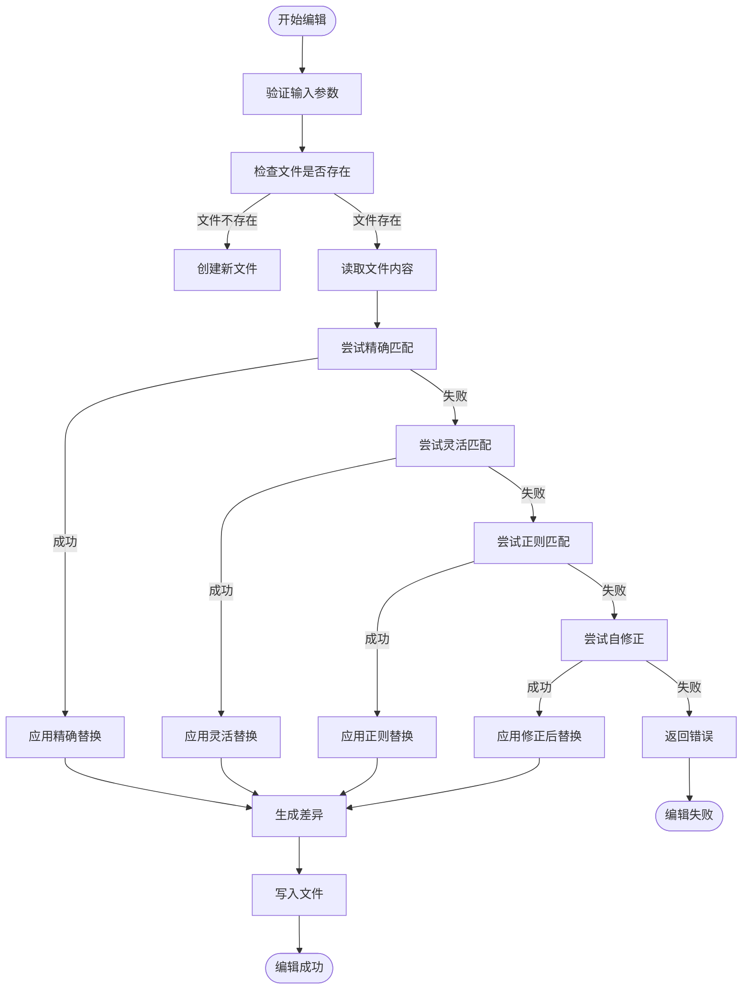
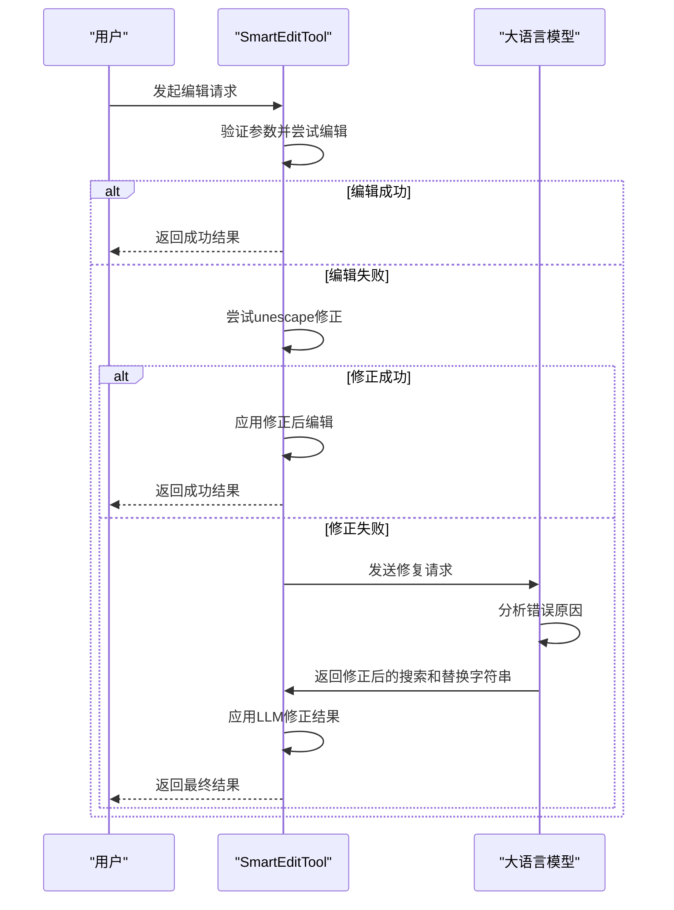
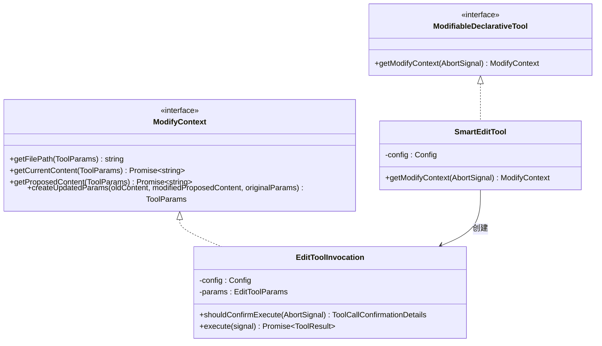
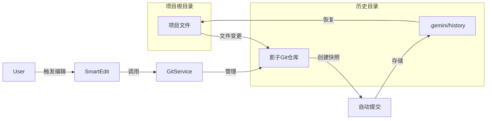

# 智能编辑

<cite>
**本文档引用的文件**
- [smart-edit.ts](file://packages/core/src/tools/smart-edit.ts)
- [edit.ts](file://packages/core/src/tools/edit.ts)
- [diffOptions.ts](file://packages/core/src/tools/diffOptions.ts)
- [modifiable-tool.ts](file://packages/core/src/tools/modifiable-tool.ts)
- [llm-edit-fixer.ts](file://packages/core/src/utils/llm-edit-fixer.ts)
- [editCorrector.ts](file://packages/core/src/utils/editCorrector.ts)
- [gitService.ts](file://packages/core/src/services/gitService.ts)
- [config.ts](file://packages/core/src/config/config.ts)
</cite>

## 目录
1. [简介](#简介)
2. [核心编辑工具链](#核心编辑工具链)
3. [智能编辑实现机制](#智能编辑实现机制)
4. [错误纠正与自修复](#错误纠正与自修复)
5. [变更预览与用户修改](#变更预览与用户修改)
6. [版本控制集成](#版本控制集成)
7. [实际应用示例](#实际应用示例)
8. [总结](#总结)

## 简介
gemini-cli 的智能编辑功能提供了一套完整的代码修改解决方案，通过精确的文本替换、语义感知的重构和自动错误纠正，实现了安全可靠的代码自动化修改。该功能结合了多种工具和技术，确保编辑操作的准确性、可追溯性和用户可控性。

## 核心编辑工具链

智能编辑功能的核心由多个协同工作的组件构成，形成了一个完整的编辑链路。这些组件包括基础编辑工具、差异生成工具、可修改工具接口以及错误纠正机制。

**Section sources**
- [smart-edit.ts](file://packages/core/src/tools/smart-edit.ts)
- [edit.ts](file://packages/core/src/tools/edit.ts)
- [diffOptions.ts](file://packages/core/src/tools/diffOptions.ts)
- [modifiable-tool.ts](file://packages/core/src/tools/modifiable-tool.ts)

## 智能编辑实现机制

智能编辑功能通过 `SmartEditTool` 类实现，该类继承自 `BaseDeclarativeTool` 并实现了 `ModifiableDeclarativeTool` 接口。编辑过程采用多策略匹配算法，按优先级尝试三种替换方式：

1. **精确匹配**：直接查找并替换完全匹配的文本
2. **灵活匹配**：基于缩进和上下文的智能匹配
3. **正则匹配**：使用正则表达式进行模式匹配



**Diagram sources**
- [smart-edit.ts](file://packages/core/src/tools/smart-edit.ts#L0-L982)
- [edit.ts](file://packages/core/src/tools/edit.ts#L0-L588)

**Section sources**
- [smart-edit.ts](file://packages/core/src/tools/smart-edit.ts#L0-L982)

## 错误纠正与自修复

当编辑操作失败时，系统会启动多层错误纠正机制。首先尝试通过 `ensureCorrectEdit` 函数进行本地修正，如果失败则调用 `FixLLMEditWithInstruction` 利用大语言模型进行智能修复。



**Diagram sources**
- [llm-edit-fixer.ts](file://packages/core/src/utils/llm-edit-fixer.ts#L0-L165)
- [editCorrector.ts](file://packages/core/src/utils/editCorrector.ts#L0-L775)

**Section sources**
- [llm-edit-fixer.ts](file://packages/core/src/utils/llm-edit-fixer.ts#L0-L165)
- [editCorrector.ts](file://packages/core/src/utils/editCorrector.ts#L0-L775)

## 变更预览与用户修改

智能编辑功能集成了 `modifiable-tool` 机制，支持变更前预览、批量修改和撤销操作。用户可以在编辑执行前查看差异，并通过外部编辑器进行修改。



**Diagram sources**
- [modifiable-tool.ts](file://packages/core/src/tools/modifiable-tool.ts#L0-L176)
- [smart-edit.ts](file://packages/core/src/tools/smart-edit.ts#L0-L982)

**Section sources**
- [modifiable-tool.ts](file://packages/core/src/tools/modifiable-tool.ts#L0-L176)

## 版本控制集成

智能编辑功能与 `gitService` 紧密集成，确保编辑操作的可追溯性和安全性。系统会自动创建检查点，并支持从快照恢复。



**Diagram sources**
- [gitService.ts](file://packages/core/src/services/gitService.ts#L0-L131)

**Section sources**
- [gitService.ts](file://packages/core/src/services/gitService.ts#L0-L131)

## 实际应用示例

以下是一些智能编辑功能的实际应用示例：

### 变量重命名
```typescript
// 原始代码
function calculateTotal(price, tax) {
    return price + (price * tax);
}

// 编辑指令
{
  file_path: "/path/to/file.ts",
  instruction: "将参数tax重命名为taxRate",
  old_string: "function calculateTotal(price, tax) {",
  new_string: "function calculateTotal(price, taxRate) {"
}
```

### 函数重构
```typescript
// 原始代码
if (user.age >= 18 && user.hasLicense) {
    grantAccess();
}

// 编辑指令
{
  file_path: "/path/to/file.ts",
  instruction: "将条件判断提取为独立函数",
  old_string: "if (user.age >= 18 && user.hasLicense) {",
  new_string: "if (canGrantAccess(user)) {"
}
```

### 错误处理添加
```typescript
// 原始代码
const data = JSON.parse(rawData);

// 编辑指令
{
  file_path: "/path/to/file.ts",
  instruction: "为JSON解析添加错误处理",
  old_string: "const data = JSON.parse(rawData);",
  new_string: "let data;\ntry {\n    data = JSON.parse(rawData);\n} catch (error) {\n    console.error('Failed to parse JSON:', error);\n    data = {};\n}"
}
```

**Section sources**
- [smart-edit.ts](file://packages/core/src/tools/smart-edit.ts#L790-L803)
- [edit.ts](file://packages/core/src/tools/edit.ts#L331-L370)

## 总结
gemini-cli 的智能编辑功能通过多层次的编辑策略、智能错误纠正和版本控制集成，提供了一个强大而安全的代码修改解决方案。该功能不仅支持精确的文本替换，还能通过大语言模型实现语义感知的代码重构，同时确保所有变更都可追溯和可撤销。