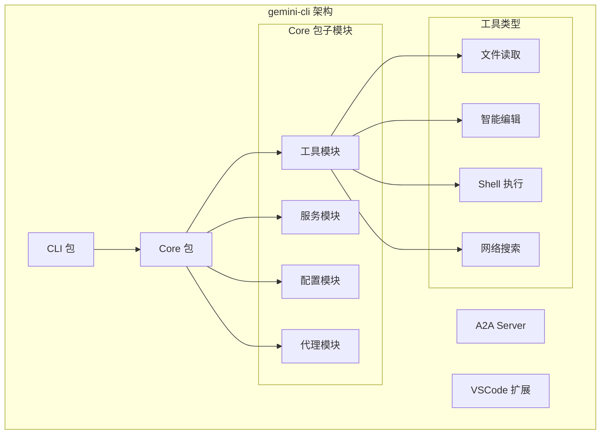
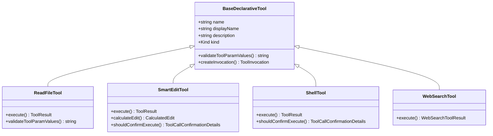
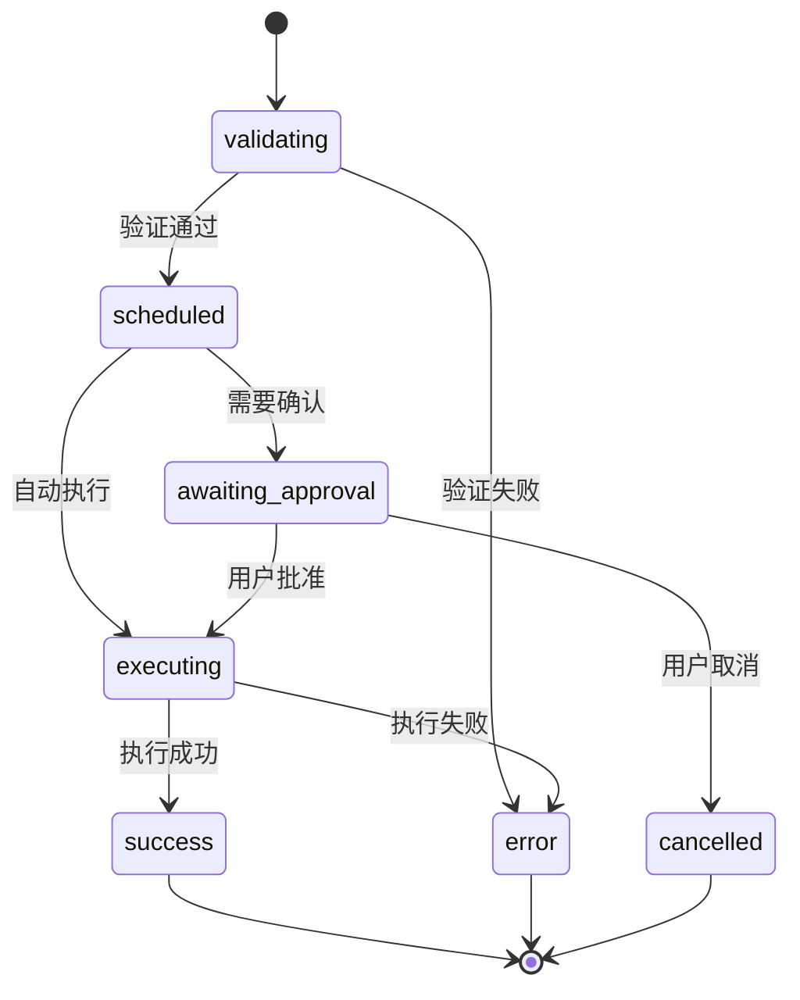
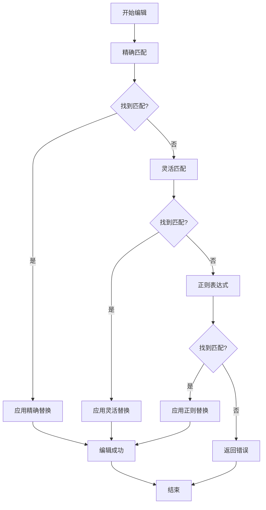
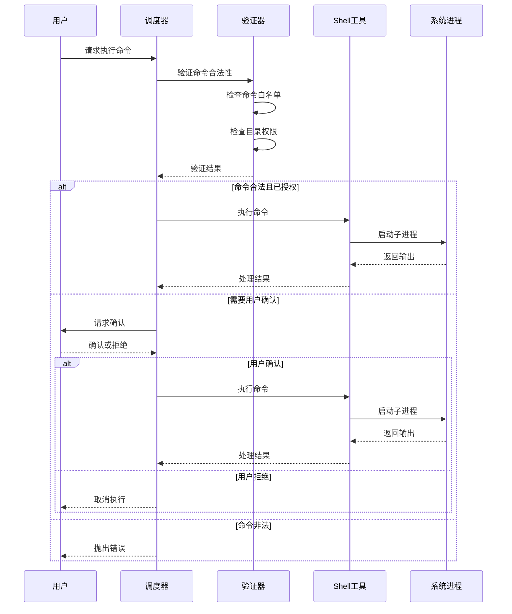
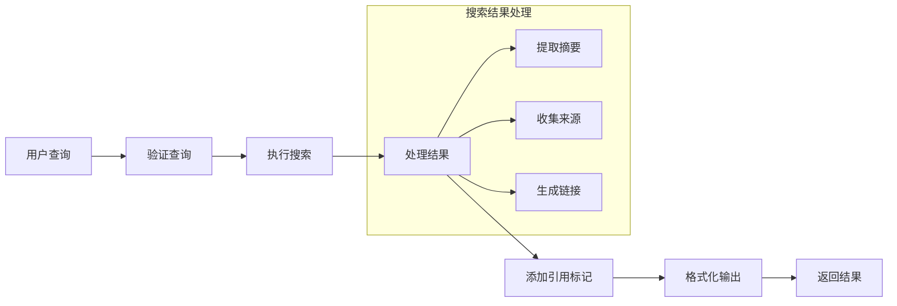
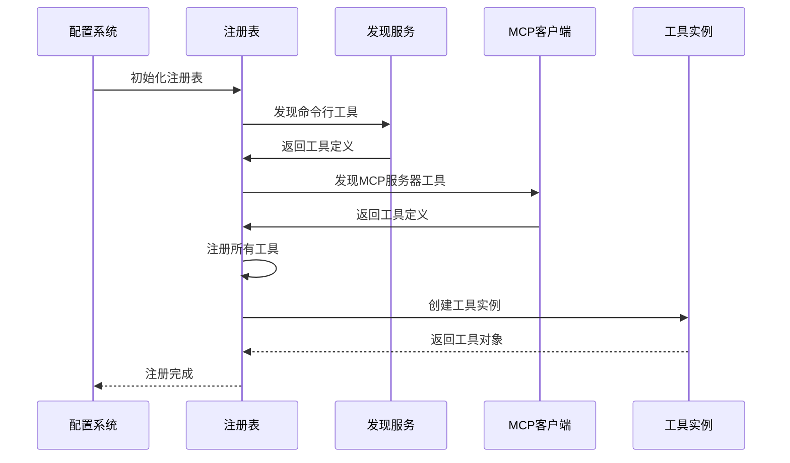

# gemini-cli 核心功能实现

<cite>
**本文档引用的文件**
- [packages/core/src/core/client.ts](file://packages/core/src/core/client.ts)
- [packages/core/src/core/coreToolScheduler.ts](file://packages/core/src/core/coreToolScheduler.ts)
- [packages/core/src/tools/read-file.ts](file://packages/core/src/tools/read-file.ts)
- [packages/core/src/tools/smart-edit.ts](file://packages/core/src/tools/smart-edit.ts)
- [packages/core/src/tools/shell.ts](file://packages/core/src/tools/shell.ts)
- [packages/core/src/tools/web-search.ts](file://packages/core/src/tools/web-search.ts)
- [packages/core/src/tools/tool-registry.ts](file://packages/core/src/tools/tool-registry.ts)
- [packages/core/src/config/config.ts](file://packages/core/src/config/config.ts)
- [integration-tests/read_many_files.test.ts](file://integration-tests/read_many_files.test.ts)
- [integration-tests/run_shell_command.test.ts](file://integration-tests/run_shell_command.test.ts)
</cite>

## 目录
1. [简介](#简介)
2. [项目架构概览](#项目架构概览)
3. [核心工具组件](#核心工具组件)
4. [工具调度器详解](#工具调度器详解)
5. [文件读取工具（read-file）](#文件读取工具read-file)
6. [智能编辑工具（smart-edit）](#智能编辑工具smart-edit)
7. [Shell执行工具（shell）](#shell执行工具shell)
8. [网络搜索工具（web-search）](#网络搜索工具web-search)
9. [工具注册表管理](#工具注册表管理)
10. [性能优化策略](#性能优化策略)
11. [使用示例](#使用示例)
12. [故障排除指南](#故障排除指南)
13. [总结](#总结)

## 简介

gemini-cli 是一个强大的 AI 驱动的命令行工具，它通过集成多种核心工具来实现智能化的开发辅助功能。该项目的核心在于其工具调度系统，该系统能够安全、高效地协调各种工具的执行，包括文件读取、代码编辑、Shell 命令执行和网络搜索等关键功能。

本文档深入探讨了 gemini-cli 的核心功能实现，重点分析了四个主要工具的工作原理：文件读取（read-file）、智能编辑（edit）、Shell 执行（shell）和网络搜索（web-search）。同时，我们还将详细说明这些工具如何通过工具调度器被调用，以及它们与核心客户端的集成方式。

## 项目架构概览

gemini-cli 采用模块化架构设计，将不同功能分离到独立的包中：



**图表来源**
- [packages/cli/src/gemini.tsx](file://packages/cli/src/gemini.tsx)
- [packages/core/src/index.ts](file://packages/core/src/index.ts)

**章节来源**
- [packages/core/src/core/client.ts](file://packages/core/src/core/client.ts#L1-L50)
- [packages/core/src/config/config.ts](file://packages/core/src/config/config.ts#L1-L100)

## 核心工具组件

gemini-cli 的核心功能建立在四个主要工具之上，每个工具都经过精心设计以确保安全性、效率和易用性：

### 工具分类体系



**图表来源**
- [packages/core/src/tools/read-file.ts](file://packages/core/src/tools/read-file.ts#L80-L120)
- [packages/core/src/tools/smart-edit.ts](file://packages/core/src/tools/smart-edit.ts#L700-L750)
- [packages/core/src/tools/shell.ts](file://packages/core/src/tools/shell.ts#L400-L450)
- [packages/core/src/tools/web-search.ts](file://packages/core/src/tools/web-search.ts#L180-L220)

## 工具调度器详解

工具调度器（CoreToolScheduler）是 gemini-cli 的核心组件，负责协调所有工具的执行过程。它提供了完整的生命周期管理，从工具调用验证到最终结果返回。

### 调度器状态管理



**图表来源**
- [packages/core/src/core/coreToolScheduler.ts](file://packages/core/src/core/coreToolScheduler.ts#L40-L100)

### 调度器核心功能

调度器实现了以下关键功能：

1. **工具调用验证**：在执行前验证参数的有效性和安全性
2. **权限控制**：根据配置决定是否需要用户确认
3. **并发管理**：支持多个工具的并行执行
4. **错误处理**：统一的错误捕获和报告机制
5. **输出流管理**：实时更新工具执行状态

**章节来源**
- [packages/core/src/core/coreToolScheduler.ts](file://packages/core/src/core/coreToolScheduler.ts#L1-L200)

## 文件读取工具（read-file）

文件读取工具是 gemini-cli 最基础也是最重要的工具之一，它提供了安全、高效的文件访问能力。

### 核心特性

1. **绝对路径验证**：确保只访问受信任的文件路径
2. **大小限制**：自动截断大文件以防止内存溢出
3. **分页读取**：支持通过 offset 和 limit 参数进行分页
4. **多格式支持**：处理文本、图片和 PDF 文件
5. **编码检测**：自动识别和处理不同的文件编码

### 实现细节

```typescript
// 文件读取参数接口
export interface ReadFileToolParams {
  absolute_path: string;  // 必需：绝对路径
  offset?: number;        // 可选：起始行号
  limit?: number;         // 可选：最大行数
}

// 安全验证逻辑
protected override validateToolParamValues(
  params: ReadFileToolParams,
): string | null {
  const filePath = params.absolute_path;
  
  // 绝对路径检查
  if (!path.isAbsolute(filePath)) {
    return `File path must be absolute, but was relative: ${filePath}`;
  }
  
  // 工作区范围检查
  const workspaceContext = this.config.getWorkspaceContext();
  if (!workspaceContext.isPathWithinWorkspace(filePath)) {
    return `File path must be within workspace directories`;
  }
  
  // .geminiignore 检查
  const fileService = this.config.getFileService();
  if (fileService.shouldGeminiIgnoreFile(params.absolute_path)) {
    return `File path '${filePath}' is ignored by .geminiignore pattern(s).`;
  }
  
  return null;
}
```

### 性能优化

文件读取工具采用了多项性能优化策略：

- **延迟加载**：只在需要时读取文件内容
- **缓存机制**：对频繁访问的文件进行缓存
- **流式处理**：对于大文件使用流式读取
- **内存监控**：实时监控内存使用情况

**章节来源**
- [packages/core/src/tools/read-file.ts](file://packages/core/src/tools/read-file.ts#L1-L215)

## 智能编辑工具（smart-edit）

智能编辑工具是 gemini-cli 的核心功能之一，它能够智能地分析和修改代码文件，提供比传统替换更精确的编辑能力。

### 编辑策略

智能编辑工具实现了三种不同的编辑策略：



**图表来源**
- [packages/core/src/tools/smart-edit.ts](file://packages/core/src/tools/smart-edit.ts#L150-L250)

### 编辑算法实现

1. **精确匹配**：直接字符串替换，适用于简单的文本替换
2. **灵活匹配**：忽略缩进和空白字符差异
3. **正则表达式匹配**：使用智能正则表达式进行复杂模式匹配

### 自我修正机制

智能编辑工具具备自我修正能力，当首次尝试失败时会自动重新计算最佳编辑策略：

```typescript
private async attemptSelfCorrection(
  params: EditToolParams,
  currentContent: string,
  initialError: { display: string; raw: string; type: ToolErrorType },
  abortSignal: AbortSignal,
): Promise<CalculatedEdit> {
  // 使用 LLM 分析错误并提出修正方案
  const fixedEdit = await FixLLMEditWithInstruction(
    params.instruction,
    params.old_string,
    params.new_string,
    initialError.raw,
    currentContent,
    this.config.getBaseLlmClient(),
    abortSignal,
  );
  
  // 尝试新的编辑策略
  const secondAttemptResult = await calculateReplacement(this.config, {
    params: {
      ...params,
      old_string: fixedEdit.search,
      new_string: fixedEdit.replace,
    },
    currentContent,
    abortSignal,
  });
  
  return secondAttemptResult;
}
```

### 安全特性

- **预览机制**：在实际修改前显示差异
- **确认提示**：需要用户确认后才执行修改
- **备份创建**：自动创建修改前的备份文件
- **原子操作**：确保修改要么完全成功，要么完全回滚

**章节来源**
- [packages/core/src/tools/smart-edit.ts](file://packages/core/src/tools/smart-edit.ts#L1-L799)

## Shell执行工具（shell）

Shell 执行工具允许 gemini-cli 在受控环境中执行系统命令，提供了强大的系统交互能力。

### 安全控制机制



**图表来源**
- [packages/core/src/tools/shell.ts](file://packages/core/src/tools/shell.ts#L80-L150)

### 平台适配

Shell 工具支持多种操作系统：

- **Windows**: 使用 `cmd.exe` 或 PowerShell
- **Unix/Linux**: 使用 `bash`
- **macOS**: 使用默认 shell

### 输出处理

1. **实时流式输出**：支持长时间运行命令的实时输出
2. **二进制检测**：自动检测和处理二进制输出
3. **内存限制**：防止大输出导致内存溢出
4. **格式化处理**：对 ANSI 颜色码进行正确处理

### 进程管理

- **进程组管理**：为每个命令创建独立的进程组
- **信号处理**：支持优雅终止和强制终止
- **后台进程监控**：跟踪所有启动的后台进程
- **资源清理**：确保所有相关进程都被正确清理

**章节来源**
- [packages/core/src/tools/shell.ts](file://packages/core/src/tools/shell.ts#L1-L492)

## 网络搜索工具（web-search）

网络搜索工具通过 Google Search API 提供互联网信息检索功能，是 gemini-cli 获取外部知识的重要途径。

### 搜索流程



**图表来源**
- [packages/core/src/tools/web-search.ts](file://packages/core/src/tools/web-search.ts#L50-L150)

### 引用系统

网络搜索工具实现了完整的引用系统：

1. **引用标记**：在文本中标记引用来源
2. **来源列表**：在结果末尾列出所有引用来源
3. **置信度评分**：为每个引用提供置信度分数
4. **段落关联**：将引用与具体段落关联

### 错误处理

- **网络错误重试**：自动重试临时网络问题
- **结果为空处理**：优雅处理无结果的情况
- **格式错误恢复**：处理 API 响应格式异常
- **超时控制**：设置合理的请求超时时间

**章节来源**
- [packages/core/src/tools/web-search.ts](file://packages/core/src/tools/web-search.ts#L1-L228)

## 工具注册表管理

工具注册表（ToolRegistry）负责管理所有可用工具的生命周期，包括发现、注册、验证和执行。

### 注册流程



**图表来源**
- [packages/core/src/tools/tool-registry.ts](file://packages/core/src/tools/tool-registry.ts#L150-L250)

### 动态工具发现

工具注册表支持动态发现新工具：

1. **命令行发现**：执行自定义命令发现工具
2. **MCP协议**：通过 MCP 协议发现外部工具
3. **插件系统**：支持扩展插件自动注册
4. **热重载**：支持运行时重新发现工具

### 工具验证

每个工具在注册前都会经过严格验证：

- **参数验证**：检查必需参数和数据类型
- **权限检查**：验证工具的安全权限
- **兼容性检查**：确保工具与当前环境兼容
- **依赖检查**：验证工具所需的依赖项

**章节来源**
- [packages/core/src/tools/tool-registry.ts](file://packages/core/src/tools/tool-registry.ts#L1-L480)

## 性能优化策略

gemini-cli 在多个层面实施了性能优化策略，确保在处理大型项目时仍能保持良好的响应速度。

### 内存管理

1. **流式处理**：对大文件使用流式读取而非一次性加载
2. **缓存策略**：智能缓存频繁访问的数据
3. **垃圾回收**：及时释放不再使用的资源
4. **内存监控**：实时监控内存使用情况

### 并发优化

1. **异步执行**：所有 I/O 操作都是异步的
2. **批量处理**：合并多个小文件读取为单次批量操作
3. **工作线程**：使用 worker 线程处理 CPU 密集型任务
4. **连接池**：复用网络连接减少开销

### 网络优化

1. **请求去重**：避免重复的网络请求
2. **压缩传输**：启用 gzip 压缩减少带宽使用
3. **超时控制**：合理设置请求超时时间
4. **重试机制**：智能重试失败的网络请求

## 使用示例

以下是 gemini-cli 中各个核心工具的实际使用示例：

### 文件读取示例

```typescript
// 读取特定文件的部分内容
const result = await geminiClient.generateContent(
  [{
    role: 'user',
    parts: [{
      text: '请读取 src/main.ts 文件的第10-20行'
    }]
  }],
  {
    tools: [{
      functionDeclarations: [{
        name: 'read_file',
        description: '读取指定文件的内容',
        parameters: {
          type: 'object',
          properties: {
            absolute_path: {
              type: 'string',
              description: '文件的绝对路径'
            },
            offset: {
              type: 'number',
              description: '起始行号'
            },
            limit: {
              type: 'number',
              description: '最大行数'
            }
          },
          required: ['absolute_path']
        }
      }]
    }]
  }
);
```

### 智能编辑示例

```typescript
// 智能替换代码中的函数名
const editResult = await geminiClient.generateContent(
  [{
    role: 'user',
    parts: [{
      text: '将 src/components/Button.tsx 中的所有 handleClick 替换为 handleButtonClick'
    }]
  }],
  {
    tools: [{
      functionDeclarations: [{
        name: 'replace',
        description: '智能替换文件中的文本',
        parameters: {
          type: 'object',
          properties: {
            file_path: {
              type: 'string',
              description: '目标文件路径'
            },
            old_string: {
              type: 'string',
              description: '要替换的旧文本'
            },
            new_string: {
              type: 'string',
              description: '替换为的新文本'
            },
            instruction: {
              type: 'string',
              description: '编辑指令'
            }
          },
          required: ['file_path', 'old_string', 'new_string', 'instruction']
        }
      }]
    }]
  }
);
```

### Shell 命令示例

```typescript
// 执行构建命令并获取输出
const shellResult = await geminiClient.generateContent(
  [{
    role: 'user',
    parts: [{
      text: '运行 npm run build 命令并告诉我构建结果'
    }]
  }],
  {
    tools: [{
      functionDeclarations: [{
        name: 'run_shell_command',
        description: '执行系统命令',
        parameters: {
          type: 'object',
          properties: {
            command: {
              type: 'string',
              description: '要执行的命令'
            },
            description: {
              type: 'string',
              description: '命令描述'
            },
            directory: {
              type: 'string',
              description: '执行目录'
            }
          },
          required: ['command']
        }
      }]
    }]
  }
);
```

### 网络搜索示例

```typescript
// 搜索技术问题的答案
const searchResult = await geminiClient.generateContent(
  [{
    role: 'user',
    parts: [{
      text: '搜索如何在 React 中使用 Context API 的最佳实践'
    }]
  }],
  {
    tools: [{
      functionDeclarations: [{
        name: 'google_web_search',
        description: '在网络上搜索信息',
        parameters: {
          type: 'object',
          properties: {
            query: {
              type: 'string',
              description: '搜索查询'
            }
          },
          required: ['query']
        }
      }]
    }]
  }
);
```

## 故障排除指南

### 常见问题及解决方案

1. **文件读取失败**
   - 检查文件路径是否为绝对路径
   - 确认文件不在 `.geminiignore` 排除列表中
   - 验证文件权限设置

2. **编辑工具失效**
   - 使用 `read_file` 工具确认文件内容
   - 检查待替换文本是否准确匹配
   - 考虑使用更具体的上下文

3. **Shell 命令被拒绝**
   - 检查命令是否在允许列表中
   - 验证工作目录权限
   - 确认命令语法正确

4. **网络搜索无结果**
   - 检查网络连接
   - 验证 Google API 访问权限
   - 尝试更具体的搜索查询

### 调试技巧

- 启用调试模式查看详细日志
- 使用 `--debug` 参数获取更多信息
- 检查工具执行历史记录
- 监控系统资源使用情况

**章节来源**
- [integration-tests/read_many_files.test.ts](file://integration-tests/read_many_files.test.ts#L1-L48)
- [integration-tests/run_shell_command.test.ts](file://integration-tests/run_shell_command.test.ts#L1-L100)

## 总结

gemini-cli 通过其精心设计的核心工具系统，为开发者提供了一个强大而安全的 AI 辅助开发环境。四个核心工具——文件读取、智能编辑、Shell 执行和网络搜索——各司其职，共同构成了一个完整的开发辅助生态系统。

### 主要优势

1. **安全性优先**：所有工具都经过严格的安全验证和权限控制
2. **智能决策**：工具具备自我修正和智能选择能力
3. **性能优化**：多层次的性能优化确保流畅体验
4. **可扩展性**：模块化设计支持轻松添加新工具
5. **跨平台支持**：全面支持主流操作系统

### 未来发展方向

- **更多工具集成**：持续添加新的专用工具
- **AI 辅助增强**：利用机器学习提升工具智能度
- **协作功能**：支持团队协作和共享配置
- **云端同步**：实现配置和工具的云端同步
- **可视化界面**：提供图形化的工具管理和监控界面

gemini-cli 的核心功能实现展示了现代软件工程的最佳实践，通过模块化设计、严格的权限控制和智能的错误处理，为用户提供了一个既强大又安全的开发辅助平台。