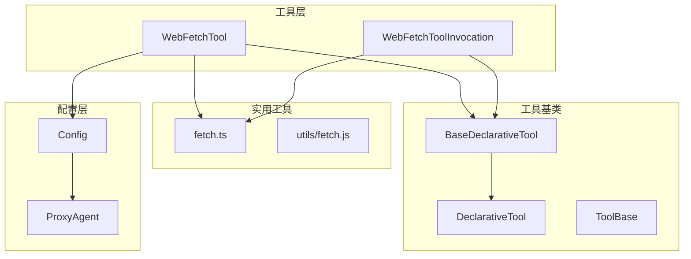
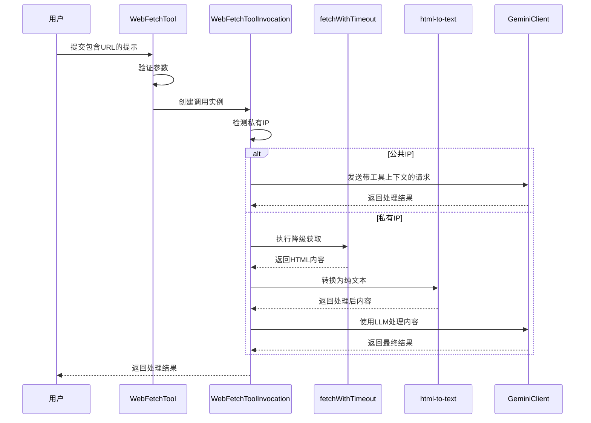
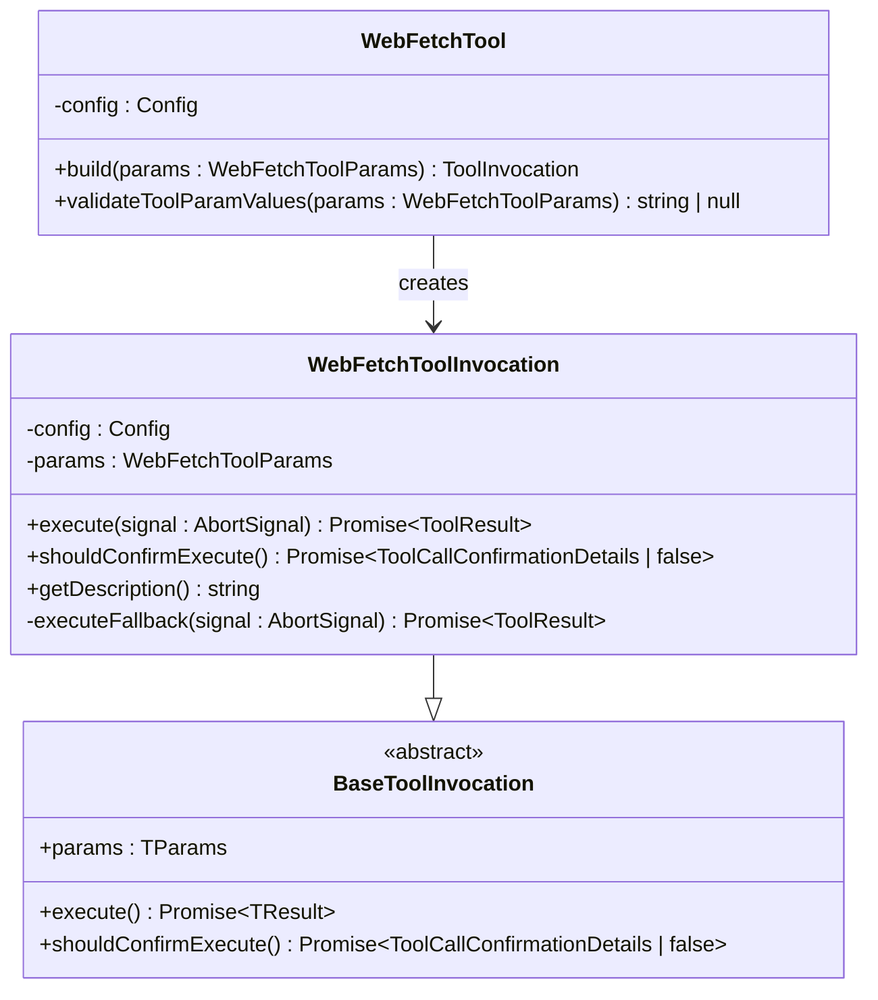
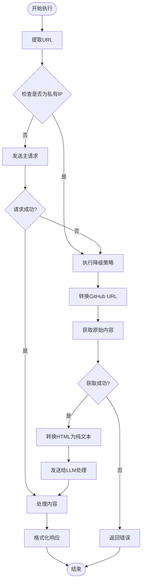
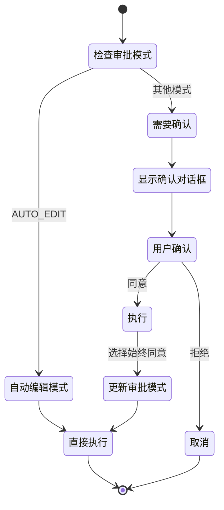
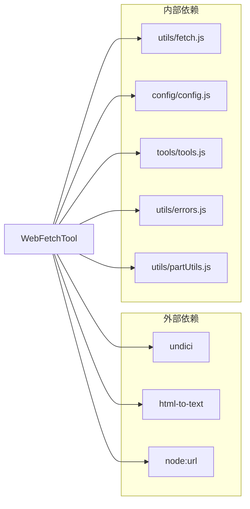

# Web Fetch内容抓取工具详细文档

<cite>
**本文档中引用的文件**
- [web-fetch.ts](file://packages/core/src/tools/web-fetch.ts)
- [web-fetch.test.ts](file://packages/core/src/tools/web-fetch.test.ts)
- [fetch.ts](file://packages/core/src/utils/fetch.ts)
- [config.ts](file://packages/core/src/config/config.ts)
- [tools.ts](file://packages/core/src/tools/tools.ts)
</cite>

## 目录
1. [简介](#简介)
2. [项目结构](#项目结构)
3. [核心组件](#核心组件)
4. [架构概览](#架构概览)
5. [详细组件分析](#详细组件分析)
6. [依赖关系分析](#依赖关系分析)
7. [性能考虑](#性能考虑)
8. [故障排除指南](#故障排除指南)
9. [结论](#结论)

## 简介

WebFetchTool是一个专门设计用于从用户提示中的URL抓取网页内容的工具。该工具能够处理公共和私有网络地址，包括本地主机，并提供安全的超时控制和降级策略。它通过智能的URL提取、私有IP检测和HTML到纯文本的转换，为用户提供了一个强大而安全的内容获取解决方案。

## 项目结构

WebFetchTool位于gemini-cli项目的工具模块中，遵循清晰的分层架构：



**图表来源**
- [web-fetch.ts](file://packages/core/src/tools/web-fetch.ts#L324-L368)
- [tools.ts](file://packages/core/src/tools/tools.ts#L393-L437)

**章节来源**
- [web-fetch.ts](file://packages/core/src/tools/web-fetch.ts#L1-L50)

## 核心组件

### WebFetchToolParams接口

WebFetchTool的核心参数结构定义了工具的输入格式：

```typescript
export interface WebFetchToolParams {
  /**
   * 包含URL（最多20个）和处理指令的综合提示
   */
  prompt: string;
}
```

该参数支持复杂的用户指令，例如：
- "总结 https://example.com/article 并提取 https://another.com/data 中的关键点"
- "从多个URL提取特定数据：https://site1.com 和 https://site2.com"

### 私有IP检测系统

工具实现了全面的私有IP地址检测机制：

```typescript
const PRIVATE_IP_RANGES = [
  /^10\./,
  /^127\./,
  /^172\.(1[6-9]|2[0-9]|3[0-1])\./,
  /^192\.168\./,
  /^::1$/,
  /^fc00:/,
  /^fe80:/,
];
```

这种检测确保了对本地网络资源的安全访问控制。

**章节来源**
- [web-fetch.ts](file://packages/core/src/tools/web-fetch.ts#L45-L55)
- [fetch.ts](file://packages/core/src/utils/fetch.ts#L10-L16)

## 架构概览

WebFetchTool采用多层架构设计，确保安全性和可扩展性：



**图表来源**
- [web-fetch.ts](file://packages/core/src/tools/web-fetch.ts#L185-L218)
- [web-fetch.ts](file://packages/core/src/tools/web-fetch.ts#L120-L180)

## 详细组件分析

### WebFetchToolInvocation类

这是工具的核心执行引擎，负责实际的内容获取和处理：



**图表来源**
- [web-fetch.ts](file://packages/core/src/tools/web-fetch.ts#L57-L110)
- [web-fetch.ts](file://packages/core/src/tools/web-fetch.ts#L324-L368)

#### URL提取算法

工具使用正则表达式进行智能URL提取：

```typescript
function extractUrls(text: string): string[] {
  const urlRegex = /(https?:\/\/[^\s]+)/g;
  return text.match(urlRegex) || [];
}
```

该算法能够识别各种URL格式，包括HTTP和HTTPS协议。

#### GitHub URL自动转换

对于GitHub链接，工具会自动转换为raw格式：

```typescript
if (url.includes('github.com') && url.includes('/blob/')) {
  url = url
    .replace('github.com', 'raw.githubusercontent.com')
    .replace('/blob/', '/');
}
```

这确保了可以直接获取原始文件内容，而不是HTML页面。

**章节来源**
- [web-fetch.ts](file://packages/core/src/tools/web-fetch.ts#L45-L50)
- [web-fetch.ts](file://packages/core/src/tools/web-fetch.ts#L120-L140)

### 降级策略执行

当遇到私有IP或主请求失败时，工具会自动切换到降级策略：



**图表来源**
- [web-fetch.ts](file://packages/core/src/tools/web-fetch.ts#L185-L218)
- [web-fetch.ts](file://packages/core/src/tools/web-fetch.ts#L120-L180)

#### HTML到纯文本转换

使用`html-to-text`库进行高质量的内容转换：

```typescript
const textContent = convert(html, {
  wordwrap: false,
  selectors: [
    { selector: 'a', options: { ignoreHref: true } },
    { selector: 'img', format: 'skip' },
  ],
}).substring(0, MAX_CONTENT_LENGTH);
```

该转换器保留了文本内容但移除了不必要的元素，如链接和图片。

**章节来源**
- [web-fetch.ts](file://packages/core/src/tools/web-fetch.ts#L140-L160)

### 安全确认机制

工具实现了多层次的安全确认机制：



**图表来源**
- [web-fetch.ts](file://packages/core/src/tools/web-fetch.ts#L162-L180)

**章节来源**
- [web-fetch.ts](file://packages/core/src/tools/web-fetch.ts#L162-L180)

### 错误处理和恢复

工具实现了全面的错误处理机制：

```typescript
try {
  const response = await geminiClient.generateContent(/* ... */);
  // 处理成功响应
} catch (error: unknown) {
  const errorMessage = `Error processing web content for prompt "${userPrompt.substring(0, 50)}...": ${getErrorMessage(error)}`;
  return {
    llmContent: `Error: ${errorMessage}`,
    returnDisplay: `Error: ${errorMessage}`,
    error: {
      message: errorMessage,
      type: ToolErrorType.WEB_FETCH_PROCESSING_ERROR,
    },
  };
}
```

**章节来源**
- [web-fetch.ts](file://packages/core/src/tools/web-fetch.ts#L288-L322)

## 依赖关系分析

WebFetchTool的依赖关系展现了清晰的分层架构：



**图表来源**
- [web-fetch.ts](file://packages/core/src/tools/web-fetch.ts#L1-L25)
- [fetch.ts](file://packages/core/src/utils/fetch.ts#L1-L10)

**章节来源**
- [web-fetch.ts](file://packages/core/src/tools/web-fetch.ts#L1-L25)

## 性能考虑

### 超时控制

工具实现了严格的超时控制机制：

```typescript
const URL_FETCH_TIMEOUT_MS = 10000;
const MAX_CONTENT_LENGTH = 100000;

export async function fetchWithTimeout(
  url: string,
  timeout: number,
): Promise<Response> {
  const controller = new AbortController();
  const timeoutId = setTimeout(() => controller.abort(), timeout);
  
  try {
    const response = await fetch(url, { signal: controller.signal });
    return response;
  } catch (error) {
    if (isNodeError(error) && error.code === 'ABORT_ERR') {
      throw new FetchError(`Request timed out after ${timeout}ms`, 'ETIMEDOUT');
    }
    throw new FetchError(getErrorMessage(error));
  } finally {
    clearTimeout(timeoutId);
  }
}
```

### 内容长度限制

为了防止内存溢出，工具对内容长度进行了严格限制：

- 最大内容长度：100,000字符
- 截断策略：自动截断超出部分
- 缓存优化：LRU缓存机制

### 并发控制

工具通过AbortController实现并发控制，确保在取消操作时正确清理资源。

## 故障排除指南

### 常见问题及解决方案

#### 1. WEB_FETCH_NO_URL_IN_PROMPT错误
**症状**：工具抛出"prompt必须包含至少一个有效的URL"错误
**原因**：用户提示中没有包含任何URL
**解决方案**：确保提示中包含至少一个以http://或https://开头的有效URL

#### 2. WEB_FETCH_FALLBACK_FAILED错误
**症状**：降级策略执行失败
**原因**：无法从指定URL获取内容
**解决方案**：
- 检查URL是否有效且可访问
- 验证网络连接
- 尝试使用不同的URL

#### 3. WEB_FETCH_PROCESSING_ERROR错误
**症状**：主请求处理失败
**原因**：Gemini API调用或内容处理过程中出现错误
**解决方案**：
- 检查API密钥有效性
- 验证提示格式
- 查看详细错误日志

#### 4. 私有IP访问被阻止
**症状**：尝试访问localhost或内网地址时失败
**原因**：安全策略阻止访问私有IP
**解决方案**：
- 使用公网可访问的URL
- 配置适当的代理设置
- 在必要时调整安全策略

**章节来源**
- [web-fetch.test.ts](file://packages/core/src/tools/web-fetch.test.ts#L41-L90)

## 结论

WebFetchTool是一个功能强大、安全可靠的网页内容抓取工具。它通过智能的URL提取、私有IP检测、降级策略和全面的错误处理，为用户提供了稳定可靠的内容获取服务。工具的模块化设计和清晰的架构使其易于维护和扩展，同时确保了高性能和安全性。

该工具特别适用于需要从互联网获取信息的AI应用，如内容摘要、数据分析和知识检索等场景。通过其先进的安全机制和优雅的降级策略，WebFetchTool能够在各种网络环境下提供一致的服务质量。