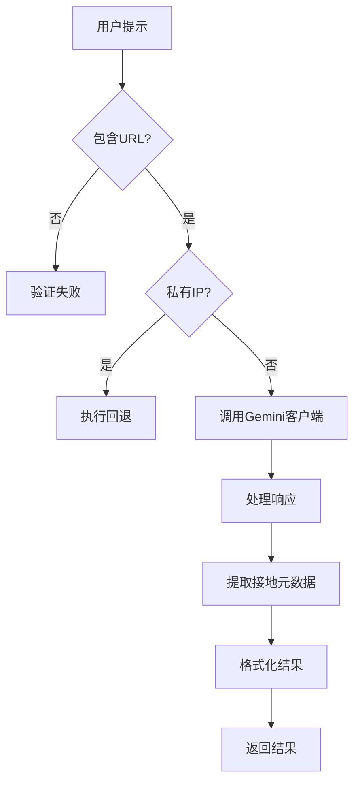
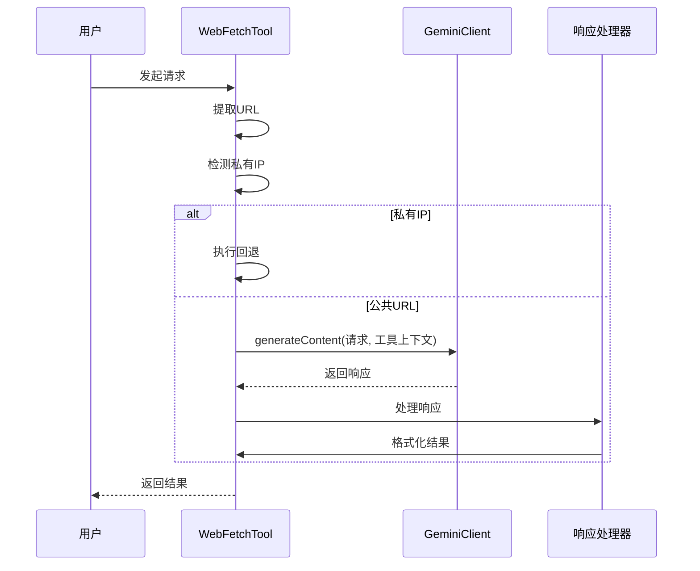
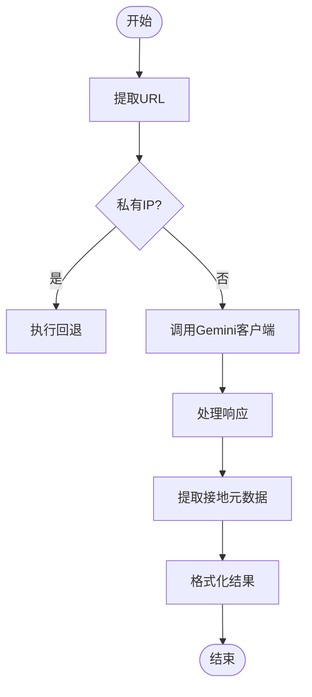
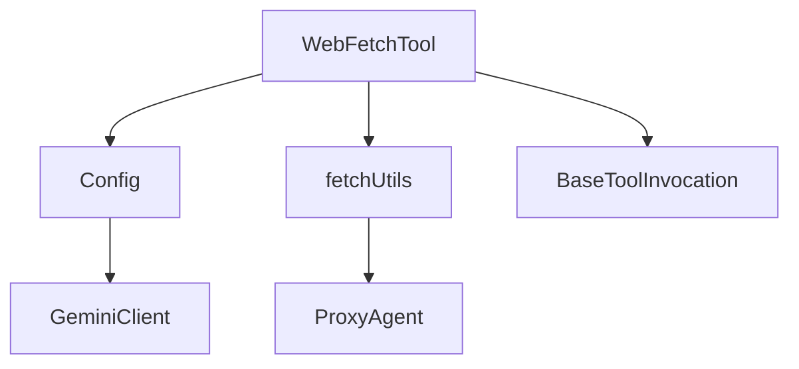

# 主抓取流程

<cite>
**本文档中引用的文件**
- [web-fetch.ts](file://packages/core/src/tools/web-fetch.ts)
- [config.ts](file://packages/core/src/config/config.ts)
- [fetch.ts](file://packages/core/src/utils/fetch.ts)
- [tools.ts](file://packages/core/src/tools/tools.ts)
- [tool-error.ts](file://packages/core/src/tools/tool-error.ts)
</cite>

## 目录
1. [简介](#简介)
2. [项目结构](#项目结构)
3. [核心组件](#核心组件)
4. [架构概述](#架构概述)
5. [详细组件分析](#详细组件分析)
6. [依赖分析](#依赖分析)
7. [性能考虑](#性能考虑)
8. [故障排除指南](#故障排除指南)
9. [结论](#结论)
10. [附录](#附录)（如有必要）

## 简介
本文档深入解析 WebFetchTool 的主执行流程（execute 方法），阐述其如何通过 Gemini 客户端发起带工具上下文的请求以实现 URL 内容抓取。详细说明用户提示中 URL 的提取机制、私有 IP 检测逻辑及其对流程的影响、请求超时控制以及响应数据的结构解析过程。重点描述接地元数据（groundingMetadata）的处理，包括来源信息提取、引用标记插入和结果文本格式化。结合代码示例说明在主流程成功时的数据流向与内容呈现方式，并解释与 config、geminiClient 等核心组件的集成关系。

## 项目结构
WebFetchTool 位于项目的核心工具包中，其主要实现文件位于 `packages/core/src/tools/web-fetch.ts`。该工具是 CLI 核心功能的一部分，与其他工具如 `web-search.ts`、`read-file.ts` 等并列。它依赖于配置系统（`config.ts`）、网络请求工具（`fetch.ts`）以及通用的工具基类（`tools.ts`）。

**Section sources**
- [web-fetch.ts](file://packages/core/src/tools/web-fetch.ts#L1-L50)

## 核心组件
WebFetchTool 的核心功能围绕其 `execute` 方法展开。该方法首先从用户提示中提取 URL，然后根据 URL 的类型（公共或私有）决定执行路径。对于公共 URL，它通过 Gemini 客户端发起请求；对于私有 IP 地址，则执行回退机制。

**Section sources**
- [web-fetch.ts](file://packages/core/src/tools/web-fetch.ts#L185-L368)

## 架构概述
WebFetchTool 的架构遵循声明式工具模式，继承自 `BaseDeclarativeTool`。它通过 `config` 对象获取 Gemini 客户端实例，并利用 `geminiClient.generateContent` 方法发起带有 URL 上下文的请求。整个流程受到配置管理、错误处理和确认机制的控制。

**Diagram sources**
- [web-fetch.ts](file://packages/core/src/tools/web-fetch.ts#L185-L368)
- [config.ts](file://packages/core/src/config/config.ts#L1110-L1115)

## 详细组件分析
### WebFetchTool 执行流程分析
WebFetchTool 的执行流程始于 `execute` 方法。该方法首先提取用户提示中的 URL，并通过 `isPrivateIp` 函数检测其是否为私有 IP 地址。如果是私有 IP，则调用 `executeFallback` 方法；否则，通过 Gemini 客户端发起请求。

#### 对于 API/服务组件：

**Diagram sources**
- [web-fetch.ts](file://packages/core/src/tools/web-fetch.ts#L185-L368)

#### 对于复杂逻辑组件：

**Diagram sources**
- [web-fetch.ts](file://packages/core/src/tools/web-fetch.ts#L185-L368)

**Section sources**
- [web-fetch.ts](file://packages/core/src/tools/web-fetch.ts#L185-L368)

### 接地元数据处理
接地元数据的处理是 WebFetchTool 的关键部分。它从响应中提取 `groundingMetadata`，包括来源信息和引用支持。然后，根据这些信息在响应文本中插入引用标记，并在结果末尾添加来源列表。

**Section sources**
- [web-fetch.ts](file://packages/core/src/tools/web-fetch.ts#L256-L291)

## 依赖分析
WebFetchTool 依赖于多个核心组件，包括 `Config` 用于获取配置和 Gemini 客户端，`fetchUtils` 用于网络请求和私有 IP 检测，以及 `BaseToolInvocation` 作为其基类。这些依赖关系确保了工具的灵活性和可扩展性。

**Diagram sources**
- [web-fetch.ts](file://packages/core/src/tools/web-fetch.ts#L324-L368)
- [config.ts](file://packages/core/src/config/config.ts#L1110-L1115)

**Section sources**
- [web-fetch.ts](file://packages/core/src/tools/web-fetch.ts#L324-L368)
- [config.ts](file://packages/core/src/config/config.ts#L1110-L1115)

## 性能考虑
WebFetchTool 的性能主要受网络请求和 Gemini 客户端响应时间的影响。为了优化性能，工具实现了请求超时控制，并在处理大型响应时截取内容以避免内存溢出。

## 故障排除指南
当 WebFetchTool 执行失败时，可能的原因包括无效的 URL、私有 IP 地址无法访问、Gemini 客户端错误等。相应的错误类型在 `ToolErrorType` 中定义，如 `WEB_FETCH_NO_URL_IN_PROMPT`、`WEB_FETCH_FALLBACK_FAILED` 和 `WEB_FETCH_PROCESSING_ERROR`。

**Section sources**
- [tool-error.ts](file://packages/core/src/tools/tool-error.ts#L50-L70)
- [web-fetch.ts](file://packages/core/src/tools/web-fetch.ts#L288-L322)

## 结论
WebFetchTool 是一个功能强大的工具，能够处理来自用户提示的 URL 内容抓取请求。通过集成 Gemini 客户端和灵活的回退机制，它能够有效地处理各种网络环境下的请求。其设计遵循模块化和可扩展的原则，为未来的功能增强提供了坚实的基础。

## 附录
### 错误类型
| 错误类型 | 描述 |
| --- | --- |
| WEB_FETCH_NO_URL_IN_PROMPT | 提示中没有 URL |
| WEB_FETCH_FALLBACK_FAILED | 回退抓取失败 |
| WEB_FETCH_PROCESSING_ERROR | 处理错误 |

**Section sources**
- [tool-error.ts](file://packages/core/src/tools/tool-error.ts#L50-L70)