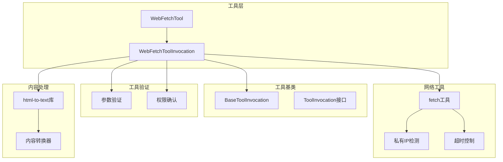
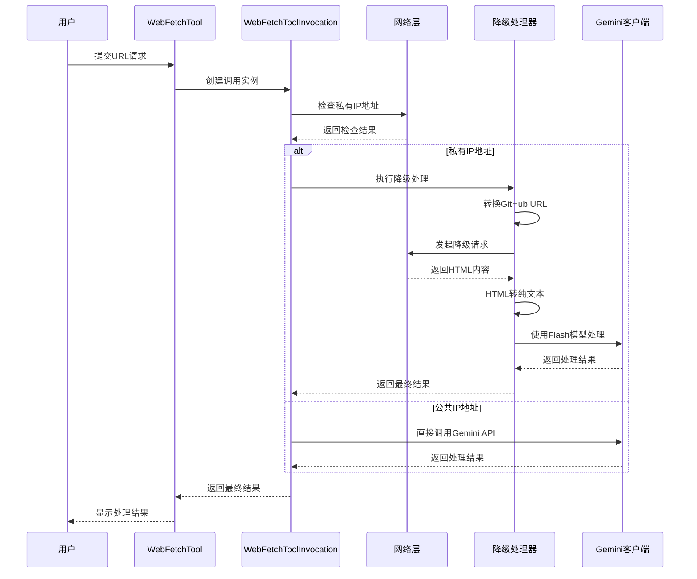
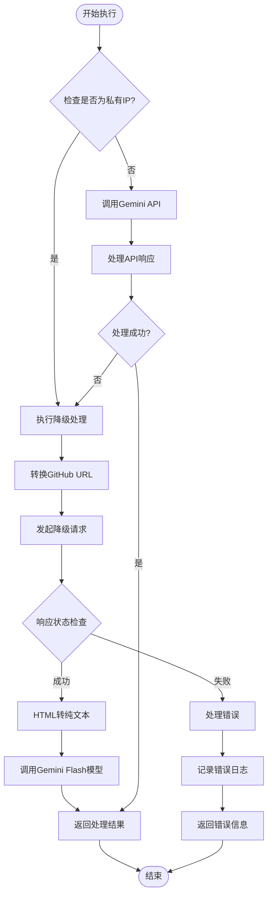
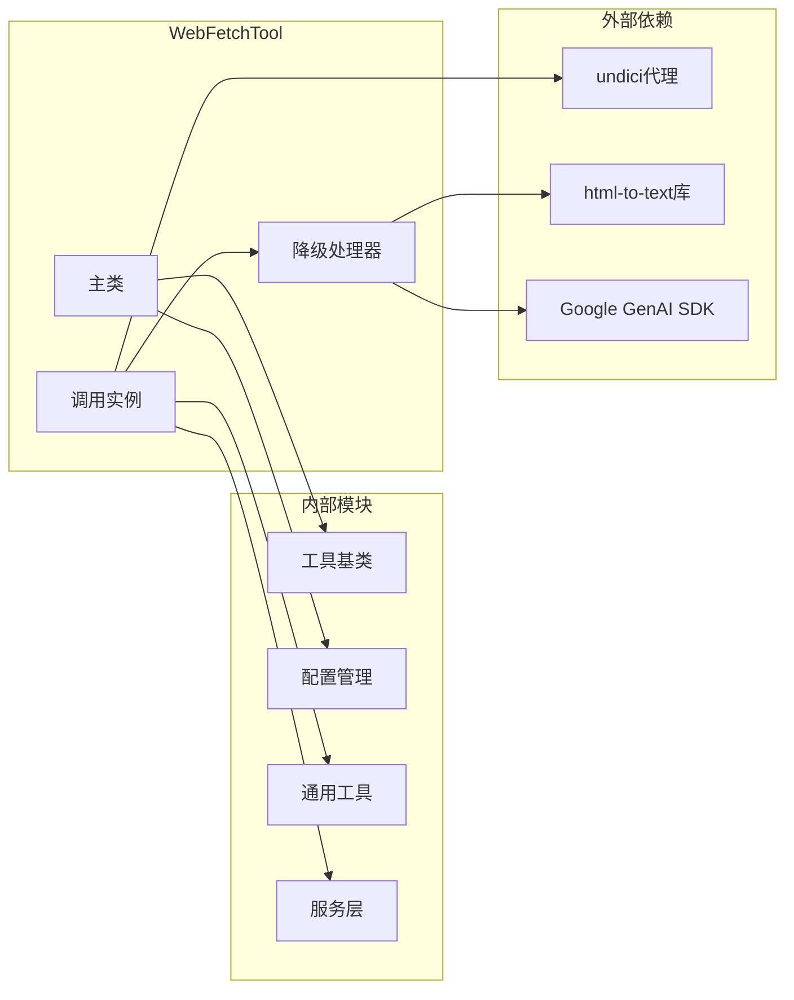

# WebFetchTool降级处理机制详细分析

<cite>
**本文档引用的文件**
- [web-fetch.ts](file://packages/core/src/tools/web-fetch.ts)
- [fetch.ts](file://packages/core/src/utils/fetch.ts)
- [web-fetch.test.ts](file://packages/core/src/tools/web-fetch.test.ts)
- [tools.ts](file://packages/core/src/tools/tools.ts)
- [config.ts](file://packages/core/src/config/config.ts)
- [package.json](file://packages/core/package.json)
</cite>

## 目录
1. [简介](#简介)
2. [项目结构概览](#项目结构概览)
3. [核心组件分析](#核心组件分析)
4. [架构概览](#架构概览)
5. [详细组件分析](#详细组件分析)
6. [依赖关系分析](#依赖关系分析)
7. [性能考虑](#性能考虑)
8. [故障排除指南](#故障排除指南)
9. [结论](#结论)

## 简介

WebFetchTool是Google Gemini CLI的核心工具之一，负责从URL提取和处理网页内容。当主请求失败时，该工具实现了完善的降级处理策略，包括私有网络地址检测、GitHub Blob URL自动转换、超时控制以及备用抓取逻辑。本文档深入分析了这些降级机制的实现原理和工作机制。

## 项目结构概览

WebFetchTool位于gemini-cli项目的工具模块中，采用分层架构设计：



**图表来源**
- [web-fetch.ts](file://packages/core/src/tools/web-fetch.ts#L51-L103)
- [fetch.ts](file://packages/core/src/utils/fetch.ts#L0-L57)

**章节来源**
- [web-fetch.ts](file://packages/core/src/tools/web-fetch.ts#L1-L370)
- [fetch.ts](file://packages/core/src/utils/fetch.ts#L1-L58)

## 核心组件分析

### WebFetchTool类

WebFetchTool是工具的声明性实现，定义了工具的基本属性和验证逻辑：

```typescript
export class WebFetchTool extends BaseDeclarativeTool<WebFetchToolParams, ToolResult> {
  static readonly Name: string = 'web_fetch';
  
  constructor(private readonly config: Config) {
    super(
      WebFetchTool.Name,
      'WebFetch',
      "Processes content from URL(s), including local and private network addresses...",
      Kind.Fetch,
      {
        properties: {
          prompt: {
            description: 'A comprehensive prompt that includes the URL(s)...',
            type: 'string',
          },
        },
        required: ['prompt'],
        type: 'object',
      },
    );
  }
}
```

### WebFetchToolInvocation类

这是实际执行逻辑的核心类，包含了主要的降级处理逻辑：

```typescript
class WebFetchToolInvocation extends BaseToolInvocation<WebFetchToolParams, ToolResult> {
  constructor(private readonly config: Config, params: WebFetchToolParams) {
    super(params);
  }
}
```

**章节来源**
- [web-fetch.ts](file://packages/core/src/tools/web-fetch.ts#L324-L368)
- [web-fetch.ts](file://packages/core/src/tools/web-fetch.ts#L51-L103)

## 架构概览

WebFetchTool的架构采用了多层防御策略，确保在各种网络环境下都能提供可靠的网页内容获取能力：



**图表来源**
- [web-fetch.ts](file://packages/core/src/tools/web-fetch.ts#L185-L218)
- [web-fetch.ts](file://packages/core/src/tools/web-fetch.ts#L67-L103)

## 详细组件分析

### 私有IP地址检测机制

WebFetchTool通过`isPrivateIp`函数检测目标URL是否指向私有网络地址：

```typescript
const PRIVATE_IP_RANGES = [
  /^10\./,
  /^127\./,
  /^172\.(1[6-9]|2[0-9]|3[0-1])\./,
  /^192\.168\./,
  /^::1$/,
  /^fc00:/,
  /^fe80:/,
];

export function isPrivateIp(url: string): boolean {
  try {
    const hostname = new URL(url).hostname;
    return PRIVATE_IP_RANGES.some((range) => range.test(hostname));
  } catch (_e) {
    return false;
  }
}
```

#### 私有IP地址范围详解

1. **IPv4私有地址范围**：
   - `10.x.x.x`：A类私有地址
   - `172.16.x.x`至`172.31.x.x`：B类私有地址
   - `192.168.x.x`：C类私有地址
   - `127.x.x.x`：本地回环地址

2. **IPv6私有地址范围**：
   - `::1`：本地回环地址
   - `fc00::/7`：唯一本地地址（ULA）
   - `fe80::/10`：链路本地地址

这种检测机制确保了系统不会尝试访问内部网络资源，增强了安全性。

### GitHub Blob URL自动转换机制

当检测到GitHub Blob URL时，系统会自动将其转换为Raw URL格式：

```typescript
// 转换GitHub blob URL到raw URL
if (url.includes('github.com') && url.includes('/blob/')) {
  url = url
    .replace('github.com', 'raw.githubusercontent.com')
    .replace('/blob/', '/');
}
```

#### 转换规则详解

- **源URL格式**：`https://github.com/owner/repo/blob/branch/path/file`
- **目标URL格式**：`https://raw.githubusercontent.com/owner/repo/branch/path/file`

这种转换确保了可以直接获取文件的原始内容，而不是HTML页面。

### fetchWithTimeout工具的超时控制机制

```typescript
export async function fetchWithTimeout(url: string, timeout: number): Promise<Response> {
  const controller = new AbortController();
  const timeoutId = setTimeout(() => controller.abort(), timeout);

  try {
    const response = await fetch(url, { signal: controller.signal });
    return response;
  } catch (error) {
    if (isNodeError(error) && error.code === 'ABORT_ERR') {
      throw new FetchError(`Request timed out after ${timeout}ms`, 'ETIMEDOUT');
    }
    throw new FetchError(getErrorMessage(error));
  } finally {
    clearTimeout(timeoutId);
  }
}
```

#### 超时控制特性

1. **AbortController集成**：使用现代浏览器API确保优雅的超时处理
2. **错误类型化**：区分超时和其他网络错误
3. **资源清理**：确保定时器被正确清除
4. **可配置超时**：默认10秒超时时间

### HTML到纯文本转换配置

```typescript
const textContent = convert(html, {
  wordwrap: false,
  selectors: [
    { selector: 'a', options: { ignoreHref: true } },
    { selector: 'img', format: 'skip' },
  ],
}).substring(0, MAX_CONTENT_LENGTH);
```

#### 配置选项详解

1. **wordwrap: false**：禁用单词换行，保持原始段落结构
2. **selectors配置**：
   - 移除链接的URL显示（仅保留文本）
   - 跳过图片内容处理
3. **MAX_CONTENT_LENGTH限制**：防止处理过大的内容

### 降级请求的提示词构造

```typescript
const fallbackPrompt = `The user requested the following: "${this.params.prompt}".

I was unable to access the URL directly. Instead, I have fetched the raw content of the page. Please use the following content to answer the request. Do not attempt to access the URL again.

---
${textContent}
---
`;
```

#### 提示词设计原则

1. **明确告知降级原因**：说明无法直接访问URL
2. **提供完整上下文**：包含用户原始请求
3. **指示避免重复操作**：提醒不要再次尝试访问
4. **结构化内容展示**：使用清晰的分隔符

### 错误处理路径分析



**图表来源**
- [web-fetch.ts](file://packages/core/src/tools/web-fetch.ts#L185-L218)
- [web-fetch.ts](file://packages/core/src/tools/web-fetch.ts#L67-L103)

**章节来源**
- [fetch.ts](file://packages/core/src/utils/fetch.ts#L20-L57)
- [web-fetch.ts](file://packages/core/src/tools/web-fetch.ts#L67-L103)

## 依赖关系分析

WebFetchTool的依赖关系体现了清晰的分层架构：



**图表来源**
- [web-fetch.ts](file://packages/core/src/tools/web-fetch.ts#L1-L30)
- [package.json](file://packages/core/package.json#L25-L50)

### 关键依赖说明

1. **undici**：提供HTTP代理支持和连接池管理
2. **html-to-text**：专业的HTML内容提取和转换
3. **@google/genai**：Google AI服务客户端
4. **@types/html-to-text**：类型定义支持

**章节来源**
- [package.json](file://packages/core/package.json#L25-L50)
- [web-fetch.ts](file://packages/core/src/tools/web-fetch.ts#L1-L30)

## 性能考虑

### 超时设置优化

- **默认超时时间**：10秒，平衡响应速度和可靠性
- **资源清理**：确保超时后及时释放资源
- **可配置性**：允许根据网络环境调整超时值

### 内容长度限制

- **最大内容长度**：100KB，防止内存溢出
- **截断策略**：使用`substring`进行安全截断
- **性能影响**：减少不必要的大文件处理

### 并发控制

- **单URL处理**：目前只支持一个URL的降级处理
- **异步执行**：使用Promise确保非阻塞操作
- **信号传递**：支持取消操作，提高交互性

## 故障排除指南

### 常见错误类型

1. **WEB_FETCH_NO_URL_IN_PROMPT**
   - **原因**：提示词中缺少有效的URL
   - **解决方案**：确保提示词包含至少一个以http://或https://开头的有效URL

2. **WEB_FETCH_FALLBACK_FAILED**
   - **原因**：降级请求失败
   - **可能原因**：
     - 目标URL不可访问
     - 网络连接问题
     - GitHub URL格式错误
   - **解决方案**：检查URL有效性，验证网络连接

3. **WEB_FETCH_PROCESSING_ERROR**
   - **原因**：主流程处理失败
   - **可能原因**：
     - Gemini API调用失败
     - URL元数据检索失败
     - 内容解析错误
   - **解决方案**：查看详细错误日志，检查API密钥和配额

### 调试技巧

1. **启用调试模式**：设置`debugMode: true`
2. **检查网络连接**：验证防火墙和代理设置
3. **验证URL格式**：确保URL符合标准格式
4. **监控超时**：注意网络延迟对超时的影响

**章节来源**
- [web-fetch.test.ts](file://packages/core/src/tools/web-fetch.test.ts#L41-L61)
- [web-fetch.ts](file://packages/core/src/tools/web-fetch.ts#L340-L368)

## 结论

WebFetchTool的降级处理机制展现了现代软件工程的最佳实践：

1. **多层次防护**：从私有IP检测到超时控制，形成完整的安全防护链
2. **智能转换**：自动识别和转换GitHub Blob URL，提升用户体验
3. **优雅降级**：在主服务不可用时提供可靠的备用方案
4. **错误处理**：完善的错误捕获和反馈机制
5. **性能优化**：合理的超时设置和内容长度限制

这种设计不仅保证了系统的可靠性，也为用户提供了无缝的使用体验。通过深入理解这些机制，开发者可以更好地维护和扩展系统功能。