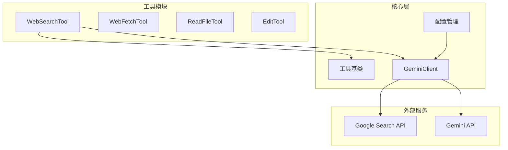
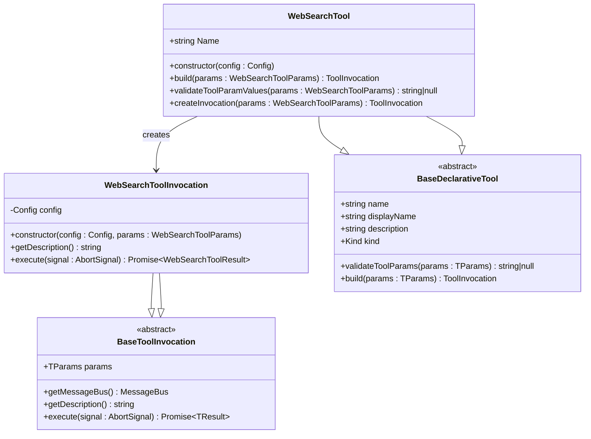
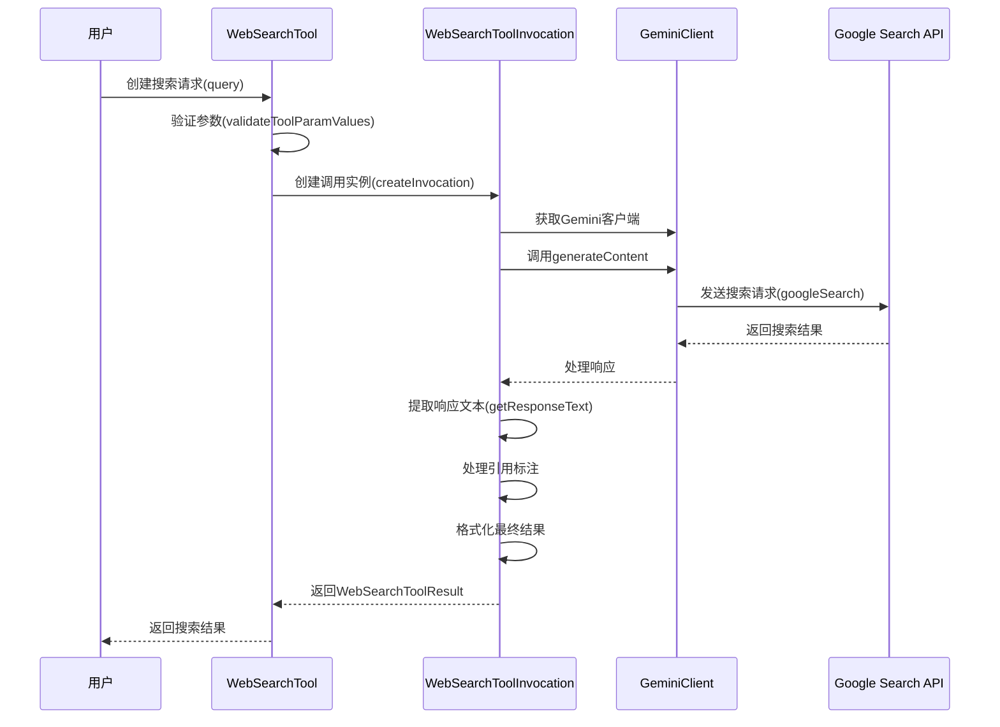
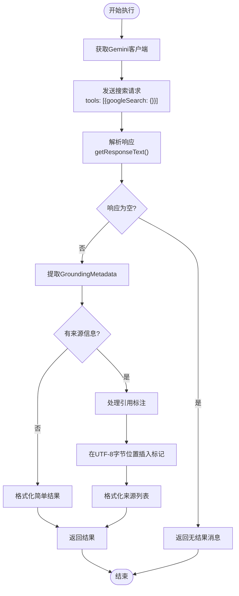
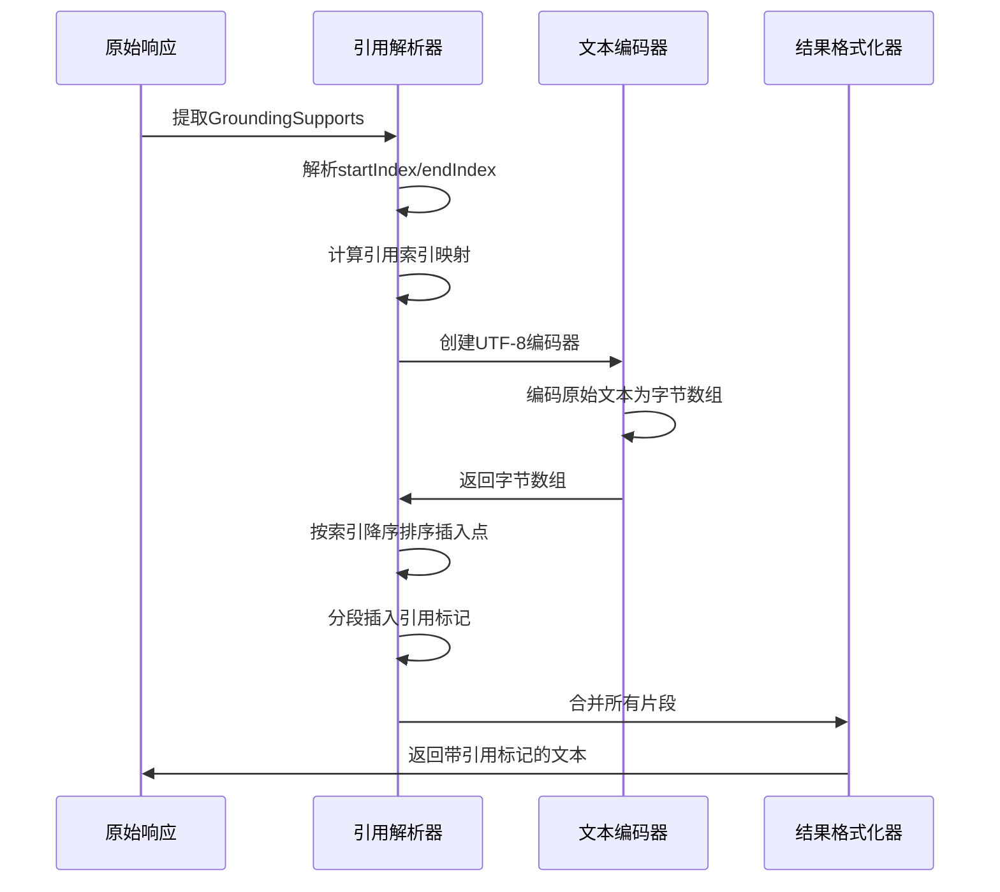
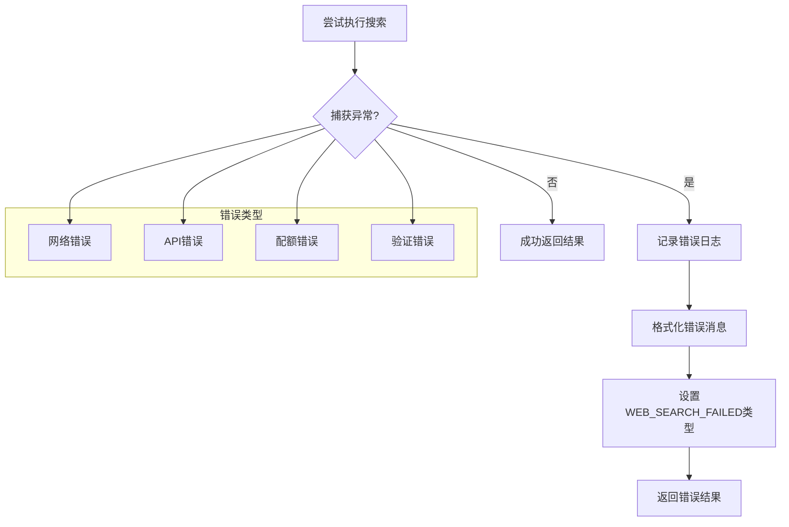
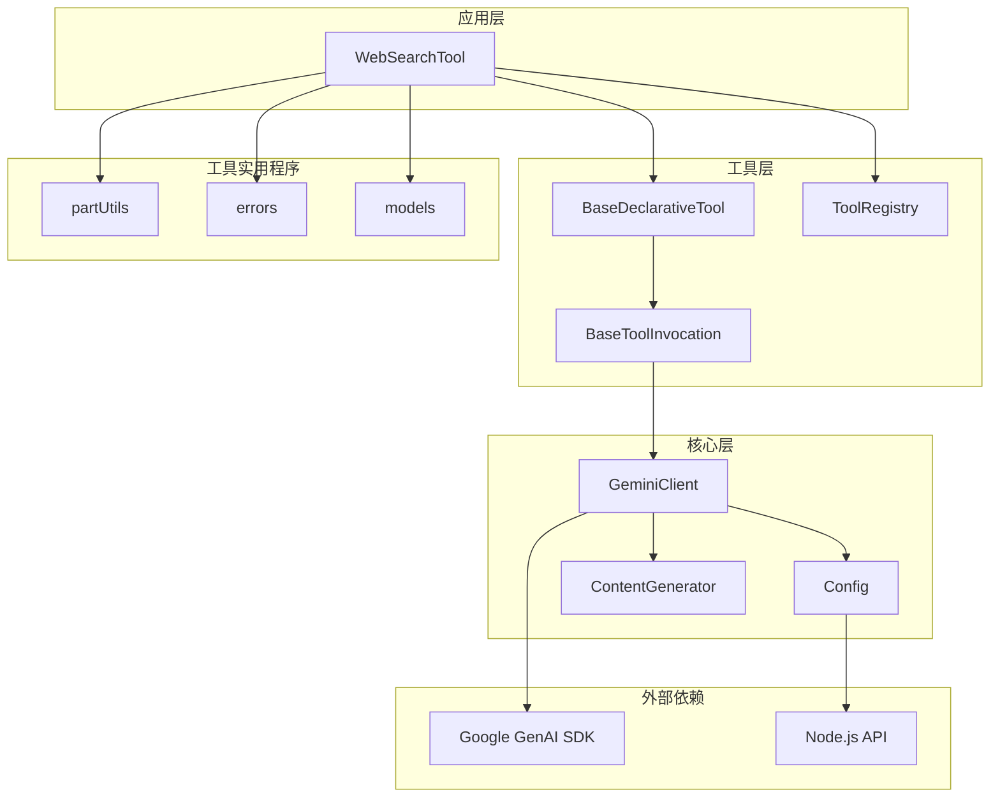

# Web Search API集成

<cite>
**本文档中引用的文件**
- [web-search.ts](file://packages/core/src/tools/web-search.ts)
- [web-search.test.ts](file://packages/core/src/tools/web-search.test.ts)
- [tools.ts](file://packages/core/src/tools/tools.ts)
- [models.ts](file://packages/core/src/config/models.ts)
- [partUtils.ts](file://packages/core/src/utils/partUtils.ts)
- [tool-error.ts](file://packages/core/src/tools/tool-error.ts)
- [config.ts](file://packages/core/src/config/config.ts)
- [client.ts](file://packages/core/src/core/client.ts)
- [web-fetch.ts](file://packages/core/src/tools/web-fetch.ts)
</cite>

## 目录
1. [简介](#简介)
2. [项目结构](#项目结构)
3. [核心组件](#核心组件)
4. [架构概览](#架构概览)
5. [详细组件分析](#详细组件分析)
6. [依赖关系分析](#依赖关系分析)
7. [性能考量](#性能考量)
8. [故障排除指南](#故障排除指南)
9. [结论](#结论)

## 简介

WebSearchTool是Gemini CLI中用于通过Google Web Search API进行网络搜索的核心工具。该工具允许用户通过Gemini AI模型执行实时网络搜索，获取最新的信息并将其整合到AI对话中。WebSearchTool集成了Google Search功能，提供了强大的信息检索能力，支持引用标注、来源展示和多语言文本处理。

该工具的设计遵循了现代软件架构的最佳实践，采用了声明式工具模式、异步执行机制和完善的错误处理策略。通过与Gemini API的深度集成，WebSearchTool能够提供高质量的搜索结果，并自动处理复杂的文本编码和引用插入逻辑。

## 项目结构

WebSearchTool位于Gemini CLI项目的工具模块中，与其他工具共享相同的架构模式：



**图表来源**
- [web-search.ts](file://packages/core/src/tools/web-search.ts#L1-L228)
- [tools.ts](file://packages/core/src/tools/tools.ts#L1-L674)

**章节来源**
- [web-search.ts](file://packages/core/src/tools/web-search.ts#L1-L228)
- [tools.ts](file://packages/core/src/tools/tools.ts#L1-L674)

## 核心组件

### WebSearchToolParams接口

WebSearchTool的参数接口定义了搜索查询的基本要求：

```typescript
export interface WebSearchToolParams {
  /**
   * The search query.
   */
  query: string;
}
```

这个简洁的接口确保了搜索操作的简单性和一致性。查询参数必须是非空字符串，这是通过验证器强制执行的。

### WebSearchToolResult扩展

WebSearchToolResult扩展了标准的ToolResult接口，增加了对搜索来源的支持：

```typescript
export interface WebSearchToolResult extends ToolResult {
  sources?: GroundingMetadata extends { groundingChunks: GroundingChunkItem[] }
    ? GroundingMetadata['groundingChunks']
    : GroundingChunkItem[];
}
```

这种设计允许工具返回结构化的搜索结果，包括引用信息和来源元数据。

**章节来源**
- [web-search.ts](file://packages/core/src/tools/web-search.ts#L35-L50)
- [web-search.ts](file://packages/core/src/tools/web-search.ts#L52-L57)

## 架构概览

WebSearchTool采用分层架构设计，确保了代码的可维护性和扩展性：



**图表来源**
- [web-search.ts](file://packages/core/src/tools/web-search.ts#L170-L228)
- [tools.ts](file://packages/core/src/tools/tools.ts#L200-L250)

## 详细组件分析

### WebSearchTool类分析

WebSearchTool是整个搜索功能的核心类，继承自BaseDeclarativeTool：



**图表来源**
- [web-search.ts](file://packages/core/src/tools/web-search.ts#L67-L157)
- [client.ts](file://packages/core/src/core/client.ts#L600-L650)

#### 参数验证机制

WebSearchTool实现了严格的参数验证：

```typescript
protected override validateToolParamValues(
  params: WebSearchToolParams,
): string | null {
  if (!params.query || params.query.trim() === '') {
    return "The 'query' parameter cannot be empty.";
  }
  return null;
}
```

这个验证器确保了搜索查询的有效性，防止空查询导致的API错误。

#### 执行流程详解

WebSearchToolInvocation的execute方法是搜索功能的核心：



**图表来源**
- [web-search.ts](file://packages/core/src/tools/web-search.ts#L75-L157)

**章节来源**
- [web-search.ts](file://packages/core/src/tools/web-search.ts#L170-L228)
- [web-search.ts](file://packages/core/src/tools/web-search.ts#L67-L157)

### 引用标注和来源处理

WebSearchTool最复杂的功能之一是处理引用标注，这涉及到UTF-8字节索引的精确计算：

#### 引用标注算法



**图表来源**
- [web-search.ts](file://packages/core/src/tools/web-search.ts#L105-L140)

#### UTF-8字节索引处理

WebSearchTool使用专门的算法来处理多字节字符的引用插入：

```typescript
// 使用TextEncoder/TextDecoder因为段索引是UTF-8字节位置
const encoder = new TextEncoder();
const responseBytes = encoder.encode(modifiedResponseText);
const parts: Uint8Array[] = [];
let lastIndex = responseBytes.length;

// 按索引降序排序以避免后续索引偏移
insertions.sort((a, b) => b.index - a.index);

for (const ins of insertions) {
  const pos = Math.min(ins.index, lastIndex);
  parts.unshift(responseBytes.subarray(pos, lastIndex));
  parts.unshift(encoder.encode(ins.marker));
  lastIndex = pos;
}

// 将所有部分连接成单个缓冲区
const totalLength = parts.reduce((sum, part) => sum + part.length, 0);
const finalBytes = new Uint8Array(totalLength);
let offset = 0;
for (const part of parts) {
  finalBytes.set(part, offset);
  offset += part.length;
}

modifiedResponseText = new TextDecoder().decode(finalBytes);
```

这种精确的字节索引处理确保了多语言文本（如日文、韩文等）的正确引用插入。

**章节来源**
- [web-search.ts](file://packages/core/src/tools/web-search.ts#L105-L140)

### 错误处理策略

WebSearchTool实现了全面的错误处理机制：



**图表来源**
- [web-search.ts](file://packages/core/src/tools/web-search.ts#L157-L175)

#### 错误类型枚举

WebSearchTool使用专门的错误类型来标识不同类型的失败：

```typescript
export enum ToolErrorType {
  // WebSearch-specific Errors
  WEB_SEARCH_FAILED = 'web_search_failed',
}
```

这些错误类型帮助系统级联处理不同的错误情况，并提供适当的用户反馈。

**章节来源**
- [web-search.ts](file://packages/core/src/tools/web-search.ts#L157-L175)
- [tool-error.ts](file://packages/core/src/tools/tool-error.ts#L60-L70)

## 依赖关系分析

WebSearchTool的依赖关系体现了清晰的分层架构：



**图表来源**
- [web-search.ts](file://packages/core/src/tools/web-search.ts#L1-L15)
- [client.ts](file://packages/core/src/core/client.ts#L1-L30)

**章节来源**
- [web-search.ts](file://packages/core/src/tools/web-search.ts#L1-L15)
- [tools.ts](file://packages/core/src/tools/tools.ts#L1-L50)

## 性能考量

### 模型选择优化

WebSearchTool默认使用`gemini-2.5-flash`模型，这是经过优化的选择：

```typescript
import { DEFAULT_GEMINI_FLASH_MODEL } from '../config/models.js';

// 在execute方法中使用
const response = await geminiClient.generateContent(
  [{ role: 'user', parts: [{ text: this.params.query }] }],
  { tools: [{ googleSearch: {} }] },
  signal,
  DEFAULT_GEMINI_FLASH_MODEL,
);
```

这种模型选择平衡了速度和成本，特别适合需要快速响应的搜索场景。

### 取消信号支持

WebSearchTool完全支持AbortSignal，允许长时间运行的搜索被取消：

```typescript
async execute(signal: AbortSignal): Promise<WebSearchToolResult> {
  // 搜索逻辑...
  
  const response = await geminiClient.generateContent(
    // ...
    signal, // 传递取消信号
    DEFAULT_GEMINI_FLASH_MODEL,
  );
  
  // 如果信号已中止，抛出错误
  if (signal.aborted) {
    throw new Error('Search cancelled by user');
  }
}
```

### 内存效率

WebSearchTool通过以下方式优化内存使用：

1. **流式处理**：只在必要时加载完整的响应
2. **及时清理**：使用TextEncoder/TextDecoder进行高效的字节操作
3. **最小化缓存**：不缓存搜索结果，保持实时性

## 故障排除指南

### 常见问题及解决方案

#### 1. 空查询错误

**症状**：工具抛出"query不能为空"错误
**原因**：传入了空字符串或仅包含空白字符的查询
**解决方案**：
```typescript
// 正确的查询
const params = { query: '人工智能最新发展' };

// 错误的查询
const params = { query: '' }; // 或 { query: '   ' }
```

#### 2. API配额超限

**症状**：返回配额错误或429状态码
**原因**：超出Google Search API的配额限制
**解决方案**：
- 检查Google Cloud项目配额设置
- 实现重试机制
- 考虑升级API配额

#### 3. 多语言文本处理问题

**症状**：多字节字符的引用插入位置错误
**原因**：未正确处理UTF-8字节索引
**解决方案**：WebSearchTool已经内置了正确的UTF-8处理逻辑，无需额外配置

**章节来源**
- [web-search.ts](file://packages/core/src/tools/web-search.ts#L180-L200)
- [web-search.test.ts](file://packages/core/src/tools/web-search.test.ts#L44-L55)

### 调试技巧

#### 启用调试模式

```typescript
const config = new Config({
  debugMode: true,
  // 其他配置...
});
```

启用调试模式后，工具会输出详细的执行日志，包括：
- 请求参数
- API响应
- 引用插入过程
- 错误堆栈跟踪

#### 测试用例参考

以下是几个典型的测试用例：

```typescript
// 基本搜索测试
const basicSearch = { query: 'JavaScript教程' };

// 多语言搜索测试
const multilingualSearch = { query: 'こんにちは! 日本語の情報' };

// 复杂引用测试
const complexSearch = { query: '机器学习算法比较' };

// 错误处理测试
const emptyQuery = { query: '' };
```

**章节来源**
- [web-search.test.ts](file://packages/core/src/tools/web-search.test.ts#L25-L100)

## 结论

WebSearchTool是一个设计精良、功能完备的网络搜索工具，它成功地将Google Web Search API与Gemini AI平台集成在一起。通过其优雅的架构设计、完善的错误处理机制和先进的引用标注技术，WebSearchTool为用户提供了一个强大而可靠的搜索解决方案。

### 主要优势

1. **简洁的API设计**：通过简单的参数接口提供强大的搜索功能
2. **精确的引用处理**：支持多语言文本的准确引用标注
3. **完善的错误处理**：提供详细的错误信息和恢复机制
4. **高性能执行**：使用优化的模型和取消信号支持
5. **可扩展架构**：遵循现代软件架构原则，易于维护和扩展

### 未来改进方向

1. **搜索结果缓存**：实现智能缓存机制以提高性能
2. **高级过滤选项**：添加时间范围、语言和地区过滤
3. **结果质量评估**：集成内容质量评分机制
4. **批量搜索支持**：允许多个查询同时执行
5. **更丰富的可视化**：提供搜索结果的图表展示

WebSearchTool代表了现代AI工具集成的最佳实践，其设计理念和实现方式值得其他类似项目借鉴和学习。