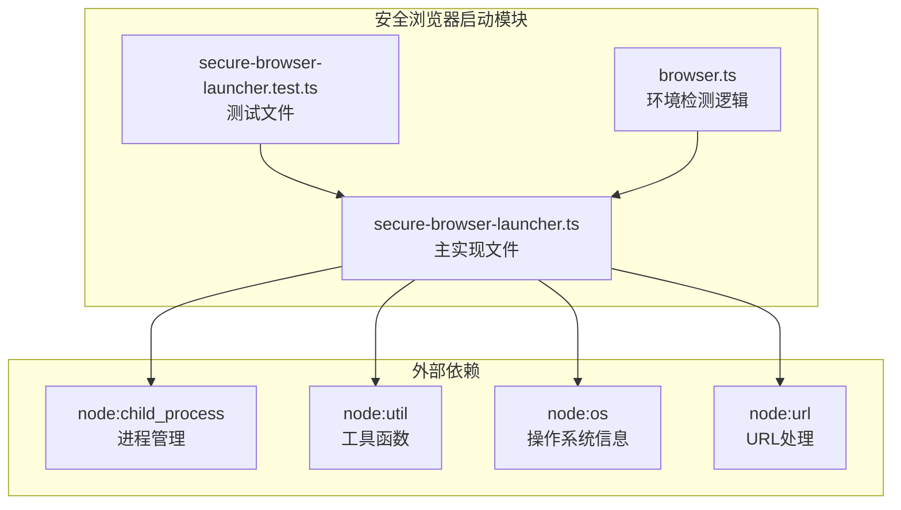
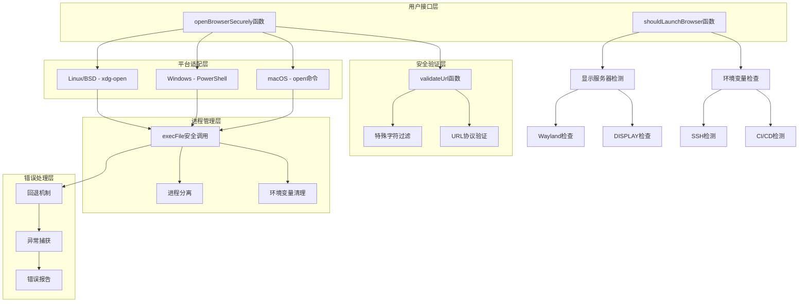
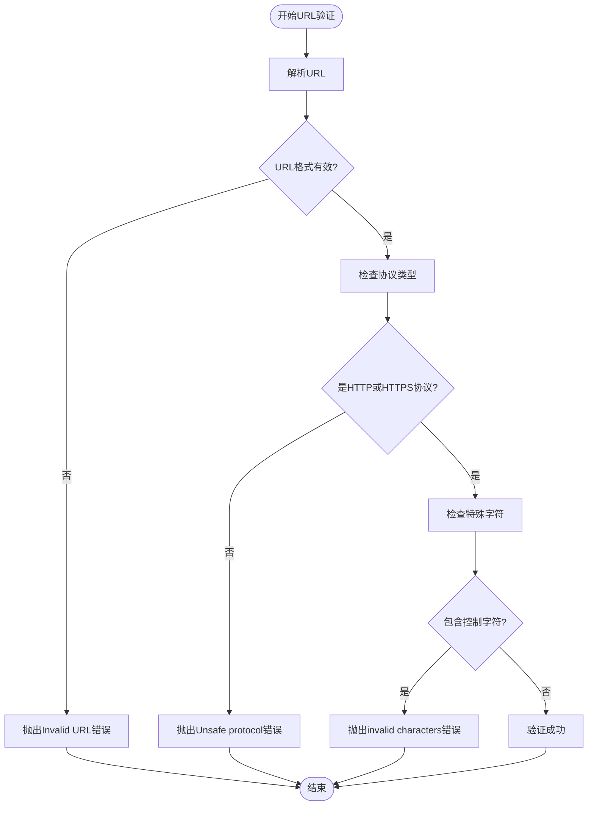
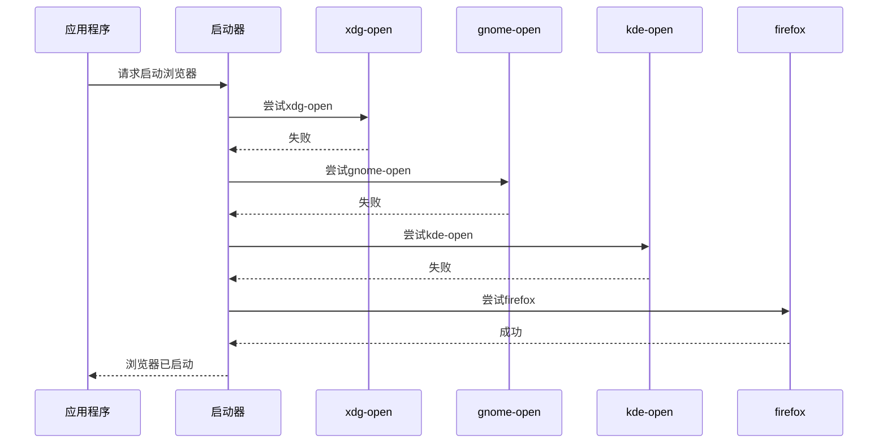
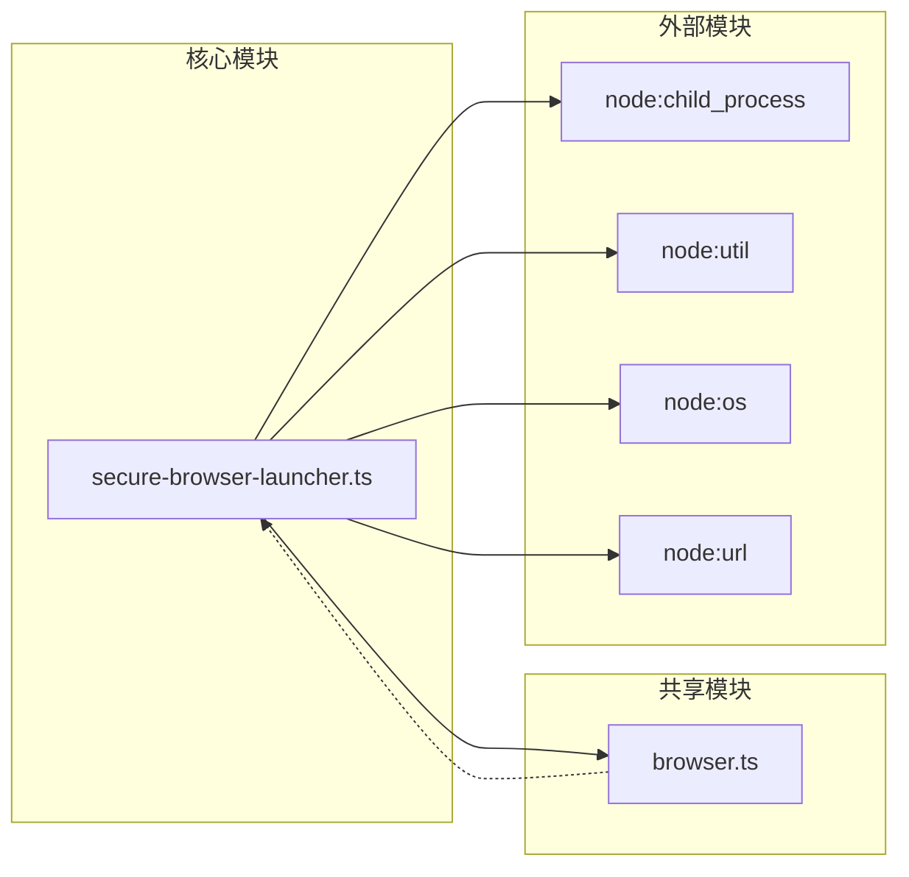

# 安全浏览器启动模块

<cite>
**本文档中引用的文件**
- [secure-browser-launcher.ts](file://packages/core/src/utils/secure-browser-launcher.ts)
- [secure-browser-launcher.test.ts](file://packages/core/src/utils/secure-browser-launcher.test.ts)
- [browser.ts](file://packages/core/src/utils/browser.ts)
</cite>

## 目录
1. [简介](#简介)
2. [项目结构](#项目结构)
3. [核心组件](#核心组件)
4. [架构概览](#架构概览)
5. [详细组件分析](#详细组件分析)
6. [依赖关系分析](#依赖关系分析)
7. [性能考虑](#性能考虑)
8. [故障排除指南](#故障排除指南)
9. [结论](#结论)

## 简介

安全浏览器启动模块是一个专门设计用于在不同操作系统上安全启动默认浏览器的功能模块。该模块通过严格的URL验证、平台特定的启动策略以及智能的环境检测机制，确保在各种环境中都能安全可靠地打开浏览器，同时有效防止命令注入攻击。

该模块的核心目标是：
- 提供跨平台的浏览器启动功能
- 实现严格的URL安全验证
- 防止Shell注入和命令注入攻击
- 智能检测运行环境以决定是否启动浏览器
- 支持多种Linux发行版和BSD系统

## 项目结构

安全浏览器启动模块位于`packages/core/src/utils/`目录下，包含以下关键文件：



**图表来源**
- [secure-browser-launcher.ts](file://packages/core/src/utils/secure-browser-launcher.ts#L1-L10)
- [browser.ts](file://packages/core/src/utils/browser.ts#L1-L10)

**章节来源**
- [secure-browser-launcher.ts](file://packages/core/src/utils/secure-browser-launcher.ts#L1-L192)
- [browser.ts](file://packages/core/src/utils/browser.ts#L1-L57)

## 核心组件

### URL验证器 (validateUrl)

URL验证器是整个安全机制的第一道防线，负责严格检查传入的URL是否安全。

```typescript
function validateUrl(url: string): void {
  let parsedUrl: URL;
  
  try {
    parsedUrl = new URL(url);
  } catch (_error) {
    throw new Error(`Invalid URL: ${url}`);
  }
  
  // 只允许HTTP和HTTPS协议
  if (parsedUrl.protocol !== 'http:' && parsedUrl.protocol !== 'https:') {
    throw new Error(
      `Unsafe protocol: ${parsedUrl.protocol}. Only HTTP and HTTPS are allowed.`,
    );
  }
  
  // 额外验证：确保没有换行符或控制字符
  if (/[\r\n\x00-\x1f]/.test(url)) {
    throw new Error('URL contains invalid characters');
  }
}
```

### 安全浏览器启动器 (openBrowserSecurely)

这是模块的核心函数，实现了跨平台的浏览器启动功能，采用了多层安全保护机制。

```typescript
export async function openBrowserSecurely(url: string): Promise<void> {
  // 第一步：验证URL安全性
  validateUrl(url);
  
  const platformName = platform();
  let command: string;
  let args: string[];
  
  // 平台特定的命令选择
  switch (platformName) {
    case 'darwin': // macOS
      command = 'open';
      args = [url];
      break;
      
    case 'win32': // Windows
      command = 'powershell.exe';
      args = ['-NoProfile', '-NonInteractive', '-WindowStyle', 'Hidden', 
              '-Command', `Start-Process '${url.replace(/'/g, "''")}'`];
      break;
      
    case 'linux':
    case 'freebsd':
    case 'openbsd': // Linux和BSD变体
      command = 'xdg-open';
      args = [url];
      break;
      
    default:
      throw new Error(`Unsupported platform: ${platformName}`);
  }
  
  // 执行安全的进程启动
  const options = {
    env: { ...process.env, SHELL: undefined },
    detached: true,
    stdio: 'ignore',
  };
  
  try {
    await execFileAsync(command, args, options);
  } catch (error) {
    // Linux的回退机制
    if (platformName === 'linux' && command === 'xdg-open') {
      // 尝试多个备选浏览器
      const fallbackCommands = ['gnome-open', 'kde-open', 'firefox', 
                               'chromium', 'google-chrome'];
      for (const fallbackCommand of fallbackCommands) {
        try {
          await execFileAsync(fallbackCommand, [url], options);
          return; // 成功！
        } catch {
          continue; // 尝试下一个命令
        }
      }
    }
    throw new Error(`Failed to open browser: ${error.message}`);
  }
}
```

### 环境检测器 (shouldLaunchBrowser)

环境检测器负责智能判断当前环境是否应该尝试启动浏览器，避免在不合适的环境中执行浏览器启动操作。

```typescript
export function shouldLaunchBrowser(): boolean {
  // 浏览器黑名单检查
  const browserBlocklist = ['www-browser'];
  const browserEnv = process.env['BROWSER'];
  if (browserEnv && browserBlocklist.includes(browserEnv)) {
    return false;
  }
  
  // CI/CD环境检测
  if (process.env['CI'] || process.env['DEBIAN_FRONTEND'] === 'noninteractive') {
    return false;
  }
  
  // SSH会话检测
  const isSSH = !!process.env['SSH_CONNECTION'];
  
  // Linux环境下的显示服务器检测
  if (platform() === 'linux') {
    const displayVariables = ['DISPLAY', 'WAYLAND_DISPLAY', 'MIR_SOCKET'];
    const hasDisplay = displayVariables.some(v => !!process.env[v]);
    if (!hasDisplay) {
      return false;
    }
  }
  
  // SSH会话但非Linux系统的处理
  if (isSSH && platform() !== 'linux') {
    return false;
  }
  
  return true;
}
```

**章节来源**
- [secure-browser-launcher.ts](file://packages/core/src/utils/secure-browser-launcher.ts#L18-L41)
- [secure-browser-launcher.ts](file://packages/core/src/utils/secure-browser-launcher.ts#L43-L142)
- [secure-browser-launcher.ts](file://packages/core/src/utils/secure-browser-launcher.ts#L143-L190)

## 架构概览

安全浏览器启动模块采用分层架构设计，每一层都承担着特定的安全职责：



**图表来源**
- [secure-browser-launcher.ts](file://packages/core/src/utils/secure-browser-launcher.ts#L43-L142)
- [secure-browser-launcher.ts](file://packages/core/src/utils/secure-browser-launcher.ts#L143-L190)

## 详细组件分析

### URL安全验证机制

#### 协议限制验证



**图表来源**
- [secure-browser-launcher.ts](file://packages/core/src/utils/secure-browser-launcher.ts#L18-L41)

#### 特殊字符防护

模块使用正则表达式来检测和阻止潜在的恶意字符：

```typescript
// 检测控制字符和换行符
if (/[\r\n\x00-\x1f]/.test(url)) {
  throw new Error('URL contains invalid characters');
}
```

这种验证能够有效防止：
- 换行注入（`\n`）
- 回车注入（`\r`）
- 控制字符注入（`\x00-\x1f`范围内的字符）

### 跨平台启动策略

#### macOS平台策略

macOS使用内置的`open`命令，这是最简单且最安全的方式：

```typescript
case 'darwin':
  command = 'open';
  args = [url];
  break;
```

#### Windows平台策略

Windows使用PowerShell的`Start-Process`命令，避免了cmd.exe的Shell注入风险：

```typescript
case 'win32':
  command = 'powershell.exe';
  args = [
    '-NoProfile',
    '-NonInteractive',
    '-WindowStyle',
    'Hidden',
    '-Command',
    `Start-Process '${url.replace(/'/g, "''")}'`,
  ];
  break;
```

特别注意：URL中的单引号被双重转义，防止PowerShell注入攻击。

#### Linux/BSD平台策略

Linux和BSD系统首先尝试`xdg-open`，如果失败则尝试多个备选浏览器：



**图表来源**
- [secure-browser-launcher.ts](file://packages/core/src/utils/secure-browser-launcher.ts#L100-L120)

### 进程安全管理

#### execFile vs exec的安全性对比

模块使用`execFile`而不是`exec`来避免Shell注入：

```typescript
// 安全的做法：直接传递命令和参数
await execFileAsync(command, args, options);

// 不安全的做法：构建命令字符串
// exec(`open "${url}"`, callback); // 存在注入风险
```

#### 环境变量清理

```typescript
const options = {
  env: {
    ...process.env,
    SHELL: undefined, // 防止Shell注入
  },
  detached: true,     // 分离进程
  stdio: 'ignore',    // 忽略标准输入输出
};
```

### 环境检测机制

#### CI/CD环境识别

```typescript
// 常见的CI/CD环境变量
if (process.env['CI'] || process.env['DEBIAN_FRONTEND'] === 'noninteractive') {
  return false;
}
```

#### SSH会话检测

```typescript
// SSH连接检测
const isSSH = !!process.env['SSH_CONNECTION'];

// 在非Linux系统上，SSH会话通常意味着没有图形界面
if (isSSH && platform() !== 'linux') {
  return false;
}
```

#### 显示服务器检测

```typescript
// Linux环境下检测图形界面
if (platform() === 'linux') {
  const displayVariables = ['DISPLAY', 'WAYLAND_DISPLAY', 'MIR_SOCKET'];
  const hasDisplay = displayVariables.some(v => !!process.env[v]);
  if (!hasDisplay) {
    return false;
  }
}
```

**章节来源**
- [secure-browser-launcher.ts](file://packages/core/src/utils/secure-browser-launcher.ts#L43-L142)
- [secure-browser-launcher.ts](file://packages/core/src/utils/secure-browser-launcher.ts#L143-L190)

## 依赖关系分析

### 内部依赖关系



**图表来源**
- [secure-browser-launcher.ts](file://packages/core/src/utils/secure-browser-launcher.ts#L1-L10)
- [browser.ts](file://packages/core/src/utils/browser.ts#L1-L10)

### 外部依赖分析

#### node:child_process
- **用途**: 执行系统命令
- **安全考虑**: 使用`execFile`而非`exec`避免Shell注入
- **关键方法**: `execFileAsync`

#### node:util
- **用途**: 将回调函数转换为Promise
- **关键方法**: `promisify`

#### node:os
- **用途**: 获取操作系统信息
- **关键属性**: `platform()`

#### node:url
- **用途**: 解析和验证URL
- **关键类**: `URL`

**章节来源**
- [secure-browser-launcher.ts](file://packages/core/src/utils/secure-browser-launcher.ts#L1-L10)

## 性能考虑

### 异步操作优化

模块完全采用异步操作模式，不会阻塞主线程：

```typescript
export async function openBrowserSecurely(url: string): Promise<void> {
  // 异步URL验证
  validateUrl(url);
  
  // 异步进程启动
  await execFileAsync(command, args, options);
}
```

### 进程分离策略

```typescript
const options = {
  detached: true,  // 分离进程，避免阻塞
  stdio: 'ignore', // 忽略I/O流，减少内存占用
};
```

### 回退机制效率

Linux平台的回退机制采用快速失败策略：

```typescript
for (const fallbackCommand of fallbackCommands) {
  try {
    await execFileAsync(fallbackCommand, [url], options);
    return; // 成功即返回，不再尝试后续命令
  } catch {
    continue; // 继续尝试下一个备选方案
  }
}
```

## 故障排除指南

### 常见问题及解决方案

#### 1. URL验证失败

**症状**: 抛出"Invalid URL"或"Unsafe protocol"错误

**原因**: 
- URL格式不正确
- 使用了非HTTP/HTTPS协议
- 包含非法字符

**解决方案**:
```typescript
// 正确的URL格式
const validUrls = [
  'http://example.com',
  'https://secure.example.com/path?query=param',
  'https://subdomain.example.com:8443'
];

// 错误的URL示例
const invalidUrls = [
  'file:///etc/passwd',           // 非HTTP/HTTPS协议
  'javascript:alert("XSS")',      // JavaScript协议
  'http://example.com\nmalicious', // 包含换行符
  'http://example.com\x00'        // 包含控制字符
];
```

#### 2. 平台不支持错误

**症状**: 抛出"Unsupported platform"错误

**原因**: 当前操作系统不在支持列表中

**解决方案**: 
- 检查操作系统版本
- 考虑手动添加支持
- 使用通用的Web API替代

#### 3. 浏览器启动失败

**症状**: 抛出"Failed to open browser"错误

**原因**: 
- 默认浏览器未设置
- 浏览器安装损坏
- 权限不足

**解决方案**:
```typescript
// 检查环境是否适合启动浏览器
if (shouldLaunchBrowser()) {
  try {
    await openBrowserSecurely(url);
  } catch (error) {
    console.warn('浏览器启动失败:', error.message);
    // 提供手动访问链接的提示
    console.log(`请手动访问: ${url}`);
  }
} else {
  console.log('当前环境不适合自动启动浏览器');
  console.log(`请手动访问: ${url}`);
}
```

#### 4. SSH环境问题

**症状**: 在SSH会话中无法启动浏览器

**原因**: 缺少图形界面支持

**解决方案**:
```bash
# 在本地机器上转发X11
ssh -X user@remote-host

# 或者使用端口转发
ssh -L 5901:localhost:5901 user@remote-host

# 或者直接在远程机器上启动
ssh user@remote-host 'firefox https://example.com'
```

**章节来源**
- [secure-browser-launcher.test.ts](file://packages/core/src/utils/secure-browser-launcher.test.ts#L35-L91)
- [secure-browser-launcher.ts](file://packages/core/src/utils/secure-browser-launcher.ts#L100-L142)

## 结论

安全浏览器启动模块是一个精心设计的安全组件，它通过多层安全机制确保在各种环境中都能安全可靠地启动浏览器。该模块的主要优势包括：

### 安全特性
- **严格的URL验证**: 防止所有类型的命令注入攻击
- **平台特定的安全策略**: 针对不同操作系统采用最优的安全实践
- **进程安全管理**: 使用execFile避免Shell注入
- **环境智能检测**: 自动判断是否应该启动浏览器

### 功能特性
- **跨平台支持**: 完整支持macOS、Windows、Linux和BSD系统
- **智能回退机制**: 在首选浏览器失败时自动尝试备选方案
- **异步操作**: 不阻塞主线程，提供良好的用户体验
- **错误处理**: 完善的错误捕获和回退策略

### 最佳实践
- **防御性编程**: 在每个环节都进行安全检查
- **最小权限原则**: 只请求必要的系统权限
- **渐进式增强**: 优先使用高级功能，降级到基本功能
- **可测试性**: 完整的单元测试覆盖所有安全场景

该模块为开发者提供了一个安全、可靠、跨平台的浏览器启动解决方案，是构建安全应用程序的重要基础设施组件。