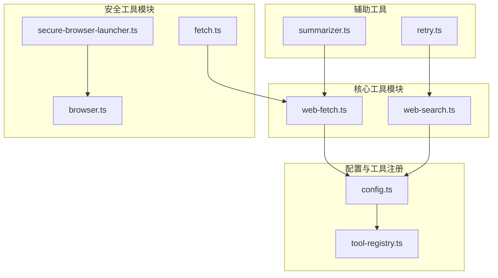
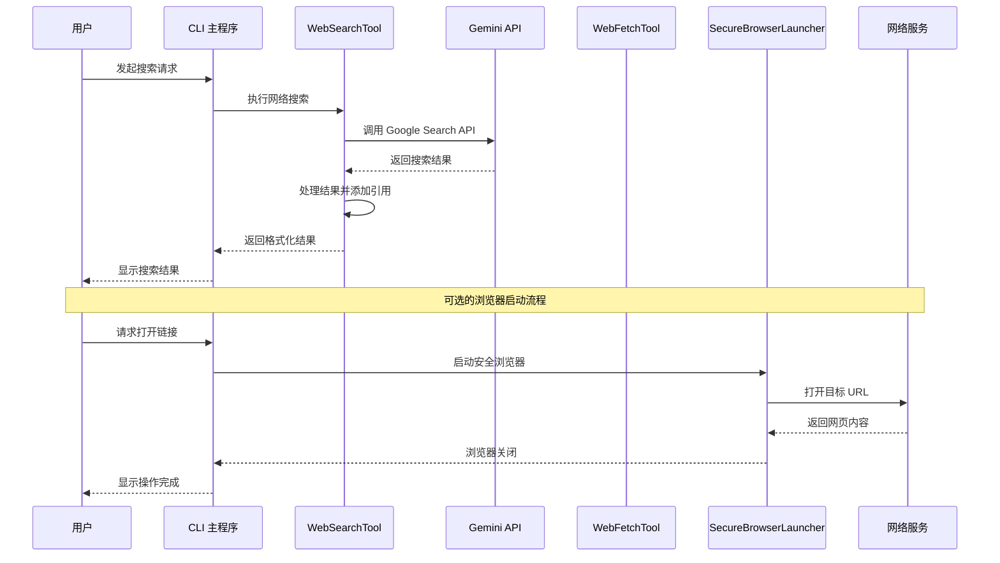
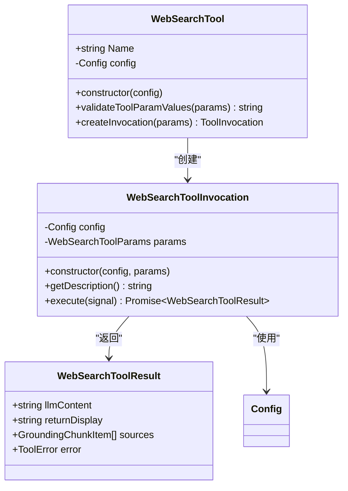
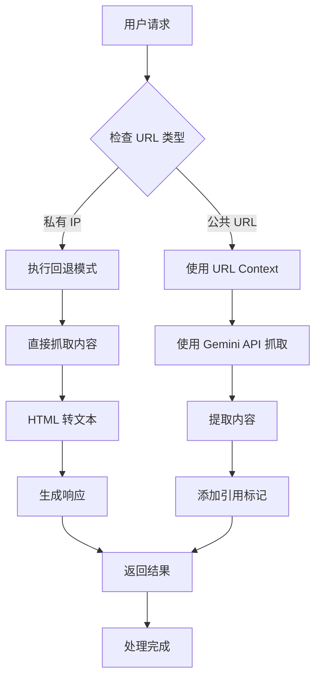
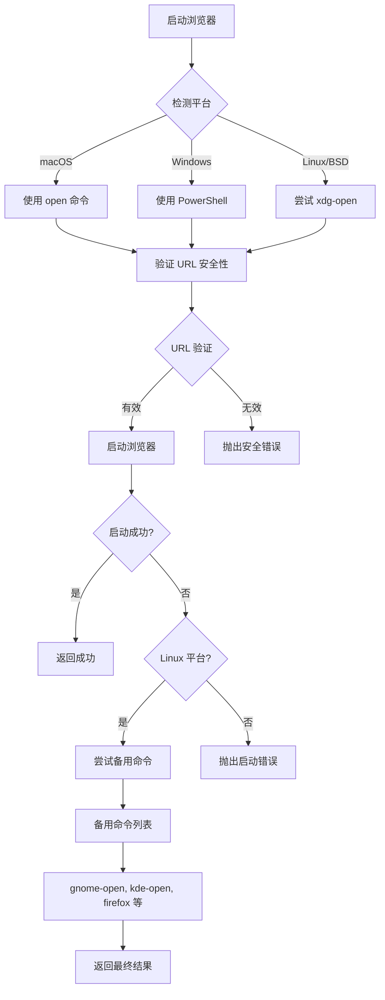
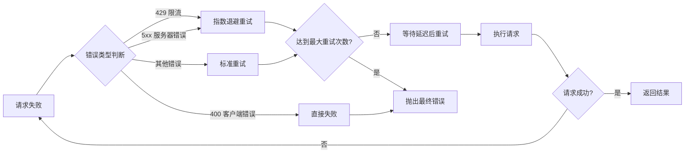
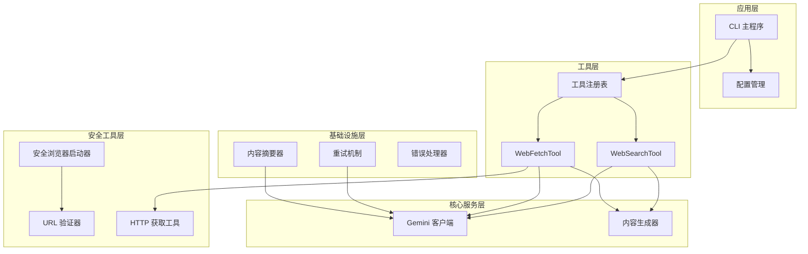

# 网络搜索集成

<cite>
**本文档中引用的文件**
- [web-search.ts](file://packages/core/src/tools/web-search.ts)
- [web-fetch.ts](file://packages/core/src/tools/web-fetch.ts)
- [secure-browser-launcher.ts](file://packages/core/src/utils/secure-browser-launcher.ts)
- [fetch.ts](file://packages/core/src/utils/fetch.ts)
- [config.ts](file://packages/core/src/config/config.ts)
- [retry.ts](file://packages/core/src/utils/retry.ts)
- [summarizer.ts](file://packages/core/src/utils/summarizer.ts)
- [browser.ts](file://packages/core/src/utils/browser.ts)
- [google_web_search.test.ts](file://integration-tests/google_web_search.test.ts)
</cite>

## 目录
1. [简介](#简介)
2. [项目结构概览](#项目结构概览)
3. [核心组件分析](#核心组件分析)
4. [架构概览](#架构概览)
5. [详细组件分析](#详细组件分析)
6. [依赖关系分析](#依赖关系分析)
7. [性能考虑](#性能考虑)
8. [故障排除指南](#故障排除指南)
9. [结论](#结论)

## 简介

gemini-cli 的网络搜索与外部信息集成能力是一个强大的功能集合，它通过两个主要工具——web-search 和 web-fetch 来实现对外部信息的访问和处理。该系统设计了完整的安全机制、错误处理策略和性能优化方法，确保用户能够安全、高效地获取和处理网络信息。

## 项目结构概览

网络搜索功能的核心文件分布在以下目录结构中：



**图表来源**
- [web-search.ts](file://packages/core/src/tools/web-search.ts#L1-L50)
- [web-fetch.ts](file://packages/core/src/tools/web-fetch.ts#L1-L50)
- [config.ts](file://packages/core/src/config/config.ts#L1020-L1100)

## 核心组件分析

### WebSearchTool - Google Web 搜索工具

WebSearchTool 是基于 Google Search API 的网络搜索工具，它通过 Gemini API 实现对互联网信息的检索和处理。

**章节来源**
- [web-search.ts](file://packages/core/src/tools/web-search.ts#L157-L205)

### WebFetchTool - 网页内容获取工具

WebFetchTool 提供了更灵活的网页内容获取能力，支持直接抓取网页内容并进行处理。

**章节来源**
- [web-fetch.ts](file://packages/core/src/tools/web-fetch.ts#L185-L218)

### SecureBrowserLauncher - 安全浏览器启动器

SecureBrowserLauncher 负责在受信任环境中安全地启动默认浏览器，用于身份验证和交互式操作。

**章节来源**
- [secure-browser-launcher.ts](file://packages/core/src/utils/secure-browser-launcher.ts#L40-L100)

## 架构概览

网络搜索系统的整体架构采用分层设计，确保了安全性、可扩展性和可靠性：



**图表来源**
- [web-search.ts](file://packages/core/src/tools/web-search.ts#L58-L101)
- [web-fetch.ts](file://packages/core/src/tools/web-fetch.ts#L185-L218)
- [secure-browser-launcher.ts](file://packages/core/src/utils/secure-browser-launcher.ts#L40-L100)

## 详细组件分析

### WebSearchTool 实现分析

WebSearchTool 基于 Google Search API 实现，提供了语义化的网络搜索功能：



**图表来源**
- [web-search.ts](file://packages/core/src/tools/web-search.ts#L157-L205)
- [web-search.ts](file://packages/core/src/tools/web-search.ts#L58-L101)

#### 关键特性：

1. **智能搜索处理**：利用 Gemini API 的 grounding 功能，自动关联搜索结果和引用
2. **错误处理**：完善的异常捕获和错误报告机制
3. **结果格式化**：自动生成带引用标记的格式化响应

**章节来源**
- [web-search.ts](file://packages/core/src/tools/web-search.ts#L58-L101)

### WebFetchTool 实现分析

WebFetchTool 提供了更底层的网页内容获取能力：



**图表来源**
- [web-fetch.ts](file://packages/core/src/tools/web-fetch.ts#L185-L218)

#### 核心功能：

1. **双重获取策略**：
   - 公共 URL：使用 Gemini API 的 urlContext 工具
   - 私有 IP：回退到直接 HTTP 抓取

2. **内容预处理**：
   - HTML 内容转换为纯文本
   - 自动截断过长内容
   - 保留重要元素（如标题、段落）

3. **引用管理**：
   - 自动生成引用标记
   - 支持多源内容整合

**章节来源**
- [web-fetch.ts](file://packages/core/src/tools/web-fetch.ts#L185-L218)

### SecureBrowserLauncher 安全机制

安全浏览器启动器实现了多平台的安全浏览器启动逻辑：



**图表来源**
- [secure-browser-launcher.ts](file://packages/core/src/utils/secure-browser-launcher.ts#L40-L100)

#### 安全特性：

1. **协议限制**：只允许 HTTP 和 HTTPS 协议
2. **URL 验证**：防止命令注入攻击
3. **环境检测**：智能判断是否应该启动浏览器
4. **备用方案**：多平台备用启动命令

**章节来源**
- [secure-browser-launcher.ts](file://packages/core/src/utils/secure-browser-launcher.ts#L40-L100)

### 错误处理与重试机制

系统实现了完善的错误处理和重试策略：



**图表来源**
- [retry.ts](file://packages/core/src/utils/retry.ts#L60-L120)

**章节来源**
- [retry.ts](file://packages/core/src/utils/retry.ts#L60-L120)

## 依赖关系分析

网络搜索系统的依赖关系展现了清晰的分层架构：



**图表来源**
- [config.ts](file://packages/core/src/config/config.ts#L1020-L1100)
- [web-search.ts](file://packages/core/src/tools/web-search.ts#L157-L205)
- [web-fetch.ts](file://packages/core/src/tools/web-fetch.ts#L185-L218)

**章节来源**
- [config.ts](file://packages/core/src/config/config.ts#L1020-L1100)

## 性能考虑

### 缓存策略

系统实现了多层缓存机制来提升性能：

1. **结果缓存**：搜索结果和网页内容的短期缓存
2. **会话缓存**：同一会话内的重复请求避免重新获取
3. **代理缓存**：支持 HTTP 代理缓存配置

### 资源限制

1. **内容长度限制**：单次抓取内容不超过 100KB
2. **超时控制**：HTTP 请求超时设置为 10 秒
3. **并发限制**：合理控制同时进行的网络请求数量

### 优化策略

1. **智能降级**：当主 API 不可用时自动切换到备用方案
2. **连接复用**：HTTP 连接池优化网络性能
3. **压缩传输**：支持 gzip 压缩减少传输时间

## 故障排除指南

### 常见问题及解决方案

#### 1. 网络搜索失败

**症状**：WebSearchTool 返回 "No information found" 或错误消息

**可能原因**：
- Google API 配额耗尽
- 网络连接不稳定
- 查询参数无效

**解决方案**：
```typescript
// 检查 API 配额状态
console.log('检查 Google API 配额使用情况');

// 验证查询参数
if (!query || query.trim() === '') {
  throw new Error("查询不能为空");
}

// 尝试使用备用搜索方式
const fallbackResult = await executeFallbackSearch(query);
```

#### 2. 浏览器启动失败

**症状**：SecureBrowserLauncher 抛出 "Failed to open browser" 错误

**可能原因**：
- 系统缺少默认浏览器
- 权限不足
- 环境变量配置错误

**解决方案**：
```bash
# 检查浏览器环境变量
echo $BROWSER

# 设置默认浏览器
export BROWSER=/usr/bin/firefox

# 在 Linux 上安装 xdg-utils
sudo apt-get install xdg-utils
```

#### 3. 内容抓取超时

**症状**：WebFetchTool 抛出超时错误

**可能原因**：
- 目标网站响应缓慢
- 网络连接质量差
- 代理配置问题

**解决方案**：
```typescript
// 增加超时时间
const response = await fetchWithTimeout(url, 30000);

// 使用代理服务器
const proxy = config.getProxy();
if (proxy) {
  setGlobalDispatcher(new ProxyAgent(proxy));
}
```

**章节来源**
- [web-search.ts](file://packages/core/src/tools/web-search.ts#L157-L205)
- [web-fetch.ts](file://packages/core/src/tools/web-fetch.ts#L185-L218)
- [fetch.ts](file://packages/core/src/utils/fetch.ts#L30-L50)

## 结论

gemini-cli 的网络搜索与外部信息集成能力通过精心设计的架构和安全机制，为用户提供了强大而可靠的网络信息获取功能。系统的主要优势包括：

1. **安全性优先**：全面的安全验证和防护机制
2. **高可靠性**：多重错误处理和重试策略
3. **跨平台兼容**：支持多种操作系统和环境
4. **性能优化**：智能缓存和资源管理
5. **易于扩展**：模块化设计便于功能扩展

该系统不仅满足了基本的网络搜索需求，还为未来的功能扩展和优化奠定了坚实的基础。通过持续的改进和维护，它将继续为用户提供优质的网络信息集成体验。