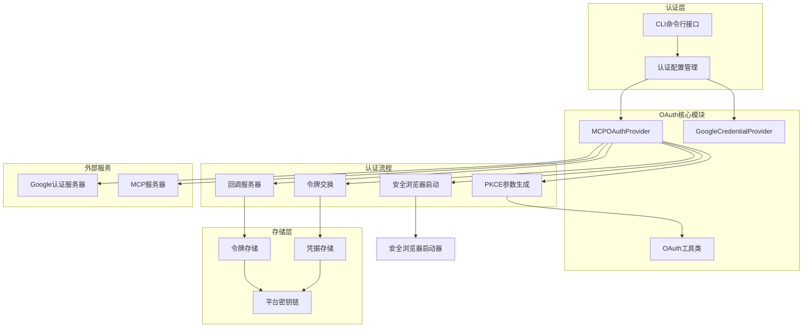
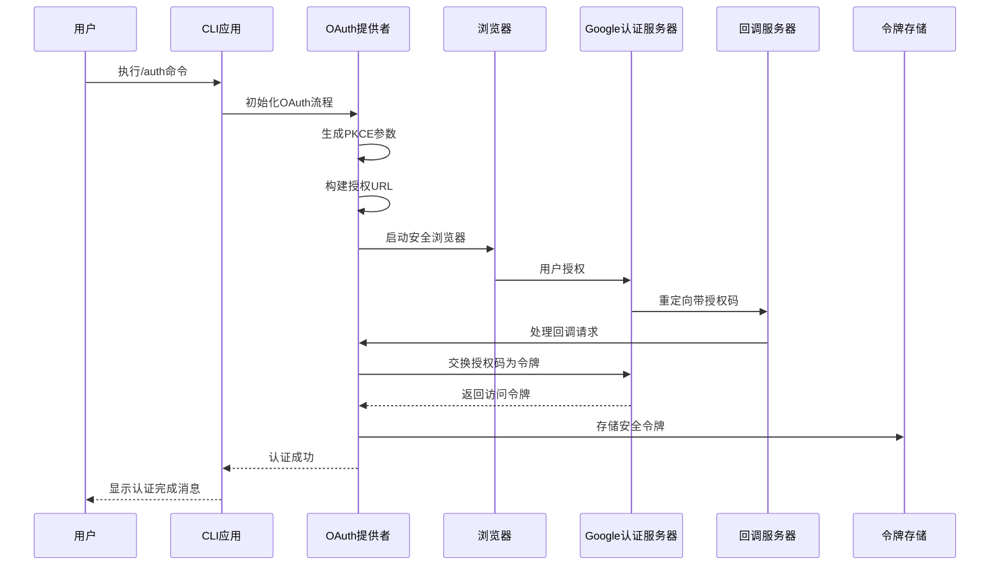
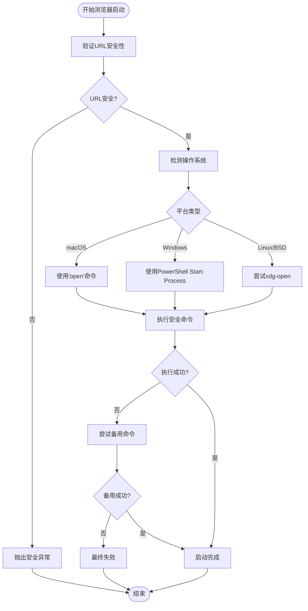
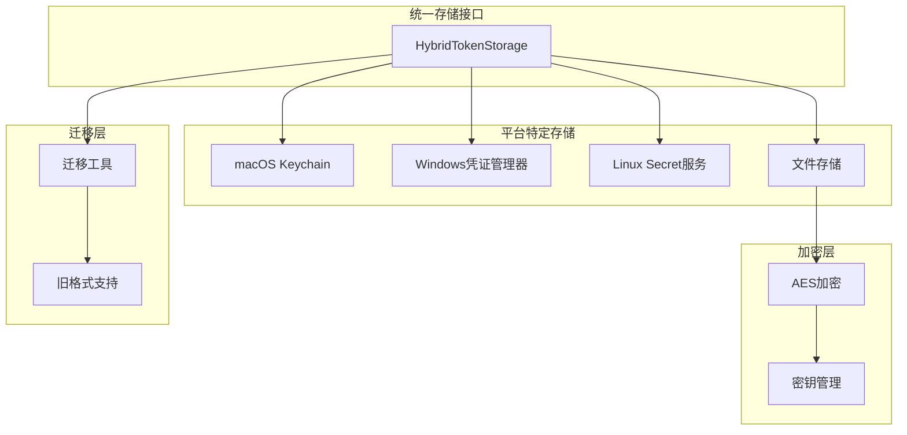
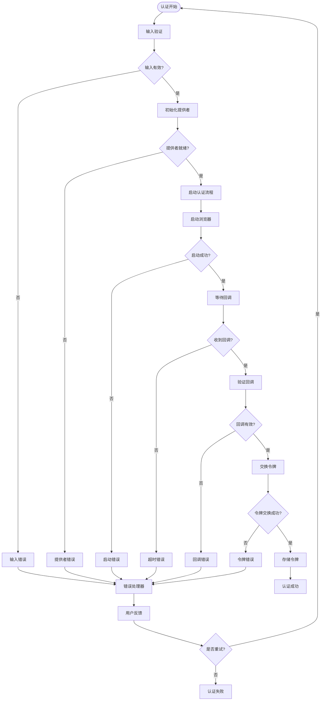

# OAuth认证流程

<cite>
**本文档中引用的文件**
- [oauth-provider.ts](file://packages/core/src/mcp/oauth-provider.ts)
- [oauth-utils.ts](file://packages/core/src/mcp/oauth-utils.ts)
- [google-auth-provider.ts](file://packages/core/src/mcp/google-auth-provider.ts)
- [oauth2.ts](file://packages/core/src/code_assist/oauth2.ts)
- [oauth-credential-storage.ts](file://packages/core/src/code_assist/oauth-credential-storage.ts)
- [auth.ts](file://packages/cli/src/config/auth.ts)
- [secure-browser-launcher.ts](file://packages/core/src/utils/secure-browser-launcher.ts)
- [config.ts](file://packages/core/src/config/config.ts)
</cite>

## 目录
1. [简介](#简介)
2. [项目架构概览](#项目架构概览)
3. [核心组件分析](#核心组件分析)
4. [OAuth认证流程详解](#oauth认证流程详解)
5. [安全机制](#安全机制)
6. [跨平台令牌存储](#跨平台令牌存储)
7. [错误处理策略](#错误处理策略)
8. [最佳实践](#最佳实践)
9. [故障排除指南](#故障排除指南)
10. [总结](#总结)

## 简介

gemini-cli的OAuth认证系统是一个完整的基于Google账户的身份验证解决方案，实现了OAuth 2.0授权码流程（PKCE扩展），支持多种认证场景和跨平台的安全存储。该系统为开发者提供了无缝的Google账户集成体验，同时确保了最高级别的安全性。

## 项目架构概览



**图表来源**
- [oauth-provider.ts](file://packages/core/src/mcp/oauth-provider.ts#L1-L50)
- [google-auth-provider.ts](file://packages/core/src/mcp/google-auth-provider.ts#L1-L30)

## 核心组件分析

### MCPOAuthProvider 类

`MCPOAuthProvider`是整个OAuth认证系统的核心控制器，负责协调完整的认证流程：

```typescript
export class MCPOAuthProvider {
  private readonly tokenStorage: MCPOAuthTokenStorage;

  constructor(tokenStorage: MCPOAuthTokenStorage = new MCPOAuthTokenStorage()) {
    this.tokenStorage = tokenStorage;
  }
}
```

该类的主要职责包括：
- **客户端注册**：动态注册OAuth客户端
- **PKCE参数生成**：安全的代码挑战和状态生成
- **授权URL构建**：包含所有必要的OAuth参数
- **回调服务器管理**：安全的本地HTTP服务器处理回调
- **令牌交换**：与授权服务器进行安全的令牌交换
- **令牌刷新**：自动处理访问令牌过期

### GoogleCredentialProvider 类

`GoogleCredentialProvider`专门处理Google Cloud Application Default Credentials (ADC)：

```typescript
export class GoogleCredentialProvider implements OAuthClientProvider {
  private readonly auth: GoogleAuth;
  
  async tokens(): Promise<OAuthTokens | undefined> {
    const client = await this.auth.getClient();
    const accessTokenResponse = await client.getAccessToken();
    
    if (!accessTokenResponse.token) {
      console.error('Failed to get access token from Google ADC');
      return undefined;
    }
    
    const tokens: OAuthTokens = {
      access_token: accessTokenResponse.token,
      token_type: 'Bearer',
    };
    return tokens;
  }
}
```

### OAuth工具类

`OAuthUtils`提供了通用的OAuth操作功能：

```typescript
export class OAuthUtils {
  static async discoverOAuthConfig(serverUrl: string): Promise<MCPOAuthConfig | null> {
    // 尝试发现OAuth配置的各种方式
    const discoveryMethods = [
      this.discoverFromWellKnown(serverUrl),
      this.discoverFromWWWAuthenticate(serverUrl),
      this.discoverFromMetadata(serverUrl)
    ];
    
    for (const method of discoveryMethods) {
      const config = await method;
      if (config) return config;
    }
    return null;
  }
}
```

**章节来源**
- [oauth-provider.ts](file://packages/core/src/mcp/oauth-provider.ts#L80-L120)
- [google-auth-provider.ts](file://packages/core/src/mcp/google-auth-provider.ts#L15-L99)
- [oauth-utils.ts](file://packages/core/src/mcp/oauth-utils.ts#L1-L50)

## OAuth认证流程详解

### 完整认证流程



**图表来源**
- [oauth-provider.ts](file://packages/core/src/mcp/oauth-provider.ts#L700-L800)
- [oauth2.ts](file://packages/core/src/code_assist/oauth2.ts#L276-L350)

### PKCE参数生成

PKCE（Proof Key for Code Exchange）是现代OAuth流程的重要安全增强：

```typescript
private generatePKCEParams(): PKCEParams {
  // 生成代码验证器（43-128字符）
  const codeVerifier = crypto.randomBytes(32).toString('base64url');

  // 使用SHA256生成代码挑战
  const codeChallenge = crypto
    .createHash('sha256')
    .update(codeVerifier)
    .digest('base64url');

  // 生成状态用于CSRF保护
  const state = crypto.randomBytes(16).toString('base64url');

  return { codeVerifier, codeChallenge, state };
}
```

### 授权URL构建

```typescript
private buildAuthorizationUrl(
  config: MCPOAuthConfig,
  pkceParams: PKCEParams,
  mcpServerUrl?: string,
): string {
  const redirectUri = config.redirectUri || 
    `http://localhost:${REDIRECT_PORT}${REDIRECT_PATH}`;

  const params = new URLSearchParams({
    client_id: config.clientId!,
    response_type: 'code',
    redirect_uri: redirectUri,
    state: pkceParams.state,
    code_challenge: pkceParams.codeChallenge,
    code_challenge_method: 'S256',
  });

  if (config.scopes && config.scopes.length > 0) {
    params.append('scope', config.scopes.join(' '));
  }

  if (config.audiences && config.audiences.length > 0) {
    params.append('audience', config.audiences.join(' '));
  }

  // 添加资源参数以符合MCP OAuth规范
  if (mcpServerUrl) {
    try {
      params.append('resource', OAuthUtils.buildResourceParameter(mcpServerUrl));
    } catch (error) {
      console.warn(`Could not add resource parameter: ${getErrorMessage(error)}`);
    }
  }

  const url = new URL(config.authorizationUrl!);
  params.forEach((value, key) => {
    url.searchParams.append(key, value);
  });
  return url.toString();
}
```

### 回调服务器实现

```typescript
private async startCallbackServer(expectedState: string): Promise<OAuthAuthorizationResponse> {
  return new Promise((resolve, reject) => {
    const server = http.createServer(async (req: http.IncomingMessage, res: http.ServerResponse) => {
      try {
        const url = new URL(req.url!, `http://localhost:${REDIRECT_PORT}`);
        
        if (url.pathname !== REDIRECT_PATH) {
          res.writeHead(404);
          res.end('Not found');
          return;
        }

        const code = url.searchParams.get('code');
        const state = url.searchParams.get('state');
        const error = url.searchParams.get('error');

        if (error) {
          // 处理OAuth错误
          res.writeHead(HTTP_OK, { 'Content-Type': 'text/html' });
          res.end(`<html><body><h1>Authentication Failed</h1><p>Error: ${error}</p></body></html>`);
          server.close();
          reject(new Error(`OAuth error: ${error}`));
          return;
        }

        if (!code || !state) {
          res.writeHead(400);
          res.end('Missing code or state parameter');
          return;
        }

        if (state !== expectedState) {
          res.writeHead(400);
          res.end('Invalid state parameter');
          server.close();
          reject(new Error('State mismatch - possible CSRF attack'));
          return;
        }

        // 发送成功响应给浏览器
        res.writeHead(HTTP_OK, { 'Content-Type': 'text/html' });
        res.end(`<html><body><h1>Authentication Successful!</h1><p>You can close this window and return to Gemini CLI.</p></body></html>`);

        server.close();
        resolve({ code, state });
      } catch (error) {
        server.close();
        reject(error);
      }
    });

    server.on('error', reject);
    server.listen(REDIRECT_PORT, () => {
      console.log(`OAuth callback server listening on port ${REDIRECT_PORT}`);
    });

    // 5分钟超时
    setTimeout(() => {
      server.close();
      reject(new Error('OAuth callback timeout'));
    }, 5 * 60 * 1000);
  });
}
```

**章节来源**
- [oauth-provider.ts](file://packages/core/src/mcp/oauth-provider.ts#L150-L250)
- [oauth-provider.ts](file://packages/core/src/mcp/oauth-provider.ts#L250-L350)
- [oauth-provider.ts](file://packages/core/src/mcp/oauth-provider.ts#L350-L450)

## 安全机制

### 安全浏览器启动



**图表来源**
- [secure-browser-launcher.ts](file://packages/core/src/utils/secure-browser-launcher.ts#L40-L120)

### URL安全验证

```typescript
function validateUrl(url: string): void {
  let parsedUrl: URL;

  try {
    parsedUrl = new URL(url);
  } catch (_error) {
    throw new Error(`Invalid URL: ${url}`);
  }

  // 只允许HTTP和HTTPS协议
  if (parsedUrl.protocol !== 'http:' && parsedUrl.protocol !== 'https:') {
    throw new Error(
      `Unsafe protocol: ${parsedUrl.protocol}. Only HTTP and HTTPS are allowed.`,
    );
  }

  // 额外验证：确保没有换行符或控制字符
  if (/[\r\n\x00-\x1f]/.test(url)) {
    throw new Error('URL contains invalid characters');
  }
}
```

### CSRF保护

通过随机生成的状态参数防止跨站请求伪造攻击：

```typescript
// 在授权URL中包含状态参数
const state = crypto.randomBytes(16).toString('base64url');
const authUrl = client.generateAuthUrl({
  redirect_uri: redirectUri,
  access_type: 'offline',
  scope: OAUTH_SCOPE,
  state,
});

// 在回调处理中验证状态
if (qs.get('state') !== state) {
  res.writeHead(HTTP_REDIRECT, { Location: SIGN_IN_FAILURE_URL });
  res.end('State mismatch. Possible CSRF attack');
  reject(
    new FatalAuthenticationError(
      'OAuth state mismatch. Possible CSRF attack or browser session issue.',
    ),
  );
}
```

### 令牌刷新机制

```typescript
async refreshAccessToken(
  config: MCPOAuthConfig,
  refreshToken: string,
  tokenUrl: string,
  mcpServerUrl?: string,
): Promise<OAuthTokenResponse> {
  const params = new URLSearchParams({
    grant_type: 'refresh_token',
    refresh_token: refreshToken,
    client_id: config.clientId!,
  });

  if (config.clientSecret) {
    params.append('client_secret', config.clientSecret);
  }

  if (config.scopes && config.scopes.length > 0) {
    params.append('scope', config.scopes.join(' '));
  }

  const response = await fetch(tokenUrl, {
    method: 'POST',
    headers: {
      'Content-Type': 'application/x-www-form-urlencoded',
      Accept: 'application/json, application/x-www-form-urlencoded',
    },
    body: params.toString(),
  });

  // 解析响应并返回新的令牌
  return this.parseTokenResponse(response);
}
```

**章节来源**
- [secure-browser-launcher.ts](file://packages/core/src/utils/secure-browser-launcher.ts#L15-L40)
- [oauth2.ts](file://packages/core/src/code_assist/oauth2.ts#L300-L320)
- [oauth-provider.ts](file://packages/core/src/mcp/oauth-provider.ts#L500-L600)

## 跨平台令牌存储

### 存储架构设计



**图表来源**
- [oauth-credential-storage.ts](file://packages/core/src/code_assist/oauth-credential-storage.ts#L15-L50)

### 平台适配实现

```typescript
export class OAuthCredentialStorage {
  private static storage: HybridTokenStorage = new HybridTokenStorage(
    KEYCHAIN_SERVICE_NAME,
  );

  static async loadCredentials(): Promise<Credentials | null> {
    try {
      const credentials = await this.storage.getCredentials(MAIN_ACCOUNT_KEY);

      if (credentials?.token) {
        const { accessToken, refreshToken, expiresAt, tokenType, scope } =
          credentials.token;
          
        // 转换为Google Credentials格式
        const googleCreds: Credentials = {
          access_token: accessToken,
          refresh_token: refreshToken || undefined,
          token_type: tokenType || undefined,
          scope: scope || undefined,
        };

        if (expiresAt) {
          googleCreds.expiry_date = expiresAt;
        }

        return googleCreds;
      }

      // 回退：尝试从旧的文件存储迁移
      return await this.migrateFromFileStorage();
    } catch (error: unknown) {
      console.error(error);
      throw new Error('Failed to load OAuth credentials');
    }
  }

  static async saveCredentials(credentials: Credentials): Promise<void> {
    if (!credentials.access_token) {
      throw new Error('Attempted to save credentials without an access token.');
    }

    // 转换为OAuthCredentials格式
    const mcpCredentials: OAuthCredentials = {
      serverName: MAIN_ACCOUNT_KEY,
      token: {
        accessToken: credentials.access_token,
        refreshToken: credentials.refresh_token || undefined,
        tokenType: credentials.token_type || 'Bearer',
        scope: credentials.scope || undefined,
        expiresAt: credentials.expiry_date || undefined,
      },
      updatedAt: Date.now(),
    };

    await this.storage.setCredentials(mcpCredentials);
  }
}
```

### 密钥链集成

不同平台的密钥链集成：

```typescript
// macOS Keychain集成
if (process.platform === 'darwin') {
  // 使用Security框架
  const securityCommand = `security find-generic-password -ga "${service}" "${account}"`;
  // 解析输出并提取密码
}

// Windows Credential Manager集成
if (process.platform === 'win32') {
  // 使用Windows凭证管理器API
  const winCred = require('wincred');
  const credential = winCred.get({
    target: `${service}:${account}`
  });
}

// Linux Secret Service集成
if (process.platform === 'linux') {
  // 使用D-Bus Secret Service API
  const secretService = require('secret-service');
  const collection = await secretService.getCollection('Default');
}
```

**章节来源**
- [oauth-credential-storage.ts](file://packages/core/src/code_assist/oauth-credential-storage.ts#L20-L80)

## 错误处理策略

### 分层错误处理



**图表来源**
- [oauth-provider.ts](file://packages/core/src/mcp/oauth-provider.ts#L700-L800)

### 具体错误处理实现

```typescript
// FatalAuthenticationError类
export class FatalAuthenticationError extends Error {
  constructor(message: string) {
    super(message);
    this.name = 'FatalAuthenticationError';
  }
}

// 错误处理示例
try {
  const { tokens } = await client.getToken({
    code: qs.get('code')!,
    redirect_uri: redirectUri,
  });
  client.setCredentials(tokens);
  
  // 获取并缓存Google账户ID
  try {
    await fetchAndCacheUserInfo(client);
  } catch (error) {
    console.warn(
      'Failed to retrieve Google Account ID during authentication:',
      getErrorMessage(error),
    );
    // 如果Google账户ID检索失败，不中断认证流程
  }
  
  res.writeHead(HTTP_REDIRECT, { Location: SIGN_IN_SUCCESS_URL });
  res.end();
  resolve();
} catch (error) {
  res.writeHead(HTTP_REDIRECT, { Location: SIGN_IN_FAILURE_URL });
  res.end();
  reject(
    new FatalAuthenticationError(
      `Failed to exchange authorization code for tokens: ${getErrorMessage(error)}`,
    ),
  );
}
```

### 错误恢复机制

```typescript
// 自动重试机制
if (config.isBrowserLaunchSuppressed()) {
  let success = false;
  const maxRetries = 2;
  for (let i = 0; !success && i < maxRetries; i++) {
    success = await authWithUserCode(client);
    if (!success) {
      console.error(
        '\nFailed to authenticate with user code.',
        i === maxRetries - 1 ? '' : 'Retrying...\n',
      );
    }
  }
  if (!success) {
    throw new FatalAuthenticationError(
      'Failed to authenticate with user code.',
    );
  }
}
```

**章节来源**
- [oauth2.ts](file://packages/core/src/code_assist/oauth2.ts#L320-L350)
- [oauth-provider.ts](file://packages/core/src/mcp/oauth-provider.ts#L800-L894)

## 最佳实践

### 认证配置最佳实践

1. **安全的客户端凭据**
```typescript
// 推荐：使用环境变量
const config = {
  clientId: process.env.OAUTH_CLIENT_ID,
  clientSecret: process.env.OAUTH_CLIENT_SECRET,
  scopes: ['profile', 'email', 'cloud-platform'],
  audiences: ['https://api.example.com']
};
```

2. **适当的超时设置**
```typescript
// 设置合理的超时时间
const authTimeout = 5 * 60 * 1000; // 5分钟
const timeoutPromise = new Promise<never>((_, reject) => {
  setTimeout(() => {
    reject(new Error('OAuth callback timeout'));
  }, authTimeout);
});
```

3. **优雅的用户界面**
```typescript
// 提供清晰的用户指示
console.log(`→ Opening your browser for OAuth sign-in...

If the browser does not open, copy and paste this URL into your browser:
${authUrl}

💡 TIP: Triple-click to select the entire URL, then copy and paste it into your browser.
⚠️  Make sure to copy the COMPLETE URL - it may wrap across multiple lines.`);
```

### 性能优化建议

1. **并发处理**
```typescript
// 并发启动浏览器和回调服务器
const [browserResult, callbackResult] = await Promise.all([
  openBrowserSecurely(authUrl),
  callbackPromise
]);
```

2. **缓存策略**
```typescript
// 检查缓存的凭据
if (await loadCachedCredentials(client)) {
  console.log('Loaded cached credentials.');
  return client;
}
```

3. **资源清理**
```typescript
// 确保服务器正确关闭
server.close();
```

## 故障排除指南

### 常见问题及解决方案

1. **浏览器无法启动**
```bash
# 设置环境变量禁用浏览器启动
export NO_BROWSER=true

# 或者在配置中禁用
config.browserLaunchSuppressed = true
```

2. **端口冲突**
```typescript
// 自动查找可用端口
const port = await getAvailablePort();
const redirectUri = `http://localhost:${port}/oauth2callback`;
```

3. **网络代理问题**
```typescript
// 配置代理设置
const client = new OAuth2Client({
  clientId: OAUTH_CLIENT_ID,
  clientSecret: OAUTH_CLIENT_SECRET,
  transporterOptions: {
    proxy: config.getProxy(),
  },
});
```

4. **权限问题**
```bash
# macOS：添加到钥匙串访问权限
sudo security add-trusted-cert -d -r trustRoot -k /Library/Keychains/System.keychain cert.pem

# Linux：检查D-Bus权限
export DBUS_SESSION_BUS_ADDRESS=unix:path=/run/user/$(id -u)/bus
```

### 调试技巧

1. **启用详细日志**
```typescript
// 设置调试模式
process.env.DEBUG = 'oauth:*';
```

2. **检查网络连接**
```bash
# 测试OAuth端点连通性
curl -I https://accounts.google.com/.well-known/openid-configuration
```

3. **验证证书**
```bash
# 检查SSL证书
openssl s_client -connect accounts.google.com:443 -servername accounts.google.com
```

**章节来源**
- [oauth2.ts](file://packages/core/src/code_assist/oauth2.ts#L150-L200)
- [auth.ts](file://packages/cli/src/config/auth.ts#L1-L44)

## 总结

gemini-cli的OAuth认证系统是一个设计精良、安全可靠的认证解决方案。它通过以下关键特性确保了高质量的用户体验和最高级别的安全性：

### 主要优势

1. **完整的PKCE支持**：实现了最新的OAuth 2.0 PKCE标准，增强了移动应用和公共客户端的安全性。

2. **多平台兼容性**：支持macOS Keychain、Windows Credential Manager和Linux Secret Service，确保在各种操作系统上的一致体验。

3. **安全的浏览器启动**：通过严格的URL验证和平台特定的命令执行，防止命令注入攻击。

4. **智能错误处理**：分层的错误处理机制，提供清晰的用户反馈和自动重试功能。

5. **灵活的配置发现**：支持动态客户端注册和OAuth配置发现，减少手动配置需求。

6. **强大的令牌管理**：自动令牌刷新、过期检查和安全存储，确保认证会话的持久性。

### 技术亮点

- **分层架构设计**：清晰的职责分离，便于维护和扩展
- **异步处理**：充分利用Promise和async/await，提供流畅的用户体验
- **跨平台抽象**：统一的API接口，隐藏平台差异
- **安全优先**：从URL验证到加密存储，全方位的安全考虑

这个OAuth认证系统不仅满足了当前的功能需求，还为未来的扩展和改进奠定了坚实的基础。通过持续的优化和安全更新，它将继续为用户提供可靠、安全的身份验证服务。