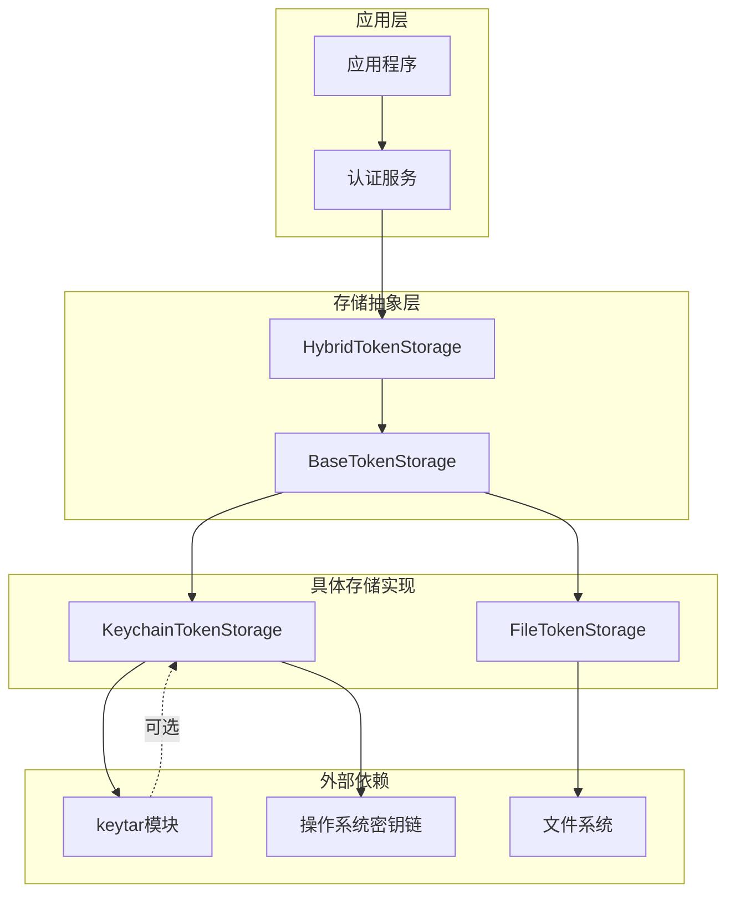
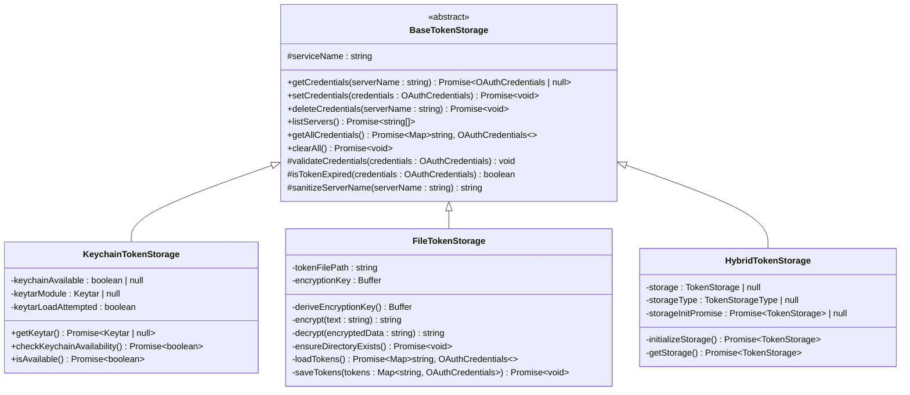
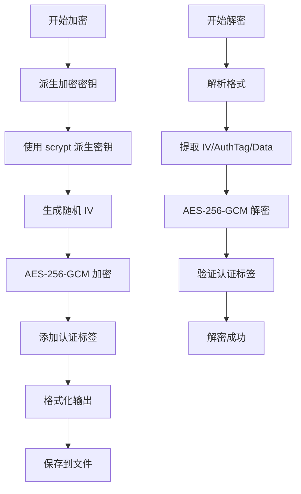
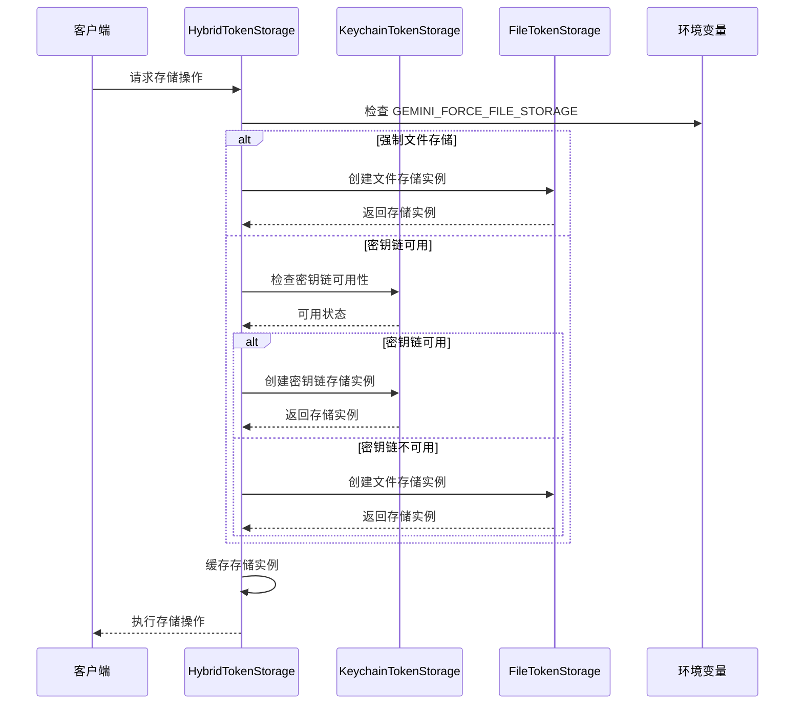
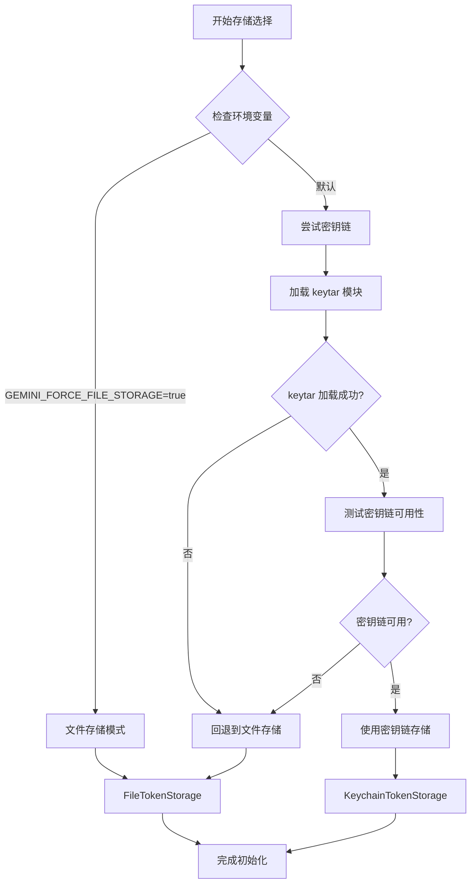
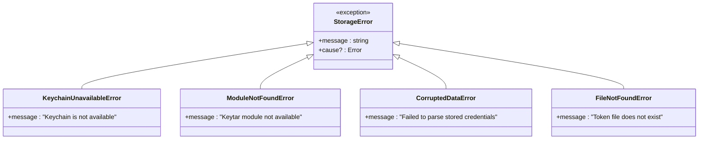

# 令牌存储与管理架构

<cite>
**本文档中引用的文件**
- [keychain-token-storage.ts](file://packages/core/src/mcp/token-storage/keychain-token-storage.ts)
- [file-token-storage.ts](file://packages/core/src/mcp/token-storage/file-token-storage.ts)
- [hybrid-token-storage.ts](file://packages/core/src/mcp/token-storage/hybrid-token-storage.ts)
- [base-token-storage.ts](file://packages/core/src/mcp/token-storage/base-token-storage.ts)
- [types.ts](file://packages/core/src/mcp/token-storage/types.ts)
- [keychain-token-storage.test.ts](file://packages/core/src/mcp/token-storage/keychain-token-storage.test.ts)
- [hybrid-token-storage.test.ts](file://packages/core/src/mcp/token-storage/hybrid-token-storage.test.ts)
</cite>

## 目录
1. [简介](#简介)
2. [核心架构概览](#核心架构概览)
3. [基础接口设计](#基础接口设计)
4. [Keychain令牌存储实现](#keychain令牌存储实现)
5. [文件令牌存储实现](#文件令牌存储实现)
6. [混合存储策略](#混合存储策略)
7. [令牌序列化与安全](#令牌序列化与安全)
8. [存储后端选择策略](#存储后端选择策略)
9. [错误处理与故障转移](#错误处理与故障转移)
10. [性能考虑](#性能考虑)
11. [最佳实践](#最佳实践)
12. [总结](#总结)

## 简介

Gemini CLI 实现了一个多层次的令牌存储架构，专门用于安全地持久化 OAuth 令牌和其他认证凭据。该系统采用分层设计，提供了三种不同的存储后端：操作系统原生密钥链（Keychain）、加密文件存储和混合存储策略。这种设计确保了在不同平台和环境下的高可用性和安全性。

## 核心架构概览



**图表来源**
- [hybrid-token-storage.ts](file://packages/core/src/mcp/token-storage/hybrid-token-storage.ts#L1-L98)
- [base-token-storage.ts](file://packages/core/src/mcp/token-storage/base-token-storage.ts#L1-L50)

## 基础接口设计

所有令牌存储实现都继承自 `BaseTokenStorage` 抽象类，该类定义了统一的接口契约：



**图表来源**
- [base-token-storage.ts](file://packages/core/src/mcp/token-storage/base-token-storage.ts#L8-L49)
- [keychain-token-storage.ts](file://packages/core/src/mcp/token-storage/keychain-token-storage.ts#L25-L252)
- [file-token-storage.ts](file://packages/core/src/mcp/token-storage/file-token-storage.ts#L13-L185)
- [hybrid-token-storage.ts](file://packages/core/src/mcp/token-storage/hybrid-token-storage.ts#L13-L98)

**章节来源**
- [base-token-storage.ts](file://packages/core/src/mcp/token-storage/base-token-storage.ts#L1-L50)
- [types.ts](file://packages/core/src/mcp/token-storage/types.ts#L1-L43)

## Keychain令牌存储实现

`KeychainTokenStorage` 类利用 `keytar` 模块与操作系统的原生密钥链服务进行交互，提供最高级别的安全性。

### 核心特性

1. **动态模块加载**：通过异步导入机制延迟加载 `keytar` 模块
2. **可用性检测**：通过测试写入-读取-删除循环验证密钥链功能
3. **自动缓存**：避免重复的可用性检查
4. **JSON 序列化**：将令牌数据序列化为 JSON 格式存储

### 关键方法实现

```typescript
// 可用性检查机制
async checkKeychainAvailability(): Promise<boolean> {
  if (this.keychainAvailable !== null) {
    return this.keychainAvailable;
  }
  
  try {
    const keytar = await this.getKeytar();
    if (!keytar) {
      this.keychainAvailable = false;
      return false;
    }
    
    // 测试密钥链功能
    const testAccount = `${KEYCHAIN_TEST_PREFIX}${crypto.randomBytes(8).toString('hex')}`;
    const testPassword = 'test';
    
    await keytar.setPassword(this.serviceName, testAccount, testPassword);
    const retrieved = await keytar.getPassword(this.serviceName, testAccount);
    const deleted = await keytar.deletePassword(this.serviceName, testAccount);
    
    const success = deleted && retrieved === testPassword;
    this.keychainAvailable = success;
    return success;
  } catch (_error) {
    this.keychainAvailable = false;
    return false;
  }
}
```

### 安全性保障

- **服务名称隔离**：每个服务使用独立的服务名称
- **账户名清理**：自动清理非法字符，防止注入攻击
- **过期检查**：内置令牌过期验证机制
- **异常处理**：完善的错误捕获和用户友好的错误消息

**章节来源**
- [keychain-token-storage.ts](file://packages/core/src/mcp/token-storage/keychain-token-storage.ts#L1-L252)
- [keychain-token-storage.test.ts](file://packages/core/src/mcp/token-storage/keychain-token-storage.test.ts#L1-L353)

## 文件令牌存储实现

`FileTokenStorage` 提供基于文件系统的加密存储方案，作为密钥链的可靠后备选项。

### 加密机制

文件存储使用 AES-256-GCM 对称加密算法：



**图表来源**
- [file-token-storage.ts](file://packages/core/src/mcp/token-storage/file-token-storage.ts#L30-L60)

### 存储路径与权限

- **路径位置**：`~/.gemini/mcp-oauth-tokens-v2.json`
- **文件权限**：0o600（仅所有者可读写）
- **目录权限**：0o700（仅所有者可访问）

### 错误处理策略

```typescript
private async loadTokens(): Promise<Map<string, OAuthCredentials>> {
  try {
    const data = await fs.readFile(this.tokenFilePath, 'utf-8');
    const decrypted = this.decrypt(data);
    const tokens = JSON.parse(decrypted) as Record<string, OAuthCredentials>;
    return new Map(Object.entries(tokens));
  } catch (error: unknown) {
    const err = error as NodeJS.ErrnoException & { message?: string };
    if (err.code === 'ENOENT') {
      throw new Error('Token file does not exist');
    }
    if (err.message?.includes('Invalid encrypted data format')) {
      throw new Error('Token file corrupted');
    }
    throw error;
  }
}
```

**章节来源**
- [file-token-storage.ts](file://packages/core/src/mcp/token-storage/file-token-storage.ts#L1-L185)

## 混合存储策略

`HybridTokenStorage` 实现了智能的存储后端选择策略，优先使用密钥链但提供可靠的文件存储作为后备。

### 初始化流程



**图表来源**
- [hybrid-token-storage.ts](file://packages/core/src/mcp/token-storage/hybrid-token-storage.ts#L25-L50)

### 存储类型枚举

```typescript
export enum TokenStorageType {
  KEYCHAIN = 'keychain',
  ENCRYPTED_FILE = 'encrypted_file',
}
```

### 环境变量控制

- **GEMINI_FORCE_FILE_STORAGE**：强制使用文件存储模式
- **用途**：调试、容器环境或密钥链不可用的情况

**章节来源**
- [hybrid-token-storage.ts](file://packages/core/src/mcp/token-storage/hybrid-token-storage.ts#L1-L98)

## 令牌序列化与安全

### 数据结构定义

```typescript
export interface OAuthCredentials {
  serverName: string;
  token: OAuthToken;
  clientId?: string;
  tokenUrl?: string;
  mcpServerUrl?: string;
  updatedAt: number;
}

export interface OAuthToken {
  accessToken: string;
  refreshToken?: string;
  expiresAt?: number;
  tokenType: string;
  scope?: string;
}
```

### 过期检查机制

```typescript
protected isTokenExpired(credentials: OAuthCredentials): boolean {
  if (!credentials.token.expiresAt) {
    return false;
  }
  const bufferMs = 5 * 60 * 1000; // 5分钟缓冲
  return Date.now() > credentials.token.expiresAt - bufferMs;
}
```

### 序列化流程

1. **对象验证**：确保必需字段存在
2. **时间戳更新**：记录最后修改时间
3. **JSON 序列化**：转换为字符串格式
4. **加密存储**：对文件存储进行加密

**章节来源**
- [types.ts](file://packages/core/src/mcp/token-storage/types.ts#L1-L43)
- [base-token-storage.ts](file://packages/core/src/mcp/token-storage/base-token-storage.ts#L35-L45)

## 存储后端选择策略

### 优先级决策树



**图表来源**
- [hybrid-token-storage.ts](file://packages/core/src/mcp/token-storage/hybrid-token-storage.ts#L25-L50)

### 平台兼容性

- **macOS**：原生支持密钥链
- **Windows**：支持 Windows Credential Manager
- **Linux**：支持 GNOME Keyring 或其他 D-Bus 密钥链

## 错误处理与故障转移

### 异常分类处理



**图表来源**
- [keychain-token-storage.ts](file://packages/core/src/mcp/token-storage/keychain-token-storage.ts#L60-L80)
- [file-token-storage.ts](file://packages/core/src/mcp/token-storage/file-token-storage.ts#L70-L90)

### 故障转移机制

1. **密钥链失败**：自动切换到文件存储
2. **文件损坏**：创建新的加密密钥重新初始化
3. **权限问题**：记录错误并继续使用内存存储
4. **网络问题**：重试机制和指数退避

**章节来源**
- [keychain-token-storage.test.ts](file://packages/core/src/mcp/token-storage/keychain-token-storage.test.ts#L80-L120)
- [hybrid-token-storage.test.ts](file://packages/core/src/mcp/token-storage/hybrid-token-storage.test.ts#L130-L170)

## 性能考虑

### 缓存策略

- **可用性缓存**：密钥链可用性结果缓存 1 分钟
- **模块加载缓存**：keytar 模块只加载一次
- **存储实例缓存**：初始化后缓存存储实例

### 异步优化

```typescript
// 使用 Promise 缓存避免重复初始化
private storageInitPromise: Promise<TokenStorage> | null = null;

private async getStorage(): Promise<TokenStorage> {
  if (this.storage !== null) {
    return this.storage;
  }
  
  if (!this.storageInitPromise) {
    this.storageInitPromise = this.initializeStorage();
  }
  
  return await this.storageInitPromise;
}
```

### 内存管理

- **及时释放**：不再使用的存储实例自动清理
- **批量操作**：支持批量获取所有令牌减少 I/O 操作
- **流式处理**：大文件的流式读写避免内存溢出

## 最佳实践

### 开发建议

1. **环境变量配置**
   ```bash
   # 强制使用文件存储（调试时）
   export GEMINI_FORCE_FILE_STORAGE=true
   
   # 在 CI 环境中
   export GEMINI_FORCE_FILE_STORAGE=true
   ```

2. **错误处理**
   ```typescript
   try {
     const credentials = await storage.getCredentials('server');
     if (!credentials) {
       // 处理未找到凭据的情况
     }
   } catch (error) {
     // 处理存储错误
   }
   ```

3. **资源清理**
   ```typescript
   // 清理所有凭据
   await storage.clearAll();
   
   // 删除特定服务器凭据
   await storage.deleteCredentials('server-name');
   ```

### 安全建议

1. **最小权限原则**：确保文件权限设置正确
2. **定期轮换**：实现令牌刷新机制
3. **监控告警**：监控存储失败事件
4. **备份策略**：重要凭据的备份和恢复

## 总结

Gemini CLI 的令牌存储架构展现了现代软件工程中的最佳实践：

### 架构优势

1. **分层设计**：清晰的抽象层次和职责分离
2. **高可用性**：多重存储后端和智能故障转移
3. **跨平台兼容**：适配不同操作系统的存储机制
4. **安全性保障**：多层安全防护和加密机制

### 技术亮点

- **动态模块加载**：按需加载减少启动时间
- **智能缓存**：关键操作结果的高效缓存
- **优雅降级**：组件失效时的平滑过渡
- **完善测试**：全面的单元测试和集成测试

### 适用场景

该架构特别适合：
- 需要高安全性的企业应用
- 跨平台部署的桌面应用程序
- 对用户体验要求较高的 CLI 工具
- 需要长期存储认证凭据的应用

通过这种精心设计的令牌存储系统，Gemini CLI 能够在保证安全性的前提下，提供稳定可靠的认证体验，为用户提供无缝的使用体验。