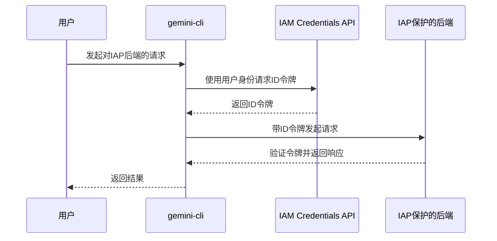
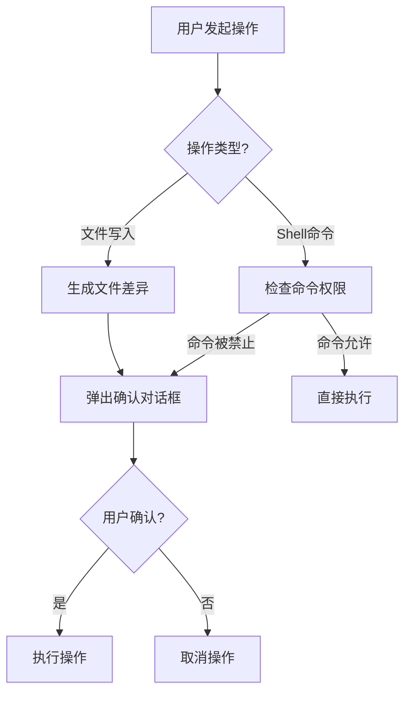

# 安全策略与权限控制

<cite>
**本文档中引用的文件**  
- [sa-impersonation-provider.ts](file://packages/core/src/mcp/sa-impersonation-provider.ts)
- [auth.ts](file://packages/cli/src/config/auth.ts)
- [settings.ts](file://packages/cli/src/config/settings.ts)
- [ide-installer.ts](file://packages/core/src/ide/ide-installer.ts)
- [policy-engine.ts](file://packages/core/src/policy/policy-engine.ts)
- [trustedFolders.ts](file://packages/cli/src/config/trustedFolders.ts)
- [write-file.ts](file://packages/core/src/tools/write-file.ts)
- [shellProcessor.ts](file://packages/cli/src/services/prompt-processors/shellProcessor.ts)
</cite>

## 目录
1. [简介](#简介)
2. [服务账户凭据与身份模拟](#服务账户凭据与身份模拟)
3. [IDE集成安全配置](#ide集成安全配置)
4. [认证状态管理与用户权限验证](#认证状态管理与用户权限验证)
5. [数据隐私与扩展权限模型](#数据隐私与扩展权限模型)
6. [安全策略的配置文件强制执行](#安全策略的配置文件强制执行)
7. [故障排除指南](#故障排除指南)

## 简介
`gemini-cli` 是一个企业级命令行工具，其安全策略和权限控制机制设计严谨，旨在保护用户数据和系统安全。本文档详细介绍了其核心安全组件，包括服务账户（Service Account）凭据的使用、IDE集成的安全配置、认证状态管理、用户权限验证逻辑以及通过配置文件强制执行的安全策略。通过这些机制，`gemini-cli` 能够在执行敏感操作（如文件写入和shell命令执行）前进行用户确认，有效防止未经授权的访问。

## 服务账户凭据与身份模拟

`gemini-cli` 通过 `SACredentialProvider` 和 `sa-impersonation-provider.ts` 实现了企业级应用的身份模拟功能。该机制允许 `gemini-cli` 代表用户获取对受保护服务（如内部API或IAP保护的后端）的访问权限，而无需直接使用用户的长期凭据。

核心实现位于 `ServiceAccountImpersonationProvider` 类中。该类利用 Google Cloud 的 IAM Credentials API，通过用户的现有身份（如Cloud Shell中的ADC）来请求一个临时的ID令牌（ID Token）。这个ID令牌被用作访问令牌（`access_token`），并注入到后续的API请求中，从而实现身份模拟。

该机制的关键优势在于：
- **最小权限原则**：服务账户被授予执行特定任务所需的最小权限。
- **临时凭据**：获取的ID令牌具有较短的有效期（通常为1小时），并实现了缓存机制以避免频繁请求，增强了安全性。
- **无密钥管理**：开发者无需管理服务账户的私钥，降低了密钥泄露的风险。

**Diagram sources**
- [sa-impersonation-provider.ts](file://packages/core/src/mcp/sa-impersonation-provider.ts#L40-L138)

**Section sources**
- [sa-impersonation-provider.ts](file://packages/core/src/mcp/sa-impersonation-provider.ts#L0-L138)

## IDE集成安全配置

`gemini-cli` 通过 `ide-installer.ts` 文件中的 `getIdeInstaller` 和 `VsCodeInstaller` 类来安全地配置和验证IDE环境。该机制旨在确保只有经过用户明确同意的IDE扩展才能被安装，从而防止恶意软件的注入。

当用户选择启用IDE集成时，`gemini-cli` 会执行以下步骤：
1.  **检测IDE**：首先，它会尝试在系统的 `PATH` 环境变量中查找 `code` 命令。
2.  **定位安装**：如果未在 `PATH` 中找到，它会检查Windows、macOS和Linux上的常见安装路径。
3.  **安全安装**：一旦找到VS Code的CLI命令，`gemini-cli` 会使用 `--install-extension` 参数调用该命令，直接安装官方的 `google.gemini-cli-vscode-ide-companion` 扩展。

此过程的安全性体现在：
- **用户控制**：安装过程由用户主动触发，而非自动静默执行。
- **官方来源**：扩展的名称是硬编码的，确保只安装来自Google的官方扩展。
- **明确反馈**：如果CLI命令未找到或安装失败，系统会提供清晰的错误信息和手动安装的指引，避免用户陷入困惑。

**Section sources**
- [ide-installer.ts](file://packages/core/src/ide/ide-installer.ts#L0-L161)

## 认证状态管理与用户权限验证

`gemini-cli` 的认证状态管理主要在 `auth.ts` 文件中定义，并通过UI组件（如 `useAuth.ts` 和 `AppContainer.tsx`）进行协调。系统支持多种认证方式，包括 `LOGIN_WITH_GOOGLE`、`CLOUD_SHELL`、`USE_GEMINI`（API Key）和 `USE_VERTEX_AI`。

认证流程的核心逻辑如下：
1.  **状态初始化**：应用启动时，`useAuth` Hook 会检查当前的认证状态。
2.  **方法验证**：调用 `validateAuthMethod` 函数来验证用户选择的认证方式是否有效。例如，如果选择 `USE_GEMINI`，则必须确保 `GEMINI_API_KEY` 环境变量已设置。
3.  **执行认证**：如果验证通过，系统会调用 `config.refreshAuth(authType)` 来执行具体的认证流程。
4.  **状态更新**：认证成功后，状态更新为 `AuthState.Authenticated`；失败则捕获错误并显示给用户。

对于敏感操作，`gemini-cli` 实现了严格的用户确认机制：
- **文件写入**：在执行 `write_file` 工具前，系统会生成一个文件差异（diff），并弹出确认对话框，让用户审查即将写入的内容。用户可以选择“确认”、“始终确认”或“取消”。
- **Shell命令执行**：`shellProcessor` 会检查命令是否在允许列表中。如果命令被禁止（例如 `rm -rf /`），系统会抛出 `ConfirmationRequiredError`，阻止执行并要求用户手动确认。

**Diagram sources**
- [write-file.ts](file://packages/core/src/tools/write-file.ts#L250-L300)
- [shellProcessor.ts](file://packages/cli/src/services/prompt-processors/shellProcessor.ts#L150-L200)

**Section sources**
- [auth.ts](file://packages/cli/src/config/auth.ts#L0-L43)
- [useAuth.ts](file://packages/cli/src/ui/auth/useAuth.ts#L0-L95)
- [write-file.ts](file://packages/core/src/tools/write-file.ts#L0-L501)

## 数据隐私与扩展权限模型

`gemini-cli` 通过 `permissionsCommand` 和文件信任机制来管理数据隐私和扩展权限。

`permissionsCommand` 是一个内置的斜杠命令，允许用户通过 `permissions` 对话框来管理文件夹的信任设置。这为用户提供了细粒度的控制，可以决定哪些项目目录是“受信任的”，从而允许 `gemini-cli` 在其中执行操作。

文件夹信任的核心逻辑由 `trustedFolders.ts` 实现。它定义了三种信任级别：
- **信任此文件夹 (TRUST_FOLDER)**：明确信任当前工作目录。
- **信任父文件夹 (TRUST_PARENT)**：信任当前工作目录的父目录。
- **不信任 (DO_NOT_TRUST)**：明确不信任当前工作目录。

系统通过 `isWorkspaceTrusted` 函数来判断当前工作空间是否受信任。判断依据是用户在配置文件中设置的信任规则。如果一个文件夹被标记为“受信任”，或者其父文件夹被标记为“信任父文件夹”，那么该文件夹就是受信任的。这种机制有效防止了 `gemini-cli` 在未经用户许可的任意目录中执行操作。

**Section sources**
- [permissionsCommand.ts](file://packages/cli/src/ui/commands/permissionsCommand.ts#L0-L17)
- [trustedFolders.ts](file://packages/cli/src/config/trustedFolders.ts#L55-L212)

## 安全策略的配置文件强制执行

`gemini-cli` 的所有安全策略都可以通过 `settings.ts` 文件中的配置系统进行强制执行。该系统支持多层级的配置（系统、用户、工作区），并允许通过配置文件覆盖默认行为。

关键的安全配置项包括：
- **`security.auth.enforcedType`**：强制执行特定的认证方式。如果设置了此选项，用户将无法选择其他认证方式。
- **`security.auth.useExternal`**：指示使用外部认证机制。
- **`security.folderTrust.enabled`**：启用或禁用文件夹信任功能。
- **`tools.allowed` 和 `tools.exclude`**：通过 `policy-engine.ts` 定义允许或禁止使用的工具。

`PolicyEngine` 类是权限控制的核心。它通过一系列 `PolicyRule` 规则来决定是否允许某个工具调用。每条规则包含工具名称、参数模式、决策（允许、拒绝、询问用户）和优先级。当一个工具调用发生时，引擎会按优先级顺序检查规则，一旦找到匹配的规则，就返回相应的决策。默认决策是 `ASK_USER`，确保了在没有明确规则的情况下，用户对敏感操作有最终决定权。

**Section sources**
- [settings.ts](file://packages/cli/src/config/settings.ts#L0-L797)
- [policy-engine.ts](file://packages/core/src/policy/policy-engine.ts#L0-L115)

## 故障排除指南

用户在使用 `gemini-cli` 时可能会遇到以下常见问题：

**令牌过期**
- **症状**：在长时间使用后，API调用失败，返回401或403错误。
- **解决方案**：重新执行认证流程。对于Google登录，运行 `gemini auth` 命令并重新登录。对于API Key，确保 `GEMINI_API_KEY` 环境变量仍然有效。

**权限不足**
- **症状**：在尝试写入文件或执行shell命令时被拒绝。
- **解决方案**：
    1.  检查当前工作目录是否受信任。运行 `gemini permissions` 命令，确保当前文件夹或其父文件夹被标记为“受信任”。
    2.  检查文件或目录的系统权限。确保 `gemini-cli` 进程有读写目标文件的权限。
    3.  检查 `PolicyEngine` 规则，确认相关工具未被策略规则明确禁止。

**认证失败**
- **症状**：`gemini auth` 命令失败，或启动时提示认证错误。
- **解决方案**：
    1.  **检查环境变量**：如果使用 `USE_GEMINI` 或 `USE_VERTEX_AI`，请确保 `GEMINI_API_KEY`、`GOOGLE_CLOUD_PROJECT` 等环境变量已正确设置。
    2.  **检查认证方式**：在 `settings.json` 中检查 `security.auth.selectedType` 的值是否正确。
    3.  **查看错误信息**：仔细阅读错误信息。例如，`GEMINI_API_KEY environment variable not found` 明确指出了问题所在。
    4.  **网络问题**：在某些网络环境下，可能无法访问Google的认证服务器，请检查网络连接。

**Section sources**
- [auth.ts](file://packages/cli/src/config/auth.ts#L0-L43)
- [errors.ts](file://packages/core/src/utils/errors.ts#L0-L112)
- [trustedFolders.ts](file://packages/cli/src/config/trustedFolders.ts#L55-L212)