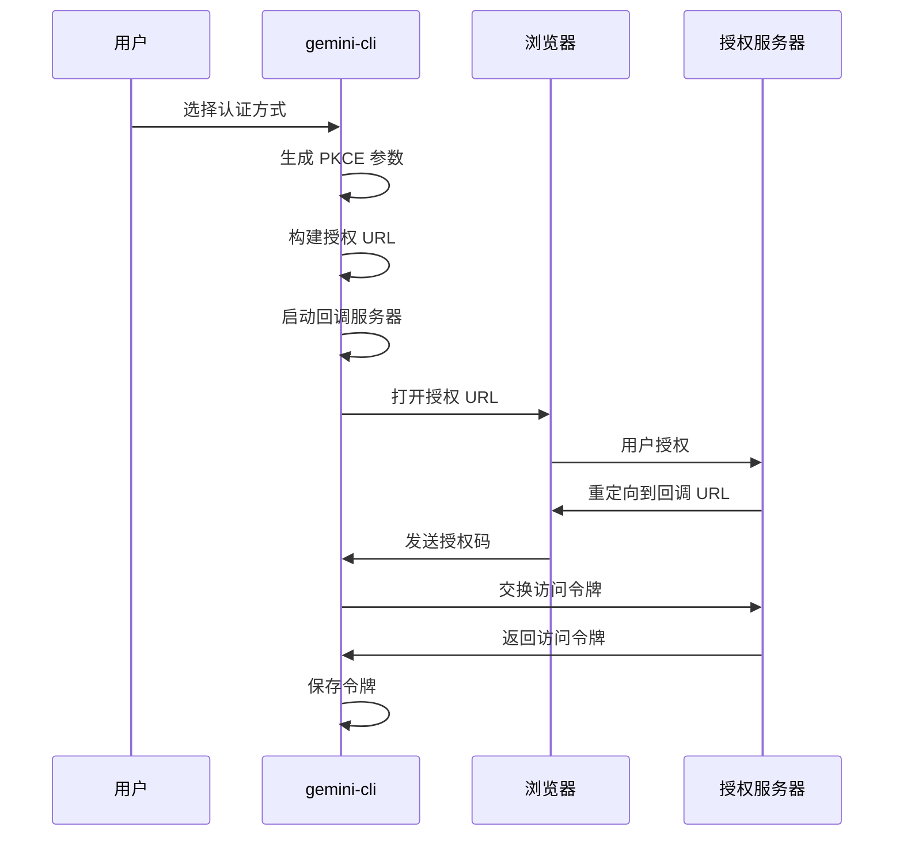
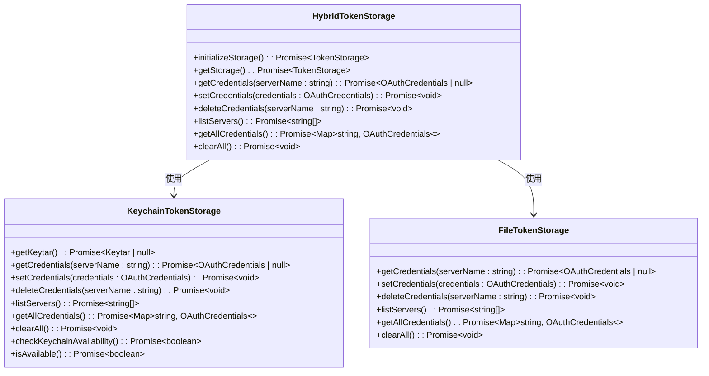
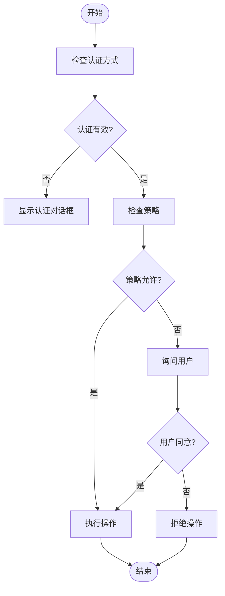

# 认证与安全

<cite>
**本文档引用的文件**  
- [auth.ts](file://packages/cli/src/config/auth.ts)
- [AuthDialog.tsx](file://packages/cli/src/ui/auth/AuthDialog.tsx)
- [oauth-credential-storage.ts](file://packages/core/src/code_assist/oauth-credential-storage.ts)
- [hybrid-token-storage.ts](file://packages/core/src/mcp/token-storage/hybrid-token-storage.ts)
- [keychain-token-storage.ts](file://packages/core/src/mcp/token-storage/keychain-token-storage.ts)
- [oauth-provider.ts](file://packages/core/src/mcp/oauth-provider.ts)
- [oauth-token-storage.ts](file://packages/core/src/mcp/oauth-token-storage.ts)
- [settings.ts](file://packages/cli/src/config/settings.ts)
- [policy-engine.ts](file://packages/core/src/policy/policy-engine.ts)
- [userAccountManager.ts](file://packages/core/src/utils/userAccountManager.ts)
</cite>

## 目录
1. [简介](#简介)
2. [认证方式](#认证方式)
3. [认证流程](#认证流程)
4. [令牌存储机制](#令牌存储机制)
5. [安全特性](#安全特性)
6. [认证管理命令](#认证管理命令)
7. [故障排除](#故障排除)
8. [结论](#结论)

## 简介
gemini-cli 提供了多种认证方式，确保用户能够安全地访问 Google 服务和相关资源。本指南详细介绍了支持的认证方法、认证流程、令牌存储机制以及相关的安全实践。通过理解这些机制，用户可以更好地管理自己的认证状态，并确保数据的安全性。

## 认证方式
gemini-cli 支持以下几种认证方式：

- **Google 账户 OAuth**：通过 Google 账户进行 OAuth 认证。
- **服务账户（SA）**：使用服务账户进行认证。
- **IDE 集成认证**：在 IDE 中集成认证。

这些认证方式适用于不同的场景，用户可以根据需要选择合适的认证方式。

**Section sources**
- [auth.ts](file://packages/cli/src/config/auth.ts#L6-L43)
- [AuthDialog.tsx](file://packages/cli/src/ui/auth/AuthDialog.tsx#L44-L199)

## 认证流程
当用户触发登录时，gemini-cli 会启动认证流程。以下是认证流程的详细步骤：

1. **用户选择认证方式**：用户在界面中选择认证方式，如 Google 账户 OAuth 或服务账户。
2. **生成 PKCE 参数**：系统生成 PKCE（Proof Key for Code Exchange）参数，包括 code verifier、code challenge 和 state。
3. **构建授权 URL**：根据配置生成授权 URL，并包含 PKCE 参数。
4. **启动回调服务器**：启动本地 HTTP 服务器以处理 OAuth 回调。
5. **打开浏览器**：自动打开浏览器并导航到授权 URL。
6. **用户授权**：用户在浏览器中完成授权操作。
7. **接收授权码**：回调服务器接收到授权码。
8. **交换令牌**：使用授权码与令牌端点交换访问令牌。
9. **保存令牌**：将获取到的令牌保存到本地存储中。



**Diagram sources**
- [oauth-provider.ts](file://packages/core/src/mcp/oauth-provider.ts#L700-L799)
- [oauth-token-storage.ts](file://packages/core/src/mcp/oauth-token-storage.ts#L150-L225)

## 令牌存储机制
gemini-cli 使用混合令牌存储机制来管理用户的认证令牌。该机制优先使用系统的密钥链（keychain）进行存储，如果密钥链不可用，则退回到加密文件存储。

### 混合令牌存储
`HybridTokenStorage` 类负责管理令牌的存储。它首先尝试使用 `KeychainTokenStorage`，如果失败则使用 `FileTokenStorage`。



**Diagram sources**
- [hybrid-token-storage.ts](file://packages/core/src/mcp/token-storage/hybrid-token-storage.ts#L0-L97)
- [keychain-token-storage.ts](file://packages/core/src/mcp/token-storage/keychain-token-storage.ts#L0-L251)
- [base-token-storage.ts](file://packages/core/src/mcp/token-storage/base-token-storage.ts#L0-L48)

### 令牌存储类型
gemini-cli 支持两种令牌存储类型：
- **密钥链（Keychain）**：利用操作系统提供的安全存储功能。
- **加密文件（Encrypted File）**：将令牌存储在加密的文件中。

用户可以通过设置环境变量 `GEMINI_FORCE_FILE_STORAGE` 强制使用加密文件存储。

**Section sources**
- [hybrid-token-storage.ts](file://packages/core/src/mcp/token-storage/hybrid-token-storage.ts#L0-L97)
- [keychain-token-storage.ts](file://packages/core/src/mcp/token-storage/keychain-token-storage.ts#L0-L251)
- [types.ts](file://packages/core/src/mcp/token-storage/types.ts#L0-L42)

## 安全特性
gemini-cli 提供了多种安全特性，以确保用户的数据和操作安全。

### 敏感操作的用户确认
对于敏感操作，gemini-cli 会要求用户进行确认。这可以通过配置策略引擎来实现。

### 扩展权限控制
通过配置 `security.auth.enforcedType`，可以强制使用特定的认证方式。例如，在 `settings.json` 中设置：

```json
{
  "security": {
    "auth": {
      "enforcedType": "gemini-api-key"
    }
  }
}
```

### 数据隐私设置
用户可以通过配置 `privacy.usageStatisticsEnabled` 来控制是否启用使用统计信息收集。



**Diagram sources**
- [policy-engine.ts](file://packages/core/src/policy/policy-engine.ts#L0-L115)
- [types.ts](file://packages/core/src/policy/types.ts#L0-L55)
- [settings.ts](file://packages/cli/src/config/settings.ts#L0-L797)

## 认证管理命令
gemini-cli 提供了 `/auth` 命令来管理认证状态。用户可以使用该命令查看当前的认证状态、切换认证方式或清除认证信息。

### 查看认证状态
```bash
/auth status
```

### 切换认证方式
```bash
/auth select <auth-type>
```

### 清除认证信息
```bash
/auth clear
```

**Section sources**
- [auth.ts](file://packages/cli/src/config/auth.ts#L6-L43)
- [AuthDialog.tsx](file://packages/cli/src/ui/auth/AuthDialog.tsx#L44-L199)

## 故障排除
在使用 gemini-cli 时，可能会遇到一些常见的认证问题。以下是一些常见问题及其解决方案：

### 令牌过期
如果令牌过期，用户需要重新进行认证。可以通过以下命令清除旧的认证信息并重新登录：

```bash
/auth clear
/auth login
```

### 认证失败
如果认证失败，请检查以下几点：
- 确保网络连接正常。
- 检查授权 URL 是否正确。
- 确认客户端 ID 和密钥是否正确配置。

### 浏览器未自动打开
如果浏览器未能自动打开，可以手动复制授权 URL 并在浏览器中打开。

**Section sources**
- [oauth-provider.ts](file://packages/core/src/mcp/oauth-provider.ts#L700-L799)
- [oauth-token-storage.ts](file://packages/core/src/mcp/oauth-token-storage.ts#L150-L225)

## 结论
gemini-cli 提供了灵活且安全的认证机制，支持多种认证方式和详细的权限控制。通过理解认证流程和令牌存储机制，用户可以更好地管理自己的认证状态，并确保数据的安全性。同时，丰富的安全特性和故障排除指南帮助用户应对各种认证问题。