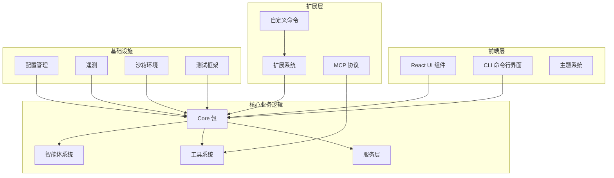
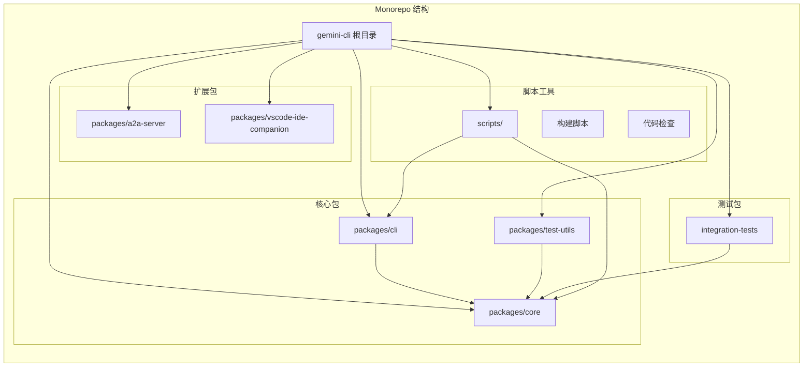
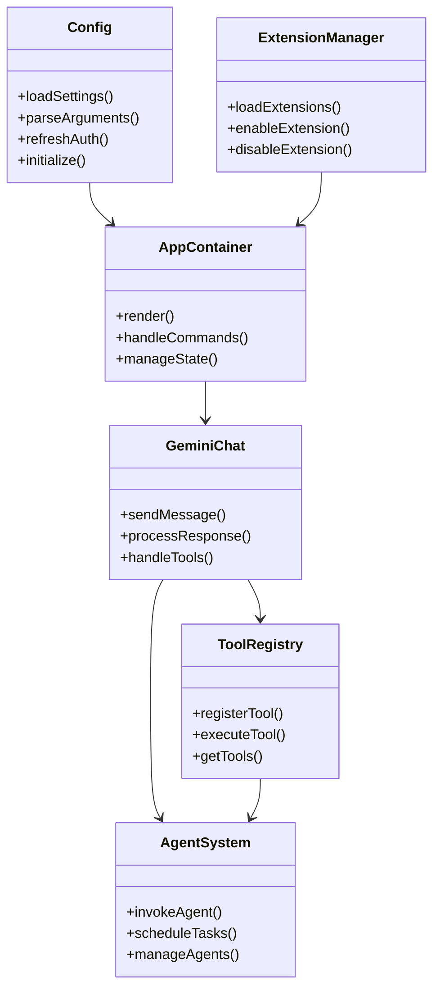
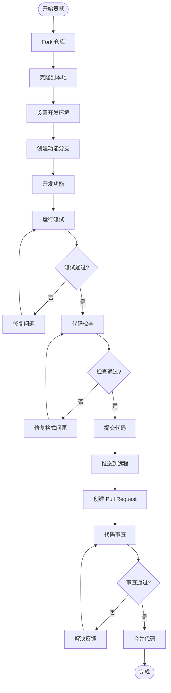
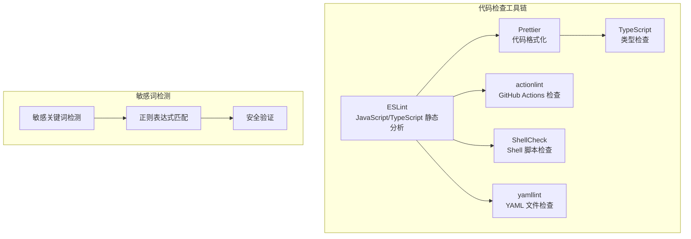
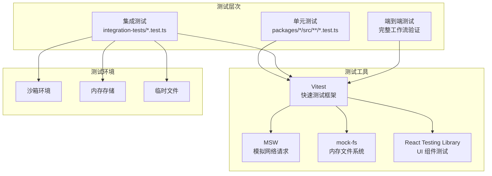
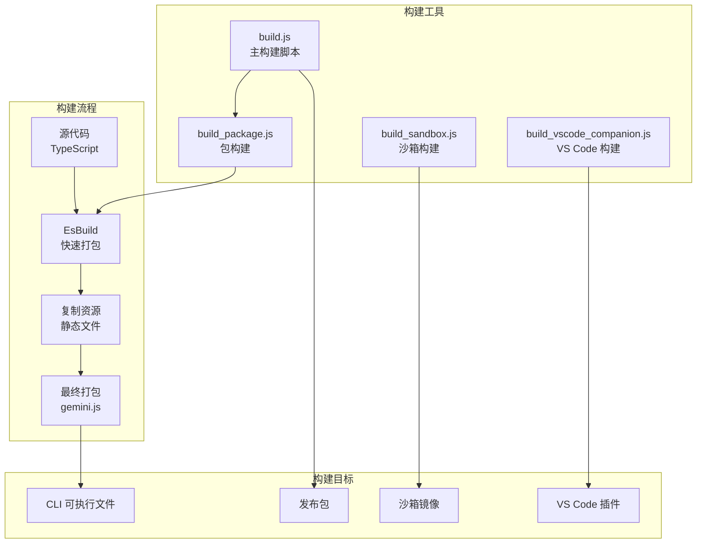
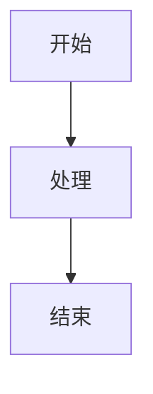

# 贡献者指南

<cite>
**本文档中引用的文件**
- [CONTRIBUTING.md](file://CONTRIBUTING.md)
- [README.md](file://README.md)
- [scripts/lint.js](file://scripts/lint.js)
- [esbuild.config.js](file://esbuild.config.js)
- [package.json](file://package.json)
- [integration-tests/vitest.config.ts](file://integration-tests/vitest.config.ts)
- [integration-tests/globalSetup.ts](file://integration-tests/globalSetup.ts)
- [packages/cli/package.json](file://packages/cli/package.json)
- [packages/core/package.json](file://packages/core/package.json)
- [packages/cli/src/gemini.tsx](file://packages/cli/src/gemini.tsx)
- [packages/core/src/index.ts](file://packages/core/src/index.ts)
</cite>

## 目录
1. [项目简介](#项目简介)
2. [开发环境设置](#开发环境设置)
3. [项目架构概览](#项目架构概览)
4. [代码贡献流程](#代码贡献流程)
5. [代码风格与规范](#代码风格与规范)
6. [测试策略](#测试策略)
7. [构建系统](#构建系统)
8. [调试指南](#调试指南)
9. [文档贡献](#文档贡献)
10. [社区行为准则](#社区行为准则)
11. [故障排除](#故障排除)

## 项目简介

Gemini CLI 是一个开源的 AI 代理项目，它将 Gemini 的强大功能直接带入您的终端。该项目采用现代化的 TypeScript 架构，支持多包工作区管理，提供了丰富的功能包括代码理解、自动化任务、文件操作、Shell 命令执行等。

### 核心特性
- **免费使用层**: 每分钟 60 次请求，每天 1,000 次请求
- **强大的 Gemini 2.5 Pro**: 支持 1M 令牌上下文窗口
- **内置工具**: Google 搜索、文件操作、Shell 命令、网络抓取
- **可扩展性**: 支持 MCP（模型上下文协议）用于自定义集成
- **终端优先**: 专为生活在命令行中的开发者设计

**章节来源**
- [README.md](file://README.md#L1-L50)

## 开发环境设置

### 系统要求

**前置条件：**
1. **Node.js**: 使用 Node.js `~20.19.0` 版本进行开发（特定版本要求由于上游开发依赖问题）
2. **Git**: 用于版本控制
3. **npm**: 包管理器

### 环境配置

#### 1. 克隆仓库
```bash
git clone https://github.com/google-gemini/gemini-cli.git # 或您的 fork 的 URL
cd gemini-cli
```

#### 2. 安装依赖
```bash
npm install
```

#### 3. 设置环境变量
建议在 `~/.env` 文件中设置以下环境变量：
```bash
# 启用沙箱模式
GEMINI_SANDBOX=true

# API 密钥（如果需要）
GEMINI_API_KEY="your_api_key_here"

# Google Cloud 项目（企业用户）
GOOGLE_CLOUD_PROJECT="your_project_id"
```

#### 4. 构建项目
```bash
# 构建所有包
npm run build

# 或仅构建核心包
npm run build:packages
```

#### 5. 运行项目
```bash
# 启动 CLI
npm start

# 调试模式启动
npm run debug
```

**章节来源**
- [CONTRIBUTING.md](file://CONTRIBUTING.md#L100-L150)
- [package.json](file://package.json#L1-L50)

## 项目架构概览

### 整体架构



**图表来源**
- [packages/cli/src/gemini.tsx](file://packages/cli/src/gemini.tsx#L1-L50)
- [packages/core/src/index.ts](file://packages/core/src/index.ts#L1-L30)

### 包结构

项目采用 monorepo 结构，主要包含以下核心包：



**图表来源**
- [package.json](file://package.json#L10-L15)
- [packages/cli/package.json](file://packages/cli/package.json#L1-L20)
- [packages/core/package.json](file://packages/core/package.json#L1-L20)

### 核心组件关系



**图表来源**
- [packages/cli/src/gemini.tsx](file://packages/cli/src/gemini.tsx#L100-L200)
- [packages/core/src/index.ts](file://packages/core/src/index.ts#L50-L100)

**章节来源**
- [packages/cli/src/gemini.tsx](file://packages/cli/src/gemini.tsx#L1-L100)
- [packages/core/src/index.ts](file://packages/core/src/index.ts#L1-L50)

## 代码贡献流程

### 贡献流程概述



### 具体步骤

#### 1. 自动化预检检查
在提交代码前，请务必运行预检检查：
```bash
npm run preflight
```

这将执行以下检查：
- 代码格式化（Prettier）
- ESLint 静态分析
- 类型检查（TypeScript）
- 所有单元测试
- 集成测试
- 代码质量检查

#### 2. 提交规范
遵循 Conventional Commits 标准：
- **功能添加**: `feat(package-name): 添加新功能描述`
- **错误修复**: `fix(package-name): 修复问题描述`
- **文档更新**: `docs(package-name): 更新文档`
- **样式更改**: `style(package-name): 格式化代码`
- **重构**: `refactor(package-name): 重构代码`
- **测试**: `test(package-name): 添加或修改测试`

#### 3. Pull Request 规范

##### 必填项：
- **链接现有问题**: 所有 PR 应该链接到现有的问题跟踪器
- **保持小而专注**: 创建解决单一问题或添加单个功能的小型 PR
- **清晰的标题和描述**: 解释变更的"为什么"并链接到相关问题

##### 可选但推荐：
- **使用草稿 PR**: 如果需要早期反馈，使用 GitHub 的草稿 Pull Request 功能
- **更新文档**: 如果引入用户可见的变更，更新相关文档

**章节来源**
- [CONTRIBUTING.md](file://CONTRIBUTING.md#L20-L100)

## 代码风格与规范

### 代码检查工具

项目使用多种工具确保代码质量和一致性：



**图表来源**
- [scripts/lint.js](file://scripts/lint.js#L1-L50)

### 代码风格规则

#### 1. ESLint 配置
项目使用严格的 ESLint 规则集，包括：
- React Hooks 规则
- Import 排序规则
- 许可证头部规则
- 代码风格约定

#### 2. Prettier 配置
- **缩进**: 2 个空格
- **引号**: 单引号
- **分号**: 无分号
- **尾随逗号**: ES5 格式

#### 3. TypeScript 规则
- 强制类型声明
- 严格模式
- 禁止隐式 any
- 适当的接口命名

### 代码组织原则

#### 1. 文件结构
```
packages/
├── cli/                    # CLI 主程序
│   ├── src/
│   │   ├── commands/       # 命令处理器
│   │   ├── config/         # 配置管理
│   │   ├── ui/            # 用户界面
│   │   └── utils/         # 工具函数
├── core/                  # 核心业务逻辑
│   ├── src/
│   │   ├── agents/        # 智能体系统
│   │   ├── tools/         # 工具定义
│   │   ├── services/      # 服务层
│   │   └── utils/         # 通用工具
└── test-utils/           # 测试工具包
```

#### 2. 导入路径
- 使用绝对导入路径
- 避免相对导入跨包依赖
- 遵循模块边界原则

**章节来源**
- [scripts/lint.js](file://scripts/lint.js#L1-L100)
- [package.json](file://package.json#L80-L120)

## 测试策略

### 测试架构



**图表来源**
- [integration-tests/vitest.config.ts](file://integration-tests/vitest.config.ts#L1-L25)
- [integration-tests/globalSetup.ts](file://integration-tests/globalSetup.ts#L1-L50)

### 单元测试

#### 运行方式
```bash
# 运行所有包的单元测试
npm run test

# 运行特定包的测试
npm run test --workspace @google/gemini-cli-core

# CI 环境运行
npm run test:ci
```

#### 测试覆盖率
- **最小覆盖率**: 80%
- **关键路径**: 100%
- **UI 组件**: 90%

### 集成测试

#### 运行方式
```bash
# 运行所有集成测试
npm run test:e2e

# 运行特定沙箱模式的测试
npm run test:integration:sandbox:none
npm run test:integration:sandbox:docker
npm run test:integration:sandbox:podman

# 运行所有沙箱模式的测试
npm run test:integration:all
```

#### 测试配置
- **超时时间**: 5 分钟
- **重试次数**: 2 次
- **并发线程**: 8-16 个
- **文件并行处理**: 支持

### 测试实用工具

#### 全局设置
集成测试使用全局设置来管理测试环境：
```typescript
// 全局测试设置
export async function setup() {
  // 创建临时测试目录
  runDir = join(integrationTestsDir, `${Date.now()}`);
  await mkdir(runDir, { recursive: true });
  
  // 设置环境变量
  process.env.INTEGRATION_TEST_FILE_DIR = runDir;
  process.env.GEMINI_CLI_INTEGRATION_TEST = 'true';
}
```

#### 测试清理
自动清理旧的测试运行：
- 保留最近 5 次测试运行用于调试
- 清理过期的测试输出
- 恢复原始状态

**章节来源**
- [integration-tests/vitest.config.ts](file://integration-tests/vitest.config.ts#L1-L25)
- [integration-tests/globalSetup.ts](file://integration-tests/globalSetup.ts#L1-L100)

## 构建系统

### 构建架构



**图表来源**
- [esbuild.config.js](file://esbuild.config.js#L1-L50)
- [package.json](file://package.json#L20-L60)

### 构建脚本详解

#### 1. EsBuild 配置
```javascript
// 主要配置
esbuild.build({
  entryPoints: ['packages/cli/index.ts'],
  bundle: true,
  outfile: 'bundle/gemini.js',
  platform: 'node',
  format: 'esm',
  external: ['@lydell/node-pty'], // 外部依赖
  define: {
    'process.env.CLI_VERSION': JSON.stringify(pkg.version),
  },
});
```

#### 2. 构建命令
```bash
# 基础构建
npm run build

# 构建所有包
npm run build:packages

# 构建沙箱容器
npm run build:sandbox

# 构建 VS Code 插件
npm run build:vscode

# 构建全部
npm run build:all
```

#### 3. 开发构建
```bash
# 开发模式构建
DEV=true npm run bundle

# 生成构建元数据
npm run bundle
```

### 沙箱构建

#### 沙箱类型
- **macOS Seatbelt**: 基于系统沙箱
- **Docker**: 容器化沙箱
- **Podman**: 容器化沙箱（Linux）

#### 沙箱配置
```bash
# 启用沙箱
export GEMINI_SANDBOX=true

# 指定容器运行时
export GEMINI_SANDBOX=docker

# 自定义沙箱配置
export SANDBOX_MOUNTS="/host/path:/container/path"
export SANDBOX_ENV="CUSTOM_VAR=value"
```

**章节来源**
- [esbuild.config.js](file://esbuild.config.js#L1-L65)
- [package.json](file://package.json#L20-L70)

## 调试指南

### VS Code 调试配置

#### 1. 启动调试
```bash
# 调试模式启动
npm run debug

# 或使用 VS Code 启动配置
npm start
```

#### 2. 断点设置
- **CLI 主程序**: `packages/cli/src/gemini.tsx`
- **核心逻辑**: `packages/core/src/**/*`
- **工具函数**: `packages/core/src/tools/**/*`

#### 3. 调试环境变量
```bash
# 启用详细日志
export DEBUG=1

# 启用 React DevTools
export DEV=true

# 启用调试模式
export GEMINI_DEBUG=true
```

### React DevTools 调试

#### 设置步骤
1. **启动 CLI**:
```bash
DEV=true npm start
```

2. **安装 React DevTools**:
```bash
npm install -g react-devtools@4.28.5
react-devtools
```

3. **连接调试器**: CLI 应用会自动连接到 React DevTools

### 沙箱调试

#### 容器内调试
```bash
# 启用沙箱调试
DEBUG=1 gemini

# 查看沙箱日志
docker logs <container_id>
```

#### 沙箱配置
```bash
# 自定义沙箱配置
export SANDBOX_DOCKERFILE="./custom.Dockerfile"
export SANDBOX_BASHRC="./custom.bashrc"
```

### 日志和监控

#### 日志级别
```bash
# 错误级别
console.error('错误信息')

# 警告级别
console.warn('警告信息')

# 信息级别
console.info('信息')

# 调试级别
console.debug('调试信息')
```

#### 遥测数据
- **会话统计**: 自动收集使用统计
- **性能指标**: 请求响应时间
- **错误报告**: 异常追踪

**章节来源**
- [CONTRIBUTING.md](file://CONTRIBUTING.md#L200-L250)
- [packages/cli/src/gemini.tsx](file://packages/cli/src/gemini.tsx#L100-L150)

## 文档贡献

### 文档结构

项目文档采用多层次结构：
- **README.md**: 项目概述和快速入门
- **CONTRIBUTING.md**: 贡献指南
- **docs/**: 详细文档目录
- **GEMINI.md**: 项目特定文档

### 文档类型

#### 1. 功能文档
- **命令参考**: `docs/cli/commands.md`
- **配置指南**: `docs/get-started/configuration.md`
- **工具文档**: `docs/tools/`

#### 2. 开发文档
- **架构文档**: `docs/architecture.md`
- **API 文档**: `docs/core/tools-api.md`
- **集成指南**: `docs/ide-integration/`

#### 3. 故障排除
- **常见问题**: `docs/faq.md`
- **故障排除**: `docs/troubleshooting.md`

### 文档贡献流程

#### 1. 文档更新
```bash
# 更新文档
npm run docs:update

# 验证文档格式
npm run docs:validate
```

#### 2. 文档测试
```bash
# 运行文档测试
npm run docs:test

# 生成文档站点
npm run docs:build
```

### 内容规范

#### 1. 标题层级
- **一级标题**: `# 标题名称`
- **二级标题**: `## 子标题`
- **三级标题**: `### 更细粒度标题`

#### 2. 代码示例
```markdown
```typescript
// TypeScript 示例
const example = 'code';
```

```bash
# Shell 命令示例
npm install
```
```

#### 3. 图表和可视化
使用 Mermaid 语法创建图表：


## 社区行为准则

### 行为准则

作为 Gemini CLI 项目的贡献者和参与者，我们承诺创造一个包容、尊重和协作的环境。

#### 我们承诺
- **尊重**: 尊重不同的观点和经验
- **包容**: 欢迎所有背景的人参与
- **建设性**: 提供建设性的反馈和批评
- **专业**: 保持专业和职业的行为

#### 我们期望
- **友善**: 对他人表现出友善和尊重
- **专业**: 在专业环境中进行交流
- **尊重**: 尊重不同观点和经验
- **建设性**: 提供建设性的反馈

#### 不当行为
- 使用冒犯性或侮辱性语言
- 人身攻击或政治攻击
- 公开或私下骚扰
- 发布他人私人信息
- 其他不专业的行为

### 贡献者协议

#### 1. CLA 要求
所有对项目的贡献必须附带 [Contributor License Agreement](https://cla.developers.google.com/about) (CLA)。

#### 2. 社区指南
项目遵循 [Google 的开源社区准则](https://opensource.google/conduct/)。

#### 3. 问题报告
- **Bug 报告**: 使用 GitHub Issues
- **功能请求**: 提出新的功能想法
- **安全漏洞**: 通过安全政策报告

### 沟通渠道

#### 1. 主要沟通渠道
- **GitHub Issues**: Bug 报告和功能请求
- **Pull Requests**: 代码贡献
- **Discussions**: 一般讨论和问答

#### 2. 社交媒体
- **Twitter**: @google_gemini
- **YouTube**: Gemini 官方频道

**章节来源**
- [CONTRIBUTING.md](file://CONTRIBUTING.md#L1-L20)

## 故障排除

### 常见问题

#### 1. 构建失败
```bash
# 清理构建缓存
npm run clean

# 重新安装依赖
npm install

# 重新构建
npm run build
```

#### 2. 测试失败
```bash
# 运行特定测试
npm run test -- --testNamePattern="测试名称"

# 查看详细日志
npm run test -- --verbose

# 运行失败的测试
npm run test -- --onlyChanged
```

#### 3. 沙箱问题
```bash
# 检查沙箱配置
export GEMINI_SANDBOX=true

# 重新构建沙箱
npm run build:sandbox

# 检查容器运行时
docker --version
podman --version
```

### 调试技巧

#### 1. 环境诊断
```bash
# 检查 Node.js 版本
node --version

# 检查 npm 版本
npm --version

# 检查环境变量
env | grep GEMINI
```

#### 2. 日志分析
```bash
# 查看构建日志
npm run build -- --verbose

# 查看测试日志
npm run test -- --reporter=verbose

# 查看调试日志
DEBUG=1 npm start
```

#### 3. 性能优化
```bash
# 启用性能分析
NODE_OPTIONS="--prof" npm start

# 查看内存使用
node --max-old-space-size=4096 dist/index.js
```

### 支持资源

#### 1. 文档资源
- **官方文档**: [docs/](./docs/)
- **API 参考**: [packages/core/src/](./packages/core/src/)
- **示例代码**: [integration-tests/](./integration-tests/)

#### 2. 社区支持
- **GitHub Discussions**: 一般讨论
- **Stack Overflow**: 技术问题
- **Slack**: 实时聊天

#### 3. 报告问题
- **Bug 报告**: 使用 `/bug` 命令
- **功能请求**: GitHub Issues
- **安全问题**: 私密报告

### 最佳实践

#### 1. 开发环境
- **定期更新**: 保持依赖最新
- **备份配置**: 备份重要配置文件
- **版本控制**: 使用 Git 管理代码

#### 2. 测试策略
- **持续测试**: 每次提交前运行测试
- **集成测试**: 定期运行完整测试套件
- **性能测试**: 监控性能回归

#### 3. 代码质量
- **代码审查**: 互相审查代码
- **静态分析**: 使用 ESLint 和 TypeScript
- **文档维护**: 保持文档同步更新

**章节来源**
- [CONTRIBUTING.md](file://CONTRIBUTING.md#L250-L310)