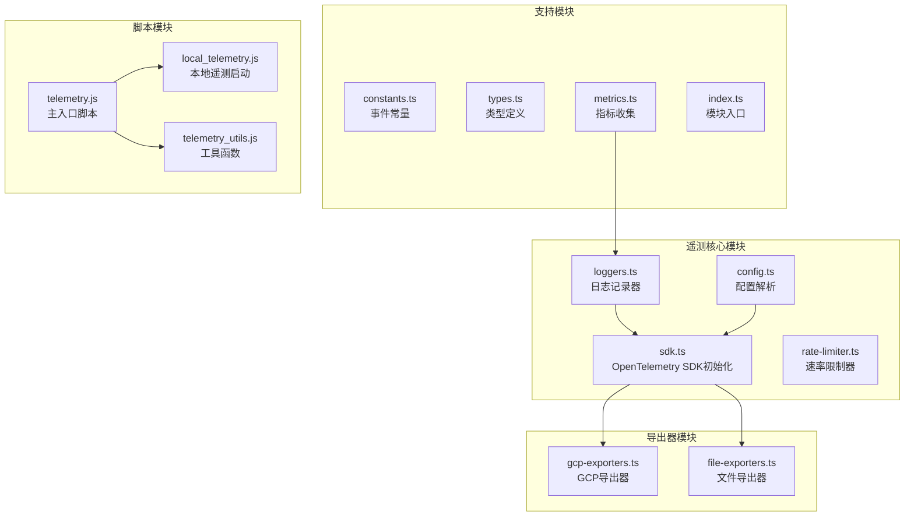
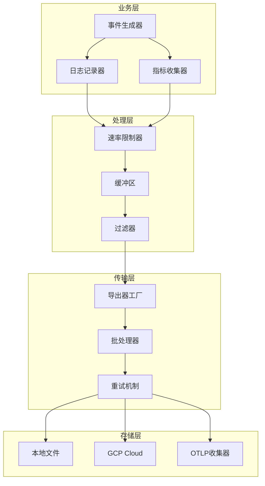
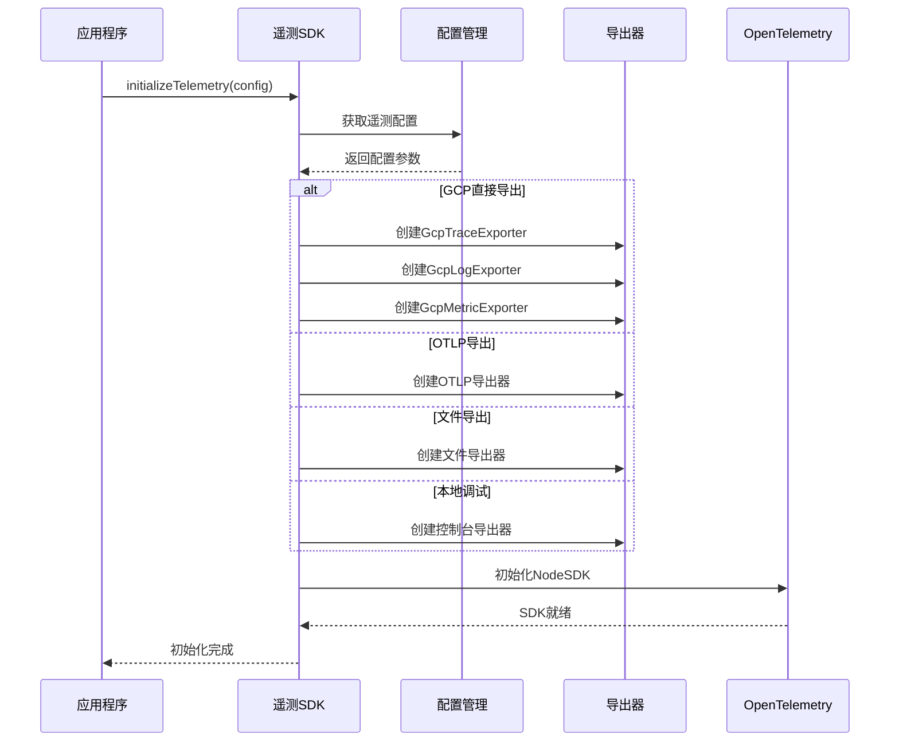
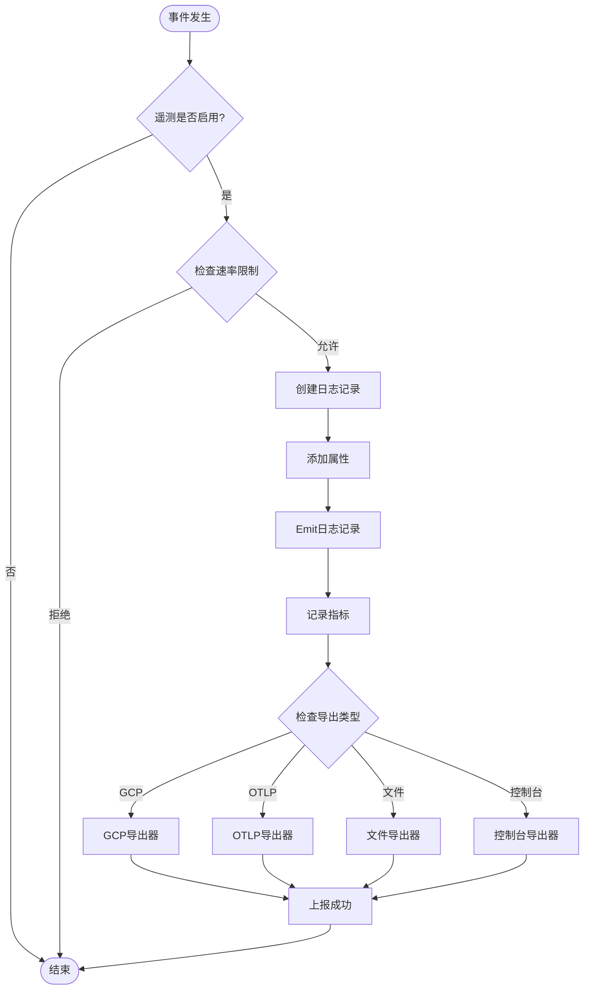
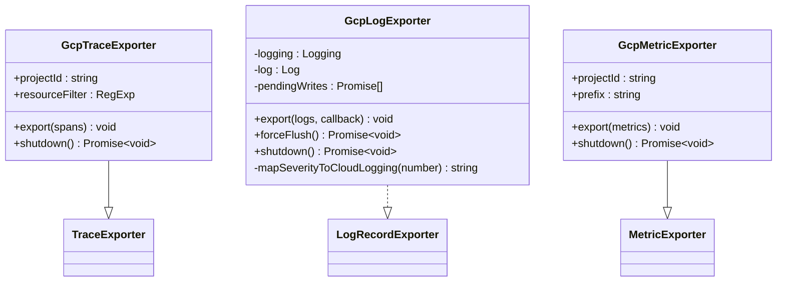
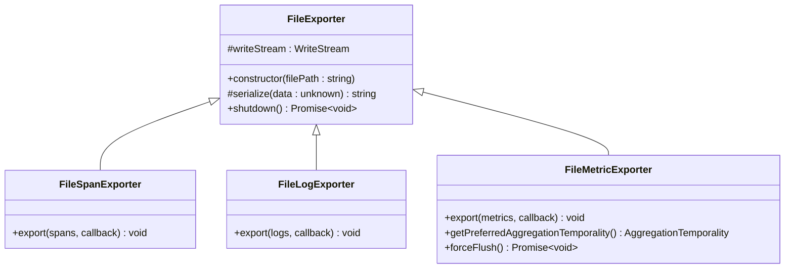
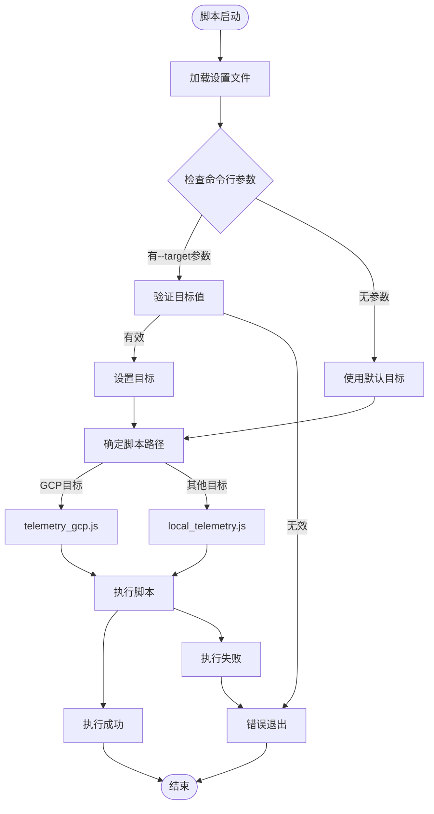
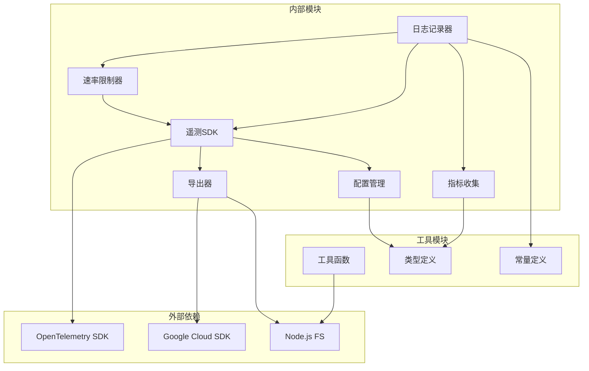

# 数据采集与上报机制

<cite>
**本文档中引用的文件**
- [packages/core/src/telemetry/sdk.ts](file://packages/core/src/telemetry/sdk.ts)
- [packages/core/src/telemetry/rate-limiter.ts](file://packages/core/src/telemetry/rate-limiter.ts)
- [packages/core/src/telemetry/loggers.ts](file://packages/core/src/telemetry/loggers.ts)
- [packages/core/src/telemetry/gcp-exporters.ts](file://packages/core/src/telemetry/gcp-exporters.ts)
- [packages/core/src/telemetry/file-exporters.ts](file://packages/core/src/telemetry/file-exporters.ts)
- [packages/core/src/telemetry/constants.ts](file://packages/core/src/telemetry/constants.ts)
- [packages/core/src/telemetry/types.ts](file://packages/core/src/telemetry/types.ts)
- [packages/core/src/telemetry/config.ts](file://packages/core/src/telemetry/config.ts)
- [packages/core/src/telemetry/metrics.ts](file://packages/core/src/telemetry/metrics.ts)
- [packages/core/src/telemetry/index.ts](file://packages/core/src/telemetry/index.ts)
- [scripts/telemetry.js](file://scripts/telemetry.js)
- [scripts/local_telemetry.js](file://scripts/local_telemetry.js)
- [scripts/telemetry_utils.js](file://scripts/telemetry_utils.js)
- [integration-tests/telemetry.test.ts](file://integration-tests/telemetry.test.ts)
</cite>

## 目录
1. [简介](#简介)
2. [项目结构](#项目结构)
3. [核心组件](#核心组件)
4. [架构概览](#架构概览)
5. [详细组件分析](#详细组件分析)
6. [依赖关系分析](#依赖关系分析)
7. [性能考虑](#性能考虑)
8. [故障排除指南](#故障排除指南)
9. [结论](#结论)

## 简介

Gemini CLI 的数据采集与上报机制是一个基于 OpenTelemetry 的完整遥测系统，负责收集、处理和上报各种类型的遥测数据。该系统提供了灵活的配置选项，支持多种导出目标（本地 OTLP 收集器、Google Cloud Platform 和文件导出），并实现了智能的速率限制和错误处理机制。

该系统的核心功能包括：
- 事件捕获：自动捕获用户交互、工具调用、API 请求等关键事件
- 缓冲管理：批量处理遥测数据以提高效率
- 速率限制：防止过度发送遥测数据
- 多种导出器：支持 GCP、本地 OTLP 和文件导出
- 错误处理：完善的重试和降级机制
- 性能监控：实时监控系统性能指标

## 项目结构

遥测系统的文件组织结构清晰，按功能模块进行分离：

**图表来源**
- [packages/core/src/telemetry/sdk.ts](file://packages/core/src/telemetry/sdk.ts#L1-L50)
- [packages/core/src/telemetry/loggers.ts](file://packages/core/src/telemetry/loggers.ts#L1-L50)
- [scripts/telemetry.js](file://scripts/telemetry.js#L1-L50)

**章节来源**
- [packages/core/src/telemetry/index.ts](file://packages/core/src/telemetry/index.ts#L1-L118)
- [scripts/telemetry.js](file://scripts/telemetry.js#L1-L86)

## 核心组件

### 遥测SDK（sdk.ts）

遥测SDK是整个系统的核心，负责初始化OpenTelemetry环境并配置各种导出器。

主要特性：
- **多协议支持**：同时支持gRPC和HTTP协议
- **智能路由**：根据配置自动选择合适的导出器
- **压缩优化**：对gRPC连接启用GZIP压缩
- **优雅关闭**：确保资源正确释放

### 速率限制器（rate-limiter.ts）

速率限制器确保遥测数据不会过于频繁地发送，避免对系统造成负担。

核心功能：
- **独立计时**：每个指标类型有独立的时间间隔
- **高优先级事件**：为关键事件提供更短的间隔
- **内存清理**：定期清理过期的记录时间
- **统计信息**：提供详细的使用统计

### 日志记录器（loggers.ts）

日志记录器负责将各种业务事件转换为标准化的日志格式。

支持的事件类型：
- 用户提示事件（USER_PROMPT）
- 工具调用事件（TOOL_CALL）
- API请求/响应事件（API_REQUEST/RESPONSE）
- 扩展管理事件（EXTENSION_*）
- 性能监控事件（PERFORMANCE_*）

**章节来源**
- [packages/core/src/telemetry/sdk.ts](file://packages/core/src/telemetry/sdk.ts#L1-L222)
- [packages/core/src/telemetry/rate-limiter.ts](file://packages/core/src/telemetry/rate-limiter.ts#L1-L123)
- [packages/core/src/telemetry/loggers.ts](file://packages/core/src/telemetry/loggers.ts#L1-L866)

## 架构概览

遥测系统采用分层架构设计，从底层的导出器到上层的业务逻辑，形成了完整的数据流管道：

**图表来源**
- [packages/core/src/telemetry/loggers.ts](file://packages/core/src/telemetry/loggers.ts#L50-L150)
- [packages/core/src/telemetry/rate-limiter.ts](file://packages/core/src/telemetry/rate-limiter.ts#L20-L80)
- [packages/core/src/telemetry/sdk.ts](file://packages/core/src/telemetry/sdk.ts#L80-L150)

## 详细组件分析

### 遥测SDK初始化流程

**图表来源**
- [packages/core/src/telemetry/sdk.ts](file://packages/core/src/telemetry/sdk.ts#L60-L180)

### 事件捕获与上报流程

**图表来源**
- [packages/core/src/telemetry/loggers.ts](file://packages/core/src/telemetry/loggers.ts#L80-L150)
- [packages/core/src/telemetry/rate-limiter.ts](file://packages/core/src/telemetry/rate-limiter.ts#L30-L60)

### GCP导出器实现

GCP导出器利用Google Cloud客户端库直接向Cloud Logging、Cloud Trace和Cloud Monitoring服务发送数据：

**图表来源**
- [packages/core/src/telemetry/gcp-exporters.ts](file://packages/core/src/telemetry/gcp-exporters.ts#L15-L50)
- [packages/core/src/telemetry/gcp-exporters.ts](file://packages/core/src/telemetry/gcp-exporters.ts#L50-L100)

### 文件导出器实现

文件导出器将遥测数据序列化为JSON格式并写入指定文件：

**图表来源**
- [packages/core/src/telemetry/file-exporters.ts](file://packages/core/src/telemetry/file-exporters.ts#L15-L40)
- [packages/core/src/telemetry/file-exporters.ts](file://packages/core/src/telemetry/file-exporters.ts#L40-L80)

**章节来源**
- [packages/core/src/telemetry/gcp-exporters.ts](file://packages/core/src/telemetry/gcp-exporters.ts#L1-L133)
- [packages/core/src/telemetry/file-exporters.ts](file://packages/core/src/telemetry/file-exporters.ts#L1-L94)

### 脚本执行流程

遥测脚本提供了灵活的配置和启动机制：

**图表来源**
- [scripts/telemetry.js](file://scripts/telemetry.js#L40-L80)

**章节来源**
- [scripts/telemetry.js](file://scripts/telemetry.js#L1-L86)
- [scripts/local_telemetry.js](file://scripts/local_telemetry.js#L1-L220)

## 依赖关系分析

遥测系统的依赖关系复杂但结构清晰：

**图表来源**
- [packages/core/src/telemetry/sdk.ts](file://packages/core/src/telemetry/sdk.ts#L1-L20)
- [packages/core/src/telemetry/loggers.ts](file://packages/core/src/telemetry/loggers.ts#L1-L30)

**章节来源**
- [packages/core/src/telemetry/index.ts](file://packages/core/src/telemetry/index.ts#L1-L118)

## 性能考虑

### 批处理优化

系统采用批处理机制来提高性能：

- **批量导出**：将多个遥测记录打包成单次网络请求
- **异步处理**：所有导出操作都是异步的，不阻塞主线程
- **内存管理**：定期清理过期数据，防止内存泄漏

### 压缩策略

- **GZIP压缩**：gRPC导出器自动启用GZIP压缩
- **JSON格式**：使用紧凑的JSON格式减少传输大小
- **增量更新**：只发送变化的指标数据

### 缓存机制

- **速率限制缓存**：缓存最近的记录时间
- **配置缓存**：避免重复解析配置文件
- **导出器缓存**：复用已创建的导出器实例

## 故障排除指南

### 常见问题及解决方案

1. **遥测未启用**
   - 检查配置文件中的`enabled`设置
   - 验证环境变量`GEMINI_TELEMETRY_ENABLED`
   - 确认命令行参数`--telemetry`

2. **导出失败**
   - 检查网络连接和防火墙设置
   - 验证GCP项目的权限配置
   - 查看日志文件中的错误信息

3. **性能影响**
   - 调整速率限制参数
   - 使用本地文件导出进行调试
   - 启用调试模式查看详细日志

### 调试技巧

- 启用调试模式：设置`debug_mode: true`
- 使用控制台导出器：便于快速验证
- 检查日志级别配置
- 监控系统资源使用情况

**章节来源**
- [packages/core/src/telemetry/config.ts](file://packages/core/src/telemetry/config.ts#L1-L121)
- [packages/core/src/telemetry/sdk.ts](file://packages/core/src/telemetry/sdk.ts#L180-L222)

## 结论

Gemini CLI的遥测系统是一个功能完善、设计精良的数据采集与上报平台。它通过以下特点确保了高效、可靠的数据处理：

### 主要优势

1. **模块化设计**：清晰的职责分离使得系统易于维护和扩展
2. **多目标支持**：灵活的配置选项适应不同的部署场景
3. **智能限流**：有效的速率限制保护系统资源
4. **错误处理**：完善的异常处理和重试机制
5. **性能优化**：批处理、压缩等优化技术提升效率

### 最佳实践建议

1. **合理配置速率限制**：根据实际需求调整间隔时间
2. **选择合适的导出器**：生产环境推荐使用GCP导出器
3. **监控系统性能**：定期检查遥测系统的资源消耗
4. **定期清理日志**：避免长期运行导致磁盘空间不足
5. **备份配置文件**：重要配置变更前做好备份

该遥测系统为Gemini CLI提供了强大的可观测性支持，帮助开发者深入了解系统行为、诊断问题并持续改进产品性能。