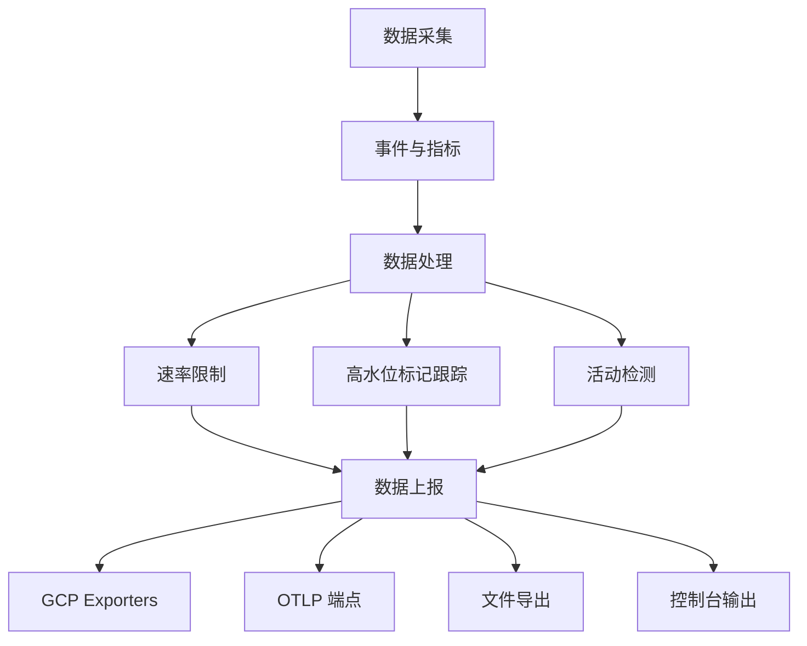

# 遥测与监控

<cite>
**本文档引用的文件**  
- [sdk.ts](file://packages/core/src/telemetry/sdk.ts)
- [config.ts](file://packages/core/src/telemetry/config.ts)
- [constants.ts](file://packages/core/src/telemetry/constants.ts)
- [types.ts](file://packages/core/src/telemetry/types.ts)
- [metrics.ts](file://packages/core/src/telemetry/metrics.ts)
- [loggers.ts](file://packages/core/src/telemetry/loggers.ts)
- [activity-detector.ts](file://packages/core/src/telemetry/activity-detector.ts)
- [high-water-mark-tracker.ts](file://packages/core/src/telemetry/high-water-mark-tracker.ts)
- [rate-limiter.ts](file://packages/core/src/telemetry/rate-limiter.ts)
- [gcp-exporters.ts](file://packages/core/src/telemetry/gcp-exporters.ts)
- [telemetry.test.ts](file://integration-tests/telemetry.test.ts)
</cite>

## 目录
1. [引言](#引言)
2. [遥测数据收集目的与隐私保护](#遥测数据收集目的与隐私保护)
3. [遥测SDK架构](#遥测sdk架构)
4. [支持的遥测后端与配置选项](#支持的遥测后端与配置选项)
5. [关键指标收集](#关键指标收集)
6. [用户控制与数据查看](#用户控制与数据查看)
7. [开发者指南](#开发者指南)
8. [结论](#结论)

## 引言
本文档全面介绍了 Gemini CLI 项目的遥测与监控系统。该系统旨在通过收集使用数据来改进产品功能、监控性能表现，并为用户提供透明的隐私控制。文档详细说明了遥测SDK的架构、数据处理流程、支持的后端以及如何在代码中添加新的遥测事件。

## 遥测数据收集目的与隐私保护
遥测系统的主要目的是收集匿名的使用数据，以帮助改进产品功能和用户体验。收集的数据用于分析命令使用频率、响应延迟、错误率等关键性能指标，从而识别瓶颈并优化系统性能。同时，系统严格遵守隐私保护原则，所有数据收集均遵循用户同意原则，并提供明确的选项让用户查看、控制和禁用遥测数据收集。

**Section sources**
- [sdk.ts](file://packages/core/src/telemetry/sdk.ts#L0-L222)
- [config.ts](file://packages/core/src/telemetry/config.ts#L0-L120)

## 遥测SDK架构
遥测SDK基于 OpenTelemetry 构建，采用模块化设计，包含数据采集、处理和上报三个主要流程。数据采集通过事件和指标的形式进行，处理阶段包括速率限制和高水位标记跟踪，上报则支持多种后端，如 GCP Exporters 和 OTLP 端点。

**Diagram sources**
- [sdk.ts](file://packages/core/src/telemetry/sdk.ts#L0-L222)
- [rate-limiter.ts](file://packages/core/src/telemetry/rate-limiter.ts#L0-L124)
- [high-water-mark-tracker.ts](file://packages/core/src/telemetry/high-water-mark-tracker.ts#L0-L100)
- [activity-detector.ts](file://packages/core/src/telemetry/activity-detector.ts#L0-L70)

**Section sources**
- [sdk.ts](file://packages/core/src/telemetry/sdk.ts#L0-L222)
- [rate-limiter.ts](file://packages/core/src/telemetry/rate-limiter.ts#L0-L124)
- [high-water-mark-tracker.ts](file://packages/core/src/telemetry/high-water-mark-tracker.ts#L0-L100)
- [activity-detector.ts](file://packages/core/src/telemetry/activity-detector.ts#L0-L70)

## 支持的遥测后端与配置选项
遥测系统支持多种后端，包括 GCP Exporters、OTLP 端点、文件导出和控制台输出。配置选项允许用户通过环境变量或配置文件设置遥测目标、OTLP 端点、协议等。例如，可以通过设置 `GEMINI_TELEMETRY_TARGET` 环境变量为 `gcp` 或 `local` 来选择遥测目标。

**Section sources**
- [sdk.ts](file://packages/core/src/telemetry/sdk.ts#L0-L222)
- [config.ts](file://packages/core/src/telemetry/config.ts#L0-L120)
- [gcp-exporters.ts](file://packages/core/src/telemetry/gcp-exporters.ts#L0-L100)

## 关键指标收集
系统收集的关键指标包括命令使用频率、响应延迟、错误率、内存使用情况、CPU 使用率等。这些指标通过 OpenTelemetry 的计数器和直方图进行记录，并支持性能监控功能，如启动时间、工具队列深度和令牌效率。

**Section sources**
- [metrics.ts](file://packages/core/src/telemetry/metrics.ts#L0-L899)
- [constants.ts](file://packages/core/src/telemetry/constants.ts#L0-L43)

## 用户控制与数据查看
用户可以通过配置文件或命令行参数查看、控制和禁用遥测数据收集。例如，通过设置 `telemetry.enabled` 为 `false` 可以禁用遥测功能。此外，系统提供了日志记录功能，用户可以在调试模式下查看遥测事件的详细信息。

**Section sources**
- [config.ts](file://packages/core/src/telemetry/config.ts#L0-L120)
- [sdk.ts](file://packages/core/src/telemetry/sdk.ts#L0-L222)

## 开发者指南
开发者可以通过调用 `logUserPrompt`、`logToolCall` 等函数在代码中添加新的遥测事件。这些函数会自动记录事件的时间戳、属性和上下文信息。此外，开发者还可以使用 `recordStartupPerformance` 等函数记录性能指标。

**Section sources**
- [loggers.ts](file://packages/core/src/telemetry/loggers.ts#L0-L799)
- [metrics.ts](file://packages/core/src/telemetry/metrics.ts#L0-L899)

## 结论
Gemini CLI 的遥测与监控系统提供了一套完整的解决方案，用于收集和分析使用数据，同时确保用户隐私。通过模块化的架构和灵活的配置选项，系统能够适应不同的部署环境和需求。开发者可以轻松地在代码中添加新的遥测事件，以支持更深入的性能分析和产品改进。