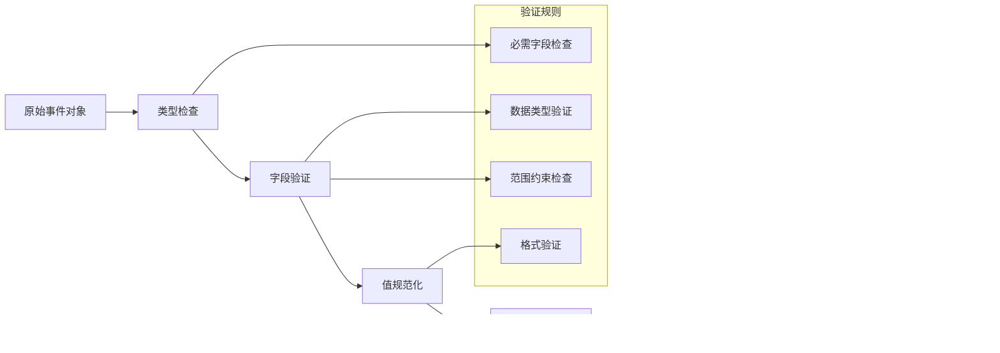

# 遥测数据模型

<cite>
**本文档引用的文件**
- [activity-types.ts](file://packages/core/src/telemetry/activity-types.ts)
- [event-metadata-key.ts](file://packages/core/src/telemetry/clearcut-logger/event-metadata-key.ts)
- [tool-call-decision.ts](file://packages/core/src/telemetry/tool-call-decision.ts)
- [types.ts](file://packages/core/src/telemetry/types.ts)
- [loggers.ts](file://packages/core/src/telemetry/loggers.ts)
- [rate-limiter.ts](file://packages/core/src/telemetry/rate-limiter.ts)
- [settingsSchema.ts](file://packages/cli/src/config/settingsSchema.ts)
- [telemetry.test.ts](file://integration-tests/telemetry.test.ts)
- [test-helper.ts](file://integration-tests/test-helper.ts)
</cite>

## 目录
1. [简介](#简介)
2. [项目结构](#项目结构)
3. [核心数据结构](#核心数据结构)
4. [架构概览](#架构概览)
5. [详细组件分析](#详细组件分析)
6. [依赖关系分析](#依赖关系分析)
7. [性能考虑](#性能考虑)
8. [故障排除指南](#故障排除指南)
9. [结论](#结论)

## 简介

Gemini CLI 的遥测系统是一个全面的数据收集和分析框架，用于跟踪用户活动、工具调用、API 调用以及系统性能指标。该系统设计为可扩展、高性能且符合隐私保护要求，支持多种导出格式和分析平台。

遥测系统的核心目标是：
- 收集用户交互数据以改进产品体验
- 监控系统性能和错误率
- 分析工具使用模式和效率
- 提供数据驱动的产品决策支持

## 项目结构

遥测系统的文件组织遵循模块化设计原则，主要组件分布在以下目录结构中：


**图表来源**
- [activity-types.ts](file://packages/core/src/telemetry/activity-types.ts#L1-L21)
- [types.ts](file://packages/core/src/telemetry/types.ts#L1-L50)
- [loggers.ts](file://packages/core/src/telemetry/loggers.ts#L1-L50)

**章节来源**
- [activity-types.ts](file://packages/core/src/telemetry/activity-types.ts#L1-L21)
- [types.ts](file://packages/core/src/telemetry/types.ts#L1-L729)

## 核心数据结构

### 活动类型枚举

遥测系统定义了八种核心用户活动类型，每种类型都有特定的业务含义：

```typescript
export enum ActivityType {
  USER_INPUT_START = 'user_input_start',
  USER_INPUT_END = 'user_input_end',
  MESSAGE_ADDED = 'message_added',
  TOOL_CALL_SCHEDULED = 'tool_call_scheduled',
  TOOL_CALL_COMPLETED = 'tool_call_completed',
  STREAM_START = 'stream_start',
  STREAM_END = 'stream_end',
  HISTORY_UPDATED = 'history_updated',
  MANUAL_TRIGGER = 'manual_trigger',
}
```

### 事件元数据键

Clearcut 日志系统定义了丰富的元数据键，用于记录会话配置、工具调用、API 请求等详细信息：

```typescript
export enum EventMetadataKey {
  GEMINI_CLI_START_SESSION_MODEL = 1,
  GEMINI_CLI_START_SESSION_EMBEDDING_MODEL = 2,
  GEMINI_CLI_START_SESSION_SANDBOX = 3,
  GEMINI_CLI_START_SESSION_CORE_TOOLS = 4,
  GEMINI_CLI_START_SESSION_APPROVAL_MODE = 5,
  GEMINI_CLI_START_SESSION_API_KEY_ENABLED = 6,
  GEMINI_CLI_START_SESSION_VERTEX_API_ENABLED = 7,
  GEMINI_CLI_START_SESSION_DEBUG_MODE_ENABLED = 8,
  GEMINI_CLI_START_SESSION_MCP_SERVERS = 9,
  GEMINI_CLI_START_SESSION_TELEMETRY_ENABLED = 10,
  GEMINI_CLI_START_SESSION_TELEMETRY_LOG_USER_PROMPTS_ENABLED = 11,
  GEMINI_CLI_START_SESSION_RESPECT_GITIGNORE = 12,
  GEMINI_CLI_START_SESSION_OUTPUT_FORMAT = 94,
  
  // 工具调用相关键
  GEMINI_CLI_TOOL_CALL_NAME = 14,
  GEMINI_CLI_TOOL_CALL_DECISION = 15,
  GEMINI_CLI_TOOL_CALL_SUCCESS = 16,
  GEMINI_CLI_TOOL_CALL_DURATION_MS = 17,
  GEMINI_CLI_TOOL_CALL_ERROR_TYPE = 19,
  GEMINI_CLI_TOOL_CALL_CONTENT_LENGTH = 93,
  
  // API 响应相关键
  GEMINI_CLI_API_RESPONSE_MODEL = 21,
  GEMINI_CLI_API_RESPONSE_STATUS_CODE = 22,
  GEMINI_CLI_API_RESPONSE_DURATION_MS = 23,
  GEMINI_CLI_API_RESPONSE_INPUT_TOKEN_COUNT = 25,
  GEMINI_CLI_API_RESPONSE_OUTPUT_TOKEN_COUNT = 26,
  GEMINI_CLI_API_RESPONSE_CACHED_TOKEN_COUNT = 27,
  GEMINI_CLI_API_RESPONSE_THINKING_TOKEN_COUNT = 28,
  GEMINI_CLI_API_RESPONSE_TOOL_TOKEN_COUNT = 29,
}
```

### 工具调用决策

系统通过 `ToolCallDecision` 枚举记录用户对工具调用的响应：

```typescript
export enum ToolCallDecision {
  ACCEPT = 'accept',
  REJECT = 'reject',
  MODIFY = 'modify',
  AUTO_ACCEPT = 'auto_accept',
}
```

**章节来源**
- [activity-types.ts](file://packages/core/src/telemetry/activity-types.ts#L10-L19)
- [event-metadata-key.ts](file://packages/core/src/telemetry/clearcut-logger/event-metadata-key.ts#L10-L199)
- [tool-call-decision.ts](file://packages/core/src/telemetry/tool-call-decision.ts#L8-L12)

## 架构概览

遥测系统采用分层架构设计，确保数据收集、处理和导出的高效性和可靠性：


**图表来源**
- [loggers.ts](file://packages/core/src/telemetry/loggers.ts#L1-L100)
- [types.ts](file://packages/core/src/telemetry/types.ts#L650-L729)

## 详细组件分析

### 事件类型系统

遥测系统支持超过 30 种不同类型的事件，每种事件都有特定的用途和数据结构：

#### 会话管理事件


**图表来源**
- [types.ts](file://packages/core/src/telemetry/types.ts#L25-L85)
- [types.ts](file://packages/core/src/telemetry/types.ts#L87-L95)

#### 工具调用事件

工具调用事件记录详细的工具执行信息：


**图表来源**
- [types.ts](file://packages/core/src/telemetry/types.ts#L105-L170)
- [tool-call-decision.ts](file://packages/core/src/telemetry/tool-call-decision.ts#L14-L32)

#### API 调用事件

API 调用事件跟踪所有外部服务交互：


**图表来源**
- [types.ts](file://packages/core/src/telemetry/types.ts#L200-L250)
- [types.ts](file://packages/core/src/telemetry/types.ts#L252-L300)

**章节来源**
- [types.ts](file://packages/core/src/telemetry/types.ts#L25-L300)

### 数据验证和序列化

遥测系统实现了严格的数据验证机制，确保事件数据的完整性和一致性：

#### JSON 序列化流程



#### 敏感数据处理

系统自动识别并处理可能包含敏感信息的数据字段：

```typescript
// 示例：提示文本脱敏
if (shouldLogUserPrompts(config)) {
  attributes['prompt'] = event.prompt;
} else {
  // 只记录长度而不记录具体内容
  attributes['prompt_length'] = event.prompt_length;
}
```

**章节来源**
- [loggers.ts](file://packages/core/src/telemetry/loggers.ts#L100-L200)

### 速率限制机制

为了防止遥测数据过载，系统实现了智能速率限制：


**图表来源**
- [rate-limiter.ts](file://packages/core/src/telemetry/rate-limiter.ts#L10-L43)

**章节来源**
- [rate-limiter.ts](file://packages/core/src/telemetry/rate-limiter.ts#L1-L43)

## 依赖关系分析

遥测系统的组件间存在复杂的依赖关系，形成了一个协调工作的生态系统：


**图表来源**
- [types.ts](file://packages/core/src/telemetry/types.ts#L1-L20)
- [loggers.ts](file://packages/core/src/telemetry/loggers.ts#L1-L50)

**章节来源**
- [types.ts](file://packages/core/src/telemetry/types.ts#L1-L20)
- [loggers.ts](file://packages/core/src/telemetry/loggers.ts#L1-L50)

## 性能考虑

遥测系统在设计时充分考虑了性能影响，采用了多种优化策略：

### 异步处理

所有遥测数据收集都是异步进行的，不会阻塞主应用程序流程：

- 使用队列缓冲待处理事件
- 批量处理和导出数据
- 后台线程执行 I/O 操作

### 内存管理

系统实现了智能的内存管理策略：

- 事件缓冲区大小限制
- 自动清理过期数据
- 垃圾回收优化

### 网络优化

网络传输层面的优化包括：

- 数据压缩和编码
- 连接池复用
- 错误重试机制

## 故障排除指南

### 常见问题诊断

#### 遥测数据缺失

**症状**：预期的遥测事件没有出现在日志中

**排查步骤**：
1. 检查配置文件中的遥测启用状态
2. 验证网络连接和权限
3. 查看本地日志文件
4. 检查速率限制设置

#### 数据格式错误

**症状**：遥测数据无法正确解析

**解决方案**：
1. 验证 JSON 序列化逻辑
2. 检查字段类型匹配
3. 确认日期格式标准化

#### 性能影响

**症状**：遥测系统导致应用变慢

**优化措施**：
1. 调整速率限制参数
2. 减少不必要的事件记录
3. 优化批量处理大小

**章节来源**
- [telemetry.test.ts](file://integration-tests/telemetry.test.ts#L1-L27)
- [test-helper.ts](file://integration-tests/test-helper.ts#L423-L465)

## 结论

Gemini CLI 的遥测数据模型是一个功能完善、设计精良的系统，它成功地平衡了数据收集的全面性与系统性能的高效性。该系统的主要优势包括：

### 技术优势

1. **模块化设计**：清晰的组件分离使得系统易于维护和扩展
2. **类型安全**：完整的 TypeScript 类型定义确保了数据的一致性
3. **性能优化**：智能的速率限制和异步处理保证了最小的性能影响
4. **隐私保护**：内置的敏感数据脱敏机制符合隐私法规要求

### 功能特性

1. **全面覆盖**：支持从用户交互到系统性能的全方位监控
2. **灵活配置**：可定制的遥测选项满足不同场景需求
3. **多平台支持**：兼容多种导出格式和分析平台
4. **实时监控**：即时的数据收集和分析能力

### 最佳实践建议

1. **合理配置**：根据实际需求调整遥测粒度和频率
2. **定期审查**：定期评估遥测数据的有效性和必要性
3. **性能监控**：持续关注遥测系统自身的性能表现
4. **隐私合规**：确保遥测实践符合相关法律法规要求

该遥测系统为 Gemini CLI 提供了强大的数据洞察能力，是产品持续改进和用户体验优化的重要基础设施。