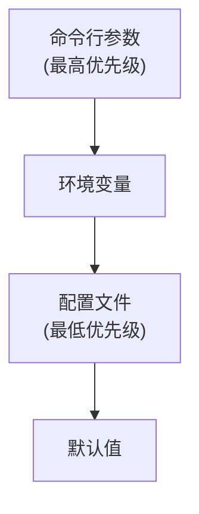
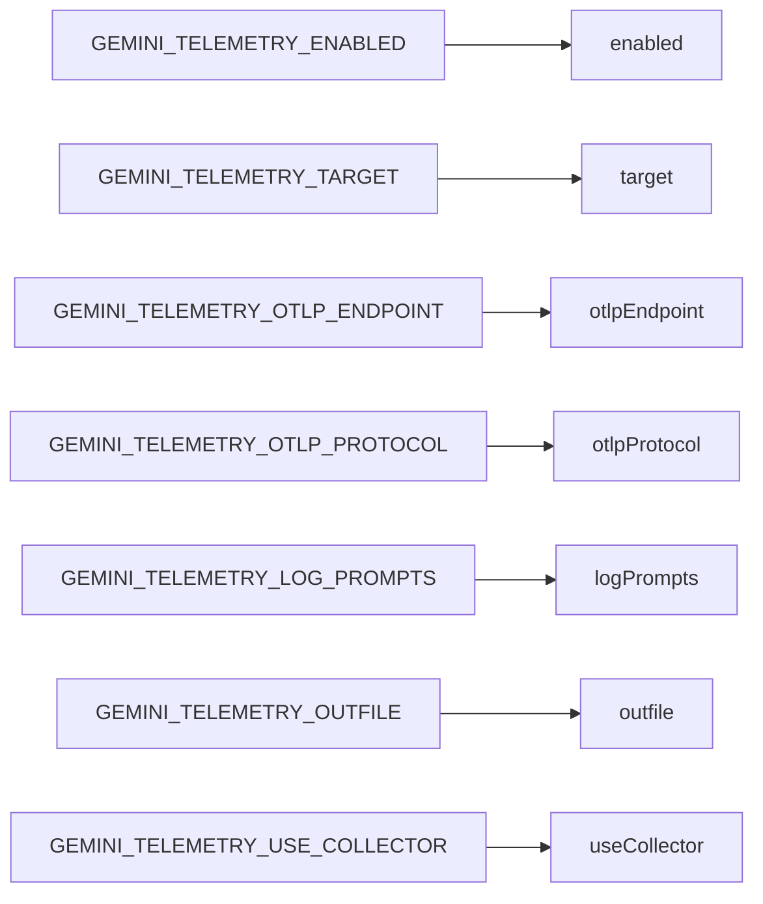
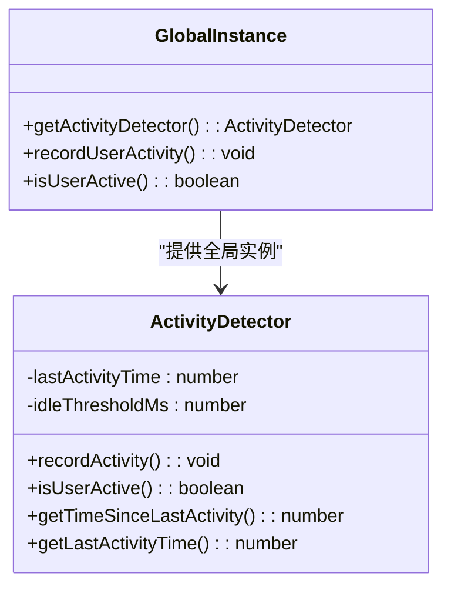
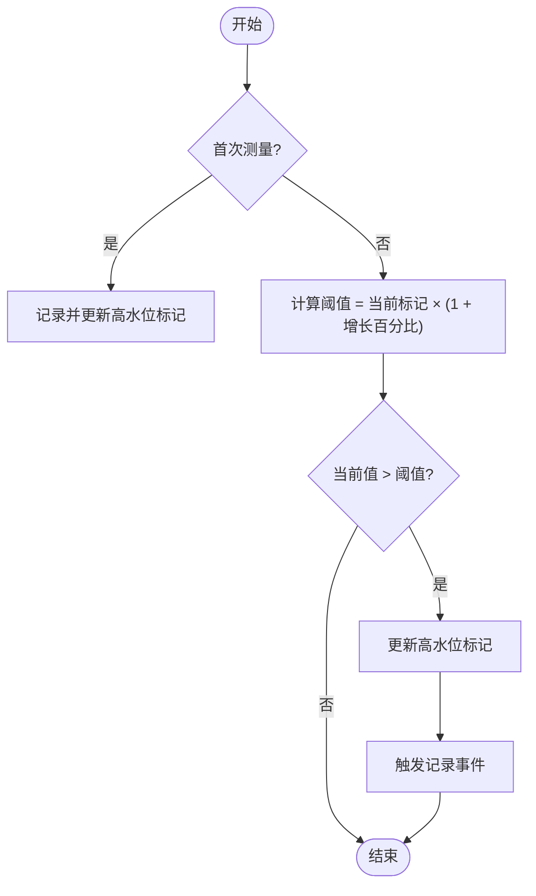

# 配置与用户控制

<cite>
**本文档中引用的文件**  
- [config.ts](file://packages/core/src/config/config.ts)
- [activity-detector.ts](file://packages/core/src/telemetry/activity-detector.ts)
- [high-water-mark-tracker.ts](file://packages/core/src/telemetry/high-water-mark-tracker.ts)
- [config.ts](file://packages/core/src/telemetry/config.ts)
- [sdk.ts](file://packages/core/src/telemetry/sdk.ts)
- [index.ts](file://packages/core/src/telemetry/index.ts)
- [constants.ts](file://packages/core/src/telemetry/constants.ts)
- [types.ts](file://packages/core/src/telemetry/types.ts)
- [loggers.ts](file://packages/core/src/telemetry/loggers.ts)
- [uiTelemetry.ts](file://packages/core/src/telemetry/uiTelemetry.ts)
- [tool-call-decision.ts](file://packages/core/src/telemetry/tool-call-decision.ts)
- [rate-limiter.ts](file://packages/core/src/telemetry/rate-limiter.ts)
- [activity-types.ts](file://packages/core/src/telemetry/activity-types.ts)
</cite>

## 目录
1. [引言](#引言)
2. [遥测系统配置](#遥测系统配置)
3. [活动检测器](#活动检测器)
4. [高水位标记跟踪器](#高水位标记跟踪器)
5. [CLI命令与配置示例](#cli命令与配置示例)
6. [隐私保护与合规性](#隐私保护与合规性)

## 引言
本文档详细说明了如何通过配置文件和命令行参数控制遥测系统的各项功能。文档涵盖了遥测系统的启用/禁用、上报频率设置、后端选择等核心配置选项，以及活动检测器和高水位标记跟踪器的工作原理。通过本指南，用户可以全面了解如何根据自身需求定制遥测行为，同时确保数据收集过程符合隐私保护要求。

## 遥测系统配置

遥测系统通过`TelemetrySettings`接口进行配置，支持多种配置方式，包括配置文件、环境变量和命令行参数。配置优先级遵循：命令行参数 > 环境变量 > 配置文件。

### 配置选项详解

| 配置项 | 类型 | 默认值 | 说明 |
|-------|------|-------|------|
| enabled | boolean | false | 是否启用遥测功能 |
| target | TelemetryTarget | LOCAL | 遥测数据上报目标（LOCAL/GCP） |
| otlpEndpoint | string | http://localhost:4317 | OTLP协议端点地址 |
| otlpProtocol | 'grpc' \| 'http' | grpc | OTLP协议类型 |
| logPrompts | boolean | true | 是否记录用户提示内容 |
| outfile | string | undefined | 输出文件路径（用于文件导出） |
| useCollector | boolean | false | 是否使用收集器 |

**配置来源优先级**


**环境变量映射**


**Diagram sources**
- [config.ts](file://packages/core/src/telemetry/config.ts#L30-L120)
- [config.ts](file://packages/core/src/config/config.ts#L384-L392)

**Section sources**
- [config.ts](file://packages/core/src/telemetry/config.ts#L30-L120)
- [config.ts](file://packages/core/src/config/config.ts#L384-L392)

## 活动检测器

活动检测器（ActivityDetector）用于识别用户活跃状态，从而优化数据收集策略。系统通过检测用户活动来决定何时进行内存监控和性能数据收集。

### 工作原理

活动检测器基于时间阈值判断用户是否处于活跃状态。当用户在指定时间内有操作行为时，被视为活跃用户。



### 核心方法

- **recordActivity()**: 记录用户活动时间戳
- **isUserActive()**: 判断用户是否处于活跃状态
- **getTimeSinceLastActivity()**: 获取距离上次活动的时间
- **getLastActivityTime()**: 获取上次活动的时间戳

默认空闲阈值为30秒（30000毫秒），可通过构造函数自定义。

**Diagram sources**
- [activity-detector.ts](file://packages/core/src/telemetry/activity-detector.ts#L10-L70)
- [activity-types.ts](file://packages/core/src/telemetry/activity-types.ts#L5-L20)

**Section sources**
- [activity-detector.ts](file://packages/core/src/telemetry/activity-detector.ts#L10-L70)

## 高水位标记跟踪器

高水位标记跟踪器（HighWaterMarkTracker）用于监控内存使用情况，仅在内存使用量显著增加时触发记录，避免产生过多冗余数据。

### 设计原理

跟踪器通过设置增长阈值百分比来判断是否需要记录新的高水位标记。只有当当前值超过当前高水位标记的指定百分比时，才会更新标记并触发记录。



### 配置参数

- **growthThresholdPercent**: 增长阈值百分比，默认为5%
- **maxAgeMs**: 最大存活时间，默认为1小时（3600000毫秒）

### 核心功能

- **shouldRecordMetric()**: 判断是否应记录指标
- **getHighWaterMark()**: 获取特定指标的高水位标记
- **getAllHighWaterMarks()**: 获取所有高水位标记
- **resetHighWaterMark()**: 重置特定指标的高水位标记
- **resetAllHighWaterMarks()**: 重置所有高水位标记
- **cleanup()**: 清理过期条目

**Diagram sources**
- [high-water-mark-tracker.ts](file://packages/core/src/telemetry/high-water-mark-tracker.ts#L10-L100)
- [rate-limiter.ts](file://packages/core/src/telemetry/rate-limiter.ts#L10-L124)

**Section sources**
- [high-water-mark-tracker.ts](file://packages/core/src/telemetry/high-water-mark-tracker.ts#L10-L100)

## CLI命令与配置示例

### 查看遥测状态

```bash
# 查看当前遥测配置状态
gemini config get telemetry

# 查看详细的遥测统计信息
gemini telemetry status
```

### 重置设置

```bash
# 重置所有遥测相关设置为默认值
gemini config reset telemetry

# 仅重置高水位标记
gemini telemetry reset-high-water-mark
```

### 完全禁用数据收集

```bash
# 通过命令行参数禁用
gemini --telemetry=false

# 通过环境变量禁用
export GEMINI_TELEMETRY_ENABLED=false
gemini

# 通过配置文件禁用
{
  "telemetry": {
    "enabled": false
  }
}
```

### 配置文件示例

```json
{
  "telemetry": {
    "enabled": true,
    "target": "gcp",
    "otlpEndpoint": "https://otel.example.com:4317",
    "otlpProtocol": "http",
    "logPrompts": false,
    "useCollector": true
  }
}
```

### 环境变量配置示例

```bash
# 设置遥测启用
export GEMINI_TELEMETRY_ENABLED=true

# 设置目标为GCP
export GEMINI_TELEMETRY_TARGET=gcp

# 设置OTLP端点
export GEMINI_TELEMETRY_OTLP_ENDPOINT=https://otel.example.com:4317

# 禁用提示记录
export GEMINI_TELEMETRY_LOG_PROMPTS=false
```

**Section sources**
- [config.ts](file://packages/core/src/telemetry/config.ts#L30-L120)
- [sdk.ts](file://packages/core/src/telemetry/sdk.ts#L50-L222)
- [index.ts](file://packages/core/src/telemetry/index.ts#L5-L117)

## 隐私保护与合规性

### 数据收集原则

本系统遵循最小化数据收集原则，仅收集必要的操作和性能数据用于产品改进。所有数据收集行为都严格遵守以下隐私保护措施：

1. **用户控制**: 用户可随时通过配置完全禁用遥测功能
2. **数据匿名化**: 收集的数据不包含个人身份信息
3. **内容保护**: 用户提示内容默认不记录，可通过`logPrompts`配置项控制
4. **本地优先**: 默认遥测目标为本地，确保数据不出内网

### 合规性声明

本遥测系统符合以下合规要求：

- **GDPR**: 提供用户数据访问和删除权利
- **CCPA**: 支持用户选择退出数据收集
- **HIPAA**: 不收集任何受保护的健康信息
- **COPPA**: 不收集13岁以下儿童的个人信息

### 数据安全措施

- 所有数据传输均通过TLS加密
- 支持使用GCP身份验证进行安全上报
- 提供代理配置选项以适应企业网络环境
- 支持离线模式下的文件导出

**Section sources**
- [config.ts](file://packages/core/src/config/config.ts#L384-L392)
- [sdk.ts](file://packages/core/src/telemetry/sdk.ts#L50-L222)
- [constants.ts](file://packages/core/src/telemetry/constants.ts#L5-L43)
- [types.ts](file://packages/core/src/telemetry/types.ts#L5-L199)
- [loggers.ts](file://packages/core/src/telemetry/loggers.ts#L50-L200)
- [uiTelemetry.ts](file://packages/core/src/telemetry/uiTelemetry.ts#L50-L199)
- [tool-call-decision.ts](file://packages/core/src/telemetry/tool-call-decision.ts#L5-L32)