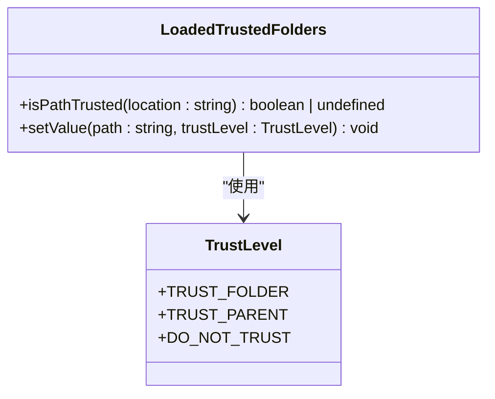
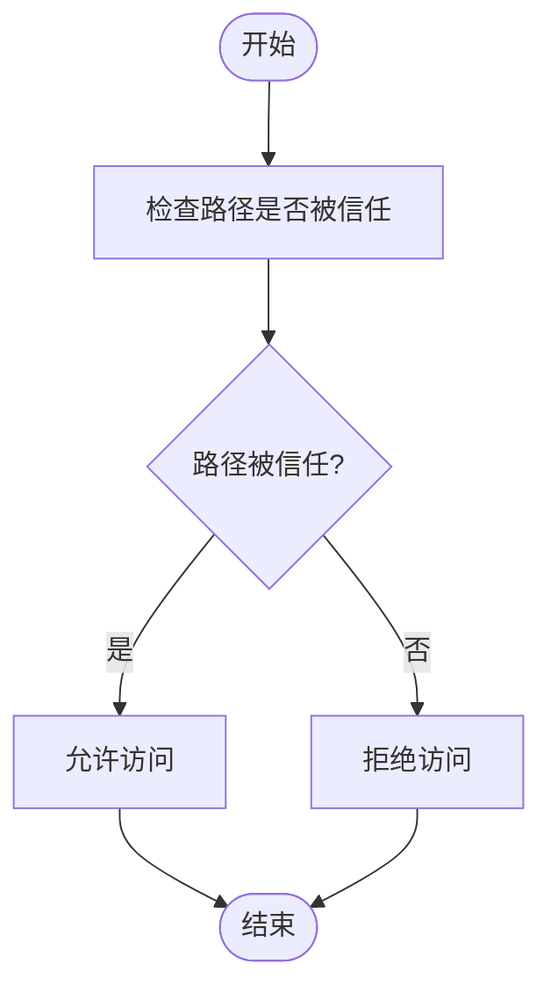
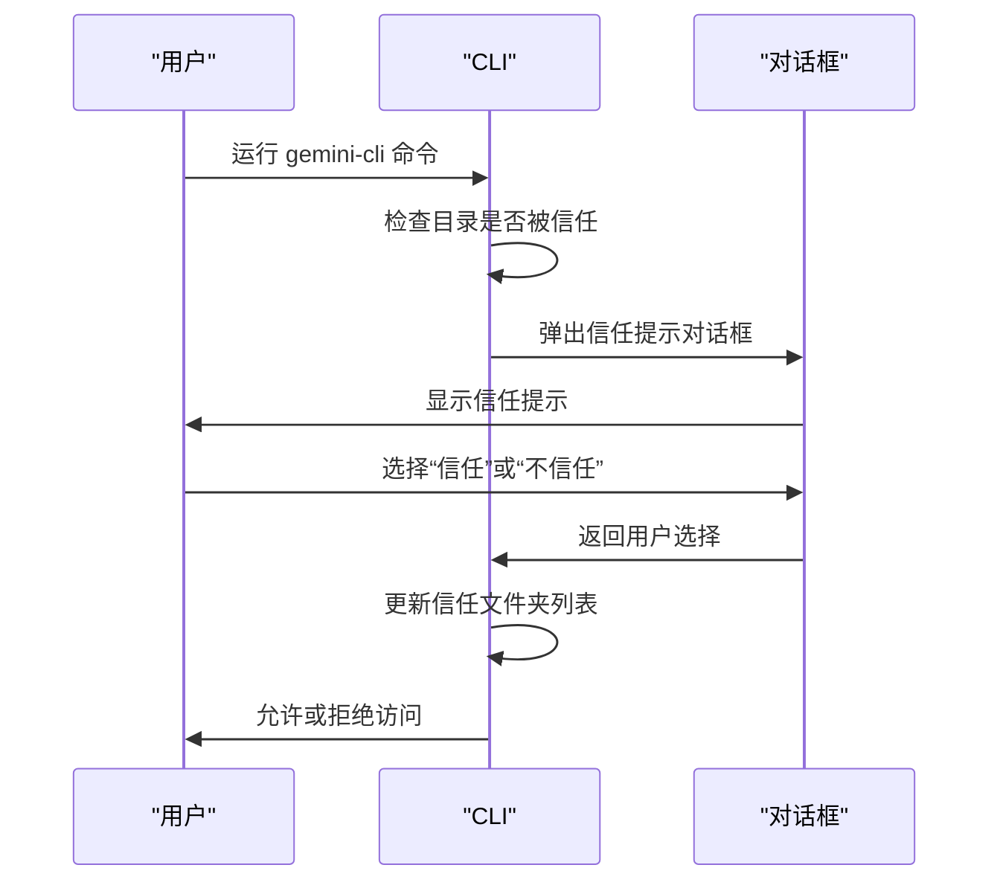
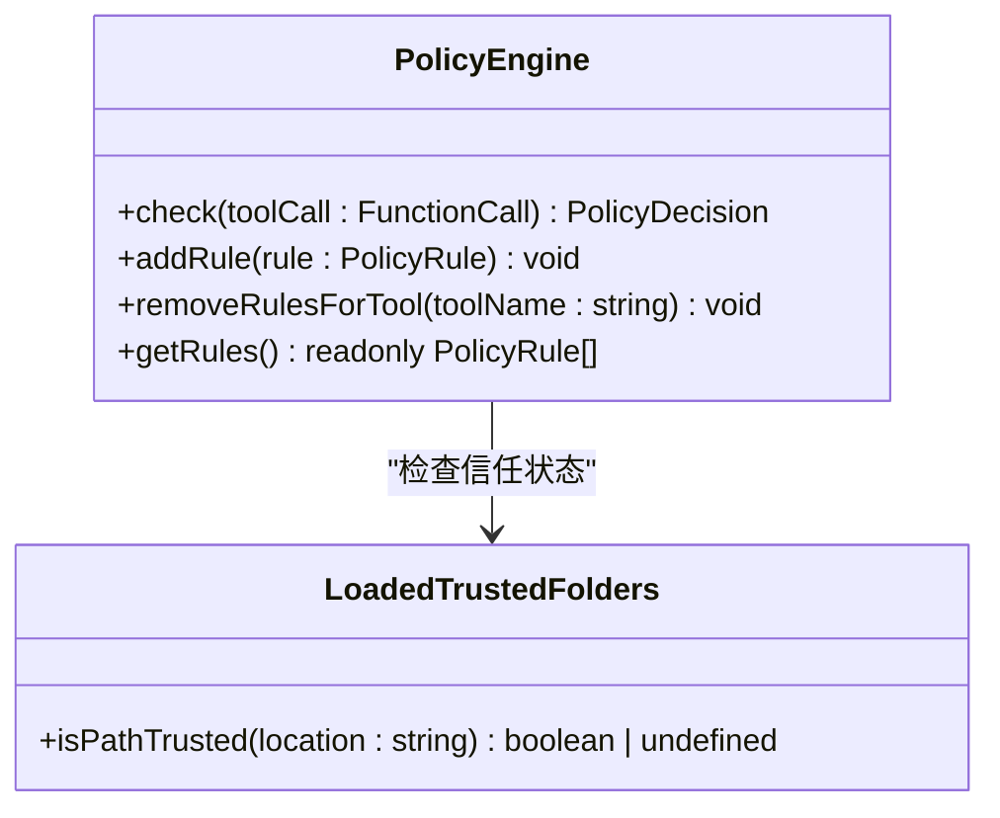

# 信任文件夹管理

<cite>
**本文档中引用的文件**  
- [trustedFolders.ts](file://packages/cli/src/config/trustedFolders.ts)
- [trustedFolders.test.ts](file://packages/cli/src/config/trustedFolders.test.ts)
- [useFolderTrust.ts](file://packages/cli/src/ui/hooks/useFolderTrust.ts)
- [settingsSchema.test.ts](file://packages/cli/src/config/settingsSchema.test.ts)
- [policy-engine.ts](file://packages/core/src/policy/policy-engine.ts)
- [policy.test.ts](file://packages/cli/src/config/policy.test.ts)
- [read-file.ts](file://packages/core/src/tools/read-file.ts)
- [write-file.ts](file://packages/core/src/tools/write-file.ts)
- [fileSystemService.ts](file://packages/core/src/services/fileSystemService.ts)
- [fileUtils.ts](file://packages/core/src/utils/fileUtils.ts)
</cite>

## 目录
1. [简介](#简介)
2. [信任文件夹安全机制](#信任文件夹安全机制)
3. [配置方式](#配置方式)
4. [信任状态的持久化存储](#信任状态的持久化存储)
5. [用户工作流示例](#用户工作流示例)
6. [与策略引擎的协同工作](#与策略引擎的协同工作)
7. [团队协作环境中的共享](#团队协作环境中的共享)
8. [结论](#结论)

## 简介
gemini-cli 的信任文件夹（Trusted Folders）安全机制是一种通过白名单机制控制 CLI 对本地文件系统访问权限的安全功能。该机制旨在防止未经授权的文件读取或修改，确保用户在使用 CLI 工具时的安全性。通过配置信任文件夹，用户可以明确指定哪些目录是可信的，从而允许 CLI 在这些目录中执行文件操作。

**Section sources**
- [trustedFolders.ts](file://packages/cli/src/config/trustedFolders.ts#L1-L238)

## 信任文件夹安全机制
信任文件夹机制通过白名单的方式控制 CLI 对本地文件系统的访问权限。当用户首次访问一个新项目目录时，CLI 会提示用户确认是否信任该目录。只有在用户明确信任该目录后，CLI 才能对该目录中的文件进行读取或修改操作。

该机制的核心是 `LoadedTrustedFolders` 类，它负责管理信任文件夹的配置。`LoadedTrustedFolders` 类包含以下方法：
- `isPathTrusted(location: string): boolean | undefined`：检查指定路径是否被信任。
- `setValue(path: string, trustLevel: TrustLevel): void`：设置指定路径的信任级别。

信任级别由 `TrustLevel` 枚举定义，包含以下三种：
- `TRUST_FOLDER`：信任该文件夹。
- `TRUST_PARENT`：信任该文件夹的父文件夹。
- `DO_NOT_TRUST`：不信任该文件夹。



**Diagram sources**
- [trustedFolders.ts](file://packages/cli/src/config/trustedFolders.ts#L55-L109)

**Section sources**
- [trustedFolders.ts](file://packages/cli/src/config/trustedFolders.ts#L55-L109)

## 配置方式
信任文件夹的配置可以通过交互式对话框、命令行或配置文件进行管理。

### 交互式对话框
用户可以通过交互式对话框添加或移除信任文件夹。当用户首次访问一个新项目目录时，CLI 会弹出一个对话框，提示用户确认是否信任该目录。用户可以选择“信任”或“不信任”。

### 命令行
用户可以通过命令行工具管理信任文件夹。例如，使用 `gemini-cli trust add <path>` 命令添加一个信任文件夹，使用 `gemini-cli trust remove <path>` 命令移除一个信任文件夹。

### 配置文件
信任文件夹的配置也可以通过配置文件进行管理。配置文件位于用户主目录下的 `.gemini` 目录中，文件名为 `trustedFolders.json`。用户可以直接编辑该文件来添加或移除信任文件夹。



**Diagram sources**
- [trustedFolders.ts](file://packages/cli/src/config/trustedFolders.ts#L55-L109)

**Section sources**
- [trustedFolders.ts](file://packages/cli/src/config/trustedFolders.ts#L108-L161)
- [useFolderTrust.ts](file://packages/cli/src/ui/hooks/useFolderTrust.ts#L0-L39)

## 信任状态的持久化存储
信任状态的持久化存储位置和格式如下：
- 存储位置：用户主目录下的 `.gemini` 目录中，文件名为 `trustedFolders.json`。
- 存储格式：JSON 格式，包含一个 `config` 对象，对象的键为路径，值为信任级别。

例如，`trustedFolders.json` 文件的内容可能如下：
```json
{
  "config": {
    "/path/to/trusted/folder": "TRUST_FOLDER",
    "/path/to/untrusted/folder": "DO_NOT_TRUST"
  }
}
```

**Section sources**
- [trustedFolders.ts](file://packages/cli/src/config/trustedFolders.ts#L163-L212)

## 用户工作流示例
以下是一个用户工作流示例，展示首次访问新项目目录时的信任提示流程：
1. 用户运行 `gemini-cli` 命令访问一个新项目目录。
2. CLI 检查该目录是否被信任。
3. 如果该目录未被信任，CLI 弹出一个对话框，提示用户确认是否信任该目录。
4. 用户选择“信任”或“不信任”。
5. 如果用户选择“信任”，CLI 将该目录添加到信任文件夹列表中，并允许访问。
6. 如果用户选择“不信任”，CLI 拒绝访问该目录。



**Diagram sources**
- [useFolderTrust.ts](file://packages/cli/src/ui/hooks/useFolderTrust.ts#L0-L39)

**Section sources**
- [useFolderTrust.ts](file://packages/cli/src/ui/hooks/useFolderTrust.ts#L0-L39)

## 与策略引擎的协同工作
信任文件夹机制与策略引擎协同工作，确保 CLI 在执行文件操作时遵循安全策略。策略引擎根据信任文件夹的配置决定是否允许执行特定的文件操作。

例如，当用户尝试读取一个文件时，策略引擎会检查该文件所在的目录是否被信任。如果目录被信任，策略引擎允许读取操作；否则，拒绝读取操作。



**Diagram sources**
- [policy-engine.ts](file://packages/core/src/policy/policy-engine.ts#L0-L116)
- [trustedFolders.ts](file://packages/cli/src/config/trustedFolders.ts#L55-L109)

**Section sources**
- [policy-engine.ts](file://packages/core/src/policy/policy-engine.ts#L0-L116)
- [policy.test.ts](file://packages/cli/src/config/policy.test.ts#L79-L127)

## 团队协作环境中的共享
在团队协作环境中，信任配置可以通过共享配置文件的方式进行共享。团队成员可以将 `trustedFolders.json` 文件提交到版本控制系统中，其他成员在克隆项目后可以自动加载信任配置。

此外，团队还可以通过命令行工具批量管理信任文件夹，确保所有成员的配置一致。

**Section sources**
- [trustedFolders.ts](file://packages/cli/src/config/trustedFolders.ts#L163-L212)

## 结论
gemini-cli 的信任文件夹安全机制通过白名单机制有效控制了 CLI 对本地文件系统的访问权限，防止了未经授权的文件读取或修改。该机制支持多种配置方式，包括交互式对话框、命令行和配置文件，方便用户根据需要进行管理。信任状态的持久化存储确保了配置的长期有效性，而与策略引擎的协同工作则进一步增强了安全性。在团队协作环境中，通过共享配置文件，可以确保所有成员的配置一致，提高团队协作的效率和安全性。