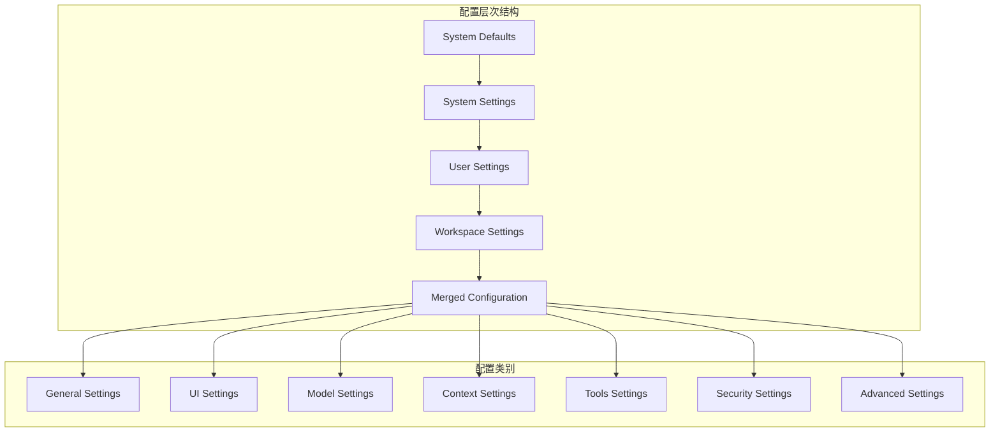
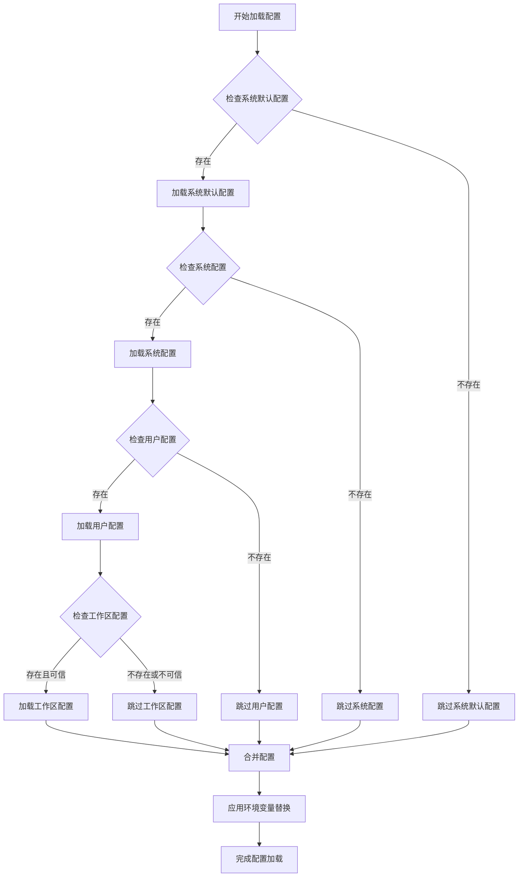
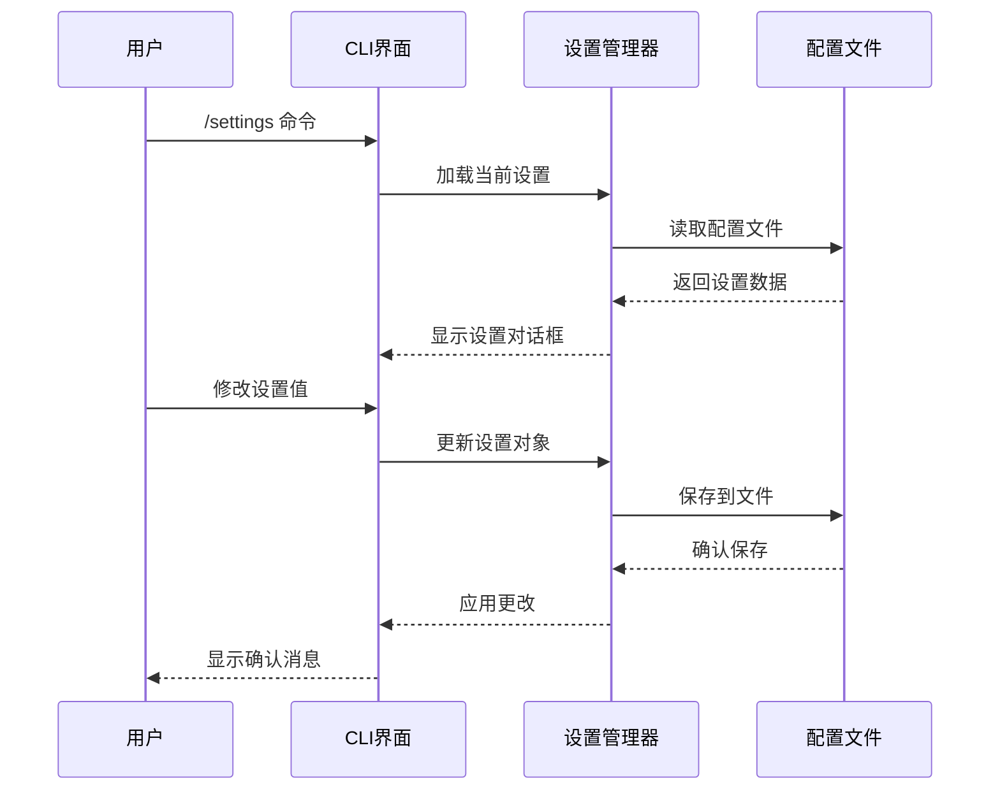
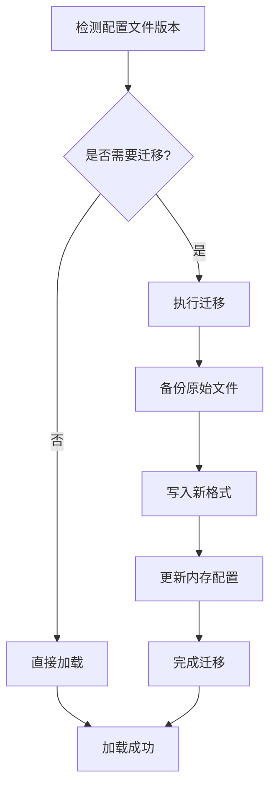

# 基础设置

<cite>
**本文档中引用的文件**
- [settings.ts](file://packages/cli/src/config/settings.ts)
- [settingsSchema.ts](file://packages/cli/src/config/settingsSchema.ts)
- [envVarResolver.ts](file://packages/cli/src/utils/envVarResolver.ts)
- [config.ts](file://packages/core/src/config/config.ts)
- [add.ts](file://packages/cli/src/commands/mcp/add.ts)
- [settings.test.ts](file://packages/cli/src/config/settings.test.ts)
- [gemini-extension.json](file://hello/gemini-extension.json)
</cite>

## 目录
1. [简介](#简介)
2. [配置文件结构](#配置文件结构)
3. [配置文件位置和加载优先级](#配置文件位置和加载优先级)
4. [可配置选项详解](#可配置选项详解)
5. [配置文件管理](#配置文件管理)
6. [环境变量处理](#环境变量处理)
7. [配置迁移机制](#配置迁移机制)
8. [实际配置示例](#实际配置示例)
9. [故障排除指南](#故障排除指南)
10. [总结](#总结)

## 简介

Gemini CLI 的配置系统是一个强大而灵活的架构，支持多层级配置管理、环境变量替换、配置迁移和实时设置更新。该系统允许用户通过 `/settings` 命令或直接编辑配置文件来自定义 CLI 行为，涵盖了从模型选择到输出格式的所有方面。

## 配置文件结构

### 核心配置架构

Gemini CLI 使用分层的配置架构，支持以下配置类别：



**图表来源**
- [settings.ts](file://packages/cli/src/config/settings.ts#L200-L250)
- [settingsSchema.ts](file://packages/cli/src/config/settingsSchema.ts#L50-L150)

### 配置模式定义

配置系统基于严格的类型定义，确保配置的一致性和有效性：

```typescript
interface SettingDefinition {
  type: SettingsType;
  label: string;
  category: string;
  requiresRestart: boolean;
  default: SettingsValue;
  description?: string;
  properties?: SettingsSchema;
  mergeStrategy?: MergeStrategy;
}
```

**章节来源**
- [settingsSchema.ts](file://packages/cli/src/config/settingsSchema.ts#L40-L80)

## 配置文件位置和加载优先级

### 文件路径解析

Gemini CLI 支持多种配置文件位置，按优先级顺序加载：



**图表来源**
- [settings.ts](file://packages/cli/src/config/settings.ts#L600-L650)

### 具体路径实现

不同操作系统有不同的配置文件位置：

```typescript
export function getSystemSettingsPath(): string {
  if (process.env['GEMINI_CLI_SYSTEM_SETTINGS_PATH']) {
    return process.env['GEMINI_CLI_SYSTEM_SETTINGS_PATH'];
  }
  if (platform() === 'darwin') {
    return '/Library/Application Support/GeminiCli/settings.json';
  } else if (platform() === 'win32') {
    return 'C:\\ProgramData\\gemini-cli\\settings.json';
  } else {
    return '/etc/gemini-cli/settings.json';
  }
}
```

**章节来源**
- [settings.ts](file://packages/cli/src/config/settings.ts#L100-L120)

## 可配置选项详解

### 模型相关设置

#### 默认模型选择

```typescript
model: {
  type: 'object',
  label: 'Model',
  category: 'Model',
  requiresRestart: false,
  default: {},
  properties: {
    name: {
      type: 'string',
      label: 'Model',
      category: 'Model',
      requiresRestart: false,
      default: undefined,
      description: 'The Gemini model to use for conversations.',
    },
    maxSessionTurns: {
      type: 'number',
      label: 'Max Session Turns',
      category: 'Model',
      requiresRestart: false,
      default: -1,
      description: 'Maximum number of user/model/tool turns to keep in a session.',
    },
  },
}
```

#### 上下文大小限制

```typescript
context: {
  type: 'object',
  label: 'Context',
  category: 'Context',
  requiresRestart: false,
  properties: {
    includeDirectories: {
      type: 'array',
      label: 'Include Directories',
      default: [] as string[],
      description: 'Additional directories to include in the workspace context.',
      mergeStrategy: MergeStrategy.CONCAT,
    },
    fileFiltering: {
      type: 'object',
      label: 'File Filtering',
      properties: {
        respectGitIgnore: {
          type: 'boolean',
          label: 'Respect .gitignore',
          default: true,
        },
        respectGeminiIgnore: {
          type: 'boolean',
          label: 'Respect .geminiignore',
          default: true,
        },
      },
    },
  },
}
```

**章节来源**
- [settingsSchema.ts](file://packages/cli/src/config/settingsSchema.ts#L400-L500)

### 输出格式偏好

#### 输出格式设置

```typescript
output: {
  type: 'object',
  label: 'Output',
  category: 'General',
  properties: {
    format: {
      type: 'enum',
      label: 'Output Format',
      options: [
        { value: 'text', label: 'Text' },
        { value: 'json', label: 'JSON' },
      ],
    },
  },
}
```

#### UI 自定义设置

```typescript
ui: {
  type: 'object',
  label: 'UI',
  category: 'UI',
  properties: {
    theme: {
      type: 'string',
      label: 'Theme',
      default: undefined,
    },
    hideTips: {
      type: 'boolean',
      label: 'Hide Tips',
      default: false,
    },
    footer: {
      type: 'object',
      properties: {
        hideCWD: {
          type: 'boolean',
          label: 'Hide CWD',
        },
        hideSandboxStatus: {
          type: 'boolean',
          label: 'Hide Sandbox Status',
        },
      },
    },
  },
}
```

**章节来源**
- [settingsSchema.ts](file://packages/cli/src/config/settingsSchema.ts#L200-L300)

### 会话持久化设置

#### 会话保留策略

```typescript
general: {
  type: 'object',
  properties: {
    sessionRetention: {
      type: 'object',
      properties: {
        enabled: {
          type: 'boolean',
          label: 'Enable Session Cleanup',
          default: false,
        },
        maxAge: {
          type: 'string',
          label: 'Max Session Age',
          description: 'Maximum age of sessions to keep (e.g., "30d", "7d", "24h", "1w")',
        },
        maxCount: {
          type: 'number',
          label: 'Max Session Count',
          description: 'Maximum number of sessions to keep (most recent)',
        },
      },
    },
  },
}
```

#### 检查点设置

```typescript
general: {
  type: 'object',
  properties: {
    checkpointing: {
      type: 'object',
      properties: {
        enabled: {
          type: 'boolean',
          label: 'Enable Checkpointing',
          requiresRestart: true,
          default: false,
        },
      },
    },
  },
}
```

**章节来源**
- [settingsSchema.ts](file://packages/cli/src/config/settingsSchema.ts#L100-L150)

### IDE 集成选项

#### IDE 模式配置

```typescript
ide: {
  type: 'object',
  properties: {
    enabled: {
      type: 'boolean',
      label: 'IDE Mode',
      requiresRestart: true,
      default: false,
    },
    hasSeenNudge: {
      type: 'boolean',
      default: false,
    },
  },
}
```

#### 工具链集成

```typescript
tools: {
  type: 'object',
  properties: {
    sandbox: {
      type: 'object',
      properties: {
        enabled: {
          type: 'boolean',
          label: 'Enable Sandbox',
        },
      },
    },
    shell: {
      type: 'object',
      properties: {
        enableInteractiveShell: {
          type: 'boolean',
          label: 'Enable Interactive Shell',
          requiresRestart: true,
        },
      },
    },
  },
}
```

**章节来源**
- [settingsSchema.ts](file://packages/cli/src/config/settingsSchema.ts#L300-L400)

## 配置文件管理

### 动态设置修改

Gemini CLI 提供了 `/settings` 命令来动态修改配置：



**图表来源**
- [settings.ts](file://packages/cli/src/config/settings.ts#L350-L400)

### 配置文件操作类

```typescript
export class LoadedSettings {
  constructor(
    system: SettingsFile,
    systemDefaults: SettingsFile,
    user: SettingsFile,
    workspace: SettingsFile,
    isTrusted: boolean,
    migratedInMemorScopes: Set<SettingScope>,
  ) {
    this.system = system;
    this.systemDefaults = systemDefaults;
    this.user = user;
    this.workspace = workspace;
    this.isTrusted = isTrusted;
    this.migratedInMemorScopes = migratedInMemorScopes;
    this._merged = this.computeMergedSettings();
  }

  setValue(scope: SettingScope, key: string, value: unknown): void {
    const settingsFile = this.forScope(scope);
    setNestedProperty(settingsFile.settings, key, value);
    setNestedProperty(settingsFile.originalSettings, key, value);
    this._merged = this.computeMergedSettings();
    saveSettings(settingsFile);
  }
}
```

**章节来源**
- [settings.ts](file://packages/cli/src/config/settings.ts#L300-L350)

### 直接编辑配置文件

用户可以直接编辑配置文件来修改设置：

```bash
# 编辑用户配置
nano ~/.gemini/settings.json

# 编辑工作区配置
nano ./.gemini/settings.json

# 编辑系统配置
sudo nano /etc/gemini-cli/settings.json
```

## 环境变量处理

### 环境变量解析机制

Gemini CLI 支持在配置文件中使用环境变量占位符：

```typescript
export function resolveEnvVarsInString(value: string): string {
  const envVarRegex = /\$(?:(\w+)|{([^}]+)})/g;
  return value.replace(envVarRegex, (match, varName1, varName2) => {
    const varName = varName1 || varName2;
    if (process && process.env && typeof process.env[varName] === 'string') {
      return process.env[varName]!;
    }
    return match;
  });
}
```

### 环境变量替换示例

配置文件中的环境变量使用：

```json
{
  "mcpServers": {
    "my-server": {
      "command": "node",
      "args": ["server.js"],
      "env": {
        "API_KEY": "$MY_API_KEY",
        "DATABASE_URL": "${DATABASE_URL}",
        "STATIC_VALUE": "no-substitution"
      }
    }
  }
}
```

### 环境文件发现

```typescript
function findEnvFile(startDir: string): string | null {
  let currentDir = path.resolve(startDir);
  while (true) {
    const geminiEnvPath = path.join(currentDir, GEMINI_DIR, '.env');
    if (fs.existsSync(geminiEnvPath)) {
      return geminiEnvPath;
    }
    const envPath = path.join(currentDir, '.env');
    if (fs.existsSync(envPath)) {
      return envPath;
    }
    const parentDir = path.dirname(currentDir);
    if (parentDir === currentDir || !parentDir) {
      return null;
    }
    currentDir = parentDir;
  }
}
```

**章节来源**
- [envVarResolver.ts](file://packages/cli/src/utils/envVarResolver.ts#L15-L50)
- [settings.ts](file://packages/cli/src/config/settings.ts#L450-L500)

## 配置迁移机制

### 版本迁移系统

Gemini CLI 支持配置文件版本迁移，自动将旧版配置转换为新版格式：



**图表来源**
- [settings.ts](file://packages/cli/src/config/settings.ts#L600-L650)

### 迁移映射表

```typescript
const MIGRATION_MAP: Record<string, string> = {
  accessibility: 'ui.accessibility',
  allowedTools: 'tools.allowed',
  allowMCPServers: 'mcp.allowed',
  autoAccept: 'tools.autoAccept',
  autoConfigureMaxOldSpaceSize: 'advanced.autoConfigureMemory',
  // ... 更多迁移映射
};
```

### 迁移过程实现

```typescript
function migrateSettingsToV2(
  flatSettings: Record<string, unknown>,
): Record<string, unknown> | null {
  if (!needsMigration(flatSettings)) {
    return null;
  }

  const v2Settings: Record<string, unknown> = {};
  const flatKeys = new Set(Object.keys(flatSettings));

  for (const [oldKey, newPath] of Object.entries(MIGRATION_MAP)) {
    if (flatKeys.has(oldKey)) {
      setNestedProperty(v2Settings, newPath, flatSettings[oldKey]);
      flatKeys.delete(oldKey);
    }
  }

  // 处理顶级的 mcpServers
  if (flatSettings['mcpServers']) {
    v2Settings['mcpServers'] = flatSettings['mcpServers'];
    flatKeys.delete('mcpServers');
  }

  // 保留任何未识别的键
  for (const remainingKey of flatKeys) {
    v2Settings[remainingKey] = flatSettings[remainingKey];
  }

  return v2Settings;
}
```

**章节来源**
- [settings.ts](file://packages/cli/src/config/settings.ts#L200-L300)

## 实际配置示例

### 基础配置示例

```json
{
  "model": {
    "name": "gemini-pro",
    "maxSessionTurns": 10
  },
  "output": {
    "format": "json"
  },
  "ui": {
    "theme": "dark",
    "hideTips": false,
    "footer": {
      "hideCWD": false,
      "hideSandboxStatus": false
    }
  },
  "context": {
    "includeDirectories": ["./src", "./lib"],
    "fileFiltering": {
      "respectGitIgnore": true,
      "respectGeminiIgnore": true
    }
  },
  "tools": {
    "autoAccept": false,
    "sandbox": {
      "enabled": true
    }
  }
}
```

### 高级配置示例

```json
{
  "model": {
    "name": "gemini-pro",
    "chatCompression": {
      "contextPercentageThreshold": 0.8
    },
    "summarizeToolOutput": {
      "tokenBudget": 1000
    }
  },
  "general": {
    "sessionRetention": {
      "enabled": true,
      "maxAge": "30d",
      "minRetention": "1d"
    },
    "checkpointing": {
      "enabled": true
    }
  },
  "context": {
    "includeDirectories": ["./src", "./lib", "./tests"],
    "loadMemoryFromIncludeDirectories": true,
    "discoveryMaxDirs": 500
  },
  "mcpServers": {
    "database": {
      "command": "node",
      "args": ["db-server.js"],
      "env": {
        "DATABASE_URL": "${DATABASE_URL}",
        "API_KEY": "$DB_API_KEY"
      },
      "timeout": 30000,
      "trust": false
    }
  }
}
```

### 环境特定配置

```json
{
  "model": {
    "name": "gemini-pro",
    "maxSessionTurns": 5
  },
  "tools": {
    "autoAccept": true,
    "sandbox": {
      "enabled": false
    }
  },
  "ui": {
    "accessibility": {
      "screenReader": true,
      "disableLoadingPhrases": true
    }
  }
}
```

**章节来源**
- [settings.test.ts](file://packages/cli/src/config/settings.test.ts#L800-L900)

## 故障排除指南

### 常见配置错误

#### JSON 格式错误

```bash
# 错误示例
{
  "model": "gemini-pro",  # 缺少逗号
  "output": {
    "format": "json"
  }
}

# 正确示例
{
  "model": "gemini-pro",
  "output": {
    "format": "json"
  }
}
```

#### 类型不匹配错误

```bash
# 错误：字符串值用于布尔类型
{
  "tools": {
    "autoAccept": "true"  # 应该是 true 而不是 "true"
  }
}

# 正确：布尔值
{
  "tools": {
    "autoAccept": true
  }
}
```

### 配置验证

```typescript
// 配置验证示例
function validateSettings(settings: Settings): string[] {
  const errors: string[] = [];
  
  if (settings.model?.maxSessionTurns && settings.model.maxSessionTurns < -1) {
    errors.push('maxSessionTurns 必须大于等于 -1');
  }
  
  if (settings.context?.includeDirectories) {
    for (const dir of settings.context.includeDirectories) {
      if (typeof dir !== 'string') {
        errors.push(`includeDirectories 中的条目必须是字符串: ${dir}`);
      }
    }
  }
  
  return errors;
}
```

### 配置重置

如果配置损坏，可以通过以下方式重置：

```bash
# 删除用户配置
rm ~/.gemini/settings.json

# 删除工作区配置
rm ./.gemini/settings.json

# 重新启动 CLI
gemini
```

**章节来源**
- [settings.ts](file://packages/cli/src/config/settings.ts#L650-L700)

## 总结

Gemini CLI 的配置系统提供了全面而灵活的配置管理能力：

### 主要特性

1. **多层级配置管理**：支持系统默认、系统、用户和工作区配置
2. **智能合并策略**：根据配置类型采用不同的合并策略
3. **环境变量支持**：在配置文件中使用环境变量占位符
4. **自动迁移机制**：无缝升级配置文件格式
5. **实时配置更新**：支持运行时修改配置
6. **严格类型检查**：确保配置的一致性和有效性

### 最佳实践

1. **使用 `/settings` 命令**：推荐使用内置命令来修改配置
2. **备份配置文件**：在手动编辑前备份重要配置
3. **验证配置语法**：使用 JSON 验证工具检查配置文件语法
4. **分层配置**：合理利用不同层级的配置来满足不同需求
5. **环境变量安全**：谨慎使用环境变量，避免敏感信息泄露

### 扩展性

配置系统设计为可扩展的，新的配置选项可以通过扩展 `SETTINGS_SCHEMA` 来添加，确保了系统的长期维护性和适应性。

通过理解这些配置机制，用户可以充分利用 Gemini CLI 的各种功能，根据自己的需求定制最佳的工作流程。