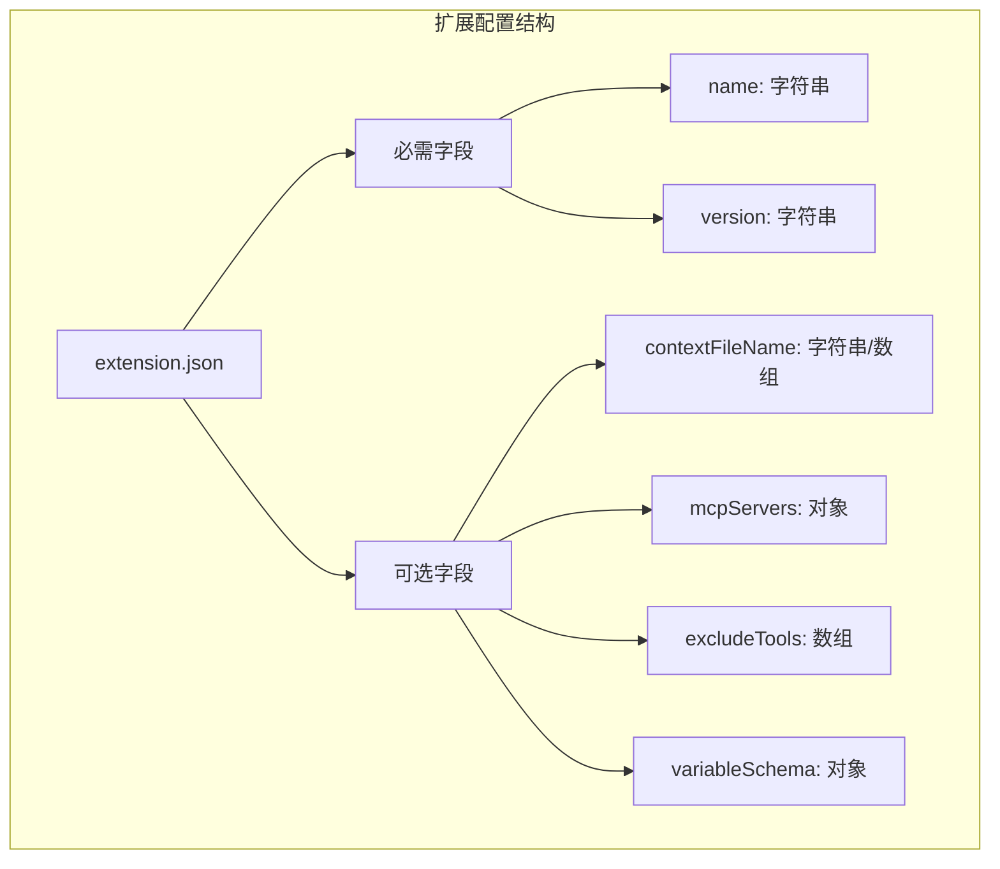
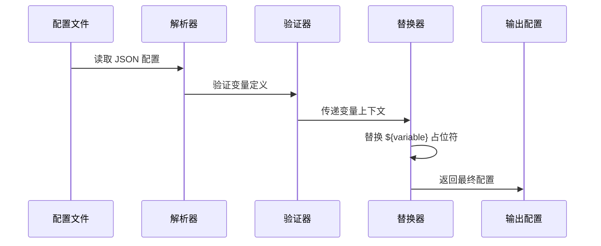
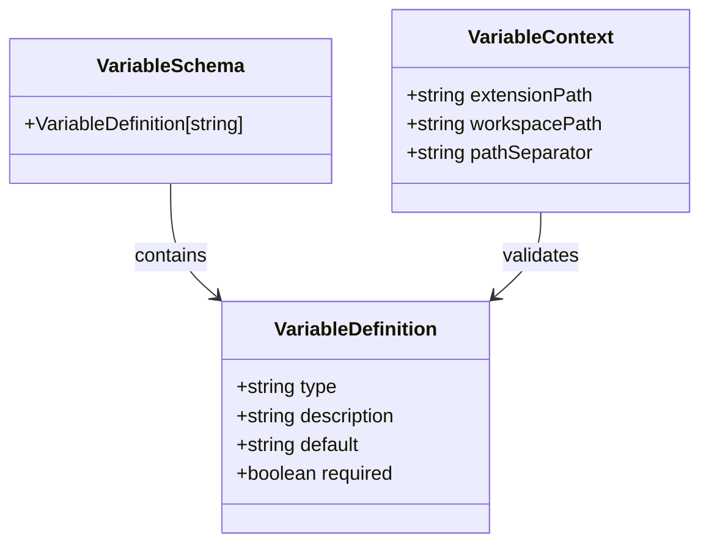
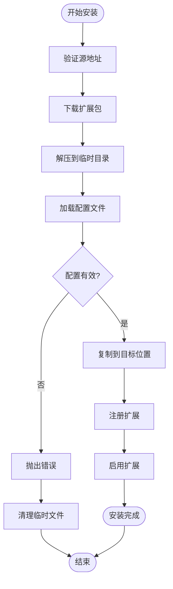
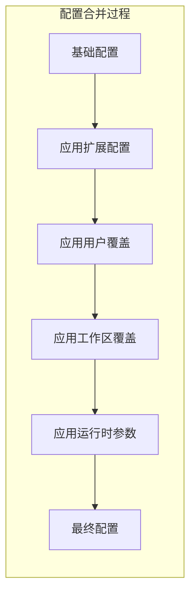
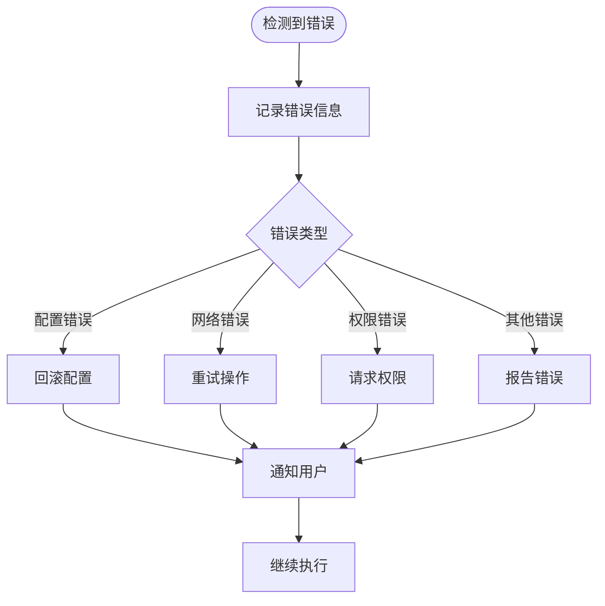

# 扩展配置系统

<cite>
**本文档引用的文件**
- [hello/gemini-extension.json](file://hello/gemini-extension.json)
- [packages/cli/src/config/extensions/variableSchema.ts](file://packages/cli/src/config/extensions/variableSchema.ts)
- [packages/cli/src/config/extensions/variables.ts](file://packages/cli/src/config/extensions/variables.ts)
- [packages/cli/src/config/extension.ts](file://packages/cli/src/config/extension.ts)
- [packages/cli/src/config/extensions/update.ts](file://packages/cli/src/config/extensions/update.ts)
- [packages/cli/src/config/extensions/extensionEnablement.ts](file://packages/cli/src/config/extensions/extensionEnablement.ts)
- [packages/cli/src/commands/extensions/install.ts](file://packages/cli/src/commands/extensions/install.ts)
- [integration-tests/extensions-install.test.ts](file://integration-tests/extensions-install.test.ts)
- [packages/core/src/config/config.ts](file://packages/core/src/config/config.ts)
</cite>

## 目录
1. [简介](#简介)
2. [扩展配置文件结构](#扩展配置文件结构)
3. [变量系统架构](#变量系统架构)
4. [配置变量模式](#配置变量模式)
5. [扩展生命周期管理](#扩展生命周期管理)
6. [配置继承与覆盖机制](#配置继承与覆盖机制)
7. [热重载与错误处理](#热重载与错误处理)
8. [最佳实践指南](#最佳实践指南)
9. [故障排除](#故障排除)
10. [总结](#总结)

## 简介

gemini-cli 的扩展系统是一个强大而灵活的配置框架，允许开发者创建可配置的扩展来增强 CLI 功能。该系统通过 `extension.json` 文件定义扩展的元数据、工具集和配置变量，并提供了完整的变量替换、配置继承和热重载机制。

扩展系统的核心特性包括：
- 基于 JSON 的声明式配置
- 可扩展的变量替换系统
- 分层配置继承机制
- 热重载支持
- 完整的错误处理和回滚机制

## 扩展配置文件结构

### 基本配置格式

每个扩展都必须包含一个 `gemini-extension.json` 配置文件，位于扩展根目录下。最基本的配置结构如下：

```json
{
  "name": "context-example",
  "version": "1.0.0",
  "contextFileName": "GEMINI.md"
}
```

### 核心配置字段



**图表来源**
- [hello/gemini-extension.json](file://hello/gemini-extension.json#L1-L6)

### 高级配置选项

扩展配置支持更复杂的结构，包括 MCP 服务器配置和变量模式定义：

```json
{
  "name": "advanced-extension",
  "version": "1.0.0",
  "mcpServers": {
    "web-search": {
      "command": "node",
      "args": ["./dist/mcp-server.js"],
      "env": {
        "API_KEY": "${apiKey}"
      }
    }
  },
  "excludeTools": ["shell"],
  "variableSchema": {
    "apiKey": {
      "type": "string",
      "description": "API 密钥用于认证",
      "required": true
    },
    "endpoint": {
      "type": "string",
      "description": "服务端点地址",
      "default": "https://api.example.com"
    }
  }
}
```

**章节来源**
- [hello/gemini-extension.json](file://hello/gemini-extension.json#L1-L6)
- [packages/cli/src/config/extension.ts](file://packages/cli/src/config/extension.ts#L634-L664)

## 变量系统架构

### 变量定义接口

gemini-cli 提供了强大的变量替换系统，支持在配置文件中使用占位符语法：

```typescript
export interface VariableDefinition {
  type: 'string';
  description: string;
  default?: string;
  required?: boolean;
}

export interface VariableSchema {
  [key: string]: VariableDefinition;
}
```

### 内置变量上下文

系统预定义了一组内置变量，可以在任何扩展配置中使用：

```typescript
export const VARIABLE_SCHEMA = {
  extensionPath: {
    type: 'string',
    description: '扩展在文件系统中的路径。',
  },
  workspacePath: {
    type: 'string',
    description: '当前工作区的绝对路径。',
  },
  '/': PATH_SEPARATOR_DEFINITION,
  pathSeparator: PATH_SEPARATOR_DEFINITION,
} as const;
```

### 变量替换流程



**图表来源**
- [packages/cli/src/config/extensions/variables.ts](file://packages/cli/src/config/extensions/variables.ts#L30-L45)
- [packages/cli/src/config/extensions/variableSchema.ts](file://packages/cli/src/config/extensions/variableSchema.ts#L25-L39)

**章节来源**
- [packages/cli/src/config/extensions/variableSchema.ts](file://packages/cli/src/config/extensions/variableSchema.ts#L7-L15)
- [packages/cli/src/config/extensions/variables.ts](file://packages/cli/src/config/extensions/variables.ts#L1-L66)

## 配置变量模式

### 变量类型系统

gemini-cli 支持多种变量类型和验证规则：



**图表来源**
- [packages/cli/src/config/extensions/variableSchema.ts](file://packages/cli/src/config/extensions/variableSchema.ts#L7-L15)

### 变量验证机制

系统提供完整的变量验证功能：

```typescript
export function validateVariables(
  variables: VariableContext,
  schema: VariableSchema,
) {
  for (const key in schema) {
    const definition = schema[key];
    if (definition.required && !variables[key as keyof VariableContext]) {
      throw new Error(`Missing required variable: ${key}`);
    }
  }
}
```

### 用户界面提示

变量模式定义了清晰的描述信息，用于向用户提供配置指导：

```json
{
  "variableSchema": {
    "databaseUrl": {
      "type": "string",
      "description": "数据库连接字符串",
      "default": "localhost:5432",
      "required": false
    },
    "timeout": {
      "type": "string",
      "description": "请求超时时间（秒）",
      "default": "30",
      "required": false
    }
  }
}
```

**章节来源**
- [packages/cli/src/config/extensions/variables.ts](file://packages/cli/src/config/extensions/variables.ts#L17-L25)

## 扩展生命周期管理

### 安装流程

扩展安装过程包含完整的验证和配置步骤：



**图表来源**
- [packages/cli/src/commands/extensions/install.ts](file://packages/cli/src/commands/extensions/install.ts#L20-L50)

### 更新机制

扩展支持自动更新和版本管理：

```typescript
export async function updateExtension(
  extension: GeminiCLIExtension,
  cwd: string = process.cwd(),
  requestConsent: (consent: string) => Promise<boolean>,
  currentState: ExtensionUpdateState,
  dispatchExtensionStateUpdate: (action: ExtensionUpdateAction) => void,
): Promise<ExtensionUpdateInfo | undefined>
```

### 启用/禁用管理

扩展启停状态通过专门的管理器控制：

```typescript
export class ExtensionEnablementManager {
  isEnabled(extensionName: string, currentPath: string): boolean {
    // 检查扩展是否在当前路径启用
    const config = this.readConfig();
    const extensionConfig = config[extensionName];
    let enabled = true;
    
    const allOverrides = extensionConfig?.overrides ?? [];
    for (const rule of allOverrides) {
      const override = Override.fromFileRule(rule);
      if (override.matchesPath(ensureLeadingAndTrailingSlash(currentPath))) {
        enabled = !override.isDisable;
      }
    }
    return enabled;
  }
}
```

**章节来源**
- [packages/cli/src/config/extensions/update.ts](file://packages/cli/src/config/extensions/update.ts#L25-L80)
- [packages/cli/src/config/extensions/extensionEnablement.ts](file://packages/cli/src/config/extensions/extensionEnablement.ts#L120-L150)

## 配置继承与覆盖机制

### 层次化配置优先级

gemini-cli 实现了多层级的配置继承机制：


### 路径匹配算法

系统使用 glob 模式进行路径匹配：

```typescript
export class Override {
  asRegex(): RegExp {
    return globToRegex(`${this.baseRule}${this.includeSubdirs ? '*' : ''}`);
  }

  matchesPath(path: string) {
    return this.asRegex().test(path);
  }
}
```

### 配置合并策略



**章节来源**
- [packages/cli/src/config/extensions/extensionEnablement.ts](file://packages/cli/src/config/extensions/extensionEnablement.ts#L150-L200)

## 热重载与错误处理

### 配置热重载机制

系统支持配置的动态重载而不中断服务：

```typescript
export function loadExtensionConfig(
  context: LoadExtensionContext,
): ExtensionConfig {
  const { extensionDir, workspaceDir } = context;
  const configFilePath = path.join(extensionDir, EXTENSIONS_CONFIG_FILENAME);
  
  try {
    const configContent = fs.readFileSync(configFilePath, 'utf-8');
    const config = recursivelyHydrateStrings(JSON.parse(configContent), {
      extensionPath: extensionDir,
      workspacePath: workspaceDir,
      '/': path.sep,
      pathSeparator: path.sep,
    }) as unknown as ExtensionConfig;
    
    return config;
  } catch (e) {
    throw new Error(
      `Failed to load extension config from ${configFilePath}: ${getErrorMessage(e)}`,
    );
  }
}
```

### 错误恢复策略



### 回滚机制

扩展更新失败时会自动回滚到之前的版本：

```typescript
try {
  await copyExtension(tempDir, extension.path);
  throw new Error('Simulated update failure');
} catch (e) {
  console.error(`Error updating extension, rolling back. ${getErrorMessage(e)}`);
  await copyExtension(tempDir, extension.path); // 回滚
  throw e;
} finally {
  await fs.promises.rm(tempDir, { recursive: true, force: true });
}
```

**章节来源**
- [packages/cli/src/config/extension.ts](file://packages/cli/src/config/extension.ts#L634-L664)
- [packages/cli/src/config/extensions/update.ts](file://packages/cli/src/config/extensions/update.ts#L80-L100)

## 最佳实践指南

### 扩展配置设计原则

1. **最小化配置复杂度**：只暴露必要的配置项
2. **提供合理的默认值**：减少用户配置负担
3. **清晰的错误消息**：帮助用户快速定位问题
4. **向后兼容性**：保持配置格式的稳定性

### 变量命名规范

```json
{
  "variableSchema": {
    "api_endpoint": {
      "type": "string",
      "description": "API 服务端点地址",
      "default": "https://api.example.com/v1"
    },
    "max_retries": {
      "type": "string",
      "description": "最大重试次数",
      "default": "3",
      "required": false
    }
  }
}
```

### 安全考虑

- 敏感信息使用环境变量或加密存储
- 验证所有用户输入的配置值
- 实施适当的访问控制和权限检查

## 故障排除

### 常见配置错误

1. **缺少必需变量**
   ```
   Error: Missing required variable: apiKey
   ```

2. **无效的配置格式**
   ```
   Error: Invalid configuration in /path/to/extension.json: missing "name"
   ```

3. **路径解析错误**
   ```
   Error: Configuration file not found at /path/to/extension.json
   ```

### 调试技巧

1. **启用调试模式**：设置 `DEBUG=gemini:*` 环境变量
2. **检查配置文件语法**：使用 JSON 验证工具
3. **验证变量替换**：打印最终配置输出

### 性能优化

- 使用缓存避免重复解析配置
- 异步加载非关键配置
- 实施配置验证的早期检查

## 总结

gemini-cli 的扩展配置系统提供了一个强大、灵活且安全的框架，用于管理扩展的配置和变量。通过分层配置继承、热重载机制和完善的错误处理，该系统能够满足各种复杂的扩展需求，同时保持良好的用户体验和系统稳定性。

主要优势包括：
- 灵活的变量替换系统
- 多层级配置继承机制
- 完整的生命周期管理
- 强大的错误处理和恢复能力
- 易于使用的配置接口

这个系统为 gemini-cli 生态系统提供了坚实的基础，支持开发者创建功能丰富且易于配置的扩展。