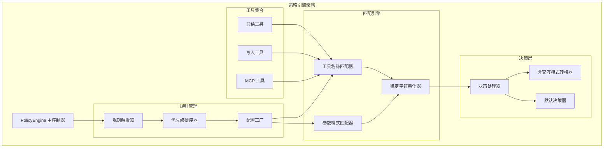
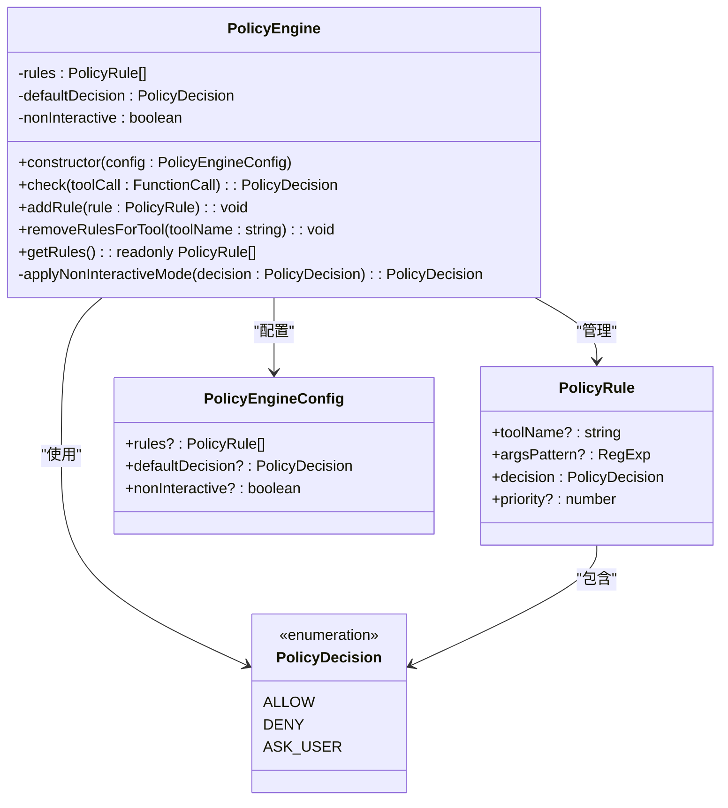
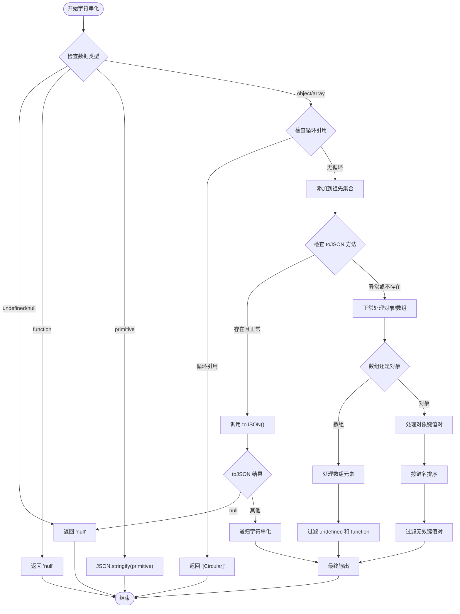
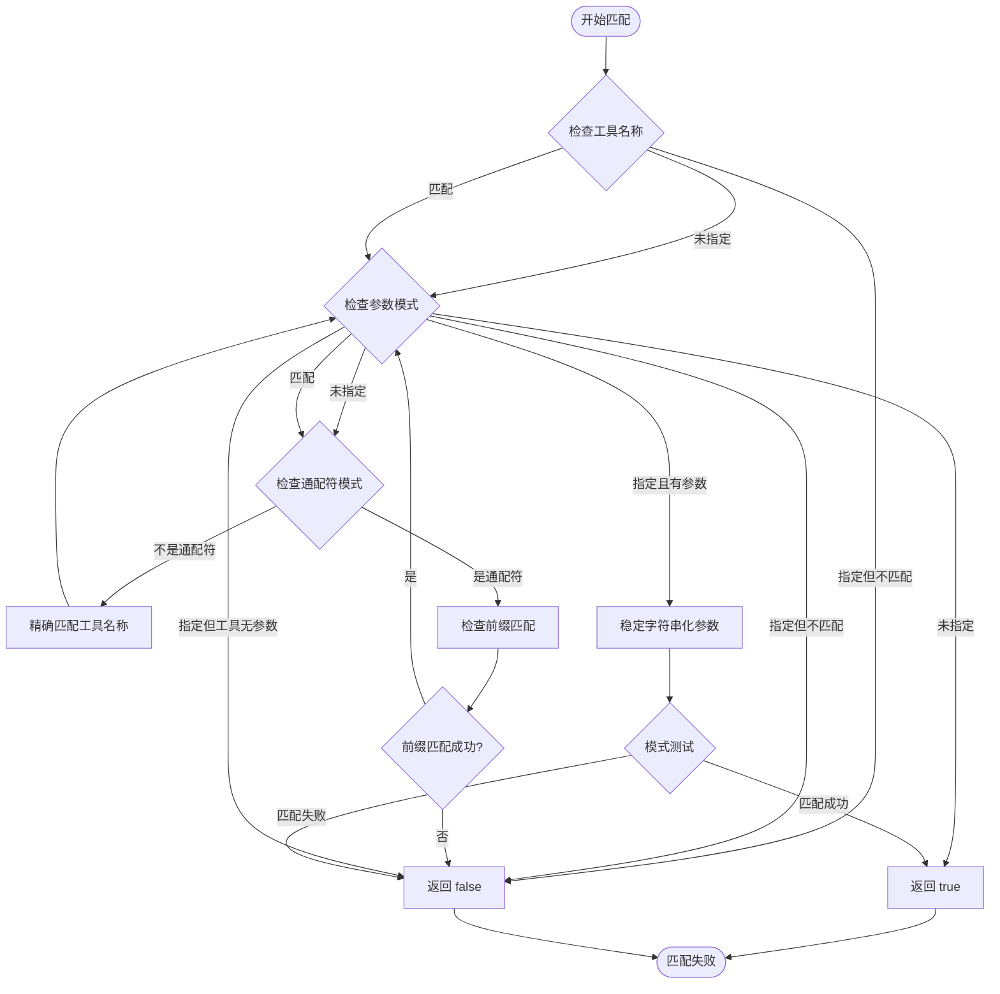
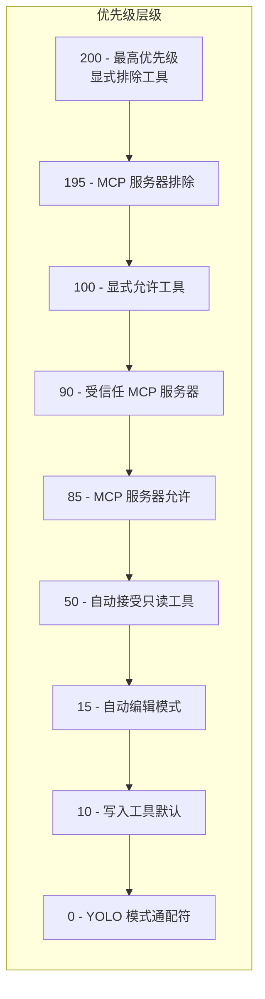
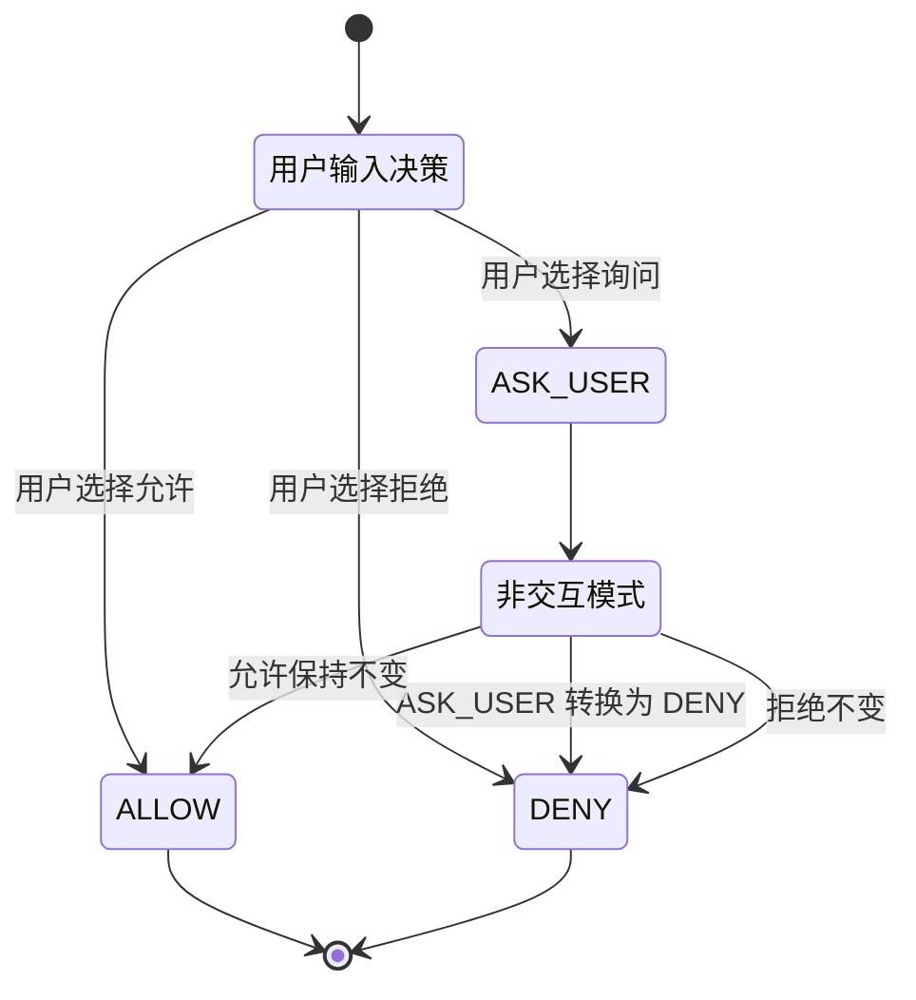

# 策略引擎

<cite>
**本文档中引用的文件**
- [packages/core/src/policy/policy-engine.ts](file://packages/core/src/policy/policy-engine.ts)
- [packages/core/src/policy/types.ts](file://packages/core/src/policy/types.ts)
- [packages/core/src/policy/stable-stringify.ts](file://packages/core/src/policy/stable-stringify.ts)
- [packages/core/src/policy/policy-engine.test.ts](file://packages/core/src/policy/policy-engine.test.ts)
- [packages/cli/src/config/policy.ts](file://packages/cli/src/config/policy.ts)
- [packages/cli/src/config/policy-engine.integration.test.ts](file://packages/cli/src/config/policy-engine.integration.test.ts)
</cite>

## 目录
1. [简介](#简介)
2. [核心组件](#核心组件)
3. [架构概览](#架构概览)
4. [详细组件分析](#详细组件分析)
5. [策略规则设计](#策略规则设计)
6. [规则匹配算法](#规则匹配算法)
7. [优先级排序机制](#优先级排序机制)
8. [非交互模式处理](#非交互模式处理)
9. [实际应用场景](#实际应用场景)
10. [性能考虑](#性能考虑)
11. [故障排除指南](#故障排除指南)
12. [结论](#结论)

## 简介

Gemini CLI 的策略引擎（PolicyEngine）是一个强大的安全控制机制，用于管理和控制工具调用的安全性。该引擎通过定义明确的策略规则来决定是否允许特定的工具执行，支持细粒度的权限控制和灵活的配置选项。

策略引擎的核心功能包括：
- 基于工具名称的规则匹配
- 基于参数模式的精细控制
- 多层次的优先级排序
- 非交互模式下的自动化决策
- 安全的参数序列化和匹配

## 核心组件

策略引擎由以下核心组件构成：

### PolicyEngine 类
主控制器类，负责管理所有策略规则并执行决策逻辑。

### PolicyRule 接口
定义单个策略规则的结构，包含工具名称、参数模式、决策类型和优先级。

### PolicyDecision 枚举
定义三种决策类型：ALLOW（允许）、DENY（拒绝）、ASK_USER（询问用户）。

### 稳定字符串化器
确保参数序列化的一致性和安全性，防止因属性顺序不同导致的匹配失败。

**章节来源**
- [packages/core/src/policy/policy-engine.ts](file://packages/core/src/policy/policy-engine.ts#L1-L116)
- [packages/core/src/policy/types.ts](file://packages/core/src/policy/types.ts#L1-L56)

## 架构概览

策略引擎采用分层架构设计，确保安全性和可扩展性：



**图表来源**
- [packages/core/src/policy/policy-engine.ts](file://packages/core/src/policy/policy-engine.ts#L55-L115)
- [packages/cli/src/config/policy.ts](file://packages/cli/src/config/policy.ts#L1-L184)

## 详细组件分析

### PolicyEngine 类分析

PolicyEngine 是策略引擎的核心控制器，负责整个决策流程的协调和管理。



**图表来源**
- [packages/core/src/policy/policy-engine.ts](file://packages/core/src/policy/policy-engine.ts#L55-L115)
- [packages/core/src/policy/types.ts](file://packages/core/src/policy/types.ts#L10-L35)

#### 构造函数和初始化

构造函数接收配置对象并进行必要的初始化：

```typescript
constructor(config: PolicyEngineConfig = {}) {
  this.rules = (config.rules ?? []).sort(
    (a, b) => (b.priority ?? 0) - (a.priority ?? 0),
  );
  this.defaultDecision = config.defaultDecision ?? PolicyDecision.ASK_USER;
  this.nonInteractive = config.nonInteractive ?? false;
}
```

初始化过程包括：
1. 规则按优先级降序排序
2. 设置默认决策为 ASK_USER
3. 配置非交互模式标志

#### 检查方法（check）

这是策略引擎的核心方法，负责评估工具调用是否被允许：

```typescript
check(toolCall: FunctionCall): PolicyDecision {
  let stringifiedArgs: string | undefined;
  // 计算一次参数字符串化结果
  if (toolCall.args && this.rules.some((rule) => rule.argsPattern)) {
    stringifiedArgs = stableStringify(toolCall.args);
  }

  // 查找第一个匹配的规则（已按优先级排序）
  for (const rule of this.rules) {
    if (ruleMatches(rule, toolCall, stringifiedArgs)) {
      return this.applyNonInteractiveMode(rule.decision);
    }
  }

  // 没有匹配规则时使用默认决策
  return this.applyNonInteractiveMode(this.defaultDecision);
}
```

**章节来源**
- [packages/core/src/policy/policy-engine.ts](file://packages/core/src/policy/policy-engine.ts#L55-L85)

### 稳定字符串化器分析

稳定字符串化器是策略引擎的关键安全组件，确保参数序列化的一致性和安全性。



**图表来源**
- [packages/core/src/policy/stable-stringify.ts](file://packages/core/src/policy/stable-stringify.ts#L40-L128)

**章节来源**
- [packages/core/src/policy/stable-stringify.ts](file://packages/core/src/policy/stable-stringify.ts#L1-L129)

## 策略规则设计

### PolicyRule 结构详解

每个策略规则包含四个关键字段：

#### toolName 字段
- **作用**：指定规则适用的工具名称
- **特殊值**：支持通配符模式 "serverName__*" 匹配服务器的所有工具
- **用途**：精确控制特定工具或批量控制整个服务器

#### argsPattern 字段
- **作用**：正则表达式模式，用于匹配工具参数
- **安全特性**：通过稳定字符串化确保一致性
- **用途**：实现细粒度的参数级别控制

#### decision 字段
- **ALLOW**：直接允许工具执行
- **DENY**：直接拒绝工具执行
- **ASK_USER**：需要用户确认后执行

#### priority 字段
- **作用**：决定规则的优先级权重
- **数值规则**：数字越大优先级越高
- **默认值**：0（未指定时使用）

### 实际规则示例

以下是几种常见的策略规则配置：

```typescript
// 允许特定工具
{
  toolName: 'shell',
  decision: PolicyDecision.ALLOW,
  priority: 100
}

// 拒绝危险命令
{
  toolName: 'shell',
  argsPattern: /rm\s+-rf\s+\/|delete.*system/i,
  decision: PolicyDecision.DENY,
  priority: 200
}

// 允许特定服务器的所有工具
{
  toolName: 'my-server__*',
  decision: PolicyDecision.ALLOW,
  priority: 85
}

// 自动接受只读工具
{
  toolName: 'read_file',
  decision: PolicyDecision.ALLOW,
  priority: 50
}
```

**章节来源**
- [packages/core/src/policy/types.ts](file://packages/core/src/policy/types.ts#L10-L35)

## 规则匹配算法

### ruleMatches 函数实现

规则匹配是策略引擎的核心算法，负责判断单个规则是否与工具调用匹配：



**图表来源**
- [packages/core/src/policy/policy-engine.ts](file://packages/core/src/policy/policy-engine.ts#L15-L45)

### 匹配逻辑细节

1. **工具名称匹配**：
   - 如果规则指定了 toolName，则必须完全匹配
   - 支持通配符模式 "serverName__*"，匹配格式为 "serverName__*" 的工具

2. **参数模式匹配**：
   - 使用稳定字符串化确保一致性
   - 只有当规则指定了 argsPattern 且工具调用有参数时才进行匹配
   - 参数为空对象时不匹配

3. **通配符处理**：
   - 通配符规则会跳过参数模式检查
   - 适用于批量控制整个 MCP 服务器

**章节来源**
- [packages/core/src/policy/policy-engine.ts](file://packages/core/src/policy/policy-engine.ts#L15-L45)

## 优先级排序机制

### 优先级系统设计

策略引擎采用倒序优先级排序，数字越大优先级越高：



**图表来源**
- [packages/cli/src/config/policy.ts](file://packages/cli/src/config/policy.ts#L40-L120)

### 优先级应用规则

1. **最高优先级（200）**：显式排除的工具和服务器
2. **高优先级（195-100）**：配置的允许和排除规则
3. **中等优先级（90-50）**：MCP 服务器信任状态和自动接受设置
4. **低优先级（10-0）**：默认行为和特殊模式

### 优先级冲突解决

当多个规则匹配同一工具调用时，策略引擎会选择优先级最高的规则：

```typescript
// 示例：服务器允许 vs 特定工具排除
// 服务器允许规则（优先级 85）：my-server__*
// 特定工具排除规则（优先级 100）：my-server__dangerous-tool
// 结果：my-server__dangerous-tool 被拒绝（优先级更高）
```

**章节来源**
- [packages/cli/src/config/policy.ts](file://packages/cli/src/config/policy.ts#L40-L120)

## 非交互模式处理

### 非交互模式概念

在非交互模式下，策略引擎会自动处理 ASK_USER 决策，无需用户干预：



### 非交互模式转换器

```typescript
private applyNonInteractiveMode(decision: PolicyDecision): PolicyDecision {
  // 在非交互模式下，ASK_USER 变成 DENY
  if (this.nonInteractive && decision === PolicyDecision.ASK_USER) {
    return PolicyDecision.DENY;
  }
  return decision;
}
```

### 配置示例

```typescript
// 非交互模式配置
const config: PolicyEngineConfig = {
  rules: [
    {
      toolName: 'shell',
      decision: PolicyDecision.ASK_USER,
      priority: 10
    }
  ],
  nonInteractive: true  // 启用非交互模式
};

const engine = new PolicyEngine(config);
// check() 返回 DENY 而不是 ASK_USER
```

**章节来源**
- [packages/core/src/policy/policy-engine.ts](file://packages/core/src/policy/policy-engine.ts#L105-L115)

## 实际应用场景

### 企业安全策略实施

#### 场景1：限制危险命令执行

```typescript
// 禁止删除系统文件的 shell 命令
const dangerousShellRule: PolicyRule = {
  toolName: 'shell',
  argsPattern: /rm\s+-rf\s+\/|delete.*system|format.*disk/i,
  decision: PolicyDecision.DENY,
  priority: 200
};

// 允许安全的文件操作
const safeShellRule: PolicyRule = {
  toolName: 'shell',
  argsPattern: /ls|cat|grep|find/i,
  decision: PolicyDecision.ALLOW,
  priority: 100
};
```

#### 场景2：文件系统访问控制

```typescript
// 限制对敏感目录的访问
const sensitiveDirRule: PolicyRule = {
  toolName: 'read_file',
  argsPattern: /\/etc\/|\/var\/log|\/root\//i,
  decision: PolicyDecision.DENY,
  priority: 200
};

// 允许项目目录访问
const projectDirRule: PolicyRule = {
  toolName: 'read_file',
  argsPattern: /\/home\/user\/projects\//i,
  decision: PolicyDecision.ALLOW,
  priority: 100
};
```

### 开发环境限制

#### 场景3：CI/CD 环境自动化

```typescript
// CI 环境配置
const ciConfig: PolicyEngineConfig = {
  rules: [
    // 允许只读工具
    {
      toolName: 'read_file',
      decision: PolicyDecision.ALLOW,
      priority: 50
    },
    {
      toolName: 'list_directory',
      decision: PolicyDecision.ALLOW,
      priority: 50
    },
    // 拒绝写入操作
    {
      toolName: 'write_file',
      decision: PolicyDecision.DENY,
      priority: 200
    },
    {
      toolName: 'replace',
      decision: PolicyDecision.DENY,
      priority: 200
    }
  ],
  nonInteractive: true,  // 自动化环境
  defaultDecision: PolicyDecision.DENY  // 默认拒绝
};
```

#### 场景4：开发人员自助服务

```typescript
// 开发者自助配置
const devConfig: PolicyEngineConfig = {
  rules: [
    // 允许常用开发工具
    {
      toolName: 'shell',
      argsPattern: /git|npm|yarn|docker|kubectl/i,
      decision: PolicyDecision.ALLOW,
      priority: 100
    },
    // 允许编辑特定文件类型
    {
      toolName: 'replace',
      argsPattern: /\.js$|\.ts$|\.json$/i,
      decision: PolicyDecision.ALLOW,
      priority: 100
    }
  ],
  defaultDecision: PolicyDecision.ASK_USER  // 需要确认
};
```

### MCP 服务器安全控制

#### 场景5：MCP 服务器白名单

```typescript
// 受信任的 MCP 服务器
const trustedMcpConfig: PolicyEngineConfig = {
  rules: [
    // 受信任的服务器（最高优先级）
    {
      toolName: 'trusted-server__*',
      decision: PolicyDecision.ALLOW,
      priority: 90
    },
    // 允许的服务器
    {
      toolName: 'allowed-server__*',
      decision: PolicyDecision.ALLOW,
      priority: 85
    },
    // 拒绝的服务器
    {
      toolName: 'blocked-server__*',
      decision: PolicyDecision.DENY,
      priority: 195
    }
  ]
};
```

**章节来源**
- [packages/cli/src/config/policy-engine.integration.test.ts](file://packages/cli/src/config/policy-engine.integration.test.ts#L1-L405)

## 性能考虑

### 算法复杂度分析

1. **规则匹配复杂度**：O(n)，其中 n 是规则数量
2. **参数字符串化复杂度**：O(m)，其中 m 是参数深度
3. **优先级排序复杂度**：O(k log k)，其中 k 是规则数量

### 性能优化策略

1. **延迟计算**：只在需要时计算参数字符串化
2. **早期退出**：找到第一个匹配规则就停止搜索
3. **缓存机制**：避免重复的字符串化操作
4. **规则预筛选**：根据参数是否存在提前过滤规则

### 内存使用优化

```typescript
// 避免不必要的参数字符串化
if (toolCall.args && this.rules.some((rule) => rule.argsPattern)) {
  stringifiedArgs = stableStringify(toolCall.args);
}

// 使用只读数组返回规则
getRules(): readonly PolicyRule[] {
  return this.rules;
}
```

## 故障排除指南

### 常见问题诊断

#### 问题1：规则不生效

**症状**：配置了规则但工具仍然被允许或拒绝

**可能原因**：
1. 规则优先级不够高
2. 工具名称不匹配
3. 参数模式不正确

**解决方案**：
```typescript
// 检查规则优先级
const rules = engine.getRules();
console.log(rules.map(r => ({
  toolName: r.toolName,
  priority: r.priority,
  decision: r.decision
})));

// 测试工具名称匹配
const testCall = { name: 'your-tool-name', args: {} };
const matches = rules.filter(rule => 
  ruleMatches(rule, testCall, stableStringify(testCall.args))
);
console.log(matches);
```

#### 问题2：参数模式匹配失败

**症状**：argsPattern 无法正确匹配参数

**可能原因**：
1. 参数序列化不一致
2. 正则表达式语法错误
3. 循环引用导致字符串化失败

**解决方案**：
```typescript
// 测试参数字符串化
const testArgs = { command: 'rm -rf /' };
const stringified = stableStringify(testArgs);
console.log('Stringified:', stringified);

// 测试正则表达式
const pattern = /rm\s+-rf\s+\/|delete.*system/i;
console.log('Pattern matches:', pattern.test(stringified));
```

#### 问题3：非交互模式行为异常

**症状**：在非交互模式下期望的行为与实际不符

**解决方案**：
```typescript
// 检查非交互模式配置
const config: PolicyEngineConfig = {
  rules: [{ toolName: 'test', decision: PolicyDecision.ASK_USER }],
  nonInteractive: true
};

const engine = new PolicyEngine(config);
const result = engine.check({ name: 'test' });
console.log('Result in non-interactive mode:', result);
// 应该是 PolicyDecision.DENY
```

**章节来源**
- [packages/core/src/policy/policy-engine.test.ts](file://packages/core/src/policy/policy-engine.test.ts#L1-L692)

## 结论

Gemini CLI 的策略引擎是一个设计精良、功能强大的安全控制系统。它通过以下关键特性提供了全面的工具调用安全管理：

### 核心优势

1. **灵活性**：支持精确工具控制和参数级别的细粒度管理
2. **安全性**：通过稳定字符串化确保参数匹配的一致性和安全性
3. **可扩展性**：模块化设计便于添加新的规则类型和决策逻辑
4. **自动化**：非交互模式支持完全自动化的安全策略执行
5. **性能**：优化的算法和缓存机制确保高效的规则匹配

### 设计亮点

- **优先级系统**：清晰的优先级层次确保复杂的策略配置能够正确执行
- **通配符支持**：简化了 MCP 服务器的批量管理
- **循环引用保护**：稳定字符串化器防止 DoS 攻击
- **JSON 规范兼容**：严格遵循 JSON 序列化规范

### 应用价值

策略引擎不仅提供了基础的安全控制能力，更重要的是为企业和组织提供了一个可定制、可扩展的安全框架。通过合理的配置，可以在保证功能可用性的同时，有效防范潜在的安全风险。

这种设计使得 Gemini CLI 能够适应从个人开发者到大型企业等各种使用场景，既满足了安全需求，又保持了良好的用户体验。