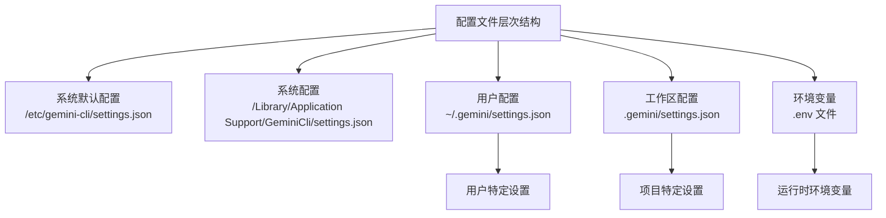
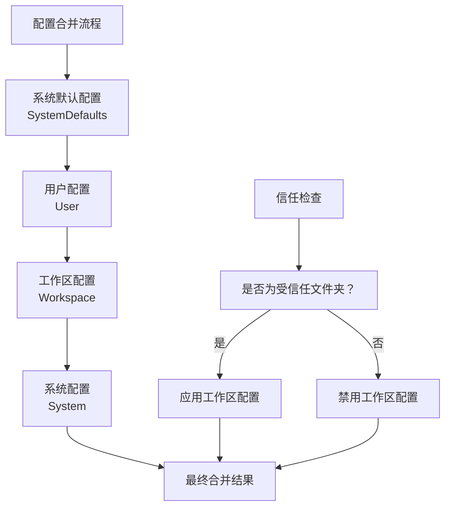
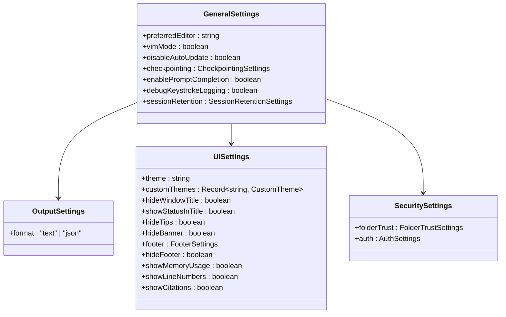
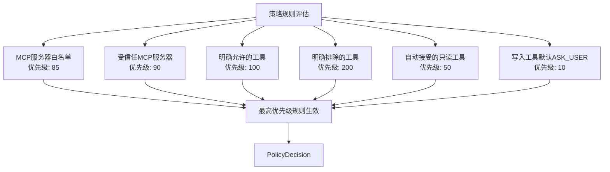
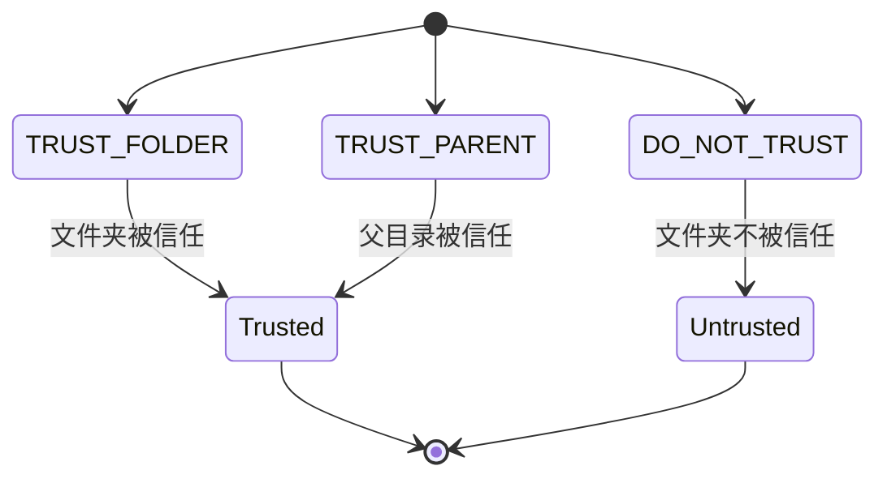
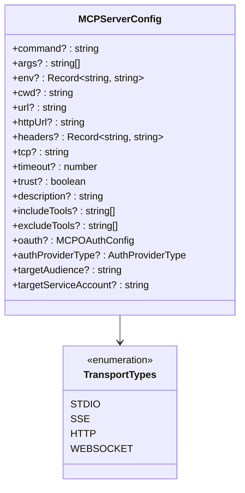
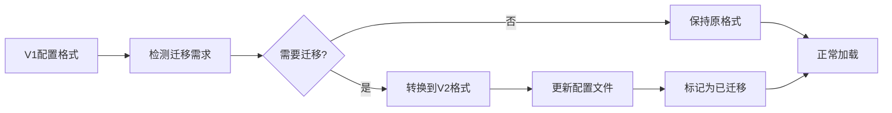

# 配置管理系统

<cite>
**本文档中引用的文件**
- [packages/cli/src/config/settings.ts](file://packages/cli/src/config/settings.ts)
- [packages/cli/src/config/settingsSchema.ts](file://packages/cli/src/config/settingsSchema.ts)
- [packages/cli/src/config/trustedFolders.ts](file://packages/cli/src/config/trustedFolders.ts)
- [packages/cli/src/config/policy.ts](file://packages/cli/src/config/policy.ts)
- [packages/core/src/config/config.ts](file://packages/core/src/config/config.ts)
- [packages/cli/src/commands/mcp/add.ts](file://packages/cli/src/commands/mcp/add.ts)
- [hello/gemini-extension.json](file://hello/gemini-extension.json)
</cite>

## 目录
1. [简介](#简介)
2. [配置文件结构](#配置文件结构)
3. [配置优先级和作用域](#配置优先级和作用域)
4. [核心配置选项](#核心配置选项)
5. [策略引擎配置](#策略引擎配置)
6. [信任文件夹管理](#信任文件夹管理)
7. [MCP服务器配置](#mcp服务器配置)
8. [配置迁移机制](#配置迁移机制)
9. [配置文件示例](#配置文件示例)
10. [故障排除指南](#故障排除指南)

## 简介

gemini-cli 的配置系统是一个强大而灵活的架构，支持多层级配置管理、策略引擎、信任文件夹控制以及 MCP（Model Context Protocol）服务器集成。该系统采用分层设计，允许用户在不同级别上自定义行为，同时确保安全性和一致性。

配置系统的核心特性包括：
- 多层级配置优先级（系统默认、用户设置、工作区设置）
- 动态配置迁移机制
- 基于策略的工具访问控制
- 完整的信任文件夹管理
- 支持环境变量和注释的 JSON 配置文件

## 配置文件结构

### 配置文件位置

gemini-cli 使用以下配置文件位置：



**图表来源**
- [packages/cli/src/config/settings.ts](file://packages/cli/src/config/settings.ts#L85-L110)

### 配置文件格式

配置文件采用 JSON 格式，支持注释和环境变量解析：

```typescript
interface SettingsFile {
  settings: Settings;
  originalSettings: Settings;
  path: string;
  rawJson?: string;
}
```

**章节来源**
- [packages/cli/src/config/settings.ts](file://packages/cli/src/config/settings.ts#L179-L185)

## 配置优先级和作用域

### 配置作用域层次

gemini-cli 支持四种配置作用域，按优先级降序排列：



**图表来源**
- [packages/cli/src/config/settings.ts](file://packages/cli/src/config/settings.ts#L380-L390)

### 配置加载过程

```typescript
export enum SettingScope {
  User = 'User',
  Workspace = 'Workspace',
  System = 'System',
  SystemDefaults = 'SystemDefaults',
}
```

**章节来源**
- [packages/cli/src/config/settings.ts](file://packages/cli/src/config/settings.ts#L112-L116)

## 核心配置选项

### 通用配置



**图表来源**
- [packages/cli/src/config/settingsSchema.ts](file://packages/cli/src/config/settingsSchema.ts#L85-L200)

### 模型配置

模型相关配置包括名称、压缩设置和会话限制：

```typescript
interface ModelSettings {
  name: string;
  chatCompression?: ChatCompressionSettings;
  maxSessionTurns?: number;
  skipNextSpeakerCheck?: boolean;
}
```

### 工具配置

工具配置支持细粒度的权限控制：

```typescript
interface ToolsSettings {
  allowed?: string[];
  exclude?: string[];
  autoAccept?: boolean;
  sandbox?: boolean;
  discoveryCommand?: string;
  callCommand?: string;
}
```

**章节来源**
- [packages/cli/src/config/settingsSchema.ts](file://packages/cli/src/config/settingsSchema.ts#L200-L400)

## 策略引擎配置

### 策略决策机制

gemini-cli 实现了基于优先级的策略引擎，用于控制工具访问权限：



**图表来源**
- [packages/cli/src/config/policy.ts](file://packages/cli/src/config/policy.ts#L40-L120)

### 策略规则类型

```typescript
interface PolicyRule {
  toolName: string;
  decision: PolicyDecision;
  priority: number;
}

enum PolicyDecision {
  ALLOW = 'allow',
  DENY = 'deny',
  ASK_USER = 'ask_user',
}
```

**章节来源**
- [packages/cli/src/config/policy.ts](file://packages/cli/src/config/policy.ts#L1-L184)

## 信任文件夹管理

### 信任级别

gemini-cli 支持三种信任级别：



**图表来源**
- [packages/cli/src/config/trustedFolders.ts](file://packages/cli/src/config/trustedFolders.ts#L25-L35)

### 信任文件夹配置

```typescript
interface TrustRule {
  path: string;
  trustLevel: TrustLevel;
}

enum TrustLevel {
  TRUST_FOLDER = 'TRUST_FOLDER',
  TRUST_PARENT = 'TRUST_PARENT',
  DO_NOT_TRUST = 'DO_NOT_TRUST',
}
```

**章节来源**
- [packages/cli/src/config/trustedFolders.ts](file://packages/cli/src/config/trustedFolders.ts#L1-L238)

## MCP服务器配置

### MCP服务器类型

gemini-cli 支持多种传输协议的 MCP 服务器：



**图表来源**
- [packages/core/src/config/config.ts](file://packages/core/src/config/config.ts#L150-L200)

### MCP服务器添加命令

```bash
# 添加标准输入输出传输的MCP服务器
gemini mcp add my-server npm:start --transport stdio

# 添加HTTP传输的MCP服务器
gemini mcp add api-server https://api.example.com --transport http

# 添加带有信任标志的MCP服务器
gemini mcp add trusted-server npm:start --trust
```

**章节来源**
- [packages/cli/src/commands/mcp/add.ts](file://packages/cli/src/commands/mcp/add.ts#L1-L233)

## 配置迁移机制

### 版本迁移系统

gemini-cli 实现了完整的配置版本迁移系统：



**图表来源**
- [packages/cli/src/config/settings.ts](file://packages/cli/src/config/settings.ts#L223-L267)

### 迁移映射表

```typescript
const MIGRATION_MAP: Record<string, string> = {
  accessibility: 'ui.accessibility',
  allowedTools: 'tools.allowed',
  allowMCPServers: 'mcp.allowed',
  autoAccept: 'tools.autoAccept',
  model: 'model.name',
  // ... 更多映射项
};
```

**章节来源**
- [packages/cli/src/config/settings.ts](file://packages/cli/src/config/settings.ts#L45-L80)

## 配置文件示例

### 基础配置示例

```json
{
  "// 注释": "基础配置示例",
  "model": "gemini-2.5-pro",
  "tools": {
    "allowed": ["read-file", "write-file"],
    "autoAccept": true
  },
  "ui": {
    "theme": "dark",
    "hideTips": false
  },
  "security": {
    "folderTrust": {
      "enabled": true
    }
  }
}
```

### 高级配置示例

```json
{
  "// 注释": "高级配置示例",
  "model": {
    "name": "gemini-2.5-pro",
    "chatCompression": {
      "contextPercentageThreshold": 0.5
    }
  },
  "tools": {
    "allowed": ["read-file", "write-file", "edit"],
    "exclude": ["shell"],
    "sandbox": true
  },
  "mcp": {
    "allowed": ["context7"],
    "excluded": ["dangerous-server"]
  },
  "mcpServers": {
    "context7": {
      "command": "node context-server.js",
      "headers": {
        "API_KEY": "your-api-key"
      },
      "trust": true
    }
  },
  "security": {
    "folderTrust": {
      "enabled": true
    }
  },
  "advanced": {
    "dnsResolutionOrder": "ipv4first",
    "excludedEnvVars": ["DEBUG", "SECRET"]
  }
}
```

### 扩展配置示例

```json
{
  "// 注释": "扩展配置示例",
  "extensions": {
    "enabled": ["my-extension"],
    "disabled": []
  },
  "experimental": {
    "extensionManagement": true
  },
  "context": {
    "fileName": "GEMINI.md",
    "includeDirectories": ["src", "lib"],
    "discoveryMaxDirs": 100
  },
  "privacy": {
    "usageStatisticsEnabled": false
  }
}
```

## 故障排除指南

### 常见配置问题

1. **配置文件语法错误**
   - 检查 JSON 语法
   - 确保没有尾随逗号
   - 验证字符串引号

2. **配置优先级问题**
   - 理解配置合并顺序
   - 检查信任状态
   - 验证作用域设置

3. **MCP服务器连接问题**
   - 检查传输协议配置
   - 验证端口和URL
   - 确认认证设置

### 调试配置加载

```bash
# 启用调试模式查看配置加载过程
DEBUG=gemini:* gemini --help

# 检查当前配置
gemini --config-debug

# 验证MCP服务器配置
gemini mcp list
```

### 配置验证工具

```typescript
// 配置验证函数示例
function validateSettings(settings: Settings): string[] {
  const errors: string[] = [];
  
  if (settings.tools?.allowed && settings.tools.exclude) {
    errors.push("不能同时指定 allowed 和 exclude");
  }
  
  if (settings.mcpServers) {
    for (const [name, server] of Object.entries(settings.mcpServers)) {
      if (server.trust && !server.headers?.API_KEY) {
        errors.push(`受信任的MCP服务器 ${name} 缺少API密钥`);
      }
    }
  }
  
  return errors;
}
```

**章节来源**
- [packages/cli/src/config/settings.ts](file://packages/cli/src/config/settings.ts#L385-L417)