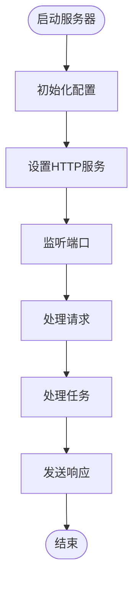

# 项目概述

<cite>
**本文档引用的文件**
- [README.md](file://README.md)
- [package.json](file://package.json)
- [ROADMAP.md](file://ROADMAP.md)
- [packages/cli/package.json](file://packages/cli/package.json)
- [packages/core/package.json](file://packages/core/package.json)
- [packages/a2a-server/package.json](file://packages/a2a-server/package.json)
- [packages/vscode-ide-companion/package.json](file://packages/vscode-ide-companion/package.json)
- [packages/cli/src/gemini.tsx](file://packages/cli/src/gemini.tsx)
- [packages/core/src/index.ts](file://packages/core/src/index.ts)
- [packages/a2a-server/src/index.ts](file://packages/a2a-server/src/index.ts)
- [packages/vscode-ide-companion/src/extension.ts](file://packages/vscode-ide-companion/src/extension.ts)
</cite>

## 目录
1. [简介](#简介)
2. [项目结构](#项目结构)
3. [核心组件](#核心组件)
4. [架构概述](#架构概述)
5. [详细组件分析](#详细组件分析)
6. [依赖分析](#依赖分析)
7. [性能考虑](#性能考虑)
8. [故障排除指南](#故障排除指南)
9. [结论](#结论)

## 简介
Gemini CLI 是一个开源的AI代理，旨在将Gemini模型的强大功能直接带入开发者的终端环境。该项目采用终端优先的设计理念，为开发者提供了一种轻量级、高效的AI交互方式，使其能够直接在命令行中与AI进行对话，执行代码理解、生成和自动化操作等任务。通过集成Gemini模型，Gemini CLI 能够帮助开发者查询和编辑大型代码库、生成新应用、调试问题，并通过内置工具和MCP（Model Context Protocol）支持实现自动化操作和自定义集成。

## 项目结构
gemini-cli 项目采用monorepo架构，包含多个核心包，每个包负责不同的功能模块。项目根目录下包含了主要的配置文件和文档，而核心功能则分布在 `packages` 目录下的各个子包中。这种结构化的组织方式使得项目易于维护和扩展。

**Diagram sources**
- [README.md](file://README.md)
- [package.json](file://package.json)
- [ROADMAP.md](file://ROADMAP.md)

**Section sources**
- [README.md](file://README.md)
- [package.json](file://package.json)
- [ROADMAP.md](file://ROADMAP.md)

## 核心组件
gemini-cli 项目的核心组件包括 `cli`、`core`、`a2a-server` 和 `vscode-ide-companion` 四个主要包。这些组件共同构成了项目的整体功能，每个组件都有其特定的职责和交互模式。

**Section sources**
- [packages/cli/package.json](file://packages/cli/package.json)
- [packages/core/package.json](file://packages/core/package.json)
- [packages/a2a-server/package.json](file://packages/a2a-server/package.json)
- [packages/vscode-ide-companion/package.json](file://packages/vscode-ide-companion/package.json)

## 架构概述
gemini-cli 项目的架构设计遵循模块化和分层原则，确保了各组件之间的松耦合和高内聚。`cli` 包作为用户交互的入口，负责处理命令行输入和输出；`core` 包提供了核心的AI功能和工具支持；`a2a-server` 包实现了A2A协议的服务器端功能，支持与不同IDE的集成；`vscode-ide-companion` 包则专门用于VS Code的集成，提供无缝的开发体验。

**Diagram sources**
- [packages/cli/package.json](file://packages/cli/package.json)
- [packages/core/package.json](file://packages/core/package.json)
- [packages/a2a-server/package.json](file://packages/a2a-server/package.json)
- [packages/vscode-ide-companion/package.json](file://packages/vscode-ide-companion/package.json)

## 详细组件分析

### CLI 组件分析
`cli` 包是gemini-cli项目的用户界面层，负责处理所有与用户的交互。它使用TypeScript构建，并依赖React和Ink库来渲染终端UI。`cli` 包通过调用 `core` 包提供的API来执行各种AI任务，如代码理解、生成和自动化操作。

#### 对象导向组件

**Diagram sources**
- [packages/cli/src/gemini.tsx](file://packages/cli/src/gemini.tsx)
- [packages/cli/src/ui/auth/AuthDialog.tsx](file://packages/cli/src/ui/auth/AuthDialog.tsx)
- [packages/cli/src/ui/components/views/McpStatus.tsx](file://packages/cli/src/ui/components/views/McpStatus.tsx)

**Section sources**
- [packages/cli/src/gemini.tsx](file://packages/cli/src/gemini.tsx)
- [packages/cli/src/ui/auth/AuthDialog.tsx](file://packages/cli/src/ui/auth/AuthDialog.tsx)
- [packages/cli/src/ui/components/views/McpStatus.tsx](file://packages/cli/src/ui/components/views/McpStatus.tsx)

### Core 组件分析
`core` 包是gemini-cli项目的核心逻辑层，提供了所有AI功能和工具支持。它包含了与Gemini模型交互的客户端、内容生成器、日志记录器等核心组件。`core` 包的设计旨在提供灵活的API，以便其他组件可以轻松地集成和使用这些功能。

#### API/服务组件

**Diagram sources**
- [packages/core/src/index.ts](file://packages/core/src/index.ts)

**Section sources**
- [packages/core/src/index.ts](file://packages/core/src/index.ts)

### A2A Server 组件分析
`a2a-server` 包实现了A2A协议的服务器端功能，支持与不同IDE的集成。它通过HTTP接口与客户端通信，提供了一种标准化的方式来进行AI代理的集成。`a2a-server` 包的设计遵循了A2A协议的规范，确保了与其他工具的兼容性。

#### 复杂逻辑组件

**Diagram sources**
- [packages/a2a-server/src/index.ts](file://packages/a2a-server/src/index.ts)

**Section sources**
- [packages/a2a-server/src/index.ts](file://packages/a2a-server/src/index.ts)

### VS Code Companion 组件分析
`vscode-ide-companion` 包专门用于VS Code的集成，提供了一种无缝的开发体验。它通过VS Code的扩展机制，将gemini-cli的功能直接集成到IDE中，使开发者可以在不离开编辑器的情况下使用AI功能。

#### 对象导向组件

**Diagram sources**
- [packages/vscode-ide-companion/src/extension.ts](file://packages/vscode-ide-companion/src/extension.ts)

**Section sources**
- [packages/vscode-ide-companion/src/extension.ts](file://packages/vscode-ide-companion/src/extension.ts)

## 依赖分析
gemini-cli 项目中的各个组件之间存在明确的依赖关系。`cli` 包依赖于 `core` 包提供的核心功能，`a2a-server` 和 `vscode-ide-companion` 包则依赖于 `core` 包和外部库来实现特定的集成功能。这种依赖关系确保了项目的模块化和可维护性。

**Diagram sources**
- [packages/cli/package.json](file://packages/cli/package.json)
- [packages/core/package.json](file://packages/core/package.json)
- [packages/a2a-server/package.json](file://packages/a2a-server/package.json)
- [packages/vscode-ide-companion/package.json](file://packages/vscode-ide-companion/package.json)

**Section sources**
- [packages/cli/package.json](file://packages/cli/package.json)
- [packages/core/package.json](file://packages/core/package.json)
- [packages/a2a-server/package.json](file://packages/a2a-server/package.json)
- [packages/vscode-ide-companion/package.json](file://packages/vscode-ide-companion/package.json)

## 性能考虑
gemini-cli 项目在设计时充分考虑了性能因素。通过使用高效的算法和数据结构，以及合理的缓存策略，项目能够在处理大规模代码库时保持良好的响应速度。此外，项目还支持非交互模式，允许在脚本中使用，进一步提高了自动化操作的效率。

## 故障排除指南
在使用gemini-cli时，可能会遇到一些常见问题，如认证失败、网络连接问题等。建议首先检查环境变量配置是否正确，确保网络连接正常。如果问题仍然存在，可以通过查看日志文件或使用 `/bug` 命令报告问题，以获得进一步的帮助。

**Section sources**
- [README.md](file://README.md)

## 结论
gemini-cli 项目通过其终端优先的设计理念和强大的AI功能，为开发者提供了一种全新的开发体验。通过集成Gemini模型，项目不仅能够帮助开发者提高工作效率，还能促进代码质量和创新。随着项目的不断发展和完善，gemini-cli 有望成为开发者工具生态系统中的重要组成部分。