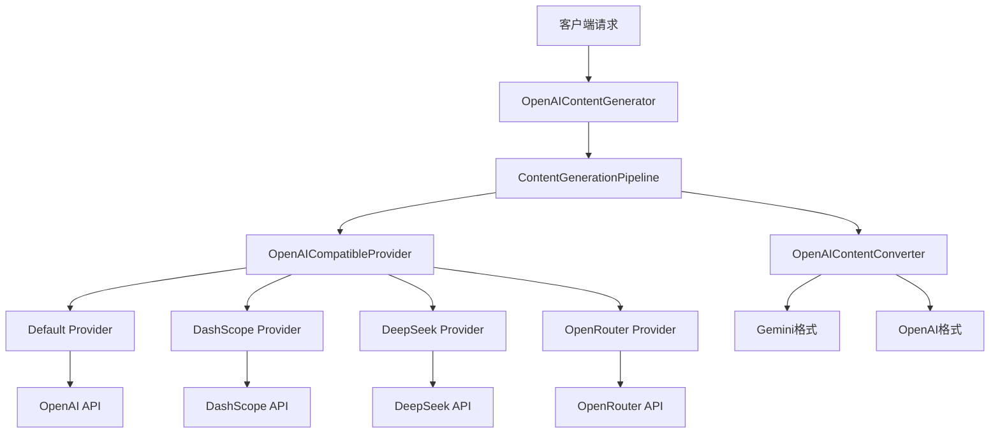
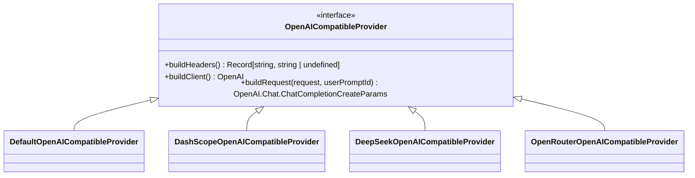
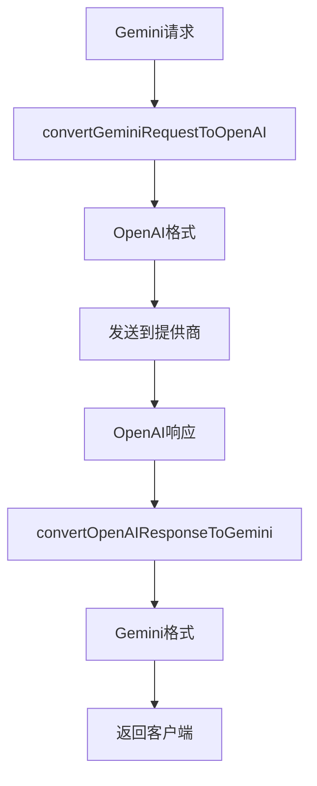
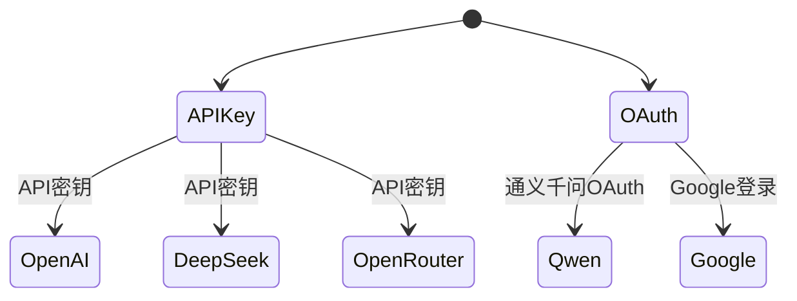
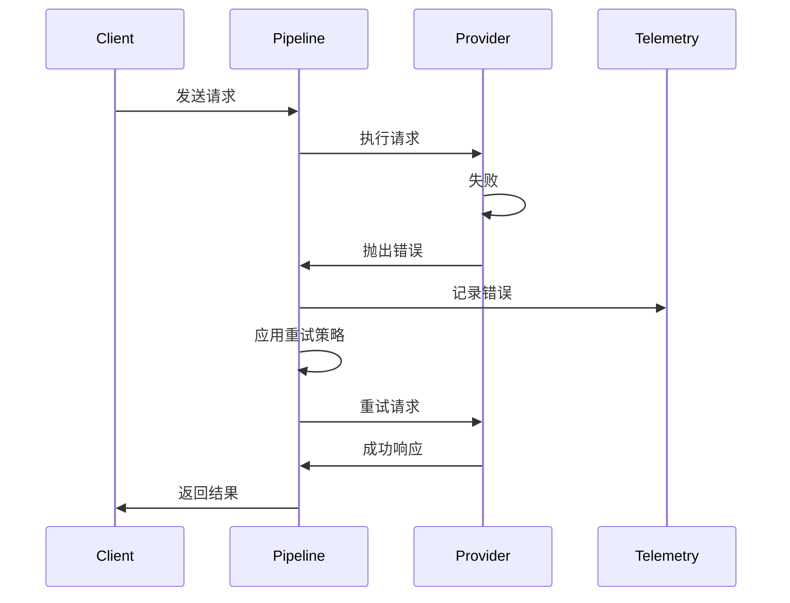
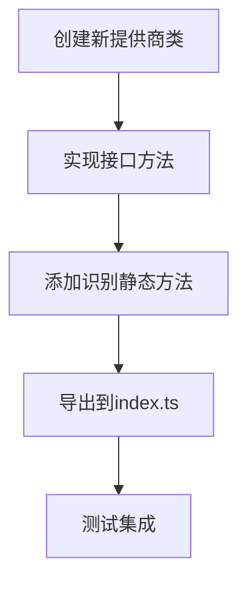

# AI模型提供商集成

<cite>
**本文档引用的文件**
- [index.ts](file://packages/core/src/core/openaiContentGenerator/index.ts)
- [provider/index.ts](file://packages/core/src/core/openaiContentGenerator/provider/index.ts)
- [types.ts](file://packages/core/src/core/openaiContentGenerator/provider/types.ts)
- [default.ts](file://packages/core/src/core/openaiContentGenerator/provider/default.ts)
- [dashscope.ts](file://packages/core/src/core/openaiContentGenerator/provider/dashscope.ts)
- [deepseek.ts](file://packages/core/src/core/openaiContentGenerator/provider/deepseek.ts)
- [openrouter.ts](file://packages/core/src/core/openaiContentGenerator/provider/openrouter.ts)
- [converter.ts](file://packages/core/src/core/openaiContentGenerator/converter.ts)
- [pipeline.ts](file://packages/core/src/core/openaiContentGenerator/pipeline.ts)
- [constants.ts](file://packages/core/src/core/openaiContentGenerator/constants.ts)
- [contentGenerator.ts](file://packages/core/src/core/contentGenerator.ts)
- [qwenContentGenerator.test.ts](file://packages/core/src/qwen/qwenContentGenerator.test.ts)
</cite>

## 目录
1. [简介](#简介)
2. [架构概述](#架构概述)
3. [核心组件分析](#核心组件分析)
4. [提供商实现细节](#提供商实现细节)
5. [请求转换机制](#请求转换机制)
6. [配置与认证](#配置与认证)
7. [错误处理与重试策略](#错误处理与重试策略)
8. [扩展新提供商](#扩展新提供商)

## 简介
本文档详细介绍了qwen-code如何与多种AI模型提供商进行集成。系统通过统一的内部请求格式与各提供商通信，并通过请求转换器（converter）将请求转换为各提供商特定的API格式。文档涵盖了对OpenAI兼容API、Google Gemini、通义千问（Qwen）、DeepSeek、OpenRouter等模型的支持机制。

## 架构概述



**图表来源**
- [index.ts](file://packages/core/src/core/openaiContentGenerator/index.ts)
- [pipeline.ts](file://packages/core/src/core/openaiContentGenerator/pipeline.ts)
- [provider/index.ts](file://packages/core/src/core/openaiContentGenerator/provider/index.ts)

## 核心组件分析

### 内容生成管道
系统使用ContentGenerationPipeline类来处理所有AI请求。该管道负责协调请求转换、提供商选择、错误处理和遥测记录。

**重要组件**
- **ContentGenerationPipeline**: 核心执行管道，处理所有请求
- **OpenAIContentConverter**: 在Gemini和OpenAI格式之间转换数据
- **OpenAICompatibleProvider**: 抽象接口，定义所有提供商的共同行为

**节来源**
- [pipeline.ts](file://packages/core/src/core/openaiContentGenerator/pipeline.ts)
- [converter.ts](file://packages/core/src/core/openaiContentGenerator/converter.ts)
- [types.ts](file://packages/core/src/core/openaiContentGenerator/provider/types.ts)

## 提供商实现细节

### 通用提供商接口
所有提供商都实现了OpenAICompatibleProvider接口，该接口定义了三个核心方法：



**图表来源**
- [types.ts](file://packages/core/src/core/openaiContentGenerator/provider/types.ts)
- [default.ts](file://packages/core/src/core/openaiContentGenerator/provider/default.ts)

### 默认提供商
DefaultOpenAICompatibleProvider为标准的OpenAI兼容API提供支持。

**功能特点**
- 使用User-Agent头标识客户端
- 支持自定义超时和重试次数
- 传递所有原始请求参数

**配置参数**
- `apiKey`: API密钥
- `baseUrl`: API基础URL
- `timeout`: 超时时间（默认120000毫秒）
- `maxRetries`: 最大重试次数（默认3次）

**节来源**
- [default.ts](file://packages/core/src/core/openaiContentGenerator/provider/default.ts)
- [constants.ts](file://packages/core/src/core/openaiContentGenerator/constants.ts)

### DashScope提供商
DashScopeOpenAICompatibleProvider为阿里云通义千问API提供特定支持。

**特殊功能**
- 添加DashScope特定的头部信息
- 支持缓存控制
- 处理视觉模型参数
- 添加会话元数据

**缓存控制策略**
- 系统消息启用缓存
- 最后一条历史消息启用缓存
- 工具调用消息启用缓存

**节来源**
- [dashscope.ts](file://packages/core/src/core/openaiContentGenerator/provider/dashscope.ts)

### DeepSeek提供商
DeepSeekOpenAICompatibleProvider为DeepSeek API提供支持。

**特殊处理**
- 将多部分消息内容合并为单个文本
- 验证所有内容部分都是文本类型
- 继承默认提供商的基本功能

**限制**
- 仅支持文本内容，不支持多模态输入

**节来源**
- [deepseek.ts](file://packages/core/src/core/openaiContentGenerator/provider/deepseek.ts)

### OpenRouter提供商
OpenRouterOpenAICompatibleProvider为OpenRouter API提供支持。

**特殊头部**
- `HTTP-Referer`: 标识来源
- `X-Title`: 应用标题

**识别机制**
- 通过URL中包含"openrouter.ai"来识别

**节来源**
- [openrouter.ts](file://packages/core/src/core/openaiContentGenerator/provider/openrouter.ts)

## 请求转换机制

### 转换流程
系统使用OpenAIContentConverter类在Gemini和OpenAI格式之间进行转换。



**图表来源**
- [converter.ts](file://packages/core/src/core/openaiContentGenerator/converter.ts)

### 工具调用转换
系统支持将Gemini工具转换为OpenAI格式。

**转换规则**
- 函数声明转换为OpenAI函数格式
- 参数模式转换为JSON Schema
- 数值约束类型转换

**节来源**
- [converter.ts](file://packages/core/src/core/openaiContentGenerator/converter.ts)

## 配置与认证

### 认证方式
系统支持多种认证方式：



**图表来源**
- [contentGenerator.ts](file://packages/core/src/core/contentGenerator.ts)

### 配置参数
通过环境变量和配置文件设置参数：

**通用配置**
- `model`: 模型名称
- `apiKey`: API密钥
- `baseUrl`: API基础URL
- `timeout`: 超时时间
- `maxRetries`: 最大重试次数

**采样参数**
- `temperature`: 温度
- `top_p`: 核采样
- `top_k`: 顶部K
- `max_tokens`: 最大令牌数

**节来源**
- [contentGenerator.ts](file://packages/core/src/core/contentGenerator.ts)

## 错误处理与重试策略

### 错误处理流程
系统实现了统一的错误处理机制。



**图表来源**
- [pipeline.ts](file://packages/core/src/core/openaiContentGenerator/pipeline.ts)

### 重试策略
- 默认最大重试次数：3次
- 可通过配置自定义重试次数
- 包含超时和网络错误的重试

**节来源**
- [pipeline.ts](file://packages/core/src/core/openaiContentGenerator/pipeline.ts)
- [constants.ts](file://packages/core/src/core/openaiContentGenerator/constants.ts)

## 扩展新提供商

### 实现新提供商
要添加新的AI模型提供商，需要实现以下步骤：

1. 创建新的提供商类
2. 实现OpenAICompatibleProvider接口
3. 添加识别逻辑
4. 注册到工厂模式



**示例代码结构**
```typescript
export class NewProviderOpenAICompatibleProvider 
  implements OpenAICompatibleProvider {
  
  static isNewProviderProvider(
    contentGeneratorConfig: ContentGeneratorConfig,
  ): boolean {
    // 识别逻辑
    return true;
  }
  
  buildHeaders(): Record<string, string | undefined> {
    // 构建头部
  }
  
  buildClient(): OpenAI {
    // 创建客户端
  }
  
  buildRequest(
    request: OpenAI.Chat.ChatCompletionCreateParams,
    userPromptId: string,
  ): OpenAI.Chat.ChatCompletionCreateParams {
    // 转换请求
  }
}
```

**节来源**
- [provider/README.md](file://packages/core/src/core/openaiContentGenerator/provider/README.md)
- [types.ts](file://packages/core/src/core/openaiContentGenerator/provider/types.ts)