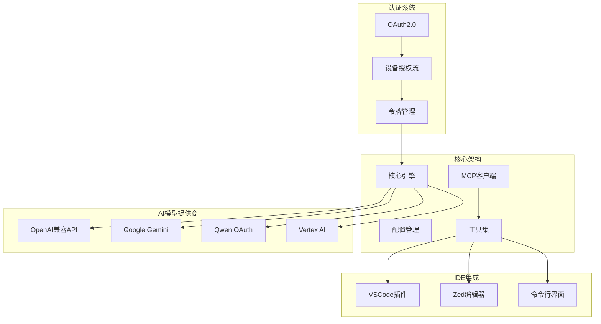
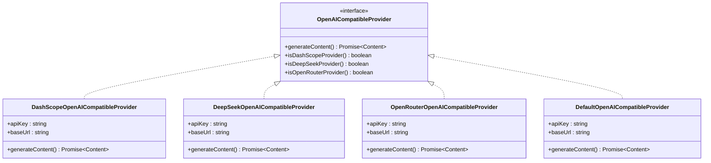
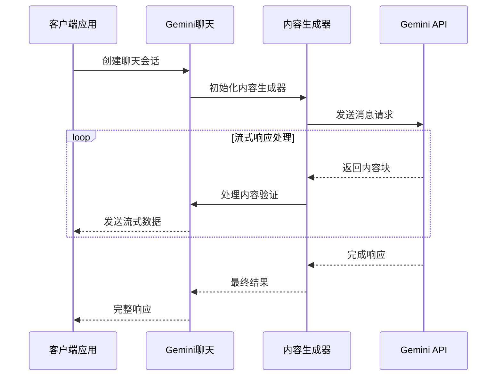
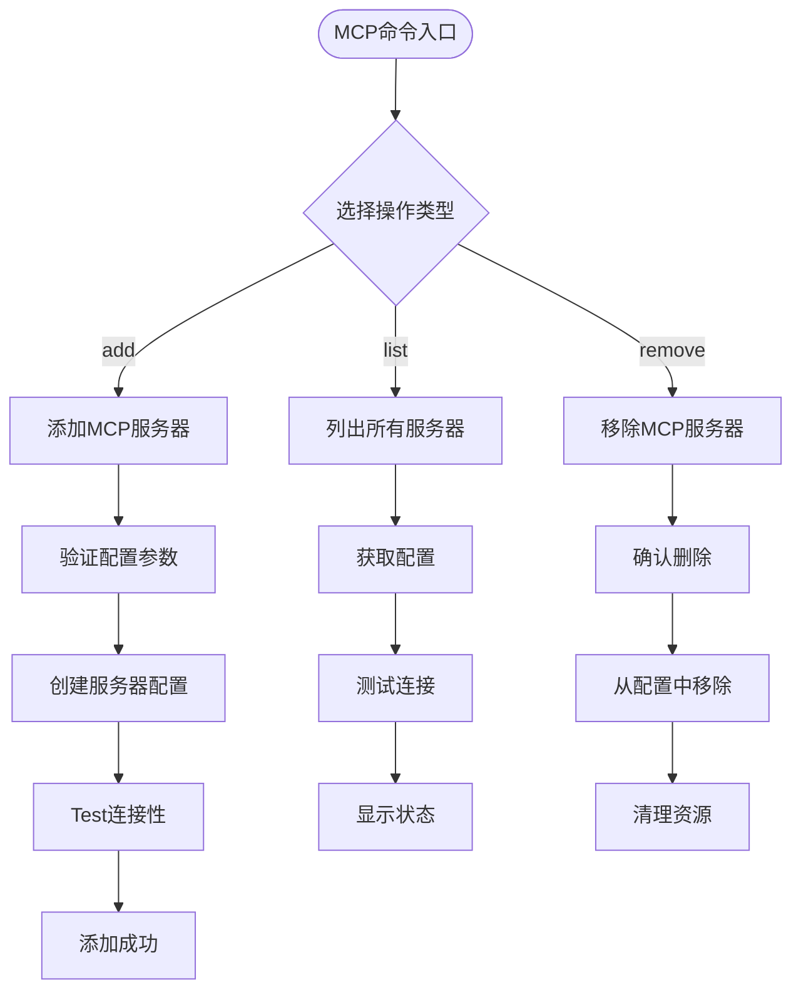
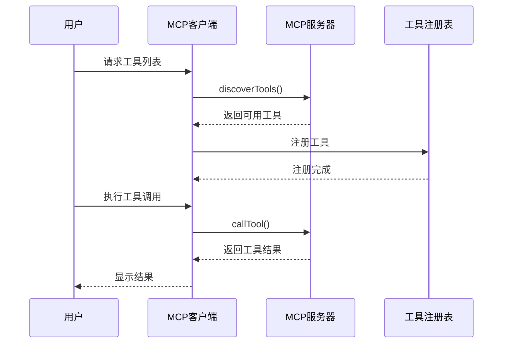
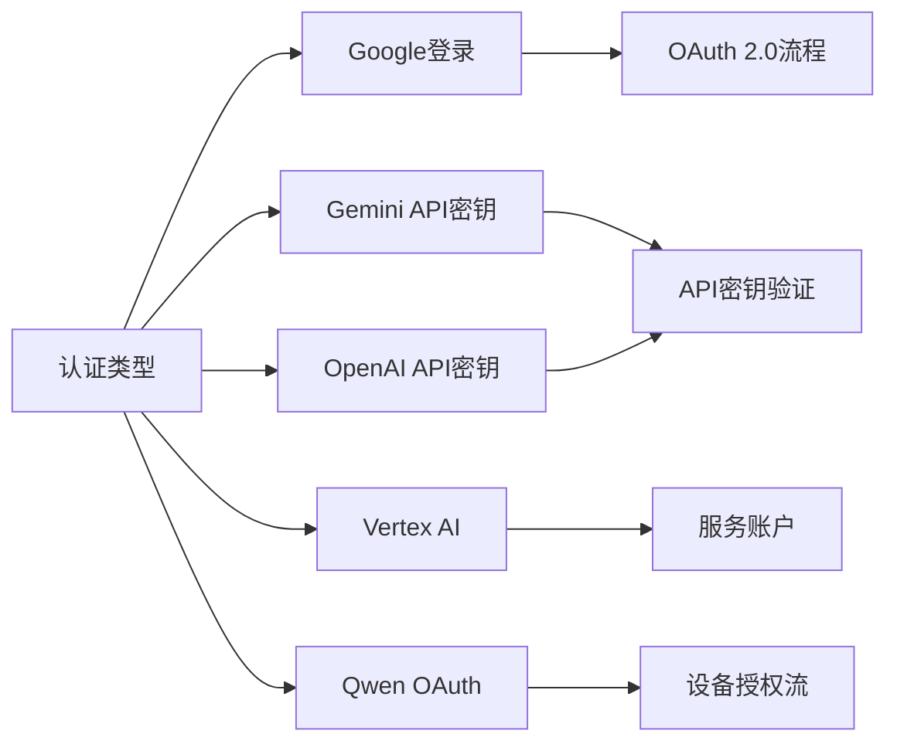
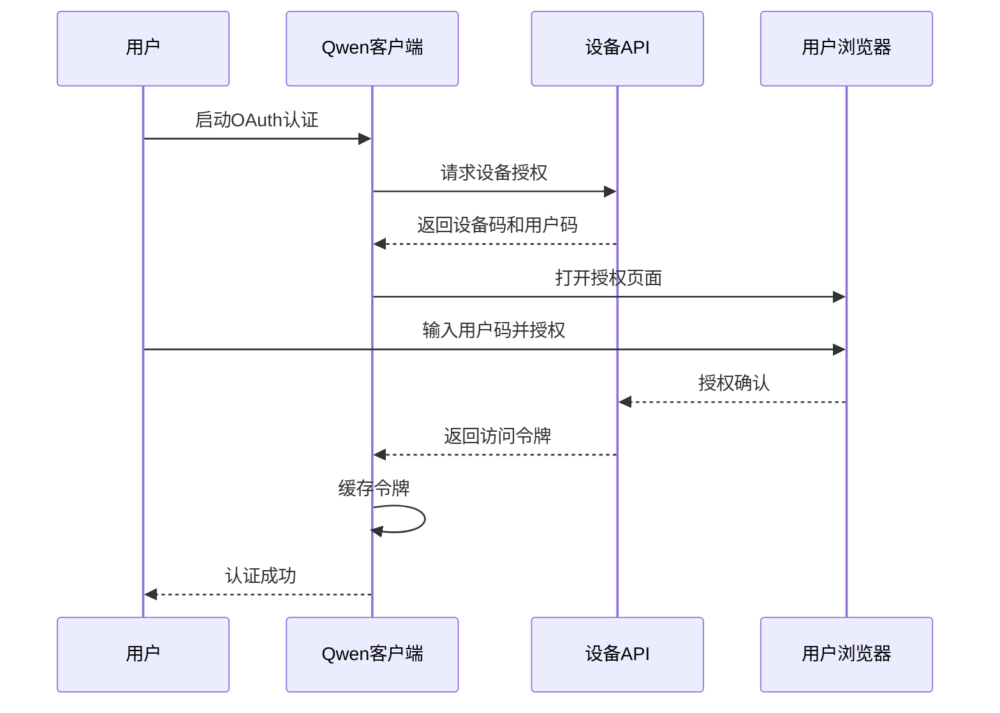
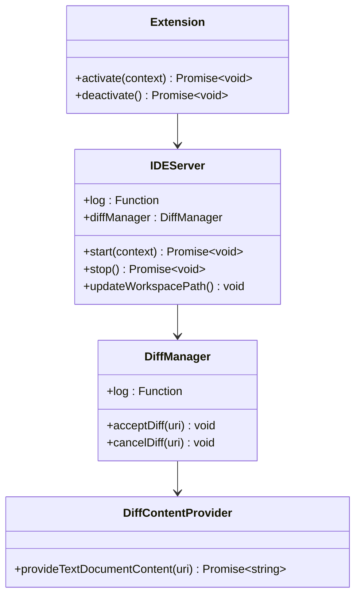
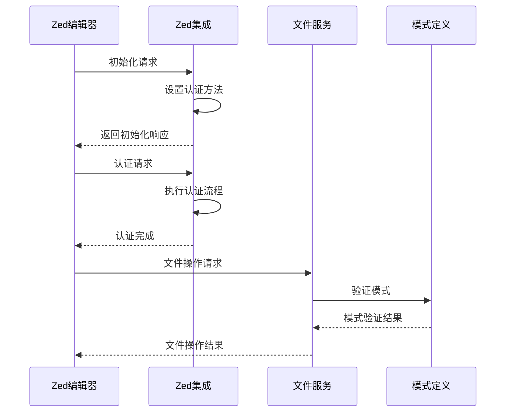
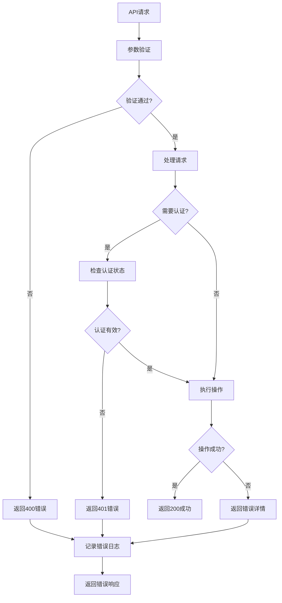

# API与集成

<cite>
**本文档中引用的文件**
- [packages/core/src/core/openaiContentGenerator/index.ts](file://packages/core/src/core/openaiContentGenerator/index.ts)
- [packages/core/src/core/geminiChat.ts](file://packages/core/src/core/geminiChat.ts)
- [packages/cli/src/commands/mcp/add.ts](file://packages/cli/src/commands/mcp/add.ts)
- [packages/cli/src/commands/mcp/list.ts](file://packages/cli/src/commands/mcp/list.ts)
- [packages/core/src/tools/mcp-client.ts](file://packages/core/src/tools/mcp-client.ts)
- [packages/core/src/tools/mcp-tool.ts](file://packages/core/src/tools/mcp-tool.ts)
- [packages/core/src/code_assist/oauth2.ts](file://packages/core/src/code_assist/oauth2.ts)
- [packages/core/src/qwen/qwenOAuth2.ts](file://packages/core/src/qwen/qwenOAuth2.ts)
- [packages/vscode-ide-companion/src/extension.ts](file://packages/vscode-ide-companion/src/extension.ts)
- [packages/core/src/config/config.ts](file://packages/core/src/config/config.ts)
- [packages/cli/src/zed-integration/zedIntegration.ts](file://packages/cli/src/zed-integration/zedIntegration.ts)
- [integration-tests/ide-client.test.ts](file://integration-tests/ide-client.test.ts)
</cite>

## 目录
1. [简介](#简介)
2. [项目架构概览](#项目架构概览)
3. [AI模型提供商集成](#ai模型提供商集成)
4. [MCP服务器集成](#mcp服务器集成)
5. [OAuth认证系统](#oauth认证系统)
6. [VSCode IDE集成](#vscode-ide集成)
7. [Zed编辑器集成](#zed编辑器集成)
8. [RESTful API端点](#restful-api端点)
9. [客户端集成示例](#客户端集成示例)
10. [最佳实践](#最佳实践)
11. [故障排除指南](#故障排除指南)
12. [结论](#结论)

## 简介

qwen-code是一个功能强大的AI代码助手，提供了丰富的外部接口和集成能力。本文档全面介绍了qwen-code的API与集成特性，包括与各种AI模型提供商的集成、MCP（Model Context Protocol）服务器的管理、OAuth认证流程，以及与主流IDE的深度集成。

该系统支持多种AI模型提供商，包括OpenAI兼容API、Google Gemini、Qwen等，并通过标准化的接口提供统一的访问体验。同时，它还实现了完整的MCP协议支持，允许用户轻松添加、管理和使用第三方AI服务。

## 项目架构概览

qwen-code采用模块化架构设计，主要分为以下几个核心组件：



**图表来源**
- [packages/core/src/core/openaiContentGenerator/index.ts](file://packages/core/src/core/openaiContentGenerator/index.ts#L1-L93)
- [packages/core/src/config/config.ts](file://packages/core/src/config/config.ts#L1-L100)

## AI模型提供商集成

### OpenAI兼容API集成

qwen-code支持多种OpenAI兼容的API提供商，包括DashScope、DeepSeek、OpenRouter等：



**图表来源**
- [packages/core/src/core/openaiContentGenerator/index.ts](file://packages/core/src/core/openaiContentGenerator/index.ts#L15-L45)

### Google Gemini集成

Gemini集成提供了完整的对话式AI交互体验：



**图表来源**
- [packages/core/src/core/geminiChat.ts](file://packages/core/src/core/geminiChat.ts#L1-L100)

**章节来源**
- [packages/core/src/core/geminiChat.ts](file://packages/core/src/core/geminiChat.ts#L1-L199)
- [packages/core/src/core/openaiContentGenerator/index.ts](file://packages/core/src/core/openaiContentGenerator/index.ts#L1-L93)

## MCP服务器集成

Model Context Protocol (MCP) 是一个标准化协议，用于在AI应用程序和外部服务之间建立连接。qwen-code提供了完整的MCP服务器管理功能。

### MCP服务器管理命令

系统提供了三个主要的MCP服务器管理命令：



**图表来源**
- [packages/cli/src/commands/mcp/add.ts](file://packages/cli/src/commands/mcp/add.ts#L1-L54)
- [packages/cli/src/commands/mcp/list.ts](file://packages/cli/src/commands/mcp/list.ts#L1-L137)

### MCP服务器配置结构

每个MCP服务器都有详细的配置选项：

```typescript
interface MCPServerConfig {
  // 标准传输方式
  command?: string;           // 命令行启动
  args?: string[];           // 命令行参数
  env?: Record<string, string>; // 环境变量
  cwd?: string;             // 工作目录
  
  // SSE传输方式
  url?: string;             // SSE URL
  
  // HTTP流传输方式
  httpUrl?: string;         // HTTP流URL
  headers?: Record<string, string>; // 请求头
  
  // WebSocket传输方式
  tcp?: string;             // TCP地址
  
  // 通用配置
  timeout?: number;         // 超时时间
  trust?: boolean;          // 是否信任
  description?: string;     // 描述
  includeTools?: string[];  // 包含的工具
  excludeTools?: string[];  // 排除的工具
  oauth?: MCPOAuthConfig;   // OAuth配置
  authProviderType?: AuthProviderType; // 认证提供者类型
}
```

### MCP工具发现与执行

MCP工具的发现和执行过程：



**图表来源**
- [packages/core/src/tools/mcp-client.ts](file://packages/core/src/tools/mcp-client.ts#L62-L107)
- [packages/core/src/tools/mcp-tool.ts](file://packages/core/src/tools/mcp-tool.ts#L1-L371)

**章节来源**
- [packages/cli/src/commands/mcp/add.ts](file://packages/cli/src/commands/mcp/add.ts#L1-L54)
- [packages/cli/src/commands/mcp/list.ts](file://packages/cli/src/commands/mcp/list.ts#L1-L137)
- [packages/core/src/tools/mcp-client.ts](file://packages/core/src/tools/mcp-client.ts#L62-L107)
- [packages/core/src/tools/mcp-tool.ts](file://packages/core/src/tools/mcp-tool.ts#L1-L371)

## OAuth认证系统

qwen-code实现了完整的OAuth 2.0认证系统，支持多种认证方式。

### 支持的认证类型

系统支持以下认证类型：



**图表来源**
- [packages/cli/src/zed-integration/zedIntegration.ts](file://packages/cli/src/zed-integration/zedIntegration.ts#L78-L128)

### Qwen OAuth认证流程

Qwen OAuth使用设备授权流，提供安全的用户认证体验：



**图表来源**
- [packages/core/src/qwen/qwenOAuth2.ts](file://packages/core/src/qwen/qwenOAuth2.ts#L1-L799)

### OAuth认证配置

OAuth认证的核心配置包括：

```typescript
interface QwenOAuth2Client {
  setCredentials(credentials: QwenCredentials): void;
  getCredentials(): QwenCredentials;
  getAccessToken(): Promise<{ token?: string }>;
  requestDeviceAuthorization(options: DeviceAuthOptions): Promise<DeviceAuthResponse>;
  pollDeviceToken(options: PollOptions): Promise<TokenResponse>;
  refreshAccessToken(): Promise<TokenRefreshResponse>;
}

interface QwenCredentials {
  access_token?: string;
  refresh_token?: string;
  id_token?: string;
  expiry_date?: number;
  token_type?: string;
  resource_url?: string;
}
```

**章节来源**
- [packages/core/src/code_assist/oauth2.ts](file://packages/core/src/code_assist/oauth2.ts#L1-L457)
- [packages/core/src/qwen/qwenOAuth2.ts](file://packages/core/src/qwen/qwenOAuth2.ts#L1-L799)

## VSCode IDE集成

qwen-code提供了完整的VSCode插件支持，实现双向通信和功能扩展。

### VSCode扩展架构



**图表来源**
- [packages/vscode-ide-companion/src/extension.ts](file://packages/vscode-ide-companion/src/extension.ts#L1-L124)

### VSCode集成功能

VSCode插件提供了以下核心功能：

1. **终端集成**：自动创建和管理Qwen Code终端
2. **差异管理**：支持文件差异的接受和取消
3. **工作区感知**：自动检测和更新工作区路径
4. **命令注册**：提供多个命令入口点

```typescript
// VSCode命令注册示例
context.subscriptions.push(
  vscode.commands.registerCommand('qwen-code.runQwenCode', async () => {
    const workspaceFolders = vscode.workspace.workspaceFolders;
    if (!workspaceFolders || workspaceFolders.length === 0) {
      vscode.window.showInformationMessage(
        'No folder open. Please open a folder to run Qwen Code.',
      );
      return;
    }
    
    // 选择工作区文件夹
    let selectedFolder = await vscode.window.showWorkspaceFolderPick({
      placeHolder: 'Select a folder to run Qwen Code in',
    });
    
    if (selectedFolder) {
      const terminal = vscode.window.createTerminal({
        name: `Qwen Code (${selectedFolder.name})`,
        cwd: selectedFolder.uri.fsPath,
      });
      terminal.show();
      terminal.sendText('qwen');
    }
  })
);
```

**章节来源**
- [packages/vscode-ide-companion/src/extension.ts](file://packages/vscode-ide-companion/src/extension.ts#L1-L124)

## Zed编辑器集成

qwen-code还支持Zed编辑器的集成，通过ACPI（Alibaba Cloud Programming Interface）协议实现。

### Zed集成架构



**图表来源**
- [packages/cli/src/zed-integration/zedIntegration.ts](file://packages/cli/src/zed-integration/zedIntegration.ts#L78-L128)

**章节来源**
- [packages/cli/src/zed-integration/zedIntegration.ts](file://packages/cli/src/zed-integration/zedIntegration.ts#L78-L128)

## RESTful API端点

虽然qwen-code主要是一个命令行工具，但它也提供了标准的RESTful API接口用于集成。

### API端点规范

以下是主要的API端点：

| 端点 | 方法 | 描述 | 认证 |
|------|------|------|------|
| `/api/chat` | POST | 发送聊天消息 | OAuth 2.0 |
| `/api/mcp/servers` | GET | 获取MCP服务器列表 | OAuth 2.0 |
| `/api/mcp/servers` | POST | 添加新的MCP服务器 | OAuth 2.0 |
| `/api/mcp/servers/{id}` | DELETE | 删除MCP服务器 | OAuth 2.0 |
| `/api/auth` | POST | 执行OAuth认证 | OAuth 2.0 |

### 请求/响应格式

#### 聊天请求格式

```json
{
  "messages": [
    {
      "role": "user",
      "content": "请帮我编写一个Python函数"
    }
  ],
  "model": "qwen-2.5-coder",
  "temperature": 0.7,
  "max_tokens": 1000
}
```

#### MCP服务器配置格式

```json
{
  "name": "my-server",
  "command": "/path/to/server",
  "args": ["--port", "8080"],
  "timeout": 30000,
  "trust": false,
  "description": "自定义MCP服务器"
}
```

### 错误处理策略

系统实现了统一的错误处理机制：



## 客户端集成示例

### JavaScript客户端示例

```javascript
class QwenApiClient {
  constructor(baseUrl, accessToken) {
    this.baseUrl = baseUrl;
    this.accessToken = accessToken;
  }
  
  async sendMessage(message, model = 'qwen-2.5-coder') {
    const response = await fetch(`${this.baseUrl}/api/chat`, {
      method: 'POST',
      headers: {
        'Content-Type': 'application/json',
        'Authorization': `Bearer ${this.accessToken}`
      },
      body: JSON.stringify({
        messages: [{ role: 'user', content: message }],
        model: model,
        temperature: 0.7
      })
    });
    
    if (!response.ok) {
      throw new Error(`API error: ${response.status}`);
    }
    
    return await response.json();
  }
  
  async addMcpServer(config) {
    const response = await fetch(`${this.baseUrl}/api/mcp/servers`, {
      method: 'POST',
      headers: {
        'Content-Type': 'application/json',
        'Authorization': `Bearer ${this.accessToken}`
      },
      body: JSON.stringify(config)
    });
    
    if (!response.ok) {
      throw new Error(`Failed to add MCP server: ${response.status}`);
    }
    
    return await response.json();
  }
}
```

### Python客户端示例

```python
import requests
from typing import Dict, List, Optional

class QwenAPIClient:
    def __init__(self, base_url: str, access_token: str):
        self.base_url = base_url.rstrip('/')
        self.headers = {
            'Authorization': f'Bearer {access_token}',
            'Content-Type': 'application/json'
        }
    
    def chat(self, message: str, model: str = 'qwen-2.5-coder') -> Dict:
        """发送聊天消息"""
        payload = {
            'messages': [{'role': 'user', content: message}],
            'model': model,
            'temperature': 0.7
        }
        
        response = requests.post(
            f'{self.base_url}/api/chat',
            headers=self.headers,
            json=payload
        )
        
        response.raise_for_status()
        return response.json()
    
    def list_mcp_servers(self) -> List[Dict]:
        """获取MCP服务器列表"""
        response = requests.get(
            f'{self.base_url}/api/mcp/servers',
            headers=self.headers
        )
        
        response.raise_for_status()
        return response.json()
    
    def add_mcp_server(self, config: Dict) -> Dict:
        """添加MCP服务器"""
        response = requests.post(
            f'{self.base_url}/api/mcp/servers',
            headers=self.headers,
            json=config
        )
        
        response.raise_for_status()
        return response.json()
```

### curl命令示例

```bash
# 发送聊天消息
curl -X POST "https://api.qwen.ai/v1/chat" \
  -H "Authorization: Bearer YOUR_ACCESS_TOKEN" \
  -H "Content-Type: application/json" \
  -d '{
    "messages": [{"role": "user", "content": "Hello, world!"}],
    "model": "qwen-2.5-coder",
    "temperature": 0.7
  }'

# 添加MCP服务器
curl -X POST "https://api.qwen.ai/v1/mcp/servers" \
  -H "Authorization: Bearer YOUR_ACCESS_TOKEN" \
  -H "Content-Type: application/json" \
  -d '{
    "name": "my-server",
    "command": "/usr/local/bin/my-mcp-server",
    "args": ["--port", "8080"],
    "timeout": 30000
  }'

# 列出MCP服务器
curl -X GET "https://api.qwen.ai/v1/mcp/servers" \
  -H "Authorization: Bearer YOUR_ACCESS_TOKEN"
```

## 最佳实践

### 1. 认证管理

- 使用环境变量存储敏感的认证信息
- 实现令牌刷新机制以保持长期连接
- 在生产环境中使用HTTPS进行所有API通信

```javascript
// 推荐的认证管理
class AuthManager {
  constructor() {
    this.accessToken = process.env.QWEN_ACCESS_TOKEN;
    this.refreshToken = process.env.QWEN_REFRESH_TOKEN;
    this.expiryDate = parseInt(process.env.QWEN_EXPIRY_DATE);
  }
  
  async refreshTokenIfNeeded() {
    if (Date.now() >= this.expiryDate - 300000) { // 5分钟缓冲
      await this.refreshAccessToken();
    }
  }
}
```

### 2. 错误处理

- 实现指数退避重试机制
- 区分可恢复和不可恢复的错误
- 记录详细的错误日志以便调试

```javascript
// 推荐的错误处理
async function apiCallWithRetry(endpoint, options, maxRetries = 3) {
  let lastError;
  
  for (let i = 0; i <= maxRetries; i++) {
    try {
      const response = await fetch(endpoint, options);
      
      if (response.status === 429) {
        // 速率限制，等待后重试
        const retryAfter = response.headers.get('Retry-After');
        await new Promise(resolve => 
          setTimeout(resolve, retryAfter * 1000)
        );
        continue;
      }
      
      if (!response.ok) {
        throw new Error(`API error: ${response.status}`);
      }
      
      return response.json();
    } catch (error) {
      lastError = error;
      
      if (i === maxRetries) {
        throw error;
      }
      
      // 指数退避
      await new Promise(resolve => 
        setTimeout(resolve, Math.pow(2, i) * 1000)
      );
    }
  }
}
```

### 3. 性能优化

- 实现请求缓存机制
- 使用连接池减少连接开销
- 合理设置超时时间

```javascript
// 推荐的性能优化
class APIClient {
  constructor() {
    this.cache = new Map();
    this.connectionPool = new Pool({
      min: 2,
      max: 10
    });
  }
  
  async getCachedResponse(endpoint, options) {
    const cacheKey = `${endpoint}:${JSON.stringify(options)}`;
    
    if (this.cache.has(cacheKey)) {
      return this.cache.get(cacheKey);
    }
    
    const response = await this.makeRequest(endpoint, options);
    this.cache.set(cacheKey, response);
    
    return response;
  }
}
```

### 4. 安全考虑

- 验证所有输入参数
- 使用CSRF令牌防止跨站请求伪造
- 实施适当的访问控制

```javascript
// 推荐的安全措施
class SecureAPIClient {
  constructor() {
    this.csrfToken = null;
  }
  
  async makeSecureRequest(endpoint, options) {
    const headers = {
      ...options.headers,
      'X-CSRF-Token': await this.getCSRFToken()
    };
    
    // 验证输入参数
    this.validateInput(options.body);
    
    return await fetch(endpoint, { ...options, headers });
  }
  
  validateInput(input) {
    // 实现输入验证逻辑
    if (typeof input !== 'object') {
      throw new Error('Invalid input type');
    }
    
    // 防止XSS攻击
    if (input.content && input.content.includes('<script>')) {
      throw new Error('Potential XSS attack detected');
    }
  }
}
```

## 故障排除指南

### 常见问题及解决方案

#### 1. 认证失败

**问题症状**：
- 返回401未授权错误
- 无法连接到API服务

**可能原因**：
- 令牌过期或无效
- 网络代理配置错误
- API密钥配置错误

**解决方案**：
```bash
# 检查当前认证状态
qwen auth status

# 重新认证
qwen auth

# 检查网络代理设置
echo $HTTP_PROXY
echo $HTTPS_PROXY
```

#### 2. MCP服务器连接失败

**问题症状**：
- MCP服务器无法连接
- 工具调用失败

**诊断步骤**：
```bash
# 检查MCP服务器配置
qwen mcp list

# 测试特定服务器连接
qwen mcp test my-server

# 查看详细日志
qwen --debug mcp list
```

#### 3. API速率限制

**问题症状**：
- 返回429错误
- 请求被拒绝

**解决方案**：
- 实现指数退避重试
- 减少并发请求数量
- 使用批量操作替代单个请求

#### 4. VSCode集成问题

**问题症状**：
- 插件无法加载
- 功能不正常

**解决方案**：
```bash
# 重启VSCode
# 清除插件缓存
rm -rf ~/.vscode/extensions/qwen-code*

# 重新安装插件
code --install-extension qwen-code
```

### 调试技巧

#### 启用详细日志

```bash
# 启用调试模式
QWEN_DEBUG=true qwen --verbose chat "Hello"

# 查看网络请求日志
QWEN_LOG_LEVEL=debug qwen mcp list

# 导出日志到文件
qwen --log-file=qwen.log chat "Hello"
```

#### 网络诊断

```bash
# 检查网络连通性
ping api.qwen.ai

# 测试端口连通性
telnet api.qwen.ai 443

# 检查DNS解析
nslookup api.qwen.ai

# 测试SSL证书
openssl s_client -connect api.qwen.ai:443 -servername api.qwen.ai
```

**章节来源**
- [integration-tests/ide-client.test.ts](file://integration-tests/ide-client.test.ts#L1-L202)

## 结论

qwen-code提供了一个功能强大且灵活的API与集成框架，支持多种AI模型提供商、MCP服务器集成、OAuth认证以及主流IDE的深度集成。通过本文档提供的详细说明和示例，开发者可以轻松地将qwen-code集成到自己的应用程序和服务中。

关键特性总结：

1. **多模型支持**：统一的接口支持OpenAI、Gemini、Qwen等多种AI模型
2. **MCP协议**：完整的MCP服务器管理功能，支持动态工具发现和执行
3. **OAuth认证**：安全的OAuth 2.0认证流程，支持多种认证方式
4. **IDE集成**：完整的VSCode和Zed编辑器插件支持
5. **RESTful API**：标准化的RESTful API接口，便于客户端集成
6. **最佳实践**：完善的错误处理、性能优化和安全考虑

通过遵循本文档中的最佳实践和故障排除指南，开发者可以构建稳定、高效且安全的qwen-code集成解决方案。